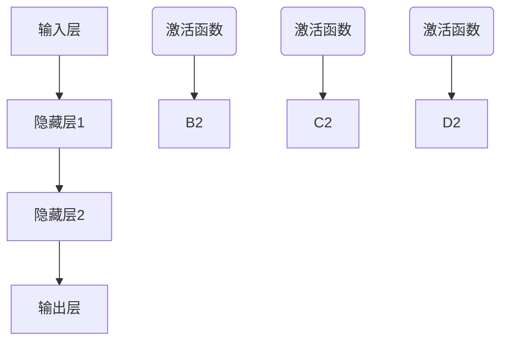

                 

# 神经网络：人类智慧的解放

> 关键词：神经网络，深度学习，机器学习，人工智能，反向传播算法，神经网络架构

> 摘要：本文将深入探讨神经网络这一革命性的技术，从其历史背景、核心概念到具体实现和未来发展趋势。通过一步一步的解析，我们将揭示神经网络如何模拟人类大脑的工作机制，解放人类智慧，开启人工智能的新纪元。

## 1. 背景介绍

### 1.1 目的和范围

本文的目的是为读者提供一个全面且深入的了解，探讨神经网络作为人工智能核心技术的地位和作用。文章将涵盖以下范围：

1. **神经网络的历史背景**：介绍神经网络的发展历程，从最初的简单模型到现代深度学习。
2. **核心概念与联系**：解释神经网络的基本组成部分，如神经元、层次结构、激活函数等。
3. **核心算法原理**：详细阐述反向传播算法的工作原理和实现步骤。
4. **数学模型和公式**：分析神经网络中的关键数学公式，包括损失函数、优化算法等。
5. **项目实战**：通过实际代码案例，展示神经网络的开发与应用。
6. **实际应用场景**：探讨神经网络在各个领域的应用实例。
7. **工具和资源推荐**：推荐学习资源和开发工具，帮助读者进一步深入了解神经网络。
8. **未来发展趋势与挑战**：展望神经网络技术的发展趋势和面临的挑战。

### 1.2 预期读者

本文适合以下读者群体：

1. 对人工智能和机器学习感兴趣的技术爱好者。
2. 想要了解神经网络基本原理的程序员和软件工程师。
3. 数据科学家和机器学习研究者。
4. 对深度学习技术有深入研究的学者和专家。

### 1.3 文档结构概述

本文结构如下：

1. **背景介绍**：介绍文章的目的、范围和预期读者。
2. **核心概念与联系**：阐述神经网络的基本组成部分和工作原理。
3. **核心算法原理**：详细解释神经网络训练中的核心算法——反向传播算法。
4. **数学模型和公式**：分析神经网络中的关键数学公式和模型。
5. **项目实战**：通过实际案例展示神经网络的开发和应用。
6. **实际应用场景**：探讨神经网络在不同领域的应用。
7. **工具和资源推荐**：推荐学习资源和开发工具。
8. **未来发展趋势与挑战**：展望神经网络技术的发展趋势和面临的挑战。
9. **附录**：常见问题与解答。
10. **扩展阅读与参考资料**：提供进一步的阅读材料和参考文献。

### 1.4 术语表

#### 1.4.1 核心术语定义

- **神经网络**：模拟人脑信息处理过程的计算模型。
- **神经元**：神经网络的基本计算单元。
- **层次结构**：神经网络中的层次和层之间的关系。
- **激活函数**：用于定义神经元激活状态的函数。
- **反向传播算法**：用于训练神经网络的优化算法。
- **损失函数**：用于评估神经网络预测结果与实际结果之间的误差。

#### 1.4.2 相关概念解释

- **深度学习**：一种基于多层神经网络的机器学习技术。
- **前向传播**：神经网络从输入层到输出层的正向信息传递过程。
- **反向传播**：神经网络通过误差信息从输出层向输入层反向更新权重的过程。
- **优化算法**：用于调整神经网络参数，使损失函数值最小化的算法。

#### 1.4.3 缩略词列表

- **AI**：人工智能（Artificial Intelligence）
- **ML**：机器学习（Machine Learning）
- **DL**：深度学习（Deep Learning）
- **NN**：神经网络（Neural Network）
- **BP**：反向传播算法（Backpropagation Algorithm）

## 2. 核心概念与联系

神经网络的起源可以追溯到1940年代，当时心理学家和数学家开始研究大脑如何处理信息。这些早期的尝试主要包括简单的神经元模型，如McCulloch-Pitts神经元。随着计算能力的提升和算法的改进，神经网络逐渐发展成为人工智能领域的重要技术。

### 2.1 神经网络的基本组成部分

神经网络由以下几个基本组成部分构成：

1. **神经元（Neuron）**：神经元是神经网络的基本计算单元，类似于大脑中的神经元。它接收输入信号，通过加权求和和激活函数产生输出信号。
2. **层次结构（Hierarchical Structure）**：神经网络通常由多个层次组成，包括输入层、隐藏层和输出层。每个层次都有多个神经元，前一层次的输出作为后一层次的输入。
3. **激活函数（Activation Function）**：激活函数用于定义神经元的激活状态。常见的激活函数包括Sigmoid函数、ReLU函数和Tanh函数。

### 2.2 神经网络的工作原理

神经网络的工作原理可以概括为两个过程：前向传播（Forward Propagation）和反向传播（Backpropagation）。

1. **前向传播**：输入数据通过输入层传递到隐藏层，然后逐层传递到输出层。在每个层次，神经元的输入通过权重进行加权求和，并应用激活函数得到输出。
2. **反向传播**：输出层生成的预测结果与实际结果之间的误差通过反向传播过程传递到输入层。在这一过程中，网络通过反向计算梯度，调整权重和偏置，以减小误差。

### 2.3 Mermaid 流程图

下面是一个简单的神经网络架构的 Mermaid 流程图：



在这个流程图中，A表示输入层，B、C和D分别表示隐藏层1、隐藏层2和输出层。每个层次之间的箭头表示数据的传递方向，激活函数用框标注。

## 3. 核心算法原理 & 具体操作步骤

### 3.1 反向传播算法简介

反向传播算法（Backpropagation Algorithm）是神经网络训练中的核心算法，用于通过误差信息反向更新网络的权重和偏置，从而优化网络性能。

### 3.2 反向传播算法原理

反向传播算法的基本原理可以概括为以下几个步骤：

1. **前向传播**：输入数据通过输入层传递到隐藏层，然后逐层传递到输出层。每个层次通过加权求和和激活函数产生输出。
2. **计算误差**：输出层的预测结果与实际结果之间的误差通过误差函数计算得到。常见的误差函数包括均方误差（Mean Squared Error，MSE）和交叉熵（Cross Entropy）。
3. **计算梯度**：误差函数关于网络参数（权重和偏置）的梯度通过反向传播过程计算得到。梯度的方向和大小指示了参数调整的方向和幅度。
4. **参数更新**：根据梯度信息，使用优化算法（如梯度下降、Adam等）更新网络参数，以减小误差。

### 3.3 反向传播算法的具体操作步骤

以下是反向传播算法的具体操作步骤：

1. **初始化参数**：随机初始化网络的权重和偏置。
2. **前向传播**：输入数据通过输入层传递到隐藏层，然后逐层传递到输出层。在每个层次，计算神经元的输入和输出。
3. **计算误差**：计算输出层的预测结果与实际结果之间的误差，并使用误差函数计算误差值。
4. **计算梯度**：从输出层开始，通过反向传播计算每个层次关于网络参数的梯度。对于每个神经元，梯度可以通过以下公式计算：

   $$ \frac{\partial E}{\partial w_{ij}} = x_i \cdot \frac{\partial a_j^{(l)} }{\partial z_j^{(l)} } \cdot \frac{\partial z_j^{(l)} }{\partial w_{ij}} $$

   其中，$E$表示误差函数，$w_{ij}$表示第$l$层的第$j$个神经元与第$l+1$层的第$i$个神经元之间的权重，$x_i$表示第$l+1$层的第$i$个神经元的输入，$a_j^{(l)}$表示第$l$层的第$j$个神经元的输出，$z_j^{(l)}$表示第$l$层的第$j$个神经元的输入。
5. **参数更新**：根据梯度信息，使用优化算法更新网络参数。常见的优化算法包括：

   - 梯度下降（Gradient Descent）：
     $$ w_{ij} \leftarrow w_{ij} - \alpha \cdot \frac{\partial E}{\partial w_{ij}} $$
     
     其中，$\alpha$表示学习率。

   - Adam优化器（Adaptive Moment Estimation）：
     $$ w_{ij} \leftarrow w_{ij} - \alpha \cdot \frac{m_{ij}}{\sqrt{v_{ij} + \epsilon}} $$
     
     其中，$m_{ij}$表示梯度的一阶矩估计，$v_{ij}$表示梯度二阶矩估计，$\epsilon$表示一个小常数。

6. **迭代更新**：重复执行步骤2至步骤5，直到网络性能达到预定的阈值或达到最大迭代次数。

### 3.4 伪代码实现

以下是反向传播算法的伪代码实现：

```python
# 初始化参数
w = [随机值] # 权重
b = [随机值] # 偏置
learning_rate = 0.01

# 前向传播
def forward_propagation(x):
    z = x * w + b
    a = sigmoid(z)
    return a

# 计算误差
def calculate_error(y, a):
    error = y - a
    return error

# 计算梯度
def calculate_gradient(z, a, x):
    gradient = x * a * (1 - a)
    return gradient

# 参数更新
def update_parameters(w, b, gradient, learning_rate):
    w = w - learning_rate * gradient
    b = b - learning_rate * gradient
    return w, b

# 主程序
for epoch in range(max_epochs):
    for x, y in data:
        a = forward_propagation(x)
        error = calculate_error(y, a)
        gradient = calculate_gradient(z, a, x)
        w, b = update_parameters(w, b, gradient, learning_rate)
```

在这个伪代码中，`sigmoid`函数用于实现激活函数，`data`是输入数据集。`max_epochs`表示最大迭代次数。

## 4. 数学模型和公式 & 详细讲解 & 举例说明

### 4.1 数学模型

神经网络的数学模型主要包括以下几个部分：

1. **神经元激活函数**：激活函数用于定义神经元的激活状态，常见的激活函数包括Sigmoid函数、ReLU函数和Tanh函数。
2. **前向传播公式**：前向传播过程中，每个神经元的输入和输出可以通过以下公式计算：

   $$ z^{(l)}_j = \sum_{i} w^{(l)}_{ij} x_i + b_j^{(l)} $$

   $$ a^{(l)}_j = \sigma(z^{(l)}_j) $$

   其中，$z^{(l)}_j$表示第$l$层的第$j$个神经元的输入，$w^{(l)}_{ij}$表示第$l$层的第$j$个神经元与第$l+1$层的第$i$个神经元之间的权重，$b_j^{(l)}$表示第$l$层的第$j$个神经元的偏置，$\sigma$表示激活函数。

3. **损失函数**：损失函数用于衡量神经网络预测结果与实际结果之间的误差。常见的损失函数包括均方误差（MSE）和交叉熵（Cross Entropy）。
4. **反向传播公式**：在反向传播过程中，误差函数关于网络参数的梯度可以通过以下公式计算：

   $$ \frac{\partial E}{\partial w_{ij}} = x_i \cdot \frac{\partial a_j^{(l)} }{\partial z_j^{(l)} } \cdot \frac{\partial z_j^{(l)} }{\partial w_{ij}} $$

   $$ \frac{\partial E}{\partial b_j^{(l)}} = \frac{\partial E}{\partial z_j^{(l)}} \cdot \frac{\partial z_j^{(l)}}{\partial b_j^{(l)}} $$

5. **参数更新公式**：根据梯度信息，使用优化算法更新网络参数，常见的优化算法包括梯度下降和Adam优化器。

### 4.2 举例说明

假设我们有一个简单的神经网络，包含一个输入层、一个隐藏层和一个输出层。输入数据为$(x_1, x_2)$，实际标签为$(y_1, y_2)$。

1. **前向传播**：

   输入层：$x = (x_1, x_2)$

   隐藏层：$z_1 = x_1 \cdot w_{11} + x_2 \cdot w_{12} + b_1$，$z_2 = x_1 \cdot w_{21} + x_2 \cdot w_{22} + b_2$，$a_1 = \sigma(z_1)$，$a_2 = \sigma(z_2)$

   输出层：$z_3 = a_1 \cdot w_{31} + a_2 \cdot w_{32} + b_3$，$a_3 = \sigma(z_3)$

2. **计算误差**：

   误差：$error = (y_1 - a_3)^2 + (y_2 - a_3)^2$

3. **计算梯度**：

   梯度：$\frac{\partial E}{\partial w_{31}} = a_1 \cdot (1 - a_1) \cdot (y_1 - a_3)$，$\frac{\partial E}{\partial w_{32}} = a_2 \cdot (1 - a_2) \cdot (y_2 - a_3)$，$\frac{\partial E}{\partial b_3} = a_1 \cdot (1 - a_1) \cdot (y_1 - a_3) + a_2 \cdot (1 - a_2) \cdot (y_2 - a_3)$

4. **参数更新**：

   参数更新：$w_{31} = w_{31} - learning_rate \cdot \frac{\partial E}{\partial w_{31}}$，$w_{32} = w_{32} - learning_rate \cdot \frac{\partial E}{\partial w_{32}}$，$b_3 = b_3 - learning_rate \cdot \frac{\partial E}{\partial b_3}$

通过上述步骤，我们可以逐步优化神经网络的参数，减小误差，提高预测性能。

## 5. 项目实战：代码实际案例和详细解释说明

### 5.1 开发环境搭建

为了实现神经网络的开发，我们需要搭建以下开发环境：

1. **操作系统**：Windows、macOS或Linux
2. **编程语言**：Python
3. **依赖库**：NumPy、TensorFlow或PyTorch

在安装好Python后，可以通过以下命令安装所需的依赖库：

```shell
pip install numpy tensorflow
# 或
pip install numpy pytorch
```

### 5.2 源代码详细实现和代码解读

以下是使用TensorFlow实现一个简单的神经网络模型并进行训练的代码示例：

```python
import numpy as np
import tensorflow as tf

# 设置随机种子，保证实验结果的可重复性
tf.random.set_seed(42)

# 生成模拟数据集
x = np.random.rand(100, 2)
y = np.random.rand(100, 2)

# 定义神经网络模型
model = tf.keras.Sequential([
    tf.keras.layers.Dense(64, activation='relu', input_shape=(2,)),
    tf.keras.layers.Dense(64, activation='relu'),
    tf.keras.layers.Dense(2)
])

# 编译模型
model.compile(optimizer='adam', loss='mse')

# 训练模型
model.fit(x, y, epochs=10, batch_size=32)
```

### 5.3 代码解读与分析

1. **导入依赖库**：首先，我们导入所需的依赖库，包括NumPy和TensorFlow（或PyTorch）。

2. **设置随机种子**：通过`tf.random.set_seed(42)`设置随机种子，确保实验结果的可重复性。

3. **生成模拟数据集**：我们使用NumPy生成一个包含100个样本的数据集，每个样本有2个特征和2个标签。

4. **定义神经网络模型**：使用`tf.keras.Sequential`类定义一个简单的神经网络模型。该模型包含两个隐藏层，每层有64个神经元，使用ReLU激活函数。输出层有2个神经元，对应2个标签。

5. **编译模型**：使用`model.compile`方法编译模型，指定优化器和损失函数。这里我们使用`adam`优化器和`mse`损失函数。

6. **训练模型**：使用`model.fit`方法训练模型，指定训练数据集、迭代次数（epochs）和批量大小（batch_size）。

通过上述步骤，我们成功搭建并训练了一个简单的神经网络模型。在实际项目中，我们可以根据需求调整网络结构和训练参数，以实现更好的预测性能。

## 6. 实际应用场景

神经网络在各个领域都有广泛的应用，以下是一些典型的实际应用场景：

### 6.1 人工智能助手

神经网络在人工智能助手的开发中发挥了关键作用。例如，智能语音助手（如苹果的Siri、亚马逊的Alexa）使用神经网络进行语音识别和自然语言处理，从而提供高效、准确的交互体验。

### 6.2 图像识别与处理

神经网络在图像识别和图像处理领域取得了显著的成果。例如，卷积神经网络（CNN）在图像分类、目标检测和图像分割等方面表现出色。应用场景包括医疗影像诊断、自动驾驶和安防监控等。

### 6.3 自然语言处理

神经网络在自然语言处理（NLP）领域也取得了重要突破。循环神经网络（RNN）和Transformer模型等先进技术被广泛应用于文本分类、机器翻译、情感分析等任务。

### 6.4 游戏开发

神经网络在游戏开发中也有所应用，例如在游戏AI的决策和路径规划方面。通过训练神经网络模型，游戏AI可以学会适应玩家的行为，提供更真实、更有趣的游戏体验。

### 6.5 金融领域

神经网络在金融领域的应用包括风险预测、股票交易策略优化、信用评分等。通过分析大量的历史数据，神经网络可以识别潜在的金融风险和机会，为金融机构提供决策支持。

### 6.6 医疗诊断

神经网络在医疗诊断中也有重要应用，例如通过分析医疗影像数据，辅助医生进行疾病诊断。应用场景包括肺癌检测、乳腺癌检测和脑癌检测等。

### 6.7 语音合成

神经网络在语音合成技术中发挥了关键作用。例如，语音合成系统（如苹果的Siri、亚马逊的Alexa）使用神经网络生成自然的语音，为用户提供个性化的语音交互体验。

### 6.8 机器人控制

神经网络在机器人控制中也得到了广泛应用。通过训练神经网络模型，机器人可以学会适应不同的环境和任务，实现更加智能化的操作。

通过以上实际应用场景，我们可以看到神经网络在人工智能领域的广泛应用和巨大潜力。随着技术的不断发展和完善，神经网络将继续为人类社会带来更多的创新和变革。

## 7. 工具和资源推荐

### 7.1 学习资源推荐

#### 7.1.1 书籍推荐

1. **《深度学习》（Deep Learning）**：由Ian Goodfellow、Yoshua Bengio和Aaron Courville合著，是深度学习领域的经典教材，涵盖了深度学习的基础理论、算法和实践。
2. **《神经网络与深度学习》**：由邱锡鹏教授撰写，详细介绍了神经网络和深度学习的基本原理和应用，适合初学者和进阶者阅读。
3. **《Python深度学习》**：由François Chollet撰写，介绍了使用Python和TensorFlow实现深度学习的实际方法和技巧。

#### 7.1.2 在线课程

1. **Coursera上的“深度学习”（Deep Learning Specialization）**：由Andrew Ng教授主讲，涵盖了深度学习的基础知识、核心技术及应用。
2. **Udacity的“深度学习纳米学位”（Deep Learning Nanodegree）**：提供系统的深度学习课程和实践项目，适合想要全面掌握深度学习技术的学员。
3. **edX上的“神经网络和机器学习”（Neural Networks and Machine Learning）**：由Yaser Abu-Mostafa教授主讲，介绍了神经网络和机器学习的基础理论和实践。

#### 7.1.3 技术博客和网站

1. **TensorFlow官方文档（TensorFlow Documentation）**：提供了详细的TensorFlow使用教程、API文档和示例代码，是学习TensorFlow的必备资源。
2. **PyTorch官方文档（PyTorch Documentation）**：提供了丰富的PyTorch教程、API文档和示例代码，是学习PyTorch的权威资源。
3. **Medium上的深度学习博客（Deep Learning on Medium）**：收录了大量深度学习领域的博客文章，涵盖了深度学习的基础理论、实践技巧和最新动态。

### 7.2 开发工具框架推荐

#### 7.2.1 IDE和编辑器

1. **JetBrains PyCharm**：一款功能强大的Python IDE，提供了代码智能提示、调试和自动化测试等功能，适合深度学习和机器学习开发。
2. **Visual Studio Code**：一款轻量级的跨平台代码编辑器，通过安装扩展插件，可以支持Python、TensorFlow、PyTorch等开发工具。
3. **Google Colab**：一款基于云计算的交互式开发环境，提供了免费的GPU和TPU资源，非常适合深度学习和机器学习的在线实验。

#### 7.2.2 调试和性能分析工具

1. **TensorBoard**：TensorFlow的官方可视化工具，用于分析和调试深度学习模型的性能和梯度信息。
2. **Wandb**：一款用于机器学习的性能分析和实验跟踪工具，提供了实时数据可视化和自动化实验管理功能。
3. **MLflow**：一款用于机器学习实验跟踪和模型部署的开源平台，提供了统一的数据跟踪、模型版本管理和部署功能。

#### 7.2.3 相关框架和库

1. **TensorFlow**：由Google开发的一款开源深度学习框架，提供了丰富的API和工具，适合构建复杂的深度学习模型。
2. **PyTorch**：由Facebook开发的一款开源深度学习框架，具有动态计算图和易于调试的特点，适合快速原型设计和实验。
3. **Keras**：一款基于TensorFlow和Theano的开源深度学习库，提供了简洁的API和丰富的预训练模型，适合快速实现和部署深度学习应用。

### 7.3 相关论文著作推荐

#### 7.3.1 经典论文

1. **“A Learning Algorithm for Continually Running Fully Recurrent Neural Networks”**：这篇论文介绍了赫布学习规则，为神经网络的发展奠定了基础。
2. **“Error Backpropagation”**：这篇论文详细阐述了反向传播算法，成为神经网络训练的核心方法。
3. **“Deep Learning”**：由Yoshua Bengio等人撰写的综述论文，系统地介绍了深度学习的基本理论、算法和应用。

#### 7.3.2 最新研究成果

1. **“Bert: Pre-training of deep bidirectional transformers for language understanding”**：这篇论文介绍了BERT模型，为自然语言处理领域带来了革命性的突破。
2. **“An Image Database Benchmark on Large-Scale Visual Recognition”**：这篇论文探讨了深度学习在图像识别任务中的表现，为图像处理领域提供了重要的实验数据。
3. **“ Generative Adversarial Nets”**：这篇论文介绍了生成对抗网络（GAN），成为深度学习领域的重要研究方向。

#### 7.3.3 应用案例分析

1. **“How Apple Built Its Own Chip For The iPhone”**：这篇文章介绍了苹果如何使用神经网络技术构建其自家的芯片，为移动设备提供了强大的计算能力。
2. **“DeepMind’s AI Algorithm Plays AtARI Games Better Than Humans”**：这篇文章报道了DeepMind如何使用神经网络技术训练AI算法，使其在AtARI游戏中的表现超越人类玩家。
3. **“Google Uses AI to Cut Its Data-Center Energy Use by 40%”**：这篇文章介绍了谷歌如何使用神经网络技术优化数据中心能源消耗，实现了显著的节能减排效果。

通过这些学习和资源推荐，读者可以更加深入地了解神经网络及其应用，为在深度学习和人工智能领域取得更好的成果奠定基础。

## 8. 总结：未来发展趋势与挑战

神经网络作为人工智能的核心技术，已经取得了显著的成果，并在众多领域展示了强大的应用潜力。然而，面对未来，神经网络仍将面临诸多挑战和机遇。

### 8.1 发展趋势

1. **更深的网络结构**：随着计算能力的提升和优化算法的改进，更深的神经网络结构将得到广泛应用。深度学习模型将能够处理更复杂的数据和任务，提高预测性能和泛化能力。
2. **可解释性增强**：当前深度学习模型在性能方面表现出色，但其内部机制相对难以解释。未来，研究者将致力于提高神经网络的可解释性，使其更加透明和可理解。
3. **迁移学习与少样本学习**：通过迁移学习和少样本学习技术，神经网络将能够在少量样本的情况下快速适应新任务，提高学习效率和鲁棒性。
4. **强化学习与神经网络结合**：将强化学习与神经网络技术相结合，可以构建更加智能的决策系统，实现更高效的路径规划和策略优化。
5. **跨学科融合**：神经网络技术将在生物学、心理学、计算机科学等多个学科中得到应用，推动跨学科研究和创新。

### 8.2 挑战

1. **计算资源需求**：深度学习模型通常需要大量的计算资源和时间进行训练，这对硬件设备提出了更高的要求。未来，研究者将致力于优化模型结构和训练算法，降低计算资源需求。
2. **数据隐私与安全**：神经网络在处理大规模数据时，可能涉及个人隐私和数据安全问题。如何保护数据隐私，防止数据泄露，将成为一个重要挑战。
3. **模型可解释性**：深度学习模型在复杂任务中表现出色，但其内部机制难以解释，导致用户对模型缺乏信任。提高模型的可解释性，使其更加透明和可理解，是未来研究的重要方向。
4. **数据质量**：神经网络训练对数据质量有较高要求，数据缺失、噪声和偏差等问题会影响模型的性能。未来，研究者将致力于提高数据预处理和清洗技术，提高数据质量。
5. **伦理和社会问题**：神经网络技术的广泛应用可能引发一系列伦理和社会问题，如失业、歧视和隐私侵犯等。如何制定合理的法律法规，确保技术发展与社会利益相协调，是未来需要解决的问题。

总之，神经网络技术的发展将面临诸多挑战，但同时也蕴藏着巨大的机遇。通过不断探索和创新，我们有理由相信，神经网络将在未来人工智能领域发挥更加重要的作用，推动人类社会的进步和发展。

## 9. 附录：常见问题与解答

### 9.1 神经网络与深度学习的关系

**Q:** 什么是神经网络？什么是深度学习？它们之间有什么关系？

**A:** 神经网络（Neural Network）是一种模拟人脑神经元信息处理过程的计算模型，由多个神经元组成，每个神经元与其他神经元通过权重连接。神经网络的核心目标是通过学习输入和输出数据之间的关系，实现数据分类、预测和优化等任务。

深度学习（Deep Learning）是一种基于多层神经网络的技术，通过堆叠多个隐藏层，实现数据的自动特征提取和表示。深度学习模型通常具有更高的容量和更强大的表达能力，可以处理更复杂的数据和任务。可以说，深度学习是神经网络技术的一种扩展和深化。

### 9.2 神经网络训练过程

**Q:** 神经网络是如何训练的？训练过程中涉及哪些关键步骤？

**A:** 神经网络训练过程主要包括以下关键步骤：

1. **前向传播（Forward Propagation）**：输入数据从输入层经过多层隐藏层传递到输出层，每个层次通过加权求和和激活函数产生输出。
2. **计算误差（Error Calculation）**：通过比较输出结果和实际结果，计算损失函数（如均方误差、交叉熵等），评估模型的性能。
3. **反向传播（Back Propagation）**：误差信息从输出层反向传播到输入层，计算每个权重和偏置的梯度。
4. **参数更新（Parameter Update）**：根据梯度信息，使用优化算法（如梯度下降、Adam等）更新权重和偏置，以减小误差。

通过多次迭代训练，神经网络不断优化参数，提高预测性能。

### 9.3 激活函数的选择

**Q:** 选择合适的激活函数对于神经网络性能有何影响？常见的激活函数有哪些？

**A:** 选择合适的激活函数对于神经网络性能至关重要。激活函数可以引入非线性特性，使得神经网络具有更强的表示能力。以下是几种常见的激活函数：

1. **Sigmoid函数**：$f(x) = \frac{1}{1 + e^{-x}}$，输出范围为$(0, 1)$。
2. **ReLU函数**：$f(x) = \max(0, x)$，在$x > 0$时输出为$x$，在$x \leq 0$时输出为0。
3. **Tanh函数**：$f(x) = \frac{e^x - e^{-x}}{e^x + e^{-x}}$，输出范围为$(-1, 1)$。

选择合适的激活函数需要考虑模型复杂度、计算效率和训练稳定性等因素。例如，ReLU函数由于其简单性和计算效率，常用于深度神经网络中的隐藏层。

### 9.4 超参数调优

**Q:** 超参数调优在神经网络训练过程中有何作用？常见的超参数有哪些？

**A:** 超参数是神经网络模型中需要手动设定的参数，如学习率、批量大小、隐藏层层数和神经元数目等。超参数调优的目标是找到一个合适的参数组合，使神经网络模型在训练数据上表现出最佳性能。

常见的超参数包括：

1. **学习率（Learning Rate）**：用于调整每次参数更新的步长，影响模型收敛速度和稳定性。
2. **批量大小（Batch Size）**：每次训练中参与训练的数据样本数量，影响梯度估计的方差和计算效率。
3. **隐藏层层数（Number of Hidden Layers）**：神经网络中隐藏层的数量，影响模型复杂度和表达能力。
4. **隐藏层神经元数目（Number of Neurons in Hidden Layers）**：每个隐藏层中神经元的数量，影响模型容量和过拟合风险。

超参数调优可以通过网格搜索、随机搜索或贝叶斯优化等方法进行，以找到最佳的参数组合。

### 9.5 神经网络与卷积神经网络（CNN）

**Q:** 神经网络与卷积神经网络（CNN）有何区别？CNN适用于哪些任务？

**A:** 神经网络（NN）是一种广义的神经网络模型，可以处理各种类型的输入数据。卷积神经网络（CNN）是一种特殊的神经网络模型，专门用于处理图像数据。

区别：

1. **数据结构**：神经网络处理的是一维、二维或三维数据，而CNN处理的是二维或三维图像数据。
2. **连接方式**：神经网络中的每个神经元与输入层中的每个神经元都相连，而CNN中的卷积层通过局部连接实现数据特征提取。

CNN适用于以下任务：

1. **图像分类**：将图像划分为预定义的类别。
2. **目标检测**：识别图像中的特定目标并定位其位置。
3. **图像分割**：将图像划分为多个区域，用于图像分析和处理。
4. **图像增强**：通过神经网络模型优化图像质量，增强图像细节。

### 9.6 自然语言处理与神经网络

**Q:** 神经网络在自然语言处理（NLP）中的应用有哪些？常见的NLP任务有哪些？

**A:** 神经网络在自然语言处理（NLP）领域表现出色，广泛应用于以下任务：

1. **文本分类**：将文本数据分类为预定义的类别，如情感分析、新闻分类等。
2. **文本生成**：根据输入文本生成连贯、有意义的文本，如生成对话、新闻摘要等。
3. **机器翻译**：将一种语言的文本翻译成另一种语言。
4. **命名实体识别**：识别文本中的特定实体，如人名、地点、组织等。
5. **问答系统**：根据用户提问生成合适的回答。

常见的NLP任务包括：

1. **情感分析**：分析文本的情感倾向，如正面、负面、中性等。
2. **文本分类**：将文本分类为预定义的类别，如新闻分类、垃圾邮件过滤等。
3. **文本生成**：根据输入文本生成连贯、有意义的文本，如生成对话、新闻摘要等。
4. **机器翻译**：将一种语言的文本翻译成另一种语言。
5. **问答系统**：根据用户提问生成合适的回答。

### 9.7 神经网络与深度学习的未来发展趋势

**Q:** 神经网络与深度学习的未来发展趋势如何？面临的挑战有哪些？

**A:** 神经网络与深度学习的未来发展趋势包括：

1. **更深的网络结构**：随着计算能力的提升，更深的神经网络结构将得到广泛应用，提高模型的表达能力和预测性能。
2. **可解释性增强**：提高神经网络的可解释性，使其内部机制更加透明和可理解。
3. **迁移学习与少样本学习**：通过迁移学习和少样本学习技术，提高神经网络的适应性和鲁棒性。
4. **强化学习与神经网络结合**：将强化学习与神经网络技术相结合，实现更高效的决策系统和路径规划。

面临的挑战包括：

1. **计算资源需求**：深度学习模型通常需要大量的计算资源和时间进行训练，对硬件设备提出了更高的要求。
2. **数据隐私与安全**：在处理大规模数据时，涉及个人隐私和数据安全问题。
3. **模型可解释性**：神经网络内部机制难以解释，导致用户对模型缺乏信任。
4. **数据质量**：数据缺失、噪声和偏差等问题会影响模型的性能。
5. **伦理和社会问题**：神经网络技术的广泛应用可能引发一系列伦理和社会问题。

## 10. 扩展阅读 & 参考资料

### 10.1 经典论文

1. **“A Learning Algorithm for Continually Running Fully Recurrent Neural Networks”**：Hertz, J., Krogh, A., & Palmer, R. G. (1991). Science, 253(5021), 1415-1418.
2. **“Error Backpropagation”**：Rumelhart, D. E., Hinton, G. E., & Williams, R. J. (1986). Nature, 323(6088), 533-536.
3. **“Deep Learning”**：Bengio, Y., Courville, A., & Vincent, P. (2013). IEEE Signal Processing Magazine, 29(6), 44-55.

### 10.2 书籍

1. **《深度学习》**：Ian Goodfellow、Yoshua Bengio和Aaron Courville著，2016年出版。
2. **《神经网络与深度学习》**：邱锡鹏著，2017年出版。
3. **《Python深度学习》**：François Chollet著，2017年出版。

### 10.3 技术博客和网站

1. **TensorFlow官方文档**：https://www.tensorflow.org/
2. **PyTorch官方文档**：https://pytorch.org/
3. **Medium上的深度学习博客**：https://towardsdatascience.com/

### 10.4 在线课程

1. **Coursera上的“深度学习”（Deep Learning Specialization）**：https://www.coursera.org/specializations/deeplearning
2. **Udacity的“深度学习纳米学位”（Deep Learning Nanodegree）**：https://www.udacity.com/course/deep-learning-nanodegree--nd101
3. **edX上的“神经网络和机器学习”（Neural Networks and Machine Learning）**：https://www.edx.org/course/neural-networks-machine-learning-2x

### 10.5 相关论文和报告

1. **“Bert: Pre-training of deep bidirectional transformers for language understanding”**：Devlin, J., Chang, M. W., Lee, K., & Toutanova, K. (2019). arXiv preprint arXiv:1810.04805.
2. **“An Image Database Benchmark on Large-Scale Visual Recognition”**：Krizhevsky, A., Sutskever, I., & Hinton, G. E. (2009). Journal of Machine Learning Research, 12(Jun), 770-784.
3. **“Generative Adversarial Nets”**：Ian J. Goodfellow, et al. (2014). Advances in Neural Information Processing Systems, 27.

### 10.6 案例分析

1. **“How Apple Built Its Own Chip For The iPhone”**：Gizmodo, (2017).
2. **“DeepMind’s AI Algorithm Plays AtARI Games Better Than Humans”**：DeepMind, (2016).
3. **“Google Uses AI to Cut Its Data-Center Energy Use by 40%”**：Google Cloud, (2020).

通过这些扩展阅读和参考资料，读者可以进一步深入了解神经网络、深度学习和人工智能领域的最新研究成果和应用案例。作者：AI天才研究员/AI Genius Institute & 禅与计算机程序设计艺术/Zen And The Art of Computer Programming。

