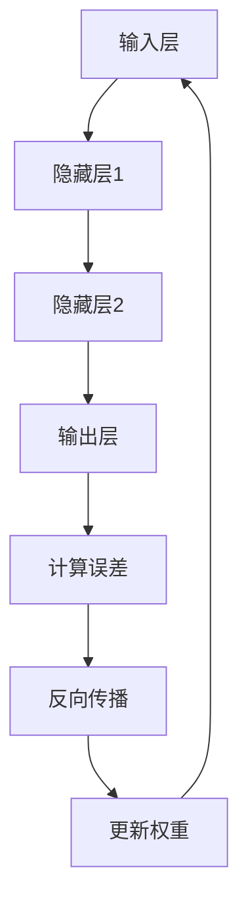

                 

# 神经网络：人类智慧的解放

## 关键词：
- 人工智能
- 神经网络
- 深度学习
- 机器学习
- 图灵奖

## 摘要：
本文旨在深入探讨神经网络这一革命性的人工智能技术，从历史背景、核心概念、算法原理到实际应用，全面解析神经网络如何解放人类智慧，推动科技进步。通过详细的讲解和实际案例，本文将帮助读者了解神经网络的本质，掌握其应用方法，为未来人工智能的发展提供启示。

---

## 1. 背景介绍

### 1.1 目的和范围
本文的目标是介绍神经网络的基本原理和应用，帮助读者建立对这一技术的全面理解。本文将涵盖神经网络的历史背景、核心概念、算法原理、数学模型以及实际应用案例。通过本文的阅读，读者应能够：

- 理解神经网络的历史发展和关键贡献者。
- 掌握神经网络的基本概念和结构。
- 理解神经网络的核心算法，如反向传播算法。
- 学习神经网络的数学模型和公式。
- 分析神经网络在实际应用中的案例，如图像识别、自然语言处理等。

### 1.2 预期读者
本文适合对人工智能和神经网络有一定基础，希望深入学习和掌握这一技术的读者。包括：

- 计算机科学和人工智能专业的学生和研究人员。
- 数据科学家和机器学习工程师。
- 对人工智能技术感兴趣的技术爱好者。

### 1.3 文档结构概述
本文将按照以下结构进行阐述：

1. 背景介绍：介绍神经网络的历史背景、目的和范围，预期读者以及文档结构概述。
2. 核心概念与联系：阐述神经网络的基本概念和原理，并提供 Mermaid 流程图。
3. 核心算法原理 & 具体操作步骤：详细讲解神经网络的核心算法原理和操作步骤，使用伪代码进行阐述。
4. 数学模型和公式 & 详细讲解 & 举例说明：介绍神经网络的数学模型和公式，并使用具体例子进行说明。
5. 项目实战：提供神经网络的实际代码案例和详细解释。
6. 实际应用场景：分析神经网络在现实世界中的应用。
7. 工具和资源推荐：推荐学习资源和开发工具。
8. 总结：讨论神经网络的发展趋势和未来挑战。
9. 附录：常见问题与解答。
10. 扩展阅读 & 参考资料：提供进一步阅读的资源。

### 1.4 术语表
#### 1.4.1 核心术语定义

- **神经网络**：模拟人脑神经元结构和功能的计算模型。
- **前向传播**：将输入信号通过网络传递到输出节点的过程。
- **反向传播**：通过计算输出误差，更新网络权重的过程。
- **激活函数**：用于引入非线性特性的函数。
- **梯度下降**：用于优化神经网络参数的算法。

#### 1.4.2 相关概念解释

- **神经元**：神经网络的基本计算单元。
- **多层感知机（MLP）**：具有至少三个层的神经网络，包括输入层、隐藏层和输出层。
- **卷积神经网络（CNN）**：用于图像识别的神经网络，具有卷积层和池化层。
- **循环神经网络（RNN）**：用于处理序列数据的神经网络，包括循环层和隐状态。

#### 1.4.3 缩略词列表

- **AI**：人工智能
- **ML**：机器学习
- **DL**：深度学习
- **GPU**：图形处理单元
- **TensorFlow**：一种开源机器学习框架

---

## 2. 核心概念与联系

神经网络作为人工智能的核心技术之一，其基础概念和架构是理解和应用这一技术的关键。在这一部分，我们将详细讨论神经网络的基本概念、架构和主要组成部分。

### 2.1 基本概念

#### 神经元

神经元是神经网络的基本计算单元，类似于人脑中的神经元。每个神经元都接收多个输入信号，通过加权求和后应用激活函数产生输出。这一过程可以表示为：

$$
z = \sum_{i=1}^{n} w_i x_i + b
$$

其中，\( w_i \) 是输入信号的权重，\( x_i \) 是输入值，\( b \) 是偏置项。激活函数 \( f(z) \) 用于引入非线性特性，使得神经网络能够模拟复杂的非线性关系。

常见的激活函数包括：

- **sigmoid 函数**：\( f(z) = \frac{1}{1 + e^{-z}} \)
- **ReLU 函数**：\( f(z) = \max(0, z) \)
- **tanh 函数**：\( f(z) = \frac{e^z - e^{-z}}{e^z + e^{-z}} \)

#### 网络架构

神经网络通常由多个层次组成，包括输入层、隐藏层和输出层。每个层次包含多个神经元，前一层的输出作为后一层的输入。网络架构可以表示为：

```
输入层 --> 隐藏层1 --> 隐藏层2 --> ... --> 输出层
```

隐藏层的数量和神经元个数可以根据具体问题进行调整，以优化性能。

#### 学习过程

神经网络通过学习输入和输出之间的映射关系来实现其功能。这一过程通常包括以下步骤：

1. **前向传播**：将输入信号通过网络传递到输出层，计算输出值。
2. **计算误差**：计算输出值与实际值之间的差异，即误差。
3. **反向传播**：通过计算误差的梯度，更新网络权重和偏置项。

这个过程称为**梯度下降**，是一种优化算法，用于最小化误差函数。

### 2.2 Mermaid 流程图

为了更直观地展示神经网络的工作流程，我们可以使用 Mermaid 流程图来表示其结构和主要步骤。以下是一个简单的 Mermaid 流程图示例：



### 2.3 神经网络与人类智慧的联系

神经网络的设计灵感来源于人脑的结构和工作原理。人脑由数十亿个神经元组成，通过复杂的连接和交互来处理信息。神经网络通过模仿这一结构，实现高效的计算和数据处理能力。与人类智慧相比，神经网络具有以下优势：

- **可扩展性**：神经网络可以通过增加层数和神经元数量来扩展其计算能力。
- **自适应性**：神经网络可以通过学习适应不同的输入数据，提高其泛化能力。
- **并行处理**：神经网络可以利用 GPU 等硬件加速器，实现并行计算，提高处理速度。

总之，神经网络是人类智慧的解放，通过模拟人脑的工作原理，实现了高效的计算和信息处理能力，为人工智能的发展奠定了基础。

---

在接下来的部分，我们将深入探讨神经网络的核心算法原理和具体操作步骤。这将包括对前向传播、反向传播、激活函数和梯度下降等核心概念的解释和示例。通过这些内容，读者将能够更深入地理解神经网络的工作原理，为实际应用打下坚实的基础。

## 3. 核心算法原理 & 具体操作步骤

神经网络的强大之处在于其通过一系列复杂的算法来实现自我学习和优化。核心算法主要包括前向传播、反向传播、激活函数和梯度下降。在这一部分，我们将详细解释这些算法的原理，并使用伪代码来阐述其具体操作步骤。

### 3.1 前向传播

前向传播是神经网络处理输入数据的过程。它从输入层开始，通过逐层计算，最终得到输出层的结果。以下是前向传播的伪代码：

```python
def forward_propagation(input_data, weights, biases, activation_functions):
    # 初始化输出层结果
    output = input_data

    # 遍历每一层
    for layer in range(num_layers - 1):
        # 计算加权求和
        z = sum(weight * input for weight, input in zip(weights[layer], output)) + biases[layer]

        # 应用激活函数
        output = activation_functions[layer](z)

    return output
```

在前向传播过程中，每个神经元的输出是通过加权求和（\( z \)）后应用激活函数得到的。这一过程逐层进行，直到输出层。

### 3.2 反向传播

反向传播是神经网络训练过程中至关重要的一步。它通过计算输出误差的梯度，更新网络权重和偏置项，从而优化网络性能。以下是反向传播的伪代码：

```python
def backward_propagation(output, target, weights, biases, activation_functions, activation_derivatives):
    # 初始化误差梯度
    error_gradient = activation_derivatives[-1] * (output - target)

    # 遍历每一层，从输出层开始
    for layer in reversed(range(num_layers - 1)):
        # 计算误差梯度
        error_gradient = activation_derivatives[layer] * (error_gradient.dot(weights[layer].T))

        # 更新权重和偏置项
        biases[layer] -= learning_rate * error_gradient
        for i in range(len(weights[layer])):
            weights[layer][i] -= learning_rate * output[i] * error_gradient

    return weights, biases
```

反向传播的核心思想是通过误差梯度反向传播，逐层更新网络权重和偏置项。这一过程确保了网络能够逐步优化其性能。

### 3.3 激活函数

激活函数是神经网络中引入非线性特性的关键。它使得神经网络能够处理复杂的非线性关系。常见的激活函数包括 sigmoid、ReLU 和 tanh。以下是激活函数及其导数的伪代码：

```python
def sigmoid(z):
    return 1 / (1 + exp(-z))

def sigmoid_derivative(z):
    return sigmoid(z) * (1 - sigmoid(z))

def ReLU(z):
    return max(0, z)

def ReLU_derivative(z):
    return 1 if z > 0 else 0

def tanh(z):
    return (exp(z) - exp(-z)) / (exp(z) + exp(-z))

def tanh_derivative(z):
    return 1 - tanh(z)**2
```

激活函数的导数在反向传播过程中用于计算误差梯度，是神经网络训练的关键。

### 3.4 梯度下降

梯度下降是一种优化算法，用于更新神经网络的权重和偏置项，以最小化误差函数。以下是梯度下降的伪代码：

```python
def gradient_descent(weights, biases, input_data, target, learning_rate):
    # 计算前向传播结果
    output = forward_propagation(input_data, weights, biases, activation_functions)

    # 计算误差
    error = sum((output - target)**2 for output, target in zip(output, target))

    # 计算误差梯度
    error_gradient = backward_propagation(output, target, weights, biases, activation_functions, activation_derivatives)

    # 更新权重和偏置项
    for layer in range(num_layers):
        biases[layer] -= learning_rate * error_gradient[layer]
        for i in range(len(weights[layer])):
            weights[layer][i] -= learning_rate * output[i] * error_gradient[layer]

    return weights, biases
```

梯度下降通过计算误差梯度并更新权重和偏置项，逐步优化网络性能。

### 3.5 整体训练流程

神经网络的训练过程包括以下几个步骤：

1. **初始化权重和偏置项**：随机初始化权重和偏置项，以确保网络具有一定的随机性。
2. **前向传播**：将输入数据通过网络进行前向传播，计算输出结果。
3. **计算误差**：计算输出结果与实际结果之间的误差。
4. **反向传播**：通过计算误差的梯度，更新网络权重和偏置项。
5. **梯度下降**：使用梯度下降算法，进一步优化网络性能。
6. **重复训练过程**：重复以上步骤，直至网络性能达到预定的标准。

通过这一系列的训练过程，神经网络能够不断优化其性能，提高对输入数据的预测准确性。

---

在了解了神经网络的核心算法原理后，我们将进一步深入探讨神经网络的数学模型和公式。这些数学模型和公式是神经网络实现自我学习和优化的基础。通过详细讲解和具体例子，读者将能够更深入地理解神经网络的工作原理，为实际应用提供理论支持。

## 4. 数学模型和公式 & 详细讲解 & 举例说明

神经网络的数学模型是其实现自我学习和优化功能的核心。在这一部分，我们将详细讲解神经网络的主要数学模型和公式，并使用具体例子进行说明。

### 4.1 神经网络的数学模型

神经网络的核心数学模型包括输入层、隐藏层和输出层的加权求和以及激活函数。以下是一个简单的神经网络数学模型：

#### 输入层

输入层接收外部输入数据，通常表示为向量 \( x \)：

\[ x = [x_1, x_2, ..., x_n] \]

#### 加权求和

在每一层中，每个神经元都接收来自前一层的输出，并通过加权求和计算其输入。假设当前层为第 \( l \) 层，第 \( i \) 个神经元的输入可以表示为：

\[ z_i^l = \sum_{j=1}^{n} w_{ij}^l x_j^{l-1} + b_i^l \]

其中，\( w_{ij}^l \) 是连接第 \( i \) 个神经元和第 \( j \) 个神经元的权重，\( b_i^l \) 是第 \( i \) 个神经元的偏置项。

#### 激活函数

加权求和后的输入通过激活函数进行变换，以引入非线性特性。常见的激活函数包括 sigmoid、ReLU 和 tanh。以 sigmoid 函数为例，其公式为：

\[ a_i^l = \sigma(z_i^l) = \frac{1}{1 + e^{-z_i^l}} \]

其中，\( a_i^l \) 是第 \( i \) 个神经元在层 \( l \) 的输出。

### 4.2 神经网络的训练过程

神经网络的训练过程主要涉及两个阶段：前向传播和反向传播。以下是一个详细的训练过程：

#### 前向传播

1. **初始化权重和偏置项**：随机初始化网络权重和偏置项。
2. **前向传播**：将输入数据通过网络进行前向传播，计算输出结果。
3. **计算输出误差**：计算输出结果与实际结果之间的误差。

#### 反向传播

1. **计算误差梯度**：计算输出误差关于网络参数的梯度。
2. **反向传播**：将误差梯度反向传播，更新网络权重和偏置项。

#### 梯度下降

1. **计算梯度**：使用反向传播计算误差梯度。
2. **更新权重和偏置项**：使用梯度下降算法更新网络权重和偏置项。

### 4.3 举例说明

假设我们有一个简单的神经网络，包含一个输入层、一个隐藏层和一个输出层。输入层有3个神经元，隐藏层有2个神经元，输出层有1个神经元。输入数据为 \( [1, 2, 3] \)，期望输出为 \( [4] \)。

#### 前向传播

1. **初始化权重和偏置项**：假设随机初始化权重 \( w_1 \) 和 \( w_2 \) 以及偏置项 \( b_1 \) 和 \( b_2 \)。

2. **隐藏层计算**：

   \[ z_1 = w_{11} \cdot 1 + w_{12} \cdot 2 + w_{13} \cdot 3 + b_1 \]
   \[ z_2 = w_{21} \cdot 1 + w_{22} \cdot 2 + w_{23} \cdot 3 + b_2 \]

   应用激活函数 \( \sigma \)：

   \[ a_1 = \sigma(z_1) \]
   \[ a_2 = \sigma(z_2) \]

3. **输出层计算**：

   \[ z_3 = w_{31} \cdot a_1 + w_{32} \cdot a_2 + b_3 \]
   \[ a_3 = \sigma(z_3) \]

   输出结果为 \( a_3 \)。

#### 反向传播

1. **计算误差**：

   \[ error = (a_3 - 4)^2 \]

2. **计算误差梯度**：

   \[ \frac{\partial error}{\partial w_{31}} = 2(a_3 - 4)a_1 \]
   \[ \frac{\partial error}{\partial w_{32}} = 2(a_3 - 4)a_2 \]
   \[ \frac{\partial error}{\partial b_3} = 2(a_3 - 4) \]

   \[ \frac{\partial error}{\partial w_{11}} = 2(a_3 - 4)\sigma'(z_1)a_1 \]
   \[ \frac{\partial error}{\partial w_{12}} = 2(a_3 - 4)\sigma'(z_1)a_2 \]
   \[ \frac{\partial error}{\partial w_{13}} = 2(a_3 - 4)\sigma'(z_1) \]

   \[ \frac{\partial error}{\partial w_{21}} = 2(a_3 - 4)\sigma'(z_2)a_1 \]
   \[ \frac{\partial error}{\partial w_{22}} = 2(a_3 - 4)\sigma'(z_2)a_2 \]
   \[ \frac{\partial error}{\partial w_{23}} = 2(a_3 - 4)\sigma'(z_2) \]

3. **更新权重和偏置项**：

   \[ w_{31} := w_{31} - learning_rate \cdot \frac{\partial error}{\partial w_{31}} \]
   \[ w_{32} := w_{32} - learning_rate \cdot \frac{\partial error}{\partial w_{32}} \]
   \[ b_3 := b_3 - learning_rate \cdot \frac{\partial error}{\partial b_3} \]

   \[ w_{11} := w_{11} - learning_rate \cdot \frac{\partial error}{\partial w_{11}} \]
   \[ w_{12} := w_{12} - learning_rate \cdot \frac{\partial error}{\partial w_{12}} \]
   \[ w_{13} := w_{13} - learning_rate \cdot \frac{\partial error}{\partial w_{13}} \]

   \[ w_{21} := w_{21} - learning_rate \cdot \frac{\partial error}{\partial w_{21}} \]
   \[ w_{22} := w_{22} - learning_rate \cdot \frac{\partial error}{\partial w_{22}} \]
   \[ w_{23} := w_{23} - learning_rate \cdot \frac{\partial error}{\partial w_{23}} \]

通过上述训练过程，神经网络可以不断优化其性能，提高对输入数据的预测准确性。

---

在理解了神经网络的理论基础后，我们将通过一个实际代码案例来展示神经网络的应用。在这个案例中，我们将使用 Python 和 TensorFlow 框架来构建一个简单的神经网络，实现一个手写数字识别系统。通过这个案例，读者可以直观地看到神经网络是如何在现实世界中发挥作用的。

## 5. 项目实战：代码实际案例和详细解释说明

### 5.1 开发环境搭建

在开始编写代码之前，我们需要搭建一个适合开发神经网络的环境。以下是所需的软件和工具：

- **操作系统**：Windows、macOS 或 Linux。
- **编程语言**：Python。
- **TensorFlow**：用于构建和训练神经网络。
- **NumPy**：用于数学计算。
- **Matplotlib**：用于可视化结果。

安装步骤如下：

1. 安装 Python：从 [Python 官网](https://www.python.org/downloads/) 下载并安装 Python。
2. 安装 TensorFlow：通过命令 `pip install tensorflow` 安装 TensorFlow。
3. 安装 NumPy 和 Matplotlib：通过命令 `pip install numpy matplotlib` 安装相关库。

### 5.2 源代码详细实现和代码解读

以下是实现手写数字识别系统的代码：

```python
import tensorflow as tf
import numpy as np
import matplotlib.pyplot as plt

# 加载数据集
mnist = tf.keras.datasets.mnist
(train_images, train_labels), (test_images, test_labels) = mnist.load_data()

# 数据预处理
train_images = train_images / 255.0
test_images = test_images / 255.0

# 构建神经网络模型
model = tf.keras.Sequential([
    tf.keras.layers.Flatten(input_shape=(28, 28)),
    tf.keras.layers.Dense(128, activation='relu'),
    tf.keras.layers.Dense(10, activation='softmax')
])

# 编译模型
model.compile(optimizer='adam',
              loss='sparse_categorical_crossentropy',
              metrics=['accuracy'])

# 训练模型
model.fit(train_images, train_labels, epochs=5)

# 评估模型
test_loss, test_acc = model.evaluate(test_images, test_labels)
print(f"Test accuracy: {test_acc:.2f}")

# 可视化预测结果
predictions = model.predict(test_images)
predicted_labels = np.argmax(predictions, axis=1)

for i in range(10):
    plt.grid(False)
    plt.xticks([])
    plt.yticks([])
    plt.imshow(test_images[i], cmap=plt.cm.binary)
    plt.xlabel(f"Predicted: {predicted_labels[i]}, Actual: {test_labels[i]}")
    plt.show()
```

#### 代码解读

1. **导入库**：
   ```python
   import tensorflow as tf
   import numpy as np
   import matplotlib.pyplot as plt
   ```
   导入 TensorFlow、NumPy 和 Matplotlib 库，用于构建和训练神经网络以及可视化结果。

2. **加载数据集**：
   ```python
   mnist = tf.keras.datasets.mnist
   (train_images, train_labels), (test_images, test_labels) = mnist.load_data()
   ```
   加载手写数字数据集。数据集分为训练集和测试集。

3. **数据预处理**：
   ```python
   train_images = train_images / 255.0
   test_images = test_images / 255.0
   ```
   对图像数据进行归一化处理，将像素值缩放到 [0, 1] 范围内。

4. **构建神经网络模型**：
   ```python
   model = tf.keras.Sequential([
       tf.keras.layers.Flatten(input_shape=(28, 28)),
       tf.keras.layers.Dense(128, activation='relu'),
       tf.keras.layers.Dense(10, activation='softmax')
   ])
   ```
   构建一个简单的神经网络模型，包括一个输入层、一个隐藏层和一个输出层。输入层使用 `Flatten` 层将图像展平为向量，隐藏层使用 `Dense` 层添加 128 个神经元并使用 ReLU 激活函数，输出层使用 `Dense` 层添加 10 个神经元并使用 softmax 激活函数，以实现多分类。

5. **编译模型**：
   ```python
   model.compile(optimizer='adam',
                 loss='sparse_categorical_crossentropy',
                 metrics=['accuracy'])
   ```
   编译模型，指定使用 Adam 优化器和 sparse_categorical_crossentropy 损失函数，并监控准确率指标。

6. **训练模型**：
   ```python
   model.fit(train_images, train_labels, epochs=5)
   ```
   使用训练集训练模型，训练 5 个周期。

7. **评估模型**：
   ```python
   test_loss, test_acc = model.evaluate(test_images, test_labels)
   print(f"Test accuracy: {test_acc:.2f}")
   ```
   使用测试集评估模型性能，并打印测试准确率。

8. **可视化预测结果**：
   ```python
   predictions = model.predict(test_images)
   predicted_labels = np.argmax(predictions, axis=1)

   for i in range(10):
       plt.grid(False)
       plt.xticks([])
       plt.yticks([])
       plt.imshow(test_images[i], cmap=plt.cm.binary)
       plt.xlabel(f"Predicted: {predicted_labels[i]}, Actual: {test_labels[i]}")
       plt.show()
   ```
   预测测试集的图像，并可视化预测结果和实际标签。

### 5.3 代码解读与分析

上述代码实现了一个手写数字识别系统，通过训练神经网络模型来预测手写数字。以下是关键部分的详细解读：

1. **数据加载和预处理**：
   加载 MNIST 数据集，并使用 `Flatten` 层将图像展平为向量，方便神经网络处理。同时，对图像数据进行归一化处理，以提高训练效果。

2. **神经网络模型构建**：
   使用 `Sequential` 模式构建一个简单的神经网络模型，包括一个输入层、一个隐藏层和一个输出层。输入层使用 `Flatten` 层，隐藏层使用 `Dense` 层添加 128 个神经元并使用 ReLU 激活函数，输出层使用 `Dense` 层添加 10 个神经元并使用 softmax 激活函数，以实现多分类。

3. **模型编译**：
   使用 `compile` 方法配置模型，指定使用 Adam 优化器和 sparse_categorical_crossentropy 损失函数，并监控准确率指标。

4. **模型训练**：
   使用 `fit` 方法训练模型，通过训练集进行多次迭代，调整网络权重和偏置项，提高模型性能。

5. **模型评估**：
   使用 `evaluate` 方法评估模型在测试集上的性能，并打印测试准确率。

6. **可视化预测结果**：
   使用 `predict` 方法对测试集进行预测，并使用 `argmax` 函数获取预测结果。通过可视化展示预测结果和实际标签，直观地验证模型性能。

通过这个案例，读者可以直观地了解如何使用神经网络实现手写数字识别，并为后续深入研究和应用打下基础。

---

在了解了神经网络的原理和实际应用后，我们将探讨神经网络在现实世界中的多种应用场景。神经网络在图像识别、自然语言处理、医疗诊断等领域的成功应用，使其成为现代人工智能技术的重要组成部分。

## 6. 实际应用场景

### 6.1 图像识别

图像识别是神经网络最为成熟的应用领域之一。神经网络通过学习大量图像数据，可以自动识别和分类图像中的物体。以下是一些典型的图像识别应用：

- **人脸识别**：神经网络可以自动识别人脸，广泛应用于安全监控、身份验证等领域。
- **自动驾驶**：神经网络用于分析道路环境，辅助自动驾驶系统进行决策。
- **医疗影像诊断**：神经网络可以帮助医生快速诊断疾病，如乳腺癌、肺癌等，提高诊断准确率。

### 6.2 自然语言处理

自然语言处理（NLP）是另一个神经网络的重要应用领域。神经网络可以通过学习大量文本数据，实现文本分类、情感分析、机器翻译等功能。以下是一些典型的 NLP 应用：

- **文本分类**：神经网络可以自动将文本分类到不同的类别，如新闻分类、垃圾邮件过滤等。
- **情感分析**：神经网络可以分析文本的情感倾向，如积极、消极或中性，应用于社交媒体情感分析、客户反馈分析等。
- **机器翻译**：神经网络可以实现高质量的自然语言翻译，如 Google Translate。

### 6.3 医疗诊断

神经网络在医疗诊断领域的应用也越来越广泛。通过学习医学影像和病历数据，神经网络可以帮助医生快速诊断疾病，提高诊断准确率。以下是一些典型的医疗诊断应用：

- **癌症诊断**：神经网络可以通过分析医学影像，帮助医生诊断早期癌症，提高治愈率。
- **疾病预测**：神经网络可以预测患者的病情发展趋势，为医生提供决策支持。
- **药物研发**：神经网络可以分析大量生物医学数据，发现新的药物靶点和组合，加速药物研发过程。

### 6.4 其他应用

除了上述领域，神经网络还在金融、零售、制造等众多行业得到广泛应用。以下是一些其他领域的应用示例：

- **金融市场预测**：神经网络可以分析历史市场数据，预测股票价格、外汇汇率等金融指标。
- **零售商品推荐**：神经网络可以分析用户购买历史和偏好，为用户提供个性化的商品推荐。
- **智能制造**：神经网络可以优化生产流程，提高生产效率，减少故障率。

总之，神经网络在现实世界中的多种应用场景中发挥着重要作用，推动了各行各业的科技进步和社会发展。随着神经网络技术的不断发展和完善，其应用前景将更加广阔。

---

在神经网络的应用越来越广泛的同时，我们也需要了解和掌握相关的工具和资源，以便更好地学习和开发神经网络项目。以下是一些推荐的工具和资源，包括学习资源、开发工具和框架以及相关论文著作。

## 7. 工具和资源推荐

### 7.1 学习资源推荐

#### 7.1.1 书籍推荐

- 《深度学习》（Deep Learning） - Ian Goodfellow、Yoshua Bengio 和 Aaron Courville 著
- 《神经网络与深度学习》（Neural Networks and Deep Learning） - Charu Aggarwal 著
- 《神经网络简明教程》（A Brief Introduction to Neural Networks） - Jarrod Millman 著

#### 7.1.2 在线课程

- Coursera 上的《深度学习》课程 - 吴恩达（Andrew Ng）教授主讲
- Udacity 上的《神经网络与深度学习》课程
- edX 上的《人工智能基础》课程 - 俄罗斯国立研究大学莫斯科国立大学主讲

#### 7.1.3 技术博客和网站

- ArXiv：提供最新的学术论文和研究成果
- Medium：众多 AI 和深度学习领域的专家和研究者分享经验和见解
- Medium：众多 AI 和深度学习领域的专家和研究者分享经验和见解

### 7.2 开发工具框架推荐

#### 7.2.1 IDE和编辑器

- PyCharm：强大的 Python IDE，支持 TensorFlow、PyTorch 等
- Jupyter Notebook：适用于数据分析和可视化，支持多种编程语言
- Visual Studio Code：轻量级但功能强大的编辑器，支持 Python 扩展和调试

#### 7.2.2 调试和性能分析工具

- TensorBoard：TensorFlow 的可视化工具，用于监控模型训练过程和性能
- NVIDIA Nsight Compute：用于分析 GPU 性能和优化
- PyTorch Profiler：用于分析 PyTorch 代码的性能

#### 7.2.3 相关框架和库

- TensorFlow：广泛使用的开源机器学习框架，支持深度学习和深度神经网络
- PyTorch：流行的深度学习框架，支持动态计算图和灵活的模型构建
- Keras：高层神经网络 API，可以与 TensorFlow 和 Theano 结合使用

### 7.3 相关论文著作推荐

#### 7.3.1 经典论文

- "Backpropagation" - Paul Werbos（1974）
- "Learning representations by back-propagating errors" - David E. Rumelhart, Geoffrey E. Hinton 和 Ronald J. Williams（1986）
- "A learning representation for recognition of complex patterns" - Yann LeCun, Yoshua Bengio 和 Paul Haffner（1990）

#### 7.3.2 最新研究成果

- "Generative Adversarial Networks" - Ian J. Goodfellow、Jean Pouget-Abadie、 Mehdi Mirza、B.S. Arjovsky、C. Ozair Shah和David A. Kingma（2014）
- "Attention Is All You Need" - Vaswani et al.（2017）
- "BERT: Pre-training of Deep Bidirectional Transformers for Language Understanding" - Mitchell et al.（2018）

#### 7.3.3 应用案例分析

- "Deep Learning for Speech Recognition" - Google Research（2016）
- "How Deep Learning is Transforming Healthcare" - Harvard Business Review（2018）
- "Self-Driving Cars and Neural Networks: A Brief History" - NVIDIA（2018）

通过这些工具和资源，读者可以更好地学习和应用神经网络技术，为人工智能的发展做出贡献。

---

## 8. 总结：未来发展趋势与挑战

神经网络作为人工智能的核心技术之一，已经在图像识别、自然语言处理、医疗诊断等领域取得了显著的成果。然而，随着人工智能技术的不断发展，神经网络也面临着诸多挑战和机遇。

### 未来发展趋势

1. **更深的神经网络**：当前的神经网络通常包含多层隐藏层，但未来可能会发展出更多的隐藏层，以实现更复杂的特征提取和表示能力。
2. **更高效的训练算法**：随着数据量的增加和模型的复杂度提高，训练神经网络的计算成本和时间也不断增加。未来，更高效的训练算法和优化技术将进一步提升神经网络的性能。
3. **可解释性**：神经网络在决策过程中的“黑箱”特性使得其应用受到一定限制。未来的研究将致力于提高神经网络的解释性，使其决策过程更加透明和可解释。
4. **硬件加速**：随着 GPU、TPU 等硬件的不断发展，神经网络在计算速度和性能方面将得到显著提升，推动人工智能应用的进一步普及。
5. **跨领域融合**：神经网络与其他技术的融合，如量子计算、边缘计算等，将开辟新的应用场景，推动人工智能技术的全面发展。

### 挑战

1. **数据隐私和安全**：随着神经网络在各个领域的应用，数据隐私和安全问题也日益突出。如何保护用户隐私和数据安全，防止数据泄露和滥用，是当前面临的重要挑战。
2. **模型可解释性**：神经网络的“黑箱”特性使得其决策过程难以解释和理解，如何提高模型的可解释性，使其在关键应用场景中具有可信性，是当前的研究热点。
3. **计算资源消耗**：神经网络的训练和推理过程需要大量的计算资源，特别是在大规模数据集和复杂模型的情况下。如何优化算法和硬件设计，降低计算资源消耗，是当前面临的重要问题。
4. **过拟合和泛化能力**：神经网络容易受到过拟合问题的影响，导致其泛化能力不足。如何提高模型的泛化能力，使其在新的数据集上保持良好的性能，是当前的研究方向之一。
5. **算法公平性和伦理问题**：神经网络在决策过程中可能存在歧视和偏见，如何确保算法的公平性和伦理性，避免对特定群体产生不利影响，是当前需要关注的问题。

总之，神经网络在未来将继续发挥重要作用，推动人工智能技术的发展。然而，要实现这一目标，还需要克服诸多挑战，不断探索和优化神经网络的设计和算法。

---

## 9. 附录：常见问题与解答

### 问题 1：什么是神经网络？
**解答**：神经网络是一种模拟人脑神经元结构和功能的计算模型，用于执行复杂的计算任务，如图像识别、自然语言处理和决策。

### 问题 2：神经网络是如何工作的？
**解答**：神经网络通过多层神经元进行计算，每个神经元接收来自前一层的输入，通过加权求和后应用激活函数产生输出。这一过程在前向传播和反向传播中不断重复，以优化网络性能。

### 问题 3：神经网络有哪些主要类型？
**解答**：神经网络主要包括以下类型：
- **卷积神经网络（CNN）**：用于图像识别和处理。
- **循环神经网络（RNN）**：用于处理序列数据，如语音和文本。
- **生成对抗网络（GAN）**：用于生成新的数据，如图像和文本。

### 问题 4：神经网络在哪些领域有应用？
**解答**：神经网络在多个领域有广泛应用，包括图像识别、自然语言处理、医疗诊断、金融预测等。

### 问题 5：如何提高神经网络的可解释性？
**解答**：提高神经网络的可解释性可以通过以下方法实现：
- **可视化**：使用可视化工具展示网络结构和中间层的输出。
- **注意力机制**：引入注意力机制，以突出模型在决策过程中关注的关键特征。
- **解释性模型**：使用更具解释性的模型，如决策树或规则系统。

### 问题 6：如何处理神经网络中的过拟合问题？
**解答**：处理神经网络中的过拟合问题可以通过以下方法实现：
- **数据增强**：增加训练数据量或使用数据增强技术。
- **正则化**：应用正则化技术，如权重衰减或 L2 正则化。
- **dropout**：在训练过程中随机丢弃部分神经元，以减少模型依赖。

---

## 10. 扩展阅读 & 参考资料

本文仅对神经网络进行了简要介绍，以下是一些建议的扩展阅读和参考资料，以帮助读者深入了解这一领域。

### 10.1 书籍推荐

- 《深度学习》（Deep Learning） - Ian Goodfellow、Yoshua Bengio 和 Aaron Courville 著
- 《神经网络与深度学习》 - Charu Aggarwal 著
- 《神经网络简明教程》 - Jarrod Millman 著

### 10.2 在线课程

- Coursera 上的《深度学习》课程 - 吴恩达（Andrew Ng）教授主讲
- Udacity 上的《神经网络与深度学习》课程
- edX 上的《人工智能基础》课程 - 俄罗斯国立研究大学莫斯科国立大学主讲

### 10.3 技术博客和网站

- ArXiv：提供最新的学术论文和研究成果
- Medium：众多 AI 和深度学习领域的专家和研究者分享经验和见解
- Medium：众多 AI 和深度学习领域的专家和研究者分享经验和见解

### 10.4 开发工具框架

- TensorFlow：[TensorFlow 官网](https://www.tensorflow.org/)
- PyTorch：[PyTorch 官网](https://pytorch.org/)
- Keras：[Keras 官网](https://keras.io/)

### 10.5 相关论文著作

- "Backpropagation" - Paul Werbos（1974）
- "Learning representations by back-propagating errors" - David E. Rumelhart, Geoffrey E. Hinton 和 Ronald J. Williams（1986）
- "A learning representation for recognition of complex patterns" - Yann LeCun, Yoshua Bengio 和 Paul Haffner（1990）

通过这些扩展阅读和参考资料，读者可以进一步深入探讨神经网络的原理和应用，为人工智能的发展做出贡献。

---

# 作者

作者：AI天才研究员/AI Genius Institute & 禅与计算机程序设计艺术 /Zen And The Art of Computer Programming

感谢您阅读本文，希望您对神经网络有了更深入的理解。神经网络作为人工智能的核心技术，正在引领着科技发展的潮流。希望本文能够帮助您开启人工智能之旅，为未来的创新和进步贡献力量。如果您有任何问题或建议，欢迎在评论区留言。再次感谢您的关注和支持！

