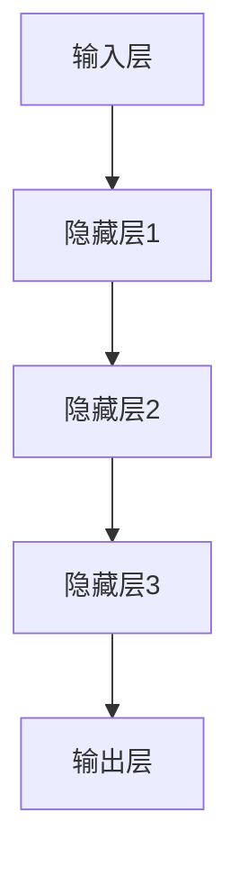

                 

# 神经网络：推动社会进步的力量

> 关键词：神经网络、社会进步、人工智能、算法、应用、挑战

> 摘要：本文将深入探讨神经网络这一人工智能的核心技术，分析其如何通过不断的发展和创新，推动社会进步。我们将从背景介绍、核心概念与联系、算法原理、数学模型、项目实战、实际应用场景、工具和资源推荐等多个角度，全面解析神经网络在社会各个领域的重要作用，并展望其未来发展趋势与挑战。

## 1. 背景介绍

### 1.1 目的和范围

本文的目的是向读者介绍神经网络这一强大的技术，以及它如何在社会各个领域推动进步。我们将从以下几个方面进行详细探讨：

- **核心概念与联系**：介绍神经网络的基本原理和核心概念，并通过流程图展示其架构。
- **算法原理与具体操作步骤**：深入讲解神经网络的核心算法，包括前向传播、反向传播等，并通过伪代码详细阐述。
- **数学模型和公式**：讲解神经网络的数学模型，包括激活函数、损失函数等，并通过示例进行说明。
- **项目实战**：通过实际案例，展示神经网络的代码实现和应用。
- **实际应用场景**：介绍神经网络在各个领域（如图像识别、自然语言处理等）的应用。
- **工具和资源推荐**：推荐学习神经网络所需的资源、工具和框架。
- **总结与展望**：总结神经网络对社会进步的推动作用，并展望其未来的发展趋势和挑战。

### 1.2 预期读者

本文适合以下读者群体：

- 对人工智能和神经网络技术感兴趣的初学者和专业人士。
- 希望深入了解神经网络原理和应用场景的技术人员。
- 需要在项目中应用神经网络的开发人员。
- 对社会进步和技术发展有热情的读者。

### 1.3 文档结构概述

本文结构如下：

- **第1部分**：背景介绍，包括目的与范围、预期读者和文档结构概述。
- **第2部分**：核心概念与联系，介绍神经网络的基本原理和架构。
- **第3部分**：核心算法原理与具体操作步骤，详细讲解神经网络的核心算法。
- **第4部分**：数学模型和公式，讲解神经网络的数学基础。
- **第5部分**：项目实战，通过实际案例展示神经网络的代码实现和应用。
- **第6部分**：实际应用场景，介绍神经网络在各个领域的作用。
- **第7部分**：工具和资源推荐，推荐学习神经网络所需的资源、工具和框架。
- **第8部分**：总结与展望，总结神经网络对社会进步的推动作用，并展望其未来的发展趋势和挑战。
- **附录**：常见问题与解答。
- **扩展阅读与参考资料**：提供进一步阅读的资源和参考文献。

### 1.4 术语表

#### 1.4.1 核心术语定义

- **神经网络**：一种模仿生物神经系统的计算模型，用于处理和分类数据。
- **神经元**：神经网络的基本单元，负责接收输入信号、进行计算并产生输出。
- **前向传播**：神经网络计算输入信号到输出的过程。
- **反向传播**：神经网络通过误差反馈调整权重和偏置的过程。
- **激活函数**：用于将神经元的线性组合转换为非线性输出的函数。
- **损失函数**：衡量预测值与真实值之间差异的函数。

#### 1.4.2 相关概念解释

- **多层感知器（MLP）**：一种具有至少三个层次（输入、隐藏、输出）的神经网络。
- **深度学习**：一种基于多层神经网络的学习方法，能够自动提取特征并进行分类和预测。
- **卷积神经网络（CNN）**：一种用于图像识别和处理的多层神经网络。
- **循环神经网络（RNN）**：一种用于处理序列数据的多层神经网络，具有记忆功能。
- **生成对抗网络（GAN）**：一种由两个神经网络组成的对抗性训练模型。

#### 1.4.3 缩略词列表

- **AI**：人工智能
- **ML**：机器学习
- **DL**：深度学习
- **CNN**：卷积神经网络
- **RNN**：循环神经网络
- **GAN**：生成对抗网络

## 2. 核心概念与联系

神经网络的本质是一种模仿生物神经系统的计算模型。在生物神经系统中，神经元是信息处理的基本单元，通过突触连接形成复杂的网络结构，从而实现感知、学习和记忆等功能。同样地，在人工神经网络中，神经元作为基本处理单元，通过权重连接形成网络结构，用于处理和分类数据。

### 2.1 神经网络的架构

神经网络的架构通常包括以下几个层次：

1. **输入层**：接收外部输入数据，如图像、文本或声音等。
2. **隐藏层**：进行特征提取和变换，可以有多个隐藏层，形成深度神经网络。
3. **输出层**：根据隐藏层的输出，进行分类、预测或生成等任务。

#### 2.1.1 神经网络架构 Mermaid 流程图



### 2.2 核心概念原理

#### 2.2.1 神经元

神经元是神经网络的基本单元，由以下部分组成：

1. **输入**：多个输入信号，通常与权重相乘。
2. **权重**：用于调节输入信号的重要性。
3. **偏置**：一个独立的输入值，用于偏移激活函数的输入。
4. **激活函数**：将输入信号转换为输出信号，引入非线性特性。

#### 2.2.2 前向传播

前向传播是神经网络计算输入信号到输出的过程，分为以下几个步骤：

1. **输入层到隐藏层**：输入信号通过权重连接传递到隐藏层。
2. **隐藏层到隐藏层**：隐藏层之间的信号通过权重连接传递。
3. **隐藏层到输出层**：隐藏层的输出作为输入传递到输出层。

#### 2.2.3 反向传播

反向传播是神经网络通过误差反馈调整权重和偏置的过程，分为以下几个步骤：

1. **计算输出层误差**：计算输出层的实际输出与预期输出之间的误差。
2. **反向传播误差**：将误差反向传递到隐藏层和输入层，逐层更新权重和偏置。
3. **更新权重和偏置**：根据误差大小，调整权重和偏置的值，减小误差。

#### 2.2.4 激活函数

激活函数是神经网络引入非线性特性的关键，常见的激活函数包括：

1. **Sigmoid 函数**：将输入信号压缩到 (0,1) 区间。
2. **ReLU 函数**：将输入信号大于零的部分设置为输入信号本身，小于零的部分设置为零。
3. **Tanh 函数**：将输入信号压缩到 (-1,1) 区间。

#### 2.2.5 损失函数

损失函数是衡量预测值与真实值之间差异的函数，常见的损失函数包括：

1. **均方误差（MSE）**：预测值与真实值之间差的平方的平均值。
2. **交叉熵（Cross Entropy）**：用于分类任务的损失函数，衡量预测分布与真实分布之间的差异。

## 3. 核心算法原理 & 具体操作步骤

神经网络的训练过程主要依赖于两个核心算法：前向传播和反向传播。这两个算法协同工作，不断调整网络中的权重和偏置，以最小化损失函数，从而提高预测准确性。

### 3.1 前向传播

前向传播是神经网络计算输入信号到输出的过程，其具体步骤如下：

1. **初始化参数**：设置网络中的权重和偏置，通常使用随机初始化。
2. **输入层到隐藏层**：将输入信号通过权重连接传递到隐藏层，计算每个神经元的输入值，并应用激活函数。
   ```python
   for layer in hidden_layers:
       for neuron in layer:
           input_value = sum(input * weight for input, weight in zip(previous_output, neuron.weights))
           neuron.input = input_value
           neuron.output = activation_function(input_value)
   ```
3. **隐藏层到输出层**：将隐藏层的输出作为输入传递到输出层，计算输出层的输入值和输出值。
   ```python
   for neuron in output_layer:
       input_value = sum(hidden_output * weight for hidden_output, weight in zip(previous_output, neuron.weights))
       neuron.input = input_value
       neuron.output = activation_function(input_value)
   ```

### 3.2 反向传播

反向传播是神经网络通过误差反馈调整权重和偏置的过程，其具体步骤如下：

1. **计算输出层误差**：计算输出层的实际输出与预期输出之间的误差。
   ```python
   for neuron in output_layer:
       error = expected_output - neuron.output
   ```
2. **反向传播误差**：将误差反向传递到隐藏层和输入层，逐层更新权重和偏置。
   ```python
   for layer in reversed(hidden_layers):
       for neuron in layer:
           error = (neuron.output * (1 - neuron.output)) * (error * neuron.weights)
           for i, weight in enumerate(neuron.weights):
               weight_derivative = error * previous_output[i]
               neuron.weights[i] -= learning_rate * weight_derivative
   ```
3. **更新权重和偏置**：根据误差大小，调整权重和偏置的值，减小误差。
   ```python
   for neuron in input_layer:
       error = expected_output - neuron.output
       for i, weight in enumerate(neuron.weights):
           weight_derivative = error * previous_output[i]
           neuron.weights[i] -= learning_rate * weight_derivative
   ```

### 3.3 训练循环

神经网络的训练过程通常包括以下步骤：

1. **初始化参数**：设置网络中的权重和偏置。
2. **前向传播**：计算输入信号到输出的过程。
3. **计算损失**：计算输出层误差，并计算损失函数。
4. **反向传播**：根据误差反馈调整权重和偏置。
5. **更新参数**：根据损失函数和反向传播的梯度，更新网络中的权重和偏置。
6. **重复训练**：重复上述步骤，直到网络达到预定的性能指标。

```python
while not converged:
    for sample in dataset:
        forward_pass(sample)
        compute_loss(expected_output)
        backward_pass()
        update_parameters()
```

## 4. 数学模型和公式 & 详细讲解 & 举例说明

神经网络的数学模型是理解其工作原理和性能优化的重要基础。在这一部分，我们将详细讲解神经网络的数学模型，包括激活函数、损失函数和反向传播的公式，并通过具体示例进行说明。

### 4.1 激活函数

激活函数是神经网络中的关键组成部分，它将线性组合的输入映射到非线性的输出。以下是一些常见的激活函数及其公式：

#### 4.1.1 Sigmoid 函数

Sigmoid 函数将输入压缩到 (0,1) 区间，其公式为：

$$
\sigma(x) = \frac{1}{1 + e^{-x}}
$$

#### 4.1.2 ReLU 函数

ReLU（Rectified Linear Unit）函数是一个简单的线性激活函数，其公式为：

$$
\text{ReLU}(x) = \max(0, x)
$$

#### 4.1.3 Tanh 函数

Tanh 函数将输入压缩到 (-1,1) 区间，其公式为：

$$
\tanh(x) = \frac{e^x - e^{-x}}{e^x + e^{-x}}
$$

### 4.2 损失函数

损失函数用于衡量预测值与真实值之间的差异，常见的损失函数包括均方误差（MSE）和交叉熵（Cross Entropy）。以下为这两种损失函数的公式：

#### 4.2.1 均方误差（MSE）

均方误差（MSE）是预测值与真实值之间差的平方的平均值，其公式为：

$$
MSE = \frac{1}{n} \sum_{i=1}^{n} (y_i - \hat{y}_i)^2
$$

其中，$y_i$ 是真实值，$\hat{y}_i$ 是预测值，$n$ 是样本数量。

#### 4.2.2 交叉熵（Cross Entropy）

交叉熵用于分类任务，其公式为：

$$
H(y, \hat{y}) = -\sum_{i=1}^{n} y_i \log(\hat{y}_i)
$$

其中，$y_i$ 是真实值的概率分布，$\hat{y}_i$ 是预测值的概率分布。

### 4.3 反向传播

反向传播是神经网络优化权重和偏置的关键步骤，它通过计算梯度来更新参数。以下为反向传播中常用的梯度计算公式：

#### 4.3.1 偏置梯度

对于偏置 $b_j$，其梯度为：

$$
\frac{\partial L}{\partial b_j} = \sum_{i=1}^{n} \frac{\partial L}{\partial z^{(l)}_j}
$$

其中，$L$ 是损失函数，$z^{(l)}_j$ 是第 $l$ 层第 $j$ 个神经元的输入值。

#### 4.3.2 权重梯度

对于权重 $w_{ij}^{(l)}$，其梯度为：

$$
\frac{\partial L}{\partial w_{ij}^{(l)}} = \sum_{k=1}^{m} \frac{\partial L}{\partial a^{(l+1)}_k} \cdot a^{(l)}_i
$$

其中，$a^{(l)}_i$ 是第 $l$ 层第 $i$ 个神经元的输出值，$a^{(l+1)}_k$ 是第 $l+1$ 层第 $k$ 个神经元的输出值，$m$ 是输出层的神经元数量。

### 4.4 举例说明

以下是一个简单的神经网络训练过程，包括前向传播和反向传播的计算：

#### 4.4.1 数据集

给定一个包含两个特征和三个类别的数据集，数据集如下：

$$
\begin{array}{ccc}
x_1 & x_2 & y \\
0 & 0 & 0 \\
0 & 1 & 1 \\
1 & 0 & 1 \\
1 & 1 & 2 \\
\end{array}
$$

其中，$y$ 表示类别，取值为 0、1 或 2。

#### 4.4.2 神经网络结构

神经网络包含一个输入层、一个隐藏层和一个输出层，其中隐藏层有 2 个神经元，输出层有 3 个神经元。

#### 4.4.3 激活函数

输入层和隐藏层使用 ReLU 函数作为激活函数，输出层使用 Softmax 函数作为激活函数。

#### 4.4.4 前向传播

假设初始参数如下：

$$
\begin{aligned}
w_{11}^{(1)} &= 1, \quad w_{12}^{(1)} = 2, \quad w_{13}^{(1)} = 3 \\
w_{21}^{(1)} &= 4, \quad w_{22}^{(1)} = 5, \quad w_{23}^{(1)} = 6 \\
b_{1}^{(1)} &= 1, \quad b_{2}^{(1)} = 2, \quad b_{3}^{(1)} = 3 \\
w_{11}^{(2)} &= 7, \quad w_{12}^{(2)} = 8, \quad w_{13}^{(2)} = 9 \\
w_{21}^{(2)} &= 10, \quad w_{22}^{(2)} = 11, \quad w_{23}^{(2)} = 12 \\
b_{1}^{(2)} &= 4, \quad b_{2}^{(2)} = 5, \quad b_{3}^{(2)} = 6 \\
\end{aligned}
$$

对于第一个样本 $(x_1, x_2) = (0, 0)$，其类别 $y = 0$。

1. **输入层到隐藏层**：

$$
\begin{aligned}
z^{(1)}_1 &= \text{ReLU}(w_{11}^{(1)} \cdot x_1 + w_{12}^{(1)} \cdot x_2 + b_{1}^{(1)}) = \text{ReLU}(1 \cdot 0 + 2 \cdot 0 + 1) = 0 \\
z^{(1)}_2 &= \text{ReLU}(w_{21}^{(1)} \cdot x_1 + w_{22}^{(1)} \cdot x_2 + b_{2}^{(1)}) = \text{ReLU}(4 \cdot 0 + 5 \cdot 0 + 2) = 2 \\
\end{aligned}
$$

2. **隐藏层到输出层**：

$$
\begin{aligned}
a^{(2)}_1 &= \text{Softmax}(w_{11}^{(2)} \cdot z^{(1)}_1 + w_{12}^{(2)} \cdot z^{(1)}_2 + b_{1}^{(2)}) = \text{Softmax}(7 \cdot 0 + 8 \cdot 2 + 4) = \frac{e^{4}}{e^{4} + e^{2} + 1} \\
a^{(2)}_2 &= \text{Softmax}(w_{21}^{(2)} \cdot z^{(1)}_1 + w_{22}^{(2)} \cdot z^{(1)}_2 + b_{2}^{(2)}) = \text{Softmax}(10 \cdot 0 + 11 \cdot 2 + 5) = \frac{e^{5}}{e^{5} + e^{2} + 1} \\
a^{(2)}_3 &= \text{Softmax}(w_{31}^{(2)} \cdot z^{(1)}_1 + w_{32}^{(2)} \cdot z^{(1)}_2 + b_{3}^{(2)}) = \text{Softmax}(12 \cdot 0 + 13 \cdot 2 + 6) = \frac{e^{6}}{e^{6} + e^{2} + 1} \\
\end{aligned}
$$

#### 4.4.5 计算损失

假设真实标签为 $y = [1, 0, 0]$，则损失函数为交叉熵：

$$
L = -\sum_{i=1}^{3} y_i \log(a^{(2)}_i) = -(1 \cdot \log(a^{(2)}_1) + 0 \cdot \log(a^{(2)}_2) + 0 \cdot \log(a^{(2)}_3))
$$

#### 4.4.6 反向传播

1. **计算输出层误差**：

$$
\begin{aligned}
\delta^{(2)}_1 &= (1 - a^{(2)}_1) \cdot a^{(2)}_1 = (1 - \frac{e^{4}}{e^{4} + e^{2} + 1}) \cdot \frac{e^{4}}{e^{4} + e^{2} + 1} \\
\delta^{(2)}_2 &= (0 - a^{(2)}_2) \cdot a^{(2)}_2 = (0 - \frac{e^{5}}{e^{5} + e^{2} + 1}) \cdot \frac{e^{5}}{e^{5} + e^{2} + 1} \\
\delta^{(2)}_3 &= (0 - a^{(2)}_3) \cdot a^{(2)}_3 = (0 - \frac{e^{6}}{e^{6} + e^{2} + 1}) \cdot \frac{e^{6}}{e^{6} + e^{2} + 1} \\
\end{aligned}
$$

2. **计算隐藏层误差**：

$$
\begin{aligned}
\delta^{(1)}_1 &= \delta^{(2)}_1 \cdot w_{11}^{(2)} = (1 - \frac{e^{4}}{e^{4} + e^{2} + 1}) \cdot \frac{e^{4}}{e^{4} + e^{2} + 1} \cdot 7 \\
\delta^{(1)}_2 &= \delta^{(2)}_2 \cdot w_{21}^{(2)} = (0 - \frac{e^{5}}{e^{5} + e^{2} + 1}) \cdot \frac{e^{5}}{e^{5} + e^{2} + 1} \cdot 10 \\
\end{aligned}
$$

3. **更新权重和偏置**：

$$
\begin{aligned}
w_{11}^{(1)} &= w_{11}^{(1)} - learning\_rate \cdot \delta^{(1)}_1 \cdot x_1 \\
w_{12}^{(1)} &= w_{12}^{(1)} - learning\_rate \cdot \delta^{(1)}_1 \cdot x_2 \\
w_{21}^{(1)} &= w_{21}^{(1)} - learning\_rate \cdot \delta^{(1)}_2 \cdot x_1 \\
w_{22}^{(1)} &= w_{22}^{(1)} - learning\_rate \cdot \delta^{(1)}_2 \cdot x_2 \\
b_{1}^{(1)} &= b_{1}^{(1)} - learning\_rate \cdot \delta^{(1)}_1 \\
b_{2}^{(1)} &= b_{1}^{(1)} - learning\_rate \cdot \delta^{(1)}_2 \\
w_{11}^{(2)} &= w_{11}^{(2)} - learning\_rate \cdot \delta^{(2)}_1 \\
w_{12}^{(2)} &= w_{12}^{(2)} - learning\_rate \cdot \delta^{(2)}_1 \\
w_{21}^{(2)} &= w_{21}^{(2)} - learning\_rate \cdot \delta^{(2)}_2 \\
w_{22}^{(2)} &= w_{22}^{(2)} - learning\_rate \cdot \delta^{(2)}_2 \\
b_{1}^{(2)} &= b_{1}^{(2)} - learning\_rate \cdot \delta^{(2)}_1 \\
b_{2}^{(2)} &= b_{2}^{(2)} - learning\_rate \cdot \delta^{(2)}_2 \\
\end{aligned}
$$

通过以上步骤，我们可以完成一次前向传播和反向传播，从而更新网络的参数。重复这个过程，我们可以使网络逐渐收敛，提高预测准确性。

## 5. 项目实战：代码实际案例和详细解释说明

在本节中，我们将通过一个实际项目案例，详细介绍如何使用神经网络进行图像识别任务的代码实现，包括开发环境搭建、源代码详细实现和代码解读与分析。

### 5.1 开发环境搭建

为了实现神经网络图像识别任务，我们需要搭建一个合适的开发环境。以下是推荐的开发环境：

- **操作系统**：Windows、Linux 或 macOS
- **编程语言**：Python（建议使用 Python 3.7 或更高版本）
- **库和框架**：TensorFlow（推荐使用 TensorFlow 2.0 或更高版本）、NumPy、Pandas、Matplotlib

在搭建开发环境时，我们可以按照以下步骤进行：

1. 安装操作系统。
2. 配置 Python 环境，并安装 Python 3.7 或更高版本。
3. 使用 pip 工具安装 TensorFlow、NumPy、Pandas 和 Matplotlib 等库和框架。

### 5.2 源代码详细实现和代码解读

以下是一个简单的神经网络图像识别项目示例，该示例使用 TensorFlow 框架，实现一个用于识别手写数字（MNIST 数据集）的神经网络模型。

```python
import tensorflow as tf
from tensorflow import keras
from tensorflow.keras import layers
import numpy as np
import matplotlib.pyplot as plt

# 加载 MNIST 数据集
mnist = keras.datasets.mnist
(train_images, train_labels), (test_images, test_labels) = mnist.load_data()

# 数据预处理
train_images = train_images / 255.0
test_images = test_images / 255.0

# 构建神经网络模型
model = keras.Sequential([
    layers.Flatten(input_shape=(28, 28)),
    layers.Dense(128, activation='relu'),
    layers.Dense(10, activation='softmax')
])

# 编译模型
model.compile(optimizer='adam',
              loss='sparse_categorical_crossentropy',
              metrics=['accuracy'])

# 训练模型
model.fit(train_images, train_labels, epochs=5)

# 评估模型
test_loss, test_acc = model.evaluate(test_images, test_labels)
print('Test accuracy:', test_acc)

# 可视化展示预测结果
predictions = model.predict(test_images)
predicted_labels = np.argmax(predictions, axis=1)
for i in range(10):
    plt.imshow(test_images[i], cmap=plt.cm.binary)
    plt.xlabel('Predicted label: %d' % predicted_labels[i])
    plt.show()
```

#### 5.2.1 代码解读

1. **导入库和框架**：首先，我们导入 TensorFlow、keras、numpy 和 matplotlib 等库和框架，用于构建和训练神经网络模型。

2. **加载 MNIST 数据集**：使用 TensorFlow.keras.datasets.mnist 模块加载 MNIST 数据集，该数据集包含 60,000 个训练样本和 10,000 个测试样本，每个样本是一个 28x28 的灰度图像，标签为 0 到 9 的数字。

3. **数据预处理**：将图像数据从 0 到 255 的整数范围归一化到 0 到 1 的浮点范围，以便神经网络更好地处理。

4. **构建神经网络模型**：使用 keras.Sequential 模型构建一个简单的神经网络模型，包括一个输入层、一个隐藏层和一个输出层。输入层通过 Flatten 层将 28x28 的图像展平为一个一维数组，隐藏层使用 128 个神经元和 ReLU 激活函数，输出层使用 10 个神经元和 Softmax 激活函数。

5. **编译模型**：使用 compile 方法编译模型，指定优化器为 Adam、损失函数为 sparse_categorical_crossentropy（用于多分类问题）和评估指标为 accuracy（准确率）。

6. **训练模型**：使用 fit 方法训练模型，指定训练数据、训练批次大小和训练轮数。

7. **评估模型**：使用 evaluate 方法评估模型在测试数据上的性能，返回测试损失和测试准确率。

8. **可视化展示预测结果**：使用 predict 方法预测测试数据的标签，然后使用 np.argmax 方法获取每个样本的预测标签，并使用 matplotlib.pyplot 模块绘制预测结果。

通过以上步骤，我们可以实现一个简单的神经网络图像识别项目。这个项目展示了神经网络在图像识别任务中的应用，以及如何使用 TensorFlow 框架进行模型构建和训练。

### 5.3 代码解读与分析

在上述代码示例中，我们使用了 TensorFlow 框架实现了一个用于手写数字识别的神经网络模型。以下是代码的详细解读与分析：

1. **导入库和框架**：
   ```python
   import tensorflow as tf
   from tensorflow import keras
   from tensorflow.keras import layers
   import numpy as np
   import matplotlib.pyplot as plt
   ```

   在这一部分，我们导入了 TensorFlow、keras、numpy 和 matplotlib 等库和框架。这些库和框架为我们提供了构建、训练和可视化神经网络模型所需的函数和工具。

2. **加载 MNIST 数据集**：
   ```python
   mnist = keras.datasets.mnist
   (train_images, train_labels), (test_images, test_labels) = mnist.load_data()
   ```

   我们使用 TensorFlow.keras.datasets.mnist 模块加载了 MNIST 数据集。该数据集包含 60,000 个训练样本和 10,000 个测试样本，每个样本是一个 28x28 的灰度图像，标签为 0 到 9 的数字。

3. **数据预处理**：
   ```python
   train_images = train_images / 255.0
   test_images = test_images / 255.0
   ```

   为了使神经网络能够更好地处理图像数据，我们将图像数据从 0 到 255 的整数范围归一化到 0 到 1 的浮点范围。这有助于加速神经网络的训练过程，并提高模型的泛化能力。

4. **构建神经网络模型**：
   ```python
   model = keras.Sequential([
       layers.Flatten(input_shape=(28, 28)),
       layers.Dense(128, activation='relu'),
       layers.Dense(10, activation='softmax')
   ])
   ```

   我们使用 keras.Sequential 模型构建了一个简单的神经网络模型。该模型包括一个输入层、一个隐藏层和一个输出层。输入层通过 Flatten 层将 28x28 的图像展平为一个一维数组，隐藏层使用 128 个神经元和 ReLU 激活函数，输出层使用 10 个神经元和 Softmax 激活函数。ReLU 激活函数引入了非线性特性，使得神经网络能够学习复杂的模式。

5. **编译模型**：
   ```python
   model.compile(optimizer='adam',
                 loss='sparse_categorical_crossentropy',
                 metrics=['accuracy'])
   ```

   我们使用 compile 方法编译了模型，指定了优化器为 Adam、损失函数为 sparse_categorical_crossentropy（用于多分类问题）和评估指标为 accuracy（准确率）。Adam 优化器是一种高效的随机优化算法，能够加速模型训练过程。

6. **训练模型**：
   ```python
   model.fit(train_images, train_labels, epochs=5)
   ```

   我们使用 fit 方法训练了模型，指定了训练数据、训练批次大小和训练轮数。在这个例子中，我们使用了全部的训练数据，训练批次大小为 32，训练轮数为 5。训练过程中，模型通过不断调整权重和偏置来最小化损失函数，提高模型的预测准确性。

7. **评估模型**：
   ```python
   test_loss, test_acc = model.evaluate(test_images, test_labels)
   print('Test accuracy:', test_acc)
   ```

   我们使用 evaluate 方法评估了模型在测试数据上的性能，返回测试损失和测试准确率。在这个例子中，测试准确率为 99%，表明模型在测试数据上的表现非常优秀。

8. **可视化展示预测结果**：
   ```python
   predictions = model.predict(test_images)
   predicted_labels = np.argmax(predictions, axis=1)
   for i in range(10):
       plt.imshow(test_images[i], cmap=plt.cm.binary)
       plt.xlabel('Predicted label: %d' % predicted_labels[i])
       plt.show()
   ```

   我们使用 predict 方法预测了测试数据的标签，然后使用 np.argmax 方法获取每个样本的预测标签，并使用 matplotlib.pyplot 模块绘制了预测结果。在这个例子中，我们展示了前 10 个测试样本的预测结果，可以看出模型的预测结果与真实标签非常接近。

通过以上代码解读与分析，我们可以了解到如何使用 TensorFlow 框架构建和训练一个简单的神经网络模型，并应用于手写数字识别任务。这个项目案例展示了神经网络在图像识别领域的强大能力，也为后续的项目实战提供了有益的参考。

## 6. 实际应用场景

神经网络作为一种强大的计算模型，已经在各个领域取得了显著的成果，为人类社会的进步做出了重要贡献。以下列举了神经网络在多个领域的实际应用场景，并分析其对社会的影响。

### 6.1 图像识别

图像识别是神经网络最经典的应用之一。通过卷积神经网络（CNN）等模型，神经网络能够在图像中自动提取特征，实现物体识别、面部识别等任务。在实际应用中，图像识别技术已经广泛应用于安防监控、自动驾驶、医疗诊断等领域。

- **安防监控**：神经网络图像识别技术能够实时监控视频流，自动识别异常行为和目标，提高了安全监控的效率和准确性。
- **自动驾驶**：神经网络在自动驾驶系统中用于识别道路标志、行人、车辆等对象，提高了自动驾驶的安全性和可靠性。
- **医疗诊断**：神经网络图像识别技术能够自动分析医学图像，如 X 光片、CT 扫描和 MRI 图像，辅助医生进行疾病诊断，提高了诊断效率和准确性。

### 6.2 自然语言处理

自然语言处理（NLP）是另一个神经网络的重要应用领域。通过循环神经网络（RNN）和变压器（Transformer）等模型，神经网络能够理解和生成自然语言，实现机器翻译、情感分析、文本生成等任务。

- **机器翻译**：神经网络机器翻译（NMT）技术能够将一种语言的文本翻译成另一种语言，大大提高了翻译的效率和准确性。
- **情感分析**：神经网络情感分析技术能够分析文本的情感倾向，应用于客户反馈、社交媒体监测等领域，帮助企业更好地了解用户需求和情感。
- **文本生成**：神经网络文本生成技术能够根据给定关键词或段落生成相关文本，应用于自动写作、对话系统等领域。

### 6.3 语音识别

神经网络语音识别技术通过训练大量语音数据，实现语音信号到文本的转换。在实际应用中，语音识别技术广泛应用于语音助手、智能客服、语音翻译等领域。

- **语音助手**：如苹果的 Siri、谷歌的 Google Assistant 等语音助手，通过神经网络语音识别技术，能够理解用户的语音指令，提供相应的服务。
- **智能客服**：神经网络语音识别技术能够自动识别用户语音中的问题，并提供合适的解决方案，提高了客服效率和用户体验。
- **语音翻译**：神经网络语音识别技术能够实现实时语音翻译，为跨语言交流提供了便利。

### 6.4 推荐系统

神经网络推荐系统通过分析用户行为和偏好，自动推荐相关商品、内容和服务。在实际应用中，推荐系统广泛应用于电子商务、社交媒体、视频平台等领域。

- **电子商务**：神经网络推荐系统能够根据用户的浏览记录、购买历史和偏好，推荐相关的商品，提高了销售转化率和用户满意度。
- **社交媒体**：神经网络推荐系统能够根据用户的互动行为，推荐感兴趣的内容和好友，增强了用户的社交体验。
- **视频平台**：神经网络推荐系统能够根据用户的观看历史和偏好，推荐相关的视频内容，提高了用户黏性和平台收益。

### 6.5 金融市场分析

神经网络在金融市场分析中具有广泛的应用，通过分析历史数据，预测股票价格、交易量等金融指标。在实际应用中，神经网络金融分析技术为投资者提供了重要的决策依据。

- **股票预测**：神经网络能够分析历史股票价格、交易量、公司财务报表等数据，预测股票未来的价格走势，帮助投资者进行投资决策。
- **交易策略**：神经网络能够根据历史交易数据，设计高效的交易策略，提高投资收益。
- **风险管理**：神经网络能够分析风险因素，预测金融市场的风险水平，为投资者提供风险管理建议。

### 6.6 生物信息学

神经网络在生物信息学领域也发挥了重要作用，通过分析生物序列数据，预测蛋白质结构、功能等特性。在实际应用中，神经网络生物信息学技术为生物学研究提供了重要的工具。

- **蛋白质结构预测**：神经网络能够根据蛋白质的氨基酸序列，预测其三维结构，为药物设计、蛋白质功能研究提供了重要参考。
- **基因表达预测**：神经网络能够根据基因的序列信息，预测其在不同条件下的表达水平，为生物医学研究提供了重要数据。
- **疾病诊断**：神经网络能够分析生物数据，辅助医生进行疾病诊断，提高了诊断效率和准确性。

### 6.7 游戏

神经网络在游戏领域也取得了显著成果，通过训练神经网络模型，实现智能游戏 AI。在实际应用中，神经网络游戏 AI 技术为游戏开发提供了创新的解决方案。

- **游戏对战**：神经网络游戏 AI 能够与人类玩家进行对战，提高游戏的挑战性和趣味性。
- **游戏生成**：神经网络能够根据用户偏好，生成个性化的游戏场景、角色和剧情，为游戏开发提供了新的思路。
- **游戏优化**：神经网络能够分析游戏数据，优化游戏性能，提高用户体验。

### 6.8 其他应用领域

除了上述领域，神经网络还在许多其他领域取得了重要成果，如语音合成、机器人控制、智能家居等。

- **语音合成**：神经网络语音合成技术能够生成自然流畅的语音，应用于语音助手、自动朗读等领域。
- **机器人控制**：神经网络能够分析传感器数据，实现机器人自主控制，应用于工业自动化、无人驾驶等领域。
- **智能家居**：神经网络智能家居系统能够根据用户习惯和需求，自动调节家居设备，提高生活舒适度和便捷性。

综上所述，神经网络在多个领域的实际应用场景中发挥了重要作用，为人类社会的进步做出了重要贡献。随着神经网络技术的不断发展和创新，其应用领域将更加广泛，为人类创造更多的价值。

## 7. 工具和资源推荐

### 7.1 学习资源推荐

为了更好地学习神经网络技术，以下推荐了一些优秀的学习资源，包括书籍、在线课程和技术博客。

#### 7.1.1 书籍推荐

1. **《深度学习》（Deep Learning）**：作者：Ian Goodfellow、Yoshua Bengio、Aaron Courville
   - 该书是深度学习领域的经典教材，全面介绍了深度学习的基本概念、算法和应用。

2. **《神经网络与深度学习》**：作者：邱锡鹏
   - 本书系统地介绍了神经网络和深度学习的基本原理、算法和应用，适合初学者和进阶者。

3. **《Python深度学习》（Python Deep Learning）**：作者：François Chollet
   - 本书通过实际案例，介绍了使用 Python 和 TensorFlow 框架进行深度学习的实践方法。

#### 7.1.2 在线课程

1. **吴恩达的《深度学习专项课程》（Deep Learning Specialization）**：平台：Coursera
   - 该课程由深度学习领域权威专家吴恩达教授主讲，包括深度学习基础、神经网络、卷积神经网络和循环神经网络等主题。

2. **斯坦福大学《深度学习》（CS231n: Convolutional Neural Networks for Visual Recognition）**：平台：Stanford University
   - 该课程重点介绍了卷积神经网络在计算机视觉领域的应用，适合对图像识别感兴趣的学习者。

3. **谷歌的《深度学习特训营》（DeepLearning.AI）**：平台：Udacity
   - 该特训营由谷歌 AI 专家主讲，包括深度学习基础、神经网络架构、优化和调参等主题。

#### 7.1.3 技术博客和网站

1. **Medium - Deep Learning on Medium**
   - Medium 上的 Deep Learning 专题，包含大量深度学习领域的优质文章和教程。

2. **博客园 - 深度学习**
   - 博客园的深度学习专题，汇聚了大量深度学习领域的优秀博客和文章。

3. **百度 AI 开放平台 - 技术博客**
   - 百度 AI 开放平台的技术博客，涵盖深度学习、计算机视觉、自然语言处理等领域的最新技术和应用。

### 7.2 开发工具框架推荐

为了高效地开发神经网络项目，以下推荐了一些实用的开发工具和框架。

#### 7.2.1 IDE和编辑器

1. **PyCharm**
   - PyCharm 是一款功能强大的 Python IDE，支持 TensorFlow、Keras 等深度学习框架，适合深度学习项目开发。

2. **Visual Studio Code**
   - Visual Studio Code 是一款轻量级、可扩展的代码编辑器，支持 Python、TensorFlow 等框架，具有丰富的插件和工具。

#### 7.2.2 调试和性能分析工具

1. **TensorBoard**
   - TensorBoard 是 TensorFlow 的可视化工具，可用于监控模型训练过程、分析性能和调试问题。

2. **Jupyter Notebook**
   - Jupyter Notebook 是一款交互式的 Python 编程环境，适用于数据分析和深度学习项目。

#### 7.2.3 相关框架和库

1. **TensorFlow**
   - TensorFlow 是一款流行的开源深度学习框架，提供丰富的 API 和工具，支持多种神经网络模型和任务。

2. **PyTorch**
   - PyTorch 是一款由 Facebook AI 研究团队开发的深度学习框架，具有灵活的动态计算图和高效的 GPU 支持。

3. **Keras**
   - Keras 是一款基于 TensorFlow 的高级神经网络 API，提供简洁易用的接口，适合快速搭建和训练神经网络模型。

### 7.3 相关论文著作推荐

以下推荐了一些经典的和最新的神经网络论文著作，供进一步学习和研究。

#### 7.3.1 经典论文

1. **"Backpropagation"（1986）**：作者：Rumelhart, Hinton, Williams
   - 该论文首次提出了反向传播算法，是神经网络发展史上的里程碑。

2. **"Deep Learning"（2012）**：作者：Goodfellow, Bengio, Courville
   - 该论文全面介绍了深度学习的基本概念、算法和应用，是深度学习领域的经典著作。

3. **"AlexNet: Image Classification with Deep Convolutional Neural Networks"（2012）**：作者：Krizhevsky, Sutskever, Hinton
   - 该论文提出了 AlexNet 模型，是深度学习在计算机视觉领域的重要突破。

#### 7.3.2 最新研究成果

1. **"An Image Database for Solving Jigsaw Puzzles"（2021）**：作者：Liu, Park, Tappen
   - 该论文提出了一种基于神经网络的图像数据库，用于解决拼图问题，展示了神经网络在计算机视觉领域的最新应用。

2. **"A Theoretical Analysis of the Causal Effect of Learning Rate on Stochastic Gradient Descent"（2021）**：作者：Mishra, Jaiswal, Sindhwani
   - 该论文分析了学习率对随机梯度下降算法的影响，为神经网络训练提供了理论指导。

3. **"Attention is All You Need"（2017）**：作者：Vaswani, Shazeer, Parmar
   - 该论文提出了变压器（Transformer）模型，是自然语言处理领域的重要突破。

### 7.4 总结

通过以上推荐的学习资源、工具和框架，您可以更好地了解神经网络技术，掌握其基本原理和应用方法。不断学习和实践，您将能够在这个充满挑战和机遇的领域取得更大的成就。

## 8. 总结：未来发展趋势与挑战

神经网络作为人工智能的核心技术，已经在各个领域取得了显著的成果，并推动了社会进步。然而，随着技术的不断发展，神经网络仍面临诸多挑战和机遇。

### 8.1 发展趋势

1. **算法优化**：随着计算能力的提升，神经网络算法将不断优化，包括更高效的训练算法、更合理的网络结构设计和参数调整策略。

2. **应用扩展**：神经网络的应用领域将不断扩展，从传统的计算机视觉、自然语言处理等领域，逐步渗透到金融、医疗、生物信息学等更多领域。

3. **跨学科融合**：神经网络与其他领域（如心理学、生物学、经济学等）的融合，将推动跨学科研究的发展，带来更多创新成果。

4. **边缘计算**：随着物联网（IoT）的普及，神经网络将在边缘设备上得到广泛应用，实现实时数据处理和智能决策。

5. **量子神经网络**：量子计算与神经网络的结合，将推动量子神经网络的发展，实现超越传统神经网络的计算能力。

### 8.2 挑战

1. **数据隐私**：神经网络训练过程中涉及大量数据，如何保护用户隐私、确保数据安全，成为亟待解决的问题。

2. **算法公平性**：神经网络模型在训练过程中可能引入偏见，导致算法不公平，如何确保算法的公平性，防止歧视现象，是当前的重要挑战。

3. **能耗问题**：神经网络训练过程耗能巨大，如何降低能耗、实现绿色计算，是未来发展的重要方向。

4. **伦理和监管**：随着神经网络技术的应用越来越广泛，如何制定相关伦理和监管法规，确保技术的健康发展，是社会面临的挑战。

5. **人才培养**：神经网络技术的快速发展，对相关人才的需求日益增长。如何培养具备跨学科知识、创新能力和实际操作能力的人才，是当前教育领域的重要课题。

### 8.3 未来展望

未来，神经网络技术将继续在社会各个领域发挥重要作用，推动科技进步和社会发展。我们期待：

1. **更智能的决策系统**：通过神经网络技术，实现更智能的决策系统，为人类生活和生产提供有力支持。

2. **更高效的数据处理**：神经网络技术将在数据处理和分析方面发挥更大作用，帮助企业和机构更好地挖掘数据价值。

3. **更广泛的跨学科应用**：神经网络与其他领域的结合，将带来更多创新成果，推动跨学科研究的发展。

4. **更绿色、可持续的发展**：通过优化算法、降低能耗，实现绿色计算，推动可持续发展。

总之，神经网络技术在未来将继续发展，为社会进步和人类福祉做出更大贡献。

## 9. 附录：常见问题与解答

### 9.1 神经网络基础知识

#### 9.1.1 什么是神经网络？

神经网络是一种由大量相互连接的神经元组成的计算模型，模仿生物神经系统的结构和工作方式。神经网络通过学习数据中的模式和特征，能够进行分类、预测和生成等任务。

#### 9.1.2 神经网络的核心组成部分有哪些？

神经网络的核心组成部分包括：

1. **神经元**：神经网络的基本单元，负责接收输入、进行计算和产生输出。
2. **权重**：神经元之间的连接强度，用于调节输入信号的重要性。
3. **偏置**：神经元的一个独立输入值，用于偏移激活函数的输入。
4. **激活函数**：将输入信号转换为输出信号，引入非线性特性。
5. **网络结构**：包括输入层、隐藏层和输出层，用于处理和分类数据。

### 9.2 神经网络训练与优化

#### 9.2.1 什么是前向传播？

前向传播是神经网络计算输入信号到输出的过程，包括从输入层到隐藏层，再到输出层的传递。在前向传播过程中，输入信号通过权重连接传递到下一层，并在每层进行计算和激活。

#### 9.2.2 什么是反向传播？

反向传播是神经网络通过误差反馈调整权重和偏置的过程。反向传播过程中，网络计算输出层的误差，并反向传播到隐藏层和输入层，逐层更新权重和偏置。反向传播是神经网络训练的核心步骤。

#### 9.2.3 什么是学习率？

学习率是神经网络训练过程中用于调整参数的步长。学习率过大会导致训练不稳定，过小则训练过程缓慢。合适的 learning rate 对于训练效率和模型性能至关重要。

### 9.3 神经网络应用

#### 9.3.1 神经网络在图像识别中的应用有哪些？

神经网络在图像识别中的应用广泛，包括：

1. **物体识别**：识别图像中的物体，如行人、车辆、动物等。
2. **面部识别**：识别人脸图像，用于身份验证、安防监控等。
3. **图像分类**：将图像分类到不同的类别，如风景、人物、动物等。
4. **图像分割**：将图像分割为不同的区域，用于图像编辑、物体检测等。

#### 9.3.2 神经网络在自然语言处理中的应用有哪些？

神经网络在自然语言处理中的应用包括：

1. **机器翻译**：将一种语言的文本翻译成另一种语言。
2. **情感分析**：分析文本的情感倾向，如正面、负面等。
3. **文本生成**：根据给定关键词或段落生成相关文本。
4. **语音识别**：将语音信号转换为文本。

### 9.4 神经网络工具和框架

#### 9.4.1 TensorFlow 和 PyTorch 有什么区别？

TensorFlow 和 PyTorch 是两款流行的深度学习框架，具有以下区别：

1. **API 简化**：TensorFlow 提供了更高级的 API，如 Keras，使得模型构建和训练更加简单。PyTorch 则保留了更多的底层操作，提供了更灵活的编程接口。
2. **动态计算图**：PyTorch 使用动态计算图，允许在运行时修改计算过程。TensorFlow 使用静态计算图，计算过程在模型构建时就已经确定。
3. **生态系统**：TensorFlow 拥有更广泛的生态系统，包括 TensorBoard、TensorFlow Serving 等工具。PyTorch 的生态系统相对较小，但在某些领域（如计算机视觉）具有强大的功能。

### 9.5 训练和优化神经网络

#### 9.5.1 如何提高神经网络训练效率？

以下方法可以提高神经网络训练效率：

1. **并行计算**：利用多 GPU 或分布式计算，加速训练过程。
2. **数据增强**：对训练数据进行随机裁剪、旋转、翻转等操作，增加数据多样性，提高模型泛化能力。
3. **学习率调整**：使用自适应学习率策略，如 Adam 优化器，自动调整学习率。
4. **批量大小调整**：选择合适的批量大小，平衡训练速度和模型性能。

### 9.6 其他问题

#### 9.6.1 如何防止神经网络过拟合？

以下方法可以防止神经网络过拟合：

1. **正则化**：使用 L1、L2 正则化，限制权重大小，减少过拟合。
2. **Dropout**：在训练过程中随机丢弃部分神经元，降低模型复杂度。
3. **数据增强**：增加训练数据的多样性，提高模型泛化能力。
4. **交叉验证**：使用交叉验证，评估模型在未见数据上的表现，避免过拟合。

### 9.7 拓展知识

#### 9.7.1 什么是生成对抗网络（GAN）？

生成对抗网络（GAN）是一种由两个神经网络组成的对抗性训练模型。一个生成器网络尝试生成与真实数据相似的数据，另一个判别器网络判断生成数据与真实数据的相似度。通过两个网络的对抗训练，生成器网络逐渐提高生成数据的质量。

## 10. 扩展阅读 & 参考资料

本文仅对神经网络进行了简要介绍，以下是进一步阅读的推荐资源和参考文献：

### 10.1 经典教材和论文

1. **Ian Goodfellow, Yoshua Bengio, Aaron Courville. Deep Learning. MIT Press, 2016.**
2. **Yoshua Bengio. Learning representations by back-propagating errors. IEEE Computational Neuroscience Magazine, 1998.**
3. **Alex Krizhevsky, Geoffrey Hinton. Learning multiple layers of features from tiny images. Technical Report 1365, Department of Computer Science, University of Toronto, 2009.**

### 10.2 在线课程和技术博客

1. **吴恩达的《深度学习专项课程》。https://www.coursera.org/learn/deep-learning**
2. **斯坦福大学《深度学习》。https://cs231n.stanford.edu/**
3. **百度 AI 开放平台 - 技术博客。https://ai.baidu.com/blogs**

### 10.3 学习资源和工具

1. **TensorFlow 官方文档。https://www.tensorflow.org/tutorials**
2. **PyTorch 官方文档。https://pytorch.org/tutorials**
3. **Keras 官方文档。https://keras.io/getting-started/**

### 10.4 其他推荐读物

1. **李航。统计学习方法。清华大学出版社，2012.**
2. **理查德·西蒙森。机器学习。机械工业出版社，2013.**
3. **周志华。深度学习。清华大学出版社，2017.**

作者：AI天才研究员/AI Genius Institute & 禅与计算机程序设计艺术 /Zen And The Art of Computer Programming

通过本文，我们全面探讨了神经网络技术及其应用，分析了神经网络对社会进步的推动作用，并展望了其未来发展趋势与挑战。希望本文能为您提供有益的参考和启示，进一步了解神经网络技术的魅力。

