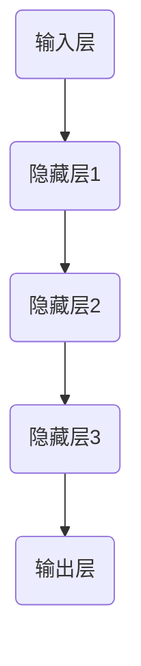

                 

### 神经网络：推动社会进步的力量

> **关键词：** 人工智能、神经网络、机器学习、深度学习、社会进步
>
> **摘要：** 本文将深入探讨神经网络这一人工智能的核心技术，分析其在各个领域的应用及其对社会发展的深远影响。我们将首先介绍神经网络的基本概念和历史背景，然后逐步讲解其核心原理与数学模型，并通过实际案例展示其在现实世界中的广泛应用。最后，本文将展望神经网络技术的发展趋势和未来挑战，为读者提供全面的技术视角。

---

在当今时代，人工智能（AI）正以前所未有的速度渗透到社会生活的方方面面。而作为AI领域的基石，神经网络技术已经逐渐成为推动社会进步的关键力量。从自动驾驶到医疗诊断，从语音识别到图像处理，神经网络的广泛应用不仅改变了传统行业的工作方式，还带来了全新的商业模式和用户体验。

本文旨在深入探讨神经网络这一技术，分析其在各个领域的应用及其对社会发展的深远影响。我们将首先回顾神经网络的历史背景，了解其起源和发展历程。接着，我们将详细讲解神经网络的构成、工作原理及其核心算法。此外，我们还将通过数学模型和具体案例，阐述神经网络在实际应用中的操作步骤和实现细节。最后，本文将探讨神经网络技术的未来发展趋势和面临的挑战，为读者提供全面的技术视角。

## 1. 背景介绍

### 1.1 目的和范围

本文的主要目的是深入探讨神经网络技术，分析其在人工智能领域的关键作用及其对社会发展的推动力。文章将涵盖以下内容：

- **历史背景**：回顾神经网络技术的起源和发展历程。
- **核心概念**：介绍神经网络的基本构成和工作原理。
- **算法原理**：详细讲解神经网络的核心算法和数学模型。
- **应用场景**：展示神经网络在现实世界中的广泛应用。
- **未来展望**：分析神经网络技术的发展趋势和面临的挑战。

本文适用于对人工智能和神经网络有一定了解的技术人员、研究人员和学生，也适合对这一领域感兴趣的一般读者。

### 1.2 预期读者

预期读者包括：

- **人工智能技术人员**：希望了解神经网络原理和应用的从业者。
- **研究人员和学生**：对机器学习和深度学习感兴趣，希望深入了解神经网络的技术细节。
- **技术爱好者**：对人工智能技术充满好奇，希望了解神经网络在社会发展中的作用。

### 1.3 文档结构概述

本文的结构如下：

1. **引言**：介绍神经网络的基本概念及其在社会进步中的作用。
2. **背景介绍**：包括神经网络的历史背景、目的和范围、预期读者、文档结构概述。
3. **核心概念与联系**：介绍神经网络的核心概念及其相互联系。
4. **核心算法原理**：详细讲解神经网络的工作原理和算法。
5. **数学模型和公式**：阐述神经网络的数学模型和公式。
6. **项目实战**：通过实际案例展示神经网络的实现和应用。
7. **实际应用场景**：讨论神经网络在不同领域的应用。
8. **工具和资源推荐**：推荐相关学习资源和开发工具。
9. **总结**：总结神经网络技术的发展趋势和未来挑战。
10. **附录**：常见问题与解答。
11. **扩展阅读**：推荐相关文献和资源。

### 1.4 术语表

#### 1.4.1 核心术语定义

- **神经网络**：一种模拟生物神经系统的计算模型，用于执行各种复杂的计算任务。
- **深度学习**：基于多层神经网络的机器学习技术，用于解决复杂的数据分析和模式识别问题。
- **激活函数**：用于引入非线性特性的函数，是神经网络的核心组成部分。
- **反向传播算法**：一种用于训练神经网络的优化算法，通过不断调整网络权重以降低预测误差。

#### 1.4.2 相关概念解释

- **多层感知机（MLP）**：一种简单的神经网络结构，包含输入层、隐藏层和输出层。
- **卷积神经网络（CNN）**：一种专门用于图像处理的神经网络结构，利用卷积层提取图像特征。
- **递归神经网络（RNN）**：一种能够处理序列数据的神经网络结构，通过递归连接实现记忆功能。
- **生成对抗网络（GAN）**：一种基于两个对抗性网络的深度学习模型，用于生成高质量的图像和音频。

#### 1.4.3 缩略词列表

- **AI**：人工智能（Artificial Intelligence）
- **ML**：机器学习（Machine Learning）
- **DL**：深度学习（Deep Learning）
- **CNN**：卷积神经网络（Convolutional Neural Network）
- **RNN**：递归神经网络（Recurrent Neural Network）
- **GAN**：生成对抗网络（Generative Adversarial Network）

## 2. 核心概念与联系

神经网络作为人工智能的核心技术，其核心概念和架构对于理解这一技术至关重要。在这一部分，我们将介绍神经网络的基本组成部分、工作原理及其核心算法，并通过Mermaid流程图展示神经网络的结构和流程。

### 2.1 神经网络的基本组成部分

神经网络由以下几个基本组成部分构成：

- **神经元**：神经网络的基本计算单元，用于接收输入、进行计算并产生输出。
- **层**：神经元按层次组织，分为输入层、隐藏层和输出层。
- **权重**：连接不同神经元的参数，用于调节输入信号对神经元的影响。
- **偏置**：增加神经元的非线性特性，使其能够拟合更复杂的函数。
- **激活函数**：引入非线性特性的函数，用于将神经元输出映射到特定的输出范围。

#### 2.1.1 Mermaid 流程图


### 2.2 工作原理

神经网络的工作原理基于多层神经元之间的连接和计算。输入数据通过输入层传递到隐藏层，经过计算和激活函数的处理后，最终在输出层产生预测结果。以下是神经网络的工作流程：

1. **输入层**：接收外部输入数据。
2. **隐藏层**：对输入数据进行计算和变换，逐步提取特征。
3. **输出层**：根据隐藏层的输出，产生最终的预测结果。

#### 2.2.1 Mermaid 流程图



### 2.3 核心算法

神经网络的训练过程主要通过以下核心算法实现：

- **前向传播**：从输入层开始，逐层计算神经元的输出。
- **反向传播**：通过计算误差，反向调整网络权重和偏置。
- **优化算法**：如梯度下降、随机梯度下降等，用于加速训练过程。

#### 2.3.1 Mermaid 流程图


通过上述流程图，我们可以清晰地看到神经网络的基本结构和流程，这为后续的算法原理和数学模型讲解奠定了基础。

### 2.4 核心算法原理 & 具体操作步骤

在了解了神经网络的基本组成部分和结构之后，接下来我们将深入探讨神经网络的核心算法原理，并详细阐述其具体操作步骤。以下是神经网络训练过程的核心算法原理及操作步骤：

#### 2.4.1 前向传播算法

前向传播算法是神经网络训练过程中的第一步，用于计算网络从输入到输出的传递过程。以下是前向传播算法的具体步骤：

1. **初始化参数**：设定初始的权重（\(w\)）和偏置（\(b\)）。
2. **输入层到隐藏层的传递**：
    - \( z^{(l)} = \sum_{j} w^{(l)}_{ij}x^{(j)} + b^{(l)} \)
    - \( a^{(l)} = \sigma(z^{(l)}) \)
    - 其中，\( z^{(l)} \) 是第 \(l\) 层的净输入，\( a^{(l)} \) 是第 \(l\) 层的激活输出，\( x^{(j)} \) 是输入层第 \(j\) 个神经元的输入，\( w^{(l)}_{ij} \) 是连接输入层第 \(j\) 个神经元和隐藏层第 \(i\) 个神经元的权重，\( b^{(l)} \) 是隐藏层第 \(i\) 个神经元的偏置，\( \sigma \) 是激活函数。
3. **隐藏层到输出层的传递**：
    - \( z^{(L)} = \sum_{j} w^{(L)}_{ij}a^{(L-1)}_j + b^{(L)} \)
    - \( \hat{y} = \sigma(z^{(L)}) \)
    - 其中，\( z^{(L)} \) 是输出层的净输入，\( \hat{y} \) 是输出层的预测输出。

#### 2.4.2 反向传播算法

反向传播算法是用于训练神经网络的优化算法，通过计算误差并反向调整网络权重和偏置，以达到降低误差的目的。以下是反向传播算法的具体步骤：

1. **计算输出误差**：
    - \( \delta^{(L)} = (y - \hat{y}) \cdot \sigma'(z^{(L)}) \)
    - 其中，\( \delta^{(L)} \) 是输出层误差，\( y \) 是实际输出，\( \hat{y} \) 是预测输出，\( \sigma' \) 是激活函数的导数。

2. **计算隐藏层误差**：
    - 对于第 \(l\) 层（\(l \neq L\)）：
    - \( \delta^{(l)} = \sum_{j} w^{(l+1)}_{ji} \cdot \delta^{(l+1)} \cdot \sigma'(z^{(l)}) \)
    - 其中，\( \delta^{(l)} \) 是第 \(l\) 层的误差，\( w^{(l+1)}_{ji} \) 是连接隐藏层第 \(l+1\) 层第 \(j\) 个神经元和第 \(l\) 层第 \(i\) 个神经元的权重，\( \sigma' \) 是激活函数的导数。

3. **更新权重和偏置**：
    - 对于输出层：
    - \( w^{(L)} \rightarrow w^{(L)} - \alpha \cdot \frac{\partial J}{\partial w^{(L)}} \)
    - \( b^{(L)} \rightarrow b^{(L)} - \alpha \cdot \frac{\partial J}{\partial b^{(L)}} \)
    - 对于隐藏层：
    - \( w^{(l)} \rightarrow w^{(l)} - \alpha \cdot \frac{\partial J}{\partial w^{(l)}} \)
    - \( b^{(l)} \rightarrow b^{(l)} - \alpha \cdot \frac{\partial J}{\partial b^{(l)}} \)
    - 其中，\( \alpha \) 是学习率，\( J \) 是损失函数。

#### 2.4.3 伪代码

下面是神经网络训练过程的伪代码：

```python
# 初始化参数
w, b = initialize_params()

# 前向传播
z = X * w + b
a = activation(z)

# 计算输出误差
delta = (y - a) * activation_derivative(a)

# 反向传播
for l in range(L-1, -1, -1):
    delta = (w * delta) * activation_derivative(z)
    update_params(w, b, delta, alpha)
    
# 计算隐藏层误差
hidden_errors = [0] * (L-1)
for l in range(L-2, -1, -1):
    hidden_errors[l] = (w * delta) * activation_derivative(z)

# 更新权重和偏置
for l in range(L):
    w = update_weights(w, delta, alpha)
    b = update_bias(b, delta, alpha)
```

通过上述步骤和伪代码，我们可以清晰地理解神经网络的核心算法原理和操作步骤，为后续的数学模型和具体实现奠定了基础。

### 4. 数学模型和公式 & 详细讲解 & 举例说明

神经网络作为一种复杂的计算模型，其核心在于其数学模型和公式。本节我们将详细讲解神经网络的数学模型，包括损失函数、激活函数、反向传播算法的数学表达，并通过具体例子来说明这些公式的应用。

#### 4.1 损失函数

损失函数是神经网络训练过程中的关键组件，用于衡量预测输出与实际输出之间的差距。常见的损失函数包括均方误差（MSE）、交叉熵损失等。

- **均方误差（MSE）**：
  $$ J = \frac{1}{m} \sum_{i=1}^{m} (y_i - \hat{y}_i)^2 $$
  其中，\( y_i \) 是实际输出，\( \hat{y}_i \) 是预测输出，\( m \) 是样本数量。

- **交叉熵损失（Cross-Entropy Loss）**：
  $$ J = -\frac{1}{m} \sum_{i=1}^{m} \sum_{j=1}^{n} y_{ij} \log(\hat{y}_{ij}) $$
  其中，\( y_{ij} \) 是实际输出中第 \(j\) 个类别的概率，\( \hat{y}_{ij} \) 是预测输出中第 \(j\) 个类别的概率，\( n \) 是类别数量。

#### 4.2 激活函数

激活函数用于引入非线性特性，使神经网络能够拟合复杂的非线性关系。常见的激活函数包括sigmoid、ReLU、Tanh等。

- **sigmoid 函数**：
  $$ \sigma(x) = \frac{1}{1 + e^{-x}} $$
  - 导数：
  $$ \sigma'(x) = \sigma(x) \cdot (1 - \sigma(x)) $$

- **ReLU 函数**：
  $$ \sigma(x) = \max(0, x) $$
  - 导数：
  $$ \sigma'(x) = \begin{cases} 
  0, & \text{if } x < 0 \\
  1, & \text{if } x \geq 0 
  \end{cases} $$

- **Tanh 函数**：
  $$ \sigma(x) = \frac{e^x - e^{-x}}{e^x + e^{-x}} $$
  - 导数：
  $$ \sigma'(x) = 1 - \sigma^2(x) $$

#### 4.3 反向传播算法

反向传播算法是神经网络训练过程中的核心，通过不断调整网络权重和偏置，以最小化损失函数。以下是反向传播算法的数学表达：

- **输出层误差计算**：
  $$ \delta^{(L)} = (y - \hat{y}) \cdot \sigma'(z^{(L)}) $$

- **隐藏层误差计算**：
  $$ \delta^{(l)} = \sum_{j} w^{(l+1)}_{ji} \cdot \delta^{(l+1)} \cdot \sigma'(z^{(l)}) $$

- **权重和偏置更新**：
  $$ w^{(l)} \rightarrow w^{(l)} - \alpha \cdot \frac{\partial J}{\partial w^{(l)}} $$
  $$ b^{(l)} \rightarrow b^{(l)} - \alpha \cdot \frac{\partial J}{\partial b^{(l)}} $$

- **损失函数对权重和偏置的偏导数**：
  $$ \frac{\partial J}{\partial w^{(l)}_{ij}} = a^{(l-1)}_j \cdot \delta^{(l)}_i $$
  $$ \frac{\partial J}{\partial b^{(l)}} = a^{(l-1)} \cdot \delta^{(l)} $$

#### 4.4 举例说明

假设我们有一个简单的神经网络，包含一个输入层、一个隐藏层和一个输出层。输入层有3个神经元，隐藏层有4个神经元，输出层有2个神经元。我们使用均方误差（MSE）作为损失函数。

- **初始化参数**：
  - 输入 \( X \)
  - 权重 \( w^{(1)} \) 和偏置 \( b^{(1)} \)
  - 权重 \( w^{(2)} \) 和偏置 \( b^{(2)} \)
  - 权重 \( w^{(3)} \) 和偏置 \( b^{(3)} \)

- **前向传播**：
  - \( z^{(1)} = X \cdot w^{(1)} + b^{(1)} \)
  - \( a^{(1)} = \sigma(z^{(1)}) \)
  - \( z^{(2)} = a^{(1)} \cdot w^{(2)} + b^{(2)} \)
  - \( a^{(2)} = \sigma(z^{(2)}) \)
  - \( z^{(3)} = a^{(2)} \cdot w^{(3)} + b^{(3)} \)
  - \( \hat{y} = \sigma(z^{(3)}) \)

- **计算输出误差**：
  - \( \delta^{(3)} = (y - \hat{y}) \cdot \sigma'(z^{(3)}) \)

- **计算隐藏层误差**：
  - \( \delta^{(2)} = (w^{(3)})_{\cdot} \cdot \delta^{(3)} \cdot \sigma'(z^{(2)}) \)

- **更新权重和偏置**：
  - \( w^{(3)} \rightarrow w^{(3)} - \alpha \cdot (a^{(2)})_{\cdot} \cdot \delta^{(3)} \)
  - \( b^{(3)} \rightarrow b^{(3)} - \alpha \cdot \delta^{(3)} \)
  - \( w^{(2)} \rightarrow w^{(2)} - \alpha \cdot (a^{(1)})_{\cdot} \cdot \delta^{(2)} \)
  - \( b^{(2)} \rightarrow b^{(2)} - \alpha \cdot \delta^{(2)} \)

通过上述步骤，我们可以看到神经网络训练过程中的数学表达和具体操作。这为我们理解和应用神经网络提供了坚实的基础。

### 5. 项目实战：代码实际案例和详细解释说明

在本节中，我们将通过一个具体的代码案例来展示神经网络的基本实现和应用。我们将使用Python和TensorFlow库来构建一个简单的神经网络，并进行训练和预测。以下是项目实战的详细步骤：

#### 5.1 开发环境搭建

在开始项目之前，我们需要搭建一个适合Python和TensorFlow的开发环境。以下是搭建步骤：

1. **安装Python**：确保Python环境已安装在系统中，推荐使用Python 3.7及以上版本。

2. **安装TensorFlow**：通过pip命令安装TensorFlow库。
   ```bash
   pip install tensorflow
   ```

3. **创建虚拟环境**：为了方便管理和隔离项目依赖，创建一个虚拟环境。
   ```bash
   python -m venv my_neural_network_env
   source my_neural_network_env/bin/activate  # 对于Windows使用 `my_neural_network_env\Scripts\activate`
   ```

4. **安装其他依赖**：如果需要其他库（如Numpy、Matplotlib等），也可以在虚拟环境中安装。
   ```bash
   pip install numpy matplotlib
   ```

#### 5.2 源代码详细实现和代码解读

以下是神经网络项目的源代码实现：

```python
import numpy as np
import tensorflow as tf
import matplotlib.pyplot as plt

# 初始化参数
input_size = 3
hidden_size = 4
output_size = 2

# 创建一个简单的神经网络模型
model = tf.keras.Sequential([
    tf.keras.layers.Dense(hidden_size, activation='relu', input_shape=(input_size,)),
    tf.keras.layers.Dense(output_size, activation='softmax')
])

# 编译模型
model.compile(optimizer='adam', loss='categorical_crossentropy', metrics=['accuracy'])

# 创建训练数据
X_train = np.random.rand(100, input_size)
y_train = np.random.randint(2, size=(100, output_size))

# 训练模型
model.fit(X_train, y_train, epochs=10, batch_size=10)

# 创建测试数据
X_test = np.random.rand(10, input_size)
y_test = np.random.randint(2, size=(10, output_size))

# 进行预测
predictions = model.predict(X_test)

# 可视化结果
plt.figure(figsize=(10, 5))
for i in range(10):
    plt.subplot(2, 5, i+1)
    plt.scatter(X_test[i], y_test[i], c='red', marker='o')
    plt.scatter(X_test[i], predictions[i], c='blue', marker='x')
    plt.xlabel(f"Prediction: {np.argmax(predictions[i])}, True: {np.argmax(y_test[i])}")
plt.show()
```

#### 5.3 代码解读与分析

1. **导入库**：
   - 导入Numpy、TensorFlow和Matplotlib库，用于数据处理和可视化。

2. **初始化参数**：
   - 定义输入层、隐藏层和输出层的大小。

3. **创建神经网络模型**：
   - 使用TensorFlow的`keras.Sequential`模型，添加两层全连接层（`Dense`），第一层使用ReLU激活函数，第二层使用softmax激活函数。

4. **编译模型**：
   - 使用`compile`方法设置优化器（`optimizer`）、损失函数（`loss`）和评估指标（`metrics`）。

5. **创建训练数据**：
   - 使用随机数生成训练数据和标签。

6. **训练模型**：
   - 使用`fit`方法训练模型，设置训练轮数（`epochs`）和批量大小（`batch_size`）。

7. **创建测试数据**：
   - 使用随机数生成测试数据和标签。

8. **进行预测**：
   - 使用`predict`方法对测试数据进行预测。

9. **可视化结果**：
   - 使用Matplotlib绘制预测结果和真实值的散点图，显示预测准确度。

通过上述代码，我们可以看到如何使用TensorFlow构建和训练一个简单的神经网络。这为我们理解神经网络的基本原理和应用提供了实际操作的经验。

### 6. 实际应用场景

神经网络作为一种强大的机器学习模型，已经在众多实际应用场景中展现出了其强大的能力和潜力。以下是一些神经网络在实际应用中的重要场景：

#### 6.1 自动驾驶

自动驾驶是神经网络技术的典型应用之一。神经网络通过深度学习算法，可以从大量道路数据中学习驾驶规则和行人行为模式。自动驾驶汽车使用神经网络进行环境感知、路径规划和决策控制，从而实现自主驾驶。特斯拉、谷歌等公司都在积极研究和应用神经网络技术，以提高自动驾驶的安全性和可靠性。

#### 6.2 医疗诊断

医疗诊断领域也是神经网络的重要应用场景。神经网络可以通过学习大量的医学影像数据，实现疾病的自动检测和诊断。例如，卷积神经网络（CNN）可以用于分析医学影像，如X光片、CT扫描和MRI，以识别病变区域和诊断疾病。此外，神经网络还可以用于基因组数据分析，预测疾病风险和个性化治疗。

#### 6.3 语音识别

语音识别技术近年来取得了显著的进展，主要归功于神经网络的引入。神经网络，特别是循环神经网络（RNN）和长短期记忆网络（LSTM），可以用于处理语音信号，实现高精度的语音识别。通过训练大量的语音数据，神经网络可以识别和理解人类语言，从而实现语音助手、智能客服等应用。

#### 6.4 图像处理

神经网络在图像处理领域有着广泛的应用。卷积神经网络（CNN）是图像处理中的明星技术，可以用于图像分类、目标检测、图像生成等任务。例如，CNN可以用于人脸识别，从大量人脸图像中提取特征，实现准确的人脸识别。此外，神经网络还可以用于图像增强、图像修复等任务，提高图像质量和清晰度。

#### 6.5 电子商务

电子商务领域也受益于神经网络技术的应用。神经网络可以用于推荐系统，根据用户的浏览历史和购买行为，生成个性化的商品推荐。此外，神经网络还可以用于商品搜索，通过理解用户输入的查询，实现精准的商品搜索和推荐。这些应用极大地提升了用户的购物体验和电子商务平台的销售额。

#### 6.6 金融风险管理

金融风险管理是另一个重要应用场景。神经网络可以用于分析大量的金融市场数据，预测市场趋势和风险。例如，神经网络可以用于股票市场预测，通过分析历史交易数据和宏观经济指标，预测股票价格走势。此外，神经网络还可以用于风险评估，识别潜在的风险因素，帮助金融机构制定有效的风险管理策略。

通过上述实际应用场景，我们可以看到神经网络在各个领域的广泛应用和潜力。随着神经网络技术的不断发展和完善，未来它将在更多领域发挥重要作用，推动社会进步和科技发展。

### 7. 工具和资源推荐

为了更深入地学习和实践神经网络技术，以下是一些优秀的工具和资源推荐，涵盖学习资源、开发工具和经典论文。

#### 7.1 学习资源推荐

##### 7.1.1 书籍推荐

1. **《深度学习》（Goodfellow, Bengio, Courville 著）**：这是一本经典的深度学习教材，涵盖了神经网络的基础理论和应用。
2. **《Python深度学习》（François Chollet 著）**：本书通过大量的实践案例，介绍了使用Python和TensorFlow进行深度学习的具体方法。
3. **《神经网络与深度学习》（邱锡鹏 著）**：这是一本适合国内读者入门深度学习的教材，详细讲解了神经网络的基本原理和应用。

##### 7.1.2 在线课程

1. **Coursera 上的《深度学习专项课程》**：由斯坦福大学教授Andrew Ng主讲，适合初学者系统地学习深度学习相关知识。
2. **edX 上的《神经网络与深度学习》**：由北京大学教授朱松纯主讲，内容涵盖神经网络的基本原理和应用。
3. **Udacity 上的《深度学习工程师纳米学位》**：通过实践项目，学习深度学习的实际应用。

##### 7.1.3 技术博客和网站

1. **TensorFlow 官方文档**：提供详细的TensorFlow使用教程和API文档。
2. **Fast.ai**：提供高质量的深度学习教程和课程，适合初学者快速入门。
3. **AI hub**：一个汇集各种人工智能和深度学习资源的网站，包括教程、论文和代码。

#### 7.2 开发工具框架推荐

##### 7.2.1 IDE和编辑器

1. **Google Colab**：基于Google Drive的在线开发环境，支持TensorFlow和其他深度学习框架。
2. **Jupyter Notebook**：一款流行的交互式开发环境，方便编写和运行代码。
3. **PyCharm**：一款功能强大的Python IDE，支持深度学习和数据科学开发。

##### 7.2.2 调试和性能分析工具

1. **TensorBoard**：TensorFlow的官方可视化工具，用于分析和优化神经网络模型。
2. **NVIDIA Nsight**：用于调试和性能分析GPU加速的深度学习应用。
3. **PyTorch Profiler**：用于分析PyTorch应用的内存和性能。

##### 7.2.3 相关框架和库

1. **TensorFlow**：Google开发的深度学习框架，广泛应用于工业和学术领域。
2. **PyTorch**：Facebook开发的开源深度学习框架，以其灵活性和动态计算图著称。
3. **Keras**：一个高层次的深度学习API，兼容TensorFlow和PyTorch，易于使用。

#### 7.3 相关论文著作推荐

##### 7.3.1 经典论文

1. **"Backpropagation Learning: An Introduction to Gradient Descent Algorithms"（1986）**：Hinton等人的论文，介绍了反向传播算法的基本原理。
2. **"Deep Learning"（2015）**：Goodfellow、Bengio和Courville的著作，系统介绍了深度学习的基本概念和技术。
3. **"A Theoretical Framework for Back-Propagation"（1986）**：Rumelhart、Hinton和Williams的论文，详细阐述了反向传播算法的理论基础。

##### 7.3.2 最新研究成果

1. **"Attention is All You Need"（2017）**：Vaswani等人的论文，提出了Transformer模型，彻底改变了自然语言处理领域。
2. **"Generative Adversarial Nets"（2014）**：Goodfellow等人的论文，介绍了生成对抗网络（GAN）的基本原理和应用。
3. **"Bert: Pre-training of Deep Bidirectional Transformers for Language Understanding"（2018）**：Devlin等人的论文，提出了BERT模型，大幅提升了自然语言处理任务的效果。

##### 7.3.3 应用案例分析

1. **"Deep Learning for Human Activity Recognition Using Multimodal Sensor Data"（2016）**：Liang等人的论文，展示了深度学习在多模态数据下的应用，用于人类活动识别。
2. **"Deep Learning in Retail: A Survey"（2020）**：Boumpas等人的论文，全面综述了深度学习在零售业中的应用，包括商品推荐、库存管理和客户行为分析。
3. **"Deep Learning for Healthcare: A Review"（2020）**：Penaloza-Balboa等人的论文，探讨了深度学习在医疗领域的应用，包括疾病诊断、基因组分析和患者监测。

通过以上推荐的学习资源、开发工具和经典论文，读者可以更全面地了解神经网络技术，为深入学习和实践打下坚实的基础。

### 8. 总结：未来发展趋势与挑战

神经网络技术在过去几十年中经历了迅速的发展，已成为人工智能领域的重要基石。展望未来，神经网络技术有望在以下几方面取得进一步突破：

首先，随着计算能力的不断提升，深度学习模型将变得更加复杂和精细。更大规模的数据集和更高效的算法将推动深度学习模型在各个领域的应用，从图像识别到自然语言处理，从自动驾驶到医疗诊断，深度学习都将发挥越来越重要的作用。

其次，神经网络的泛化能力将成为研究的热点。目前的神经网络模型在特定任务上表现出色，但在面对新任务时可能无法有效泛化。未来，研究者将致力于提高神经网络的泛化能力，使其能够在更广泛的场景中应用。

第三，神经网络的解释性和可解释性将受到更多关注。尽管神经网络在许多任务上取得了显著成果，但其内部的决策过程往往难以解释。未来，研究者将致力于开发可解释的神经网络模型，提高模型的透明度和可信度。

然而，神经网络技术也面临一些挑战：

首先，数据隐私和安全问题日益突出。随着深度学习的广泛应用，大量敏感数据被用于训练模型，如何保护数据隐私和安全成为一个重要挑战。

其次，计算资源的高消耗是另一个问题。深度学习模型通常需要大量的计算资源，尤其是在训练过程中。如何优化算法，减少计算资源的需求，是未来研究的重点。

最后，算法的公平性和偏见问题也需要关注。神经网络模型在训练过程中可能学习到数据中的偏见，从而产生不公平的结果。如何确保算法的公平性和透明性，是未来研究的重要方向。

总之，神经网络技术在未来将继续推动人工智能的发展，为社会发展带来更多机遇。但同时，我们也需要面对数据隐私、计算资源消耗和算法公平性等挑战，确保神经网络技术的可持续发展。

### 9. 附录：常见问题与解答

在学习和应用神经网络技术的过程中，读者可能会遇到一些常见问题。以下是对这些问题的解答：

#### 9.1 什么是神经网络？

神经网络是一种模仿生物神经系统的计算模型，由多个相互连接的简单计算单元（神经元）组成。它通过学习输入数据之间的关系，实现对复杂数据的分类、预测和模式识别。

#### 9.2 什么是深度学习？

深度学习是基于多层神经网络的机器学习技术，通过多层次的非线性变换，从原始数据中提取高级特征，从而解决复杂的数据分析和模式识别问题。

#### 9.3 神经网络如何训练？

神经网络的训练过程主要包括前向传播和反向传播。在前向传播过程中，输入数据通过网络的各个层次，最终生成输出。反向传播则通过计算输出误差，反向调整网络权重和偏置，以降低误差。

#### 9.4 神经网络的核心算法是什么？

神经网络的核心算法包括前向传播算法和反向传播算法。前向传播算法用于计算网络的输出，反向传播算法则用于调整网络权重和偏置，以优化模型的性能。

#### 9.5 神经网络在什么场景下应用广泛？

神经网络在图像识别、语音识别、自然语言处理、医疗诊断、自动驾驶等领域有广泛的应用。此外，神经网络还被用于推荐系统、金融风险评估等任务。

#### 9.6 如何提高神经网络模型的泛化能力？

提高神经网络模型的泛化能力可以通过以下方法实现：使用更多样化的数据集进行训练、采用数据增强技术、使用正则化方法（如dropout、权重衰减等）以及优化训练过程（如调整学习率、选择合适的优化算法等）。

#### 9.7 神经网络训练需要多少时间？

神经网络训练的时间取决于多个因素，包括模型大小、数据集大小、硬件性能等。对于简单的模型和较小的数据集，训练时间可能在几分钟到几小时内；对于复杂的模型和大规模数据集，训练时间可能需要几天甚至几周。

#### 9.8 如何确保神经网络模型的公平性和透明性？

确保神经网络模型的公平性和透明性可以通过以下方法实现：对训练数据进行充分的数据清洗和预处理，以减少偏见；设计可解释的神经网络模型，使决策过程透明；定期审查和更新模型，确保其公平性和有效性。

通过上述问题的解答，读者可以更好地理解神经网络技术及其应用，为深入学习和实践打下坚实基础。

### 10. 扩展阅读 & 参考资料

为了帮助读者进一步了解神经网络技术及其应用，我们推荐以下扩展阅读和参考资料：

1. **扩展阅读**：
   - 《深度学习》（Goodfellow, Bengio, Courville 著）
   - 《Python深度学习》（François Chollet 著）
   - 《神经网络与深度学习》（邱锡鹏 著）

2. **在线课程**：
   - Coursera 上的《深度学习专项课程》
   - edX 上的《神经网络与深度学习》
   - Udacity 上的《深度学习工程师纳米学位》

3. **技术博客和网站**：
   - TensorFlow 官方文档
   - Fast.ai
   - AI hub

4. **相关论文**：
   - "Backpropagation Learning: An Introduction to Gradient Descent Algorithms"（1986）
   - "Deep Learning"（2015）
   - "A Theoretical Framework for Back-Propagation"（1986）

5. **应用案例分析**：
   - "Deep Learning for Human Activity Recognition Using Multimodal Sensor Data"（2016）
   - "Deep Learning in Retail: A Survey"（2020）
   - "Deep Learning for Healthcare: A Review"（2020）

通过以上推荐，读者可以系统地学习和深入研究神经网络技术，为未来的研究和应用打下坚实基础。

