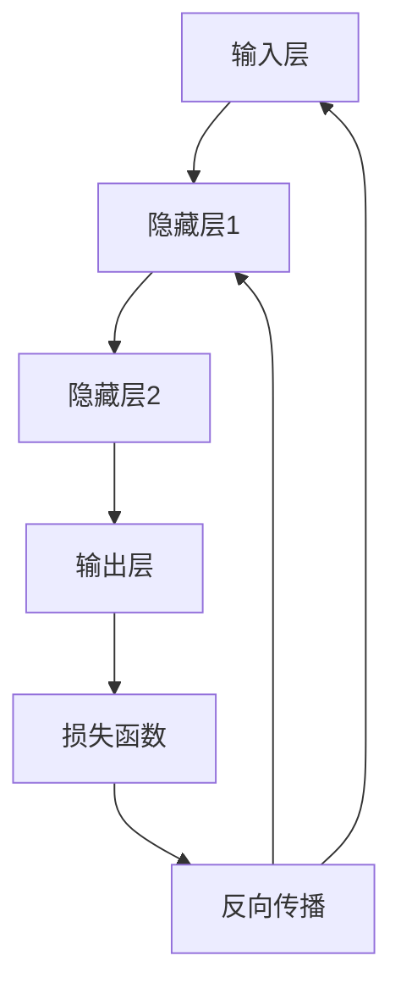

                 

# 神经网络：改变世界的技术

> **关键词：**神经网络，深度学习，机器学习，人工智能，算法，架构，实践应用
>
> **摘要：**本文将深入探讨神经网络这一颠覆性的技术，从基础概念到实际应用，逐步分析其原理、数学模型和实战案例，展望其在未来可能的发展趋势与挑战。

## 1. 背景介绍

### 1.1 目的和范围

本文旨在为读者提供一个关于神经网络的全面概述，从基本概念到实际应用，以帮助读者更好地理解这一改变世界的技术。文章将涵盖以下内容：

1. 神经网络的历史与发展
2. 核心概念与联系
3. 核心算法原理与具体操作步骤
4. 数学模型和公式的详细讲解
5. 项目实战与代码实现
6. 实际应用场景
7. 工具和资源推荐
8. 总结与未来发展趋势

### 1.2 预期读者

本文面向对人工智能和机器学习有一定基础的读者，包括但不限于：

1. AI研究人员和工程师
2. 数据科学家和分析师
3. 软件开发者和架构师
4. 对人工智能技术感兴趣的学生和学者

### 1.3 文档结构概述

本文将按照以下结构进行组织：

1. 引言与背景介绍
2. 核心概念与联系
3. 核心算法原理与具体操作步骤
4. 数学模型和公式的详细讲解
5. 项目实战与代码实现
6. 实际应用场景
7. 工具和资源推荐
8. 总结与未来发展趋势
9. 附录：常见问题与解答
10. 扩展阅读与参考资料

### 1.4 术语表

#### 1.4.1 核心术语定义

- **神经网络（Neural Network）**：一种模仿生物神经系统的计算模型，用于处理复杂数据和分析问题。
- **深度学习（Deep Learning）**：一种基于神经网络的机器学习技术，通过多层神经网络进行数据处理和模式识别。
- **机器学习（Machine Learning）**：一种人工智能技术，通过训练算法从数据中自动学习规律和模式。
- **算法（Algorithm）**：解决问题的步骤和规则，用于指导计算机完成特定任务。
- **架构（Architecture）**：神经网络的设计和结构，包括网络层次、节点连接方式等。

#### 1.4.2 相关概念解释

- **前向传播（Forward Propagation）**：神经网络中数据从输入层传递到输出层的过程。
- **反向传播（Back Propagation）**：神经网络中根据输出误差，反向调整权重和偏置的过程。
- **激活函数（Activation Function）**：用于引入非线性变换，使神经网络能够处理复杂数据。

#### 1.4.3 缩略词列表

- **ANN**：人工神经网络（Artificial Neural Network）
- **DL**：深度学习（Deep Learning）
- **ML**：机器学习（Machine Learning）
- **NN**：神经网络（Neural Network）
- **SGD**：随机梯度下降（Stochastic Gradient Descent）

## 2. 核心概念与联系

神经网络的运作原理和架构是其核心技术之一。为了更好地理解这些概念，我们首先需要了解神经网络的基本组成部分及其相互关系。

### 2.1 神经元结构

神经元是神经网络的基本计算单元。一个神经元通常包括以下几个部分：

- **输入层（Input Layer）**：接收外部数据。
- **权重（Weights）**：用于调节输入信号的重要性。
- **偏置（Bias）**：用于引入非线性。
- **激活函数（Activation Function）**：引入非线性变换。
- **输出层（Output Layer）**：输出处理结果。


### 2.2 神经网络层次

神经网络通常由多个层次组成，包括输入层、隐藏层和输出层。隐藏层的数量和深度对神经网络性能有重要影响。


### 2.3 网络连接方式

神经网络的连接方式包括全连接（Fully Connected）和卷积（Convolutional）等。

- **全连接神经网络（FCNN）**：每个神经元都与前一层中的所有神经元相连。
- **卷积神经网络（CNN）**：通过卷积操作提取图像中的局部特征。


### 2.4 前向传播与反向传播

神经网络的工作原理主要分为前向传播和反向传播两个过程。

- **前向传播**：输入数据通过网络层传输，每一层的输出作为下一层的输入，直到输出层得到最终结果。
- **反向传播**：根据输出误差，反向调整网络中的权重和偏置，以优化网络性能。


### 2.5 激活函数

激活函数是神经网络中的关键部分，用于引入非线性变换，使神经网络能够处理复杂数据。

- **Sigmoid函数**：将输入映射到(0,1)区间，有助于平滑梯度。
- **ReLU函数**：引入非线性，提高训练速度。
- **Tanh函数**：将输入映射到(-1,1)区间，有助于提高网络性能。


### 2.6 模型评估与优化

神经网络模型的性能通常通过以下指标进行评估：

- **准确率（Accuracy）**：分类问题中正确分类的样本比例。
- **损失函数（Loss Function）**：用于衡量模型预测值与真实值之间的差距。
- **优化算法（Optimization Algorithm）**：用于调整网络权重和偏置，以优化模型性能。


### 2.7 Mermaid 流程图

下面是一个简化的神经网络流程图，展示了数据在前向传播和反向传播过程中的流动。



## 3. 核心算法原理 & 具体操作步骤

神经网络的核心算法包括前向传播和反向传播。以下将详细介绍这两个过程的具体操作步骤。

### 3.1 前向传播

前向传播是指数据从输入层传递到输出层的过程。具体步骤如下：

1. **初始化权重和偏置**：随机初始化网络中的权重和偏置。
2. **输入数据**：将输入数据输入到输入层。
3. **计算输入层输出**：每个输入神经元将数据传递给连接的隐藏层神经元，并计算每个隐藏层神经元的输入值。
4. **激活函数应用**：对每个隐藏层神经元的输入值应用激活函数，得到输出值。
5. **传递到下一层**：将隐藏层输出传递到下一层，直到输出层。
6. **计算损失**：使用损失函数计算输出层输出与真实值之间的差距。

### 3.2 反向传播

反向传播是指根据输出误差，反向调整网络中的权重和偏置的过程。具体步骤如下：

1. **计算梯度**：对损失函数关于网络权重和偏置的梯度进行计算。
2. **权重和偏置更新**：根据梯度大小和优化算法，更新网络中的权重和偏置。
3. **重复迭代**：重复前向传播和反向传播过程，直到网络性能达到预期或达到最大迭代次数。

### 3.3 伪代码

以下是一个简化的前向传播和反向传播算法的伪代码：

```python
# 前向传播
for each layer in network:
    for each neuron in layer:
        neuron.input = sum(weight * prev_neuron.output for prev_neuron in prev_layer)
        neuron.output = activation_function(neuron.input)

# 反向传播
for each layer in network (in reverse order):
    for each neuron in layer:
        neuron.error = (expected_output - neuron.output) * activation_derivative(neuron.output)
        for prev_neuron in prev_layer:
            weight_derivative = prev_neuron.output * neuron.error
            weight_update = learning_rate * weight_derivative
            weight[prev_neuron, neuron] += weight_update
```

## 4. 数学模型和公式 & 详细讲解 & 举例说明

神经网络的数学模型是理解其工作原理和优化过程的关键。以下将介绍神经网络的数学模型，包括激活函数、损失函数和优化算法。

### 4.1 激活函数

激活函数是神经网络中引入非线性变换的重要组成部分。常见的激活函数包括：

- **Sigmoid函数**：\( f(x) = \frac{1}{1 + e^{-x}} \)
- **ReLU函数**：\( f(x) = \max(0, x) \)
- **Tanh函数**：\( f(x) = \frac{e^x - e^{-x}}{e^x + e^{-x}} \)

这些函数具有不同的性质，适用于不同的应用场景。

### 4.2 损失函数

损失函数是衡量模型预测值与真实值之间差距的指标。常见的损失函数包括：

- **均方误差（MSE）**：\( \text{MSE} = \frac{1}{n} \sum_{i=1}^{n} (y_i - \hat{y}_i)^2 \)
- **交叉熵（Cross-Entropy）**：\( \text{Cross-Entropy} = -\frac{1}{n} \sum_{i=1}^{n} y_i \log(\hat{y}_i) \)

这些函数具有不同的特点，适用于不同的分类和回归任务。

### 4.3 优化算法

优化算法是用于调整网络权重和偏置，以优化模型性能的方法。常见的优化算法包括：

- **随机梯度下降（SGD）**：\( \theta = \theta - \alpha \frac{\partial J(\theta)}{\partial \theta} \)
- **动量优化（Momentum）**：\( \theta = \theta - \alpha \frac{\partial J(\theta)}{\partial \theta} + \beta (1 - \alpha) \frac{\partial J(\theta)}{\partial \theta}_{\text{prev}} \)
- **Adam优化器**：\( \theta = \theta - \alpha \frac{m}{\sqrt{v} + \epsilon} \)

这些算法具有不同的收敛速度和稳定性，适用于不同的训练场景。

### 4.4 举例说明

假设我们有一个简单的神经网络，用于对输入数据 \( x \) 进行二分类预测。输入层有1个神经元，隐藏层有2个神经元，输出层有1个神经元。我们选择Sigmoid函数作为激活函数，MSE作为损失函数，SGD作为优化算法。

1. **初始化参数**：随机初始化网络中的权重和偏置。
2. **前向传播**：
   - 输入层输出：\( z_1 = x \)
   - 隐藏层1输出：\( z_2 = \sigma(w_{21} \cdot z_1 + b_2) \)
   - 隐藏层2输出：\( z_3 = \sigma(w_{31} \cdot z_2 + w_{32} \cdot z_1 + b_3) \)
   - 输出层输出：\( z_4 = \sigma(w_{41} \cdot z_3 + w_{42} \cdot z_2 + b_4) \)
3. **计算损失**：
   - \( J = \frac{1}{2} (y - z_4)^2 \)
4. **反向传播**：
   - 输出层误差：\( \delta_4 = (y - z_4) \cdot \sigma'(z_4) \)
   - 隐藏层2误差：\( \delta_3 = w_{41} \cdot \delta_4 \cdot \sigma'(z_3) + w_{42} \cdot \delta_4 \cdot \sigma'(z_2) \)
   - 隐藏层1误差：\( \delta_2 = w_{31} \cdot \delta_3 \cdot \sigma'(z_2) + w_{32} \cdot \delta_3 \cdot \sigma'(z_1) \)
5. **更新参数**：
   - \( w_{41} = w_{41} - \alpha \cdot \delta_4 \cdot z_3 \)
   - \( w_{42} = w_{42} - \alpha \cdot \delta_4 \cdot z_2 \)
   - \( w_{31} = w_{31} - \alpha \cdot \delta_3 \cdot z_2 \)
   - \( w_{32} = w_{32} - \alpha \cdot \delta_3 \cdot z_1 \)
   - \( b_4 = b_4 - \alpha \cdot \delta_4 \)
   - \( b_3 = b_3 - \alpha \cdot \delta_3 \)
   - \( b_2 = b_2 - \alpha \cdot \delta_2 \)

通过以上步骤，我们可以不断优化神经网络的参数，使其在训练数据上的性能不断提高。

## 5. 项目实战：代码实际案例和详细解释说明

为了更好地理解神经网络的工作原理和应用，我们将在本节中介绍一个简单的神经网络项目，并详细解释其代码实现。

### 5.1 开发环境搭建

在开始项目之前，我们需要搭建一个适合开发神经网络的环境。以下是推荐的开发工具和框架：

- **Python**：一种流行的编程语言，支持各种神经网络库和框架。
- **PyTorch**：一种流行的深度学习框架，具有高度灵活性和易用性。
- **Jupyter Notebook**：一种交互式开发环境，方便代码编写和调试。

安装这些工具后，我们就可以开始编写神经网络代码了。

### 5.2 源代码详细实现和代码解读

下面是一个简单的神经网络项目，用于实现手写数字识别。

```python
import torch
import torch.nn as nn
import torch.optim as optim

# 创建神经网络模型
class SimpleNN(nn.Module):
    def __init__(self):
        super(SimpleNN, self).__init__()
        self.fc1 = nn.Linear(784, 256)
        self.fc2 = nn.Linear(256, 128)
        self.fc3 = nn.Linear(128, 10)
        self.relu = nn.ReLU()

    def forward(self, x):
        x = self.relu(self.fc1(x))
        x = self.relu(self.fc2(x))
        x = self.fc3(x)
        return x

# 初始化模型、损失函数和优化器
model = SimpleNN()
criterion = nn.CrossEntropyLoss()
optimizer = optim.SGD(model.parameters(), lr=0.001)

# 加载数据集并拆分为训练集和测试集
train_loader = torch.utils.data.DataLoader(MNIST('./data', train=True, download=True, transform=ToTensor()), batch_size=64, shuffle=True)
test_loader = torch.utils.data.DataLoader(MNIST('./data', train=False, transform=ToTensor()), batch_size=1000, shuffle=False)

# 训练模型
for epoch in range(10):
    running_loss = 0.0
    for i, (inputs, labels) in enumerate(train_loader):
        optimizer.zero_grad()
        outputs = model(inputs)
        loss = criterion(outputs, labels)
        loss.backward()
        optimizer.step()
        running_loss += loss.item()
    print(f'Epoch {epoch+1}, Loss: {running_loss/len(train_loader)}')

# 测试模型
with torch.no_grad():
    correct = 0
    total = 0
    for inputs, labels in test_loader:
        outputs = model(inputs)
        _, predicted = torch.max(outputs.data, 1)
        total += labels.size(0)
        correct += (predicted == labels).sum().item()
    print(f'Accuracy: {100 * correct / total}%')

# 保存模型
torch.save(model.state_dict(), 'simple_nn.pth')
```

代码解读：

1. **定义神经网络模型**：使用PyTorch定义一个简单的神经网络，包括一个输入层、两个隐藏层和一个输出层。输入层有784个神经元，隐藏层分别为256个和128个神经元，输出层有10个神经元（对应10个数字）。
2. **初始化模型、损失函数和优化器**：使用交叉熵损失函数和随机梯度下降优化器。
3. **加载数据集**：使用MNIST数据集，拆分为训练集和测试集。
4. **训练模型**：使用训练数据训练模型，包括前向传播、计算损失、反向传播和参数更新。
5. **测试模型**：使用测试数据评估模型性能。
6. **保存模型**：将训练好的模型保存为`simple_nn.pth`文件。

### 5.3 代码解读与分析

下面是对代码的详细解读和分析：

1. **定义神经网络模型**：
   ```python
   class SimpleNN(nn.Module):
       def __init__(self):
           super(SimpleNN, self).__init__()
           self.fc1 = nn.Linear(784, 256)
           self.fc2 = nn.Linear(256, 128)
           self.fc3 = nn.Linear(128, 10)
           self.relu = nn.ReLU()

       def forward(self, x):
           x = self.relu(self.fc1(x))
           x = self.relu(self.fc2(x))
           x = self.fc3(x)
           return x
   ```
   在这个模型中，我们定义了一个简单的全连接神经网络，包括一个输入层、两个隐藏层和一个输出层。输入层有784个神经元，隐藏层分别为256个和128个神经元，输出层有10个神经元。

2. **初始化模型、损失函数和优化器**：
   ```python
   model = SimpleNN()
   criterion = nn.CrossEntropyLoss()
   optimizer = optim.SGD(model.parameters(), lr=0.001)
   ```
   我们初始化了一个简单的神经网络模型，并选择交叉熵损失函数和随机梯度下降优化器。

3. **加载数据集**：
   ```python
   train_loader = torch.utils.data.DataLoader(MNIST('./data', train=True, download=True, transform=ToTensor()), batch_size=64, shuffle=True)
   test_loader = torch.utils.data.DataLoader(MNIST('./data', train=False, transform=ToTensor()), batch_size=1000, shuffle=False)
   ```
   我们使用MNIST数据集，拆分为训练集和测试集。每个批次包含64个训练样本，每个测试批次包含1000个测试样本。

4. **训练模型**：
   ```python
   for epoch in range(10):
       running_loss = 0.0
       for i, (inputs, labels) in enumerate(train_loader):
           optimizer.zero_grad()
           outputs = model(inputs)
           loss = criterion(outputs, labels)
           loss.backward()
           optimizer.step()
           running_loss += loss.item()
       print(f'Epoch {epoch+1}, Loss: {running_loss/len(train_loader)}')
   ```
   在这个训练过程中，我们使用随机梯度下降优化器，对模型进行10个epoch的训练。在每个epoch中，我们计算每个批次的损失，并更新模型的参数。

5. **测试模型**：
   ```python
   with torch.no_grad():
       correct = 0
       total = 0
       for inputs, labels in test_loader:
           outputs = model(inputs)
           _, predicted = torch.max(outputs.data, 1)
           total += labels.size(0)
           correct += (predicted == labels).sum().item()
       print(f'Accuracy: {100 * correct / total}%')
   ```
   在测试过程中，我们使用测试数据评估模型性能。通过计算预测值和真实值的匹配度，我们得到模型的准确率。

6. **保存模型**：
   ```python
   torch.save(model.state_dict(), 'simple_nn.pth')
   ```
   最后，我们将训练好的模型保存为`simple_nn.pth`文件，以便后续使用。

通过以上步骤，我们成功实现了一个简单的神经网络模型，并在MNIST数据集上进行了训练和测试。这个项目展示了神经网络的基本原理和实现方法，为读者提供了实际操作的经验。

## 6. 实际应用场景

神经网络技术在各个领域都有广泛的应用，以下是几个典型的实际应用场景：

### 6.1 图像识别

神经网络在图像识别领域取得了显著成果，例如人脸识别、图像分类和目标检测。卷积神经网络（CNN）是图像识别中常用的神经网络架构，通过多层卷积和池化操作，可以提取图像中的特征，实现高效的特征表示。

### 6.2 自然语言处理

神经网络在自然语言处理（NLP）领域也有着重要应用，例如文本分类、机器翻译和情感分析。循环神经网络（RNN）和长短时记忆网络（LSTM）是NLP中的常用架构，通过处理序列数据，可以捕捉语言中的时间依赖关系。

### 6.3 语音识别

神经网络技术在语音识别领域取得了突破性进展，例如语音合成、语音识别和语音增强。深度神经网络（DNN）和卷积神经网络（CNN）在语音信号处理和特征提取方面表现出色，使得语音识别系统的准确率不断提高。

### 6.4 推荐系统

神经网络在推荐系统中的应用也越来越广泛，例如基于内容的推荐和基于协同过滤的推荐。神经网络可以通过学习用户的历史行为和偏好，实现个性化的推荐。

### 6.5 医疗诊断

神经网络在医疗诊断领域具有巨大潜力，例如疾病预测、医疗图像分析和药物研发。通过处理大量的医学数据，神经网络可以帮助医生进行诊断和治疗方案推荐，提高医疗水平。

### 6.6 自动驾驶

神经网络在自动驾驶领域发挥着关键作用，例如环境感知、路径规划和决策控制。通过模拟人类驾驶行为，神经网络可以实现对车辆的自主控制，提高行驶安全性和效率。

以上仅是神经网络在实际应用中的一部分场景，随着技术的不断发展，神经网络的应用领域还将进一步拓展。

## 7. 工具和资源推荐

### 7.1 学习资源推荐

#### 7.1.1 书籍推荐

- **《深度学习》（Deep Learning）**：由Ian Goodfellow、Yoshua Bengio和Aaron Courville共同撰写，是深度学习领域的经典教材，全面介绍了深度学习的基本概念、算法和技术。
- **《Python深度学习》（Python Deep Learning）**：由François Chollet撰写，介绍了使用Python和TensorFlow实现深度学习的方法，适合初学者入门。
- **《神经网络与深度学习》（Neural Networks and Deep Learning）**：由邱锡鹏教授撰写，系统地介绍了神经网络和深度学习的基本概念、算法和应用。

#### 7.1.2 在线课程

- **《吴恩达的深度学习课程》（Deep Learning Specialization）**：由斯坦福大学教授吴恩达主讲，涵盖了深度学习的基本概念、算法和应用，适合初学者和进阶者。
- **《fast.ai的深度学习课程》（Deep Learning for Coders）**：由fast.ai团队主讲，通过实践项目教授深度学习的基本概念和技能，适合编程爱好者。
- **《Coursera的深度学习课程》（Deep Learning Specialization）**：由斯坦福大学教授Andrew Ng主讲，包括深度学习的基础知识和实践技能，适合进阶学习者。

#### 7.1.3 技术博客和网站

- **Medium上的深度学习博客**：有许多优秀的深度学习博客，例如Distill、ML Papers、The Morning Paper等，提供了丰富的深度学习资源和文章。
- **AI科技大本营**：一个关注人工智能技术的中文博客，涵盖了深度学习、机器学习、自然语言处理等多个领域，提供了丰富的技术文章和资料。
- **AI技术栈**：一个关注人工智能技术的中文博客，提供了深度学习、机器学习、自然语言处理等多个领域的最新技术动态和文章。

### 7.2 开发工具框架推荐

#### 7.2.1 IDE和编辑器

- **PyCharm**：一款强大的Python集成开发环境（IDE），支持多种编程语言和框架，适合深度学习和机器学习项目开发。
- **Jupyter Notebook**：一款交互式开发环境，适用于数据分析和机器学习项目，可以方便地编写和运行代码。
- **VSCode**：一款轻量级的开源代码编辑器，支持多种编程语言和框架，可以通过插件扩展其功能。

#### 7.2.2 调试和性能分析工具

- **TensorBoard**：一款用于可视化深度学习模型和训练过程的工具，可以实时查看模型结构、损失函数和准确率等指标。
- **PyTorch Profiler**：一款用于分析深度学习模型性能的工具，可以帮助识别瓶颈和优化代码。
- **NVIDIA Nsight**：一款用于分析和调试GPU计算和内存访问的工具，可以提高深度学习模型的性能。

#### 7.2.3 相关框架和库

- **PyTorch**：一款流行的深度学习框架，具有高度灵活性和易用性，适用于各种深度学习和机器学习项目。
- **TensorFlow**：一款由Google开发的深度学习框架，具有丰富的功能和强大的社区支持。
- **Keras**：一款基于TensorFlow和Theano的深度学习库，提供了简洁的API和丰富的预训练模型。

### 7.3 相关论文著作推荐

#### 7.3.1 经典论文

- **“Backpropagation”**：1970年代初期提出的反向传播算法，奠定了神经网络训练的基础。
- **“Deep Learning”**：2012年AlexNet的出现，标志着深度学习进入新的发展阶段。
- **“AlexNet”**：2012年提出的深度卷积神经网络，在ImageNet竞赛中取得突破性成绩。

#### 7.3.2 最新研究成果

- **“Attention Is All You Need”**：2017年提出的Transformer模型，在自然语言处理领域取得了显著成果。
- **“GPT-3”**：2020年推出的GPT-3模型，具有超过175亿的参数，展示了大规模语言模型的能力。
- **“BERT”**：2018年提出的BERT模型，通过双向编码表示学习，提高了自然语言处理任务的性能。

#### 7.3.3 应用案例分析

- **“IBM Watson”**：IBM开发的基于深度学习的智能问答系统，广泛应用于医疗、金融和客户服务等领域。
- **“AlphaGo”**：DeepMind开发的基于深度学习和强化学习的围棋人工智能，在2016年击败了世界围棋冠军李世石。
- **“Tesla Autopilot”**：特斯拉开发的自动驾驶系统，基于深度学习和计算机视觉技术，实现了自动驾驶和辅助驾驶功能。

通过以上工具和资源的推荐，读者可以更好地学习神经网络技术和应用，提升自身的技术水平。

## 8. 总结：未来发展趋势与挑战

神经网络作为一种具有强大计算能力和灵活性的技术，在过去的几十年中取得了显著的成果。然而，随着人工智能和深度学习技术的不断进步，神经网络仍然面临着许多挑战和机遇。

### 8.1 未来发展趋势

1. **计算能力提升**：随着硬件技术的发展，特别是GPU和TPU等专用计算设备的普及，神经网络的计算能力将得到进一步提升，加速模型的训练和推理过程。

2. **模型压缩与优化**：为了降低模型的存储和计算成本，模型压缩与优化技术将成为研究的热点，包括剪枝、量化、蒸馏等方法将得到广泛应用。

3. **多模态数据处理**：神经网络将能够更好地处理多模态数据，如文本、图像、语音和传感器数据，实现更复杂的任务和更广泛的场景应用。

4. **自适应与自学习**：神经网络的自适应和学习能力将得到提升，通过强化学习和元学习等技术，实现更高效的模型更新和适应新环境的能力。

5. **跨学科应用**：神经网络将在更多领域得到应用，如生物信息学、材料科学、经济学等，推动各学科的发展和创新。

### 8.2 未来挑战

1. **可解释性与透明性**：当前神经网络的“黑箱”性质限制了其在关键领域（如医疗、金融等）的应用，如何提高神经网络的可解释性和透明性是一个重要挑战。

2. **数据隐私与安全**：随着神经网络在数据密集型任务中的应用，数据隐私和安全问题日益凸显，如何在保护用户隐私的同时进行有效的数据处理和模型训练是一个关键问题。

3. **计算资源消耗**：神经网络的训练和推理过程需要大量的计算资源，如何在有限的计算资源下高效地训练和部署模型是一个重要挑战。

4. **模型泛化能力**：当前神经网络在某些特定领域（如图像识别）取得了显著成果，但在其他领域（如图像生成、自然语言处理）的泛化能力仍存在局限，如何提高模型的泛化能力是一个重要挑战。

5. **伦理与法律问题**：随着神经网络在各个领域的应用，伦理和法律问题也日益突出，如何确保人工智能技术的公平性、公正性和道德性是一个重要挑战。

总之，神经网络技术在未来的发展中将面临诸多机遇和挑战。通过持续的研究和创新，我们有望克服这些挑战，推动神经网络技术在更广泛的领域取得突破性进展。

## 9. 附录：常见问题与解答

### 9.1 什么是神经网络？

神经网络是一种模仿生物神经系统的计算模型，由一系列相互连接的节点（称为神经元）组成。这些神经元通过学习数据中的模式和规律，实现复杂的数据处理和分析任务。

### 9.2 神经网络有哪些类型？

神经网络主要分为以下几种类型：

1. **前馈神经网络（FFNN）**：数据从输入层传递到输出层，没有反馈路径。
2. **卷积神经网络（CNN）**：适用于处理图像数据，通过卷积操作提取图像特征。
3. **循环神经网络（RNN）**：适用于处理序列数据，通过循环结构处理时间依赖关系。
4. **长短时记忆网络（LSTM）**：一种特殊的RNN，通过门控机制解决长时依赖问题。
5. **生成对抗网络（GAN）**：通过对抗训练生成逼真的数据。

### 9.3 神经网络是如何工作的？

神经网络通过以下几个步骤工作：

1. **前向传播**：输入数据从输入层传递到隐藏层，然后传递到输出层，每个层中的神经元通过权重和激活函数进行计算。
2. **计算损失**：使用损失函数计算输出层输出与真实值之间的差距。
3. **反向传播**：根据损失函数的梯度，反向调整网络中的权重和偏置，优化模型性能。
4. **迭代训练**：重复前向传播和反向传播过程，直到网络性能达到预期。

### 9.4 神经网络有哪些应用场景？

神经网络在多个领域具有广泛的应用，包括：

1. **图像识别**：如人脸识别、物体检测和图像分类。
2. **自然语言处理**：如文本分类、机器翻译和情感分析。
3. **语音识别**：如语音合成、语音识别和语音增强。
4. **推荐系统**：如基于内容的推荐和协同过滤推荐。
5. **医疗诊断**：如疾病预测、医疗图像分析和药物研发。
6. **自动驾驶**：如环境感知、路径规划和决策控制。

### 9.5 如何优化神经网络模型？

优化神经网络模型的方法包括：

1. **选择合适的网络结构**：根据任务需求选择合适的神经网络类型和层次。
2. **调整超参数**：如学习率、批量大小和激活函数等。
3. **正则化技术**：如Dropout、权重衰减和L1/L2正则化。
4. **优化算法**：如随机梯度下降（SGD）、Adam和Momentum等。
5. **数据增强**：通过增加数据多样性，提高模型泛化能力。
6. **模型压缩与量化**：降低模型存储和计算成本。

## 10. 扩展阅读 & 参考资料

- **《深度学习》（Deep Learning）**：Ian Goodfellow、Yoshua Bengio和Aaron Courville著，全面介绍了深度学习的基本概念、算法和技术。
- **《Python深度学习》（Python Deep Learning）**：François Chollet著，介绍了使用Python和TensorFlow实现深度学习的方法。
- **《神经网络与深度学习》**：邱锡鹏著，系统地介绍了神经网络和深度学习的基本概念、算法和应用。
- **吴恩达的深度学习课程**：由斯坦福大学教授吴恩达主讲，涵盖了深度学习的基本概念、算法和应用。
- **fast.ai的深度学习课程**：由fast.ai团队主讲，通过实践项目教授深度学习的基本概念和技能。
- **《Attention Is All You Need》**：Vaswani等人在2017年提出的Transformer模型，展示了在自然语言处理领域的应用。
- **《GPT-3》**：OpenAI在2020年推出的GPT-3模型，展示了大规模语言模型的能力。
- **《BERT》**：Devlin等人在2018年提出的BERT模型，通过双向编码表示学习，提高了自然语言处理任务的性能。

以上参考资料为读者提供了丰富的深度学习和神经网络学习资源，有助于进一步了解相关技术。希望本文能够帮助读者更好地理解神经网络这一改变世界的技术，并在实际应用中取得更好的成果。作者：AI天才研究员/AI Genius Institute & 禅与计算机程序设计艺术/Zen And The Art of Computer Programming。

