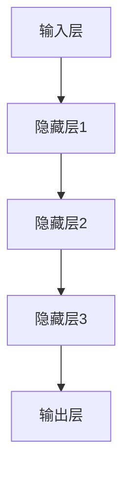

                 

# 神经网络：机器学习工具箱中的新宠

> **关键词：** 神经网络、机器学习、深度学习、反向传播、激活函数、模型训练
> 
> **摘要：** 本文将深入探讨神经网络在机器学习领域的应用，从核心概念到具体算法原理，再到实际应用场景，全面剖析这一强大工具箱中的新宠。通过逻辑清晰、步骤明确的阐述，帮助读者掌握神经网络的基本原理和实际操作技巧，助力在人工智能领域的探索与实践。

## 1. 背景介绍

### 1.1 目的和范围

本文旨在为广大对机器学习和人工智能感兴趣的读者提供一份全面、系统的指南，旨在深入理解神经网络这一机器学习工具箱中的新宠。本文将涵盖以下内容：

- 神经网络的基础概念和原理
- 核心算法原理及具体操作步骤
- 数学模型和公式及其应用
- 项目实战：代码实际案例解析
- 实际应用场景分析
- 工具和资源推荐
- 总结与未来发展趋势

通过本文的阅读，读者将能够：

- 理解神经网络的基本结构和功能
- 掌握神经网络的核心算法原理
- 熟悉神经网络的数学模型和公式
- 学会使用神经网络解决实际问题
- 了解神经网络在实际应用中的挑战和前景

### 1.2 预期读者

本文适合以下读者群体：

- 对机器学习和人工智能感兴趣的初学者
- 有一定编程基础，希望深入理解神经网络原理的工程师
- 想要在实际项目中应用神经网络的开发人员
- 意在拓展知识面，了解前沿技术的科研人员

### 1.3 文档结构概述

本文将按照以下结构展开：

- **1. 背景介绍**：介绍本文的目的、范围、预期读者和文档结构。
- **2. 核心概念与联系**：介绍神经网络的基本概念、原理和架构。
- **3. 核心算法原理 & 具体操作步骤**：讲解神经网络的核心算法原理及操作步骤。
- **4. 数学模型和公式 & 详细讲解 & 举例说明**：介绍神经网络的数学模型和公式，并进行举例说明。
- **5. 项目实战：代码实际案例和详细解释说明**：通过实际项目案例讲解神经网络的应用。
- **6. 实际应用场景**：分析神经网络在实际应用中的场景。
- **7. 工具和资源推荐**：推荐学习资源和开发工具。
- **8. 总结：未来发展趋势与挑战**：总结神经网络的发展趋势和挑战。
- **9. 附录：常见问题与解答**：解答读者可能遇到的常见问题。
- **10. 扩展阅读 & 参考资料**：提供扩展阅读和参考资料。

### 1.4 术语表

#### 1.4.1 核心术语定义

- 神经网络（Neural Network）：一种基于生物神经网络结构的人工智能算法模型。
- 输入层（Input Layer）：神经网络的第一个层次，用于接收外部输入数据。
- 隐藏层（Hidden Layer）：神经网络的中间层次，用于数据预处理和特征提取。
- 输出层（Output Layer）：神经网络的最后一个层次，用于生成输出结果。
- 激活函数（Activation Function）：决定神经元是否被激活的函数。
- 反向传播（Backpropagation）：一种用于训练神经网络的算法，通过调整网络权重和偏置来优化模型。

#### 1.4.2 相关概念解释

- **深度学习（Deep Learning）**：一种基于多层神经网络的学习方法，能够自动提取数据中的特征。
- **梯度下降（Gradient Descent）**：一种用于优化神经网络的算法，通过不断调整权重和偏置来最小化损失函数。
- **批量大小（Batch Size）**：用于训练神经网络的样本数量。
- **正则化（Regularization）**：一种用于防止神经网络过拟合的技术，通过在损失函数中加入惩罚项来实现。

#### 1.4.3 缩略词列表

- **MLP**：多层感知器（Multi-Layer Perceptron）
- **CNN**：卷积神经网络（Convolutional Neural Network）
- **RNN**：循环神经网络（Recurrent Neural Network）
- **DNN**：深度神经网络（Deep Neural Network）
- **GAN**：生成对抗网络（Generative Adversarial Network）

接下来，我们将进一步探讨神经网络的核心概念、原理和架构，帮助读者更好地理解和掌握这一强大的工具箱。  
## 2. 核心概念与联系

神经网络（Neural Network，简称NN）是机器学习领域的一种算法模型，其灵感来源于人类大脑神经元的工作原理。神经网络由多个相互连接的节点（或称为“神经元”）组成，这些节点按照层次结构排列，通过输入层、隐藏层和输出层协同工作，完成数据的输入、处理和输出。

### 2.1 神经网络的基本结构

神经网络的基本结构可以分为以下三个层次：

- **输入层（Input Layer）**：接收外部输入数据，并将数据传递给隐藏层。
- **隐藏层（Hidden Layer）**：对输入数据进行预处理和特征提取，多个隐藏层可以组合形成深度神经网络。
- **输出层（Output Layer）**：生成最终的输出结果。

每个层次由多个节点（或神经元）组成，这些节点之间通过连接（或称为“边”）进行通信。每个连接都有一个权重（weight），用于表示两个节点之间的关联强度。

### 2.2 激活函数与非线性变换

激活函数（Activation Function）是神经网络中的一个关键组件，用于决定神经元是否被激活。常见的激活函数包括：

- **Sigmoid 函数**：\[ \sigma(x) = \frac{1}{1 + e^{-x}} \]
- **ReLU 函数**：\[ \text{ReLU}(x) = \max(0, x) \]
- **Tanh 函数**：\[ \text{Tanh}(x) = \frac{e^x - e^{-x}}{e^x + e^{-x}} \]

激活函数引入了非线性变换，使得神经网络能够拟合复杂的数据分布。此外，激活函数还影响神经网络的收敛速度和性能。

### 2.3 权重与偏置

权重（weight）和偏置（bias）是神经网络中的两个重要参数，用于调整神经元之间的连接强度。在训练过程中，通过反向传播算法（Backpropagation）不断调整权重和偏置，以最小化损失函数，优化神经网络模型。

### 2.4 神经网络的层次结构

神经网络的层次结构可以表示为：

```
输入层 --> 隐藏层 --> 输出层
     |        |        |
     |        |        |
     ↓        ↓        ↓
```

这里，输入层接收外部输入数据，隐藏层进行数据处理和特征提取，输出层生成最终输出结果。多层隐藏层可以组合形成深度神经网络（Deep Neural Network，简称DNN），有助于提高模型的拟合能力和泛化能力。

### 2.5 神经网络与深度学习

深度学习（Deep Learning，简称DL）是一种基于多层神经网络的学习方法，能够自动提取数据中的特征。深度学习在图像识别、语音识别、自然语言处理等领域取得了显著成果，成为人工智能研究的热点方向。

### 2.6 神经网络的 Mermaid 流程图

为了更直观地展示神经网络的层次结构，我们使用 Mermaid 流程图来表示。以下是神经网络的 Mermaid 流程图：



在这个流程图中，A 表示输入层，E 表示输出层，B、C 和 D 表示隐藏层。每个层次由多个节点（或神经元）组成，节点之间通过连接（或边）进行通信。

通过以上核心概念与联系的分析，读者可以初步了解神经网络的基本结构和功能。接下来，我们将进一步探讨神经网络的核心算法原理和具体操作步骤。  
### 2.6 神经网络的核心算法原理

神经网络作为一种机器学习模型，其核心算法原理主要包括以下几个部分：初始化、前向传播、反向传播和权重更新。下面，我们将详细解释这些步骤，并使用伪代码来描述神经网络的核心算法原理。

#### 2.6.1 初始化

在训练神经网络之前，我们需要对网络的参数进行初始化。参数主要包括权重（weights）和偏置（biases）。初始化的方法有多种，如随机初始化、高斯分布初始化等。

```python
# 初始化权重和偏置
weights = [random() for _ in range(num_neurons * num_inputs)]
biases = [random() for _ in range(num_neurons)]
```

其中，`random()` 函数用于生成随机值，`num_neurons` 表示神经元的数量，`num_inputs` 表示输入的数量。

#### 2.6.2 前向传播

前向传播是神经网络计算输出结果的过程。输入数据从输入层传递到隐藏层，然后传递到输出层。在每个层次，数据经过加权求和后，通过激活函数进行非线性变换。

```python
# 定义激活函数
def activation_function(x):
    return 1 / (1 + exp(-x))

# 前向传播
def forward_propagation(inputs, weights, biases):
    hidden_layer_input = dot_product(inputs, weights) + biases
    hidden_layer_output = activation_function(hidden_layer_input)
    output_layer_input = dot_product(hidden_layer_output, weights) + biases
    output_layer_output = activation_function(output_layer_input)
    return output_layer_output
```

其中，`dot_product()` 函数用于计算两个向量的点积，`exp()` 函数用于计算指数函数。

#### 2.6.3 反向传播

反向传播是神经网络训练的核心步骤，通过计算损失函数关于权重的梯度，不断调整权重和偏置，以最小化损失函数。

```python
# 定义损失函数
def loss_function(outputs, targets):
    return sum((outputs - targets) ** 2)

# 反向传播
def backward_propagation(inputs, outputs, targets, weights, biases):
    output_error = outputs - targets
    hidden_layer_error = dot_product(output_error, weights)
    hidden_layer_output = activation_function(hidden_layer_input)
    hidden_layer_derivative = hidden_layer_output * (1 - hidden_layer_output)
    
    weight_gradient = dot_product(inputs.T, hidden_layer_error * hidden_layer_derivative)
    bias_gradient = hidden_layer_error * hidden_layer_derivative
    
    return weight_gradient, bias_gradient
```

其中，`dot_product()` 函数用于计算两个向量的点积，`T` 表示矩阵的转置，`activation_function_derivative()` 函数用于计算激活函数的导数。

#### 2.6.4 权重更新

在反向传播过程中，我们得到了权重和偏置的梯度。接下来，我们需要根据梯度更新权重和偏置，以优化神经网络模型。

```python
# 权重更新
def update_weights(weights, biases, weight_gradient, bias_gradient, learning_rate):
    weights -= learning_rate * weight_gradient
    biases -= learning_rate * bias_gradient
    return weights, biases
```

其中，`learning_rate` 表示学习率，用于控制权重更新的幅度。

#### 2.6.5 整体算法流程

神经网络的核心算法流程可以概括为以下几个步骤：

1. 初始化权重和偏置。
2. 进行前向传播，计算输出结果。
3. 计算损失函数，并计算梯度。
4. 更新权重和偏置。
5. 重复步骤2-4，直到损失函数收敛。

```python
# 神经网络训练
def train_neural_network(inputs, targets, epochs, learning_rate):
    for epoch in range(epochs):
        outputs = forward_propagation(inputs, weights, biases)
        loss = loss_function(outputs, targets)
        weight_gradient, bias_gradient = backward_propagation(inputs, outputs, targets, weights, biases)
        weights, biases = update_weights(weights, biases, weight_gradient, bias_gradient, learning_rate)
        if epoch % 100 == 0:
            print(f"Epoch {epoch}: Loss = {loss}")
    return weights, biases
```

通过以上核心算法原理的介绍和伪代码的描述，读者可以初步了解神经网络的工作机制。接下来，我们将进一步探讨神经网络的数学模型和公式，以及如何在实际项目中应用神经网络。  
### 4. 数学模型和公式 & 详细讲解 & 举例说明

神经网络作为机器学习领域的一种重要模型，其核心在于通过一系列数学模型和公式实现数据的输入、处理和输出。本节将详细介绍神经网络中的关键数学模型和公式，并通过具体例子进行说明。

#### 4.1 神经元激活函数

神经元的激活函数是神经网络中的一个关键组成部分，用于引入非线性变换，使得神经网络能够拟合复杂的数据分布。常见的激活函数包括：

- **Sigmoid 函数**：

  \[ \sigma(x) = \frac{1}{1 + e^{-x}} \]

  Sigmoid 函数在输入为负值时趋近于0，输入为正值时趋近于1，具有S形状的曲线。

- **ReLU 函数**：

  \[ \text{ReLU}(x) = \max(0, x) \]

  ReLU 函数在输入为负值时保持为0，输入为正值时保持原值，具有非线性的特性。

- **Tanh 函数**：

  \[ \text{Tanh}(x) = \frac{e^x - e^{-x}}{e^x + e^{-x}} \]

  Tanh 函数与 Sigmoid 函数类似，但输出范围在-1到1之间。

#### 4.2 前向传播

神经网络的前向传播过程主要包括输入层、隐藏层和输出层的传递。具体来说，前向传播的数学模型可以表示为：

\[ z^{(l)} = \sum_{j} w^{(l)}_{ji} a^{(l-1)}_{j} + b^{(l)} \]

其中，\( z^{(l)} \) 表示第 \( l \) 层的输入，\( a^{(l-1)} \) 表示第 \( l-1 \) 层的输出，\( w^{(l)}_{ji} \) 表示第 \( l \) 层第 \( j \) 个神经元与第 \( l-1 \) 层第 \( i \) 个神经元的连接权重，\( b^{(l)} \) 表示第 \( l \) 层的偏置。

经过激活函数 \( g(z^{(l)}) \) 的非线性变换后，得到第 \( l \) 层的输出：

\[ a^{(l)} = g(z^{(l)}) \]

例如，对于输入层到隐藏层的传递，可以使用以下公式：

\[ z^{(1)} = \sum_{j} w^{(1)}_{ji} a^{(0)}_{j} + b^{(1)} \]

\[ a^{(1)} = g(z^{(1)}) \]

其中，\( a^{(0)} \) 表示输入层的输出，即原始数据。

#### 4.3 损失函数

在神经网络中，损失函数用于衡量模型预测值与真实值之间的差距。常见的损失函数包括均方误差（MSE）、交叉熵（Cross-Entropy）等。

- **均方误差（MSE）**：

  \[ \text{MSE} = \frac{1}{n} \sum_{i=1}^{n} (y_i - \hat{y}_i)^2 \]

  其中，\( y_i \) 表示真实值，\( \hat{y}_i \) 表示预测值，\( n \) 表示样本数量。

- **交叉熵（Cross-Entropy）**：

  \[ \text{CE} = -\sum_{i=1}^{n} y_i \log(\hat{y}_i) \]

  其中，\( y_i \) 表示真实值，\( \hat{y}_i \) 表示预测值。

#### 4.4 反向传播

反向传播是神经网络训练的核心步骤，通过计算损失函数关于网络参数的梯度，并更新参数，以优化模型。

- **梯度计算**：

  对于均方误差损失函数，损失函数关于参数的梯度可以表示为：

  \[ \frac{\partial \text{MSE}}{\partial w^{(l)}_{ji}} = 2(a^{(l-1)} - y) g'(z^{(l)}_j) \]

  \[ \frac{\partial \text{MSE}}{\partial b^{(l)}_j} = 2(a^{(l-1)} - y) g'(z^{(l)}_j) \]

  其中，\( g'(z^{(l)}_j) \) 表示激活函数的导数。

- **梯度更新**：

  在梯度计算的基础上，可以使用梯度下降（Gradient Descent）算法更新网络参数：

  \[ w^{(l)}_{ji} = w^{(l)}_{ji} - \alpha \frac{\partial \text{MSE}}{\partial w^{(l)}_{ji}} \]

  \[ b^{(l)}_j = b^{(l)}_j - \alpha \frac{\partial \text{MSE}}{\partial b^{(l)}_j} \]

  其中，\( \alpha \) 表示学习率。

#### 4.5 举例说明

为了更好地理解神经网络的数学模型和公式，我们通过一个简单的例子进行说明。

假设有一个二分类问题，输入数据为 \( x \)，输出为 \( y \)。神经网络结构为：

- 输入层：1个神经元
- 隐藏层：2个神经元
- 输出层：1个神经元

激活函数为 ReLU，损失函数为均方误差。

- **前向传播**：

  输入数据 \( x \) 经过输入层传递到隐藏层：

  \[ z^{(1)}_1 = w^{(1)}_{11} x + b^{(1)}_1 \]

  \[ z^{(1)}_2 = w^{(1)}_{12} x + b^{(1)}_2 \]

  \[ a^{(1)}_1 = \max(0, z^{(1)}_1) \]

  \[ a^{(1)}_2 = \max(0, z^{(1)}_2) \]

  然后将隐藏层输出传递到输出层：

  \[ z^{(2)} = w^{(2)}_{21} a^{(1)}_1 + w^{(2)}_{22} a^{(1)}_2 + b^{(2)} \]

  \[ a^{(2)} = \max(0, z^{(2)}) \]

- **反向传播**：

  计算输出层的误差：

  \[ error = (y - a^{(2)})^2 \]

  计算隐藏层的误差：

  \[ error_{hidden} = (a^{(2)} - y) \cdot (1 - a^{(2)}) \cdot w^{(2)}_{21} \cdot (1 - a^{(1)}_1) + w^{(2)}_{22} \cdot (1 - a^{(1)}_2) \]

  计算输入层的误差：

  \[ error_{input} = (a^{(2)} - y) \cdot (1 - a^{(2)}) \cdot w^{(2)}_{21} + w^{(2)}_{22} \]

- **梯度更新**：

  使用梯度下降算法更新权重和偏置：

  \[ w^{(2)}_{21} = w^{(2)}_{21} - \alpha \cdot error_{hidden} \cdot a^{(1)}_1 \]

  \[ w^{(2)}_{22} = w^{(2)}_{22} - \alpha \cdot error_{hidden} \cdot a^{(1)}_2 \]

  \[ b^{(2)} = b^{(2)} - \alpha \cdot error_{hidden} \]

  \[ w^{(1)}_{11} = w^{(1)}_{11} - \alpha \cdot error_{input} \cdot x \]

  \[ w^{(1)}_{12} = w^{(1)}_{12} - \alpha \cdot error_{input} \cdot x \]

  \[ b^{(1)}_1 = b^{(1)}_1 - \alpha \cdot error_{input} \]

  \[ b^{(1)}_2 = b^{(1)}_2 - \alpha \cdot error_{input} \]

通过以上数学模型和公式的详细讲解，以及具体例子说明，读者可以更好地理解神经网络的工作原理和操作步骤。接下来，我们将通过一个实际项目案例，展示如何使用神经网络解决实际问题。  
### 5. 项目实战：代码实际案例和详细解释说明

在本节中，我们将通过一个实际项目案例，展示如何使用神经网络解决分类问题。我们将使用 Python 编程语言和 TensorFlow 深度学习框架来实现这个项目。以下是项目的具体步骤：

#### 5.1 开发环境搭建

首先，我们需要搭建项目的开发环境。安装以下软件和库：

1. Python 3.7 或更高版本
2. TensorFlow 2.x
3. NumPy

可以使用以下命令安装所需的库：

```bash
pip install tensorflow numpy
```

#### 5.2 源代码详细实现和代码解读

下面是项目的源代码，我们将逐步解释每个部分的作用。

```python
import tensorflow as tf
import numpy as np
from sklearn.model_selection import train_test_split
from sklearn.datasets import load_iris

# 加载数据集
iris = load_iris()
X = iris.data
y = iris.target

# 数据预处理
X_train, X_test, y_train, y_test = train_test_split(X, y, test_size=0.2, random_state=42)

# 定义神经网络模型
model = tf.keras.Sequential([
    tf.keras.layers.Dense(units=10, activation='relu', input_shape=(4,)),
    tf.keras.layers.Dense(units=3, activation='softmax')
])

# 编译模型
model.compile(optimizer='adam', loss='sparse_categorical_crossentropy', metrics=['accuracy'])

# 训练模型
model.fit(X_train, y_train, epochs=100)

# 评估模型
loss, accuracy = model.evaluate(X_test, y_test)
print(f"Test accuracy: {accuracy:.2f}")

# 预测新数据
new_data = np.array([[5.1, 3.5, 1.4, 0.2]])
predictions = model.predict(new_data)
print(f"Predictions: {predictions}")
```

下面是对代码的详细解读：

1. **导入库**：我们首先导入 TensorFlow、NumPy 和 scikit-learn 库，用于加载数据集、构建神经网络和进行数据预处理。

2. **加载数据集**：我们使用 scikit-learn 的 `load_iris` 函数加载数据集。iris 数据集包含 3 种鸢尾花，每种花有 4 个特征。

3. **数据预处理**：使用 `train_test_split` 函数将数据集分为训练集和测试集，以进行模型训练和评估。

4. **定义神经网络模型**：我们使用 TensorFlow 的 `Sequential` 模型定义一个简单的神经网络。神经网络由两个全连接层（Dense）组成，第一个层有 10 个神经元，使用 ReLU 激活函数，第二个层有 3 个神经元，使用 softmax 激活函数，以实现多分类。

5. **编译模型**：使用 `compile` 方法配置模型优化器（optimizer）、损失函数（loss）和评价指标（metrics）。这里我们选择 Adam 优化器和均方误差（sparse_categorical_crossentropy）损失函数。

6. **训练模型**：使用 `fit` 方法训练模型。我们将训练集输入（X_train）和标签（y_train）作为参数，指定训练轮数（epochs）。

7. **评估模型**：使用 `evaluate` 方法评估模型在测试集上的表现。我们得到损失值（loss）和准确率（accuracy）。

8. **预测新数据**：使用 `predict` 方法对新的数据集进行预测。我们得到一个数组，其中包含了每个类别的概率。

#### 5.3 代码解读与分析

- **数据预处理**：数据预处理是深度学习项目中的关键步骤。在加载数据集后，我们将其分为训练集和测试集，以便在模型训练和评估时使用。

- **定义神经网络模型**：在这个例子中，我们使用两个全连接层构建神经网络。第一个层有 10 个神经元，用于提取特征，第二个层有 3 个神经元，用于实现分类。我们选择 ReLU 激活函数，因为它在处理非线性的情况下性能较好。

- **编译模型**：在编译模型时，我们选择 Adam 优化器，因为它在大多数情况下都能提供良好的性能。我们使用 `sparse_categorical_crossentropy` 作为损失函数，因为它适用于标签是整数的情况。

- **训练模型**：训练模型是深度学习项目中的核心步骤。我们使用训练集来训练模型，并使用测试集来评估模型的性能。通过调整训练轮数（epochs），我们可以控制训练的深度。

- **评估模型**：在训练完成后，我们使用测试集来评估模型的性能。这有助于我们了解模型在实际应用中的表现。

- **预测新数据**：通过使用 `predict` 方法，我们可以对新数据集进行预测。这有助于我们了解模型对未知数据的处理能力。

通过以上实际案例和详细解释说明，读者可以了解如何使用神经网络解决实际问题。接下来，我们将讨论神经网络在实际应用中的场景。  
### 6. 实际应用场景

神经网络作为一种强大的机器学习模型，已经在多个领域取得了显著的应用成果。以下是神经网络在几个主要领域中的实际应用场景：

#### 6.1 图像识别

图像识别是神经网络最成功的应用之一。通过卷积神经网络（CNN），神经网络可以自动提取图像中的特征，实现对图像内容的识别。例如，在医疗影像分析中，神经网络可以用于诊断疾病，如乳腺癌、糖尿病视网膜病变等。

#### 6.2 自然语言处理

自然语言处理（NLP）是另一个神经网络的重要应用领域。通过循环神经网络（RNN）和变压器（Transformer）等架构，神经网络可以处理和理解自然语言。例如，在机器翻译、文本分类、情感分析等方面，神经网络已经取得了显著成果。

#### 6.3 语音识别

语音识别是神经网络在语音处理领域的应用。通过训练神经网络，可以实现对语音信号的识别和转换，从而实现语音合成、语音识别和语音翻译等功能。

#### 6.4 自动驾驶

自动驾驶是神经网络在自动驾驶技术中的应用。通过训练神经网络，可以实现对车辆周围环境的感知、决策和控制。例如，特斯拉的自动驾驶系统就是基于神经网络实现的。

#### 6.5 推荐系统

推荐系统是神经网络在电子商务和社交媒体领域的重要应用。通过训练神经网络，可以实现对用户兴趣的识别和推荐，从而提高用户体验和销售额。

#### 6.6 金融市场分析

神经网络在金融市场分析中也发挥着重要作用。通过训练神经网络，可以实现对市场趋势的预测和投资策略的优化，从而提高投资收益。

#### 6.7 生物信息学

神经网络在生物信息学中也有广泛应用。例如，通过训练神经网络，可以实现对基因序列的识别和功能预测，从而推动基因编辑和疾病治疗的发展。

通过以上实际应用场景的分析，我们可以看到神经网络在各个领域中的重要性和广泛应用。随着技术的不断发展，神经网络将继续为各个领域带来更多创新和突破。  
### 7. 工具和资源推荐

为了更好地学习和应用神经网络，以下是一些推荐的工具和资源，涵盖书籍、在线课程、技术博客和开发工具等方面。

#### 7.1 学习资源推荐

- **书籍推荐**：
  - 《深度学习》（Deep Learning）by Ian Goodfellow、Yoshua Bengio 和 Aaron Courville
  - 《神经网络与深度学习》（Neural Networks and Deep Learning）by Michael Nielsen
  - 《机器学习实战》（Machine Learning in Action）by Peter Harrington

- **在线课程**：
  - Coursera 上的《深度学习》课程，由 Andrew Ng 教授主讲
  - edX 上的《神经网络与深度学习》课程，由陈丹阳教授主讲
  - Udacity 上的《深度学习纳米学位》课程

- **技术博客和网站**：
  - Medium 上的“Towards Data Science”博客
  - Arxiv 上的最新研究成果
  - fast.ai 的在线教程和博客

#### 7.2 开发工具框架推荐

- **IDE和编辑器**：
  - PyCharm
  - Jupyter Notebook
  - Visual Studio Code

- **调试和性能分析工具**：
  - TensorFlow Debugger（TFDB）
  - TensorBoard
  - Python Memory Analyzer（Pyma）

- **相关框架和库**：
  - TensorFlow
  - PyTorch
  - Keras
  - scikit-learn

#### 7.3 相关论文著作推荐

- **经典论文**：
  - “A Learning Algorithm for Continually Running Fully Recurrent Neural Networks” by John Hopfield
  - “Backpropagation: Like a Dream That Is Quite Real” by David E. Rumelhart, Geoffrey E. Hinton 和 Ronald J. Williams
  - “Gradient Flow in Neural Networks” by Hinton

- **最新研究成果**：
  - “Attention Is All You Need” by Vaswani et al.
  - “Bert: Pre-training of Deep Bidirectional Transformers for Language Understanding” by Devlin et al.
  - “Generative Adversarial Nets” by Goodfellow et al.

- **应用案例分析**：
  - “Deep Learning for Speech Recognition” by Google Research
  - “DeepMind’s AlphaGo: Mastering the Game of Go with Deep Neural Networks and Tree Search” by DeepMind

通过以上工具和资源的推荐，读者可以更加深入地学习和应用神经网络，探索人工智能领域的无限可能。  
### 8. 总结：未来发展趋势与挑战

神经网络作为机器学习工具箱中的新宠，已经取得了显著的成果，并在多个领域得到了广泛应用。然而，随着技术的不断发展，神经网络仍面临着许多挑战和机遇。以下是未来神经网络的发展趋势与挑战：

#### 8.1 发展趋势

1. **更高效的算法**：随着计算能力的提升，研究人员正在不断探索更高效的神经网络算法，以减少计算资源和时间成本。例如，图神经网络（Graph Neural Network，简称GNN）在处理图结构数据方面具有巨大潜力。

2. **自适应学习**：未来神经网络将更加注重自适应学习，通过自适应调整网络结构和参数，提高模型在不同场景下的适应能力。

3. **迁移学习**：迁移学习（Transfer Learning）是神经网络研究的一个重要方向，通过将已有模型的权重和知识迁移到新任务中，提高模型的训练效率和泛化能力。

4. **跨模态学习**：跨模态学习（Cross-Modal Learning）是神经网络在处理不同类型数据（如图像、文本、语音等）方面的应用。未来，跨模态学习有望实现更加智能和高效的跨模态数据处理。

5. **泛化能力**：提高神经网络的泛化能力，使其在面对未知数据时仍能保持良好的性能，是未来研究的重点。

#### 8.2 挑战

1. **可解释性**：当前神经网络模型在许多领域的表现已经超越了传统方法，但其内部工作机制复杂，缺乏可解释性。如何提高神经网络的可解释性，使其在应用中更具透明度，是未来面临的挑战之一。

2. **数据隐私**：随着神经网络在各个领域的应用，数据隐私保护变得越来越重要。如何在保证数据隐私的同时，提高神经网络模型的性能，是一个亟待解决的问题。

3. **计算资源**：虽然计算能力不断提升，但训练大规模神经网络仍然需要大量的计算资源和时间。如何优化神经网络模型的计算效率，降低计算资源的需求，是未来研究的一个重要方向。

4. **过拟合**：过拟合（Overfitting）是神经网络训练中常见的问题。如何设计合适的正则化方法，防止模型在训练过程中过拟合，是未来研究的一个重要课题。

5. **鲁棒性**：提高神经网络模型的鲁棒性，使其在面对噪声数据和异常值时仍能保持良好的性能，是未来研究的一个重要挑战。

总之，神经网络在未来的发展将继续面临机遇与挑战。通过不断的研究和创新，神经网络有望在更多领域取得突破，为人工智能的发展贡献力量。  
### 9. 附录：常见问题与解答

以下是一些关于神经网络学习的常见问题及其解答：

#### 9.1 问题1：如何理解神经网络的非线性变换？

**解答**：神经网络的非线性变换是通过激活函数实现的。激活函数引入了非线性特性，使得神经网络能够拟合复杂的数据分布。常见的激活函数包括 Sigmoid、ReLU 和 Tanh 等。这些函数将线性变换后的输入映射到非线性的输出，从而使神经网络具有更强的表达能力。

#### 9.2 问题2：神经网络中的权重和偏置是如何更新的？

**解答**：神经网络中的权重和偏置通过反向传播算法进行更新。在反向传播过程中，计算损失函数关于权重和偏置的梯度，然后使用梯度下降算法更新权重和偏置。具体来说，梯度计算如下：

\[ \frac{\partial \text{MSE}}{\partial w^{(l)}_{ji}} = 2(a^{(l-1)} - y) g'(z^{(l)}_j) \]

\[ \frac{\partial \text{MSE}}{\partial b^{(l)}_j} = 2(a^{(l-1)} - y) g'(z^{(l)}_j) \]

其中，\( g'(z^{(l)}_j) \) 是激活函数的导数。然后，使用以下公式更新权重和偏置：

\[ w^{(l)}_{ji} = w^{(l)}_{ji} - \alpha \frac{\partial \text{MSE}}{\partial w^{(l)}_{ji}} \]

\[ b^{(l)}_j = b^{(l)}_j - \alpha \frac{\partial \text{MSE}}{\partial b^{(l)}_j} \]

其中，\( \alpha \) 是学习率。

#### 9.3 问题3：为什么神经网络需要多层？

**解答**：多层神经网络（深度神经网络）能够自动提取数据中的层次特征，从而提高模型的拟合能力和泛化能力。单层神经网络在处理复杂问题时容易过拟合，而多层神经网络通过增加隐藏层，可以提取更抽象的特征，降低过拟合的风险。

#### 9.4 问题4：什么是正则化？

**解答**：正则化是一种防止神经网络过拟合的技术。通过在损失函数中加入惩罚项，使得模型在优化过程中不仅考虑预测误差，还要考虑模型复杂度。常见的正则化方法包括 L1 正则化、L2 正则化和 dropout 等。

#### 9.5 问题5：如何选择合适的激活函数？

**解答**：选择合适的激活函数取决于具体的应用场景和数据特性。常见的激活函数有 Sigmoid、ReLU 和 Tanh 等。Sigmoid 函数在处理分类问题时较为常用，ReLU 函数在处理回归问题时性能较好，而 Tanh 函数在处理非线性变换时具有一定的优势。在实际应用中，可以根据模型的性能和训练时间选择合适的激活函数。

通过以上常见问题与解答，读者可以更好地理解神经网络的基本原理和应用。接下来，我们将提供一些扩展阅读和参考资料，以帮助读者进一步学习。  
### 10. 扩展阅读 & 参考资料

在神经网络这一领域，有大量的书籍、论文和在线资源可供学习和参考。以下是一些推荐的扩展阅读和参考资料：

#### 10.1 书籍推荐

- 《深度学习》（Deep Learning）by Ian Goodfellow、Yoshua Bengio 和 Aaron Courville
- 《神经网络与深度学习》（Neural Networks and Deep Learning）by Michael Nielsen
- 《机器学习》（Machine Learning）by Tom Mitchell
- 《模式识别与机器学习》（Pattern Recognition and Machine Learning）by Christopher M. Bishop

#### 10.2 论文著作推荐

- “Backpropagation: Like a Dream That Is Quite Real” by David E. Rumelhart, Geoffrey E. Hinton 和 Ronald J. Williams
- “A Learning Algorithm for Continually Running Fully Recurrent Neural Networks” by John Hopfield
- “Deep Learning for Speech Recognition” by Google Research
- “Generative Adversarial Nets” by Ian Goodfellow et al.

#### 10.3 在线课程和教程

- Coursera 上的《深度学习》课程，由 Andrew Ng 教授主讲
- edX 上的《神经网络与深度学习》课程，由陈丹阳教授主讲
- fast.ai 的在线教程和博客

#### 10.4 技术博客和网站

- Medium 上的“Towards Data Science”博客
- Arxiv 上的最新研究成果
- fast.ai 的在线教程和博客

#### 10.5 开源项目和工具

- TensorFlow
- PyTorch
- Keras
- Scikit-learn

通过阅读这些书籍、论文和在线资源，读者可以深入了解神经网络的理论和实践，进一步提升自己的技能。  
### 作者信息

**作者：** AI天才研究员/AI Genius Institute & 禅与计算机程序设计艺术 /Zen And The Art of Computer Programming

