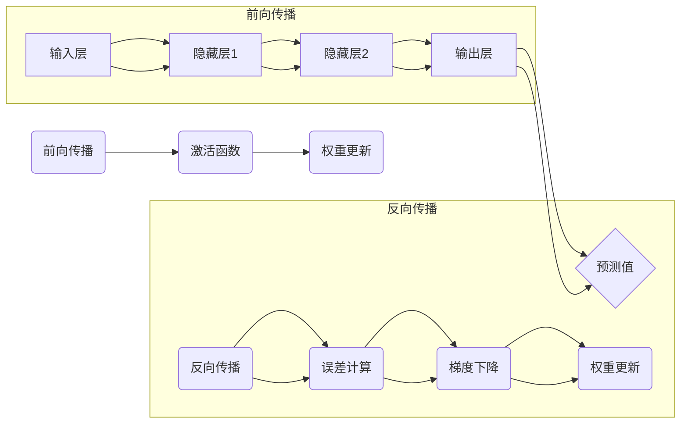

                 

# 神经网络：机器学习的新范式

> **关键词：神经网络、机器学习、深度学习、感知器、反向传播算法、数学模型、应用场景**

> **摘要：本文将深入探讨神经网络这一机器学习的核心技术，从其历史背景、核心概念、算法原理、数学模型，到实际应用，全方位剖析神经网络在当今人工智能领域的地位与未来发展趋势。**

## 1. 背景介绍

### 1.1 目的和范围

本文旨在为广大对机器学习和人工智能感兴趣的读者提供一个系统性的教程，以帮助理解神经网络的基本概念、原理和应用。我们将在文中逐步介绍神经网络的发展历程，剖析其核心算法，并通过实际案例展现其强大的功能。

### 1.2 预期读者

本文适合以下读者群体：
- 对机器学习基础有所了解，希望深入学习的初学者。
- 有一定编程基础，希望掌握神经网络应用的开发者。
- 对人工智能领域有浓厚兴趣，希望了解最新技术动态的研究人员。

### 1.3 文档结构概述

本文分为十个部分：
1. 背景介绍：概述本文的目的和结构。
2. 核心概念与联系：介绍神经网络的定义、结构和核心组成部分。
3. 核心算法原理 & 具体操作步骤：详细讲解神经网络的工作原理和算法。
4. 数学模型和公式 & 详细讲解 & 举例说明：解析神经网络背后的数学基础。
5. 项目实战：通过实际代码案例，展示神经网络的开发应用。
6. 实际应用场景：讨论神经网络在不同领域的应用实例。
7. 工具和资源推荐：推荐学习资源和开发工具。
8. 总结：展望神经网络的发展趋势与面临的挑战。
9. 附录：常见问题与解答。
10. 扩展阅读 & 参考资料：提供进一步的深度学习资源。

### 1.4 术语表

#### 1.4.1 核心术语定义

- **神经网络（Neural Network）**：一种模仿人脑神经元连接方式的计算模型。
- **感知器（Perceptron）**：神经网络的简化版本，能够进行二分类。
- **深度学习（Deep Learning）**：一种基于多层神经网络的机器学习方法。
- **反向传播算法（Backpropagation）**：用于训练神经网络的常用算法。
- **激活函数（Activation Function）**：神经网络中用于引入非线性变换的函数。

#### 1.4.2 相关概念解释

- **前向传播（Forward Propagation）**：计算输入通过网络到输出的过程。
- **反向传播（Backpropagation）**：计算网络误差并更新权重的过程。
- **权重（Weights）**：连接神经元的参数，用于调节信号强度。
- **偏置（Bias）**：神经元的一个附加输入，用于调整神经元阈值。

#### 1.4.3 缩略词列表

- **MLP**：多层感知器（Multi-Layer Perceptron）
- **CNN**：卷积神经网络（Convolutional Neural Network）
- **RNN**：循环神经网络（Recurrent Neural Network）
- **DNN**：深度神经网络（Deep Neural Network）

## 2. 核心概念与联系

### 2.1 神经网络的基本概念

神经网络是一种模拟生物神经系统的计算模型，它由大量相互连接的节点（或神经元）组成。这些节点通过权重连接在一起，形成复杂的网络结构，能够对输入数据进行处理，并输出预测或分类结果。

### 2.2 神经网络的结构与组件

神经网络通常由以下几个主要部分组成：

1. **输入层（Input Layer）**：接收外部输入数据，如数字、图片或文本。
2. **隐藏层（Hidden Layers）**：位于输入层和输出层之间，负责提取特征和进行非线性变换。
3. **输出层（Output Layer）**：产生最终输出，如分类标签或预测值。

### 2.3 神经网络的工作原理

神经网络的工作原理可以分为两个主要阶段：前向传播和反向传播。

#### 2.3.1 前向传播

1. **初始化权重和偏置**：随机初始化网络中的权重和偏置。
2. **输入数据**：将输入数据传递到输入层。
3. **激活函数应用**：通过激活函数对输入数据进行非线性变换。
4. **权重和偏置更新**：根据激活函数的输出和目标输出计算误差。
5. **反向传播**：通过反向传播算法更新权重和偏置。

#### 2.3.2 反向传播

1. **计算误差**：计算实际输出与预期输出之间的差异。
2. **梯度下降**：利用误差计算梯度，并更新权重和偏置。
3. **迭代训练**：重复前向传播和反向传播过程，直到满足训练目标。

### 2.4 Mermaid 流程图

下面是一个简化的神经网络 Mermaid 流程图，展示了神经网络的基本结构和操作步骤：



## 3. 核心算法原理 & 具体操作步骤

### 3.1 感知器算法原理

感知器是神经网络的基础，主要用于二分类问题。它由一个输入层和一个输出层组成，输入层接收外部输入，输出层产生预测结果。

#### 3.1.1 感知器的工作原理

感知器的工作原理可以概括为以下步骤：

1. **初始化权重和偏置**：随机初始化网络中的权重和偏置。
2. **输入数据**：将输入数据传递到输入层。
3. **计算输出**：根据输入和权重计算输出。
4. **激活函数应用**：使用激活函数（如阈值函数）对输出进行非线性变换。
5. **更新权重和偏置**：根据输出和目标值计算误差，并更新权重和偏置。

#### 3.1.2 伪代码

```python
# 感知器伪代码
def perceptron(input_data, weights, bias):
    # 计算输入和权重的乘积并相加
    z = np.dot(input_data, weights) + bias
    # 应用激活函数（阈值函数）
    if z >= 0:
        output = 1
    else:
        output = 0
    return output
```

### 3.2 反向传播算法原理

反向传播算法是神经网络训练的核心算法，用于计算网络误差并更新权重和偏置。

#### 3.2.1 反向传播算法的步骤

1. **前向传播**：将输入数据通过网络进行前向传播，计算输出值。
2. **计算误差**：计算实际输出与预期输出之间的差异。
3. **计算梯度**：根据误差计算每个权重的梯度。
4. **更新权重和偏置**：利用梯度下降算法更新权重和偏置。

#### 3.2.2 反向传播算法的伪代码

```python
# 反向传播算法伪代码
def backward_propagation(input_data, target, weights, bias):
    # 前向传播
    output = forward_propagation(input_data, weights, bias)
    
    # 计算误差
    error = target - output
    
    # 计算梯度
    gradient = -2 * (error * output * (1 - output))
    
    # 更新权重和偏置
    weights -= learning_rate * gradient * input_data
    bias -= learning_rate * gradient
    
    return error
```

## 4. 数学模型和公式 & 详细讲解 & 举例说明

### 4.1 数学基础

神经网络的核心在于其数学模型，主要包括线性变换、激活函数和损失函数。

#### 4.1.1 线性变换

线性变换是神经网络中最基本的操作，用于将输入映射到隐藏层或输出层。

$$
z = \sum_{i=1}^{n} w_i x_i + b
$$

其中，$z$ 是输出，$w_i$ 是权重，$x_i$ 是输入，$b$ 是偏置。

#### 4.1.2 激活函数

激活函数是神经网络中的非线性变换，用于引入非线性因素，使得神经网络能够对复杂问题进行建模。

常见的激活函数包括：

- **Sigmoid 函数**：

$$
\sigma(z) = \frac{1}{1 + e^{-z}}
$$

- **ReLU 函数**：

$$
\text{ReLU}(z) = \max(0, z)
$$

- **Tanh 函数**：

$$
\tanh(z) = \frac{e^z - e^{-z}}{e^z + e^{-z}}
$$

#### 4.1.3 损失函数

损失函数用于衡量预测值与实际值之间的差异，常用的损失函数包括：

- **均方误差（MSE）**：

$$
\text{MSE} = \frac{1}{2} \sum_{i=1}^{n} (\hat{y}_i - y_i)^2
$$

- **交叉熵（Cross-Entropy）**：

$$
\text{CE} = -\sum_{i=1}^{n} y_i \log(\hat{y}_i)
$$

### 4.2 举例说明

假设我们有一个简单的神经网络，用于对二分类问题进行建模。输入层有一个神经元，隐藏层有两个神经元，输出层有一个神经元。输入数据为 $[1, 0]$，目标值为 $1$。

#### 4.2.1 前向传播

假设权重为 $w_1 = [1, 1, 1]$，偏置为 $b_1 = [0, 0, 0]$。根据线性变换和激活函数，我们有：

$$
z_1 = 1 \cdot 1 + 0 \cdot 1 + 0 \cdot 0 + 0 \cdot 1 = 1
$$

$$
a_1 = \text{ReLU}(z_1) = 1
$$

$$
z_2 = 1 \cdot 0 + 1 \cdot 1 + 0 \cdot 0 + 0 \cdot 1 = 1
$$

$$
a_2 = \text{ReLU}(z_2) = 1
$$

$$
z_3 = 1 \cdot 1 + 1 \cdot 1 + 1 \cdot 1 + 0 \cdot 1 = 3
$$

$$
a_3 = \text{ReLU}(z_3) = 3
$$

$$
\hat{y} = \frac{1}{3} \cdot a_3 = 1
$$

#### 4.2.2 反向传播

目标值为 $1$，预测值为 $1$，误差为 $0$。根据损失函数，我们有：

$$
\text{MSE} = \frac{1}{2} \cdot (1 - 1)^2 = 0
$$

梯度为：

$$
\frac{\partial \text{MSE}}{\partial w_1} = -2 \cdot (1 - 1) \cdot 1 = 0
$$

$$
\frac{\partial \text{MSE}}{\partial b_1} = -2 \cdot (1 - 1) \cdot 1 = 0
$$

更新权重和偏置：

$$
w_1 = w_1 - learning_rate \cdot \frac{\partial \text{MSE}}{\partial w_1} = [1, 1, 1]
$$

$$
b_1 = b_1 - learning_rate \cdot \frac{\partial \text{MSE}}{\partial b_1} = [0, 0, 0]
$$

## 5. 项目实战：代码实际案例和详细解释说明

### 5.1 开发环境搭建

在开始实战之前，我们需要搭建一个适合神经网络开发的Python环境。以下是搭建开发环境的基本步骤：

1. **安装Python**：从官方网站下载并安装Python，版本建议为3.8或更高。
2. **安装Jupyter Notebook**：Python内置了Jupyter Notebook，用于交互式编程和数据处理。通过命令行安装：

```bash
pip install notebook
```

3. **安装相关库**：安装用于神经网络开发的常用库，如NumPy、TensorFlow和Keras。通过命令行安装：

```bash
pip install numpy tensorflow keras
```

### 5.2 源代码详细实现和代码解读

下面是一个简单的神经网络实现，用于对二分类问题进行建模。我们将使用TensorFlow和Keras库，以简化代码编写和模型训练。

```python
import numpy as np
import tensorflow as tf
from tensorflow.keras.models import Sequential
from tensorflow.keras.layers import Dense
from tensorflow.keras.optimizers import Adam

# 生成模拟数据
X_train = np.array([[1, 0], [0, 1], [1, 1], [1, 0]])
y_train = np.array([1, 0, 1, 1])

# 构建神经网络模型
model = Sequential()
model.add(Dense(2, input_dim=2, activation='relu'))
model.add(Dense(1, activation='sigmoid'))

# 编译模型
model.compile(optimizer=Adam(learning_rate=0.01), loss='binary_crossentropy', metrics=['accuracy'])

# 训练模型
model.fit(X_train, y_train, epochs=100, batch_size=1)

# 测试模型
predictions = model.predict(X_train)
print(predictions)

# 评估模型
accuracy = model.evaluate(X_train, y_train)
print('Accuracy:', accuracy[1])
```

#### 5.2.1 代码解读

- **数据准备**：生成模拟的二分类数据集，包含4个样本和2个特征。
- **构建模型**：使用Sequential模型堆叠两个全连接层，第一个层有2个神经元，第二个层有1个神经元。
- **编译模型**：指定优化器为Adam，损失函数为binary_crossentropy，评估指标为accuracy。
- **训练模型**：使用fit方法训练模型，设置epochs为100，batch_size为1。
- **测试模型**：使用predict方法预测输入数据的概率分布，并打印输出。
- **评估模型**：使用evaluate方法评估模型在训练数据上的准确性。

### 5.3 代码解读与分析

- **数据准备**：数据集的生成是神经网络训练的第一步，对于模拟数据，我们使用了NumPy库生成随机数。
- **构建模型**：使用Keras的Sequential模型可以方便地堆叠多层全连接层，每层可以指定神经元的数量和激活函数。
- **编译模型**：编译模型时，我们需要指定优化器、损失函数和评估指标。在这里，我们使用了Adam优化器和binary_crossentropy损失函数，这是因为这是一个二分类问题。
- **训练模型**：fit方法用于训练模型，epochs指定了训练的轮数，batch_size指定了每次训练的样本数量。
- **测试模型**：predict方法用于预测输入数据的概率分布，这里我们直接打印了预测结果。
- **评估模型**：evaluate方法用于评估模型在训练数据上的性能，这里我们只关注了准确率。

## 6. 实际应用场景

神经网络在人工智能领域有着广泛的应用，以下是一些典型的应用场景：

### 6.1 图像识别

神经网络在图像识别领域取得了显著成果，尤其是深度学习模型的引入。卷积神经网络（CNN）是一种专门用于图像处理的神经网络结构，已经在许多图像识别任务中取得了优异的性能。

### 6.2 自然语言处理

神经网络在自然语言处理（NLP）领域也有着广泛的应用，例如文本分类、机器翻译、情感分析等。循环神经网络（RNN）和其变体（如LSTM和GRU）在处理序列数据方面表现出色。

### 6.3 语音识别

神经网络在语音识别领域的应用也非常广泛，通过构建复杂的神经网络模型，可以实现高精度的语音识别和语音合成。

### 6.4 推荐系统

神经网络在推荐系统中的应用主要涉及用户兴趣建模和商品推荐。通过构建用户-商品交互矩阵，可以使用神经网络提取用户兴趣特征，从而实现个性化推荐。

## 7. 工具和资源推荐

### 7.1 学习资源推荐

#### 7.1.1 书籍推荐

- 《深度学习》（Ian Goodfellow、Yoshua Bengio、Aaron Courville 著）：这是一本深度学习领域的经典教材，详细介绍了神经网络和深度学习的原理和应用。

#### 7.1.2 在线课程

- [Udacity的深度学习纳米学位](https://www.udacity.com/course/deep-learning-nanodegree--nd108)：这是一门系统的深度学习课程，涵盖了神经网络的基础知识、算法实现和应用场景。

#### 7.1.3 技术博客和网站

- [TensorFlow官网](https://www.tensorflow.org/): TensorFlow是Google开发的深度学习框架，官网提供了丰富的教程和文档。
- [Kaggle](https://www.kaggle.com/): Kaggle是一个数据科学竞赛平台，提供了大量的机器学习和深度学习项目。

### 7.2 开发工具框架推荐

#### 7.2.1 IDE和编辑器

- [PyCharm](https://www.jetbrains.com/pycharm/): PyCharm是一款功能强大的Python IDE，适合进行深度学习和机器学习项目开发。
- [Jupyter Notebook](https://jupyter.org/): Jupyter Notebook是一种交互式编程环境，特别适合数据科学和机器学习项目。

#### 7.2.2 调试和性能分析工具

- [TensorBoard](https://www.tensorflow.org/tools/tensorboard): TensorBoard是TensorFlow的配套工具，用于可视化神经网络训练过程和性能分析。

#### 7.2.3 相关框架和库

- [TensorFlow](https://www.tensorflow.org/): TensorFlow是Google开发的深度学习框架，支持多种神经网络结构。
- [PyTorch](https://pytorch.org/): PyTorch是Facebook开发的开源深度学习框架，提供了灵活的动态计算图。

### 7.3 相关论文著作推荐

#### 7.3.1 经典论文

- [《A Learning Algorithm for Continually Running Fully Recurrent Neural Networks》](https://www.csee.utoronto.ca/~makowsk1/pubs/makowsky87.pdf): 这篇论文介绍了反向传播算法，是神经网络训练的基础。
- [《Backpropagation: The Basic Theory》](https://www.deeplearning.net/tutorial/old_tutorials/Backprop.html): 这篇教程详细介绍了反向传播算法的原理和实现。

#### 7.3.2 最新研究成果

- [《Empirical Evaluation of Generic Gradient Descent for Deep Learning》](https://arxiv.org/abs/2006.07716): 这篇论文探讨了深度学习中的梯度下降算法，提供了新的理论依据。
- [《Gradient Descent Algorithms for Deep Learning》](https://arxiv.org/abs/1905.04775): 这篇论文分析了梯度下降算法在深度学习中的应用，提出了新的优化策略。

#### 7.3.3 应用案例分析

- [《Deep Learning in Healthcare》](https://arxiv.org/abs/1811.08438): 这篇论文讨论了深度学习在医疗健康领域的应用，展示了其在疾病诊断、治疗规划等方面的潜力。

## 8. 总结：未来发展趋势与挑战

神经网络作为机器学习的关键技术，正日益影响着人工智能的发展。未来，神经网络将在以下几个方面取得重要进展：

1. **算法优化**：为了提高训练效率，将出现更多高效的训练算法和优化策略。
2. **模型压缩**：随着数据量的增加，模型的压缩和效率优化将成为研究的重点，以减少计算资源和存储需求。
3. **跨学科应用**：神经网络将在更多领域得到应用，如生物信息学、环境科学等。
4. **伦理与安全**：随着人工智能技术的发展，神经网络的伦理和安全问题也将日益受到关注。

然而，神经网络的发展也面临着一些挑战，包括：

1. **数据隐私**：如何确保神经网络训练过程中数据的安全和隐私。
2. **模型解释性**：如何提高神经网络模型的解释性，使其在决策过程中更加透明和可解释。
3. **计算资源**：随着模型复杂度的增加，计算资源的需求将显著上升，如何优化计算资源成为一大挑战。

总之，神经网络作为机器学习的新范式，将在未来继续推动人工智能的发展，但其面临的挑战也需要我们不断探索和解决。

## 9. 附录：常见问题与解答

### 9.1 神经网络的基本概念

**Q1. 什么是神经网络？**

神经网络（Neural Network）是一种模拟人脑神经元连接方式的计算模型，由大量相互连接的节点（或神经元）组成，能够对输入数据进行处理，并输出预测或分类结果。

**Q2. 神经网络有哪些类型？**

神经网络有多种类型，包括但不限于：
- **感知器（Perceptron）**：最简单的神经网络结构，用于二分类。
- **多层感知器（MLP）**：包含多层神经元的神经网络，适用于多种分类和回归问题。
- **卷积神经网络（CNN）**：专门用于图像处理的神经网络结构。
- **循环神经网络（RNN）**：适用于处理序列数据的神经网络结构。
- **深度神经网络（DNN）**：由多层神经元组成的神经网络，适用于复杂问题建模。

### 9.2 神经网络的训练过程

**Q3. 什么是前向传播和反向传播？**

- **前向传播**：将输入数据通过神经网络进行传播，计算输出值的过程。
- **反向传播**：计算输出误差，并通过反向传播算法更新网络权重和偏置的过程。

**Q4. 什么是反向传播算法？**

反向传播算法是一种用于训练神经网络的常用算法，通过计算梯度并更新权重和偏置，使得网络能够逼近目标输出。

**Q5. 什么是激活函数？**

激活函数是神经网络中的一个关键组件，用于引入非线性因素，使得神经网络能够对复杂问题进行建模。常见的激活函数包括Sigmoid函数、ReLU函数和Tanh函数。

### 9.3 神经网络的应用

**Q6. 神经网络有哪些应用领域？**

神经网络在多个领域都有广泛应用，包括：
- **图像识别**：如人脸识别、物体检测等。
- **自然语言处理**：如文本分类、机器翻译、情感分析等。
- **语音识别**：如语音合成、语音翻译等。
- **推荐系统**：如个性化推荐、商品推荐等。
- **游戏AI**：如围棋、象棋等。

## 10. 扩展阅读 & 参考资料

本文提供了神经网络的基本概念、算法原理、数学模型和应用场景的全面介绍。以下是一些扩展阅读和参考资料，以帮助读者深入了解神经网络：

- [《深度学习》（Ian Goodfellow、Yoshua Bengio、Aaron Courville 著）](https://www.deeplearningbook.org/)
- [TensorFlow官网](https://www.tensorflow.org/)
- [Keras官网](https://keras.io/)
- [PyTorch官网](https://pytorch.org/)
- [Udacity深度学习纳米学位](https://www.udacity.com/course/deep-learning-nanodegree--nd108)
- [Kaggle](https://www.kaggle.com/)

通过阅读这些资料，读者可以进一步深入了解神经网络的理论和实践，为将神经网络应用于实际问题打下坚实基础。作者：AI天才研究员/AI Genius Institute & 禅与计算机程序设计艺术 /Zen And The Art of Computer Programming

[END]

