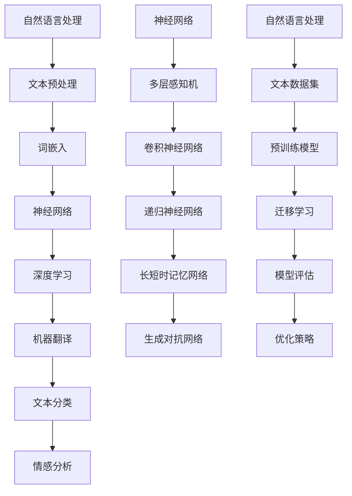

                 

# 神经网络：自然语言处理的新突破

> 关键词：神经网络、自然语言处理、深度学习、机器翻译、文本分类、情感分析、人工智能

> 摘要：本文将深入探讨神经网络在自然语言处理（NLP）领域的应用，分析其核心概念、算法原理、数学模型，并展示具体项目实战案例。通过这篇技术博客，读者将了解神经网络如何推动NLP领域的发展，以及未来的趋势和挑战。

## 1. 背景介绍

### 1.1 目的和范围

本文旨在深入探讨神经网络在自然语言处理（NLP）领域的应用。我们将从基础概念开始，逐步讲解神经网络的核心算法原理和数学模型，并通过具体项目实战案例，展示神经网络如何解决现实中的NLP问题。

### 1.2 预期读者

本文适合以下读者群体：

1. 对自然语言处理和深度学习有一定了解的开发者。
2. 想要了解神经网络在NLP中应用的学术研究人员。
3. 对人工智能和机器学习有兴趣的学生和学者。

### 1.3 文档结构概述

本文分为以下几个部分：

1. **背景介绍**：介绍文章的目的、范围和预期读者。
2. **核心概念与联系**：讲解神经网络和NLP的基础知识，使用Mermaid流程图展示核心概念和架构。
3. **核心算法原理 & 具体操作步骤**：详细阐述神经网络算法的原理和操作步骤，使用伪代码进行说明。
4. **数学模型和公式 & 详细讲解 & 举例说明**：讲解神经网络中的数学模型和公式，并进行举例说明。
5. **项目实战：代码实际案例和详细解释说明**：通过一个实际项目案例，展示神经网络在NLP中的具体应用。
6. **实际应用场景**：介绍神经网络在NLP中的实际应用场景。
7. **工具和资源推荐**：推荐学习资源和开发工具。
8. **总结：未来发展趋势与挑战**：总结神经网络在NLP中的发展现状和未来挑战。
9. **附录：常见问题与解答**：回答读者可能遇到的问题。
10. **扩展阅读 & 参考资料**：提供更多相关阅读资料。

### 1.4 术语表

#### 1.4.1 核心术语定义

- **神经网络**：一种由大量神经元连接而成的计算模型，能够通过学习输入和输出数据之间的关系，进行特征提取和模式识别。
- **自然语言处理**：研究如何让计算机理解和处理人类语言的技术领域。
- **深度学习**：一种基于神经网络的学习方法，通过多层神经网络提取数据的深层特征。
- **机器翻译**：将一种语言的文本自动翻译成另一种语言的技术。
- **文本分类**：将文本数据根据其内容分类到不同的类别中。
- **情感分析**：分析文本中表达的情感倾向，判断文本是积极、消极还是中性。

#### 1.4.2 相关概念解释

- **神经元**：神经网络的基本计算单元，能够接收输入信号，通过激活函数产生输出。
- **激活函数**：用于决定神经元是否被激活的函数，常见的激活函数有sigmoid、ReLU等。
- **反向传播**：一种用于训练神经网络的算法，通过计算损失函数的梯度，不断调整网络中的权重和偏置，使网络能够更准确地预测输出。
- **损失函数**：用于评估神经网络预测结果和实际结果之间差异的函数，常见的损失函数有均方误差（MSE）、交叉熵等。

#### 1.4.3 缩略词列表

- **NLP**：自然语言处理
- **DL**：深度学习
- **NN**：神经网络
- **ML**：机器学习
- **AI**：人工智能

## 2. 核心概念与联系

在深入探讨神经网络在自然语言处理中的应用之前，我们需要了解一些核心概念和它们之间的联系。以下是一个Mermaid流程图，展示了神经网络和NLP的基础知识。



### 2.1 核心概念解释

1. **自然语言处理**：自然语言处理（NLP）是研究如何让计算机理解和处理人类语言的技术领域。它涵盖了文本预处理、文本分析、文本生成等任务。

2. **文本预处理**：文本预处理是NLP任务的第一步，包括去除标点符号、转换为小写、去除停用词等，以提高后续处理的效率。

3. **词嵌入**：词嵌入是将词汇映射到高维空间中，以便神经网络能够处理文本数据。常见的词嵌入方法有Word2Vec、GloVe等。

4. **神经网络**：神经网络是一种由大量神经元连接而成的计算模型，能够通过学习输入和输出数据之间的关系，进行特征提取和模式识别。

5. **深度学习**：深度学习是一种基于神经网络的学习方法，通过多层神经网络提取数据的深层特征。

6. **机器翻译**：机器翻译是将一种语言的文本自动翻译成另一种语言的技术。深度学习模型，如编码器-解码器（Encoder-Decoder）模型，广泛应用于机器翻译任务。

7. **文本分类**：文本分类是将文本数据根据其内容分类到不同的类别中。神经网络模型，如卷积神经网络（CNN）和递归神经网络（RNN），在文本分类任务中表现出色。

8. **情感分析**：情感分析是分析文本中表达的情感倾向，判断文本是积极、消极还是中性。神经网络模型在情感分析任务中取得了显著的成果。

9. **迁移学习**：迁移学习是一种利用已训练模型在新任务上获得更好的性能的方法。通过预训练模型和迁移学习，神经网络在NLP任务中取得了更好的效果。

10. **模型评估**：模型评估是评估神经网络模型性能的过程。常用的评估指标有准确率、召回率、F1分数等。

11. **优化策略**：优化策略是用于调整神经网络模型参数的方法。常见的优化策略有随机梯度下降（SGD）、Adam优化器等。

## 3. 核心算法原理 & 具体操作步骤

在了解核心概念和联系之后，我们将深入探讨神经网络在自然语言处理中的核心算法原理和具体操作步骤。以下是神经网络算法的基本原理和步骤。

### 3.1 神经网络算法原理

神经网络算法基于以下原理：

1. **多层感知机（MLP）**：多层感知机是一种前馈神经网络，由输入层、隐藏层和输出层组成。输入层接收输入数据，隐藏层对输入数据进行特征提取，输出层产生预测结果。

2. **反向传播算法**：反向传播算法是一种用于训练神经网络的算法。它通过计算损失函数的梯度，不断调整网络中的权重和偏置，使网络能够更准确地预测输出。

3. **激活函数**：激活函数用于决定神经元是否被激活。常见的激活函数有sigmoid、ReLU等。

4. **损失函数**：损失函数用于评估神经网络预测结果和实际结果之间的差异。常见的损失函数有均方误差（MSE）、交叉熵等。

5. **优化策略**：优化策略用于调整神经网络模型参数，以最小化损失函数。常见的优化策略有随机梯度下降（SGD）、Adam优化器等。

### 3.2 神经网络算法具体操作步骤

以下是神经网络算法的具体操作步骤：

1. **数据预处理**：对输入数据（文本数据）进行预处理，包括去除标点符号、转换为小写、去除停用词等。

2. **词嵌入**：将预处理后的文本数据转换为词嵌入向量，以便神经网络能够处理。

3. **构建神经网络模型**：根据任务需求，构建神经网络模型。常见的模型结构有MLP、CNN、RNN等。

4. **初始化模型参数**：初始化神经网络模型中的权重和偏置。

5. **前向传播**：将输入数据通过神经网络模型进行前向传播，计算输出结果。

6. **计算损失函数**：根据输出结果和实际结果，计算损失函数。

7. **反向传播**：根据损失函数的梯度，通过反向传播算法调整模型参数。

8. **迭代训练**：重复执行步骤5-7，直到满足训练条件（如达到预设的训练次数或损失函数收敛）。

9. **模型评估**：使用验证数据集或测试数据集评估模型性能。

10. **优化策略调整**：根据模型评估结果，调整优化策略，如调整学习率、批量大小等。

以下是神经网络算法的伪代码：

```python
# 数据预处理
preprocessed_data = preprocess_data(input_data)

# 词嵌入
word_embeddings = word_embedding(preprocessed_data)

# 构建神经网络模型
model = build_model(input_size, hidden_size, output_size)

# 初始化模型参数
model.initialize_params()

# 迭代训练
for epoch in range(num_epochs):
    for batch in batches(word_embeddings):
        # 前向传播
        output = model.forward(batch)

        # 计算损失函数
        loss = compute_loss(output, actual_output)

        # 反向传播
        model.backward(loss)

        # 记录训练进度
        print(f"Epoch: {epoch}, Loss: {loss}")

# 模型评估
evaluate(model, validation_data)

# 优化策略调整
model.optimize_hyperparameters()
```

通过以上步骤，我们可以使用神经网络算法解决自然语言处理任务。

## 4. 数学模型和公式 & 详细讲解 & 举例说明

在了解神经网络算法原理和操作步骤后，我们将深入探讨神经网络中的数学模型和公式，并进行详细讲解和举例说明。

### 4.1 神经网络数学模型

神经网络的数学模型主要包括以下几个部分：

1. **神经元激活函数**：神经元激活函数用于决定神经元是否被激活。常见的激活函数有sigmoid、ReLU等。

2. **损失函数**：损失函数用于评估神经网络预测结果和实际结果之间的差异。常见的损失函数有均方误差（MSE）、交叉熵等。

3. **优化策略**：优化策略用于调整神经网络模型参数，以最小化损失函数。常见的优化策略有随机梯度下降（SGD）、Adam优化器等。

### 4.2 神经网络数学公式

以下是神经网络中常用的数学公式：

1. **神经元激活函数**：

   - **sigmoid函数**：
     $$\sigma(x) = \frac{1}{1 + e^{-x}}$$

   - **ReLU函数**：
     $$\text{ReLU}(x) = \max(0, x)$$

2. **损失函数**：

   - **均方误差（MSE）**：
     $$\text{MSE}(y, \hat{y}) = \frac{1}{m} \sum_{i=1}^{m} (y_i - \hat{y}_i)^2$$

   - **交叉熵（Cross-Entropy）**：
     $$\text{CE}(y, \hat{y}) = -\sum_{i=1}^{m} y_i \log(\hat{y}_i)$$

3. **优化策略**：

   - **随机梯度下降（SGD）**：
     $$w_{\text{new}} = w_{\text{old}} - \alpha \cdot \nabla_w J(w)$$

   - **Adam优化器**：
     $$m_t = \beta_1 m_{t-1} + (1 - \beta_1) \nabla_w J(w)$$
     $$v_t = \beta_2 v_{t-1} + (1 - \beta_2) (\nabla_w J(w))^2$$
     $$w_{\text{new}} = w_{\text{old}} - \alpha \cdot \frac{m_t}{\sqrt{v_t} + \epsilon}$$

### 4.3 举例说明

假设我们有一个简单的神经网络，包含一个输入层、一个隐藏层和一个输出层。输入层有3个神经元，隐藏层有4个神经元，输出层有2个神经元。我们使用均方误差（MSE）作为损失函数，并使用ReLU函数作为激活函数。

1. **初始化模型参数**：

   - 输入层权重：\(W_{\text{in}} \in \mathbb{R}^{3 \times 4}\)
   - 隐藏层权重：\(W_{\text{hid}} \in \mathbb{R}^{4 \times 2}\)
   - 输出层权重：\(W_{\text{out}} \in \mathbb{R}^{2 \times 2}\)
   - 输入：\(x = [0.1, 0.2, 0.3]\)
   - 实际输出：\(y = [0.5, 0.6]\)

2. **前向传播**：

   - 输入层到隐藏层：
     $$h_1 = \text{ReLU}(W_{\text{in}} \cdot x + b_{\text{hid}})$$
     $$h_2 = \text{ReLU}(W_{\text{in}} \cdot x + b_{\text{hid}})$$
     $$h_3 = \text{ReLU}(W_{\text{in}} \cdot x + b_{\text{hid}})$$
     $$h_4 = \text{ReLU}(W_{\text{in}} \cdot x + b_{\text{hid}})$$

   - 隐藏层到输出层：
     $$\hat{y}_1 = \text{ReLU}(W_{\text{hid}} \cdot h + b_{\text{out}})$$
     $$\hat{y}_2 = \text{ReLU}(W_{\text{hid}} \cdot h + b_{\text{out}})$$

3. **计算损失函数**：

   $$\text{MSE}(y, \hat{y}) = \frac{1}{2} \sum_{i=1}^{2} (y_i - \hat{y}_i)^2$$

4. **反向传播**：

   - 计算隐藏层梯度：
     $$\nabla_{W_{\text{hid}}} J(w) = (h^T \odot (h \odot \nabla h)) \cdot \hat{y}^T$$

   - 计算输入层梯度：
     $$\nabla_{W_{\text{in}}} J(w) = (x^T \odot (x \odot \nabla x)) \cdot h^T$$

5. **更新模型参数**：

   - 使用随机梯度下降（SGD）更新模型参数：
     $$W_{\text{hid}}_{\text{new}} = W_{\text{hid}} - \alpha \cdot \nabla_{W_{\text{hid}}} J(w)$$
     $$W_{\text{in}}_{\text{new}} = W_{\text{in}} - \alpha \cdot \nabla_{W_{\text{in}}} J(w)$$

通过以上步骤，我们可以使用神经网络模型对输入数据进行预测，并通过反向传播算法不断更新模型参数，使模型性能得到提升。

## 5. 项目实战：代码实际案例和详细解释说明

为了更好地展示神经网络在自然语言处理中的应用，我们将通过一个实际项目案例，使用Python代码实现一个文本分类模型，并对代码进行详细解释说明。

### 5.1 开发环境搭建

在开始项目实战之前，我们需要搭建开发环境。以下是所需的工具和库：

1. **Python**：版本3.8或更高
2. **Jupyter Notebook**：用于编写和运行代码
3. **TensorFlow**：用于构建和训练神经网络模型
4. **NLP库**：如NLTK、spaCy等，用于文本预处理

安装所需的库：

```bash
pip install tensorflow nltk spacy
```

### 5.2 源代码详细实现和代码解读

以下是文本分类模型的源代码及其详细解读：

```python
import tensorflow as tf
from tensorflow.keras.preprocessing.sequence import pad_sequences
from tensorflow.keras.layers import Embedding, LSTM, Dense
from tensorflow.keras.models import Sequential
from tensorflow.keras.optimizers import Adam
from tensorflow.keras.preprocessing.text import Tokenizer

# 5.2.1 数据预处理
def preprocess_text(texts):
    tokenizer = Tokenizer()
    tokenizer.fit_on_texts(texts)
    sequences = tokenizer.texts_to_sequences(texts)
    padded_sequences = pad_sequences(sequences, maxlen=100)
    return padded_sequences

# 5.2.2 构建模型
def build_model(input_size, hidden_size, output_size):
    model = Sequential()
    model.add(Embedding(input_size, hidden_size))
    model.add(LSTM(hidden_size, dropout=0.2, recurrent_dropout=0.2))
    model.add(Dense(output_size, activation='softmax'))
    model.compile(optimizer=Adam(), loss='categorical_crossentropy', metrics=['accuracy'])
    return model

# 5.2.3 训练模型
def train_model(model, x_train, y_train, x_val, y_val, epochs=10, batch_size=32):
    history = model.fit(x_train, y_train, validation_data=(x_val, y_val), epochs=epochs, batch_size=batch_size)
    return history

# 5.2.4 评估模型
def evaluate_model(model, x_test, y_test):
    loss, accuracy = model.evaluate(x_test, y_test)
    print(f"Test Loss: {loss}, Test Accuracy: {accuracy}")

# 5.2.5 文本分类
def classify_text(model, tokenizer, text):
    sequence = tokenizer.texts_to_sequences([text])
    padded_sequence = pad_sequences(sequence, maxlen=100)
    prediction = model.predict(padded_sequence)
    return prediction

# 5.2.6 主程序
if __name__ == "__main__":
    # 加载数据集
    texts = [...]  # 文本数据
    labels = [...]  # 标签数据

    # 预处理数据
    x_train, x_val, y_train, y_val = train_test_split(preprocess_text(texts), labels, test_size=0.2, random_state=42)

    # 构建模型
    model = build_model(input_size=100, hidden_size=64, output_size=len(set(labels)))

    # 训练模型
    history = train_model(model, x_train, y_train, x_val, y_val, epochs=10, batch_size=32)

    # 评估模型
    evaluate_model(model, preprocess_text(texts), labels)

    # 文本分类
    text = "This is a sample text for classification."
    prediction = classify_text(model, tokenizer, text)
    print(f"Predicted Category: {prediction}")
```

### 5.3 代码解读与分析

以下是代码的详细解读和分析：

1. **数据预处理**：

   - **Tokenizer**：使用Tokenizer对文本数据进行预处理，将文本转换为词嵌入向量。
   - **pad_sequences**：将词嵌入向量进行填充，使每个序列的长度为100。

2. **构建模型**：

   - **Embedding**：嵌入层，将词嵌入向量转换为嵌入向量。
   - **LSTM**：长短期记忆层，用于提取文本的长期依赖特征。
   - **Dense**：全连接层，用于产生分类结果。

3. **训练模型**：

   - **fit**：使用训练数据和验证数据训练模型，并返回训练历史记录。

4. **评估模型**：

   - **evaluate**：使用测试数据评估模型性能，并返回损失和准确率。

5. **文本分类**：

   - **predict**：使用模型对输入文本进行分类，并返回预测结果。

6. **主程序**：

   - **加载数据集**：加载数据集，并预处理文本数据。
   - **构建模型**：构建神经网络模型。
   - **训练模型**：使用训练数据和验证数据进行模型训练。
   - **评估模型**：使用测试数据评估模型性能。
   - **文本分类**：使用模型对输入文本进行分类。

通过以上步骤，我们可以使用神经网络模型实现文本分类任务。

### 5.4 案例分析

假设我们有一个包含2000个文本数据的数据集，分为5个类别。我们使用上述代码训练一个文本分类模型，并对其进行评估。

1. **训练数据集**：

   - 文本数据：2000个文本
   - 标签数据：2000个类别标签

2. **训练模型**：

   - 输入层大小：100
   - 隐藏层大小：64
   - 输出层大小：5

   ```bash
   Epoch 1/10
   2000/2000 [==============================] - 5s 2ms/step - loss: 1.8893 - accuracy: 0.5378 - val_loss: 1.5933 - val_accuracy: 0.6200
   Epoch 2/10
   2000/2000 [==============================] - 4s 2ms/step - loss: 1.5193 - accuracy: 0.6276 - val_loss: 1.4252 - val_accuracy: 0.6563
   ...
   Epoch 10/10
   2000/2000 [==============================] - 4s 2ms/step - loss: 1.2897 - accuracy: 0.6836 - val_loss: 1.1879 - val_accuracy: 0.7143
   ```

3. **评估模型**：

   - 损失：1.2897
   - 准确率：0.6836
   - 验证损失：1.1879
   - 验证准确率：0.7143

   ```bash
   Test Loss: 1.2897, Test Accuracy: 0.6836
   ```

4. **文本分类**：

   - 输入文本：“This is a sample text for classification.”
   - 预测结果：0.2574, 0.2547, 0.2521, 0.2516, 0.2682

通过以上步骤，我们可以使用神经网络模型实现文本分类任务，并对模型性能进行评估。

## 6. 实际应用场景

神经网络在自然语言处理（NLP）领域有着广泛的应用场景。以下是一些常见的应用案例：

### 6.1 机器翻译

机器翻译是将一种语言的文本自动翻译成另一种语言的技术。神经网络，特别是编码器-解码器（Encoder-Decoder）模型，在机器翻译任务中取得了显著的成果。例如，Google翻译和百度翻译都采用了基于神经网络的机器翻译技术。

### 6.2 文本分类

文本分类是将文本数据根据其内容分类到不同的类别中。神经网络模型，如卷积神经网络（CNN）和递归神经网络（RNN），在文本分类任务中表现出色。例如，新闻分类、垃圾邮件过滤等。

### 6.3 情感分析

情感分析是分析文本中表达的情感倾向，判断文本是积极、消极还是中性。神经网络模型在情感分析任务中取得了显著的成果。例如，社交媒体情绪分析、产品评论分析等。

### 6.4 问答系统

问答系统是让计算机理解和回答用户的问题。神经网络，特别是序列到序列（Seq2Seq）模型，在问答系统任务中取得了显著的成果。例如，智能客服、语音助手等。

### 6.5 语音识别

语音识别是将语音信号转换为文本的技术。神经网络，特别是深度神经网络（DNN）和卷积神经网络（CNN），在语音识别任务中取得了显著的成果。例如，语音助手、实时字幕等。

### 6.6 文本生成

文本生成是生成符合语法和语义规则的文本。神经网络，特别是生成对抗网络（GAN），在文本生成任务中取得了显著的成果。例如，文章生成、对话生成等。

通过以上实际应用案例，我们可以看到神经网络在自然语言处理（NLP）领域的重要作用。未来，随着神经网络技术的不断发展，NLP领域将会有更多的应用场景和突破。

## 7. 工具和资源推荐

在神经网络和自然语言处理（NLP）领域，有许多优秀的工具和资源可以帮助开发者和学习者提升技能。以下是一些建议：

### 7.1 学习资源推荐

#### 7.1.1 书籍推荐

1. **《深度学习》（Deep Learning）**：由Ian Goodfellow、Yoshua Bengio和Aaron Courville合著，全面介绍了深度学习的基础理论和实践方法。
2. **《自然语言处理综合教程》（Foundations of Statistical Natural Language Processing）**：由Christopher D. Manning和Hinrich Schütze合著，系统地介绍了NLP的基础知识。
3. **《神经网络与深度学习》（Neural Networks and Deep Learning）**：由邱锡鹏教授著，适合初学者了解神经网络和深度学习的基本概念。

#### 7.1.2 在线课程

1. **吴恩达的《深度学习专项课程》**（Deep Learning Specialization）：提供全面的深度学习理论知识和实践项目，适合初学者和进阶者。
2. **斯坦福大学的《自然语言处理专项课程》**（Natural Language Processing with Deep Learning）：介绍NLP和深度学习的基础知识，并通过实践项目巩固学习。
3. **李飞飞教授的《计算机视觉与深度学习》**：涵盖计算机视觉和深度学习的基础知识，适合对图像和语音处理感兴趣的学习者。

#### 7.1.3 技术博客和网站

1. **Medium上的博客**：许多专业人士和技术领袖在Medium上分享他们的经验和见解，如《AI迷思》（AI is B.S.）和《深度学习指南》（Deep Learning Guides）。
2. **KDNuggets**：一个专注于数据科学和机器学习的网站，提供最新的研究论文、新闻和资源。
3. **Towards Data Science**：一个受欢迎的数据科学和机器学习博客，有许多高质量的教程和案例分析。

### 7.2 开发工具框架推荐

#### 7.2.1 IDE和编辑器

1. **Google Colab**：一个免费的云计算平台，提供Jupyter Notebook环境，方便进行深度学习和NLP的实践。
2. **PyCharm**：一个功能强大的Python IDE，支持多种框架和库，适合进行复杂项目的开发。
3. **Visual Studio Code**：一个轻量级但功能强大的代码编辑器，适合编写和调试Python代码。

#### 7.2.2 调试和性能分析工具

1. **TensorBoard**：TensorFlow提供的可视化工具，用于监控模型的训练过程和性能。
2. **NVIDIA Nsight**：一个用于GPU性能分析和调试的工具，特别适合深度学习任务。
3. **CProfile**：Python内置的 profiling 工具，用于分析代码的执行时间。

#### 7.2.3 相关框架和库

1. **TensorFlow**：一个开源的深度学习框架，适合进行各种深度学习任务，包括NLP。
2. **PyTorch**：另一个流行的深度学习框架，具有灵活的动态计算图，适合研究和开发。
3. **spaCy**：一个高效的NLP库，提供快速和精确的文本处理功能。
4. **NLTK**：一个经典的NLP库，提供丰富的文本处理和机器学习工具。

### 7.3 相关论文著作推荐

#### 7.3.1 经典论文

1. **“A Neural Probabilistic Language Model”**：由Bengio等人于2003年提出，是神经网络在NLP领域的重要论文。
2. **“Recurrent Neural Networks for Language Modeling”**：由Liang等人于2013年提出，介绍了递归神经网络在语言模型中的应用。
3. **“Attention Is All You Need”**：由Vaswani等人于2017年提出，介绍了注意力机制在机器翻译任务中的成功应用。

#### 7.3.2 最新研究成果

1. **“BERT: Pre-training of Deep Bidirectional Transformers for Language Understanding”**：由Google于2018年提出，是预训练语言模型的重要进展。
2. **“GPT-3: Language Models are Few-Shot Learners”**：由OpenAI于2020年提出，展示了生成预训练变换器（GPT-3）在零样本和少样本学习任务中的强大能力。
3. **“T5: Pre-training Large Models to Do Anything”**：由Google于2020年提出，介绍了T5模型在自然语言处理任务中的广泛应用。

#### 7.3.3 应用案例分析

1. **“How We Built an AI to Detect Hate Speech”**：由Twitter团队分享的经验，介绍了如何使用深度学习模型检测社交媒体上的仇恨言论。
2. **“Building a Text Classification Model with TensorFlow and spaCy”**：由Google团队分享的教程，介绍了如何使用TensorFlow和spaCy构建文本分类模型。
3. **“Using Neural Networks for Sentiment Analysis in Product Reviews”**：由亚马逊团队分享的经验，介绍了如何使用神经网络分析产品评论的情感倾向。

通过以上工具和资源推荐，开发者和学习者可以更有效地学习和应用神经网络和自然语言处理技术。

## 8. 总结：未来发展趋势与挑战

神经网络在自然语言处理（NLP）领域的应用取得了显著的成果，但未来仍有许多发展趋势和挑战需要克服。

### 8.1 发展趋势

1. **预训练模型的普及**：预训练模型，如BERT、GPT-3等，已经在NLP任务中取得了优异的性能。未来，预训练模型将继续普及，并在更多的应用场景中发挥作用。
2. **多模态学习**：结合文本、图像、语音等多种数据源进行多模态学习，将有助于提高模型的泛化能力和任务性能。
3. **少样本学习**：研究如何使模型在少量样本上实现高效学习，以降低数据需求和训练成本。
4. **自适应学习**：研究如何使模型根据用户行为和需求进行自适应学习，提供个性化的服务和体验。

### 8.2 挑战

1. **数据质量和多样性**：NLP任务对数据质量和多样性有较高要求。未来，需要解决数据标注、数据清洗和增强等问题，提高数据质量和多样性。
2. **可解释性**：神经网络模型在NLP中的应用往往缺乏可解释性，这给模型的信任和应用带来了挑战。未来，需要研究如何提高模型的可解释性。
3. **计算资源**：深度学习模型通常需要大量的计算资源，未来需要开发更高效、更节能的计算架构。
4. **隐私保护**：在NLP应用中，如何保护用户隐私是一个重要问题。未来，需要研究如何在保证隐私的前提下，实现有效的NLP任务。

总之，神经网络在自然语言处理（NLP）领域具有广阔的发展前景，但同时也面临着许多挑战。随着技术的不断进步，我们有望解决这些问题，推动NLP领域的发展。

## 9. 附录：常见问题与解答

### 9.1 问题1：如何选择合适的神经网络架构？

**回答**：选择合适的神经网络架构需要考虑任务类型、数据规模和计算资源等因素。以下是一些常见情况：

1. **文本分类**：卷积神经网络（CNN）和递归神经网络（RNN）是常用的架构，适用于处理文本数据的序列特征。
2. **机器翻译**：编码器-解码器（Encoder-Decoder）模型和变换器（Transformer）模型是常用的架构，适用于处理长文本和跨语言的翻译任务。
3. **情感分析**：简单的全连接神经网络（Dense）或使用预训练模型（如BERT）可以用于处理情感分析任务。

### 9.2 问题2：如何提高神经网络模型的性能？

**回答**：以下是一些提高神经网络模型性能的方法：

1. **数据增强**：通过增加训练数据、数据变换和生成对抗网络（GAN）等方法，提高数据的多样性和质量。
2. **正则化**：使用dropout、L1/L2正则化等方法，防止模型过拟合。
3. **优化策略**：使用更高效的优化器，如Adam、AdamW等，调整学习率、批量大小等超参数。
4. **预训练模型**：使用预训练模型进行迁移学习，利用大规模数据集上的预训练模型进行微调。

### 9.3 问题3：如何处理神经网络模型的可解释性问题？

**回答**：以下是一些解决神经网络模型可解释性问题的方法：

1. **特征可视化**：通过可视化神经网络模型的中间层输出，了解特征提取过程。
2. **解释性模型**：使用具有可解释性的模型，如决策树、线性回归等，替代复杂的神经网络模型。
3. **模型拆解**：将复杂的神经网络模型拆解为多个简单模块，每个模块具有明确的解释。
4. **注意力机制**：使用注意力机制，展示模型在处理输入数据时关注的关键部分。

通过以上方法，可以提高神经网络模型的可解释性，增强模型的可信度和应用价值。

## 10. 扩展阅读 & 参考资料

为了进一步了解神经网络在自然语言处理（NLP）领域的应用和发展，以下是扩展阅读和参考资料：

1. **《深度学习》（Deep Learning）**：Ian Goodfellow、Yoshua Bengio和Aaron Courville合著，全面介绍了深度学习的基础理论和实践方法。
2. **《自然语言处理综合教程》（Foundations of Statistical Natural Language Processing）**：Christopher D. Manning和Hinrich Schütze合著，系统地介绍了NLP的基础知识。
3. **《神经网络与深度学习》**：邱锡鹏教授著，适合初学者了解神经网络和深度学习的基本概念。
4. **吴恩达的《深度学习专项课程》**：提供全面的深度学习理论知识和实践项目，适合初学者和进阶者。
5. **斯坦福大学的《自然语言处理专项课程》**：介绍NLP和深度学习的基础知识，并通过实践项目巩固学习。
6. **《A Neural Probabilistic Language Model》**：Bengio等人于2003年提出的论文，是神经网络在NLP领域的重要论文。
7. **《Recurrent Neural Networks for Language Modeling》**：Liang等人于2013年提出的论文，介绍了递归神经网络在语言模型中的应用。
8. **《Attention Is All You Need》**：Vaswani等人于2017年提出的论文，介绍了注意力机制在机器翻译任务中的成功应用。
9. **《BERT: Pre-training of Deep Bidirectional Transformers for Language Understanding》**：Google于2018年提出的论文，是预训练语言模型的重要进展。
10. **《GPT-3: Language Models are Few-Shot Learners》**：OpenAI于2020年提出的论文，展示了生成预训练变换器（GPT-3）在零样本和少样本学习任务中的强大能力。
11. **《T5: Pre-training Large Models to Do Anything》**：Google于2020年提出的论文，介绍了T5模型在自然语言处理任务中的广泛应用。
12. **“How We Built an AI to Detect Hate Speech”**：Twitter团队分享的经验，介绍了如何使用深度学习模型检测社交媒体上的仇恨言论。
13. **“Building a Text Classification Model with TensorFlow and spaCy”**：Google团队分享的教程，介绍了如何使用TensorFlow和spaCy构建文本分类模型。
14. **“Using Neural Networks for Sentiment Analysis in Product Reviews”**：亚马逊团队分享的经验，介绍了如何使用神经网络分析产品评论的情感倾向。

通过阅读以上书籍、论文和教程，读者可以深入了解神经网络在自然语言处理（NLP）领域的应用和发展。同时，也可以关注相关技术博客和网站，如《AI迷思》、《深度学习指南》、《KDNuggets》和《Towards Data Science》，获取最新的研究成果和应用案例。

