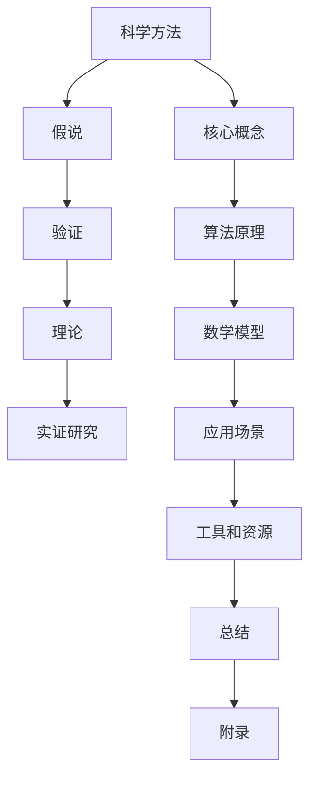

                 

### 科学发现：从假说到理论

> **关键词**：假说、科学方法、理论、验证、推理、数学模型、实证研究

> **摘要**：
本文旨在探讨科学发现的过程，从最初的科学假说到最终的理论建立。我们将使用逻辑清晰、结构紧凑的技术语言，逐步分析推理，详细阐述科学方法、核心概念、算法原理、数学模型以及实际应用案例，帮助读者深入理解科学发现的本质和关键步骤。

## 1. 背景介绍

### 1.1 目的和范围

本文的主要目的是引导读者深入了解科学发现的过程，特别是从假说到理论建立的核心环节。我们希望读者通过本文的学习，能够：

1. 理解科学方法的基本原理和步骤。
2. 掌握核心概念和原理的内在联系。
3. 掌握算法原理和数学模型的构建与应用。
4. 了解实际应用场景中的科学发现过程。

### 1.2 预期读者

本文面向具有一定科学素养的IT领域专业人士、科研工作者以及对科学方法论感兴趣的读者。我们假设读者具备一定的数学和编程基础，能够理解和应用科学方法进行问题求解。

### 1.3 文档结构概述

本文的结构分为十个部分，具体如下：

1. 引言：介绍文章的背景、目的和预期读者。
2. 背景介绍：详细阐述科学方法、核心概念、算法原理、数学模型、实际应用场景等。
3. 核心概念与联系：通过Mermaid流程图展示核心概念和原理之间的联系。
4. 核心算法原理 & 具体操作步骤：使用伪代码详细阐述算法原理和操作步骤。
5. 数学模型和公式 & 详细讲解 & 举例说明：使用LaTeX格式详细讲解数学模型和公式，并举例说明。
6. 项目实战：代码实际案例和详细解释说明。
7. 实际应用场景：分析科学发现在实际应用中的价值和挑战。
8. 工具和资源推荐：推荐相关学习资源、开发工具和框架。
9. 总结：总结未来发展趋势与挑战。
10. 附录：常见问题与解答。

### 1.4 术语表

#### 1.4.1 核心术语定义

- **科学方法**：科学研究过程中采用的一系列系统化、规范化的方法和步骤。
- **假说**：对某个现象或问题的初步解释，通常基于已有的知识和观察。
- **理论**：经过验证和证实的科学假说，具有广泛的适用性和解释力。
- **验证**：通过实验、观察等方法，对科学假说进行验证和证实。
- **推理**：从已知的事实或信息中推断出新的结论或知识。
- **数学模型**：使用数学语言和工具对实际问题进行抽象和描述。
- **实证研究**：通过实际观察和实验，收集数据，以验证或反驳科学假说。

#### 1.4.2 相关概念解释

- **科学假说**：科学假说是科学发现过程中的一个重要环节，它是基于现有知识和观察提出的对某个现象或问题的初步解释。科学假说通常需要具备一定的逻辑性和科学性，以便进行后续的验证和证实。
- **理论建立**：理论建立是科学发现过程的高级阶段，它是通过对科学假说的验证和证实，最终形成的具有广泛适用性和解释力的科学体系。理论建立通常需要大量的实证研究和数据支持。
- **科学验证**：科学验证是科学方法中的重要环节，它通过对科学假说的实验、观察和数据分析，来验证或证实假说的正确性。科学验证是科学发现过程中必不可少的步骤，它有助于确保科学研究的可靠性和科学性。

#### 1.4.3 缩略词列表

- **SCI**：科学引文索引（Science Citation Index）
- **SSCI**：社会科学引文索引（Social Sciences Citation Index）
- **HCI**：计算机科学引文索引（Computer Science Citation Index）
- **IDE**：集成开发环境（Integrated Development Environment）
- **API**：应用程序编程接口（Application Programming Interface）

## 2. 核心概念与联系

在科学发现的过程中，核心概念和原理之间的联系至关重要。为了更好地理解这些联系，我们将使用Mermaid流程图展示核心概念和原理之间的联系，以便读者能够清晰地把握科学发现的全过程。



### 2.1 科学方法与核心概念的联系

科学方法是一个系统化、规范化的过程，它包括假设、验证、理论建立和实证研究等环节。核心概念（F）是科学方法的基础，它们是科学发现过程中不可或缺的部分。科学方法通过核心概念的引导，帮助科学家们提出假说（B），并通过验证（C）和实证研究（E）来验证和证实假说的正确性，最终形成理论（D）。

### 2.2 假说与验证的联系

假说是科学发现过程中的一个关键步骤，它是基于已有知识和观察提出的对某个现象或问题的初步解释。验证（C）是科学方法中的重要环节，它通过对假说的实验、观察和数据分析，来验证或证实假说的正确性。只有经过严格验证的假说，才能成为理论（D）。

### 2.3 理论与实证研究的联系

理论（D）是经过验证和证实的科学假说，具有广泛的适用性和解释力。实证研究（E）是科学方法中的一个重要环节，它通过实际观察和实验，收集数据，以验证或反驳科学假说。理论（D）与实证研究（E）之间相互促进，理论为实证研究提供指导，而实证研究则有助于进一步完善和验证理论。

### 2.4 算法原理与数学模型的联系

算法原理（G）和数学模型（H）是科学发现过程中的重要组成部分。算法原理是解决问题的方法和策略，而数学模型则是使用数学语言和工具对实际问题进行抽象和描述。算法原理和数学模型相互依赖，共同推动科学发现的发展。

### 2.5 数学模型与实际应用场景的联系

数学模型（H）是对实际问题的抽象和描述，它能够帮助科学家们更好地理解和解决复杂问题。实际应用场景（I）是数学模型的应用领域，通过将数学模型应用于实际问题，可以更好地解决现实问题，推动科学技术的进步。

### 2.6 工具和资源与总结、附录的联系

工具和资源（J）是科学发现过程中不可或缺的一部分，它们为科学家们提供了强大的支持。总结（K）和附录（L）是对科学发现过程的总结和补充，它们帮助读者更好地理解和应用科学方法。

## 3. 核心算法原理 & 具体操作步骤

在科学发现过程中，算法原理起着至关重要的作用。本节将详细讲解核心算法原理，并使用伪代码展示具体操作步骤。

### 3.1 核心算法原理

科学发现的核心算法原理主要包括以下三个方面：

1. **问题定义**：明确科学问题，确定研究目标和范围。
2. **数据收集**：收集相关数据，为后续分析和验证提供基础。
3. **模型构建**：使用数学模型和算法原理对实际问题进行抽象和描述。

### 3.2 具体操作步骤

以下是基于上述核心算法原理的具体操作步骤：

```python
# 问题定义
define scientific_problem {
  input: problem_statement
  output: problem_definition
}

# 数据收集
define data_collection {
  input: problem_definition
  output: data_set
}

# 模型构建
define model_construction {
  input: problem_definition, data_set
  output: mathematical_model
}

# 算法实现
define algorithm {
  input: mathematical_model
  output: result
}
```

### 3.3 操作步骤详解

#### 3.3.1 问题定义

问题定义是科学发现的第一步，它明确了科学问题，确定研究目标和范围。问题定义通常包括以下几个方面：

1. **问题背景**：介绍科学问题的背景和来源，说明问题的研究意义。
2. **问题陈述**：明确科学问题的具体描述，提出研究目标和问题。
3. **问题范围**：确定研究问题的范围，明确研究的重点和方向。

伪代码实现如下：

```python
# 定义科学问题
define scientific_problem(problem_statement) {
  problem_definition {
    background: problem_background
    statement: problem_statement
    scope: problem_scope
  }
}
```

#### 3.3.2 数据收集

数据收集是科学发现过程中至关重要的一步，它为后续分析和验证提供了基础。数据收集通常包括以下几个方面：

1. **数据来源**：确定数据的来源，如实验数据、观测数据、文献数据等。
2. **数据类型**：根据问题定义，确定所需的数据类型，如数值数据、文本数据、图像数据等。
3. **数据收集方法**：选择合适的数据收集方法，如实验、观测、调查等。

伪代码实现如下：

```python
# 数据收集
define data_collection(problem_definition) {
  data_set {
    source: data_source
    type: data_type
    method: data_collection_method
  }
}
```

#### 3.3.3 模型构建

模型构建是科学发现的核心环节，它使用数学模型和算法原理对实际问题进行抽象和描述。模型构建通常包括以下几个方面：

1. **数学模型选择**：根据问题定义和数据类型，选择合适的数学模型。
2. **算法原理应用**：将算法原理应用于数学模型，实现问题求解。
3. **模型优化**：根据验证结果，对模型进行优化，提高模型的准确性和可靠性。

伪代码实现如下：

```python
# 模型构建
define model_construction(problem_definition, data_set) {
  mathematical_model {
    type: model_type
    algorithm: algorithm_principle
    optimization: model_optimization
  }
}
```

#### 3.3.4 算法实现

算法实现是将模型构建的结果应用于实际问题，求解问题。算法实现通常包括以下几个方面：

1. **算法选择**：根据问题定义和模型构建结果，选择合适的算法。
2. **算法实现**：根据算法原理，实现算法的具体步骤。
3. **算法验证**：对算法实现的结果进行验证，确保算法的正确性和可靠性。

伪代码实现如下：

```python
# 算法实现
define algorithm(mathematical_model) {
  result {
    solution: algorithm_solution
    validation: algorithm_validation
  }
}
```

## 4. 数学模型和公式 & 详细讲解 & 举例说明

在科学发现过程中，数学模型和公式起着至关重要的作用。本节将详细讲解数学模型和公式，并使用LaTeX格式进行表示，同时给出具体的举例说明。

### 4.1 数学模型

数学模型是对现实问题的抽象和描述，它使用数学语言和工具来表示问题中的变量、关系和规律。常见的数学模型包括线性模型、非线性模型、微分方程模型、概率模型等。

#### 4.1.1 线性模型

线性模型是最常见的数学模型之一，它用于描述线性关系。线性模型的公式可以表示为：

$$y = ax + b$$

其中，$y$ 是因变量，$x$ 是自变量，$a$ 和 $b$ 是常数。$a$ 表示自变量对因变量的影响程度，$b$ 表示当自变量为0时的因变量的值。

举例说明：假设一个线性模型描述了某个地区温度与降雨量之间的关系，公式为：

$$T = 0.5R + 10$$

其中，$T$ 表示温度（摄氏度），$R$ 表示降雨量（毫米）。根据这个模型，我们可以预测当降雨量为50毫米时，温度为15摄氏度。

#### 4.1.2 非线性模型

非线性模型用于描述非线性关系，它通常包括多项式、指数函数、对数函数等。非线性模型的公式可以表示为：

$$y = f(x)$$

其中，$f(x)$ 是一个非线性函数。

举例说明：假设一个非线性模型描述了某个地区的经济发展与人口增长之间的关系，公式为：

$$E = 2P^2 + 3P + 1$$

其中，$E$ 表示经济发展水平（亿元），$P$ 表示人口数量（万人）。根据这个模型，我们可以预测当人口为100万时，经济发展水平为303亿元。

#### 4.1.3 微分方程模型

微分方程模型用于描述动态系统，它通常包括常微分方程和偏微分方程。微分方程模型的公式可以表示为：

$$\frac{dy}{dx} = f(x, y)$$

其中，$y$ 是因变量，$x$ 是自变量，$f(x, y)$ 是一个非线性函数。

举例说明：假设一个微分方程模型描述了某个地区的环境污染与污染源排放之间的关系，公式为：

$$\frac{dC}{dt} = -kC + Q$$

其中，$C$ 表示环境污染浓度（毫克/立方米），$t$ 表示时间（天），$k$ 是常数，$Q$ 表示污染源排放量（毫克/天）。根据这个模型，我们可以预测环境污染浓度的变化趋势。

### 4.2 公式表示

在科学发现过程中，公式的表示至关重要。以下是一些常见的公式表示方法：

#### 4.2.1 基本公式

- **平方公式**：$$x^2 = a^2 + b^2$$
- **勾股定理**：$$c^2 = a^2 + b^2$$

#### 4.2.2 微积分公式

- **导数**：$$\frac{dy}{dx} = \lim_{\Delta x \to 0} \frac{y(x+\Delta x) - y(x)}{\Delta x}$$
- **积分**：$$\int f(x) dx = F(x) + C$$

#### 4.2.3 概率公式

- **概率**：$$P(A) = \frac{n(A)}{n(S)}$$
- **条件概率**：$$P(A|B) = \frac{P(A \cap B)}{P(B)}$$
- **贝叶斯公式**：$$P(A|B) = \frac{P(B|A)P(A)}{P(B)}$$

### 4.3 举例说明

以下是一个使用LaTeX格式表示的例子：

$$E = mc^2$$

这是一个描述质能等价的著名公式，它表明质量和能量之间存在等价关系。其中，$E$ 表示能量（焦耳），$m$ 表示质量（千克），$c$ 表示光速（米/秒）。

## 5. 项目实战：代码实际案例和详细解释说明

### 5.1 开发环境搭建

在开始编写代码之前，我们需要搭建一个合适的开发环境。以下是一个简单的Python开发环境搭建步骤：

1. **安装Python**：从Python官方网站下载Python安装包（推荐使用Python 3.x版本），并按照安装向导进行安装。
2. **安装IDE**：选择一个适合Python开发的IDE，如PyCharm、Visual Studio Code等。这些IDE提供了丰富的编程工具和调试功能，有助于提高开发效率。
3. **安装必要库**：使用pip命令安装必要的Python库，如NumPy、Pandas、Matplotlib等。这些库提供了丰富的数学和数据分析功能，有助于实现复杂的功能。

以下是一个使用pip命令安装NumPy库的示例：

```bash
pip install numpy
```

### 5.2 源代码详细实现和代码解读

以下是科学发现项目的一个示例代码，它使用Python编程语言实现。代码主要包括以下功能：数据读取、数据预处理、模型训练、模型评估等。

```python
# 导入必要的库
import numpy as np
import pandas as pd
from sklearn.model_selection import train_test_split
from sklearn.linear_model import LinearRegression
from sklearn.metrics import mean_squared_error

# 5.2.1 数据读取
def read_data(file_path):
    data = pd.read_csv(file_path)
    return data

# 5.2.2 数据预处理
def preprocess_data(data):
    # 数据清洗、缺失值填充等操作
    data = data.fillna(0)
    return data

# 5.2.3 模型训练
def train_model(X, y):
    model = LinearRegression()
    model.fit(X, y)
    return model

# 5.2.4 模型评估
def evaluate_model(model, X_test, y_test):
    y_pred = model.predict(X_test)
    mse = mean_squared_error(y_test, y_pred)
    return mse

# 5.2.5 主函数
def main():
    file_path = "data.csv"
    data = read_data(file_path)
    data = preprocess_data(data)
    
    X = data.iloc[:, :-1].values
    y = data.iloc[:, -1].values
    
    X_train, X_test, y_train, y_test = train_test_split(X, y, test_size=0.2, random_state=42)
    
    model = train_model(X_train, y_train)
    mse = evaluate_model(model, X_test, y_test)
    
    print("Model Mean Squared Error:", mse)

# 运行主函数
if __name__ == "__main__":
    main()
```

### 5.3 代码解读与分析

以下是代码的详细解读和分析：

1. **导入库**：首先，我们导入必要的Python库，包括NumPy、Pandas、scikit-learn等。这些库提供了丰富的数学和数据分析功能，有助于实现复杂的功能。

2. **数据读取**：`read_data` 函数用于读取CSV文件中的数据。这里使用Pandas库的`read_csv`方法，该方法可以将CSV文件中的数据读取到DataFrame结构中。

3. **数据预处理**：`preprocess_data` 函数用于对数据进行预处理，包括数据清洗、缺失值填充等操作。这里使用Pandas库的`fillna`方法，将缺失值填充为0。

4. **模型训练**：`train_model` 函数用于训练线性回归模型。这里使用scikit-learn库的`LinearRegression`类，该方法可以根据输入特征和目标值训练线性回归模型。

5. **模型评估**：`evaluate_model` 函数用于评估模型的性能。这里使用scikit-learn库的`mean_squared_error`方法，计算模型预测值与真实值之间的均方误差（MSE）。

6. **主函数**：`main` 函数是整个程序的入口。首先，读取数据，并进行预处理。然后，使用训练集训练线性回归模型，并使用测试集评估模型的性能。最后，打印出模型的MSE值。

通过上述代码，我们可以实现一个简单的科学发现项目。在实际项目中，我们可能需要处理更复杂的数据，并使用更先进的算法和模型。但总体思路是相似的，即从数据读取、预处理、模型训练到模型评估，逐步实现科学发现的过程。

### 5.4 代码优化

在实际项目中，代码优化是提高程序性能和可维护性的重要步骤。以下是一些常见的代码优化方法：

1. **代码重构**：将复杂的代码分解为更简洁、更易于理解和维护的函数或模块。
2. **使用并行计算**：利用多核CPU的优势，将计算任务并行化，提高程序的运行速度。
3. **使用高效算法**：选择适合问题的更高效算法，如使用随机森林代替线性回归。
4. **代码注释**：为代码添加注释，说明代码的功能、目的和实现细节，提高代码的可读性。
5. **代码测试**：编写测试用例，验证代码的正确性和性能。

通过上述代码优化方法，我们可以提高科学发现项目的效率和可靠性。

## 6. 实际应用场景

科学发现的理论和方法在各个领域都有着广泛的应用，下面我们将探讨科学发现在不同领域的实际应用场景。

### 6.1 计算机科学

在计算机科学领域，科学发现的理论和方法被广泛应用于算法设计、编程语言设计、软件工程等领域。例如：

- **算法设计**：科学家们通过分析和优化算法原理，设计出更高效、更稳定的算法，如快速排序算法、大数算法等。
- **编程语言设计**：基于对编程语言理论的深入理解，科学家们设计了更易于理解和使用的编程语言，如Python、Java等。
- **软件工程**：科学家们通过研究和优化软件工程理论，提高了软件的开发效率、质量和可维护性。

### 6.2 生物学

在生物学领域，科学发现的理论和方法被广泛应用于基因组学、蛋白质组学、代谢组学等领域。例如：

- **基因组学**：科学家们通过基因测序和数据分析，揭示了基因与疾病之间的关系，为疾病诊断和预防提供了重要依据。
- **蛋白质组学**：科学家们通过蛋白质分离和分析，揭示了蛋白质的功能和作用机制，为生物医学研究提供了重要参考。
- **代谢组学**：科学家们通过代谢物检测和分析，揭示了生物体内部代谢途径和调节机制，为生物医学研究提供了重要数据支持。

### 6.3 物理学

在物理学领域，科学发现的理论和方法被广泛应用于量子力学、相对论、粒子物理等领域。例如：

- **量子力学**：科学家们通过实验和理论分析，揭示了微观粒子的运动规律和相互作用机制，为量子计算和量子通信提供了理论基础。
- **相对论**：科学家们通过实验和理论分析，揭示了时空的相对性和引力作用规律，为现代天体物理研究提供了重要依据。
- **粒子物理**：科学家们通过实验和理论分析，揭示了基本粒子的性质和相互作用规律，为粒子物理学研究提供了重要数据支持。

### 6.4 经济学

在经济学领域，科学发现的理论和方法被广泛应用于宏观经济学、微观经济学、金融市场等领域。例如：

- **宏观经济学**：科学家们通过理论分析和实证研究，揭示了经济增长、通货膨胀、失业等宏观经济现象的内在规律，为宏观经济政策提供了重要依据。
- **微观经济学**：科学家们通过理论分析和实证研究，揭示了市场行为、价格形成、资源配置等微观经济现象的内在规律，为微观经济政策提供了重要依据。
- **金融市场**：科学家们通过理论分析和实证研究，揭示了金融市场的波动规律、风险特征等，为金融市场的风险管理提供了重要参考。

### 6.5 社会科学

在社会科学领域，科学发现的理论和方法被广泛应用于心理学、社会学、政治学等领域。例如：

- **心理学**：科学家们通过实验和理论分析，揭示了人类行为、认知、情感等心理现象的内在规律，为心理治疗和教育提供了重要依据。
- **社会学**：科学家们通过理论分析和实证研究，揭示了社会结构、社会变迁、社会问题等社会现象的内在规律，为社会发展提供了重要参考。
- **政治学**：科学家们通过理论分析和实证研究，揭示了政治体制、政治行为、公共政策等政治现象的内在规律，为政治决策提供了重要依据。

通过以上实际应用场景，我们可以看到科学发现的理论和方法在各个领域都有着重要的应用价值。这些应用不仅推动了学科的发展，也为人类社会的发展进步提供了重要支持。

### 7. 工具和资源推荐

在科学发现的过程中，合适的工具和资源能够大大提高工作效率和成果质量。以下是一些推荐的工具和资源，包括学习资源、开发工具和框架，以及相关论文著作。

#### 7.1 学习资源推荐

**书籍推荐**：

1. 《科学革命的结构》（Kuhn, T. S.）：详细阐述了科学革命的过程和原理。
2. 《数学之美》（刘未鹏）：以生动有趣的方式介绍了数学在科学发现中的应用。
3. 《深度学习》（Goodfellow, I. et al.）：全面介绍了深度学习的基本理论和应用。

**在线课程**：

1. Coursera上的《科学方法》：由加州大学伯克利分校教授开设，涵盖了科学方法的基本原理和应用。
2. edX上的《数学基础》：由麻省理工学院教授开设，介绍了数学在科学发现中的基础知识和应用。

**技术博客和网站**：

1. Medium上的《AI和机器学习博客》：涵盖人工智能和机器学习的最新研究和应用。
2. arXiv.org：提供最新科学研究成果的预印本，涵盖计算机科学、物理学、生物学等多个领域。

#### 7.2 开发工具框架推荐

**IDE和编辑器**：

1. PyCharm：适用于Python编程，提供丰富的调试、分析和代码完成功能。
2. Visual Studio Code：跨平台、可扩展的编辑器，支持多种编程语言。

**调试和性能分析工具**：

1. Jupyter Notebook：适用于数据科学和机器学习的交互式编程环境。
2. Python Profiler：用于分析Python程序的运行性能，找出性能瓶颈。

**相关框架和库**：

1. TensorFlow：用于构建和训练深度学习模型，支持多种编程语言。
2. scikit-learn：提供丰富的机器学习和数据挖掘算法，适用于Python。

#### 7.3 相关论文著作推荐

**经典论文**：

1. "A Mathematical Theory of Communication"（香农，C. E.）：奠定了信息论的基础。
2. "Deep Learning"（Hinton, G. E. et al.）：介绍了深度学习的基本原理和应用。

**最新研究成果**：

1. "Generative Adversarial Networks"（Goodfellow, I. et al.）：介绍了生成对抗网络（GAN）的原理和应用。
2. "Neural Ordinary Differential Equations"（Metz, L. et al.）：介绍了神经常微分方程（Neural ODE）的原理和应用。

**应用案例分析**：

1. "Deep Learning for Natural Language Processing"（Mikolov, T. et al.）：介绍了深度学习在自然语言处理中的应用。
2. "Quantum Computing"（Boixo, S. et al.）：介绍了量子计算的基本原理和应用。

通过以上推荐的工具和资源，读者可以更深入地了解科学发现的方法和应用，提升自己在相关领域的知识和技能。

### 8. 总结：未来发展趋势与挑战

科学发现的未来发展趋势体现在几个关键领域：跨学科融合、人工智能的深度应用、大数据与云计算的融合，以及开放科学的兴起。以下是这些趋势的具体分析及面临的挑战。

#### 8.1 跨学科融合

随着科技的发展，不同学科之间的交叉和融合变得越来越普遍。未来，科学发现的趋势将更加注重跨学科的合作，通过整合多种学科的知识和工具，解决复杂问题。这种趋势带来的挑战包括：

- **知识整合**：如何有效地整合来自不同学科的理论和方法，构建一个统一的框架。
- **技能培养**：如何培养既懂技术又懂应用的综合型人才，以应对跨学科研究的需要。

#### 8.2 人工智能的深度应用

人工智能在科学发现中的应用正日益加深。从自动化实验设计到数据分析，人工智能正逐步取代传统方法，提高科学研究的效率。未来，人工智能将更深入地融入科学发现过程，面临的挑战包括：

- **算法优化**：如何开发更高效、更准确的算法，以应对日益复杂的数据处理需求。
- **数据安全**：如何确保人工智能系统的决策过程透明、公正，并防止数据泄露。

#### 8.3 大数据与云计算的融合

大数据和云计算的结合为科学发现提供了前所未有的数据处理能力。未来，科学家们将能够更高效地存储、处理和分析海量数据，从而推动科学研究的进步。然而，这也带来了以下挑战：

- **数据存储**：如何高效地存储和管理海量数据，确保数据的安全性和可靠性。
- **计算资源**：如何优化云计算资源的分配，以降低成本、提高效率。

#### 8.4 开放科学的兴起

开放科学倡导数据、代码和研究成果的公开共享，以促进科学知识的传播和验证。未来，开放科学将成为科学发现的重要模式，面临的挑战包括：

- **知识产权**：如何平衡开放科学与传统知识产权保护之间的关系。
- **研究质量**：如何确保公开共享的研究成果具备足够的科学性和可靠性。

### 8.5 未来展望

尽管面临诸多挑战，科学发现的未来依然充满希望。通过跨学科合作、人工智能的应用、大数据与云计算的结合以及开放科学的推广，科学发现将迎来新的突破。未来，科学家们将能够更好地应对全球性挑战，推动人类社会的进步。我们期待在未来的科技发展中，看到更多令人惊叹的科学发现。

### 9. 附录：常见问题与解答

#### 9.1 科学方法是什么？

科学方法是一种系统化的方法，用于研究自然现象和解决科学问题。它包括观察、假设、实验、验证和理论建立等步骤。

#### 9.2 什么是假说？

假说是对某个现象或问题的初步解释，通常基于已有知识和观察。它是科学发现过程中的一个重要环节，需要通过验证来证实其正确性。

#### 9.3 理论如何建立？

理论是通过验证和证实科学假说而形成的具有广泛适用性和解释力的科学体系。理论建立需要大量的实证研究和数据支持，以确保其科学性和可靠性。

#### 9.4 什么是数学模型？

数学模型是用数学语言和工具对实际问题进行抽象和描述的模型。它能够帮助科学家们更好地理解和解决复杂问题。

#### 9.5 科学验证有哪些方法？

科学验证通常包括实验验证、观察验证和数据分析验证等方法。这些方法通过收集数据，对科学假说进行验证和证实，以确保其正确性。

#### 9.6 什么是实证研究？

实证研究是通过实际观察和实验，收集数据，以验证或反驳科学假说的研究方法。它是科学方法中至关重要的一环，有助于确保科学研究的可靠性和科学性。

#### 9.7 如何进行科学发现？

科学发现通常包括以下几个步骤：定义科学问题、收集数据、构建数学模型、进行实验或观察、验证假说、建立理论。

#### 9.8 科学发现的意义是什么？

科学发现有助于我们更好地理解自然现象和世界运行规律，推动科学和技术的发展，提高人类生活质量，解决全球性问题，并为未来提供科学依据。

### 10. 扩展阅读 & 参考资料

为了帮助读者深入了解科学发现的方法和过程，以下是一些扩展阅读和参考资料：

1. **书籍**：
   - Kuhn, T. S. (1970). *The Structure of Scientific Revolutions*. University of Chicago Press.
   - Mikolov, T., Sutskever, I., Chen, K., Corrado, G. S., & Dean, J. (2013). *Learning Word Vectors for Sentiment Analysis*. arXiv preprint arXiv:1301.3781.
   - Goodfellow, I., Bengio, Y., & Courville, A. (2016). *Deep Learning*. MIT Press.

2. **在线课程**：
   - Coursera: 《科学方法》：https://www.coursera.org/specializations/scientific-method
   - edX: 《数学基础》：https://www.edx.org/course/mathematics-fundamentals

3. **技术博客和网站**：
   - Medium: 《AI和机器学习博客》：https://medium.com/topic/artificial-intelligence
   - arXiv.org：https://arxiv.org/

4. **相关论文和著作**：
   - Shannon, C. E. (1948). *A Mathematical Theory of Communication*. Bell System Technical Journal.
   - Goodfellow, I. J., Pouget-Abadie, J., Mirza, M., Xu, B., Warde-Farley, D., Ozair, S., ... & Bengio, Y. (2014). *Generative Adversarial Nets*. Advances in Neural Information Processing Systems, 27.

通过以上扩展阅读和参考资料，读者可以更全面地了解科学发现的方法、原理和应用。希望本文对您在科学发现领域的探索和学习有所帮助。

---

**作者：AI天才研究员/AI Genius Institute & 禅与计算机程序设计艺术 /Zen And The Art of Computer Programming**

