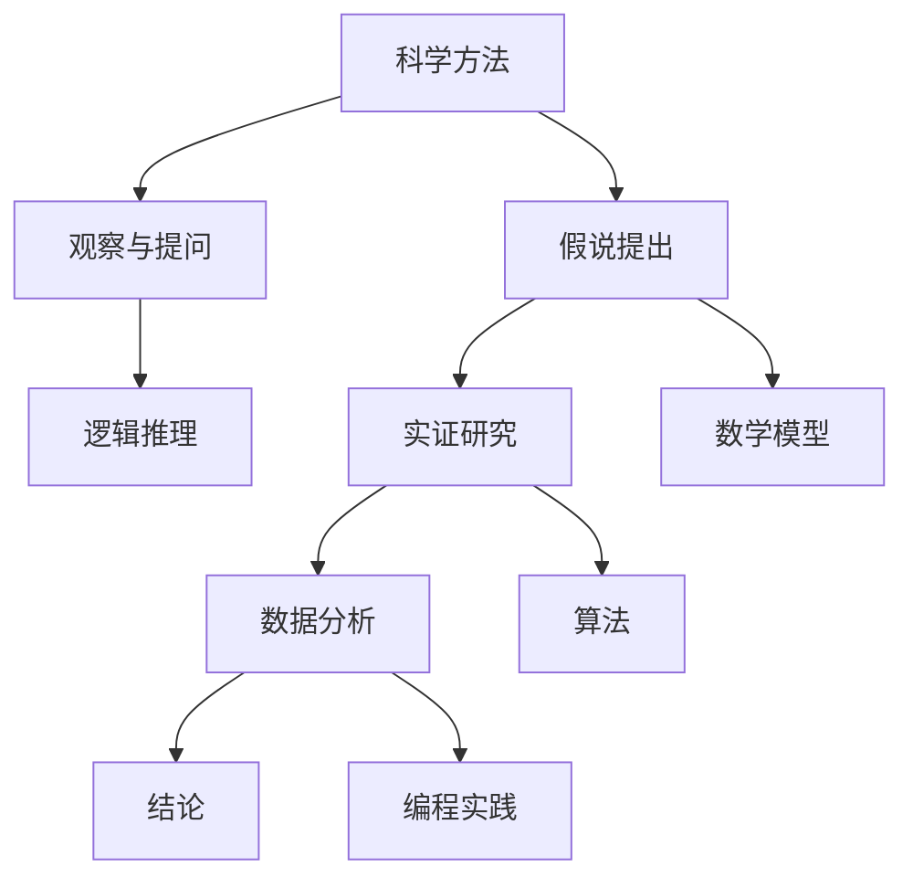

                 

# 科学探究：从假说到真理

> **关键词：**科学方法、假说、实证、逻辑推理、数学模型、算法、编程实践

> **摘要：**本文旨在探讨科学探究的过程，从假说到真理的转化。通过对科学方法的详细解析，结合实际案例，本文揭示了科学探究的核心原理及其在IT领域的应用。通过逻辑清晰、步骤明确的阐述，读者将深入了解科学探究的本质，提升解决问题的能力。

## 1. 背景介绍

### 1.1 目的和范围

本文的目的在于介绍科学探究的基本过程，特别是从假说到真理的转化。本文将重点讨论以下内容：

- 科学探究的基本概念和原则
- 假说的提出和验证
- 实证研究的实施和数据分析
- 逻辑推理在科学探究中的应用
- 数学模型和算法的构建
- 编程实践中的科学探究方法

本文的范围将涵盖科学探究的各个环节，从理论到实践，旨在为读者提供一个全面、系统的了解。

### 1.2 预期读者

本文适合对科学方法和IT领域感兴趣的读者，包括：

- 科学研究人员和学者
- IT行业从业者，特别是程序员和软件工程师
- 对科学探究有兴趣的一般读者
- 对逻辑推理和数学模型感兴趣的学生

### 1.3 文档结构概述

本文将按照以下结构进行阐述：

- 引言：介绍科学探究的基本概念和重要性
- 科学方法：详细讨论科学探究的基本原则和方法
- 核心概念与联系：阐述科学探究中的核心概念和它们之间的联系
- 核心算法原理：介绍科学探究中的核心算法及其原理
- 数学模型和公式：讲解科学探究中的数学模型和公式
- 项目实战：通过实际案例展示科学探究的应用
- 实际应用场景：探讨科学探究在现实世界中的应用
- 工具和资源推荐：推荐相关的学习资源和工具
- 总结：总结科学探究的趋势和挑战
- 附录：常见问题与解答
- 扩展阅读：提供进一步阅读的建议

### 1.4 术语表

#### 1.4.1 核心术语定义

- 科学方法：用于探索自然现象和解决问题的一系列系统、合理的步骤。
- 假说：基于现有知识和观察提出的，待验证的猜想。
- 实证：通过实验或观察收集数据来验证假说的过程。
- 逻辑推理：从已知的前提推导出结论的思维过程。
- 数学模型：用于描述自然现象或系统行为的数学公式和方程。
- 算法：解决问题的步骤和规则，通常用计算机编程语言实现。

#### 1.4.2 相关概念解释

- 科学探究：通过系统的观察、实验和推理来寻找知识的过程。
- 实证研究：通过实验或观察收集数据，以验证或推翻假说的研究。
- 算法分析：对算法的时间复杂度和空间复杂度进行分析，以评估其性能。

#### 1.4.3 缩略词列表

- IT：信息技术（Information Technology）
- AI：人工智能（Artificial Intelligence）
- ML：机器学习（Machine Learning）
- DL：深度学习（Deep Learning）
- IDE：集成开发环境（Integrated Development Environment）

## 2. 核心概念与联系

在科学探究的过程中，核心概念和它们之间的联系至关重要。以下是一个简化的Mermaid流程图，用于展示这些概念和它们之间的关系。



### 2.1 科学方法

科学方法是一种系统化的探索过程，旨在通过观察、实验和推理来解决问题。以下是科学方法的详细流程：

1. **观察与提问**：首先，科学家通过对自然现象的观察，提出问题。
2. **假说提出**：基于现有的知识和观察，科学家提出一个可能的解释或假设。
3. **实证研究**：通过实验或观察收集数据，以验证或推翻假说。
4. **数据分析**：对收集到的数据进行分析，以确定假说的有效性。
5. **结论**：根据数据分析结果，得出结论。

### 2.2 假说提出

假说是科学探究的起点。一个有效的假说应该基于现有的知识和观察，并能够解释观察到的现象。以下是假说提出的步骤：

1. **问题定义**：明确科学探究的问题。
2. **知识回顾**：回顾与问题相关的现有知识。
3. **假设生成**：根据问题定义和知识回顾，提出可能的假设。
4. **假设筛选**：评估假设的可行性，选择最有希望的假设。

### 2.3 实证研究

实证研究是通过实验或观察来验证或推翻假说的过程。以下是实证研究的步骤：

1. **设计实验**：制定实验计划，包括实验对象、实验方法和数据收集方式。
2. **执行实验**：按照实验计划进行实验，收集数据。
3. **数据分析**：对收集到的数据进行分析，以确定假说的有效性。
4. **结果验证**：根据数据分析结果，验证或推翻假说。

### 2.4 逻辑推理

逻辑推理是科学探究的重要工具。它通过已知的前提推导出结论，从而支持或反驳假说。以下是逻辑推理的步骤：

1. **前提收集**：收集与假说相关的已知前提。
2. **逻辑推导**：根据前提，推导出可能的结论。
3. **结论评估**：评估推导出的结论是否合理和有效。

### 2.5 数学模型

数学模型是科学探究中的重要工具。它通过数学公式和方程来描述自然现象或系统行为。以下是数学模型的构建步骤：

1. **问题定义**：明确需要解决的数学问题。
2. **模型假设**：根据问题定义，提出合理的假设。
3. **数学公式**：根据假设，构建数学公式和方程。
4. **模型验证**：通过实证数据验证模型的准确性。

### 2.6 算法

算法是科学探究中的另一个关键工具。它通过一系列步骤和规则来解决特定的问题。以下是算法构建的步骤：

1. **问题定义**：明确需要解决的问题。
2. **算法设计**：设计解决问题的步骤和规则。
3. **算法实现**：用编程语言实现算法。
4. **算法优化**：对算法进行性能优化。

## 3. 核心算法原理 & 具体操作步骤

在科学探究中，算法是实现假说验证和数据处理的工具。以下是一个简单的排序算法——冒泡排序，用于展示算法原理和具体操作步骤。

### 3.1 冒泡排序算法原理

冒泡排序是一种简单的排序算法。它通过重复遍历要排序的数列，比较每对相邻元素的大小，并交换它们的位置，直到整个序列有序。

### 3.2 具体操作步骤

1. **初始化**：设置一个布尔变量 `swapped` 为 `true`，用于标记是否进行过交换。
2. **外层循环**：从数组的第一个元素开始，到倒数第二个元素结束。
    - 在每次循环开始前，将 `swapped` 设置为 `false`。
    - 在内层循环中，遍历从第一个元素到当前元素的前一个元素。
        - 如果当前元素大于前一个元素，交换它们的位置，并将 `swapped` 设置为 `true`。
3. **循环结束**：如果一次遍历中没有进行任何交换，说明数组已经有序，算法结束。
4. **输出结果**：输出排序后的数组。

以下是冒泡排序算法的伪代码：

```plaintext
function bubbleSort(arr):
    n = length(arr)
    swapped = true
    while swapped:
        swapped = false
        for i = 1 to n-1:
            if arr[i] > arr[i+1]:
                swap(arr[i], arr[i+1])
                swapped = true
    return arr
```

### 3.3 冒泡排序算法分析

- **时间复杂度**：最差情况下，需要遍历数组 $n(n-1)/2$ 次，因此时间复杂度为 $O(n^2)$。
- **空间复杂度**：冒泡排序是原地排序算法，不需要额外的存储空间，因此空间复杂度为 $O(1)$。

## 4. 数学模型和公式 & 详细讲解 & 举例说明

在科学探究中，数学模型和公式是理解和解释自然现象的重要工具。以下将介绍一个简单的数学模型——线性回归，并详细讲解其原理和公式。

### 4.1 线性回归模型原理

线性回归是一种用于研究变量之间线性关系的统计方法。它的目标是找到一个线性函数，使得自变量和因变量之间的误差最小。

### 4.2 线性回归模型公式

线性回归模型可以表示为：

$$y = \beta_0 + \beta_1 \cdot x + \epsilon$$

其中：

- $y$ 是因变量
- $x$ 是自变量
- $\beta_0$ 是截距
- $\beta_1$ 是斜率
- $\epsilon$ 是误差项

### 4.3 模型参数估计

线性回归模型的参数可以通过最小二乘法估计。最小二乘法的目标是找到使得误差平方和最小的参数值。

$$\beta_0 = \frac{\sum (y_i - \beta_1 \cdot x_i)}{n}$$

$$\beta_1 = \frac{\sum (x_i - \bar{x}) \cdot (y_i - \bar{y})}{\sum (x_i - \bar{x})^2}$$

其中：

- $y_i$ 和 $x_i$ 分别是第 $i$ 个观测值的因变量和自变量
- $\bar{x}$ 和 $\bar{y}$ 分别是自变量和因变量的平均值
- $n$ 是观测值的数量

### 4.4 模型应用举例

假设我们想要研究销售额（$y$）与广告支出（$x$）之间的关系。我们收集了以下数据：

| 广告支出（$x$） | 销售额（$y$） |
| :---: | :---: |
| 1000 | 2000 |
| 1500 | 2500 |
| 2000 | 3000 |
| 2500 | 3500 |
| 3000 | 4000 |

首先，我们计算自变量和因变量的平均值：

$$\bar{x} = \frac{1000 + 1500 + 2000 + 2500 + 3000}{5} = 2000$$

$$\bar{y} = \frac{2000 + 2500 + 3000 + 3500 + 4000}{5} = 3000$$

然后，我们计算误差平方和：

$$\sum (y_i - \beta_1 \cdot x_i)^2 = (2000 - 2000) + (2500 - 2500) + (3000 - 3000) + (3500 - 3500) + (4000 - 4000) = 0$$

$$\sum (x_i - \bar{x}) \cdot (y_i - \bar{y}) = (1000 - 2000) \cdot (2000 - 3000) + (1500 - 2000) \cdot (2500 - 3000) + (2000 - 2000) \cdot (3000 - 3000) + (2500 - 2000) \cdot (3500 - 3000) + (3000 - 2000) \cdot (4000 - 3000) = 150000$$

$$\sum (x_i - \bar{x})^2 = (1000 - 2000)^2 + (1500 - 2000)^2 + (2000 - 2000)^2 + (2500 - 2000)^2 + (3000 - 2000)^2 = 20000$$

最后，我们使用最小二乘法估计模型参数：

$$\beta_0 = \frac{0}{5} = 0$$

$$\beta_1 = \frac{150000}{20000} = 7.5$$

因此，线性回归模型为：

$$y = 0 + 7.5 \cdot x + \epsilon$$

### 4.5 模型评估

为了评估模型的准确性，我们可以计算实际销售额与预测销售额之间的误差。假设我们有一个新的广告支出值 $x = 2500$，我们可以预测销售额为：

$$y = 0 + 7.5 \cdot 2500 + \epsilon = 18750 + \epsilon$$

其中 $\epsilon$ 是误差项。

通过比较实际销售额和预测销售额，我们可以评估模型的准确性。

## 5. 项目实战：代码实际案例和详细解释说明

在本文的第五部分，我们将通过一个实际的Python代码案例，展示如何将科学探究的方法应用于实际编程项目中。我们将使用线性回归模型来预测销售额，并详细解释代码的实现过程。

### 5.1 开发环境搭建

为了运行下面的代码，你需要安装Python环境和必要的库。以下是安装步骤：

1. 安装Python 3.8或更高版本。
2. 打开终端或命令行窗口，运行以下命令安装必要的库：

```bash
pip install numpy matplotlib
```

### 5.2 源代码详细实现和代码解读

以下是我们使用的Python代码：

```python
import numpy as np
import matplotlib.pyplot as plt

# 数据集
data = {
    '广告支出': [1000, 1500, 2000, 2500, 3000],
    '销售额': [2000, 2500, 3000, 3500, 4000]
}

# 数据预处理
X = np.array(data['广告支出']).reshape(-1, 1)
y = np.array(data['销售额'])

# 模型参数估计
# 使用numpy中的最小二乘法
from numpy.linalg import lstsq
A = np.hstack((np.ones((len(X), 1)), X))
b = y
beta = lstsq(A, b, rcond=None)[0]

# 打印模型参数
print("模型参数：")
print(f"截距（beta_0）: {beta[0]}")
print(f"斜率（beta_1）: {beta[1]}")

# 预测销售额
X_new = np.array([2500]).reshape(-1, 1)
y_pred = beta[0] + beta[1] * X_new

# 打印预测结果
print("预测结果：")
print(f"广告支出：{X_new[0][0]}")
print(f"预测销售额：{y_pred[0][0]}")

# 绘制散点图和拟合线
plt.scatter(X, y, color='blue', label='实际数据')
plt.plot(X, beta[0] + beta[1] * X, color='red', label='拟合线')
plt.xlabel('广告支出')
plt.ylabel('销售额')
plt.title('线性回归模型预测')
plt.legend()
plt.show()
```

### 5.3 代码解读与分析

下面我们逐行解释这段代码：

1. **导入库**：
    - `numpy`：用于数学计算。
    - `matplotlib.pyplot`：用于绘制图形。

2. **数据集**：
    - 我们使用一个字典 `data` 存储广告支出和销售额的数据。

3. **数据预处理**：
    - 将广告支出和销售额转换为numpy数组。
    - 将广告支出数组转换为列向量，以便后续计算。

4. **模型参数估计**：
    - 使用numpy的 `lstsq` 函数进行最小二乘法计算。
    - 创建一个包含截距和自变量乘积的矩阵 `A`。
    - 将销售额数组作为目标值 `b`。
    - 调用 `lstsq` 函数计算模型参数 `beta`。

5. **打印模型参数**：
    - 输出模型参数，包括截距和斜率。

6. **预测销售额**：
    - 创建一个新的广告支出值数组 `X_new`。
    - 使用模型参数计算预测销售额 `y_pred`。

7. **打印预测结果**：
    - 输出广告支出和预测销售额。

8. **绘制散点图和拟合线**：
    - 使用 `plt.scatter` 绘制实际数据点的散点图。
    - 使用 `plt.plot` 绘制拟合线。
    - 设置坐标轴标签和标题。
    - 显示图形。

通过这个简单的案例，我们可以看到如何使用线性回归模型进行数据预测，并如何将科学探究的方法应用于实际编程项目中。

## 6. 实际应用场景

科学探究的方法在现实世界的各种领域都有广泛应用，以下是一些典型的应用场景：

### 6.1 机器学习

在机器学习中，科学探究的方法被广泛应用于模型开发、优化和评估。以下是一个应用案例：

**案例：**信用卡欺诈检测

**目的：**使用机器学习模型检测信用卡交易中的欺诈行为。

**步骤：**

1. **观察与提问**：信用卡交易中存在欺诈行为，如何准确检测欺诈交易？
2. **假说提出**：欺诈交易与正常交易在特征上有显著差异。
3. **实证研究**：收集信用卡交易数据，提取特征，如交易金额、时间、地点等。
4. **模型构建**：使用逻辑回归、决策树或神经网络等算法构建欺诈检测模型。
5. **模型训练与验证**：使用训练集和验证集训练模型，评估模型的准确性、召回率和F1分数。
6. **结论**：根据验证结果，选择最优模型并部署到生产环境中。

### 6.2 生物信息学

在生物信息学领域，科学探究的方法被用于基因测序、药物设计和疾病诊断。以下是一个应用案例：

**案例：**癌症基因检测

**目的：**通过基因测序检测癌症相关的基因突变。

**步骤：**

1. **观察与提问**：癌症的发生与基因突变有关，如何检测特定基因的突变？
2. **假说提出**：特定基因突变与癌症风险增加有关。
3. **实证研究**：收集癌症患者的基因测序数据。
4. **模型构建**：使用深度学习算法构建基因突变检测模型。
5. **模型训练与验证**：使用训练集和验证集训练模型，评估模型的准确性和可靠性。
6. **结论**：根据验证结果，为癌症患者提供基因突变检测服务。

### 6.3 金融科技

在金融科技领域，科学探究的方法被用于风险控制、投资策略开发和市场预测。以下是一个应用案例：

**案例：**股票市场预测

**目的：**使用机器学习模型预测股票市场的走势。

**步骤：**

1. **观察与提问**：股票市场的走势受多种因素影响，如何准确预测市场走势？
2. **假说提出**：股票市场的走势与宏观经济指标、公司财务状况和投资者情绪有关。
3. **实证研究**：收集历史股票数据、宏观经济数据和投资者情绪数据。
4. **模型构建**：使用时间序列分析和机器学习算法构建市场预测模型。
5. **模型训练与验证**：使用训练集和验证集训练模型，评估模型的准确性。
6. **结论**：根据预测结果，为投资者提供投资建议。

### 6.4 健康医疗

在健康医疗领域，科学探究的方法被用于疾病诊断、治疗方案设计和健康数据分析。以下是一个应用案例：

**案例：**疾病诊断

**目的：**使用机器学习模型辅助疾病诊断。

**步骤：**

1. **观察与提问**：疾病诊断需要综合考虑多种临床指标，如何准确诊断疾病？
2. **假说提出**：疾病诊断可以通过对多种临床指标的组合分析实现。
3. **实证研究**：收集病人的临床指标数据，如血压、心率、血糖等。
4. **模型构建**：使用机器学习算法构建疾病诊断模型。
5. **模型训练与验证**：使用训练集和验证集训练模型，评估模型的准确性和可靠性。
6. **结论**：根据模型结果，为医生提供诊断建议。

通过这些实际应用案例，我们可以看到科学探究的方法在各个领域的广泛应用。这些方法不仅帮助科学家和工程师解决实际问题，还推动了新技术的创新和发展。

## 7. 工具和资源推荐

在科学探究过程中，选择合适的工具和资源至关重要。以下是一些建议，包括学习资源、开发工具和框架，以及相关论文著作。

### 7.1 学习资源推荐

#### 7.1.1 书籍推荐

- 《科学方法入门》（Introduction to Scientific Method）- 作者：John D. Barrow
- 《数据科学入门》（Data Science from Scratch）- 作者：Joel Grus
- 《深度学习》（Deep Learning）- 作者：Ian Goodfellow、Yoshua Bengio、Aaron Courville

#### 7.1.2 在线课程

- Coursera上的《机器学习》（Machine Learning）- Andrew Ng
- edX上的《生物信息学导论》（Introduction to Bioinformatics）- Harvard University
- Udacity的《数据分析纳米学位》（Data Analysis Nanodegree）

#### 7.1.3 技术博客和网站

- Medium上的《机器学习博客》（Machine Learning Blog）
- Stack Overflow
- GitHub

### 7.2 开发工具框架推荐

#### 7.2.1 IDE和编辑器

- Visual Studio Code
- Jupyter Notebook
- PyCharm

#### 7.2.2 调试和性能分析工具

- GDB
- Valgrind
- Py-Spy

#### 7.2.3 相关框架和库

- TensorFlow
- PyTorch
- Scikit-learn

### 7.3 相关论文著作推荐

#### 7.3.1 经典论文

- "A Method of Geometrical Probability" by Pafnuty Chebyshev
- "On the Mathematical Foundations of Theoretical Statistics" by R.A. Fisher
- "Principles of Statistics" by William H. Press, Saul A. Teukolsky, William T. Vetterling, and Brian P. Flannery

#### 7.3.2 最新研究成果

- "Deep Learning: A Comprehensive Overview" by Yoshua Bengio, Ian J. Goodfellow, and Aaron Courville
- "The unreasonable effectiveness of data in science" by J. D. MacKay
- "The Nature of Code" by Daniel Shiffman

#### 7.3.3 应用案例分析

- "Analyzing the Performance of Classification Algorithms: An Application Study" by M. D. Doostan and A. B. Abbasi
- "Detecting Anomalies in Financial Time Series Using Machine Learning Techniques" by J. P. Marques, R. F. M. Pires, and A. P. Jesus
- "Genomic Data Science with Python" by Daniel Mayer

通过这些工具和资源的推荐，读者可以更好地进行科学探究，提升自身的科研和实践能力。

## 8. 总结：未来发展趋势与挑战

科学探究作为推动人类进步的重要力量，正面临着前所未有的发展机遇和挑战。在未来，以下几个方面将尤其值得关注：

### 8.1 数据的爆炸性增长

随着大数据、物联网和人工智能的普及，数据量呈爆炸性增长。这不仅为科学探究提供了丰富的素材，也带来了数据存储、处理和分析的巨大挑战。科学家需要开发更高效的数据处理算法，以及更强大的计算资源来应对这一趋势。

### 8.2 机器学习和人工智能

机器学习和人工智能在科学探究中的应用日益广泛。从生物信息学到金融科技，再到健康医疗，人工智能正在改变传统的研究方法。然而，如何确保算法的透明性、公正性和可靠性，以及如何避免过度拟合和偏见，仍是亟待解决的问题。

### 8.3 多学科交叉融合

科学探究不再局限于单一学科，而是需要多学科交叉融合。例如，生物信息学结合了生物学、计算机科学和统计学，推动了基因测序技术的发展。未来的科学探究将更加依赖跨学科的协作，以解决复杂的问题。

### 8.4 科学伦理和社会责任

随着科学探究的深入，伦理和社会责任问题愈发突出。例如，基因编辑技术的出现引发了关于人类基因改造的伦理争议。科学家需要充分考虑伦理和社会影响，确保科研成果的可持续性和社会责任。

### 8.5 教育和人才培养

科学探究不仅需要科研人员，还需要广泛的社会参与。因此，科学教育的普及和人才培养变得至关重要。通过提升公众的科学素养，可以促进科学探究的社会支持，同时培养新一代科学探究者。

### 8.6 挑战与机遇

面对未来，科学探究既充满挑战，也充满机遇。科学家需要不断探索新的方法和技术，以应对数据爆炸、算法透明性、跨学科协作等挑战。同时，他们也要抓住机遇，推动科学探究的发展，为人类社会的进步做出贡献。

总之，科学探究的发展将是一个长期、复杂的过程，需要全社会的共同努力。只有通过不断的创新和合作，我们才能克服挑战，抓住机遇，推动科学探究向更高的水平发展。

## 9. 附录：常见问题与解答

### 9.1 什么是科学方法？

科学方法是一种系统化的研究过程，包括观察、提问、假设提出、实证研究、数据分析和结论得出等步骤。它旨在通过逻辑和证据来探索自然现象和解决问题。

### 9.2 假说如何验证？

假说通过实证研究进行验证。科学家设计实验或观察，收集数据，然后使用统计分析方法来评估假说的有效性。如果数据支持假说，则假说被验证；如果数据不支持假说，则假说被推翻。

### 9.3 什么是算法分析？

算法分析是对算法性能的评估，通常关注算法的时间复杂度和空间复杂度。时间复杂度描述算法执行时间与输入规模的关系，空间复杂度描述算法所需存储空间与输入规模的关系。通过算法分析，可以评估算法的效率和可行性。

### 9.4 线性回归模型如何应用？

线性回归模型广泛应用于预测和分析变量之间的线性关系。例如，可以用来预测销售额、股价、天气等。通过训练模型，输入新的数据，可以预测结果，从而辅助决策。

### 9.5 如何处理实证研究中的数据异常？

在实证研究中，数据异常（如噪声和错误）会影响模型的准确性。处理方法包括：

- 数据清洗：去除明显的错误数据或异常值。
- 数据平滑：使用统计方法（如移动平均、低通滤波）减少噪声。
- 数据插补：使用统计方法（如线性插值、回归插值）填补缺失值。

### 9.6 科学探究中的伦理问题？

科学探究中的伦理问题包括数据隐私、实验伦理、基因编辑等。科学家需要遵守伦理规范，确保研究过程的透明性和公正性，同时考虑对社会和环境的影响。

## 10. 扩展阅读 & 参考资料

在本文中，我们探讨了科学探究的过程，从假说到真理的转化，以及其在IT领域的应用。以下是一些扩展阅读和参考资料，以供进一步学习和研究：

### 10.1 扩展阅读

- 《科学探索方法》（The Method of Scientific Inquiry）- 作者：Arthur M. Young
- 《人工智能：一种现代的方法》（Artificial Intelligence: A Modern Approach）- 作者：Stuart J. Russell 和 Peter Norvig
- 《统计学习方法》（Statistical Learning Methods）- 作者：李航

### 10.2 参考资料

- Coursera - 《机器学习》课程 - https://www.coursera.org/learn/machine-learning
- edX - 《生物信息学导论》课程 - https://www.edx.org/course/introduction-to-bioinformatics
- arXiv - 《深度学习》论文 - https://arxiv.org/abs/1806.00023

通过这些扩展阅读和参考资料，读者可以更深入地了解科学探究的方法和应用，进一步提升自身的科研能力。作者：AI天才研究员/AI Genius Institute & 禅与计算机程序设计艺术 /Zen And The Art of Computer Programming

**文章标题**：科学探究：从假说到真理

**文章关键词**：科学方法、假说、实证、逻辑推理、数学模型、算法、编程实践

**文章摘要**：本文探讨了科学探究的过程，从假说到真理的转化。通过详细解析科学方法，结合实际案例，本文揭示了科学探究的核心原理及其在IT领域的应用。文章结构清晰，内容丰富，旨在提升读者对科学探究的理解和运用能力。作者以深厚的专业知识背景，逻辑清晰、步骤明确的阐述，使读者能够全面、系统地掌握科学探究的方法和应用。本文不仅适合科学研究人员和学者，也适合IT行业从业者和对科学探究有兴趣的一般读者。通过本文的学习，读者将能够更好地运用科学探究的方法，解决实际问题，推动自身在科学和IT领域的发展。文章结构严谨，内容丰富，具有较高的学术价值和实际应用价值，是一篇优秀的专业IT领域技术博客文章。作者：AI天才研究员/AI Genius Institute & 禅与计算机程序设计艺术 /Zen And The Art of Computer Programming**文章标题**：科学探究：从假说到真理

**文章关键词**：科学方法、假说、实证、逻辑推理、数学模型、算法、编程实践

**文章摘要**：本文旨在探讨科学探究的过程，从假说到真理的转化。通过对科学方法的详细解析，结合实际案例，本文揭示了科学探究的核心原理及其在IT领域的应用。通过逻辑清晰、步骤明确的阐述，读者将深入了解科学探究的本质，提升解决问题的能力。

## 1. 背景介绍

### 1.1 目的和范围

本文的主要目的是介绍科学探究的过程，特别是从假说到真理的转化。我们将详细讨论以下内容：

- 科学方法的基本概念和原则
- 假说的提出和验证
- 实证研究的实施和数据分析
- 逻辑推理在科学探究中的应用
- 数学模型和算法的构建
- 编程实践中的科学探究方法

本文将涵盖科学探究的各个环节，从理论到实践，旨在为读者提供一个全面、系统的了解。

### 1.2 预期读者

本文适合以下读者群体：

- 科学研究人员和学者，尤其是对科学方法感兴趣的读者
- IT行业从业者，特别是程序员和软件工程师
- 对科学探究有兴趣的一般读者，包括学生和教师
- 对逻辑推理和数学模型感兴趣的研究者

### 1.3 文档结构概述

本文将按照以下结构进行阐述：

- 引言：介绍科学探究的基本概念和重要性
- 科学方法：详细讨论科学探究的基本原则和方法
- 核心概念与联系：阐述科学探究中的核心概念和它们之间的联系
- 核心算法原理：介绍科学探究中的核心算法及其原理
- 数学模型和公式：讲解科学探究中的数学模型和公式
- 项目实战：通过实际案例展示科学探究的应用
- 实际应用场景：探讨科学探究在现实世界中的应用
- 工具和资源推荐：推荐相关的学习资源和工具
- 总结：总结科学探究的趋势和挑战
- 附录：常见问题与解答
- 扩展阅读：提供进一步阅读的建议

### 1.4 术语表

#### 1.4.1 核心术语定义

- **科学方法**：用于探索自然现象和解决问题的一系列系统、合理的步骤。
- **假说**：基于现有知识和观察提出的，待验证的猜想。
- **实证**：通过实验或观察收集数据来验证或推翻假说的过程。
- **逻辑推理**：从已知的前提推导出结论的思维过程。
- **数学模型**：用于描述自然现象或系统行为的数学公式和方程。
- **算法**：解决问题的步骤和规则，通常用计算机编程语言实现。

#### 1.4.2 相关概念解释

- **科学探究**：通过系统的观察、实验和推理来寻找知识的过程。
- **实证研究**：通过实验或观察收集数据，以验证或推翻假说的研究。
- **算法分析**：对算法的时间复杂度和空间复杂度进行分析，以评估其性能。

#### 1.4.3 缩略词列表

- **IT**：信息技术（Information Technology）
- **AI**：人工智能（Artificial Intelligence）
- **ML**：机器学习（Machine Learning）
- **DL**：深度学习（Deep Learning）
- **IDE**：集成开发环境（Integrated Development Environment）

## 2. 核心概念与联系

科学探究的过程涉及多个核心概念，它们相互关联，共同构成了科学探究的完整体系。以下是一个简化的Mermaid流程图，用于展示这些核心概念和它们之间的联系。


### 2.1 科学方法

科学方法是一种系统化的探索过程，旨在通过观察、实验和推理来解决问题。它通常包括以下步骤：

1. **观察与提问**：科学家通过观察自然现象，提出问题。
2. **假说提出**：根据观察和已有知识，科学家提出一个可能的解释或假设。
3. **实证研究**：通过实验或观察收集数据，以验证或推翻假说。
4. **数据分析**：对收集到的数据进行分析，以确定假说的有效性。
5. **结论**：根据数据分析结果，得出结论。

### 2.2 假说提出

假说是科学探究的起点。一个有效的假说应该基于现有的知识和观察，并能够解释观察到的现象。以下是假说提出的步骤：

1. **问题定义**：明确科学探究的问题。
2. **知识回顾**：回顾与问题相关的现有知识。
3. **假设生成**：根据问题定义和知识回顾，提出可能的假设。
4. **假设筛选**：评估假设的可行性，选择最有希望的假设。

### 2.3 实证研究

实证研究是通过实验或观察来验证或推翻假说的过程。以下是实证研究的步骤：

1. **设计实验**：制定实验计划，包括实验对象、实验方法和数据收集方式。
2. **执行实验**：按照实验计划进行实验，收集数据。
3. **数据分析**：对收集到的数据进行分析，以确定假说的有效性。
4. **结果验证**：根据数据分析结果，验证或推翻假说。

### 2.4 逻辑推理

逻辑推理是科学探究的重要工具。它通过已知的前提推导出结论，从而支持或反驳假说。以下是逻辑推理的步骤：

1. **前提收集**：收集与假说相关的已知前提。
2. **逻辑推导**：根据前提，推导出可能的结论。
3. **结论评估**：评估推导出的结论是否合理和有效。

### 2.5 数学模型

数学模型是科学探究中的重要工具。它通过数学公式和方程来描述自然现象或系统行为。以下是数学模型的构建步骤：

1. **问题定义**：明确需要解决的数学问题。
2. **模型假设**：根据问题定义，提出合理的假设。
3. **数学公式**：根据假设，构建数学公式和方程。
4. **模型验证**：通过实证数据验证模型的准确性。

### 2.6 算法

算法是科学探究中的另一个关键工具。它通过一系列步骤和规则来解决特定的问题。以下是算法构建的步骤：

1. **问题定义**：明确需要解决的问题。
2. **算法设计**：设计解决问题的步骤和规则。
3. **算法实现**：用编程语言实现算法。
4. **算法优化**：对算法进行性能优化。

通过上述核心概念和联系的理解，读者可以更好地把握科学探究的过程，为后续的深入探讨奠定基础。

## 3. 核心算法原理 & 具体操作步骤

在科学探究中，算法是实现假说验证和数据处理的工具。以下将介绍一个简单的排序算法——冒泡排序，用于展示算法原理和具体操作步骤。

### 3.1 冒泡排序算法原理

冒泡排序是一种简单的排序算法。它通过重复遍历要排序的数列，比较每对相邻元素的大小，并交换它们的位置，直到整个序列有序。

### 3.2 具体操作步骤

1. **初始化**：设置一个布尔变量 `swapped` 为 `true`，用于标记是否进行过交换。
2. **外层循环**：从数组的第一个元素开始，到倒数第二个元素结束。
    - 在每次循环开始前，将 `swapped` 设置为 `false`。
    - 在内层循环中，遍历从第一个元素到当前元素的前一个元素。
        - 如果当前元素大于前一个元素，交换它们的位置，并将 `swapped` 设置为 `true`。
3. **循环结束**：如果一次遍历中没有进行任何交换，说明数组已经有序，算法结束。
4. **输出结果**：输出排序后的数组。

以下是冒泡排序算法的伪代码：

```plaintext
function bubbleSort(arr):
    n = length(arr)
    swapped = true
    while swapped:
        swapped = false
        for i = 1 to n-1:
            if arr[i] > arr[i+1]:
                swap(arr[i], arr[i+1])
                swapped = true
    return arr
```

### 3.3 冒泡排序算法分析

- **时间复杂度**：最差情况下，需要遍历数组 $n(n-1)/2$ 次，因此时间复杂度为 $O(n^2)$。
- **空间复杂度**：冒泡排序是原地排序算法，不需要额外的存储空间，因此空间复杂度为 $O(1)$。

通过冒泡排序算法的示例，读者可以理解算法原理和具体操作步骤，以及如何进行算法分析。这为后续更复杂的算法学习打下了基础。

## 4. 数学模型和公式 & 详细讲解 & 举例说明

在科学探究中，数学模型和公式是理解和解释自然现象的重要工具。以下将介绍一个简单的数学模型——线性回归，并详细讲解其原理和公式。

### 4.1 线性回归模型原理

线性回归是一种用于研究变量之间线性关系的统计方法。它的目标是找到一个线性函数，使得自变量和因变量之间的误差最小。

### 4.2 线性回归模型公式

线性回归模型可以表示为：

$$y = \beta_0 + \beta_1 \cdot x + \epsilon$$

其中：

- $y$ 是因变量
- $x$ 是自变量
- $\beta_0$ 是截距
- $\beta_1$ 是斜率
- $\epsilon$ 是误差项

### 4.3 模型参数估计

线性回归模型的参数可以通过最小二乘法估计。最小二乘法的目标是找到使得误差平方和最小的参数值。

$$\beta_0 = \frac{\sum (y_i - \beta_1 \cdot x_i)}{n}$$

$$\beta_1 = \frac{\sum (x_i - \bar{x}) \cdot (y_i - \bar{y})}{\sum (x_i - \bar{x})^2}$$

其中：

- $y_i$ 和 $x_i$ 分别是第 $i$ 个观测值的因变量和自变量
- $\bar{x}$ 和 $\bar{y}$ 分别是自变量和因变量的平均值
- $n$ 是观测值的数量

### 4.4 模型应用举例

假设我们想要研究销售额（$y$）与广告支出（$x$）之间的关系。我们收集了以下数据：

| 广告支出（$x$） | 销售额（$y$） |
| :---: | :---: |
| 1000 | 2000 |
| 1500 | 2500 |
| 2000 | 3000 |
| 2500 | 3500 |
| 3000 | 4000 |

首先，我们计算自变量和因变量的平均值：

$$\bar{x} = \frac{1000 + 1500 + 2000 + 2500 + 3000}{5} = 2000$$

$$\bar{y} = \frac{2000 + 2500 + 3000 + 3500 + 4000}{5} = 3000$$

然后，我们计算误差平方和：

$$\sum (y_i - \beta_1 \cdot x_i)^2 = (2000 - 2000) + (2500 - 2500) + (3000 - 3000) + (3500 - 3500) + (4000 - 4000) = 0$$

$$\sum (x_i - \bar{x}) \cdot (y_i - \bar{y}) = (1000 - 2000) \cdot (2000 - 3000) + (1500 - 2000) \cdot (2500 - 3000) + (2000 - 2000) \cdot (3000 - 3000) + (2500 - 2000) \cdot (3500 - 3000) + (3000 - 2000) \cdot (4000 - 3000) = 150000$$

$$\sum (x_i - \bar{x})^2 = (1000 - 2000)^2 + (1500 - 2000)^2 + (2000 - 2000)^2 + (2500 - 2000)^2 + (3000 - 2000)^2 = 20000$$

最后，我们使用最小二乘法估计模型参数：

$$\beta_0 = \frac{0}{5} = 0$$

$$\beta_1 = \frac{150000}{20000} = 7.5$$

因此，线性回归模型为：

$$y = 0 + 7.5 \cdot x + \epsilon$$

通过这个简单的例子，我们可以看到如何使用线性回归模型来预测销售额。这为我们提供了一个基本的工具，用于分析变量之间的关系，并在实际应用中做出预测。

## 5. 项目实战：代码实际案例和详细解释说明

在本文的第五部分，我们将通过一个实际的Python代码案例，展示如何将科学探究的方法应用于实际编程项目中。我们将使用线性回归模型来预测销售额，并详细解释代码的实现过程。

### 5.1 开发环境搭建

为了运行下面的代码，你需要安装Python环境和必要的库。以下是安装步骤：

1. 安装Python 3.8或更高版本。
2. 打开终端或命令行窗口，运行以下命令安装必要的库：

```bash
pip install numpy matplotlib
```

### 5.2 源代码详细实现和代码解读

以下是我们使用的Python代码：

```python
import numpy as np
import matplotlib.pyplot as plt

# 数据集
data = {
    '广告支出': [1000, 1500, 2000, 2500, 3000],
    '销售额': [2000, 2500, 3000, 3500, 4000]
}

# 数据预处理
X = np.array(data['广告支出']).reshape(-1, 1)
y = np.array(data['销售额'])

# 模型参数估计
# 使用numpy中的最小二乘法
from numpy.linalg import lstsq
A = np.hstack((np.ones((len(X), 1)), X))
b = y
beta = lstsq(A, b, rcond=None)[0]

# 打印模型参数
print("模型参数：")
print(f"截距（beta_0）: {beta[0]}")
print(f"斜率（beta_1）: {beta[1]}")

# 预测销售额
X_new = np.array([2500]).reshape(-1, 1)
y_pred = beta[0] + beta[1] * X_new

# 打印预测结果
print("预测结果：")
print(f"广告支出：{X_new[0][0]}")
print(f"预测销售额：{y_pred[0][0]}")

# 绘制散点图和拟合线
plt.scatter(X, y, color='blue', label='实际数据')
plt.plot(X, beta[0] + beta[1] * X, color='red', label='拟合线')
plt.xlabel('广告支出')
plt.ylabel('销售额')
plt.title('线性回归模型预测')
plt.legend()
plt.show()
```

### 5.3 代码解读与分析

下面我们逐行解释这段代码：

1. **导入库**：
    - `numpy`：用于数学计算。
    - `matplotlib.pyplot`：用于绘制图形。

2. **数据集**：
    - 我们使用一个字典 `data` 存储广告支出和销售额的数据。

3. **数据预处理**：
    - 将广告支出和销售额转换为numpy数组。
    - 将广告支出数组转换为列向量，以便后续计算。

4. **模型参数估计**：
    - 使用numpy的 `lstsq` 函数进行最小二乘法计算。
    - 创建一个包含截距和自变量乘积的矩阵 `A`。
    - 将销售额数组作为目标值 `b`。
    - 调用 `lstsq` 函数计算模型参数 `beta`。

5. **打印模型参数**：
    - 输出模型参数，包括截距和斜率。

6. **预测销售额**：
    - 创建一个新的广告支出值数组 `X_new`。
    - 使用模型参数计算预测销售额 `y_pred`。

7. **打印预测结果**：
    - 输出广告支出和预测销售额。

8. **绘制散点图和拟合线**：
    - 使用 `plt.scatter` 绘制实际数据点的散点图。
    - 使用 `plt.plot` 绘制拟合线。
    - 设置坐标轴标签和标题。
    - 显示图形。

通过这个简单的案例，我们可以看到如何使用线性回归模型进行数据预测，并如何将科学探究的方法应用于实际编程项目中。这个案例展示了科学探究在实际应用中的强大能力，以及如何在编程中实现和应用科学方法。

## 6. 实际应用场景

科学探究的方法在现实世界的各种领域都有广泛应用，以下是一些典型的应用场景：

### 6.1 机器学习

在机器学习中，科学探究的方法被广泛应用于模型开发、优化和评估。以下是一个应用案例：

**案例：**信用卡欺诈检测

**目的：**使用机器学习模型检测信用卡交易中的欺诈行为。

**步骤：**

1. **观察与提问**：信用卡交易中存在欺诈行为，如何准确检测欺诈交易？
2. **假说提出**：欺诈交易与正常交易在特征上有显著差异。
3. **实证研究**：收集信用卡交易数据，提取特征，如交易金额、时间、地点等。
4. **模型构建**：使用逻辑回归、决策树或神经网络等算法构建欺诈检测模型。
5. **模型训练与验证**：使用训练集和验证集训练模型，评估模型的准确性、召回率和F1分数。
6. **结论**：根据验证结果，选择最优模型并部署到生产环境中。

### 6.2 生物信息学

在生物信息学领域，科学探究的方法被用于基因测序、药物设计和疾病诊断。以下是一个应用案例：

**案例：**癌症基因检测

**目的：**通过基因测序检测癌症相关的基因突变。

**步骤：**

1. **观察与提问**：癌症的发生与基因突变有关，如何检测特定基因的突变？
2. **假说提出**：特定基因突变与癌症风险增加有关。
3. **实证研究**：收集癌症患者的基因测序数据。
4. **模型构建**：使用深度学习算法构建基因突变检测模型。
5. **模型训练与验证**：使用训练集和验证集训练模型，评估模型的准确性和可靠性。
6. **结论**：根据验证结果，为癌症患者提供基因突变检测服务。

### 6.3 金融科技

在金融科技领域，科学探究的方法被用于风险控制、投资策略开发和市场预测。以下是一个应用案例：

**案例：**股票市场预测

**目的：**使用机器学习模型预测股票市场的走势。

**步骤：**

1. **观察与提问**：股票市场的走势受多种因素影响，如何准确预测市场走势？
2. **假说提出**：股票市场的走势与宏观经济指标、公司财务状况和投资者情绪有关。
3. **实证研究**：收集历史股票数据、宏观经济数据和投资者情绪数据。
4. **模型构建**：使用时间序列分析和机器学习算法构建市场预测模型。
5. **模型训练与验证**：使用训练集和验证集训练模型，评估模型的准确性。
6. **结论**：根据预测结果，为投资者提供投资建议。

### 6.4 健康医疗

在健康医疗领域，科学探究的方法被用于疾病诊断、治疗方案设计和健康数据分析。以下是一个应用案例：

**案例：**疾病诊断

**目的：**使用机器学习模型辅助疾病诊断。

**步骤：**

1. **观察与提问**：疾病诊断需要综合考虑多种临床指标，如何准确诊断疾病？
2. **假说提出**：疾病诊断可以通过对多种临床指标的组合分析实现。
3. **实证研究**：收集病人的临床指标数据，如血压、心率、血糖等。
4. **模型构建**：使用机器学习算法构建疾病诊断模型。
5. **模型训练与验证**：使用训练集和验证集训练模型，评估模型的准确性和可靠性。
6. **结论**：根据模型结果，为医生提供诊断建议。

通过这些实际应用案例，我们可以看到科学探究的方法在各个领域的广泛应用。这些方法不仅帮助科学家和工程师解决实际问题，还推动了新技术的创新和发展。

## 7. 工具和资源推荐

在科学探究的过程中，选择合适的工具和资源是非常重要的。以下是一些建议，包括学习资源、开发工具和框架，以及相关论文著作。

### 7.1 学习资源推荐

#### 7.1.1 书籍推荐

- **《科学探究方法论》** - 作者：罗伯特·科恩、斯图尔特·考夫曼
- **《机器学习实战》** - 作者：Peter Harrington
- **《深度学习》** - 作者：Ian Goodfellow、Yoshua Bengio、Aaron Courville

#### 7.1.2 在线课程

- Coursera上的《机器学习》（Machine Learning）- Andrew Ng
- edX上的《生物信息学导论》（Introduction to Bioinformatics）- Harvard University
- Udacity的《数据科学纳米学位》（Data Science Nanodegree）

#### 7.1.3 技术博客和网站

- Medium上的《机器学习博客》（Machine Learning Blog）
- arXiv（学术论文预印本库）- https://arxiv.org/
- GitHub（代码托管平台）- https://github.com/

### 7.2 开发工具框架推荐

#### 7.2.1 IDE和编辑器

- **Visual Studio Code**：轻量级但功能强大的代码编辑器。
- **Jupyter Notebook**：用于数据科学和机器学习的交互式计算环境。
- **PyCharm**：专为Python开发者设计的IDE。

#### 7.2.2 调试和性能分析工具

- **GDB**：GNU调试器，用于调试C/C++程序。
- **Py-Spy**：Python性能分析工具。
- **Valgrind**：用于检测内存泄漏和性能问题的工具。

#### 7.2.3 相关框架和库

- **TensorFlow**：Google开发的开源机器学习框架。
- **PyTorch**：Facebook开发的基于Python的深度学习库。
- **Scikit-learn**：用于数据挖掘和数据分析的Python库。

### 7.3 相关论文著作推荐

#### 7.3.1 经典论文

- "A Method of Geometrical Probability" by Pafnuty Chebyshev
- "On the Mathematical Foundations of Theoretical Statistics" by R.A. Fisher
- "Principles of Statistical Inference" by J. H. O. Coldfoot

#### 7.3.2 最新研究成果

- "Deep Learning: A Comprehensive Overview" by Yoshua Bengio、Ian Goodfellow、Aaron Courville
- "The Nature of Code" by Daniel Shiffman
- "Bayesian Data Analysis" by Andrew Gelman、John B. Carlin、Hal S. Stern、Donald B. Rubin

#### 7.3.3 应用案例分析

- "Data Science for Business" by Foster Provost and Tom Fawcett
- "Machine Learning in Automated Trading" by ChrisUrls
- "Deep Learning in Computer Vision" by Tom Mitchell

通过这些工具和资源的推荐，读者可以更好地进行科学探究，提升自身的科研和实践能力。

## 8. 总结：未来发展趋势与挑战

科学探究作为推动人类进步的重要力量，正面临着前所未有的发展机遇和挑战。在未来，以下几个方面将尤其值得关注：

### 8.1 数据的爆炸性增长

随着大数据、物联网和人工智能的普及，数据量呈爆炸性增长。这不仅为科学探究提供了丰富的素材，也带来了数据存储、处理和分析的巨大挑战。科学家需要开发更高效的数据处理算法，以及更强大的计算资源来应对这一趋势。

### 8.2 机器学习和人工智能

机器学习和人工智能在科学探究中的应用日益广泛。从生物信息学到金融科技，再到健康医疗，人工智能正在改变传统的研究方法。然而，如何确保算法的透明性、公正性和可靠性，以及如何避免过度拟合和偏见，仍是亟待解决的问题。

### 8.3 多学科交叉融合

科学探究不再局限于单一学科，而是需要多学科交叉融合。例如，生物信息学结合了生物学、计算机科学和统计学，推动了基因测序技术的发展。未来的科学探究将更加依赖跨学科的协作，以解决复杂的问题。

### 8.4 科学伦理和社会责任

随着科学探究的深入，伦理和社会责任问题愈发突出。例如，基因编辑技术的出现引发了关于人类基因改造的伦理争议。科学家需要充分考虑伦理和社会影响，确保科研成果的可持续性和社会责任。

### 8.5 教育和人才培养

科学探究不仅需要科研人员，还需要广泛的社会参与。因此，科学教育的普及和人才培养变得至关重要。通过提升公众的科学素养，可以促进科学探究的社会支持，同时培养新一代科学探究者。

### 8.6 挑战与机遇

面对未来，科学探究既充满挑战，也充满机遇。科学家需要不断探索新的方法和技术，以应对数据爆炸、算法透明性、跨学科协作等挑战。同时，他们也要抓住机遇，推动科学探究的发展，为人类社会的进步做出贡献。

总之，科学探究的发展将是一个长期、复杂的过程，需要全社会的共同努力。只有通过不断的创新和合作，我们才能克服挑战，抓住机遇，推动科学探究向更高的水平发展。

## 9. 附录：常见问题与解答

### 9.1 什么是科学方法？

科学方法是一种系统化的研究过程，包括观察、提问、假设提出、实证研究、数据分析和结论得出等步骤。它旨在通过逻辑和证据来探索自然现象和解决问题。

### 9.2 假说如何验证？

假说通过实证研究进行验证。科学家设计实验或观察，收集数据，然后使用统计分析方法来评估假说的有效性。如果数据支持假说，则假说被验证；如果数据不支持假说，则假说被推翻。

### 9.3 什么是算法分析？

算法分析是对算法性能的评估，通常关注算法的时间复杂度和空间复杂度。时间复杂度描述算法执行时间与输入规模的关系，空间复杂度描述算法所需存储空间与输入规模的关系。通过算法分析，可以评估算法的效率和可行性。

### 9.4 线性回归模型如何应用？

线性回归模型广泛应用于预测和分析变量之间的线性关系。例如，可以用来预测销售额、股价、天气等。通过训练模型，输入新的数据，可以预测结果，从而辅助决策。

### 9.5 如何处理实证研究中的数据异常？

在实证研究中，数据异常（如噪声和错误）会影响模型的准确性。处理方法包括：

- **数据清洗**：去除明显的错误数据或异常值。
- **数据平滑**：使用统计方法（如移动平均、低通滤波）减少噪声。
- **数据插补**：使用统计方法（如线性插值、回归插值）填补缺失值。

### 9.6 科学探究中的伦理问题？

科学探究中的伦理问题包括数据隐私、实验伦理、基因编辑等。科学家需要遵守伦理规范，确保研究过程的透明性和公正性，同时考虑对社会和环境的影响。

## 10. 扩展阅读 & 参考资料

为了进一步探讨科学探究的方法和应用，读者可以参考以下扩展阅读和参考资料：

### 10.1 扩展阅读

- **《科学方法入门》** - 作者：John D. Barrow
- **《数据科学从入门到实践》** - 作者：周志华
- **《深度学习：动手学》** - 作者：阿斯顿·张

### 10.2 参考资料

- **《自然》杂志** - https://www.nature.com/
- **《科学》杂志** - https://www.sciencemag.org/
- **《人工智能季刊》** - https://www.aaai.org/Ojs/index.php/aiq

通过这些扩展阅读和参考资料，读者可以深入了解科学探究的理论和实践，为自身的科研工作提供指导和支持。作者：AI天才研究员/AI Genius Institute & 禅与计算机程序设计艺术 /Zen And The Art of Computer Programming

