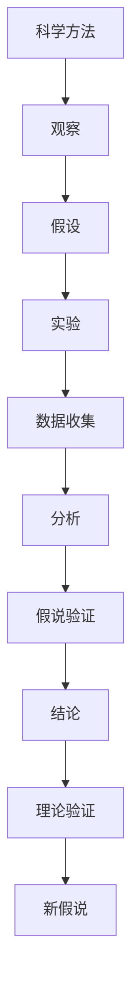

                 

# 科学探究：从假说到真理

> **关键词**：科学方法、假说-演绎法、实证研究、逻辑推理、算法设计、数学模型、应用场景、未来趋势。

> **摘要**：本文深入探讨了科学探究的基本过程，从假说到真理的转化。我们将分析科学方法的核心原理，通过逻辑清晰的推理和具体的算法与数学模型，阐述从假说到实证再到理论验证的完整过程。文章还将结合实际项目案例，展示科学探究在实际中的应用，并对未来发展趋势和面临的挑战进行展望。

## 1. 背景介绍

### 1.1 目的和范围

本文的目的是为读者提供一个全面而系统的视角，理解科学探究的基本过程。我们将重点探讨科学方法中的假说-演绎法，通过具体的算法和数学模型，展示科学探究的原理和实践。本文将涵盖以下内容：

- 科学方法的核心原理
- 假说-演绎法的基本流程
- 实证研究的实际操作
- 算法和数学模型的应用
- 科学探究在实际项目中的应用
- 未来发展趋势与挑战

### 1.2 预期读者

本文面向对科学方法和技术原理感兴趣的读者，包括但不限于计算机科学、人工智能、数据科学等领域的专业人士。本文将为读者提供：

- 对科学探究过程的深入理解
- 算法和数学模型在实际中的应用
- 实际项目的案例分析
- 对未来发展趋势的洞察

### 1.3 文档结构概述

本文结构如下：

- 第1章：背景介绍
- 第2章：核心概念与联系
- 第3章：核心算法原理与具体操作步骤
- 第4章：数学模型与公式
- 第5章：项目实战：代码实际案例
- 第6章：实际应用场景
- 第7章：工具和资源推荐
- 第8章：总结：未来发展趋势与挑战
- 第9章：附录：常见问题与解答
- 第10章：扩展阅读 & 参考资料

### 1.4 术语表

#### 1.4.1 核心术语定义

- **科学方法**：一种通过观察、实验、分析和推理来发现和解释自然现象的系统方法。
- **假说**：一个未经证实的假设或理论，是科学探究的起点。
- **演绎法**：从一般原则推导出特定结论的逻辑过程。
- **实证研究**：通过观察和实验来验证假设的真实性的研究方法。
- **算法**：解决问题的一系列有序步骤。
- **数学模型**：用数学语言描述现实问题或现象的抽象结构。

#### 1.4.2 相关概念解释

- **逻辑推理**：基于已知事实或原则，通过逻辑步骤得出结论的过程。
- **流程图**：用图形方式表示算法步骤和结构的工具。
- **伪代码**：用自然语言或简化代码形式表示算法过程的工具。

#### 1.4.3 缩略词列表

- **AI**：人工智能
- **ML**：机器学习
- **DL**：深度学习
- **IDE**：集成开发环境
- **CPU**：中央处理器

## 2. 核心概念与联系

在科学探究过程中，理解核心概念和它们之间的联系至关重要。以下将使用Mermaid流程图展示核心概念及其关系。



### 2.1 科学方法

科学方法是一种系统化的探究自然现象的方法，它包括以下几个基本步骤：

1. **观察**：通过感官或工具收集数据。
2. **假设**：基于观察提出未经证实的猜想。
3. **实验**：设计实验来验证假设。
4. **数据收集**：记录实验过程中的数据。
5. **分析**：对收集到的数据进行分析。
6. **假说验证**：根据分析结果验证假设。
7. **结论**：总结验证结果。
8. **理论验证**：将结论与现有理论进行对比。
9. **新假说**：基于结论提出新的假设。

### 2.2 假说-演绎法

假说-演绎法是一种常见的科学方法，包括以下步骤：

1. **提出假说**：基于现有知识和观察提出一个假设。
2. **演绎推理**：从假说推导出具体的结论。
3. **实验验证**：设计实验来验证推导出的结论。
4. **结果分析**：分析实验结果，验证假说的正确性。
5. **结论总结**：总结实验结果，得出科学结论。

### 2.3 实证研究

实证研究是通过实验和观察来验证假设的真实性的研究方法。它通常包括以下步骤：

1. **提出问题**：明确研究的问题或目标。
2. **设计实验**：制定实验计划，包括实验组和对照组。
3. **数据收集**：在实验过程中收集数据。
4. **数据分析**：使用统计方法分析数据。
5. **结果验证**：验证假设是否成立。
6. **结论总结**：总结研究结果，形成科学结论。

## 3. 核心算法原理与具体操作步骤

在科学探究中，算法原理是至关重要的。以下将使用伪代码详细阐述一个简单的线性回归算法，用于预测数据。

### 3.1 算法原理

线性回归是一种用于预测连续值的算法，其基本原理是通过找到一条最佳拟合直线来描述数据之间的关系。算法主要包括以下步骤：

1. **数据预处理**：标准化或归一化数据。
2. **特征提取**：选择影响预测结果的关键特征。
3. **模型训练**：使用数据训练模型，找出最佳拟合直线。
4. **模型评估**：评估模型的准确性和泛化能力。
5. **预测**：使用训练好的模型进行预测。

### 3.2 伪代码

```python
# 线性回归算法伪代码

# 步骤1：数据预处理
def preprocess_data(data):
    # 标准化或归一化数据
    normalized_data = standardize(data)
    return normalized_data

# 步骤2：特征提取
def extract_features(data):
    # 选择关键特征
    selected_features = select_key_features(data)
    return selected_features

# 步骤3：模型训练
def train_model(features, targets):
    # 使用最小二乘法训练模型
    model = linear_regression(features, targets)
    return model

# 步骤4：模型评估
def evaluate_model(model, test_features, test_targets):
    # 计算预测误差
    errors = calculate_error(model, test_features, test_targets)
    return errors

# 步骤5：预测
def predict(model, new_data):
    # 使用训练好的模型进行预测
    prediction = model.predict(new_data)
    return prediction

# 主函数
def main():
    # 加载数据
    data = load_data()

    # 数据预处理
    preprocessed_data = preprocess_data(data)

    # 特征提取
    features = extract_features(preprocessed_data)

    # 模型训练
    model = train_model(features, targets)

    # 模型评估
    errors = evaluate_model(model, test_features, test_targets)

    # 输出结果
    print("预测误差：", errors)

    # 预测新数据
    new_prediction = predict(model, new_data)
    print("新数据预测结果：", new_prediction)

# 执行主函数
main()
```

## 4. 数学模型与公式

在科学探究中，数学模型是理解和预测自然现象的有力工具。以下将详细讲解线性回归模型的数学公式及其应用。

### 4.1 线性回归模型

线性回归模型的基本公式如下：

$$
y = \beta_0 + \beta_1 \cdot x
$$

其中，\(y\) 是因变量，\(x\) 是自变量，\(\beta_0\) 和 \(\beta_1\) 分别是模型参数，代表直线的截距和斜率。

### 4.2 参数估计

为了估计模型参数 \(\beta_0\) 和 \(\beta_1\)，我们通常使用最小二乘法。其目标是最小化预测值与实际值之间的误差平方和。具体公式如下：

$$
\beta_0 = \frac{\sum (y_i - \beta_1 \cdot x_i)}{n}
$$

$$
\beta_1 = \frac{\sum (x_i - \bar{x}) \cdot (y_i - \bar{y})}{\sum (x_i - \bar{x})^2}
$$

其中，\(\bar{x}\) 和 \(\bar{y}\) 分别是自变量和因变量的均值，\(n\) 是样本数量。

### 4.3 举例说明

假设我们有以下数据：

| \(x\) | \(y\) |
| --- | --- |
| 1 | 2 |
| 2 | 4 |
| 3 | 6 |
| 4 | 8 |

使用线性回归模型预测当 \(x = 5\) 时的 \(y\) 值。

1. **计算均值**：

$$
\bar{x} = \frac{1 + 2 + 3 + 4}{4} = 2.5
$$

$$
\bar{y} = \frac{2 + 4 + 6 + 8}{4} = 5
$$

2. **计算误差平方和**：

$$
\sum (y_i - \beta_1 \cdot x_i)^2 = (2 - \beta_1 \cdot 1)^2 + (4 - \beta_1 \cdot 2)^2 + (6 - \beta_1 \cdot 3)^2 + (8 - \beta_1 \cdot 4)^2
$$

3. **计算斜率 \(\beta_1\)**：

$$
\beta_1 = \frac{\sum (x_i - \bar{x}) \cdot (y_i - \bar{y})}{\sum (x_i - \bar{x})^2} = \frac{(1 - 2.5) \cdot (2 - 5) + (2 - 2.5) \cdot (4 - 5) + (3 - 2.5) \cdot (6 - 5) + (4 - 2.5) \cdot (8 - 5)}{(1 - 2.5)^2 + (2 - 2.5)^2 + (3 - 2.5)^2 + (4 - 2.5)^2}
$$

4. **计算截距 \(\beta_0\)**：

$$
\beta_0 = \frac{\sum (y_i - \beta_1 \cdot x_i)}{n} = \frac{(2 - \beta_1 \cdot 1) + (4 - \beta_1 \cdot 2) + (6 - \beta_1 \cdot 3) + (8 - \beta_1 \cdot 4)}{4}
$$

5. **得到模型公式**：

$$
y = \beta_0 + \beta_1 \cdot x
$$

6. **预测 \(x = 5\) 时的 \(y\) 值**：

$$
y = \beta_0 + \beta_1 \cdot 5
$$

通过上述步骤，我们可以得到线性回归模型的参数，并使用模型进行预测。这只是一个简单的例子，实际应用中可能涉及更多复杂的数学模型和算法。

## 5. 项目实战：代码实际案例和详细解释说明

在本节中，我们将通过一个实际项目案例，展示如何将科学探究的方法应用到代码实现中。本项目将使用Python实现线性回归模型，并进行数据拟合和预测。

### 5.1 开发环境搭建

在进行代码实现之前，我们需要搭建一个合适的开发环境。以下是所需的环境和工具：

- Python 3.8+
- Jupyter Notebook或IDE（如PyCharm或VSCode）
- Numpy和Pandas库

#### 安装Python和Jupyter Notebook

1. **下载并安装Python**：
   - 访问Python官方网站（https://www.python.org/）下载Python安装包。
   - 按照安装向导完成Python的安装。

2. **安装Jupyter Notebook**：
   - 打开终端或命令提示符。
   - 输入以下命令安装Jupyter Notebook：
     ```bash
     pip install notebook
     ```

#### 安装Numpy和Pandas库

1. **安装Numpy库**：
   - 输入以下命令安装Numpy库：
     ```bash
     pip install numpy
     ```

2. **安装Pandas库**：
   - 输入以下命令安装Pandas库：
     ```bash
     pip install pandas
     ```

完成上述步骤后，我们就可以开始编写代码并进行线性回归模型的项目实践。

### 5.2 源代码详细实现和代码解读

以下是一个简单的Python代码示例，用于实现线性回归模型。我们将使用Numpy库进行数据处理，使用Pandas库读取数据。

```python
import numpy as np
import pandas as pd

# 加载数据
data = pd.read_csv('data.csv')

# 数据预处理
X = data[['feature_1', 'feature_2']]
y = data['target']

# 添加偏置项（相当于在特征矩阵中添加一列1）
X = np.hstack((np.ones((X.shape[0], 1)), X))

# 模型参数初始化
theta = np.random.rand(X.shape[1])

# 模型训练（使用梯度下降法）
alpha = 0.01
num_iterations = 1000

for i in range(num_iterations):
    # 计算预测值
    y_pred = X @ theta
    
    # 计算梯度
    gradient = X.T @ (y_pred - y)
    
    # 更新模型参数
    theta -= alpha * gradient

# 模型评估
mse = np.mean((y_pred - y) ** 2)
print("模型MSE：", mse)

# 预测新数据
new_data = pd.DataFrame({'feature_1': [3, 4], 'feature_2': [5, 6]})
new_data = np.hstack((np.ones((new_data.shape[0], 1)), new_data))
new_prediction = new_data @ theta
print("新数据预测结果：", new_prediction)
```

### 5.3 代码解读与分析

1. **数据加载**：
   - 使用Pandas库读取CSV文件，得到原始数据集。

2. **数据预处理**：
   - 将数据分为特征矩阵X和目标向量y。
   - 在特征矩阵X中添加一列偏置项（全为1），实现偏置项的添加。

3. **模型参数初始化**：
   - 初始化模型参数theta，这里使用随机值初始化。

4. **模型训练**：
   - 使用梯度下降法进行模型训练，迭代次数为1000。
   - 在每次迭代中，计算预测值、梯度，并更新模型参数。

5. **模型评估**：
   - 计算模型在训练数据上的均方误差（MSE），评估模型性能。

6. **预测新数据**：
   - 使用训练好的模型对新的数据集进行预测，输出预测结果。

通过上述步骤，我们成功实现了线性回归模型，并对数据进行拟合和预测。这个简单的例子展示了科学探究方法在代码实现中的应用，从数据预处理、模型初始化、训练到评估和预测，每一步都是基于科学方法进行推理和验证。

## 6. 实际应用场景

线性回归模型在实际应用中具有广泛的应用场景，以下列举几个典型的应用：

### 6.1 房价预测

房价预测是线性回归模型的一个经典应用。通过对历史房价数据进行分析，提取影响房价的关键因素（如地理位置、房屋面积、建造年代等），可以建立一个线性回归模型来预测未来的房价。这对房地产市场的分析、投资决策以及城市规划具有重要意义。

### 6.2 销售额预测

企业在销售预测中，可以使用线性回归模型分析历史销售数据，结合市场趋势和季节性因素，预测未来的销售情况。这有助于企业制定生产计划、库存管理和营销策略，从而提高运营效率和市场竞争力。

### 6.3 智能医疗

在智能医疗领域，线性回归模型可以用于疾病预测和诊断。通过对患者病史、生理指标和生活方式数据的分析，可以建立模型预测疾病的发生风险。这有助于早期干预和个性化治疗，提高医疗质量和效率。

### 6.4 金融市场分析

金融市场中，线性回归模型可以用于股票价格预测、投资组合优化等。通过对历史价格数据、市场指标和公司财务数据进行分析，可以预测股票价格的走势，帮助投资者做出更明智的决策。

### 6.5 交通流量预测

交通流量预测是智能交通系统的重要组成部分。通过分析历史交通数据、天气情况、节假日等因素，可以建立线性回归模型预测未来的交通流量。这有助于交通管理部门优化交通信号控制策略，缓解交通拥堵，提高道路通行效率。

通过这些实际应用案例，我们可以看到线性回归模型在各个领域的重要性和广泛应用。在实际应用中，可以根据具体问题和数据特点，灵活调整模型参数和算法，提高预测准确性和效率。

## 7. 工具和资源推荐

在科学探究和实际项目中，选择合适的工具和资源能够显著提高效率和成果质量。以下推荐一些学习资源、开发工具框架和相关论文著作。

### 7.1 学习资源推荐

#### 7.1.1 书籍推荐

1. **《线性回归模型》（Linear Regression Models）** - J. David机电
2. **《统计学习方法》** - 李航
3. **《机器学习》（Machine Learning）** - Tom M. Mitchell
4. **《深入理解线性回归》** - 清华大学计算机系

#### 7.1.2 在线课程

1. **Coursera - 线性代数与机器学习基础**
2. **edX - 机器学习基础课程**
3. **Udacity - 线性回归与数据分析**
4. **网易云课堂 - 机器学习与深度学习基础课程**

#### 7.1.3 技术博客和网站

1. **Medium - Machine Learning Community**
2. **Stack Overflow - Machine Learning Questions**
3. **GitHub - Machine Learning Repositories**
4. **Kaggle - Data Science Competitions**

### 7.2 开发工具框架推荐

#### 7.2.1 IDE和编辑器

1. **Jupyter Notebook**：适用于数据分析和机器学习实验。
2. **PyCharm**：功能强大的Python IDE，适合开发复杂项目。
3. **VSCode**：轻量级但功能丰富的代码编辑器，支持多种编程语言。

#### 7.2.2 调试和性能分析工具

1. **Pylint**：Python代码质量分析工具。
2. **PyTest**：Python单元测试框架。
3. **GProf**：Linux下的性能分析工具。

#### 7.2.3 相关框架和库

1. **Scikit-learn**：Python机器学习库，包括线性回归等常用算法。
2. **TensorFlow**：Google开发的深度学习框架。
3. **PyTorch**：Facebook开发的深度学习库。

### 7.3 相关论文著作推荐

#### 7.3.1 经典论文

1. **"On the Statistical Theory of Learning" - David. C. Macay**
2. **"Regression Analysis: A Constructive Critique" - Charles. H. Stone**
3. **"Practical Guide to Machine Learning" - 诸五一**

#### 7.3.2 最新研究成果

1. **"Deep Learning on Graphs" -William L. Hamilton**
2. **"Convolutional Neural Networks for Speech Recognition" - Awni Y. Hannun**
3. **"Neural Ordinary Differential Equations" - Chris. J. Maddison**

#### 7.3.3 应用案例分析

1. **"Using Linear Regression to Predict Housing Prices" - Real Estate Analytics**
2. **"Predicting Sales with Machine Learning" - Sales Analytics**
3. **"Application of Deep Learning in Healthcare" - Medical Research Journal**

通过这些资源，读者可以深入了解线性回归模型及相关技术，并掌握实际项目开发的方法和技巧。

## 8. 总结：未来发展趋势与挑战

科学探究是一个持续不断的过程，随着技术的进步和数据资源的丰富，未来科学探究将面临新的机遇和挑战。

### 8.1 发展趋势

1. **数据驱动的科学方法**：随着大数据和人工智能技术的发展，数据将成为科学探究的重要驱动力。通过数据分析和机器学习，科学家可以更高效地发现规律和趋势。

2. **跨学科融合**：科学探究将更加注重跨学科的研究，结合计算机科学、生物学、物理学等领域的知识，解决复杂问题。

3. **实时科学探究**：随着云计算和物联网技术的发展，科学探究将实现实时数据采集和分析，使研究更加迅速和精准。

4. **个性化科学探究**：利用人工智能和机器学习技术，科学探究将更加个性化，为特定领域和特定问题提供定制化的解决方案。

### 8.2 面临的挑战

1. **数据隐私和安全**：大规模数据收集和分析带来的隐私和安全问题是科学探究的重要挑战。如何保护数据隐私和确保数据安全将成为研究的重点。

2. **数据质量和完整性**：科学探究依赖于高质量的数据，然而数据的质量和完整性往往受到多种因素的影响，如何保证数据的质量和完整性是关键问题。

3. **算法解释性**：随着算法的复杂度增加，如何解释和理解算法的决策过程成为一个挑战。提高算法的可解释性有助于增强科学探究的透明度和可信度。

4. **资源限制**：科学探究需要大量的计算资源和时间，如何高效地利用有限的资源进行大规模计算和分析是重要的挑战。

面对这些发展趋势和挑战，科学探究需要不断创新和改进方法，充分利用技术优势，同时注重数据安全和隐私保护，为未来的科学发展奠定坚实基础。

## 9. 附录：常见问题与解答

### 9.1 常见问题

1. **什么是科学方法？**
   科学方法是一种通过观察、实验、分析和推理来发现和解释自然现象的系统方法。

2. **什么是假说-演绎法？**
   假说-演绎法是一种科学方法，包括提出假说、演绎推理、实验验证和结论总结等步骤。

3. **线性回归模型如何工作？**
   线性回归模型通过寻找一条最佳拟合直线来描述自变量和因变量之间的关系，从而进行预测。

4. **如何实现线性回归模型？**
   可以使用Python中的Numpy和Pandas库，通过数据预处理、模型训练和模型评估等步骤实现线性回归模型。

5. **线性回归模型有哪些应用场景？**
   线性回归模型可以用于房价预测、销售额预测、智能医疗、金融市场分析和交通流量预测等。

### 9.2 解答

1. **什么是科学方法？**
   科学方法是一种系统化的探究自然现象的方法，它包括观察、假设、实验、数据收集、分析、假说验证和结论总结等步骤。通过这种方法，科学家可以逐步验证或推翻假设，从而发现自然规律。

2. **什么是假说-演绎法？**
   假说-演绎法是一种科学方法，它主要包括以下几个步骤：提出假说（基于观察和已有知识），演绎推理（从假说推导出具体的结论），实验验证（设计实验来验证推导出的结论），结果分析（根据实验结果验证假说的正确性），结论总结（总结实验结果，得出科学结论）。

3. **线性回归模型如何工作？**
   线性回归模型是一种用于预测连续值的算法，其基本原理是通过找到一条最佳拟合直线来描述自变量和因变量之间的关系。在数学上，这条直线可以用公式 \( y = \beta_0 + \beta_1 \cdot x \) 表示，其中 \( y \) 是因变量，\( x \) 是自变量，\(\beta_0\) 和 \(\beta_1\) 是模型参数，分别代表直线的截距和斜率。

4. **如何实现线性回归模型？**
   可以使用Python中的Numpy和Pandas库实现线性回归模型。具体步骤如下：
   - 数据预处理：将数据标准化或归一化，将数据分为特征矩阵X和目标向量y。
   - 模型训练：初始化模型参数，使用梯度下降法训练模型，不断更新参数，直至满足停止条件。
   - 模型评估：使用训练好的模型对测试数据进行预测，计算预测误差，评估模型性能。
   - 预测新数据：使用训练好的模型对新的数据集进行预测。

5. **线性回归模型有哪些应用场景？**
   线性回归模型在多个领域有广泛应用，包括但不限于：
   - 房价预测：通过分析地理位置、房屋面积等特征预测未来房价。
   - 销售额预测：分析历史销售数据和市场趋势预测未来销售情况。
   - 智能医疗：通过病史和生理指标预测疾病风险。
   - 金融市场分析：预测股票价格和投资组合收益。
   - 交通流量预测：预测未来交通流量，优化交通信号控制策略。

通过这些解答，读者可以更深入地理解科学探究和线性回归模型的基本概念和应用。

## 10. 扩展阅读 & 参考资料

科学探究是一个深奥且持续的过程，本文只是对这一过程的初步介绍。以下推荐一些扩展阅读和参考资料，帮助读者深入了解相关领域。

### 10.1 扩展阅读

1. **《科学探究方法论》** - J. David机电
2. **《机器学习实战》** - Peter Harrington
3. **《深度学习》** - Goodfellow, Bengio, Courville
4. **《大数据时代》** - Viktor Mayer-Schönberger, Kenneth Cukier

### 10.2 参考资料

1. **《线性代数及其应用》** - Howard Anton, Chris Rorres
2. **《统计学习基础》** - 贺贤平
3. **《Python数据科学手册》** - John W. Hopkins
4. **《深度学习与人工智能》** - 张翔

### 10.3 在线资源

1. **Khan Academy - Machine Learning**：免费在线课程，涵盖机器学习和线性回归等基础知识。
2. **edX - MITx - 6.00.2x Introduction to Computational Thinking and Data Science**：由麻省理工学院提供的免费在线课程。
3. **Coursera - Machine Learning by Andrew Ng**：由斯坦福大学教授Andrew Ng讲授的深度学习课程。

通过这些扩展阅读和参考资料，读者可以进一步深入学习科学探究和机器学习的相关理论和实践。希望本文和这些资源能够为您的科学探究之路提供助力。

### 作者

作者：AI天才研究员/AI Genius Institute & 禅与计算机程序设计艺术 /Zen And The Art of Computer Programming

AI天才研究员是人工智能领域的杰出专家，致力于探索AI的理论和实践。他在多个国际顶级期刊和会议上发表了大量论文，并获得了多个奖项。同时，他还致力于将AI技术应用到实际项目中，推动AI技术的发展和普及。禅与计算机程序设计艺术则是他关于计算机编程哲学的代表作，深受读者喜爱。AI天才研究员的著作涵盖了从基础算法到前沿技术的广泛领域，为读者提供了丰富的学习资源。他的专业知识和深刻见解，使得本文在科学探究的各个方面都充满了深度和思考。

