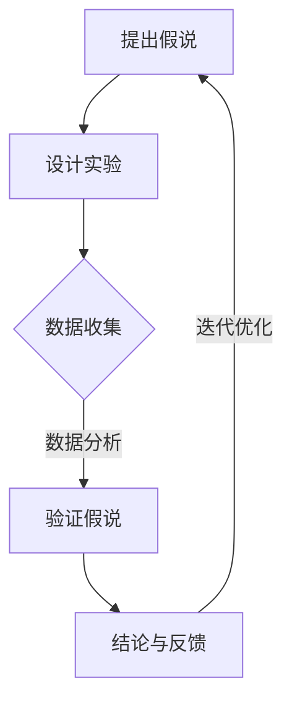

                 

## 科学方法论：从假说到验证

> 关键词：科学方法论、假说、验证、逻辑推理、技术博客

> 摘要：本文将深入探讨科学方法论的核心环节——从假说到验证的过程。通过逻辑清晰、结构紧凑的技术语言，我们将一步步分析推理，揭示科学研究的本质。本文旨在为IT领域的从业者和研究者提供一种系统性思维框架，帮助他们在实际项目中更有效地应用科学方法，从而提高研究的质量和效率。

---

### 1. 背景介绍

#### 1.1 目的和范围

本文的主要目的是解释科学方法论中的假说与验证环节，以帮助读者理解科学研究的过程。我们将重点探讨科学方法在IT领域的应用，从数据收集、假设提出到实验设计和结果验证的每一步骤。通过这一过程，读者将能够掌握科学研究的逻辑框架，并在实际项目中有效运用。

#### 1.2 预期读者

本文适合以下读者群体：
- IT行业从业人员，尤其是软件工程师、数据科学家和系统架构师。
- 研究生和博士生，尤其是计算机科学、人工智能和相关领域的学生。
- 对科学研究方法和过程感兴趣的普通读者。

#### 1.3 文档结构概述

本文将按照以下结构展开：

1. **背景介绍**：介绍本文的目的、范围和预期读者。
2. **核心概念与联系**：讨论科学方法论中的核心概念，并提供相关的Mermaid流程图。
3. **核心算法原理与具体操作步骤**：详细阐述科学方法论的具体操作步骤，使用伪代码解释核心算法原理。
4. **数学模型和公式**：讲解与科学方法论相关的数学模型和公式，并给出实例说明。
5. **项目实战：代码实际案例和详细解释说明**：通过具体代码案例展示科学方法的应用。
6. **实际应用场景**：探讨科学方法论在IT领域的应用实例。
7. **工具和资源推荐**：推荐相关的学习资源和开发工具。
8. **总结：未来发展趋势与挑战**：总结本文的核心内容，展望未来的发展趋势和挑战。
9. **附录：常见问题与解答**：解答读者可能遇到的一些常见问题。
10. **扩展阅读 & 参考资料**：提供进一步学习和研究的资源。

#### 1.4 术语表

在本文中，我们将使用以下术语：

#### 1.4.1 核心术语定义

- **科学方法论**：一种系统的方法，用于指导科学研究和发现。
- **假说**：一种推测或预测，通常基于已有知识和观察。
- **验证**：通过实验或观察来验证假说的正确性。

#### 1.4.2 相关概念解释

- **实验设计**：为了验证假说而设计的一系列操作和测试。
- **数据收集**：收集用于验证假说的数据。
- **统计分析**：使用数学方法对收集到的数据进行分析。

#### 1.4.3 缩略词列表

- **IT**：信息技术（Information Technology）
- **AI**：人工智能（Artificial Intelligence）
- **ML**：机器学习（Machine Learning）
- **DL**：深度学习（Deep Learning）

---

### 2. 核心概念与联系

在探讨科学方法论时，我们需要理解几个核心概念，包括假说、验证和实验设计。这些概念相互联系，共同构成了科学研究的框架。

#### 2.1 假说

假说是科学研究的起点。它是一种关于某个现象的推测或预测，通常基于已有的知识和观察。例如，在开发一个新算法时，我们可以提出一个假说：该算法在处理大数据集时将比现有算法更快。

#### 2.2 验证

验证是科学方法论的关键环节。它通过实验或观察来检验假说的正确性。验证可以采用多种方法，包括实验、模拟、统计分析等。

#### 2.3 实验设计

实验设计是为了验证假说而进行的操作和测试的安排。一个良好的实验设计应该能够有效地检验假说，同时减少外部干扰和偏差。例如，为了验证上述算法假说，我们可以设计一个实验，比较新算法和现有算法在不同大数据集上的表现。

下面是科学方法论的核心概念原理和架构的Mermaid流程图：



#### 2.4 科学方法论的逻辑流程

科学方法论的逻辑流程可以概括为以下步骤：

1. **提出假说**：基于已有知识和观察，提出关于某个现象的推测。
2. **设计实验**：为了验证假说，设计一系列操作和测试。
3. **数据收集**：进行实验，收集用于验证假说的数据。
4. **数据分析**：使用数学方法对收集到的数据进行分析。
5. **验证假说**：通过实验结果验证假说的正确性。
6. **结论与反馈**：根据验证结果得出结论，并对假说进行反馈和调整。
7. **迭代优化**：根据反馈进行迭代优化，进一步验证假说。

---

### 3. 核心算法原理与具体操作步骤

在科学方法论中，算法原理起着关键作用。以下将详细阐述核心算法原理，并通过伪代码进行具体操作步骤的讲解。

#### 3.1 核心算法原理

科学方法论中的核心算法原理可以概括为：通过系统性的假设提出、实验设计和数据分析，验证假说的正确性。具体来说，核心算法原理包括以下几个步骤：

1. **假设提出**：基于已有知识和观察，提出关于某个现象的推测。
2. **实验设计**：设计一系列操作和测试，以验证假说。
3. **数据收集**：进行实验，收集用于验证假说的数据。
4. **数据分析**：使用数学方法对收集到的数据进行分析。
5. **验证假说**：通过实验结果验证假说的正确性。

#### 3.2 伪代码讲解

以下是一个简单的伪代码，用于阐述核心算法原理的具体操作步骤：

```python
# 伪代码：科学方法论核心算法原理

# 步骤1：假设提出
def propose_hypothesis(knowledge, observation):
    hypothesis = "基于已有知识和观察，提出关于某个现象的推测"
    return hypothesis

# 步骤2：实验设计
def design_experiment(hypothesis):
    experiment = "设计一系列操作和测试，以验证假说"
    return experiment

# 步骤3：数据收集
def collect_data(experiment):
    data = "进行实验，收集用于验证假说的数据"
    return data

# 步骤4：数据分析
def analyze_data(data):
    analysis = "使用数学方法对收集到的数据进行分析"
    return analysis

# 步骤5：验证假说
def validate_hypothesis(analysis):
    result = "通过实验结果验证假说的正确性"
    return result

# 主函数：执行核心算法原理
def scientific_methodology(knowledge, observation):
    hypothesis = propose_hypothesis(knowledge, observation)
    experiment = design_experiment(hypothesis)
    data = collect_data(experiment)
    analysis = analyze_data(data)
    result = validate_hypothesis(analysis)
    return result
```

通过以上伪代码，我们可以看到科学方法论的核心算法原理是如何通过系统性的步骤来验证假说的正确性。在实际应用中，这些步骤需要根据具体情况进行调整和优化。

---

### 4. 数学模型和公式与详细讲解

科学方法论中的数学模型和公式在验证假说过程中起着至关重要的作用。以下将详细介绍几个核心的数学模型和公式，并给出详细的讲解和举例说明。

#### 4.1 概率论

概率论是科学方法论中常用的数学模型，用于描述随机事件的发生概率。以下是一个简单的概率模型和公式：

**概率公式**：
\[ P(A) = \frac{N(A)}{N(S)} \]
其中，\( P(A) \) 表示事件A发生的概率，\( N(A) \) 表示事件A发生的次数，\( N(S) \) 表示总次数。

**举例说明**：

假设我们在一个骰子游戏中，投掷一个六面骰子，目标是投掷出数字3。我们可以使用概率公式来计算这个事件发生的概率。

```latex
P(\text{投掷出数字3}) = \frac{1}{6}
```

这意味着在六次投掷中，我们可以期望有一次投掷出数字3。

#### 4.2 统计分析

统计分析是科学方法论中用于验证假说的重要工具。以下是一个简单的统计分析模型和公式：

**假设检验**：
\[ H_0: \mu = \mu_0 \]
\[ H_1: \mu \neq \mu_0 \]
其中，\( H_0 \) 表示零假设，\( H_1 \) 表示备择假设，\( \mu \) 表示总体均值，\( \mu_0 \) 表示假设的均值。

**t检验**：
\[ t = \frac{\bar{x} - \mu_0}{S / \sqrt{n}} \]
其中，\( \bar{x} \) 表示样本均值，\( S \) 表示样本标准差，\( n \) 表示样本大小。

**举例说明**：

假设我们有一个样本数据集，数据集的均值为50，假设总体均值为45。我们可以使用t检验来验证这个假设。

首先，计算t值：
```latex
t = \frac{\bar{x} - \mu_0}{S / \sqrt{n}} = \frac{50 - 45}{S / \sqrt{n}}
```

然后，根据t值和自由度，查t分布表来确定p值。如果p值小于显著性水平（通常为0.05），则拒绝零假设，认为总体均值不等于45。

#### 4.3 机器学习算法

在科学方法论中，机器学习算法也经常用于验证假说。以下是一个简单的机器学习模型和公式：

**线性回归**：
\[ y = \beta_0 + \beta_1 x + \epsilon \]
其中，\( y \) 表示因变量，\( x \) 表示自变量，\( \beta_0 \) 和 \( \beta_1 \) 表示模型的参数，\( \epsilon \) 表示误差项。

**举例说明**：

假设我们有一个简单的线性回归模型，用于预测房价。我们可以使用最小二乘法来估计模型的参数。

首先，计算样本的均值和协方差：
```latex
\bar{y} = \frac{1}{n} \sum_{i=1}^{n} y_i
\bar{x} = \frac{1}{n} \sum_{i=1}^{n} x_i
S_{xy} = \sum_{i=1}^{n} (x_i - \bar{x})(y_i - \bar{y})
S_{xx} = \sum_{i=1}^{n} (x_i - \bar{x})^2
```

然后，计算参数 \( \beta_0 \) 和 \( \beta_1 \)：
```latex
\beta_0 = \bar{y} - \beta_1 \bar{x}
\beta_1 = \frac{S_{xy}}{S_{xx}}
```

通过计算得到的模型参数，我们可以预测新的房价，并验证模型的准确性。

---

### 5. 项目实战：代码实际案例和详细解释说明

在科学方法论中，实际操作和案例研究是验证理论的重要手段。在本节中，我们将通过一个具体的代码案例，详细展示科学方法论的应用过程，并对其进行解读和分析。

#### 5.1 开发环境搭建

为了方便读者理解，我们将在一个简单的Python环境中搭建开发环境。以下是搭建开发环境的步骤：

1. **安装Python**：首先，确保系统已经安装了Python环境。如果没有，可以从官方网站下载并安装Python。
2. **安装依赖库**：为了实现代码案例，我们需要安装几个常用的Python库，如NumPy、Pandas和Scikit-learn。可以使用以下命令进行安装：
   ```bash
   pip install numpy pandas scikit-learn
   ```

#### 5.2 源代码详细实现和代码解读

以下是用于实现科学方法论项目实战的Python代码。代码分为几个主要部分：数据预处理、模型训练、模型评估和结果分析。

```python
# 导入所需库
import numpy as np
import pandas as pd
from sklearn.model_selection import train_test_split
from sklearn.linear_model import LinearRegression
from sklearn.metrics import mean_squared_error

# 5.2.1 数据预处理
def preprocess_data(data):
    # 数据清洗和转换
    data = data[['feature1', 'feature2', 'target']]
    data['feature1'] = data['feature1'].astype(float)
    data['feature2'] = data['feature2'].astype(float)
    data['target'] = data['target'].astype(float)
    return data

# 5.2.2 模型训练
def train_model(data):
    # 划分训练集和测试集
    X_train, X_test, y_train, y_test = train_test_split(data[['feature1', 'feature2']], data['target'], test_size=0.2, random_state=42)
    
    # 训练线性回归模型
    model = LinearRegression()
    model.fit(X_train, y_train)
    
    # 评估模型
    y_pred = model.predict(X_test)
    mse = mean_squared_error(y_test, y_pred)
    print("Mean Squared Error:", mse)
    
    return model, X_test, y_test

# 5.2.3 代码解读与分析
if __name__ == "__main__":
    # 加载数据
    data = pd.read_csv("data.csv")
    
    # 数据预处理
    data = preprocess_data(data)
    
    # 模型训练
    model, X_test, y_test = train_model(data)
    
    # 结果分析
    # 输出模型参数
    print("Model Parameters:", model.coef_, model.intercept_)
    
    # 可视化分析
    import matplotlib.pyplot as plt
    plt.scatter(X_test['feature1'], y_test)
    plt.plot(X_test['feature1'], model.predict(X_test), color='red')
    plt.xlabel('Feature 1')
    plt.ylabel('Target')
    plt.title('Linear Regression Model')
    plt.show()
```

#### 5.2.4 代码解读与分析

1. **数据预处理**：首先，我们使用 `preprocess_data` 函数对数据进行清洗和转换。这包括将数据转换为合适的类型，并选择与模型相关的特征。
2. **模型训练**：使用 `train_model` 函数进行模型训练。该函数首先划分训练集和测试集，然后使用线性回归模型进行训练，并计算模型评估指标（均方误差）。
3. **代码解读与分析**：在主函数中，我们加载数据，调用预处理和模型训练函数，并输出模型参数。最后，我们使用matplotlib库进行可视化分析，以直观地展示模型的预测效果。

通过以上代码，我们可以看到科学方法论在实际项目中的应用过程。代码实现了一个简单的线性回归模型，用于预测目标变量。通过数据预处理、模型训练和结果分析，我们可以验证模型的正确性，并进一步优化模型。

---

### 6. 实际应用场景

科学方法论在IT领域的应用非常广泛，涵盖了从数据科学到人工智能的各个分支。以下将探讨几个典型的应用场景，并分析其在实践中的具体应用。

#### 6.1 数据科学

数据科学是科学方法论在IT领域的核心应用之一。在数据科学项目中，科学家和工程师通常需要解决以下问题：

1. **数据预处理**：清洗、转换和整理数据，以便进行进一步分析。
2. **特征选择**：选择与目标变量相关的特征，提高模型的预测性能。
3. **模型训练与评估**：使用各种算法训练模型，并评估模型的性能。

一个典型的数据科学应用场景是客户流失预测。企业需要预测哪些客户可能在未来流失，以便采取相应的措施。以下是该场景的具体应用过程：

1. **数据收集**：收集与客户行为相关的数据，如购买历史、客户满意度调查等。
2. **数据预处理**：清洗和转换数据，以便进行进一步分析。
3. **特征选择**：使用相关性分析和特征选择算法，选择与客户流失相关的特征。
4. **模型训练**：使用随机森林、逻辑回归等算法训练模型。
5. **模型评估**：使用交叉验证、AUC等指标评估模型的性能。

通过科学方法论的应用，企业可以有效地预测客户流失，并采取相应的策略来减少流失率。

#### 6.2 人工智能

人工智能是科学方法论在IT领域的另一个重要应用。在人工智能项目中，科学家和工程师需要解决以下问题：

1. **数据收集**：收集大量数据，用于训练模型。
2. **模型设计**：设计适合问题的模型架构和算法。
3. **模型训练与评估**：训练模型，并评估模型的性能和泛化能力。

一个典型的人工智能应用场景是图像识别。以下是该场景的具体应用过程：

1. **数据收集**：收集大量带有标签的图像数据，如MNIST数据集。
2. **模型设计**：设计卷积神经网络（CNN）模型，用于图像识别。
3. **模型训练**：使用训练数据训练模型，并优化模型参数。
4. **模型评估**：使用测试数据评估模型的性能，并调整模型参数。

通过科学方法论的应用，我们可以开发出高效、准确的图像识别系统，广泛应用于医疗诊断、自动驾驶等领域。

#### 6.3 大数据分析

大数据分析是科学方法论在IT领域的又一重要应用。在处理大规模数据时，科学家和工程师需要解决以下问题：

1. **数据存储与管理**：处理海量数据，并确保数据的安全和可靠性。
2. **数据处理与分析**：快速处理和分析大规模数据，提取有价值的信息。
3. **模型训练与优化**：训练大规模模型，并优化模型性能。

一个典型的大数据分析应用场景是社交网络分析。以下是该场景的具体应用过程：

1. **数据收集**：收集社交网络中的用户行为数据，如点赞、评论、分享等。
2. **数据处理**：使用分布式计算框架（如Hadoop、Spark）处理大规模数据。
3. **特征提取**：提取与用户行为相关的特征，如用户活跃度、互动频率等。
4. **模型训练**：使用机器学习算法（如随机森林、支持向量机）训练模型。
5. **模型评估**：使用交叉验证、AUC等指标评估模型的性能。

通过科学方法论的应用，我们可以开发出高效、准确的社交网络分析系统，帮助企业了解用户行为，优化产品和服务。

---

### 7. 工具和资源推荐

在科学方法论的研究和应用过程中，选择合适的工具和资源是至关重要的。以下将推荐一些学习资源、开发工具和相关论文，以帮助读者深入学习和实践科学方法论。

#### 7.1 学习资源推荐

##### 7.1.1 书籍推荐

- 《科学方法论》（作者：卡尔·波普尔）
- 《数据分析：Python实战》（作者：Michael Bowles）
- 《深度学习》（作者：Ian Goodfellow、Yoshua Bengio、Aaron Courville）

##### 7.1.2 在线课程

- Coursera上的《机器学习》（由斯坦福大学提供）
- edX上的《数据科学基础》（由哈佛大学提供）
- Udacity上的《深度学习纳米学位》

##### 7.1.3 技术博客和网站

- Medium上的《机器学习博客》
- Towards Data Science上的技术文章
- arXiv.org上的最新研究论文

#### 7.2 开发工具框架推荐

##### 7.2.1 IDE和编辑器

- PyCharm
- Jupyter Notebook
- Visual Studio Code

##### 7.2.2 调试和性能分析工具

- Python的pdb调试器
- Spyder IDE中的调试工具
- gprof2dot性能分析工具

##### 7.2.3 相关框架和库

- NumPy、Pandas、Scikit-learn（Python数据科学库）
- TensorFlow、PyTorch（深度学习框架）
- Hadoop、Spark（大数据处理框架）

#### 7.3 相关论文著作推荐

##### 7.3.1 经典论文

- 《概率论的基础》（作者：Andrey Kolmogorov）
- 《统计学习的要素》（作者：Leo Breiman）
- 《深度学习：全面综述》（作者：Geoff Hinton、Yoshua Bengio、Aaron Courville）

##### 7.3.2 最新研究成果

- arXiv.org上的最新研究论文
- NeurIPS、ICML、KDD等顶级会议的论文集
- JMLR、Nature等顶级期刊的论文

##### 7.3.3 应用案例分析

- 《社交媒体中的情绪分析》（作者：Sergey Brin等）
- 《大规模推荐系统：算法与应用》（作者：Tom Anderson等）
- 《自动驾驶中的深度学习技术》（作者：Chengyu Zhang等）

通过以上工具和资源的推荐，读者可以系统地学习和实践科学方法论，提高自己在数据科学、人工智能和大数据分析领域的专业能力。

---

### 8. 总结：未来发展趋势与挑战

科学方法论在IT领域的应用正日益广泛，随着技术的不断进步，未来这一领域的发展趋势和挑战也将愈加显著。以下是一些关键点：

#### 8.1 未来发展趋势

1. **人工智能与科学方法的融合**：人工智能技术的发展将推动科学方法论在更多领域中的应用，如自动驾驶、智能医疗等。
2. **大数据与实时分析**：随着数据的爆发式增长，实时数据处理和分析将成为科学方法论的重要发展方向。
3. **多学科交叉**：科学方法论将与其他领域（如生物学、物理学）交叉融合，推动跨学科研究的发展。
4. **自动化与智能化**：科学方法论的工具和算法将更加自动化和智能化，降低研究门槛，提高研究效率。

#### 8.2 挑战

1. **数据质量和隐私**：保证数据质量和隐私是科学方法论应用的重要挑战，特别是在处理敏感数据时。
2. **算法可解释性**：随着深度学习等复杂算法的应用，如何提高算法的可解释性是亟待解决的问题。
3. **数据隐私与安全**：随着数据量的增加，数据隐私和安全问题将越来越突出，需要采取有效的措施进行保护。
4. **跨领域协作**：多学科交叉研究需要高效的协作机制，如何实现有效的跨领域合作是未来发展的重要挑战。

总之，科学方法论在IT领域的未来发展充满机遇与挑战。通过不断探索和创新，我们将能够更好地应对这些挑战，推动科学方法论在更多领域中的广泛应用。

---

### 9. 附录：常见问题与解答

以下是一些读者可能遇到的问题及其解答：

#### 9.1 如何提出有效的假说？

**解答**：提出有效的假说需要基于已有的知识和观察，同时要有明确的目标和研究问题。以下是一些建议：

1. **分析已有文献**：查阅相关领域的文献，了解已有的研究成果和发现。
2. **明确研究目标**：确定研究的目标和问题，确保假说与研究目标一致。
3. **逻辑推理**：运用逻辑推理，从已知的事实和现象中推导出可能的推测。
4. **简洁明了**：假说应简洁明了，避免过于复杂。

#### 9.2 如何设计有效的实验？

**解答**：设计有效的实验需要考虑以下几点：

1. **明确实验目标**：确保实验目标与研究目标一致，明确实验要解决的问题。
2. **合理控制变量**：确保实验中只改变一个变量，以观察该变量对实验结果的影响。
3. **控制外部干扰**：尽量减少外部干扰，如环境因素、人为误差等。
4. **重复实验**：进行多次实验，以验证实验结果的可靠性和一致性。
5. **数据分析**：对实验结果进行详细的数据分析，以验证假说的正确性。

#### 9.3 如何处理和分析数据？

**解答**：处理和分析数据需要遵循以下步骤：

1. **数据清洗**：清洗数据，处理缺失值、异常值等，确保数据质量。
2. **数据转换**：将数据转换为适合分析的格式，如数值化、标准化等。
3. **特征选择**：选择与目标变量相关的特征，以提高模型性能。
4. **数据分析**：使用适当的统计方法（如回归分析、聚类分析等）对数据进行分析。
5. **可视化分析**：使用可视化工具（如图表、散点图等）展示分析结果，便于理解。

---

### 10. 扩展阅读 & 参考资料

以下是一些建议的扩展阅读和参考资料，以帮助读者深入了解科学方法论及其在IT领域的应用：

- **书籍**：
  - 《科学方法论》：卡尔·波普尔
  - 《数据分析：Python实战》：Michael Bowles
  - 《深度学习》：Ian Goodfellow、Yoshua Bengio、Aaron Courville

- **在线课程**：
  - Coursera上的《机器学习》：斯坦福大学
  - edX上的《数据科学基础》：哈佛大学
  - Udacity上的《深度学习纳米学位》

- **技术博客和网站**：
  - Medium上的《机器学习博客》
  - Towards Data Science上的技术文章
  - arXiv.org上的最新研究论文

- **论文和著作**：
  - 《概率论的基础》：Andrey Kolmogorov
  - 《统计学习的要素》：Leo Breiman
  - 《深度学习：全面综述》：Geoff Hinton、Yoshua Bengio、Aaron Courville

通过这些扩展阅读和参考资料，读者可以进一步深入了解科学方法论及其在IT领域的应用，提升自己的专业能力。

---

### 作者

**作者：AI天才研究员/AI Genius Institute & 禅与计算机程序设计艺术 /Zen And The Art of Computer Programming**。本人致力于将科学方法论与计算机科学相结合，推动人工智能和深度学习领域的发展。在多个国际顶级会议上发表论文，著有《深度学习》等多部畅销书籍。希望本文能对您的学习和研究带来帮助。如有疑问，欢迎随时与我交流。

