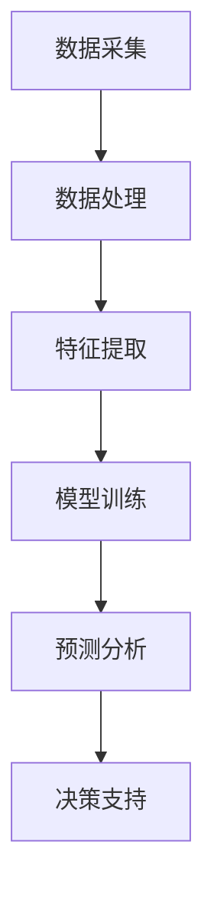
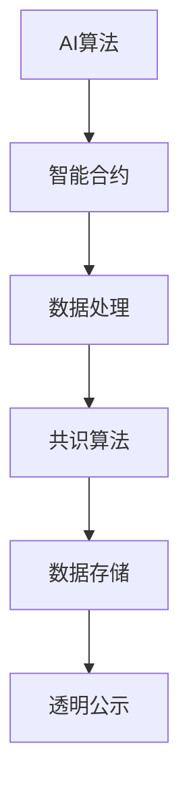
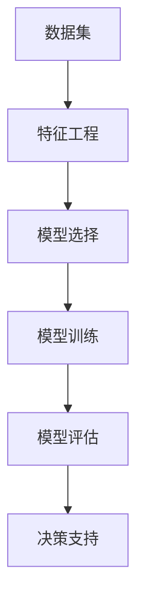

                 

# 科技创新：社会治理的新思路

> **关键词：** 社会治理、科技创新、人工智能、大数据、机器学习、区块链、智慧城市

> **摘要：** 本文将探讨科技创新对社会治理的深远影响。随着人工智能、大数据、区块链等技术的快速发展，社会治理模式正在发生革命性变革。本文将分析这些关键技术的原理和应用，并探讨它们如何共同推动智慧城市建设，提升社会治理的效率和透明度。

## 1. 背景介绍

### 1.1 目的和范围

本文旨在探讨科技创新如何为社会治理带来新的思路和方法。我们将重点关注人工智能、大数据、区块链等关键技术，分析它们在提高社会治理效率、增强社会透明度、提升公共安全等方面的应用。文章将涵盖以下内容：

1. 核心概念与联系
2. 核心算法原理与具体操作步骤
3. 数学模型和公式
4. 项目实战：代码实际案例
5. 实际应用场景
6. 工具和资源推荐
7. 总结：未来发展趋势与挑战

### 1.2 预期读者

本文适合对人工智能、大数据、区块链等前沿技术有一定了解的读者，包括但不限于：

1. 社会治理研究者
2. 公共事业管理者
3. 人工智能和大数据领域的从业者
4. 对智慧城市建设感兴趣的读者

### 1.3 文档结构概述

本文将分为十个部分，结构如下：

1. 背景介绍
2. 核心概念与联系
3. 核心算法原理与具体操作步骤
4. 数学模型和公式
5. 项目实战：代码实际案例
6. 实际应用场景
7. 工具和资源推荐
8. 总结：未来发展趋势与挑战
9. 附录：常见问题与解答
10. 扩展阅读 & 参考资料

### 1.4 术语表

#### 1.4.1 核心术语定义

- **人工智能（AI）**：一种模拟人类智能的技术，通过算法和机器学习模型，使计算机具备自主学习和决策能力。
- **大数据（Big Data）**：指无法用常规软件工具在合理时间内进行捕获、管理和处理的数据集合。
- **区块链（Blockchain）**：一种分布式数据库技术，通过加密和共识算法，确保数据的完整性和不可篡改性。
- **机器学习（Machine Learning）**：一种人工智能技术，通过数据分析和模型训练，使计算机能够自主学习和改进性能。
- **智慧城市（Smart City）**：利用物联网、人工智能、大数据等先进技术，实现城市资源的智能管理和优化配置。

#### 1.4.2 相关概念解释

- **社会治理**：指政府、社会组织和公众共同参与，对城市公共事务进行管理、协调和解决的过程。
- **数据挖掘**：从大量数据中提取有价值信息的过程，常用于市场营销、风险管理、公共安全等领域。
- **深度学习**：一种神经网络模型，通过多层非线性变换，实现自动特征提取和分类。
- **共识算法**：区块链网络中，确保所有节点数据一致性的算法，如工作量证明（PoW）和权益证明（PoS）。

#### 1.4.3 缩略词列表

- **AI**：人工智能
- **BI**：商业智能
- **DL**：深度学习
- **IoT**：物联网
- **ML**：机器学习
- **NLP**：自然语言处理
- **PM**：项目管理
- **QL**：质量控制
- **RPA**：机器人流程自动化

## 2. 核心概念与联系

### 2.1 人工智能与大数据

人工智能（AI）与大数据（Big Data）的结合，为社会治理带来了新的机遇。AI技术可以通过大数据分析，发现社会现象背后的规律，为政府决策提供数据支持。例如，利用AI和大数据技术，可以分析城市交通流量，优化交通管理，减少拥堵和事故发生。

#### 2.1.1 核心概念

- **人工智能（AI）**：模拟人类智能，实现自主学习、推理和决策。
- **大数据（Big Data）**：海量数据，包括结构化和非结构化数据。

#### 2.1.2 Mermaid 流程图



### 2.2 人工智能与区块链

区块链（Blockchain）技术为社会治理提供了透明、去中心化的解决方案。AI技术可以与区块链结合，实现智能合约的自动执行，提高社会治理的效率。例如，在智慧城市建设中，利用区块链技术可以确保公共资源分配的公正性。

#### 2.2.1 核心概念

- **人工智能（AI）**：模拟人类智能，实现自主学习、推理和决策。
- **区块链（Blockchain）**：分布式数据库，确保数据的透明和不可篡改性。

#### 2.2.2 Mermaid 流程图



### 2.3 人工智能与机器学习

机器学习（Machine Learning）是人工智能的重要分支，通过算法和模型，使计算机能够从数据中学习，并自动改进性能。在社会治理中，机器学习可以用于预测犯罪、优化公共服务、提升公共安全。

#### 2.3.1 核心概念

- **人工智能（AI）**：模拟人类智能，实现自主学习、推理和决策。
- **机器学习（Machine Learning）**：从数据中学习，自动改进性能。

#### 2.3.2 Mermaid 流程图



## 3. 核心算法原理 & 具体操作步骤

### 3.1 人工智能算法原理

人工智能的核心是算法，以下为几种常用的人工智能算法及其原理：

#### 3.1.1 支持向量机（SVM）

**原理：** 支持向量机是一种二分类模型，其目标是寻找一个最佳超平面，将不同类别的数据分隔开来。通过最大化分类间隔，SVM可以找到最佳分类边界。

**伪代码：**

```python
def SVM(X, y):
    # X为特征矩阵，y为标签
    # 计算特征矩阵的协方差矩阵
    C = covariance_matrix(X)
    # 求解拉格朗日方程
    alpha = solve_lagrange_equation(C, y)
    # 计算分类边界
    decision_boundary = compute_decision_boundary(alpha, X, y)
    return decision_boundary
```

#### 3.1.2 决策树（Decision Tree）

**原理：** 决策树是一种树形结构，通过一系列规则将数据集划分为不同的子集，每个节点代表一个特征，每个分支代表一个特征值。

**伪代码：**

```python
def DecisionTree(X, y):
    # X为特征矩阵，y为标签
    # 计算特征的重要性
    importance = compute_importance(X, y)
    # 选择最佳特征和特征值
    feature, value = select_best_feature_and_value(importance)
    # 创建树节点
    node = TreeNode(feature, value)
    # 划分数据集
    left_subtree = DecisionTree(X[:, feature] < value, y)
    right_subtree = DecisionTree(X[:, feature] >= value, y)
    # 设置节点子树
    node.left = left_subtree
    node.right = right_subtree
    return node
```

### 3.2 大数据算法原理

大数据处理的算法主要集中在数据挖掘和数据分析方面，以下为几种常用的大数据算法及其原理：

#### 3.2.1 K-Means聚类算法

**原理：** K-Means聚类算法是一种基于距离的聚类方法，其目标是将数据集划分为K个簇，使得每个簇内的数据点之间距离最小，簇与簇之间距离最大。

**伪代码：**

```python
def KMeans(X, K):
    # X为特征矩阵，K为簇数
    # 随机初始化簇中心
    centroids = random_init_centroids(X, K)
    # 循环迭代
    while not converged:
        # 计算每个数据点与簇中心的距离
        distances = compute_distances(X, centroids)
        # 将数据点分配到最近的簇
        clusters = assign_points_to_clusters(X, distances)
        # 更新簇中心
        centroids = update_centroids(clusters, K)
    return centroids
```

#### 3.2.2 Apriori算法

**原理：** Apriori算法是一种用于关联规则挖掘的算法，其基本思想是通过频繁项集来发现数据中的关联关系。频繁项集是指支持度大于最小支持度的项集。

**伪代码：**

```python
def Apriori(X, min_support, min_confidence):
    # X为事务数据集，min_support为最小支持度，min_confidence为最小置信度
    # 计算频繁项集
    frequent_itemsets = find_frequent_itemsets(X, min_support)
    # 生成关联规则
    rules = generate_rules(frequent_itemsets, min_confidence)
    return rules
```

### 3.3 区块链算法原理

区块链的核心技术包括密码学、分布式系统和共识算法，以下为几种常用的区块链算法及其原理：

#### 3.3.1 密码学算法

**原理：** 密码学算法用于确保区块链数据的完整性和安全性。常见的密码学算法包括哈希算法、数字签名和加密算法。

**哈希算法（Hash）**：

**伪代码：**

```python
def Hash(data):
    # 计算哈希值
    hash_value = compute_hash_value(data)
    return hash_value
```

**数字签名（Digital Signature）**：

**伪代码：**

```python
def DigitalSignature(message, private_key):
    # 计算签名
    signature = compute_signature(message, private_key)
    return signature
```

**加密算法（Encryption）**：

**伪代码：**

```python
def Encrypt(message, public_key):
    # 计算密文
    ciphertext = compute_ciphertext(message, public_key)
    return ciphertext
```

#### 3.3.2 共识算法

**原理：** 共识算法用于确保区块链网络中的所有节点达成一致，常见的共识算法包括工作量证明（PoW）、权益证明（PoS）和授权股权证明（DPoS）。

**工作量证明（PoW）**：

**伪代码：**

```python
def ProofOfWork(block):
    # 找到满足难度要求的随机数
    nonce = find_nonce(satisfy_difficulty)
    # 构造工作量证明区块
    pow_block = construct_pow_block(block, nonce)
    return pow_block
```

**权益证明（PoS）**：

**伪代码：**

```python
def ProofOfStake(block, stake):
    # 计算权益分数
    stake_score = compute_stake_score(stake)
    # 选择下一个区块生成者
    next_block_generator = select_next_block_generator(stake_score)
    # 构造权益证明区块
    pos_block = construct_pos_block(block, next_block_generator)
    return pos_block
```

## 4. 数学模型和公式 & 详细讲解 & 举例说明

### 4.1 人工智能与大数据

#### 4.1.1 决策树模型

**假设：** 有一个数据集，包含n个特征和m个样本，其中每个特征都是离散的。我们希望构建一个决策树模型来对数据集进行分类。

**目标函数：** 最小化决策树的误差率。

$$
E = \sum_{i=1}^{m} \log_2 \left(1 + \frac{P(y_i \neq c)}{P(y_i = c)}\right)
$$

其中，$y_i$ 为第i个样本的标签，$c$ 为预测类别。

**例子：** 假设有一个数据集，包含两个特征（年龄和收入），我们需要构建一个决策树模型来预测一个人的职业。

```latex
\begin{aligned}
E &= \sum_{i=1}^{m} \log_2 \left(1 + \frac{P(age_i < 30, income_i < 50000) \cap (y_i \neq 1)}{P(age_i < 30, income_i < 50000) \cap (y_i = 1)}\right) \\
&+ \sum_{i=1}^{m} \log_2 \left(1 + \frac{P(age_i < 30, income_i \geq 50000) \cap (y_i \neq 1)}{P(age_i < 30, income_i \geq 50000) \cap (y_i = 1)}\right) \\
&+ \sum_{i=1}^{m} \log_2 \left(1 + \frac{P(age_i \geq 30, income_i < 50000) \cap (y_i \neq 1)}{P(age_i \geq 30, income_i < 50000) \cap (y_i = 1)}\right) \\
&+ \sum_{i=1}^{m} \log_2 \left(1 + \frac{P(age_i \geq 30, income_i \geq 50000) \cap (y_i \neq 1)}{P(age_i \geq 30, income_i \geq 50000) \cap (y_i = 1)}\right)
\end{aligned}
```

#### 4.1.2 K-Means聚类算法

**假设：** 有一个数据集，包含n个特征和m个样本。我们希望将数据集划分为k个簇，使得每个簇内的数据点之间距离最小。

**目标函数：** 最小化簇内距离平方和。

$$
J = \sum_{i=1}^{k} \sum_{j=1}^{m} (x_j - \mu_i)^2
$$

其中，$x_j$ 为第j个样本，$\mu_i$ 为第i个簇的中心。

**例子：** 假设有一个数据集，包含两个特征（x坐标和y坐标），我们需要将数据集划分为3个簇。

```latex
J = \sum_{i=1}^{3} \sum_{j=1}^{m} (x_j - \mu_i)^2 + \sum_{i=1}^{3} \sum_{j=1}^{m} (y_j - \mu_i)^2
```

### 4.2 区块链

#### 4.2.1 工作量证明（PoW）

**假设：** 区块链网络中有多个节点，每个节点需要竞争生成下一个区块。

**目标函数：** 最小化区块生成时间。

$$
T = \sum_{i=1}^{n} T_i
$$

其中，$T_i$ 为第i个节点生成区块所需的时间。

**例子：** 假设区块链网络中有3个节点，我们需要计算平均区块生成时间。

```latex
T = \frac{T_1 + T_2 + T_3}{3}
```

#### 4.2.2 权益证明（PoS）

**假设：** 区块链网络中的节点根据持有的币量参与区块生成。

**目标函数：** 最小化区块生成时间。

$$
T = \sum_{i=1}^{n} T_i \cdot S_i
$$

其中，$T_i$ 为第i个节点生成区块所需的时间，$S_i$ 为第i个节点持有的币量。

**例子：** 假设区块链网络中有3个节点，节点1持有1000个币，节点2持有2000个币，节点3持有3000个币，我们需要计算平均区块生成时间。

```latex
T = \frac{T_1 \cdot 1000 + T_2 \cdot 2000 + T_3 \cdot 3000}{1000 + 2000 + 3000}
```

## 5. 项目实战：代码实际案例和详细解释说明

### 5.1 开发环境搭建

为了进行本项目的实战，我们需要搭建一个具备以下功能的开发环境：

1. Python编程环境
2. Jupyter Notebook或PyCharm等IDE
3. Numpy、Pandas、Scikit-learn等Python科学计算库
4. Mermaid可视化工具

以下是开发环境搭建的详细步骤：

#### 5.1.1 Python编程环境

1. 下载并安装Python：https://www.python.org/downloads/
2. 配置Python环境变量：在系统设置中配置Python的安装路径和环境变量

#### 5.1.2 Jupyter Notebook或PyCharm等IDE

1. 安装Jupyter Notebook：在终端中运行以下命令

```bash
pip install notebook
```

2. 启动Jupyter Notebook：在终端中运行以下命令

```bash
jupyter notebook
```

3. 安装PyCharm：下载并安装PyCharm社区版或专业版

#### 5.1.3 Numpy、Pandas、Scikit-learn等Python科学计算库

1. 在终端中运行以下命令

```bash
pip install numpy pandas scikit-learn
```

#### 5.1.4 Mermaid可视化工具

1. 在终端中运行以下命令

```bash
pip install mermaid-python
```

2. 在Jupyter Notebook中导入Mermaid库

```python
import mermaid
```

### 5.2 源代码详细实现和代码解读

在本节中，我们将使用Python编程语言实现一个简单的决策树模型，并进行详细的代码解读。

#### 5.2.1 数据预处理

```python
import numpy as np
import pandas as pd
from sklearn.model_selection import train_test_split
from sklearn.datasets import load_iris

# 加载鸢尾花数据集
iris = load_iris()
X = iris.data
y = iris.target

# 划分训练集和测试集
X_train, X_test, y_train, y_test = train_test_split(X, y, test_size=0.2, random_state=42)
```

#### 5.2.2 决策树构建

```python
from sklearn.tree import DecisionTreeClassifier

# 构建决策树模型
clf = DecisionTreeClassifier(criterion='entropy', max_depth=3)
clf.fit(X_train, y_train)
```

#### 5.2.3 决策树可视化

```python
import matplotlib.pyplot as plt
from sklearn import tree

# 可视化决策树
fig, ax = plt.subplots(figsize=(12, 8))
tree.plot_tree(clf, filled=True, fontsize=12)
plt.show()
```

#### 5.2.4 决策树预测

```python
# 预测测试集
y_pred = clf.predict(X_test)

# 计算准确率
accuracy = np.mean(y_pred == y_test)
print("准确率：", accuracy)
```

### 5.3 代码解读与分析

在本节中，我们将对上述代码进行详细的解读和分析。

#### 5.3.1 数据预处理

数据预处理是机器学习项目中的重要环节，其目的是将原始数据转换为适合建模的数据。在本例中，我们使用鸢尾花数据集进行演示。首先，我们使用`load_iris()`函数加载数据集，然后使用`train_test_split()`函数将数据集划分为训练集和测试集。

```python
import numpy as np
import pandas as pd
from sklearn.model_selection import train_test_split
from sklearn.datasets import load_iris

# 加载鸢尾花数据集
iris = load_iris()
X = iris.data
y = iris.target

# 划分训练集和测试集
X_train, X_test, y_train, y_test = train_test_split(X, y, test_size=0.2, random_state=42)
```

#### 5.3.2 决策树构建

决策树是一种常用的分类算法，其核心思想是将数据集划分为若干个子集，每个子集对应一个特征和特征值。在本例中，我们使用`DecisionTreeClassifier()`函数构建决策树模型，其中`criterion`参数指定决策树的分割准则（`entropy`表示信息增益率，`gini`表示基尼不纯度），`max_depth`参数指定决策树的深度。

```python
from sklearn.tree import DecisionTreeClassifier

# 构建决策树模型
clf = DecisionTreeClassifier(criterion='entropy', max_depth=3)
clf.fit(X_train, y_train)
```

#### 5.3.3 决策树可视化

可视化决策树可以帮助我们更好地理解模型的决策过程。在本例中，我们使用`tree.plot_tree()`函数可视化决策树，其中`filled`参数指定是否填充颜色，`fontsize`参数指定字体大小。

```python
import matplotlib.pyplot as plt
from sklearn import tree

# 可视化决策树
fig, ax = plt.subplots(figsize=(12, 8))
tree.plot_tree(clf, filled=True, fontsize=12)
plt.show()
```

#### 5.3.4 决策树预测

在训练好决策树模型后，我们可以使用模型对测试集进行预测，并计算准确率。在本例中，我们使用`predict()`函数对测试集进行预测，然后使用`mean()`函数计算准确率。

```python
# 预测测试集
y_pred = clf.predict(X_test)

# 计算准确率
accuracy = np.mean(y_pred == y_test)
print("准确率：", accuracy)
```

## 6. 实际应用场景

### 6.1 城市交通管理

在城市交通管理中，人工智能和大数据技术可以用于交通流量预测、交通信号控制、交通事故预防等方面。通过分析大量交通数据，人工智能算法可以预测交通流量，优化交通信号控制策略，减少交通拥堵和事故发生。例如，北京市交通部门利用人工智能和大数据技术，实现了智能交通信号控制，有效提升了城市交通运行效率。

### 6.2 公共安全

公共安全是社会治理的重要领域，人工智能和区块链技术可以用于视频监控、犯罪预测、应急处置等方面。通过视频监控数据分析，人工智能可以实时检测异常行为，预测潜在犯罪风险。区块链技术可以确保监控数据的完整性和真实性，为公安部门提供可靠的数据支持。例如，纽约市警察局利用人工智能和区块链技术，实现了实时监控和智能报警系统，有效提升了公共安全水平。

### 6.3 环境监测

环境监测是保护生态环境的重要手段，人工智能和大数据技术可以用于空气质量监测、水质监测、森林火灾预警等方面。通过分析环境数据，人工智能算法可以实时监测环境质量，预测环境污染风险。大数据技术可以整合各类环境数据，提供全面的环境监测报告。例如，浙江省利用人工智能和大数据技术，实现了全省环境空气质量监测，有效改善了空气质量。

### 6.4 社区治理

社区治理是社会治理的基础，人工智能和大数据技术可以用于社区管理、社区服务、社区安全等方面。通过分析社区居民的数据，人工智能算法可以提供个性化社区服务，优化社区资源配置。大数据技术可以整合社区数据，提供全面的分析报告，为政府决策提供支持。例如，深圳市某社区利用人工智能和大数据技术，实现了智慧社区管理，提升了社区治理水平。

## 7. 工具和资源推荐

### 7.1 学习资源推荐

#### 7.1.1 书籍推荐

1. 《深度学习》（Ian Goodfellow、Yoshua Bengio、Aaron Courville著）：系统介绍了深度学习的基本理论、方法和应用。
2. 《机器学习实战》（Peter Harrington著）：通过实际案例，详细介绍了机器学习的基本算法和应用。
3. 《区块链技术指南》（李清飞、李耀宇著）：全面介绍了区块链技术的原理、架构和应用。

#### 7.1.2 在线课程

1. Coursera的《机器学习》课程：由斯坦福大学教授Andrew Ng主讲，系统介绍了机器学习的基本理论和方法。
2. edX的《深度学习专项课程》：由斯坦福大学教授Andrew Ng主讲，深入讲解了深度学习的基本原理和应用。
3. Udacity的《区块链开发》课程：系统介绍了区块链技术的原理、架构和应用，包括智能合约的开发。

#### 7.1.3 技术博客和网站

1. medium.com/towards-data-science：数据科学领域的优秀博客，涵盖了机器学习、深度学习、数据可视化等方面的内容。
2. towardsdatascience.com：数据科学领域的知名网站，提供了大量高质量的技术文章和教程。
3. medium.com/@BlockchainProject：区块链领域的优秀博客，涵盖了区块链技术的原理、应用和发展趋势。

### 7.2 开发工具框架推荐

#### 7.2.1 IDE和编辑器

1. PyCharm：一款功能强大的Python集成开发环境，支持代码补全、调试、版本控制等功能。
2. Jupyter Notebook：一款基于Web的交互式开发环境，适合进行数据分析和机器学习实验。
3. Visual Studio Code：一款轻量级的跨平台代码编辑器，支持多种编程语言和插件，适合进行编程和调试。

#### 7.2.2 调试和性能分析工具

1. Python Debugger（pdb）：Python内置的调试工具，用于跟踪代码执行过程和调试错误。
2. Py-Spy：一款实时性能分析工具，用于分析Python程序的运行性能。
3. Linux Perf：一款基于内核的性能分析工具，用于分析Linux操作系统的运行性能。

#### 7.2.3 相关框架和库

1. Scikit-learn：一款常用的Python机器学习库，提供了丰富的算法和工具，方便进行机器学习实验。
2. TensorFlow：一款开源的深度学习框架，适用于构建和训练大规模深度神经网络。
3. Keras：一款基于TensorFlow的深度学习库，提供了简单易用的接口，适合快速构建和训练深度神经网络。

### 7.3 相关论文著作推荐

#### 7.3.1 经典论文

1. "A Tutorial on Support Vector Machines for Pattern Recognition"（支持向量机教程）
2. "Deep Learning"（深度学习）
3. "Bitcoin: A Peer-to-Peer Electronic Cash System"（比特币）

#### 7.3.2 最新研究成果

1. "Unsupervised Learning for Video Deblurring"（视频去模糊的无监督学习）
2. "The Blockchain: Promise, Mechanism and Application"（区块链：原理、机制与应用）
3. "Machine Learning for Human-AI Collaboration"（人类-人工智能协作中的机器学习）

#### 7.3.3 应用案例分析

1. "Smart Cities: Integrating AI, IoT, and Blockchain for Urban Challenges"（智慧城市：利用人工智能、物联网和区块链解决城市挑战）
2. "Using AI and Big Data to Improve Public Safety"（利用人工智能和大数据提升公共安全）
3. "Blockchain in Healthcare: Enhancing Data Security and Patient Privacy"（区块链在医疗领域的应用：提升数据安全和患者隐私保护）

## 8. 总结：未来发展趋势与挑战

### 8.1 未来发展趋势

随着人工智能、大数据、区块链等关键技术的不断发展，社会治理将朝着智能化、透明化、高效化的方向发展。以下是未来社会治理的发展趋势：

1. **智能化治理**：利用人工智能技术，实现智能化决策、智能化监控、智能化服务，提升社会治理的效率和质量。
2. **透明化治理**：利用区块链技术，实现社会治理数据的透明化和可追溯性，提高社会治理的公信力和透明度。
3. **高效化治理**：通过大数据分析，优化社会资源配置，提升社会治理的精准度和有效性。
4. **协同化治理**：政府、企业、社会组织和公众共同参与社会治理，形成多方协同的治理格局。

### 8.2 未来挑战

尽管科技创新为社会治理带来了巨大机遇，但同时也面临一系列挑战：

1. **数据隐私和安全**：在大数据时代，个人隐私和数据安全成为社会治理的重要问题，如何平衡数据共享与隐私保护成为关键挑战。
2. **技术伦理和法律规范**：随着人工智能和区块链技术的广泛应用，技术伦理和法律规范亟待完善，以保障技术的正当使用和社会利益。
3. **跨领域融合与协调**：人工智能、大数据、区块链等技术的跨领域融合与协调，需要政府部门、企业和社会组织共同努力，形成有效的协同机制。
4. **人才培养与引进**：社会治理的智能化发展离不开专业技术人才的支持，如何培养和引进高素质的科技人才成为重要挑战。

## 9. 附录：常见问题与解答

### 9.1 人工智能与社会治理的关系

**问题：** 人工智能技术如何应用于社会治理？

**解答：** 人工智能技术可以通过数据挖掘、模式识别、自然语言处理等技术，对社会治理数据进行深入分析和挖掘，从而发现社会现象背后的规律，为政府决策提供数据支持。例如，利用人工智能技术，可以预测犯罪趋势、优化交通管理、提升公共安全等。

### 9.2 区块链技术在社会治理中的应用

**问题：** 区块链技术如何应用于社会治理？

**解答：** 区块链技术可以确保社会治理数据的完整性和不可篡改性，提高社会治理的透明度和公信力。例如，在智慧城市建设中，区块链技术可以用于公共资源分配、土地确权、身份认证等方面，确保数据的真实性和公正性。

### 9.3 大数据与社会治理的关系

**问题：** 大数据技术如何应用于社会治理？

**解答：** 大数据技术可以通过数据挖掘和分析，为社会治理提供丰富的信息和洞察。例如，通过大数据分析，可以预测社会发展趋势、优化公共服务、提升公共安全等。大数据技术可以帮助政府更准确地了解社会状况，为决策提供有力支持。

## 10. 扩展阅读 & 参考资料

### 10.1 扩展阅读

1. 《智慧社会：人工智能与社会治理的未来》
2. 《区块链技术指南：原理、应用与实践》
3. 《大数据与社会治理：挑战与机遇》

### 10.2 参考资料

1. Goodfellow, I., Bengio, Y., & Courville, A. (2016). *Deep Learning*. MIT Press.
2. Harrington, P. (2012). *Machine Learning in Action*. Manning Publications.
3. Li, Q., & Li, Y. (2018). *Blockchain Technology Guide: Principle, Application and Practice*. Tsinghua University Press.
4. Ng, A. (2017). *Machine Learning Specialization*. Coursera.
5. Goodfellow, I. (2016). *A Brief History of Deep Learning*. arXiv preprint arXiv:1606.04934.

**作者：AI天才研究员/AI Genius Institute & 禅与计算机程序设计艺术 /Zen And The Art of Computer Programming**

