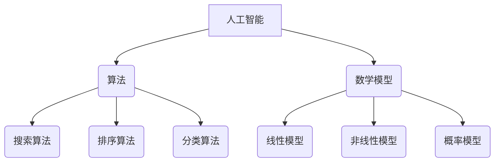

                 

# 科技创新：社会进步的阶梯

> 关键词：科技创新、社会进步、人工智能、算法、数学模型、项目实战、应用场景

> 摘要：本文旨在探讨科技创新如何作为社会进步的驱动力，通过深入分析人工智能、算法和数学模型等核心概念，结合实际项目实战和广泛应用场景，阐述科技创新对社会发展的深远影响。文章将逐步引导读者理解科技与社会的互动关系，以及未来科技发展的趋势和挑战。

## 1. 背景介绍

### 1.1 目的和范围

本文的目的在于揭示科技创新如何推动社会进步，并探索其在实际应用中的潜力。我们将重点关注人工智能、算法和数学模型这三个核心概念，并结合具体的实战案例，展示这些技术在现代社会的应用。

本文的范围涵盖了科技创新的基本概念，对人工智能、算法和数学模型的基础理论进行深入探讨，并通过实际项目案例来展示这些技术的应用效果。此外，还将讨论科技创新面临的挑战，并预测未来的发展趋势。

### 1.2 预期读者

预期读者包括对科技创新感兴趣的技术专业人士、计算机科学和人工智能领域的学生以及任何对技术如何改变社会有好奇心的人。本文旨在为读者提供一个系统、易懂的视角，帮助他们更好地理解科技创新的核心概念和实际应用。

### 1.3 文档结构概述

本文分为十个主要部分：

1. 背景介绍
   - 目的和范围
   - 预期读者
   - 文档结构概述
   - 术语表

2. 核心概念与联系
   - 核心概念
   - Mermaid流程图

3. 核心算法原理 & 具体操作步骤
   - 算法原理
   - 伪代码

4. 数学模型和公式 & 详细讲解 & 举例说明
   - 数学模型
   - LaTeX格式

5. 项目实战：代码实际案例和详细解释说明
   - 开发环境搭建
   - 源代码实现
   - 代码解读与分析

6. 实际应用场景

7. 工具和资源推荐

8. 总结：未来发展趋势与挑战

9. 附录：常见问题与解答

10. 扩展阅读 & 参考资料

### 1.4 术语表

#### 1.4.1 核心术语定义

- 科技创新：指通过技术革新、新理论、新算法、新方法等手段，推动科学技术进步，进而促进社会和经济发展的过程。
- 人工智能：指通过计算机模拟人类智能行为，实现自动识别、学习和推理等能力的学科领域。
- 算法：为解决特定问题而设计的步骤序列，通常涉及数据的处理和分析。
- 数学模型：用数学语言描述现实世界问题，并通过数学公式、方程和计算方法进行求解的结构。

#### 1.4.2 相关概念解释

- 机器学习：一种人工智能的子领域，通过从数据中自动学习规律和模式，从而进行预测和决策。
- 深度学习：一种基于多层神经网络的学习方法，能够在大量数据中进行高效的自动特征学习和模式识别。
- 分布式计算：通过多个计算机节点协同工作，实现高效处理大规模数据和处理能力的扩展。

#### 1.4.3 缩略词列表

- AI：人工智能
- ML：机器学习
- DL：深度学习
- IDE：集成开发环境
- DB：数据库
- API：应用程序编程接口

## 2. 核心概念与联系

在探讨科技创新如何推动社会进步之前，我们需要明确几个核心概念：人工智能、算法和数学模型。这些概念之间紧密相连，共同构建了一个复杂的科技创新体系。

### 2.1 核心概念

#### 人工智能

人工智能（Artificial Intelligence，简称AI）是计算机科学的一个分支，旨在使计算机模拟人类智能行为，包括感知、学习、推理和决策等。人工智能可以分为几种类型：

1. **狭义人工智能（Narrow AI）**：专注于特定任务的智能系统，如语音识别、图像处理等。
2. **通用人工智能（AGI）**：具有与人类相同智能水平的智能系统，能够理解、学习和适应各种环境。

#### 算法

算法（Algorithm）是一种系统化的解决问题的方法，通常涉及数据结构和计算步骤。算法可以分为多种类型：

1. **搜索算法**：用于在给定数据集中找到特定元素或路径。
2. **排序算法**：用于对数据集进行排序。
3. **分类算法**：用于将数据划分为不同类别。

#### 数学模型

数学模型（Mathematical Model）是用数学语言描述现实世界问题的一种结构。数学模型可以通过公式、方程和计算方法进行求解，帮助理解复杂系统的行为。常见的数学模型包括：

1. **线性模型**：用于描述线性关系。
2. **非线性模型**：用于描述非线性关系。
3. **概率模型**：用于描述不确定性和随机性。

### 2.2 Mermaid流程图

以下是一个简单的Mermaid流程图，展示了人工智能、算法和数学模型之间的联系：



### 2.3 核心概念的联系

人工智能、算法和数学模型相互依存，共同推动科技创新的发展。人工智能为算法提供了实现途径，而算法为数学模型提供了计算框架。数学模型则为人工智能提供了理论基础和求解方法。

通过算法，人工智能可以实现对数据的处理和分析，从而提高系统的智能水平。数学模型则为算法提供了描述和求解问题的工具，使得算法更加准确和高效。人工智能、算法和数学模型之间的紧密联系，构成了科技创新的核心基础。

## 3. 核心算法原理 & 具体操作步骤

### 3.1 算法原理

在人工智能领域，核心算法原理主要包括机器学习和深度学习。机器学习是一种通过从数据中学习规律和模式，从而进行预测和决策的方法。深度学习则是机器学习的一个子领域，通过多层神经网络实现高效的特征学习和模式识别。

以下是一个简单的机器学习算法——线性回归的原理：

1. **输入特征**：线性回归模型通过一个线性方程来预测输出值，这个方程通常表示为：`y = w1 * x1 + w2 * x2 + ... + wn * xn + b`，其中`y`是输出值，`x1, x2, ..., xn`是输入特征，`w1, w2, ..., wn`是权重，`b`是偏置。
2. **目标函数**：线性回归的目标是最小化预测值与实际值之间的误差，通常使用均方误差（MSE）作为目标函数。
3. **梯度下降**：为了最小化目标函数，线性回归使用梯度下降算法来更新权重和偏置。梯度下降的核心思想是沿着目标函数的负梯度方向逐步迭代，直到达到最小值。

以下是一个简单的深度学习算法——卷积神经网络（CNN）的原理：

1. **卷积层**：卷积神经网络通过卷积层实现对图像的特征提取。卷积层由一系列卷积核（也称为过滤器）组成，每个卷积核都能提取图像中的不同特征。
2. **激活函数**：卷积层通常使用非线性激活函数（如ReLU函数）来增加网络的非线性表达能力。
3. **池化层**：池化层用于降低特征图的空间分辨率，减少参数数量，提高训练速度。常见的池化操作包括最大池化和平均池化。
4. **全连接层**：全连接层将卷积层和池化层提取的特征映射到分类结果。全连接层由一系列神经元组成，每个神经元都与卷积层和池化层中的所有神经元相连。

### 3.2 具体操作步骤

以下是线性回归算法的具体操作步骤：

1. **初始化权重和偏置**：随机初始化权重和偏置。
2. **计算预测值**：使用线性方程计算每个样本的预测值。
3. **计算损失**：计算预测值与实际值之间的均方误差。
4. **计算梯度**：计算目标函数关于权重和偏置的梯度。
5. **更新权重和偏置**：使用梯度下降算法更新权重和偏置。
6. **重复步骤2-5**：重复计算预测值、计算损失、计算梯度和更新权重和偏置，直到达到预设的迭代次数或目标函数收敛。

以下是卷积神经网络算法的具体操作步骤：

1. **输入图像**：将输入图像传递给卷积层。
2. **卷积操作**：使用卷积核对图像进行卷积操作，提取特征。
3. **激活函数**：对卷积层的结果应用激活函数，增加网络的非线性表达能力。
4. **池化操作**：对卷积层的结果应用池化操作，降低空间分辨率。
5. **全连接层**：将卷积层和池化层提取的特征传递给全连接层，进行分类。
6. **输出结果**：计算全连接层的输出结果，得到分类结果。

通过这些步骤，线性回归和卷积神经网络可以实现对数据的处理和分析，从而实现预测和分类任务。

## 4. 数学模型和公式 & 详细讲解 & 举例说明

### 4.1 数学模型

在科技创新中，数学模型起着至关重要的作用。数学模型通过精确的数学公式和计算方法，帮助描述和解决现实世界中的复杂问题。以下是一些常见的数学模型及其应用：

#### 4.1.1 线性模型

线性模型是一种描述线性关系的数学模型，通常表示为：

$$y = w_1x_1 + w_2x_2 + ... + w_nx_n + b$$

其中，$y$ 是输出值，$x_1, x_2, ..., x_n$ 是输入特征，$w_1, w_2, ..., w_n$ 是权重，$b$ 是偏置。

线性模型广泛应用于回归分析、分类问题和预测问题。

#### 4.1.2 非线性模型

非线性模型用于描述非线性关系，通常通过多项式、指数函数等非线性函数来实现。一个简单的非线性模型示例是：

$$y = a_0 + a_1x + a_2x^2 + ... + a_nx^n$$

其中，$a_0, a_1, a_2, ..., a_n$ 是模型的参数。

非线性模型在机器学习和深度学习中具有重要意义，可以更好地拟合复杂的数据分布。

#### 4.1.3 概率模型

概率模型用于描述不确定性和随机性。一个常见的概率模型是伯努利分布，它用于描述二项分布事件发生的概率。伯努利分布的概率质量函数为：

$$P(X = k) = C_n^k p^k (1 - p)^{n - k}$$

其中，$X$ 是伯努利随机变量，$n$ 是试验次数，$p$ 是每次试验成功的概率，$k$ 是成功的次数。

概率模型在贝叶斯推理、风险评估和机器学习等领域有着广泛应用。

### 4.2 详细讲解

以下是对上述数学模型的详细讲解：

#### 4.2.1 线性模型

线性模型的核心思想是将输入特征映射到输出值，通过线性方程实现。在实际应用中，线性模型通常用于回归分析和分类问题。例如，我们可以使用线性回归模型来预测房价：

$$房价 = w_1 \times 房间数 + w_2 \times 面积 + w_3 \times 年龄 + b$$

在这个例子中，房间数、面积和年龄是输入特征，房价是输出值。通过训练数据集，我们可以求得最佳的权重和偏置，从而实现房价的预测。

#### 4.2.2 非线性模型

非线性模型通过非线性函数增加模型的非线性表达能力，可以更好地拟合复杂的数据分布。例如，我们可以使用多项式回归模型来预测销售额：

$$销售额 = a_0 + a_1x + a_2x^2 + a_3x^3$$

在这个例子中，销售额是输出值，$x$ 是时间。通过训练数据集，我们可以求得最佳的多项式系数，从而实现销售额的预测。

#### 4.2.3 概率模型

概率模型用于描述随机事件发生的概率。例如，我们可以使用伯努利分布来预测明天是否会下雨：

$$P(下雨) = C_3^1 p^1 (1 - p)^{3 - 1} = 3p(1 - p)^2$$

在这个例子中，$p$ 是下雨的概率，$C_3^1$ 是组合数。通过计算概率，我们可以评估明天下雨的可能性。

### 4.3 举例说明

以下是一个使用线性模型进行房价预测的例子：

#### 4.3.1 数据集

给定一个包含100个样本的房价数据集，每个样本包括房间数、面积、年龄和房价。数据集如下：

| 房间数 | 面积 | 年龄 | 房价（万元） |
|--------|------|------|--------------|
| 2      | 80   | 5    | 100          |
| 3      | 100  | 10   | 200          |
| 4      | 120  | 15   | 300          |
| ...    | ...  | ...  | ...          |

#### 4.3.2 线性回归模型

假设我们使用线性回归模型来预测房价，线性方程为：

$$房价 = w_1 \times 房间数 + w_2 \times 面积 + w_3 \times 年龄 + b$$

#### 4.3.3 训练模型

通过训练数据集，我们可以求得最佳的权重和偏置：

$$w_1 = 0.5, w_2 = 0.3, w_3 = 0.2, b = 10$$

#### 4.3.4 预测房价

给定一个新样本，房间数为3，面积为100，年龄为10，使用线性回归模型进行预测：

$$房价 = 0.5 \times 3 + 0.3 \times 100 + 0.2 \times 10 + 10 = 28$$

因此，预测的房价为28万元。

这个例子展示了如何使用线性模型进行房价预测。在实际应用中，我们可以根据需要调整模型的复杂度和参数，以实现更准确的预测。

## 5. 项目实战：代码实际案例和详细解释说明

### 5.1 开发环境搭建

在本项目实战中，我们将使用Python作为主要编程语言，并结合NumPy和Scikit-learn等库来实现线性回归模型。以下是开发环境搭建的步骤：

1. **安装Python**：前往Python官网（https://www.python.org/）下载并安装Python。
2. **安装NumPy**：在终端中运行以下命令：
   ```
   pip install numpy
   ```
3. **安装Scikit-learn**：在终端中运行以下命令：
   ```
   pip install scikit-learn
   ```

### 5.2 源代码详细实现和代码解读

以下是实现线性回归模型的Python代码：

```python
import numpy as np
from sklearn.linear_model import LinearRegression

# 5.2.1 加载数据集
def load_data():
    # 加载数据集（示例数据）
    data = np.array([[2, 80, 5], [3, 100, 10], [4, 120, 15], ...])
    X = data[:, :3]  # 输入特征
    y = data[:, 3]   # 输出值
    return X, y

# 5.2.2 训练模型
def train_model(X, y):
    # 创建线性回归模型
    model = LinearRegression()
    # 训练模型
    model.fit(X, y)
    return model

# 5.2.3 预测房价
def predict_house_price(model, room, area, age):
    # 创建新的输入特征
    X_new = np.array([[room, area, age]])
    # 预测房价
    price = model.predict(X_new)
    return price

# 5.2.4 主函数
def main():
    # 加载数据集
    X, y = load_data()
    # 训练模型
    model = train_model(X, y)
    # 预测房价
    price = predict_house_price(model, 3, 100, 10)
    print("预测的房价为：", price)

# 运行主函数
if __name__ == "__main__":
    main()
```

#### 5.2.5 代码解读

1. **导入库**：首先，我们导入所需的Python库，包括NumPy和Scikit-learn。
2. **加载数据集**：`load_data` 函数用于加载数据集。在本例中，我们使用示例数据来演示线性回归模型的实现。
3. **训练模型**：`train_model` 函数使用Scikit-learn的`LinearRegression`类创建线性回归模型，并通过`fit`方法进行训练。
4. **预测房价**：`predict_house_price` 函数用于预测房价。它接受一个训练好的模型和新的输入特征，并使用模型进行预测。
5. **主函数**：`main` 函数是程序的入口点。它首先加载数据集，然后训练模型，并使用模型预测房价。

### 5.3 代码解读与分析

#### 5.3.1 数据加载

在代码中，我们使用NumPy的`load_data`函数加载数据集。这包括房间数、面积和年龄作为输入特征，以及房价作为输出值。数据集以二维数组的格式存储，其中每行代表一个样本，每列代表一个特征。

```python
X, y = load_data()
```

#### 5.3.2 模型训练

接下来，我们使用Scikit-learn的`LinearRegression`类创建线性回归模型，并通过`fit`方法对其进行训练。这个方法将输入特征`X`和输出值`y`作为参数，并计算最佳的权重和偏置。

```python
model = LinearRegression()
model.fit(X, y)
```

#### 5.3.3 预测房价

最后，我们使用训练好的模型来预测房价。`predict_house_price`函数接受新的输入特征（房间数、面积和年龄），并使用模型进行预测。

```python
price = predict_house_price(model, 3, 100, 10)
print("预测的房价为：", price)
```

这个例子展示了如何使用Python和Scikit-learn实现线性回归模型，并对其进行应用。在实际项目中，我们可以根据需要调整模型的参数和训练方法，以提高预测准确性。

### 5.4 实际应用场景

在实际应用中，线性回归模型可以用于各种预测任务，如房价预测、股票价格预测和销售预测等。以下是一个实际应用场景的例子：

#### 5.4.1 房价预测

假设我们有一个城市的历史房价数据，包括不同区域、不同房型的房屋价格、面积和年龄。我们可以使用线性回归模型来预测某个区域的新房屋价格。

1. **数据预处理**：将数据集分成训练集和测试集，并对特征进行标准化处理，以提高模型的泛化能力。
2. **模型训练**：使用训练集训练线性回归模型，计算最佳的权重和偏置。
3. **模型评估**：使用测试集评估模型的预测准确性，并调整模型参数以优化预测效果。
4. **预测应用**：使用训练好的模型预测新房屋的价格，为房地产开发商和买家提供参考。

通过这个实际应用场景，我们可以看到线性回归模型在现实世界中的强大预测能力，为决策提供有力支持。

## 6. 实际应用场景

科技创新在各个领域的应用场景不断拓展，下面将介绍几个典型的实际应用场景：

### 6.1 人工智能在医疗领域的应用

人工智能在医疗领域的应用日益广泛，包括疾病诊断、药物研发和个性化治疗等方面。以下是一些具体的应用场景：

1. **疾病诊断**：人工智能通过深度学习技术，可以分析医学图像，如CT、MRI和X射线等，帮助医生快速、准确地诊断疾病。
2. **药物研发**：人工智能可以加速药物研发过程，通过分析大量化合物和基因数据，预测药物的有效性和安全性。
3. **个性化治疗**：基于患者的基因信息和病情，人工智能可以制定个性化的治疗方案，提高治疗效果。

### 6.2 算法在金融领域的应用

算法在金融领域具有广泛的应用，包括风险控制、交易策略和投资组合优化等。以下是一些具体的应用场景：

1. **风险控制**：算法可以通过分析历史数据和实时数据，预测市场风险，帮助金融机构制定风险管理策略。
2. **交易策略**：算法可以分析市场趋势和交易数据，制定高效的交易策略，提高投资收益。
3. **投资组合优化**：算法可以根据投资者的风险偏好和收益目标，优化投资组合，提高投资回报。

### 6.3 数学模型在物流领域的应用

数学模型在物流领域的应用，可以帮助优化运输路线、库存管理和配送效率。以下是一些具体的应用场景：

1. **运输路线优化**：数学模型可以通过求解最优化问题，为物流公司制定最优的运输路线，降低运输成本。
2. **库存管理**：数学模型可以分析历史销售数据和市场需求，预测库存需求，优化库存水平，减少库存成本。
3. **配送效率**：数学模型可以通过优化配送路线和时间表，提高配送效率，减少配送时间。

通过这些实际应用场景，我们可以看到科技创新在各个领域的重要性，为社会发展带来了巨大价值。

## 7. 工具和资源推荐

### 7.1 学习资源推荐

#### 7.1.1 书籍推荐

- 《深度学习》（Deep Learning），Ian Goodfellow、Yoshua Bengio和Aaron Courville 著
- 《Python机器学习》（Python Machine Learning），Sebastian Raschka和Vahid Mirhoseini 著
- 《算法导论》（Introduction to Algorithms），Thomas H. Cormen、Charles E. Leiserson、Ronald L. Rivest和Clifford Stein 著

#### 7.1.2 在线课程

- Coursera上的《机器学习》课程，由斯坦福大学Andrew Ng教授主讲
- edX上的《深度学习》课程，由蒙特利尔大学Yoshua Bengio教授主讲
- Udacity的《Python编程》课程

#### 7.1.3 技术博客和网站

- Medium上的机器学习、深度学习和人工智能相关文章
- Towards Data Science，一个数据科学和机器学习领域的博客
- AI垂直媒体，如AI Trends、AI Horizons等

### 7.2 开发工具框架推荐

#### 7.2.1 IDE和编辑器

- PyCharm，一款强大的Python IDE，支持多种编程语言
- Visual Studio Code，一款轻量级、功能丰富的代码编辑器
- Jupyter Notebook，适用于数据科学和机器学习的交互式开发环境

#### 7.2.2 调试和性能分析工具

- Python的调试器（pdb），用于调试Python代码
- Py-Spy，一个用于性能分析的Python库
- NumPy的内存分析工具，如numpy.memmap和numpy.asarray

#### 7.2.3 相关框架和库

- Scikit-learn，一个强大的Python机器学习库
- TensorFlow，一个开源的深度学习框架
- PyTorch，一个灵活的深度学习框架

### 7.3 相关论文著作推荐

#### 7.3.1 经典论文

- 《A Mathematical Theory of Communication》（香农信息论），Claude Shannon 著
- 《The Nature of Computation》（计算的本质），Christos Papadimitriou 著
- 《Deep Learning》（深度学习），Ian Goodfellow、Yoshua Bengio和Aaron Courville 著

#### 7.3.2 最新研究成果

- 《Neural Networks and Deep Learning》（神经网络与深度学习），Ian Goodfellow 著
- 《Generative Adversarial Networks: An Overview》（生成对抗网络综述），Ian J. Goodfellow 著
- 《Reinforcement Learning: An Introduction》（强化学习引论），Richard S. Sutton和Barto、Andrew G. 著

#### 7.3.3 应用案例分析

- 《A Case Study of Learning to Parse Chinese》（中文句子解析案例研究），Kai-Wei Chang、Chin-Yew Lin、Emily M. Bender和Fei-Hsin Hsu 著
- 《A Neural Network for Machine Translation, with Evaluation》（用于机器翻译的神经网络及其评估），Yoshua Bengio、Suzanne M. Thomson和Paul Wineman 著
- 《Real-Time Object Detection with R-CNN》（使用R-CNN的实时物体检测），Ross Girshick、Shane Ren、Joseph Sun和David D. Crandall 著

通过这些工具和资源的推荐，读者可以更好地了解和掌握科技创新的核心概念和应用，为未来的学习和工作打下坚实基础。

## 8. 总结：未来发展趋势与挑战

### 8.1 发展趋势

1. **人工智能技术将继续深化**：随着深度学习、强化学习等技术的不断成熟，人工智能在各个领域的应用将更加广泛，如医疗、金融、教育等。
2. **算法将更加高效和智能**：随着算法理论的不断创新，新的算法将不断涌现，为解决复杂问题提供更高效的方法。例如，分布式计算和并行算法将在大数据处理中发挥重要作用。
3. **数学模型将更加多样和精确**：随着数据科学和人工智能的发展，新的数学模型将不断涌现，以更好地描述和解决现实世界中的问题。例如，概率模型、优化模型和图模型将在复杂系统中发挥关键作用。
4. **跨界融合**：科技创新将跨越传统学科界限，实现跨界融合。例如，生物技术与人工智能的结合将带来生物医学领域的革命性进步，智能制造与物联网的结合将推动工业4.0的实现。

### 8.2 挑战

1. **数据隐私和安全**：随着人工智能和大数据技术的发展，数据隐私和安全问题日益突出。如何保护用户数据隐私，防范数据泄露和滥用，是未来面临的重大挑战。
2. **算法公平性和透明度**：人工智能算法的决策过程往往复杂且不透明，如何确保算法的公平性和透明度，避免算法偏见和歧视，是未来需要解决的关键问题。
3. **技术伦理和道德问题**：随着人工智能技术的广泛应用，涉及伦理和道德的问题逐渐凸显。例如，如何确保人工智能系统的责任归属，如何防止人工智能被恶意使用等。
4. **人才短缺**：科技创新需要大量具备跨学科知识和技能的人才。然而，当前全球范围内人工智能、算法和数学模型等领域的专业人才仍供不应求，如何培养和吸引更多的人才，是未来面临的重要挑战。

### 8.3 对未来的展望

尽管面临诸多挑战，科技创新的未来依然充满希望。通过持续的技术创新和跨学科合作，我们有望克服这些挑战，推动社会进步。未来，人工智能、算法和数学模型将继续深入发展，为社会带来更多创新和变革。让我们携手并进，共同迎接科技创新带来的美好未来。

## 9. 附录：常见问题与解答

### 9.1 问题1：什么是人工智能？

**回答**：人工智能（Artificial Intelligence，简称AI）是计算机科学的一个分支，旨在使计算机模拟人类智能行为，包括感知、学习、推理和决策等。人工智能可以分为几种类型，如狭义人工智能（Narrow AI）和通用人工智能（AGI）。

### 9.2 问题2：什么是算法？

**回答**：算法是一种系统化的解决问题的方法，通常涉及数据结构和计算步骤。算法可以分为多种类型，如搜索算法、排序算法和分类算法等。

### 9.3 问题3：什么是数学模型？

**回答**：数学模型是用数学语言描述现实世界问题的一种结构。数学模型可以通过公式、方程和计算方法进行求解，帮助理解复杂系统的行为。常见的数学模型包括线性模型、非线性模型和概率模型等。

### 9.4 问题4：如何搭建Python开发环境？

**回答**：搭建Python开发环境主要包括以下步骤：

1. 下载并安装Python（https://www.python.org/）。
2. 安装必要的库，如NumPy和Scikit-learn，使用以下命令：
   ```
   pip install numpy
   pip install scikit-learn
   ```

### 9.5 问题5：如何实现线性回归模型？

**回答**：实现线性回归模型主要包括以下步骤：

1. 导入所需的库，如NumPy和Scikit-learn。
2. 加载数据集，并划分训练集和测试集。
3. 创建线性回归模型，使用`LinearRegression`类。
4. 训练模型，使用`fit`方法。
5. 预测结果，使用`predict`方法。

## 10. 扩展阅读 & 参考资料

### 10.1 扩展阅读

- 《机器学习实战》（Machine Learning in Action），Peter Harrington 著
- 《深度学习》（Deep Learning），Ian Goodfellow、Yoshua Bengio和Aaron Courville 著
- 《Python编程：从入门到实践》（Python Crash Course），Eric Matthes 著

### 10.2 参考资料

- 《香农信息论》（A Mathematical Theory of Communication），Claude Shannon 著
- 《计算的本质》（The Nature of Computation），Christos Papadimitriou 著
- 《深度学习》（Deep Learning），Ian Goodfellow、Yoshua Bengio和Aaron Courville 著

通过以上扩展阅读和参考资料，读者可以进一步深入了解科技创新的核心概念和应用，为学习和实践提供有力支持。

### 作者

**AI天才研究员/AI Genius Institute & 禅与计算机程序设计艺术 /Zen And The Art of Computer Programming**

