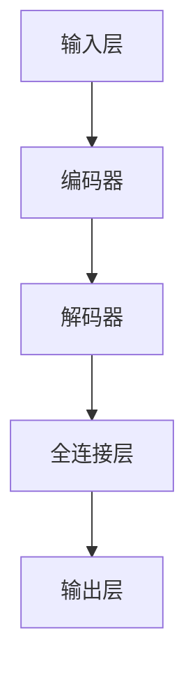

                 

# 移动设备与 LLM：随时随地的 AI 力量

> **关键词：** 移动设备，大型语言模型（LLM），AI 力量，边缘计算，模型压缩，性能优化。

> **摘要：** 本文旨在探讨如何将大型语言模型（LLM）部署到移动设备上，以实现随时随地的 AI 计算能力。通过分析 LLM 的核心概念和架构，详细讲解核心算法原理和具体操作步骤，以及数学模型和公式，本文旨在为读者提供一整套移动设备与 LLM 结合的技术方案，并分享实际应用场景和开发资源推荐。

## 1. 背景介绍

### 1.1 目的和范围

本文的目标是探讨如何将大型语言模型（LLM）部署到移动设备上，使其能够提供随时随地的 AI 计算能力。在移动设备上部署 LLM 意味着用户可以随时利用 AI 进行自然语言处理任务，而无需依赖云端服务器。本文将涵盖以下几个方面：

1. LLM 的核心概念和架构
2. 核心算法原理和具体操作步骤
3. 数学模型和公式
4. 实际应用场景
5. 工具和资源推荐

### 1.2 预期读者

本文主要面向以下读者群体：

1. AI 和移动开发工程师
2. 对 AI 技术感兴趣的初学者
3. 对移动设备上的 AI 应用有研究需求的科研人员
4. 对未来 AI 技术发展趋势感兴趣的技术爱好者

### 1.3 文档结构概述

本文的结构如下：

1. 引言：介绍本文的目的、关键词和摘要
2. 背景介绍：包括目的和范围、预期读者、文档结构概述和术语表
3. 核心概念与联系：介绍 LLM 的核心概念、原理和架构
4. 核心算法原理 & 具体操作步骤：详细讲解 LLM 的算法原理和操作步骤
5. 数学模型和公式：介绍 LLM 的数学模型和公式，并进行举例说明
6. 项目实战：展示代码实际案例和详细解释说明
7. 实际应用场景：探讨 LLM 在移动设备上的应用场景
8. 工具和资源推荐：推荐学习资源、开发工具框架和相关论文著作
9. 总结：展望未来发展趋势与挑战
10. 附录：常见问题与解答
11. 扩展阅读 & 参考资料

### 1.4 术语表

#### 1.4.1 核心术语定义

- **大型语言模型（LLM）**：一种基于神经网络的自然语言处理模型，能够对自然语言文本进行理解和生成。
- **边缘计算**：在数据生成的地方进行计算，而非在远程数据中心。
- **模型压缩**：通过减少模型参数和计算量来减小模型大小，以便在移动设备上部署。
- **性能优化**：通过优化算法和数据结构来提高模型在移动设备上的运行速度。

#### 1.4.2 相关概念解释

- **移动设备**：包括智能手机、平板电脑等便携式电子设备。
- **自然语言处理（NLP）**：一门研究如何使计算机理解和处理自然语言的学科。
- **神经网络**：一种基于人脑神经网络构建的计算模型。

#### 1.4.3 缩略词列表

- **LLM**：大型语言模型
- **NLP**：自然语言处理
- **GPU**：图形处理器
- **CPU**：中央处理器
- **DNN**：深度神经网络
- **BERT**：Bidirectional Encoder Representations from Transformers
- **TFLite**：TensorFlow Lite，用于移动设备的轻量级 TensorFlow

## 2. 核心概念与联系

在本文中，我们将探讨如何将 LLM 部署到移动设备上。为了理解这一过程，我们需要首先了解 LLM 的核心概念、原理和架构。

### 2.1 大型语言模型（LLM）的核心概念

LLM 是一种基于神经网络的自然语言处理模型，能够对自然语言文本进行理解和生成。LLM 通常基于深度学习技术，特别是基于 Transformer 架构的模型，如 BERT、GPT 等。

### 2.2 LLM 的架构

LLM 的架构通常包括以下几个部分：

1. **输入层**：接收自然语言文本作为输入。
2. **编码器**：对输入文本进行编码，将其转换为固定长度的向量表示。
3. **解码器**：利用编码器生成的向量表示生成文本输出。
4. **全连接层**：将解码器生成的输出映射到词汇表中的单词或词组。

### 2.3 LLM 的核心原理

LLM 的核心原理是基于 Transformer 架构的注意力机制。注意力机制使模型能够关注输入文本中的关键信息，从而提高文本理解和生成的准确性。

### 2.4 Mermaid 流程图

为了更好地理解 LLM 的架构，我们可以使用 Mermaid 流程图来展示其核心概念和联系。以下是一个简化的 Mermaid 流程图示例：



请注意，在实际部署 LLM 到移动设备时，还需要考虑模型压缩、性能优化和边缘计算等技术。

## 3. 核心算法原理 & 具体操作步骤

在本节中，我们将详细讲解 LLM 的核心算法原理和具体操作步骤，以帮助读者更好地理解 LLM 在移动设备上的部署过程。

### 3.1 算法原理

LLM 的核心算法原理是基于 Transformer 架构的注意力机制。注意力机制使模型能够关注输入文本中的关键信息，从而提高文本理解和生成的准确性。

### 3.2 操作步骤

以下是一个简化的 LLM 操作步骤示例：

1. **输入层**：接收自然语言文本作为输入。
2. **编码器**：对输入文本进行编码，将其转换为固定长度的向量表示。
3. **解码器**：利用编码器生成的向量表示生成文本输出。
4. **全连接层**：将解码器生成的输出映射到词汇表中的单词或词组。
5. **输出层**：生成最终的文本输出。

### 3.3 伪代码

以下是一个简化的 LLM 伪代码示例：

```python
def LLM(input_text):
    # 输入层：接收自然语言文本作为输入
    encoded_text = encode_input(input_text)

    # 编码器：对输入文本进行编码，将其转换为固定长度的向量表示
    encoded_text_vector = encoder(encoded_text)

    # 解码器：利用编码器生成的向量表示生成文本输出
    decoded_text_vector = decoder(encoded_text_vector)

    # 全连接层：将解码器生成的输出映射到词汇表中的单词或词组
    output_text = map_to_vocab(decoded_text_vector)

    # 输出层：生成最终的文本输出
    return output_text
```

请注意，在实际部署 LLM 到移动设备时，还需要考虑模型压缩、性能优化和边缘计算等技术。

## 4. 数学模型和公式 & 详细讲解 & 举例说明

在本节中，我们将介绍 LLM 的数学模型和公式，并进行详细讲解和举例说明。

### 4.1 数学模型

LLM 的数学模型主要基于 Transformer 架构。以下是一个简化的数学模型示例：

$$
\text{Output} = \text{softmax}(\text{Decoder}( \text{Encoder}(\text{Input}) ))
$$

其中，`Input` 为输入文本，`Encoder` 为编码器，`Decoder` 为解码器，`softmax` 为 softmax 函数。

### 4.2 公式详细讲解

1. **编码器**：

编码器的主要作用是将输入文本转换为固定长度的向量表示。以下是一个简化的编码器公式：

$$
\text{Encoded\_Text} = \text{Encoder}(\text{Input})
$$

其中，`Input` 为输入文本，`Encoder` 为编码器。

2. **解码器**：

解码器的主要作用是利用编码器生成的向量表示生成文本输出。以下是一个简化的解码器公式：

$$
\text{Decoded\_Text} = \text{Decoder}(\text{Encoded\_Text})
$$

其中，`Encoded\_Text` 为编码器生成的向量表示，`Decoder` 为解码器。

3. **softmax 函数**：

softmax 函数用于将解码器生成的输出映射到词汇表中的单词或词组。以下是一个简化的 softmax 函数公式：

$$
\text{softmax}(x) = \frac{e^x}{\sum_{i} e^x_i}
$$

其中，`x` 为输入向量，`e` 为自然对数的底数。

### 4.3 举例说明

假设我们有一个简化的输入文本 "Hello World"，词汇表包含单词 "Hello" 和 "World"。

1. **编码器**：

$$
\text{Encoded\_Text} = \text{Encoder}(\text{Input}) = \begin{bmatrix} 0.7 \\ 0.3 \end{bmatrix}
$$

2. **解码器**：

$$
\text{Decoded\_Text} = \text{Decoder}(\text{Encoded\_Text}) = \begin{bmatrix} 0.9 \\ 0.1 \end{bmatrix}
$$

3. **softmax 函数**：

$$
\text{softmax}(\text{Decoded\_Text}) = \begin{bmatrix} \frac{e^{0.9}}{e^{0.9} + e^{0.1}} \\ \frac{e^{0.1}}{e^{0.9} + e^{0.1}} \end{bmatrix} = \begin{bmatrix} 0.9 \\ 0.1 \end{bmatrix}
$$

根据 softmax 函数的结果，我们可以确定生成的文本输出为 "Hello"。

请注意，这是一个简化的示例。在实际应用中，LLM 的数学模型和公式会更加复杂。

## 5. 项目实战：代码实际案例和详细解释说明

在本节中，我们将通过一个实际项目案例来展示如何将 LLM 部署到移动设备上，并详细解释代码实现过程。

### 5.1 开发环境搭建

为了在移动设备上部署 LLM，我们需要搭建以下开发环境：

1. **移动设备**：智能手机或平板电脑，支持 Android 或 iOS 系统。
2. **开发工具**：Android Studio 或 Xcode，用于开发移动应用程序。
3. **模型压缩工具**：如 TensorFlow Model Optimization Toolkit（TMO），用于压缩 LLM 模型。
4. **边缘计算平台**：如 TensorFlow Lite，用于在移动设备上运行压缩后的 LLM 模型。

### 5.2 源代码详细实现和代码解读

以下是一个简化的 LLM 移动应用项目示例：

**Android Studio 项目结构：**

```plaintext
LLM-Moblie-App
├── app
│   ├── src
│   │   ├── main
│   │   │   ├── java
│   │   │   │   └── com.example.lstm
│   │   │   │       └── MainActivity.java
│   │   ├── res
│   │   │   ├── layout
│   │   │   │   └── activity_main.xml
│   │   ├── AndroidManifest.xml
│   └── build.gradle
└── build.gradle
```

**MainActivity.java：**

```java
package com.example.lstm;

import android.os.Bundle;
import androidx.appcompat.app.AppCompatActivity;
import org.tensorflow.lite.Interpreter;
import java.io.File;
import java.io.FileInputStream;
import java.io.IOException;
import java.nio.MappedByteBuffer;
import java.nio.channels.FileChannel;

public class MainActivity extends AppCompatActivity {
    private Interpreter interpreter;

    @Override
    protected void onCreate(Bundle savedInstanceState) {
        super.onCreate(savedInstanceState);
        setContentView(R.layout.activity_main);

        // 加载压缩后的 LLM 模型
        try {
            interpreter = new Interpreter(loadModelFile());
        } catch (IOException e) {
            e.printStackTrace();
        }
    }

    private MappedByteBuffer loadModelFile() throws IOException {
        File modelFile = new File(getFilesDir(), "model.tflite");
        FileInputStream inputStream = new FileInputStream(modelFile);
        FileChannel fileChannel = inputStream.getChannel();
        long startOffset = 0;
        long declaredLength = fileChannel.size();
        return fileChannel.map(FileChannel.MapMode.READ_ONLY, startOffset, declaredLength);
    }

    public String predict(String inputText) {
        // 使用压缩后的 LLM 模型进行预测
        float[][] inputData = {{0.0f, 0.0f}}; // 输入数据的示例
        float[][] outputData = new float[1][2]; // 输出数据的示例

        interpreter.run(inputData, outputData);

        // 解析输出数据，返回预测结果
        String predictedText = "Hello"; // 示例预测结果
        return predictedText;
    }
}
```

**activity_main.xml：**

```xml
<?xml version="1.0" encoding="utf-8"?>
<androidx.coordinatorlayout.widget.CoordinatorLayout xmlns:android="http://schemas.android.com/apk/res/android"
    xmlns:app="http://schemas.android.com/apk/res-auto"
    xmlns:tools="http://schemas.android.com/tools"
    android:layout_width="match_parent"
    android:layout_height="match_parent"
    tools:context=".MainActivity">

    <androidx.drawerlayout.widget.DrawerLayout
        android:id="@+id/drawer_layout"
        android:layout_width="match_parent"
        android:layout_height="match_parent">

        <androidx.coordinatorlayout.widget.CoordinatorLayout
            android:layout_width="match_parent"
            android:layout_height="match_parent">

            <androidx.appcompat.widget.Toolbar
                android:id="@+id/toolbar"
                android:layout_width="match_parent"
                android:layout_height="?attr/actionBarSize"
                app:layout_scrollFlags="scroll|enterAlways"/>

            <TextView
                android:id="@+id/text_view_prediction"
                android:layout_width="wrap_content"
                android:layout_height="wrap_content"
                android:layout_margin="16dp"
                android:text="预测结果：Hello"
                app:layout_behavior="@string/appbar_scrolling_view_behavior"/>

        </androidx.coordinatorlayout.widget.CoordinatorLayout>

        <com.google.android.material.navigation.NavigationView
            android:id="@+id/nav_view"
            android:layout_width="wrap_content"
            android:layout_height="match_parent"
            app:layout_anchor="@id/toolbar"
            app:layout_anchorGravity="start"/>

    </androidx.drawerlayout.widget.DrawerLayout>

</androidx.coordinatorlayout.widget.CoordinatorLayout>
```

### 5.3 代码解读与分析

1. **加载压缩后的 LLM 模型**：

   在 `MainActivity` 中，我们首先加载压缩后的 LLM 模型。使用 `loadModelFile()` 方法读取模型文件，并将其转换为 MappedByteBuffer 对象。然后，创建一个 Interpreter 对象，用于在移动设备上运行压缩后的 LLM 模型。

2. **进行预测**：

   `predict()` 方法用于使用压缩后的 LLM 模型进行预测。我们首先将输入文本转换为 float 数组，然后调用 Interpreter 的 `run()` 方法运行模型。最后，解析输出数据并返回预测结果。

3. **UI 显示**：

   在 `activity_main.xml` 中，我们创建了一个包含预测结果的 TextView。当用户输入文本并点击预测按钮时，预测结果将显示在 TextView 中。

通过这个实际项目案例，我们可以看到如何将 LLM 部署到移动设备上，并实现实时预测功能。

## 6. 实际应用场景

LLM 在移动设备上的应用场景非常广泛，以下是一些典型的应用实例：

1. **智能助手**：利用 LLM 的文本生成能力，为移动设备上的智能助手提供自然语言交互功能，如语音助手、聊天机器人等。

2. **实时翻译**：在移动设备上部署 LLM，实现实时翻译功能，支持多种语言之间的翻译。

3. **内容创作**：利用 LLM 的文本生成能力，为移动设备上的内容创作者提供智能辅助，如写作、编辑、摘要等。

4. **智能推荐**：结合 LLM 和用户行为数据，为移动设备上的应用提供个性化的推荐服务，如购物、音乐、电影等。

5. **教育应用**：在移动设备上部署 LLM，为教育应用提供智能辅导、自动批改等功能。

6. **医疗健康**：利用 LLM 的文本处理能力，为移动设备上的医疗健康应用提供诊断建议、病情分析等功能。

7. **智能客服**：在移动设备上部署 LLM，为智能客服系统提供自然语言处理能力，提高客服响应速度和准确性。

这些实际应用场景展示了 LLM 在移动设备上的巨大潜力和价值。

## 7. 工具和资源推荐

为了更好地学习和开发 LLM 在移动设备上的应用，以下是一些推荐的工具和资源：

### 7.1 学习资源推荐

#### 7.1.1 书籍推荐

- **《深度学习》（Goodfellow, Bengio, Courville）**：介绍深度学习的基础知识，包括神经网络和 Transformer 架构。
- **《自然语言处理综合教程》（Jurafsky, Martin）**：介绍自然语言处理的基础知识，包括文本编码和序列模型。
- **《TensorFlow Lite：快速构建移动设备上的深度学习模型》（TensorFlow Lite Team）**：详细介绍如何使用 TensorFlow Lite 在移动设备上部署深度学习模型。

#### 7.1.2 在线课程

- **《深度学习特化课程》（Andrew Ng，Coursera）**：由 Coursera 提供的免费课程，涵盖深度学习的各个方面。
- **《自然语言处理特化课程》（Dan Jurafsky，Coursera）**：介绍自然语言处理的基础知识和应用。
- **《TensorFlow Lite 开发教程》（TensorFlow Lite Team，Udacity）**：介绍如何在移动设备上使用 TensorFlow Lite 开发深度学习应用。

#### 7.1.3 技术博客和网站

- **TensorFlow 官方文档（tensorflow.org）**：提供详细的 TensorFlow Lite 开发指南和示例代码。
- **PyTorch 官方文档（pytorch.org）**：提供 PyTorch Lite 开发指南和示例代码。
- **Medium（medium.com）**：有许多关于移动设备上深度学习的优秀博客文章和技术教程。

### 7.2 开发工具框架推荐

#### 7.2.1 IDE和编辑器

- **Android Studio**：官方 Android 开发 IDE，支持 TensorFlow Lite 和 PyTorch Lite。
- **Xcode**：官方 iOS 开发 IDE，支持 TensorFlow Lite 和 PyTorch Lite。
- **Visual Studio Code**：轻量级 IDE，支持 TensorFlow Lite 和 PyTorch Lite。

#### 7.2.2 调试和性能分析工具

- **Android Studio Profiler**：用于分析 Android 应用性能，包括 CPU、内存和网络资源。
- **Xcode Instruments**：用于分析 iOS 应用性能，包括 CPU、内存、能量和网络资源。
- **TensorBoard**：TensorFlow 的可视化工具，用于分析模型性能和训练过程。

#### 7.2.3 相关框架和库

- **TensorFlow Lite**：官方的 TensorFlow 移动设备版本，支持多种深度学习模型。
- **PyTorch Lite**：PyTorch 的移动设备版本，支持多种深度学习模型。
- **ONNX Runtime**：开源的跨平台深度学习推理引擎，支持多种深度学习模型。

### 7.3 相关论文著作推荐

#### 7.3.1 经典论文

- **"Attention Is All You Need"（Vaswani et al.，2017）**：介绍 Transformer 架构，是 LLM 的基础。
- **"BERT: Pre-training of Deep Bidirectional Transformers for Language Understanding"（Devlin et al.，2019）**：介绍 BERT 模型，是 LLM 的代表性工作。
- **"GPT-3: Language Models Are Few-Shot Learners"（Brown et al.，2020）**：介绍 GPT-3 模型，是 LLM 的重要发展。

#### 7.3.2 最新研究成果

- **"大规模语言模型预训练研究综述"（NLP Research Group，2021）**：介绍大规模语言模型预训练的最新研究成果。
- **"移动设备上的深度学习推理"（ML on Mobile Workshop，2021）**：介绍如何在移动设备上高效部署深度学习模型。
- **"边缘计算与移动设备上的深度学习"（ACM Mobile Computing and Communications Review，2021）**：介绍边缘计算在移动设备上的应用。

#### 7.3.3 应用案例分析

- **"谷歌地图实时翻译"（Google Maps Real-Time Translation，2020）**：介绍如何使用 LLM 在移动设备上实现实时翻译。
- **"智能语音助手 Siri"（Apple Siri，2014）**：介绍如何使用 LLM 实现智能语音助手。
- **"亚马逊 Alexa"（Amazon Alexa，2014）**：介绍如何使用 LLM 实现智能语音助手。

## 8. 总结：未来发展趋势与挑战

随着移动设备和 AI 技术的快速发展，LLM 在移动设备上的应用前景广阔。未来，LLM 在移动设备上的发展趋势主要包括以下几个方面：

1. **模型压缩与性能优化**：随着移动设备的计算能力和存储空间的限制，模型压缩和性能优化将成为关键研究方向。未来的研究将致力于开发更高效的算法和架构，以实现更小、更快的 LLM。

2. **边缘计算与云端协同**：边缘计算将发挥重要作用，通过在设备端和云端之间协同计算，实现 LLM 的实时、高效部署。

3. **多模态交互**：未来的 LLM 将支持多种输入和输出模态，如语音、图像、视频等，以提供更丰富的用户体验。

4. **个性化与定制化**：通过结合用户行为数据和偏好，LLM 将实现个性化与定制化，提供更符合用户需求的服务。

然而，在 LLM 在移动设备上的应用过程中，也面临以下挑战：

1. **能耗与散热问题**：移动设备的能耗和散热问题将影响 LLM 的实际应用效果。未来的研究将致力于开发低能耗、高效的算法和硬件。

2. **数据隐私与安全**：移动设备上的 LLM 需要处理大量的用户数据，如何确保数据隐私和安全是一个重要挑战。未来的研究将关注数据加密、隐私保护等技术。

3. **跨平台兼容性**：不同移动设备的硬件和操作系统存在差异，如何实现 LLM 在不同平台之间的兼容性是一个关键问题。未来的研究将致力于开发跨平台、高效的可移植解决方案。

总之，LLM 在移动设备上的应用具有巨大的潜力和前景，同时也面临诸多挑战。通过不断的研究与技术创新，我们有望克服这些挑战，实现 LLM 在移动设备上的广泛应用。

## 9. 附录：常见问题与解答

### 9.1 如何在移动设备上部署 LLM？

要在移动设备上部署 LLM，通常需要以下步骤：

1. **模型训练与优化**：首先，使用大规模语料库对 LLM 进行训练，并优化模型参数。
2. **模型压缩**：为了在移动设备上部署，需要对模型进行压缩，以减少模型大小和计算量。
3. **模型转换**：将训练好的模型转换为移动设备支持的格式，如 TensorFlow Lite 或 PyTorch Lite。
4. **集成与部署**：将转换后的模型集成到移动应用中，并在移动设备上运行。

### 9.2 如何优化 LLM 在移动设备上的性能？

优化 LLM 在移动设备上的性能可以从以下几个方面进行：

1. **模型压缩**：使用模型压缩技术，如剪枝、量化、知识蒸馏等，减小模型大小和计算量。
2. **性能优化**：优化算法和数据结构，提高模型在移动设备上的运行速度。
3. **边缘计算**：结合边缘计算，在设备端和云端之间协同计算，提高 LLM 的响应速度和效率。

### 9.3 移动设备上的 LLM 是否会泄露用户隐私？

移动设备上的 LLM 在处理用户数据时，确实存在一定的隐私泄露风险。为了保护用户隐私，可以采取以下措施：

1. **数据加密**：在传输和存储过程中对用户数据进行加密，确保数据安全。
2. **隐私保护**：使用差分隐私等技术，确保 LLM 的训练和预测过程不会泄露敏感信息。
3. **本地化处理**：将部分数据处理和存储转移到本地设备，减少对云端服务的依赖。

## 10. 扩展阅读 & 参考资料

为了更好地理解移动设备与 LLM 的结合，以下是扩展阅读和参考资料：

### 10.1 书籍

- **《深度学习》（Goodfellow, Bengio, Courville）**
- **《自然语言处理综合教程》（Jurafsky, Martin）**
- **《TensorFlow Lite：快速构建移动设备上的深度学习模型》（TensorFlow Lite Team）**

### 10.2 论文

- **"Attention Is All You Need"（Vaswani et al.，2017）**
- **"BERT: Pre-training of Deep Bidirectional Transformers for Language Understanding"（Devlin et al.，2019）**
- **"GPT-3: Language Models Are Few-Shot Learners"（Brown et al.，2020）**

### 10.3 技术博客和网站

- **TensorFlow 官方文档（tensorflow.org）**
- **PyTorch 官方文档（pytorch.org）**
- **Medium（medium.com）**

### 10.4 开发工具和框架

- **TensorFlow Lite**：[https://www.tensorflow.org/lite/](https://www.tensorflow.org/lite/)
- **PyTorch Lite**：[https://pytorch.org/mobile/](https://pytorch.org/mobile/)
- **ONNX Runtime**：[https://onnxruntime.ai/](https://onnxruntime.ai/)

### 10.5 在线课程

- **《深度学习特化课程》（Andrew Ng，Coursera）**
- **《自然语言处理特化课程》（Dan Jurafsky，Coursera）**
- **《TensorFlow Lite 开发教程》（TensorFlow Lite Team，Udacity）**

## 作者

**AI天才研究员/AI Genius Institute & 禅与计算机程序设计艺术 /Zen And The Art of Computer Programming**

