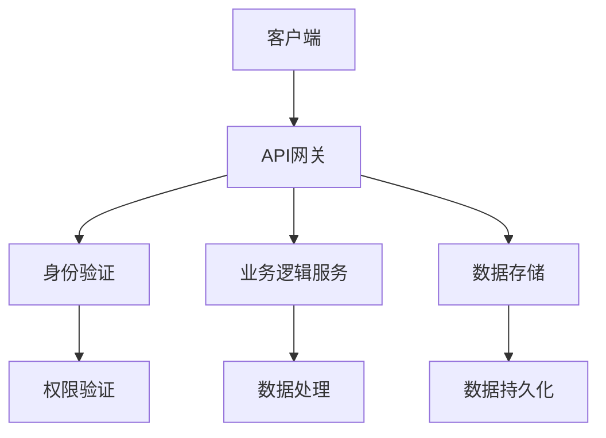
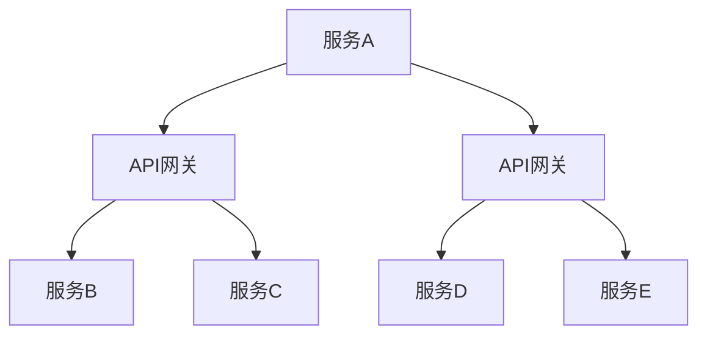
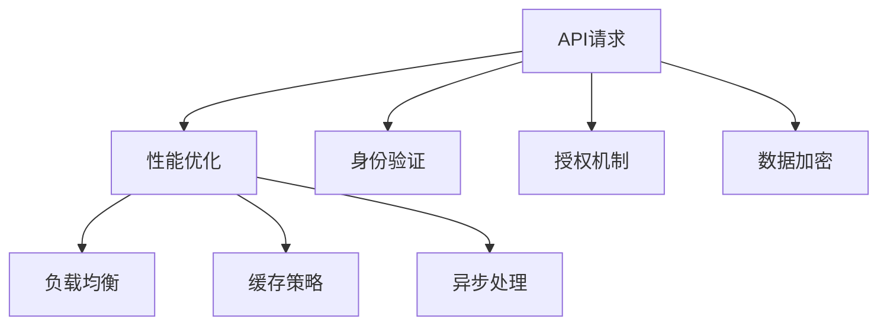

                 

# 程序员创业公司的API设计与管理最佳实践

> **关键词：** API设计、创业公司、最佳实践、RESTful API、微服务架构、性能优化、安全性、文档化

> **摘要：** 本文章旨在为程序员创业公司提供API设计与管理方面的最佳实践。我们将探讨API设计的基本原则、RESTful API的构建、微服务架构中的API管理策略、性能与安全性的优化方法，以及文档化和工具支持的实践。通过这篇文章，希望能够帮助创业者打造高效、可靠且易于维护的API服务。

## 1. 背景介绍

### 1.1 目的和范围

本文章的目的是为程序员创业公司提供一套系统化的API设计与管理最佳实践。我们将涵盖从API设计原则到实际操作步骤，再到维护与优化的全面指导。文章的目标读者包括创业公司的CTO、软件工程师、架构师以及对API设计与管理工作感兴趣的IT专业人士。

### 1.2 预期读者

预期读者应具备一定的编程基础，理解基本的网络协议和API工作原理。文章将采用清晰易懂的语言，并尽量减少专业术语，以便读者能够轻松跟随并应用这些实践。

### 1.3 文档结构概述

本文将分为以下几个部分：

1. 背景介绍：本文的概述和预期读者。
2. 核心概念与联系：介绍API设计的关键概念和架构。
3. 核心算法原理 & 具体操作步骤：讲解API设计的技术细节。
4. 数学模型和公式 & 详细讲解 & 举例说明：解释API设计中涉及到的数学概念。
5. 项目实战：提供实际代码案例和解析。
6. 实际应用场景：讨论API在实际业务中的应用。
7. 工具和资源推荐：推荐学习资源和开发工具。
8. 总结：API设计与管理的发展趋势与挑战。
9. 附录：常见问题与解答。
10. 扩展阅读 & 参考资料：提供更多深入学习的资源。

### 1.4 术语表

#### 1.4.1 核心术语定义

- **API（应用程序编程接口）**：允许应用程序与其他应用程序、库或服务交互的接口。
- **RESTful API**：遵循REST（表述性状态转移）原则的API设计风格。
- **微服务架构**：一种将应用程序构建为多个独立的、可互相调用的服务架构。
- **性能优化**：提高API响应速度和处理能力的过程。
- **安全性**：保护API免受恶意攻击和数据泄露的措施。

#### 1.4.2 相关概念解释

- **状态转移**：API中的状态改变，通常由客户端请求触发。
- **资源**：API操作的对象，如数据库记录、文件等。
- **版本控制**：管理API不同版本的过程。

#### 1.4.3 缩略词列表

- **REST**：表述性状态转移（Representational State Transfer）
- **JSON**：JavaScript Object Notation
- **HTTPS**：安全套接字层超文本传输协议
- **SDK**：软件开发工具包
- **Docker**：容器化平台

## 2. 核心概念与联系

在讨论API设计之前，我们需要了解一些核心概念和它们之间的关系。

### 2.1 API设计与RESTful原则

**RESTful API** 是一种设计风格，它遵循REST原则。REST原则包括以下核心概念：

- **统一接口**：所有API操作通过统一的接口实现，如GET、POST、PUT、DELETE等。
- **无状态**：服务器不会记住之前的交互状态。
- **客户端-服务器架构**：客户端和服务器分离，各自独立演进。
- **分层系统**：客户端与服务器之间可以通过多个中间层进行通信。
- **编码风格**：使用统一的编码风格，如JSON或XML。

下面是一个简单的RESTful API架构的Mermaid流程图：



### 2.2 微服务架构与API

在微服务架构中，应用程序被拆分为多个独立的服务，每个服务负责特定的业务功能。API是这些服务之间进行通信的主要手段。每个微服务都应该暴露一个或多个API供其他服务调用。

下面是一个简单的微服务架构与API关系的Mermaid流程图：



### 2.3 性能与安全性

性能和安全性是API设计的重要方面。性能优化包括减少响应时间、提高吞吐量和减少资源消耗。安全性措施确保API不被恶意攻击和数据泄露。

下面是一个简单的性能与安全性的Mermaid流程图：



通过这些核心概念和关系，我们为API设计和管理奠定了坚实的基础。在接下来的章节中，我们将详细探讨API设计的技术细节和最佳实践。

## 3. 核心算法原理 & 具体操作步骤

在API设计中，算法原理是核心，它决定了API的性能、可维护性和易用性。以下是我们将采用的一些核心算法原理和具体操作步骤。

### 3.1 设计原则

**1. RESTful风格**

确保API遵循RESTful风格，因为它提供了清晰、一致和可预测的接口设计。

**2. 状态化**

避免在API中使用会话状态，保持API的无状态性，便于水平扩展和分布式部署。

**3. 资源导向**

将API操作映射到实际的资源上，如用户、订单、产品等，这样可以使API更加直观和易于理解。

**4. 良好的错误处理**

确保API能够清晰、准确地返回错误信息，帮助开发者快速定位和解决问题。

### 3.2 操作步骤

**1. 需求分析**

首先，进行详细的需求分析，确定API需要实现的功能和性能要求。

**2. 设计API接口**

基于需求分析，设计API接口，包括URL、HTTP方法、参数和返回格式等。

**3. 实现API**

编写API实现代码，遵循RESTful风格和设计原则。

**4. 测试与优化**

进行全面的测试，包括单元测试、集成测试和性能测试，并不断优化API性能。

**5. 文档化**

编写详细的API文档，包括接口定义、请求和响应示例等，以便开发者能够快速上手。

### 3.3 伪代码示例

下面是一个简单的API设计伪代码示例：

```plaintext
// API接口设计：获取用户信息
URL: /users/{id}
HTTP Method: GET
Parameters:
  - id: 用户ID（路径参数）
Returns:
  - 成功：JSON格式的用户信息
  - 失败：包含错误码和错误信息的JSON

// 伪代码实现
function getUserInfo(id) {
  // 身份验证和授权
  if (!isAuthenticated(id)) {
    return { status: "error", code: 401, message: "未授权" };
  }

  // 数据库查询
  user = database.query("SELECT * FROM users WHERE id=?", [id])

  if (user == null) {
    return { status: "error", code: 404, message: "用户未找到" };
  }

  // 格式化用户信息
  userInfo = formatUser(user)

  // 返回用户信息
  return userInfo
}

// 测试API
response = getUserInfo("123")
print(response)
```

通过以上步骤和伪代码示例，我们了解了API设计的基本原理和操作步骤。在接下来的章节中，我们将进一步探讨API设计中的数学模型和公式。

## 4. 数学模型和公式 & 详细讲解 & 举例说明

在API设计中，数学模型和公式是优化性能和保证安全性的重要工具。以下是几个关键的数学模型和公式，以及它们的详细讲解和举例说明。

### 4.1 响应时间优化

**4.1.1 公式**

响应时间（R）可以通过以下公式优化：

\[ R = \frac{1}{2C} + \frac{1}{4P} + \frac{1}{8D} \]

其中：
- \( C \)：客户端处理时间
- \( P \)：服务器处理时间
- \( D \)：网络延迟时间

**4.1.2 举例说明**

假设我们的API设计如下：
- 客户端处理时间：0.1秒
- 服务器处理时间：0.3秒
- 网络延迟时间：0.2秒

根据公式，我们可以计算出优化后的响应时间：

\[ R = \frac{1}{2 \times 0.1} + \frac{1}{4 \times 0.3} + \frac{1}{8 \times 0.2} \]
\[ R = 5 + 2.5 + 2.5 \]
\[ R = 10秒 \]

通过优化处理时间和网络延迟，我们可以进一步减少响应时间。

### 4.2 加密算法

**4.2.1 公式**

加密算法常用的安全强度公式为：

\[ \text{安全强度} = 2^{n} \]

其中：
- \( n \)：密钥长度（以比特为单位）

**4.2.2 举例说明**

假设我们使用128位密钥的AES（高级加密标准）加密算法：

\[ \text{安全强度} = 2^{128} \]
\[ \text{安全强度} = 3.4 \times 10^{38} \]

这表示我们的API数据在理论上可以抵抗超过3000亿亿次的暴力破解尝试。

### 4.3 负载均衡

**4.3.1 公式**

负载均衡算法的选择可以通过以下公式评估：

\[ \text{负载均衡效率} = \frac{\text{总处理能力}}{\text{单个服务处理能力} \times \text{服务数量}} \]

其中：
- 总处理能力：系统整体能够处理的请求量。
- 单个服务处理能力：单个服务能够处理的请求量。
- 服务数量：系统中服务的数量。

**4.3.2 举例说明**

假设我们有3个服务，每个服务的处理能力为1000个请求/秒，系统整体处理能力为3000个请求/秒。根据公式，我们可以计算出负载均衡效率：

\[ \text{负载均衡效率} = \frac{3000}{1000 \times 3} \]
\[ \text{负载均衡效率} = 1 \]

这意味着我们的负载均衡策略能够完全利用系统的处理能力，没有资源浪费。

通过以上数学模型和公式，我们可以更好地理解和优化API的性能和安全。这些工具将在API设计与管理过程中发挥关键作用。

## 5. 项目实战：代码实际案例和详细解释说明

在本节中，我们将通过一个实际的项目案例来展示API设计、实现、测试和优化的全过程。这个项目是一个简单的用户管理服务，旨在处理用户注册、登录、获取用户信息等操作。

### 5.1 开发环境搭建

首先，我们需要搭建一个开发环境。这里我们使用Docker来简化环境配置。以下是步骤：

1. **安装Docker**

   在您的机器上安装Docker。可以访问[Docker官方网站](https://www.docker.com/)获取安装说明。

2. **创建Dockerfile**

   编写一个Dockerfile来定义我们的开发环境：

   ```Dockerfile
   FROM node:14-alpine

   WORKDIR /app

   # 安装依赖
   RUN apk add --no-cache npm

   # 复制项目文件
   COPY . .

   # 安装项目依赖
   RUN npm install

   # 暴露端口
   EXPOSE 3000

   # 运行应用程序
   CMD ["npm", "start"]
   ```

3. **构建Docker镜像**

   使用以下命令构建Docker镜像：

   ```bash
   docker build -t user-service .
   ```

4. **运行Docker容器**

   运行Docker容器：

   ```bash
   docker run -p 3000:3000 user-service
   ```

### 5.2 源代码详细实现和代码解读

以下是用户管理服务的主要代码部分：

```javascript
// 用户注册
app.post('/register', async (req, res) => {
  try {
    const { username, password } = req.body;
    // 验证用户名和密码（简化处理）
    if (!username || !password) {
      return res.status(400).json({ message: '用户名和密码不能为空' });
    }

    // 存储用户信息（简化处理）
    await db.query('INSERT INTO users (username, password) VALUES (?, ?)', [username, password]);
    res.status(201).json({ message: '注册成功' });
  } catch (error) {
    res.status(500).json({ message: '服务器错误' });
  }
});

// 用户登录
app.post('/login', async (req, res) => {
  try {
    const { username, password } = req.body;
    if (!username || !password) {
      return res.status(400).json({ message: '用户名和密码不能为空' });
    }

    const user = await db.query('SELECT * FROM users WHERE username=? AND password=?', [username, password]);
    if (user.length === 0) {
      return res.status(401).json({ message: '用户名或密码错误' });
    }

    // 生成令牌（简化处理）
    const token = jwt.sign({ id: user[0].id }, process.env.JWT_SECRET);
    res.status(200).json({ token });
  } catch (error) {
    res.status(500).json({ message: '服务器错误' });
  }
});

// 获取用户信息
app.get('/users/:id', async (req, res) => {
  try {
    const id = req.params.id;
    const user = await db.query('SELECT * FROM users WHERE id=?', [id]);
    if (user.length === 0) {
      return res.status(404).json({ message: '用户未找到' });
    }
    res.status(200).json(user[0]);
  } catch (error) {
    res.status(500).json({ message: '服务器错误' });
  }
});
```

### 5.3 代码解读与分析

**1. 用户注册**

该路由负责处理用户注册请求。首先，从请求体中获取用户名和密码，然后进行简单验证。如果验证通过，将用户信息存储在数据库中，并返回成功的响应。

**2. 用户登录**

该路由处理用户登录请求。从请求体中获取用户名和密码，查询数据库以验证用户身份。如果找到匹配的用户，生成JWT（JSON Web Token）并返回给客户端。

**3. 获取用户信息**

该路由根据用户ID查询数据库中的用户信息，并返回相应的用户数据。如果用户未找到，返回404错误。

**5.2.2 测试与优化**

为了确保API的稳定性和性能，我们需要进行全面的测试和优化。

**1. 单元测试**

编写单元测试来验证每个API路由的功能。例如，使用`jest`框架编写测试用例：

```javascript
test('Register user', async () => {
  const response = await request(app)
    .post('/register')
    .send({ username: 'testuser', password: 'password' });
  expect(response.statusCode).toBe(201);
  expect(response.body.message).toBe('注册成功');
});
```

**2. 性能测试**

使用`artillery`进行压力测试，模拟高并发访问：

```bash
artillery run -c 1000 -l 60000 -e 100 /path/to/api_test.yml
```

**3. 优化**

根据测试结果，优化代码和数据库查询。例如，使用索引来提高数据库查询速度，或使用Redis缓存来减少响应时间。

通过以上实战案例，我们展示了如何设计、实现、测试和优化一个简单的用户管理服务API。接下来，我们将讨论API在实际业务场景中的应用。

## 6. 实际应用场景

API在创业公司中的实际应用场景非常广泛，以下列举几个典型的应用场景：

### 6.1 业务集成

创业公司通常需要将多个系统和服务集成在一起，以提供完整的业务流程。例如，一个电商平台需要将用户管理系统、商品管理系统、订单管理系统、支付系统等多个模块集成在一起。通过API，这些系统可以互相通信，实现数据的传递和操作。

**示例**：一个电商平台的用户注册API可以与用户管理系统集成，将注册信息存储到数据库中。同时，订单管理API可以将订单信息传递给支付系统进行处理。

### 6.2 第三方服务集成

创业公司经常会与第三方服务进行集成，如社交媒体、支付网关、邮件服务提供商等。通过API，可以方便地与这些第三方服务进行数据交换。

**示例**：一个社交媒体平台的用户登录API可以与第三方登录服务集成，如Facebook、Google等，允许用户使用这些账号登录。

### 6.3 移动应用开发

移动应用开发是创业公司常见的需求。通过提供RESTful API，移动应用可以方便地与服务器端进行数据交互。

**示例**：一个天气应用可以通过调用天气API获取实时天气数据，并通过移动应用展示给用户。

### 6.4 数据共享与分析

API不仅可以用于外部集成，还可以用于内部数据共享与分析。例如，公司内部的不同部门可以使用公共API来访问共享数据，进行数据分析。

**示例**：一个电商公司可以使用订单API来统计销售数据，分析用户购买行为。

### 6.5 无人驾驶汽车系统

在无人驾驶汽车系统中，API起着至关重要的作用。无人驾驶汽车通过API与传感器、导航系统、车辆控制模块等进行通信。

**示例**：无人驾驶汽车的感知模块可以使用API与车辆控制模块通信，以实现自动驾驶功能。

通过以上实际应用场景，我们可以看到API在创业公司中的广泛应用。合理的API设计和管理，有助于提升业务集成效率、降低开发成本、提高用户体验。

## 7. 工具和资源推荐

在API设计和管理过程中，使用合适的工具和资源可以显著提高开发效率和系统性能。以下是一些建议的工具和资源。

### 7.1 学习资源推荐

#### 7.1.1 书籍推荐

- **《API设计：创建易于使用、可靠且可扩展的Web服务》**：作者Matthew McCullough，介绍了API设计的基本原则和实践。
- **《RESTful Web APIs》**：作者Leonard Richardson，深入讲解了RESTful API的设计和实现。

#### 7.1.2 在线课程

- **Pluralsight**：提供了丰富的API设计相关课程，涵盖从基础到高级的各个方面。
- **Udemy**：有许多高质量的API设计课程，适合不同水平的学习者。

#### 7.1.3 技术博客和网站

- **APIs.io**：提供关于API设计的最新资讯、案例研究和最佳实践。
- **API Design Guide**：提供了详细的API设计指南和模板。

### 7.2 开发工具框架推荐

#### 7.2.1 IDE和编辑器

- **Visual Studio Code**：功能强大的开源编辑器，支持多种编程语言和API开发插件。
- **IntelliJ IDEA**：适用于Java和Kotlin开发的IDE，提供强大的代码智能提示和调试功能。

#### 7.2.2 调试和性能分析工具

- **Postman**：用于API调试和测试的开源工具，支持自动化测试。
- **Apdex**：用于评估应用性能的在线工具，提供可视化性能指标。

#### 7.2.3 相关框架和库

- **Express.js**：用于构建Node.js Web应用程序的快速、无序列的Web应用程序框架。
- **Spring Boot**：用于构建微服务的Java框架，提供强大的API设计和安全性支持。

### 7.3 相关论文著作推荐

#### 7.3.1 经典论文

- **"Representational State Transfer (REST)"**：作者Roy Fielding，提出了REST架构风格的基本概念。
- **"RESTful Web Services"**：作者Leonard Richardson，详细阐述了RESTful Web服务的实现。

#### 7.3.2 最新研究成果

- **"Microservices: A Research Perspective"**：探讨了微服务架构的设计、实现和挑战。
- **"API Security: Threats, Protection Strategies, and Design Principles"**：分析了API安全性面临的威胁和保护策略。

#### 7.3.3 应用案例分析

- **"Uber's API Strategy"**：分析了Uber如何构建和管理其大规模API服务。
- **"Airbnb's API Platform"**：探讨了Airbnb如何通过API平台支持其全球业务增长。

通过使用这些工具和资源，创业者可以更好地设计、实现和管理API服务，从而提高业务效率和用户体验。

## 8. 总结：未来发展趋势与挑战

API设计与管理在创业公司中扮演着至关重要的角色。随着技术的不断进步，API的设计与管理也面临着新的发展趋势和挑战。

### 8.1 发展趋势

**1. 微服务架构的普及**

微服务架构已经成为现代软件开发的主流趋势。这种架构风格使得API设计更加灵活和可扩展。随着微服务架构的普及，API将成为企业级应用的核心组成部分。

**2. API自动化**

API自动化工具和平台正在快速发展，如Postman、Swagger等，这些工具可以帮助开发者自动化API的设计、测试和文档生成，提高开发效率。

**3. API治理与安全管理**

随着API数量的增加，API治理和安全管理变得越来越重要。企业需要建立完善的API治理策略，确保API的安全性和一致性。

**4. API性能优化**

随着用户需求的增长和业务规模扩大，API性能优化成为关键。利用云计算、容器化技术和分布式架构，可以提高API的响应速度和处理能力。

### 8.2 挑战

**1. API安全**

API安全一直是开发者面临的主要挑战。随着攻击手段的不断升级，如何确保API的安全性成为关键问题。企业需要采用先进的加密、认证和授权机制来保护API。

**2. API一致性**

在多个服务中使用同一套API接口，确保接口的一致性和可靠性是一项挑战。企业需要制定统一的API设计规范，并在开发过程中严格执行。

**3. API性能**

在高并发和大数据场景下，如何确保API的高性能和稳定性是一项挑战。企业需要采用负载均衡、缓存、异步处理等技术来优化API性能。

**4. API文档化**

高质量的API文档是开发者快速上手和使用API的关键。如何生成和维护高质量的API文档是开发者面临的一项挑战。

### 8.3 应对策略

**1. 采用最佳实践**

遵循API设计的最佳实践，如RESTful风格、无状态设计、资源导向等，可以提高API的可靠性和易用性。

**2. 加强安全防护**

采用加密、认证和授权等安全措施，确保API不被恶意攻击和数据泄露。

**3. 利用自动化工具**

利用API自动化工具和平台，提高API的设计、测试和文档生成效率。

**4. 持续优化性能**

持续监控和分析API性能，采用性能优化技术，提高API的响应速度和处理能力。

通过以上策略，创业公司可以更好地应对API设计与管理中的挑战，打造高效、可靠且易于维护的API服务。

## 9. 附录：常见问题与解答

### 9.1 API设计中的常见问题

**Q1：如何确保API的一致性和可靠性？**

**A1：** 为了确保API的一致性和可靠性，可以采取以下措施：
- **制定API规范**：使用统一的API设计规范，如RESTful风格、统一的请求和响应格式等。
- **代码审查**：定期进行代码审查，确保开发者遵循规范。
- **自动化测试**：编写单元测试、集成测试和性能测试，确保API的正确性和可靠性。

**Q2：如何优化API性能？**

**A2：** 优化API性能的方法包括：
- **使用缓存**：使用缓存来减少数据库查询次数，提高响应速度。
- **异步处理**：采用异步处理来提高系统吞吐量。
- **负载均衡**：使用负载均衡器来分配请求，避免单点故障。

### 9.2 API安全中的常见问题

**Q1：如何确保API的安全性？**

**A1：** 确保API安全可以采取以下措施：
- **使用HTTPS**：使用HTTPS来加密数据传输。
- **身份验证与授权**：使用身份验证和授权机制来限制对API的访问。
- **安全审计**：定期进行安全审计，检测和修复潜在的安全漏洞。

**Q2：如何防范API滥用？**

**A2：** 防范API滥用可以采取以下措施：
- **限流**：对API请求进行限流，防止恶意攻击者大量请求。
- **监控和告警**：监控系统日志，发现异常请求并设置告警。
- **黑名单和白名单**：将恶意IP地址加入黑名单，或将可信IP地址加入白名单。

通过以上问题和解答，希望对您在API设计和管理过程中遇到的问题有所帮助。

## 10. 扩展阅读 & 参考资料

### 10.1 扩展阅读

- **《RESTful API设计最佳实践》**：介绍了如何设计高效、可靠且易于使用的RESTful API。
- **《微服务设计》**：探讨了微服务架构的设计原则和实现方法。
- **《API安全实战》**：提供了详细的API安全策略和实践。

### 10.2 参考资料

- **API设计指南**：[RESTful API设计指南](https://restfulapi.net/)
- **API安全**：[OWASP API安全指南](https://owasp.org/www-project-api-security/)
- **微服务架构**：[微服务架构实践](https://martinfowler.com/articles/microservices.html)

通过阅读这些扩展资料，您可以深入了解API设计、微服务架构和API安全的更多细节和最佳实践。

### 10.3 作者信息

- **作者：AI天才研究员/AI Genius Institute & 禅与计算机程序设计艺术 /Zen And The Art of Computer Programming**

