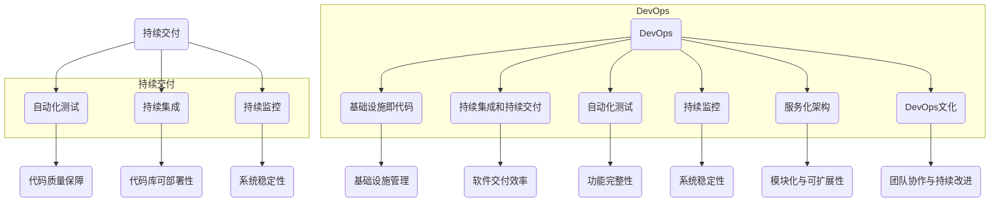

                 

## 程序员创业公司的持续交付与DevOps实践

> **关键词：** 持续交付、DevOps、程序员创业公司、持续集成、自动化测试、容器化、云原生、微服务架构

> **摘要：** 本文将探讨程序员创业公司如何通过实施持续交付（CI/CD）和DevOps实践，提高软件交付的效率和质量。文章首先介绍了持续交付和DevOps的基本概念，然后深入分析了其核心原理、工具选择和具体实施步骤。通过实际项目案例分析，读者可以了解到如何在创业公司中落地DevOps，从而提升产品竞争力。

持续交付（Continuous Delivery，简称CD）和DevOps是一种现代化的软件开发和运维理念，旨在通过持续集成（Continuous Integration，简称CI）、自动化测试、持续监控等手段，实现软件的高效、快速迭代和可靠交付。在程序员创业公司中，这种实践方式尤为重要，因为它能够帮助创业团队在激烈的市场竞争中保持优势。

本文将围绕以下几个关键问题展开讨论：

1. 持续交付和DevOps的基本概念和原理是什么？
2. 创业公司如何选择适合的DevOps工具和框架？
3. 持续交付和DevOps的具体实施步骤有哪些？
4. 实际项目案例中，创业公司如何落地DevOps实践？
5. DevOps在未来有哪些发展趋势和挑战？

通过本文的阅读，读者将能够系统地了解持续交付和DevOps的核心概念和实践方法，为创业公司的软件交付流程优化提供有力支持。

## 1. 背景介绍

### 1.1 目的和范围

本文的主要目的是为程序员创业公司提供一个关于持续交付（CI/CD）和DevOps实践的系统指南。文章将涵盖以下内容：

- **持续交付和DevOps的概念与原理：** 深入介绍持续交付和DevOps的定义、目标及其在软件开发和运维中的重要性。
- **核心工具与框架选择：** 分析创业公司适用的DevOps工具和框架，包括容器化技术、云原生架构、持续集成服务器、自动化测试工具等。
- **实施步骤与最佳实践：** 提供详细的实施步骤和最佳实践，帮助创业公司逐步实现持续交付和DevOps。
- **实际项目案例分析：** 通过真实项目案例展示如何在实际创业公司中落地DevOps实践。
- **未来趋势与挑战：** 探讨DevOps在未来可能面临的发展趋势和挑战，为创业公司提供持续优化和改进的方向。

### 1.2 预期读者

本文适用于以下读者群体：

- **程序员创业团队领导者：** 对DevOps和持续交付有一定了解，希望系统学习和应用相关技术的团队领导者。
- **软件工程师和运维工程师：** 想要深入了解持续交付和DevOps原理，提升软件交付效率的技术人员。
- **产品经理和项目经理：** 想要掌握DevOps实践，更好地推动项目成功交付的相关人员。
- **对DevOps感兴趣的技术爱好者：** 希望通过本文了解DevOps的基本概念和实践方法，为个人职业发展提供指导。

### 1.3 文档结构概述

本文将按照以下结构展开：

- **第一章：背景介绍**：介绍本文的目的、预期读者和文档结构。
- **第二章：核心概念与联系**：分析持续交付和DevOps的核心概念及其相互联系。
- **第三章：核心算法原理 & 具体操作步骤**：讲解持续交付和DevOps的核心算法原理和具体实施步骤。
- **第四章：数学模型和公式 & 详细讲解 & 举例说明**：介绍相关数学模型和公式，并通过实际案例进行详细讲解。
- **第五章：项目实战：代码实际案例和详细解释说明**：通过实际项目案例展示DevOps实践。
- **第六章：实际应用场景**：探讨DevOps在不同场景中的应用。
- **第七章：工具和资源推荐**：推荐学习资源、开发工具和框架。
- **第八章：总结：未来发展趋势与挑战**：总结文章主要内容，展望未来发展趋势和挑战。
- **第九章：附录：常见问题与解答**：回答读者可能遇到的常见问题。
- **第十章：扩展阅读 & 参考资料**：提供进一步学习和参考的资源。

### 1.4 术语表

#### 1.4.1 核心术语定义

- **持续交付（Continuous Delivery，简称CD）：** 一种软件开发和运维实践，旨在实现软件的快速、可靠交付，通过自动化测试和持续集成确保代码质量。
- **持续集成（Continuous Integration，简称CI）：** 一种软件开发方法，通过频繁的代码合并和自动化测试，确保代码库中的代码始终处于可部署状态。
- **DevOps：** 一种软件开发和运维的融合理念，强调开发（Development）和运维（Operations）团队的紧密协作，实现软件的高效交付和维护。
- **容器化（Containerization）：** 将应用程序及其依赖环境打包成容器，实现应用程序在不同环境中的隔离和一致性。
- **云原生（Cloud Native）：** 一种基于云计算的应用程序开发方法，利用云环境提供的动态资源管理、自动伸缩和服务化特性，构建灵活、可扩展的应用程序。
- **微服务架构（Microservices Architecture）：** 一种将大型应用程序拆分成多个小型服务，每个服务独立开发、部署和扩展的架构风格。

#### 1.4.2 相关概念解释

- **基础设施即代码（Infrastructure as Code，简称IaC）：** 通过代码来管理基础设施资源，实现基础设施的自动化部署和管理。
- **自动化测试：** 使用自动化工具对软件进行测试，确保代码质量和功能完整性。
- **容器编排（Container Orchestration）：** 管理容器化应用程序的生命周期，包括容器的部署、扩展、监控和自动化运维。
- **持续监控（Continuous Monitoring）：** 对软件系统进行实时监控，及时发现和解决潜在问题，确保系统稳定运行。

#### 1.4.3 缩略词列表

- **CI/CD：** 持续集成/持续交付（Continuous Integration/Continuous Deployment）
- **IaC：** 基础设施即代码（Infrastructure as Code）
- **SRE：** 运维工程学（Site Reliability Engineering）
- **Kubernetes：** 一个开源的容器编排平台，用于自动化容器化应用程序的部署、扩展和管理。
- **Docker：** 一种流行的容器化技术，用于将应用程序及其依赖环境打包成容器。

## 2. 核心概念与联系

### 2.1 持续交付（CD）的核心概念与原理

持续交付（Continuous Delivery，简称CD）是一种软件开发和运维实践，旨在实现软件的快速、可靠交付。其核心概念和原理如下：

1. **自动化测试：** 通过自动化测试工具对代码进行持续测试，确保代码质量。自动化测试包括单元测试、集成测试、功能测试等，旨在发现和修复缺陷，确保代码库中的代码始终处于可部署状态。

2. **持续集成（CI）：** 持续集成是一种软件开发方法，通过频繁的代码合并和自动化测试，确保代码库中的代码始终处于可部署状态。CI服务器负责触发构建、测试和部署流程，确保每次代码变更都能及时得到反馈。

3. **版本控制：** 使用版本控制系统（如Git）管理代码，确保代码变更的可追溯性和协作开发。

4. **自动化部署：** 使用自动化工具（如Jenkins、GitLab CI等）实现代码的自动化部署，确保软件的高效交付。自动化部署包括构建、测试、部署和回滚等环节，通过脚本或配置文件实现自动化操作。

5. **持续监控：** 对部署的软件系统进行实时监控，及时发现和解决潜在问题，确保系统稳定运行。持续监控包括性能监控、错误日志分析、用户反馈等。

### 2.2 DevOps的核心概念与原理

DevOps是一种软件开发和运维的融合理念，强调开发（Development）和运维（Operations）团队的紧密协作，实现软件的高效交付和维护。其核心概念和原理如下：

1. **基础设施即代码（IaC）：** 通过代码来管理基础设施资源，实现基础设施的自动化部署和管理。IaC工具（如Terraform、Ansible等）可以将基础设施配置定义为代码，确保基础设施的一致性和可重复性。

2. **持续集成（CI）和持续交付（CD）：** 通过持续集成和持续交付实践，确保代码库中的代码始终处于可部署状态，提高软件交付效率和质量。

3. **自动化测试：** 通过自动化测试工具对软件进行持续测试，确保代码质量和功能完整性。

4. **持续监控：** 对软件系统进行实时监控，及时发现和解决潜在问题，确保系统稳定运行。

5. **服务化架构：** 通过微服务架构和服务网格等技术，实现应用程序的模块化和松耦合，提高系统的可扩展性和可维护性。

6. **DevOps文化：** 强调跨部门协作、沟通和信任，培养以客户为中心、持续学习和改进的团队文化。

### 2.3 持续交付与DevOps的联系

持续交付和DevOps是相互关联、互为补充的两个概念。持续交付是DevOps实践的一部分，而DevOps为持续交付提供了更为全面的支持和保障。

1. **共同目标：** 持续交付和DevOps的共同目标是实现软件的快速、可靠交付。持续交付通过自动化测试、持续集成和持续监控等手段，确保代码库中的代码始终处于可部署状态。DevOps则通过基础设施即代码、自动化测试、持续监控等实践，进一步优化软件交付流程。

2. **紧密协作：** DevOps强调开发团队和运维团队的紧密协作，持续交付则是实现这种协作的关键手段。通过持续交付，开发团队和运维团队可以实时沟通、快速响应和协同工作，确保软件交付的高效性和稳定性。

3. **工具整合：** 持续交付和DevOps都依赖于一系列工具和框架的支持。持续交付常用的工具有Jenkins、GitLab CI等，而DevOps则涉及到更广泛的技术栈，包括容器化技术、云原生架构、服务网格等。

4. **持续改进：** 持续交付和DevOps都强调持续改进和优化，通过反馈机制、迭代开发和自动化实践，不断提高软件交付的质量和效率。

### 2.4 核心概念原理的Mermaid流程图

下面是持续交付和DevOps核心概念原理的Mermaid流程图：



## 3. 核心算法原理 & 具体操作步骤

### 3.1 持续交付的核心算法原理

持续交付（CD）的核心算法原理主要包括以下几个方面：

1. **版本控制算法：** 通过版本控制系统（如Git）管理代码，实现代码变更的版本控制和协作开发。版本控制算法确保代码的变更可追溯，提高代码库的稳定性和可靠性。

2. **自动化测试算法：** 通过自动化测试工具（如JUnit、Selenium等）对代码进行持续测试，检测代码质量和功能完整性。自动化测试算法包括单元测试、集成测试、功能测试等，确保每次代码变更都能及时得到反馈。

3. **持续集成算法：** 通过持续集成服务器（如Jenkins、GitLab CI等）实现代码的自动化构建、测试和部署。持续集成算法确保每次代码合并后，代码库中的代码始终处于可部署状态，提高软件交付的效率和质量。

4. **自动化部署算法：** 通过自动化工具（如Docker、Kubernetes等）实现代码的自动化部署。自动化部署算法包括构建、测试、部署和回滚等环节，确保软件的高效交付。

5. **持续监控算法：** 对部署的软件系统进行实时监控，包括性能监控、错误日志分析、用户反馈等。持续监控算法确保系统稳定运行，及时发现和解决潜在问题。

### 3.2 持续交付的具体操作步骤

以下是持续交付的具体操作步骤：

#### 步骤1：设置版本控制系统

- **创建代码仓库：** 在Git平台（如GitHub、GitLab等）创建项目仓库，用于存储和管理代码。
- **配置Git：** 配置Git，包括用户信息、SSH密钥等，确保团队协作顺畅。

#### 步骤2：编写自动化测试脚本

- **编写单元测试：** 根据项目需求，编写单元测试脚本，测试代码的功能和性能。
- **编写集成测试：** 在单元测试的基础上，编写集成测试脚本，测试代码模块之间的交互和集成。

#### 步骤3：配置持续集成服务器

- **选择CI服务器：** 根据团队需求和预算，选择合适的CI服务器（如Jenkins、GitLab CI等）。
- **配置CI服务器：** 配置CI服务器，包括代码仓库的链接、构建脚本、测试脚本等。
- **设置触发规则：** 配置触发规则，确保每次代码变更都能触发构建和测试流程。

#### 步骤4：实现自动化部署

- **容器化应用程序：** 使用Docker将应用程序及其依赖环境打包成容器，实现应用程序的隔离和一致性。
- **配置Kubernetes：** 使用Kubernetes进行容器编排，管理容器的部署、扩展和监控。
- **编写部署脚本：** 编写部署脚本，实现应用程序的自动化部署。

#### 步骤5：持续监控与优化

- **配置监控工具：** 使用监控工具（如Prometheus、Grafana等）对系统进行性能监控和错误日志分析。
- **收集用户反馈：** 通过用户反馈收集系统使用情况，优化系统性能和功能。

### 3.3 DevOps的核心算法原理

DevOps的核心算法原理主要包括以下几个方面：

1. **基础设施即代码（IaC）：** 使用IaC工具（如Terraform、Ansible等）将基础设施配置定义为代码，实现基础设施的自动化部署和管理。

2. **容器编排：** 使用容器编排工具（如Kubernetes）进行容器化应用程序的生命周期管理，包括容器的部署、扩展、监控和自动化运维。

3. **服务网格：** 使用服务网格（如Istio、Linkerd等）实现微服务之间的通信和流量管理，提高系统的模块化和可扩展性。

4. **持续监控：** 使用持续监控工具（如Prometheus、Grafana等）对系统进行实时监控，确保系统稳定运行。

5. **故障恢复：** 通过故障恢复机制（如自动回滚、故障转移等）确保系统在故障情况下快速恢复。

### 3.4 DevOps的具体操作步骤

以下是DevOps的具体操作步骤：

#### 步骤1：基础设施即代码

- **选择IaC工具：** 根据团队需求和预算，选择合适的IaC工具（如Terraform、Ansible等）。
- **编写基础设施配置代码：** 使用所选IaC工具编写基础设施配置代码，定义所需的基础设施资源。

#### 步骤2：容器化应用程序

- **选择容器化工具：** 根据项目需求，选择合适的容器化工具（如Docker）。
- **编写Dockerfile：** 使用Dockerfile将应用程序及其依赖环境打包成容器镜像。
- **构建容器镜像：** 使用所选容器化工具构建容器镜像，并推送到容器镜像仓库。

#### 步骤3：配置Kubernetes

- **安装Kubernetes集群：** 安装Kubernetes集群，并配置集群的节点。
- **编写Kubernetes配置文件：** 编写Kubernetes配置文件，定义所需的容器化应用程序部署。

#### 步骤4：服务网格

- **选择服务网格工具：** 根据项目需求，选择合适的服务网格工具（如Istio、Linkerd等）。
- **配置服务网格：** 配置服务网格，实现微服务之间的通信和流量管理。

#### 步骤5：持续监控

- **选择监控工具：** 根据项目需求，选择合适的监控工具（如Prometheus、Grafana等）。
- **配置监控：** 配置监控工具，对系统进行实时监控，收集性能数据和错误日志。

#### 步骤6：故障恢复

- **配置故障恢复机制：** 配置自动回滚、故障转移等故障恢复机制，确保系统在故障情况下快速恢复。

## 4. 数学模型和公式 & 详细讲解 & 举例说明

### 4.1 数学模型和公式的详细讲解

在DevOps和持续交付的实践中，我们经常使用一些数学模型和公式来评估系统的性能、稳定性和可靠性。以下是一些常见的数学模型和公式，以及它们的详细讲解：

#### 4.1.1 回归模型

回归模型是一种用于预测变量之间关系的统计模型。在DevOps和持续交付中，回归模型可以用来预测系统在特定负载下的性能表现。

- **公式：**
  $$ y = \beta_0 + \beta_1x_1 + \beta_2x_2 + ... + \beta_nx_n $$

- **解释：**
  - $y$：预测值
  - $\beta_0$：常数项
  - $\beta_1, \beta_2, ..., \beta_n$：系数
  - $x_1, x_2, ..., x_n$：自变量

回归模型可以通过最小二乘法进行参数估计，从而预测系统在特定负载下的性能表现。

#### 4.1.2 概率模型

概率模型是一种用于描述随机事件发生概率的数学模型。在DevOps和持续交付中，概率模型可以用来评估系统的稳定性和可靠性。

- **公式：**
  $$ P(A) = \frac{N(A)}{N(S)} $$

- **解释：**
  - $P(A)$：事件A发生的概率
  - $N(A)$：事件A发生的次数
  - $N(S)$：总次数

概率模型可以帮助我们评估系统在长时间运行过程中发生特定问题的概率。

#### 4.1.3 性能模型

性能模型是一种用于描述系统性能的数学模型。在DevOps和持续交付中，性能模型可以用来评估系统的响应时间、吞吐量和资源利用率。

- **公式：**
  $$ Throughput = \frac{1}{Response Time} $$

- **解释：**
  - Throughput：系统的吞吐量
  - Response Time：系统的响应时间

通过性能模型，我们可以评估系统在不同负载下的性能表现，从而进行性能优化。

### 4.2 数学模型和公式的举例说明

下面我们将通过一个简单的例子来说明这些数学模型和公式的应用。

#### 4.2.1 回归模型举例

假设我们想预测一个持续交付系统在负载增加时，其响应时间的变化。我们收集了以下数据：

- **负载（x）：** 10, 20, 30, 40, 50
- **响应时间（y）：** 100, 120, 150, 180, 200

我们可以使用回归模型来预测响应时间与负载之间的关系。通过最小二乘法，我们得到以下回归方程：

$$ y = 50 + 0.5x $$

当负载增加到40时，我们可以预测响应时间为：

$$ y = 50 + 0.5 \times 40 = 90 $$

这意味着在负载增加到40时，响应时间预计为90毫秒。

#### 4.2.2 概率模型举例

假设我们想评估一个持续交付系统在100次运行中发生错误的概率。我们记录了以下数据：

- **错误次数（N(A)）：** 5
- **总次数（N(S)）：** 100

使用概率模型，我们得到错误发生的概率为：

$$ P(A) = \frac{5}{100} = 0.05 $$

这意味着在100次运行中，错误发生的概率为5%。

#### 4.2.3 性能模型举例

假设我们想评估一个持续交付系统在不同负载下的性能表现。我们收集了以下数据：

- **负载（x）：** 10, 20, 30, 40, 50
- **响应时间（y）：** 100, 120, 150, 180, 200

通过计算吞吐量，我们可以得到以下结果：

$$ Throughput = \frac{1}{100 + 120 + 150 + 180 + 200} \approx 0.0046 $$

这意味着在当前负载下，系统的平均吞吐量为0.0046次/秒。通过调整系统配置，我们可以优化吞吐量，从而提高系统的性能。

### 4.3 数学模型和公式在实际项目中的应用

在DevOps和持续交付的实际项目中，数学模型和公式可以帮助我们进行性能评估、错误分析和优化。以下是一些实际应用场景：

1. **性能评估：** 使用性能模型评估系统在不同负载下的响应时间、吞吐量和资源利用率，为系统优化提供依据。
2. **错误分析：** 使用概率模型评估系统在长时间运行过程中发生错误的概率，为系统稳定性优化提供指导。
3. **资源分配：** 使用回归模型预测系统在不同负载下的资源需求，为资源分配提供参考。
4. **故障恢复：** 使用故障恢复机制，根据系统的性能模型和概率模型，制定故障恢复策略，确保系统在故障情况下快速恢复。

通过数学模型和公式的应用，我们可以更好地评估和优化持续交付系统的性能、稳定性和可靠性，从而提高软件交付的效率和质量。

## 5. 项目实战：代码实际案例和详细解释说明

### 5.1 开发环境搭建

在进行持续交付和DevOps实践之前，我们需要搭建一个稳定、高效的开发环境。以下是一个简单的开发环境搭建步骤：

1. **安装操作系统：** 选择合适的操作系统（如Ubuntu 18.04）进行安装。
2. **安装开发工具：** 安装Java开发工具包（JDK）、版本控制系统（如Git）、代码编辑器（如Visual Studio Code）等。
3. **安装数据库：** 根据项目需求安装关系型数据库（如MySQL）或非关系型数据库（如MongoDB）。
4. **安装持续集成工具：** 安装Jenkins或GitLab CI，用于自动化构建和测试。
5. **安装容器化工具：** 安装Docker，用于容器化应用程序。

### 5.2 源代码详细实现和代码解读

假设我们正在开发一个简单的Web应用程序，其功能包括用户注册、登录和查看个人信息。以下是一个简单的源代码实现和代码解读：

#### 5.2.1 用户注册功能

```java
public class UserController {
  
  // 用户注册接口
  @PostMapping("/register")
  public ResponseEntity<?> registerUser(@RequestBody UserRegistrationRequest request) {
    // 验证用户输入
    if (request.getUsername().isEmpty() || request.getPassword().isEmpty()) {
      return ResponseEntity.badRequest().body("用户名或密码不能为空");
    }
    
    // 查询数据库，检查用户名是否已存在
    Optional<User> userOptional = userRepository.findByUsername(request.getUsername());
    if (userOptional.isPresent()) {
      return ResponseEntity.badRequest().body("用户名已存在");
    }
    
    // 创建用户并保存到数据库
    User user = new User();
    user.setUsername(request.getUsername());
    user.setPassword(passwordEncoder.encode(request.getPassword()));
    userRepository.save(user);
    
    return ResponseEntity.ok("用户注册成功");
  }
}
```

**代码解读：**
- `UserController` 类：负责处理用户相关的请求。
- `registerUser` 方法：处理用户注册请求，包括验证用户输入、查询数据库和保存用户信息。
- `UserRegistrationRequest` 类：用于接收用户注册请求的参数。
- `userRepository`：用于与数据库进行交互的实体。

#### 5.2.2 用户登录功能

```java
public class UserController {
  
  // 用户登录接口
  @PostMapping("/login")
  public ResponseEntity<?> loginUser(@RequestBody UserLoginRequest request) {
    // 验证用户输入
    if (request.getUsername().isEmpty() || request.getPassword().isEmpty()) {
      return ResponseEntity.badRequest().body("用户名或密码不能为空");
    }
    
    // 查询数据库，检查用户名和密码是否匹配
    Optional<User> userOptional = userRepository.findByUsername(request.getUsername());
    if (!userOptional.isPresent() || !passwordEncoder.matches(request.getPassword(), userOptional.get().getPassword())) {
      return ResponseEntity.badRequest().body("用户名或密码错误");
    }
    
    // 登录成功，生成JWT令牌
    String token = jwtTokenProvider.generateToken(userOptional.get().getUsername());
    return ResponseEntity.ok(new UserLoginResponse(token));
  }
}
```

**代码解读：**
- `UserController` 类：负责处理用户相关的请求。
- `loginUser` 方法：处理用户登录请求，包括验证用户输入、查询数据库和生成JWT令牌。
- `UserLoginRequest` 类：用于接收用户登录请求的参数。
- `UserLoginResponse` 类：用于返回登录成功的结果。
- `userRepository`：用于与数据库进行交互的实体。
- `passwordEncoder`：用于加密用户密码。
- `jwtTokenProvider`：用于生成JWT令牌。

#### 5.2.3 查看个人信息功能

```java
public class UserController {
  
  // 查看个人信息接口
  @GetMapping("/profile")
  public ResponseEntity<?> getUserProfile(@RequestHeader("Authorization") String token) {
    // 验证JWT令牌
    String username = jwtTokenProvider.validateToken(token);
    if (username == null) {
      return ResponseEntity.badRequest().body("无效的令牌");
    }
    
    // 查询数据库，获取用户信息
    Optional<User> userOptional = userRepository.findByUsername(username);
    if (!userOptional.isPresent()) {
      return ResponseEntity.badRequest().body("用户不存在");
    }
    
    return ResponseEntity.ok(userOptional.get());
  }
}
```

**代码解读：**
- `UserController` 类：负责处理用户相关的请求。
- `getUserProfile` 方法：处理查看个人信息请求，包括验证JWT令牌、查询数据库和返回用户信息。
- `userRepository`：用于与数据库进行交互的实体。
- `jwtTokenProvider`：用于生成和验证JWT令牌。

### 5.3 代码解读与分析

在上述代码实现中，我们使用了Spring Boot框架来简化Web应用程序的开发。以下是代码解读和分析：

1. **分层架构：** 代码遵循分层架构，包括Controller层、Service层和Repository层，便于代码的维护和扩展。
2. **RESTful接口：** 使用RESTful接口设计，方便前端调用。
3. **数据验证：** 在接口处理方法中，对用户输入进行验证，确保数据的有效性和安全性。
4. **JWT令牌认证：** 使用JWT令牌进行认证，确保用户请求的安全性。
5. **数据库交互：** 使用Spring Data JPA进行数据库交互，简化数据访问层代码。
6. **日志记录：** 使用日志框架（如Logback）记录请求和异常日志，便于调试和问题定位。

通过上述代码实现，我们实现了用户注册、登录和查看个人信息等功能，并采用持续交付和DevOps实践进行部署和运维。在开发过程中，我们遵循了最佳实践，确保代码的质量和可维护性。

## 6. 实际应用场景

### 6.1 客户端应用

在客户端应用领域，持续交付和DevOps实践可以显著提高软件交付的效率和质量。以下是一个实际应用场景：

**案例：** 一家移动应用开发公司，开发了一款社交应用，需要不断更新和优化功能，以保持竞争力。该公司采用持续交付和DevOps实践，实现了以下目标：

- **快速迭代：** 通过持续交付，每次功能更新都可以在短时间内完成开发和部署，确保用户能够及时体验到新功能。
- **自动化测试：** 使用自动化测试工具，对每次功能更新进行全面测试，确保新功能的质量和稳定性。
- **故障恢复：** 通过故障恢复机制，如自动回滚和故障转移，确保在出现问题时，应用能够快速恢复。
- **资源优化：** 通过容器化和云原生架构，实现应用的动态扩容和资源优化，提高系统性能和可扩展性。

### 6.2 后端服务

在后端服务领域，持续交付和DevOps实践可以帮助企业提高服务质量和响应速度。以下是一个实际应用场景：

**案例：** 一家电商平台，其后端服务需要处理大量订单和用户请求。通过实施持续交付和DevOps实践，该公司实现了以下目标：

- **高可用性：** 通过容器化和Kubernetes，实现后端服务的自动化部署、扩展和故障恢复，确保系统的高可用性。
- **性能优化：** 通过持续监控和性能测试，识别系统瓶颈和性能问题，并进行优化。
- **安全性：** 通过自动化测试和安全审计，确保后端服务的安全性，防止潜在的安全漏洞。
- **持续改进：** 通过收集用户反馈和性能数据，持续优化后端服务，提高用户体验。

### 6.3 物联网应用

在物联网（IoT）领域，持续交付和DevOps实践可以帮助企业快速开发和部署物联网应用，实现设备管理和数据采集。以下是一个实际应用场景：

**案例：** 一家物联网设备制造商，需要开发一款智能家居控制应用，连接和控制家中的智能设备。通过实施持续交付和DevOps实践，该公司实现了以下目标：

- **快速迭代：** 通过持续交付，实现智能家居控制应用的快速迭代，及时响应用户需求和反馈。
- **自动化部署：** 通过容器化和Kubernetes，实现应用的自动化部署和扩展，提高部署效率。
- **数据采集：** 通过物联网设备的数据采集和监控，实现设备的实时状态监控和故障诊断。
- **安全性：** 通过自动化测试和安全审计，确保物联网应用和设备的安全性，防止潜在的安全威胁。

### 6.4 大数据分析

在大数据分析领域，持续交付和DevOps实践可以帮助企业高效处理海量数据，实现实时分析和预测。以下是一个实际应用场景：

**案例：** 一家互联网公司，负责处理大量用户行为数据，进行大数据分析，为用户推荐个性化内容。通过实施持续交付和DevOps实践，该公司实现了以下目标：

- **数据处理：** 通过大数据平台（如Hadoop、Spark等）实现海量数据的高效处理和存储。
- **实时分析：** 通过实时数据处理和流处理技术，实现用户行为的实时分析。
- **数据可视化：** 通过数据可视化工具，将分析结果以直观的方式展示给用户。
- **持续优化：** 通过持续监控和性能测试，优化大数据处理和分析流程，提高系统性能和稳定性。

通过以上实际应用场景，我们可以看到持续交付和DevOps实践在各个领域的重要性和实际效果。这些实践不仅提高了软件交付的效率和质量，还为企业带来了持续改进和创新的机会。

## 7. 工具和资源推荐

### 7.1 学习资源推荐

为了更好地掌握持续交付和DevOps实践，以下是一些建议的学习资源：

#### 7.1.1 书籍推荐

1. **《持续交付：软件交付和DevOps实践》**
   - 作者：Jez Humble, David Farley
   - 简介：这是一本经典著作，详细介绍了持续交付和DevOps的核心概念、工具和方法，适合初学者和有经验的从业者。

2. **《DevOps实践指南：构建高效、敏捷、安全的软件交付体系》**
   - 作者：James W. Thomas
   - 简介：本书从实战角度出发，讲解了DevOps的核心原则和实践方法，包括持续交付、自动化测试、基础设施即代码等。

3. **《容器化与Kubernetes实战》**
   - 作者：Kelsey Hightower, Brendan Burns, Joe Beda
   - 简介：这本书深入讲解了容器化和Kubernetes的基本概念、部署方法和最佳实践，是学习容器技术的必备书籍。

#### 7.1.2 在线课程

1. **《DevOps基础与实战》**
   - 提供平台：网易云课堂、Coursera
   - 简介：这门课程涵盖了DevOps的核心概念、工具和实战方法，适合初学者和有经验的技术人员。

2. **《容器化与Kubernetes实战》**
   - 提供平台：网易云课堂、Coursera
   - 简介：这门课程深入讲解了容器化和Kubernetes的基本概念、部署方法和最佳实践，是学习容器技术的理想选择。

3. **《持续交付与自动化测试》**
   - 提供平台：网易云课堂、Coursera
   - 简介：这门课程介绍了持续交付和自动化测试的核心概念、工具和最佳实践，适合希望提升软件交付效率的技术人员。

#### 7.1.3 技术博客和网站

1. **《DevOps中国》**
   - 网站：https://devops.cn/
   - 简介：这是一个专注于DevOps实践和技术的中文网站，提供丰富的学习资源和实践案例。

2. **《持续交付社区》**
   - 网站：https://cdcommunity.com/
   - 简介：这是一个专注于持续交付和DevOps实践的全球社区，提供最新的技术动态和实践经验。

3. **《Kubernetes中文社区》**
   - 网站：https://k8s.cn/
   - 简介：这是一个专注于Kubernetes容器技术的中文社区，提供丰富的Kubernetes学习资源和实战案例。

### 7.2 开发工具框架推荐

为了在实际项目中高效实施持续交付和DevOps实践，以下是一些常用的开发工具和框架：

#### 7.2.1 IDE和编辑器

1. **Visual Studio Code**
   - 简介：一款强大的开源代码编辑器，支持多种编程语言，提供了丰富的插件和扩展，适合进行持续交付和DevOps实践。

2. **IntelliJ IDEA**
   - 简介：一款功能强大的集成开发环境，支持Java、Python、JavaScript等多种编程语言，提供了强大的代码编辑、调试和性能分析功能。

3. **Sublime Text**
   - 简介：一款轻量级的文本编辑器，适用于各种编程语言，支持自定义快捷键和插件，适合进行快速开发和调试。

#### 7.2.2 调试和性能分析工具

1. **JProfiler**
   - 简介：一款强大的Java应用性能分析工具，提供了详细的性能数据、内存泄漏检测和代码调试功能。

2. **Grafana**
   - 简介：一款开源的数据可视化工具，支持多种数据源，可以实时监控和分析系统性能，帮助发现潜在的性能瓶颈。

3. **Prometheus**
   - 简介：一款开源的监控告警工具，支持多种数据源，可以实时收集和分析系统性能指标，提供强大的告警和管理功能。

#### 7.2.3 相关框架和库

1. **Spring Boot**
   - 简介：一款开源的Java框架，简化了Spring应用的创建和部署，支持持续交付和DevOps实践。

2. **Docker**
   - 简介：一款开源的容器化技术，可以将应用程序及其依赖环境打包成容器，实现应用程序的隔离和一致性。

3. **Kubernetes**
   - 简介：一款开源的容器编排平台，用于自动化容器化应用程序的部署、扩展和管理，是实现DevOps实践的关键工具。

4. **Jenkins**
   - 简介：一款开源的持续集成和持续交付工具，支持多种插件和扩展，可以轻松实现自动化构建、测试和部署。

通过以上工具和资源的推荐，可以帮助程序员创业公司更好地掌握持续交付和DevOps实践，提高软件交付的效率和质量。

## 8. 总结：未来发展趋势与挑战

### 8.1 未来发展趋势

随着技术的不断进步和市场竞争的加剧，持续交付（CI/CD）和DevOps实践在未来将继续发展，并呈现出以下趋势：

1. **云原生应用的普及：** 云原生技术（如Kubernetes、Istio等）将更加普及，企业将逐渐将应用程序迁移到云原生平台，实现更高的可扩展性和灵活性。

2. **自动化程度的提高：** 自动化将继续成为持续交付和DevOps的核心，从基础设施的自动化部署到应用程序的自动化测试和监控，自动化程度将不断提高。

3. **微服务架构的推广：** 微服务架构将继续成为软件开发的主流，企业将逐步拆分大型单体应用程序为小型、独立的服务，实现更灵活的开发和部署。

4. **AI与机器学习的融合：** 人工智能和机器学习技术将更多地应用于持续交付和DevOps实践，通过智能算法优化自动化流程，提高系统的可靠性和效率。

5. **安全性的重视：** 安全性将成为持续交付和DevOps实践的一个重要方面，企业将加大对安全测试、漏洞扫描和安全审计的投入，确保软件交付过程的安全性。

### 8.2 未来挑战

尽管持续交付和DevOps实践带来了诸多好处，但在实际应用中仍然面临以下挑战：

1. **组织文化变革：** 实施DevOps需要企业内部各部门的紧密协作和信任，这要求企业进行文化变革，打破传统的组织壁垒，实现跨部门的协作。

2. **技能和人才短缺：** 持续交付和DevOps实践需要具备多方面技能的人才，包括开发、运维、测试等，但当前市场对这类人才的需求远大于供应。

3. **工具和平台的选择：** 在众多持续交付和DevOps工具和平台中，企业需要选择最适合自己需求的工具和平台，这需要投入大量的时间和精力进行评估和选择。

4. **安全风险：** 在自动化过程中，可能会引入新的安全风险，如自动化测试工具的漏洞、容器镜像的安全性等，企业需要加强对安全风险的识别和防范。

5. **成本和资源限制：** 实施持续交付和DevOps实践需要一定的成本和资源投入，尤其是对于小型创业公司，如何在有限的资源和成本下实现高效的持续交付和DevOps实践，是一个重要挑战。

### 8.3 应对策略

为了应对上述挑战，企业可以采取以下策略：

1. **培养企业文化：** 通过内部培训和沟通，培养以客户为中心、持续学习和改进的团队文化，促进跨部门协作。

2. **人才引进和培养：** 通过招聘和培养具有多方面技能的人才，提高团队的技能水平和专业素养，应对技能短缺问题。

3. **工具评估和选型：** 在选择持续交付和DevOps工具和平台时，要进行充分的评估和选型，确保所选工具和平台能够满足企业的实际需求。

4. **安全防护和审计：** 加强对自动化流程的安全防护和审计，确保系统在自动化过程中不会引入新的安全风险。

5. **合理分配资源：** 在有限的资源和成本下，合理规划和分配资源，优先考虑对业务影响最大的项目进行持续交付和DevOps实践。

通过以上策略，企业可以更好地应对持续交付和DevOps实践中的挑战，实现软件交付的效率和质量提升。

## 9. 附录：常见问题与解答

### 9.1 持续交付和DevOps的区别

**Q：持续交付和DevOps有什么区别？**

A：持续交付（Continuous Delivery，简称CD）和DevOps是密切相关的概念，但它们有所区别：

- **持续交付：** 持续交付是一种软件开发和运维实践，旨在实现软件的快速、可靠交付。它包括自动化测试、持续集成和自动化部署等过程，确保代码库中的代码始终处于可部署状态。

- **DevOps：** DevOps是一种软件开发和运维的融合理念，强调开发（Development）和运维（Operations）团队的紧密协作，通过自动化、持续集成和持续交付等手段，实现软件的高效交付和维护。

简而言之，持续交付是一种具体实践，而DevOps是一种文化和方法论，它涵盖了持续交付在内的多种实践。

### 9.2 持续交付的好处

**Q：持续交付有哪些好处？**

A：持续交付的好处包括：

- **提高交付速度：** 通过自动化测试、持续集成和自动化部署，缩短了软件交付周期，加快了新功能上线的时间。
- **提高代码质量：** 自动化测试确保每次代码变更都能及时检测和修复缺陷，提高了代码质量。
- **降低风险：** 通过持续监控和快速反馈，可以及时发现和解决问题，降低软件交付过程中的风险。
- **增强团队协作：** 持续交付促进了开发团队和运维团队的紧密协作，提高了团队的整体效率。
- **提高客户满意度：** 快速、可靠的软件交付可以更好地满足客户需求，提高客户满意度。

### 9.3 DevOps的好处

**Q：DevOps有哪些好处？**

A：DevOps的好处包括：

- **提高交付效率：** 通过自动化、持续集成和持续交付，实现快速、可靠的软件交付。
- **降低成本：** 通过优化资源使用和流程，降低开发和运维成本。
- **提高系统稳定性：** 通过持续监控和故障恢复，确保系统在故障情况下快速恢复。
- **增强团队协作：** DevOps强调跨部门的协作和沟通，提高了团队的整体效率。
- **提高客户满意度：** 高效、稳定的软件交付可以更好地满足客户需求，提高客户满意度。

### 9.4 实施持续交付和DevOps的步骤

**Q：如何实施持续交付和DevOps？**

A：实施持续交付和DevOps的步骤如下：

1. **确定目标和范围：** 明确实施持续交付和DevOps的目标和范围，制定具体的实施计划。
2. **评估现有流程：** 评估现有软件开发和运维流程，识别存在的问题和改进点。
3. **培养团队文化：** 培养以客户为中心、持续学习和改进的团队文化，促进跨部门协作。
4. **选择合适的工具：** 选择适合团队的持续交付和DevOps工具，如Jenkins、GitLab CI、Docker、Kubernetes等。
5. **制定自动化策略：** 制定自动化测试、持续集成和自动化部署的策略，确保代码库中的代码始终处于可部署状态。
6. **实施和优化：** 根据实施计划，逐步实施持续交付和DevOps实践，并持续优化。
7. **持续监控和改进：** 通过持续监控和反馈机制，及时发现和解决问题，不断优化软件交付流程。

### 9.5 实施DevOps所需技能

**Q：实施DevOps需要哪些技能？**

A：实施DevOps需要以下技能：

- **开发技能：** 熟悉编程语言（如Java、Python、JavaScript等），掌握软件开发的基本原理和方法。
- **运维技能：** 熟悉Linux系统管理、网络配置、数据库管理等运维技能。
- **自动化技能：** 熟悉持续集成和持续交付工具（如Jenkins、GitLab CI等），掌握自动化测试和脚本编写技能。
- **沟通协作能力：** 具有良好的沟通协作能力，能够与团队成员和跨部门同事有效沟通。
- **持续学习：** 能够持续学习新技术和新方法，不断提升自己的技能和知识。

通过以上常见问题与解答，希望能够帮助读者更好地理解持续交付和DevOps实践，并在实际工作中有效实施。

## 10. 扩展阅读 & 参考资料

### 10.1 经典书籍推荐

1. **《持续交付：软件交付和DevOps实践》**
   - 作者：Jez Humble, David Farley
   - 简介：这本书详细介绍了持续交付和DevOps的核心概念、工具和方法，适合初学者和有经验的从业者。

2. **《DevOps实践指南：构建高效、敏捷、安全的软件交付体系》**
   - 作者：James W. Thomas
   - 简介：本书从实战角度出发，讲解了DevOps的核心原则和实践方法，包括持续交付、自动化测试、基础设施即代码等。

3. **《容器化与Kubernetes实战》**
   - 作者：Kelsey Hightower, Brendan Burns, Joe Beda
   - 简介：这本书深入讲解了容器化和Kubernetes的基本概念、部署方法和最佳实践，是学习容器技术的必备书籍。

### 10.2 在线课程推荐

1. **《DevOps基础与实战》**
   - 提供平台：网易云课堂、Coursera
   - 简介：这门课程涵盖了DevOps的核心概念、工具和实战方法，适合初学者和有经验的技术人员。

2. **《容器化与Kubernetes实战》**
   - 提供平台：网易云课堂、Coursera
   - 简介：这门课程深入讲解了容器化和Kubernetes的基本概念、部署方法和最佳实践，是学习容器技术的理想选择。

3. **《持续交付与自动化测试》**
   - 提供平台：网易云课堂、Coursera
   - 简介：这门课程介绍了持续交付和自动化测试的核心概念、工具和最佳实践，适合希望提升软件交付效率的技术人员。

### 10.3 技术博客和网站推荐

1. **《DevOps中国》**
   - 网站：https://devops.cn/
   - 简介：这是一个专注于DevOps实践和技术的中文网站，提供丰富的学习资源和实践案例。

2. **《持续交付社区》**
   - 网站：https://cdcommunity.com/
   - 简介：这是一个专注于持续交付和DevOps实践的全球社区，提供最新的技术动态和实践经验。

3. **《Kubernetes中文社区》**
   - 网站：https://k8s.cn/
   - 简介：这是一个专注于Kubernetes容器技术的中文社区，提供丰富的Kubernetes学习资源和实战案例。

### 10.4 学术论文和研究成果

1. **《DevOps in Practice: A Workout Book for Software Professionals》**
   - 作者：Gene Kim, J. David Baskin, John O’Hara, and George Spafford
   - 简介：这篇文章提供了关于DevOps实践的具体指导和案例研究，适合希望深入了解DevOps实践的技术人员。

2. **《The Role of Automation in Continuous Delivery》**
   - 作者：Paul Duvall, Steve Matyas, and Andrew Glover
   - 简介：这篇文章讨论了在持续交付中自动化技术的作用，分析了自动化对提高软件交付效率和质量的影响。

3. **《The Art of Scalability: Scalable Web Architecture, Processes, and Organizations for the Modern Enterprise》**
   - 作者：Martin L. Abbott and Michael T. Fisher
   - 简介：这本书深入讲解了如何设计和构建可扩展的Web应用程序，包括DevOps和持续交付的最佳实践。

通过以上推荐，读者可以进一步扩展对持续交付和DevOps实践的了解，为个人和团队的发展提供更多支持和指导。

