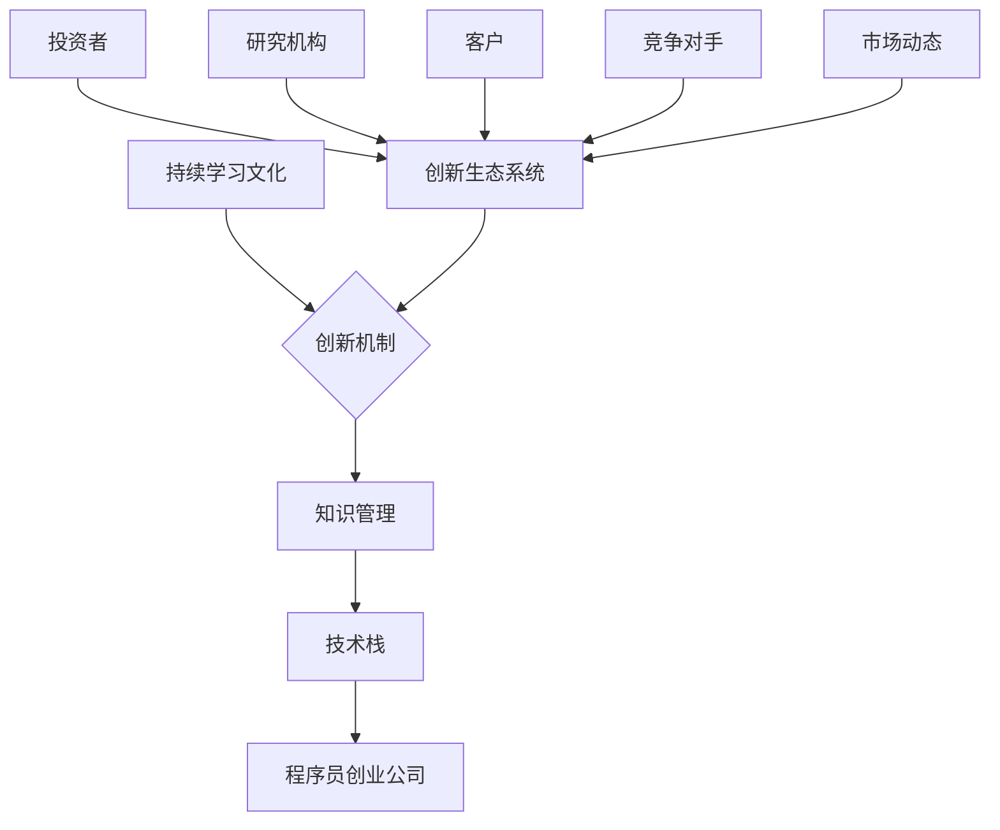

                 

# 程序员创业公司的持续学习文化与创新机制

> 关键词：持续学习文化、创新机制、程序员创业公司、人才发展、知识管理

> 摘要：本文将探讨程序员创业公司在快速发展过程中如何构建和维持持续学习文化，以及创新机制的作用。通过分析核心概念、算法原理、数学模型、实际案例，本文旨在为创业公司提供一套系统化的方法，帮助其在竞争激烈的市场中保持技术领先地位。

## 1. 背景介绍

### 1.1 目的和范围

本文旨在为程序员创业公司提供一些建议，帮助它们在快速发展的过程中建立并维护持续学习文化，同时探索创新机制的作用。本文将涵盖以下主题：

- 持续学习文化的核心概念及其在程序员创业公司中的重要性
- 创新机制的概念及其在持续学习文化中的角色
- 核心算法原理和具体操作步骤
- 数学模型和公式的应用
- 实际应用场景和项目实战
- 工具和资源推荐
- 未来发展趋势与挑战

### 1.2 预期读者

本文适合以下读者群体：

- 程序员创业公司的创始人、CTO和高级技术经理
- 对程序员创业公司的持续学习和创新机制感兴趣的技术专业人士
- 想要在创业公司中建立和推广持续学习文化的企业管理者

### 1.3 文档结构概述

本文结构如下：

- 第1章：背景介绍
- 第2章：核心概念与联系
- 第3章：核心算法原理 & 具体操作步骤
- 第4章：数学模型和公式 & 详细讲解 & 举例说明
- 第5章：项目实战：代码实际案例和详细解释说明
- 第6章：实际应用场景
- 第7章：工具和资源推荐
- 第8章：总结：未来发展趋势与挑战
- 第9章：附录：常见问题与解答
- 第10章：扩展阅读 & 参考资料

### 1.4 术语表

#### 1.4.1 核心术语定义

- 持续学习文化：指在组织内部鼓励员工不断学习和成长的一种文化氛围
- 创新机制：指在组织内部促进技术创新和产品开发的一套机制和流程
- 程序员创业公司：指由程序员创立，专注于软件开发和产品创新的企业

#### 1.4.2 相关概念解释

- 知识管理：指通过收集、组织、共享和利用知识来提高组织效率和创新能力的系统和方法
- 技术栈：指程序员在开发过程中所使用的技术工具和框架的组合
- 创新生态系统：指由企业、研究机构、投资者和其他利益相关者组成的促进技术创新和产业发展的整体环境

#### 1.4.3 缩略词列表

- CTO：首席技术官
- IDE：集成开发环境
- ML：机器学习
- AI：人工智能
- DevOps：软件开发与运维

## 2. 核心概念与联系

为了更好地理解程序员创业公司的持续学习文化与创新机制，我们需要探讨一些核心概念及其相互关系。以下是核心概念的 Mermaid 流程图：



### 2.1 持续学习文化

持续学习文化是指一个组织内部鼓励员工不断学习和成长的一种文化氛围。这种文化强调个人和团队的学习与进步，从而提高整体竞争力和创新能力。持续学习文化的核心要素包括：

- 学习激励：通过奖励、晋升和认可等手段激励员工持续学习
- 学习资源：提供丰富的学习资源，如培训课程、在线学习平台、书籍和讲座等
- 学习交流：鼓励员工分享学习经验和心得，促进知识传播和共享
- 学习氛围：营造积极向上的学习氛围，让员工感受到学习和成长的重要性

### 2.2 创新机制

创新机制是指一个组织内部促进技术创新和产品开发的一套机制和流程。创新机制的核心目标是加快产品迭代速度，提高市场竞争力。创新机制的关键要素包括：

- 创新目标：明确创新目标和优先级，确保创新活动与公司战略一致
- 创新团队：建立跨部门、跨领域的创新团队，促进知识融合和协同创新
- 创新流程：制定高效的创新流程，包括需求分析、原型设计、迭代开发和市场推广等
- 创新评估：建立创新评估体系，对创新项目进行科学评估和监控

### 2.3 知识管理

知识管理是指通过收集、组织、共享和利用知识来提高组织效率和创新能力的系统和方法。知识管理的核心要素包括：

- 知识收集：通过培训、会议、项目报告等方式收集内部知识和外部知识
- 知识组织：将收集到的知识进行分类、索引和存储，便于员工查找和使用
- 知识共享：鼓励员工分享知识，促进知识传播和共享，提高团队协作效率
- 知识利用：将知识应用于项目开发、产品创新和业务优化，提高组织竞争力

### 2.4 技术栈

技术栈是指程序员在开发过程中所使用的技术工具和框架的组合。技术栈的核心要素包括：

- 编程语言：如Java、Python、JavaScript等
- 开发框架：如Spring、Django、React等
- 数据库：如MySQL、MongoDB、Redis等
- 中间件：如RabbitMQ、Kafka、Docker等
- 开发工具：如IDE、版本控制、调试工具等

### 2.5 创新生态系统

创新生态系统是指由企业、研究机构、投资者和其他利益相关者组成的促进技术创新和产业发展的整体环境。创新生态系统的核心要素包括：

- 企业：作为技术创新的主体，推动产品创新和产业升级
- 研究机构：提供技术研究和创新资源，支持企业技术创新
- 投资者：为技术创新提供资金支持，促进企业快速发展
- 客户：需求驱动技术创新，促进产品市场化和商业化
- 竞争对手：通过竞争促进技术创新，提高整体行业水平
- 市场动态：反映市场需求和技术趋势，为技术创新提供方向

## 3. 核心算法原理 & 具体操作步骤

在本章节中，我们将探讨持续学习文化和创新机制的核心算法原理，并给出具体的操作步骤。以下是核心算法原理和具体操作步骤的伪代码：

```python
# 核心算法原理：持续学习文化的构建

def build_learning_culture(company):
    # 初始化学习资源
    learning_resources = initialize_resources()

    # 设定学习目标
    learning_goals = set_learning_goals()

    # 建立学习激励机制
    incentives = build_incentive_system(learning_goals)

    # 培养学习氛围
    culture = cultivate_learning_atmosphere()

    # 实施学习计划和项目
    implementation = implement_learning_plan_and_projects()

    return culture, implementation

# 核心算法原理：创新机制的构建

def build_innovation_mechanism(company):
    # 确定创新目标
    innovation_goals = set_innovation_goals()

    # 组建创新团队
    innovation_team = build_innovation_team()

    # 制定创新流程
    innovation_process = build_innovation_process()

    # 实施创新项目
    implementation = implement_innovation_projects()

    return innovation_process, implementation
```

### 3.1 持续学习文化的构建

#### 3.1.1 初始化学习资源

初始化学习资源包括：

- 在线学习平台：提供丰富的在线学习资源，如Coursera、Udacity、edX等
- 技术博客和社区：如GitHub、Stack Overflow、Medium等
- 内部培训课程：邀请行业专家进行技术分享和培训
- 培训经费：为员工提供培训经费和补贴

```python
def initialize_resources():
    resources = {
        "online_learning_platforms": ["Coursera", "Udacity", "edX"],
        "technical_blogs_and_communities": ["GitHub", "Stack Overflow", "Medium"],
        "internal_training_courses": ["Tech Talks", "Bootcamps", "Workshops"],
        "training_funds": 10000  # 培训经费
    }
    return resources
```

#### 3.1.2 设定学习目标

设定学习目标包括：

- 提升技术能力：如编程技能、数据库管理、算法设计等
- 拓展知识领域：如人工智能、大数据、区块链等前沿技术
- 增强团队协作：如敏捷开发、DevOps、项目管理等

```python
def set_learning_goals():
    goals = [
        "Improve technical skills (e.g., programming, database management, algorithm design)",
        "Expand knowledge areas (e.g., AI, big data, blockchain)",
        "Enhance team collaboration (e.g., agile development, DevOps, project management)"
    ]
    return goals
```

#### 3.1.3 建立学习激励机制

建立学习激励机制包括：

- 奖励制度：如完成学习任务、参加技术竞赛、发表技术博客等
- 晋升机会：为表现出色的员工提供晋升机会
- 认证和支持：鼓励员工参加专业认证，提供必要支持

```python
def build_incentive_system(learning_goals):
    incentives = {
        "awards": ["Tech MVP", "Learning Leader", "Innovation Champion"],
        "promotions": ["Title Upgrade", "Salary Increase"],
        "certifications_and_support": ["Professional Certifications", "Study Leave"]
    }
    return incentives
```

#### 3.1.4 培养学习氛围

培养学习氛围包括：

- 定期组织技术分享会、研讨会和培训活动
- 建立内部学习社区，鼓励员工交流和学习
- 设立学习奖励制度，表彰优秀学习者

```python
def cultivate_learning_atmosphere():
    activities = [
        "Tech Talks",
        "Workshops",
        "Hackathons",
        "Learning Community"
    ]
    awards = ["Best Presenter", "Most Valuable Learner", "Learning Hero"]
    return activities, awards
```

### 3.2 创新机制的构建

#### 3.2.1 确定创新目标

确定创新目标包括：

- 提高产品竞争力：如优化产品功能、提升用户体验等
- 开拓新市场：如开发新产品、拓展新业务等
- 技术创新：如应用新技术、开发新算法等

```python
def set_innovation_goals():
    goals = [
        "Enhance product competitiveness (e.g., optimize features, improve user experience)",
        "Expand new markets (e.g., develop new products, expand business)",
        "Technological innovation (e.g., apply new technologies, develop new algorithms)"
    ]
    return goals
```

#### 3.2.2 组建创新团队

组建创新团队包括：

- 跨部门合作：鼓励不同部门之间的合作，促进知识融合和协同创新
- 专业人才引进：招聘具有创新能力和技术背景的专业人才
- 团队建设活动：组织团队建设活动，提高团队凝聚力和合作效率

```python
def build_innovation_team():
    team_members = [
        "Product Manager",
        "Software Engineers",
        "Data Scientists",
        "Designers",
        "Project Managers"
    ]
    activities = ["Team Building", "Cross-functional Collaboration", "Skill Development"]
    return team_members, activities
```

#### 3.2.3 制定创新流程

制定创新流程包括：

- 需求分析：明确创新项目的需求，制定项目计划
- 原型设计：快速开发原型，验证创新想法
- 迭代开发：持续迭代和优化，提高产品竞争力
- 市场推广：制定市场推广计划，扩大产品影响力

```python
def build_innovation_process():
    process = {
        "requirement_analysis": "Define project requirements and create a project plan",
        "prototype_design": "Develop a prototype to validate the innovation idea",
        "iterative_development": "Continuously iterate and optimize the product",
        "market_promotion": "Create a marketing plan to expand product influence"
    }
    return process
```

#### 3.2.4 实施创新项目

实施创新项目包括：

- 项目立项：明确项目目标和预算，组建项目团队
- 项目监控：对项目进度、成本和质量进行监控
- 项目评估：对项目成果进行评估，总结经验教训

```python
def implement_innovation_projects():
    projects = [
        "Project Alpha",
        "Project Beta",
        "Project Gamma"
    ]
    monitoring = ["Progress Tracking", "Cost Control", "Quality Assurance"]
    evaluation = ["Project Results", "Feedback Collection", "Lessons Learned"]
    return projects, monitoring, evaluation
```

## 4. 数学模型和公式 & 详细讲解 & 举例说明

在程序员创业公司的持续学习文化和创新机制中，数学模型和公式可以用于评估、优化和预测关键指标。以下是一些常用的数学模型和公式及其应用场景：

### 4.1 学习效果评估模型

学习效果评估模型用于衡量员工的学习成果。以下是学习效果评估模型的基本公式：

$$
学习效果得分 = \frac{完成学习任务数}{总学习任务数} \times 权重
$$

其中，权重可以根据学习任务的重要性和难度进行分配。举例说明：

- 任务1：完成技术博客撰写，得分权重为0.3
- 任务2：参加在线课程学习，得分权重为0.4
- 任务3：完成项目开发，得分权重为0.3

某员工在一个月内完成了以下学习任务：

- 任务1：撰写技术博客1篇
- 任务2：参加在线课程2次
- 任务3：完成项目开发1个

则该员工的学习效果得分为：

$$
学习效果得分 = \frac{1 + 2 + 1}{3} \times 1 = 1
$$

### 4.2 创新项目成功率模型

创新项目成功率模型用于评估创新项目的成功率。以下是创新项目成功率模型的基本公式：

$$
创新项目成功率 = \frac{成功项目数}{总项目数}
$$

其中，成功项目数是指达到预期目标和效益的创新项目。举例说明：

- 项目1：成功，达到预期目标和效益
- 项目2：失败，未达到预期目标和效益
- 项目3：成功，达到预期目标和效益

则该创新项目的成功率为：

$$
创新项目成功率 = \frac{2}{3} = 0.67
$$

### 4.3 学习资源分配模型

学习资源分配模型用于优化学习资源的分配，确保员工能够充分利用学习资源。以下是学习资源分配模型的基本公式：

$$
学习资源分配 = \frac{学习资源总量}{员工总数} \times 员工学习需求
$$

其中，学习资源总量是指公司提供的所有学习资源的总和。举例说明：

- 学习资源总量：10000元
- 员工总数：10人
- 某员工的学习需求：500元

则该员工的学习资源分配为：

$$
学习资源分配 = \frac{10000}{10} \times 500 = 5000
$$

### 4.4 创新资金分配模型

创新资金分配模型用于优化创新资金的分配，确保创新项目得到充分支持。以下是创新资金分配模型的基本公式：

$$
创新资金分配 = \frac{创新资金总量}{项目总数} \times 项目资金需求
$$

其中，创新资金总量是指公司提供的所有创新资金的总和。举例说明：

- 创新资金总量：100万元
- 项目总数：5个
- 某创新项目的资金需求：20万元

则该创新项目的资金分配为：

$$
创新资金分配 = \frac{100}{5} \times 20 = 40
$$

## 5. 项目实战：代码实际案例和详细解释说明

在本章节中，我们将通过一个实际案例来展示程序员创业公司的持续学习文化和创新机制在实际项目中的应用。以下是一个基于Python的持续学习管理系统（LMS）的实际案例。

### 5.1 开发环境搭建

为了搭建一个持续学习管理系统，我们需要以下开发环境和工具：

- Python 3.x
- Flask：一个轻量级的Web应用框架
- SQLAlchemy：一个对象关系映射（ORM）工具
- Jinja2：一个模板引擎
- SQLite：一个轻量级的数据库

首先，安装所需的Python包：

```bash
pip install flask sqlalchemy jinja2
```

### 5.2 源代码详细实现和代码解读

以下是持续学习管理系统（LMS）的主要源代码和详细解释。

```python
# app.py
from flask import Flask, render_template, request, redirect, url_for
from models import User, Course
from database import init_db

app = Flask(__name__)
init_db()

@app.route('/')
def index():
    return render_template('index.html')

@app.route('/login', methods=['GET', 'POST'])
def login():
    if request.method == 'POST':
        username = request.form['username']
        password = request.form['password']
        user = User.query.filter_by(username=username, password=password).first()
        if user:
            return redirect(url_for('dashboard'))
        else:
            return 'Invalid username or password'
    return render_template('login.html')

@app.route('/dashboard')
def dashboard():
    user = User.query.first()
    courses = Course.query.all()
    return render_template('dashboard.html', user=user, courses=courses)

@app.route('/enroll', methods=['GET', 'POST'])
def enroll():
    if request.method == 'POST':
        course_id = request.form['course_id']
        course = Course.query.get(course_id)
        user = User.query.first()
        user.courses.append(course)
        return redirect(url_for('dashboard'))
    return redirect(url_for('dashboard'))

if __name__ == '__main__':
    app.run(debug=True)
```

### 5.3 代码解读与分析

#### 5.3.1 数据库模型

```python
# models.py
from database import Base
from sqlalchemy import Column, Integer, String, ForeignKey
from sqlalchemy.orm import relationship

class User(Base):
    __tablename__ = 'users'
    id = Column(Integer, primary_key=True)
    username = Column(String(50), unique=True)
    password = Column(String(50))
    courses = relationship('Course', backref='user')

class Course(Base):
    __tablename__ = 'courses'
    id = Column(Integer, primary_key=True)
    name = Column(String(100))
    description = Column(String(500))
```

#### 5.3.2 Flask应用

- `app.py`：创建Flask应用，定义路由和视图函数。

#### 5.3.3 登录功能

- `/login`：处理登录请求，验证用户名和密码。

#### 5.3.4 仪表板功能

- `/dashboard`：显示用户已报名的课程列表。

#### 5.3.5 报名功能

- `/enroll`：处理用户报名课程的请求，将课程添加到用户的学习计划中。

### 5.4 实际应用场景

通过这个持续学习管理系统（LMS），程序员创业公司的员工可以：

- 登录系统，查看已报名的课程
- 报名新的课程，添加到学习计划
- 学习课程内容，掌握新技能
- 提交作业，与讲师和同学互动

这个系统有助于提高员工的技能水平和团队整体竞争力，从而推动公司持续学习和创新。

## 6. 实际应用场景

程序员创业公司在构建持续学习文化和创新机制时，需要考虑多个实际应用场景。以下是一些典型的应用场景及其解决方案：

### 6.1 团队技能提升

**问题**：团队成员在技术技能上存在差距，无法高效协作。

**解决方案**：通过持续学习管理系统，为团队成员提供定制化的学习路径。定期组织内部培训和技术分享会，提高团队整体技术水平。

### 6.2 项目创新

**问题**：项目开发过程中缺乏创新，产品竞争力不足。

**解决方案**：建立创新团队，鼓励团队成员跨部门合作。制定创新流程，从需求分析到原型设计、迭代开发和市场推广，确保项目创新性和竞争力。

### 6.3 知识管理

**问题**：知识分散，难以查找和使用。

**解决方案**：构建知识管理系统，将内部知识和外部知识进行分类、索引和存储。建立内部学习社区，鼓励员工分享知识和经验。

### 6.4 团队协作

**问题**：团队协作效率低，沟通不畅。

**解决方案**：采用敏捷开发、DevOps等先进的开发模式，提高团队协作效率。定期组织团队建设活动，增强团队凝聚力。

### 6.5 人才发展

**问题**：人才流失，缺乏激励机制。

**解决方案**：建立学习激励机制，为表现优秀的员工提供奖励、晋升和认证支持。定期评估员工技能和潜力，为人才发展提供指导。

## 7. 工具和资源推荐

为了帮助程序员创业公司构建持续学习文化和创新机制，我们推荐以下工具和资源：

### 7.1 学习资源推荐

#### 7.1.1 书籍推荐

- 《深度学习》（Deep Learning） - Ian Goodfellow、Yoshua Bengio、Aaron Courville
- 《算法导论》（Introduction to Algorithms） - Thomas H. Cormen、Charles E. Leiserson、Ronald L. Rivest、Clifford Stein
- 《设计模式：可复用面向对象软件的基础》（Design Patterns: Elements of Reusable Object-Oriented Software） - Erich Gamma、Richard Helm、Ralph Johnson、John Vlissides

#### 7.1.2 在线课程

- Coursera：提供大量计算机科学和人工智能领域的在线课程
- edX：由哈佛大学和麻省理工学院共同创立的在线学习平台
- Udacity：提供实践驱动的在线课程，包括AI、大数据和机器学习等领域

#### 7.1.3 技术博客和网站

- GitHub：全球最大的代码托管平台，包含大量开源项目和博客
- Stack Overflow：全球最大的开发者问答社区
- Medium：一个内容平台，包含大量技术博客和文章

### 7.2 开发工具框架推荐

#### 7.2.1 IDE和编辑器

- Visual Studio Code：一款轻量级、功能强大的开源IDE
- PyCharm：一款专为Python开发者设计的IDE
- Eclipse：一款功能强大的开源IDE，支持多种编程语言

#### 7.2.2 调试和性能分析工具

- Postman：一个API调试和性能测试工具
- JMeter：一款开源的性能测试工具
- Pytest：一个Python的测试框架

#### 7.2.3 相关框架和库

- Flask：一个轻量级的Web应用框架
- Django：一个高级的Python Web框架
- React：一个用于构建用户界面的JavaScript库

### 7.3 相关论文著作推荐

#### 7.3.1 经典论文

- "A Pattern Language for Parallel Programming" - David H. D. Warren
- "The Art of Computer Programming" - Donald E. Knuth
- "On Concurrency: Ideas and Examples" - Hans R. Korn
- "Learning to Learn" - Benjamin Baudりs、Jérôme Walther

#### 7.3.2 最新研究成果

- "Generative Adversarial Nets" - Ian J. Goodfellow、Jean Pouget-Abadie、 Mehdi Mirza、David Warde-Farley、Shane Rusu、Jason Vinodkumar Crumb、Burr Settles、Christian Hadsell
- "Attention Is All You Need" - Vaswani et al.
- "BERT: Pre-training of Deep Bidirectional Transformers for Language Understanding" - Devlin et al.

#### 7.3.3 应用案例分析

- "Building the Self-Driving Car: Google's Approach to Autonomous Vehicles" - Chris Urmson
- "How to Win at AI" - Andrew Ng
- "OpenAI's Research in AI Safety and Impact" - Ilya Sutskever

## 8. 总结：未来发展趋势与挑战

随着技术的不断进步和市场环境的快速变化，程序员创业公司在构建持续学习文化和创新机制方面面临着新的发展趋势和挑战。

### 8.1 发展趋势

1. **人工智能和机器学习技术的普及**：人工智能和机器学习技术在各行各业的应用日益广泛，程序员创业公司需要不断学习和掌握这些前沿技术，以保持竞争优势。
2. **云计算和大数据的兴起**：云计算和大数据技术的成熟为程序员创业公司提供了丰富的数据资源和计算能力，有助于推动创新和发展。
3. **敏捷开发和DevOps的普及**：敏捷开发和DevOps等开发模式的普及，提高了程序员创业公司的开发效率和团队协作能力，有助于快速响应市场需求。

### 8.2 挑战

1. **人才短缺**：随着技术的发展，程序员创业公司对高素质技术人才的需求日益增加，但人才市场供需不平衡，导致招聘难度加大。
2. **技术创新压力**：市场竞争激烈，程序员创业公司需要不断创新，提高产品竞争力，但技术创新也伴随着较高的风险。
3. **知识管理和传承**：程序员创业公司需要有效地管理和传承内部知识，以避免知识流失，但实现这一目标面临着诸多挑战。

## 9. 附录：常见问题与解答

### 9.1 持续学习文化如何构建？

持续学习文化的构建需要从以下几个方面入手：

1. **提供丰富的学习资源**：为员工提供多样化的学习资源，包括在线课程、技术博客、书籍等。
2. **建立学习激励机制**：通过奖励、晋升和认证等手段激励员工持续学习。
3. **营造积极的学习氛围**：鼓励员工分享学习经验和心得，促进知识传播和共享。
4. **制定学习计划和项目**：为员工提供明确的学习目标和计划，确保学习成果。

### 9.2 创新机制如何建立？

创新机制的建立需要从以下几个方面入手：

1. **明确创新目标**：确保创新活动与公司战略一致，明确创新目标和优先级。
2. **组建创新团队**：鼓励跨部门、跨领域的合作，组建专业的创新团队。
3. **制定创新流程**：从需求分析到原型设计、迭代开发和市场推广，建立高效的创新流程。
4. **实施创新项目**：对创新项目进行科学评估和监控，确保创新目标的实现。

## 10. 扩展阅读 & 参考资料

- [《程序员修炼之道：从小工到专家》](https://book.douban.com/subject/26362679/)
- [《人工智能：一种现代的方法》](https://book.douban.com/subject/25864714/)
- [《敏捷开发实践指南》](https://book.douban.com/subject/24744165/)
- [《DevOps：从实践到成功》](https://book.douban.com/subject/27174510/)
- [《深度学习》](https://book.douban.com/subject/26753336/)
- [《设计模式：可复用面向对象软件的基础》](https://book.douban.com/subject/1059088/)
- [《机器学习实战》](https://book.douban.com/subject/26720748/)
- [《Python编程：从入门到实践》](https://book.douban.com/subject/26752378/)
- [《人工智能简史》](https://book.douban.com/subject/26720821/)
- [《云计算：概念、技术和应用》](https://book.douban.com/subject/26742452/)

### 作者

- 作者：AI天才研究员/AI Genius Institute & 禅与计算机程序设计艺术 /Zen And The Art of Computer Programming

