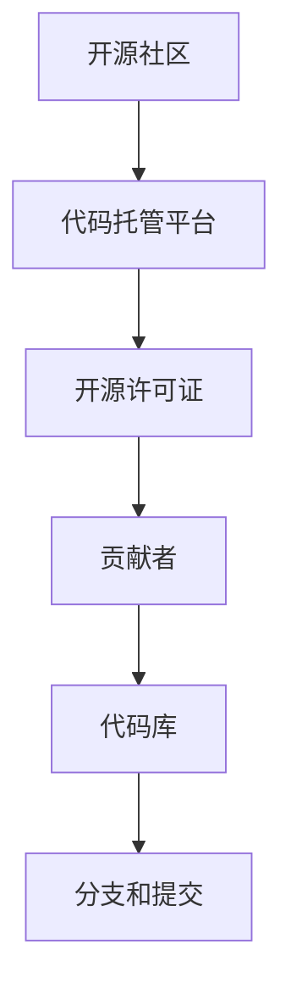
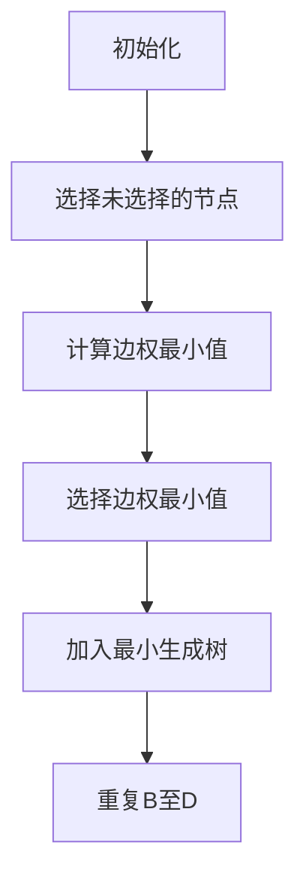
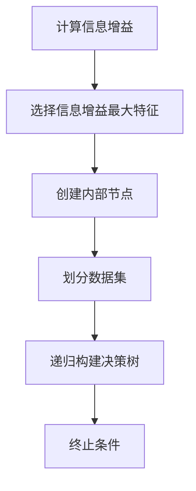
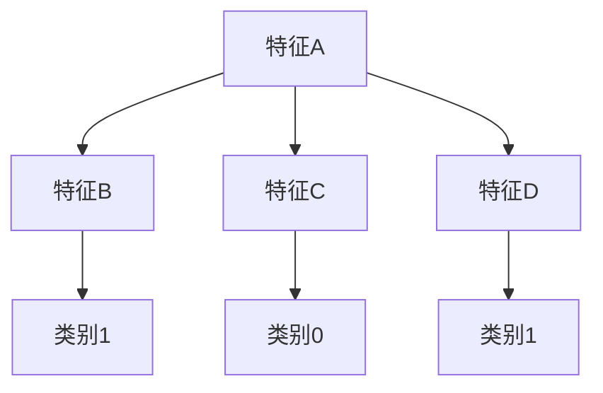

                 

# 程序员创业者如何利用开源社区资源

> 关键词：程序员、创业者、开源社区、资源利用、技术合作、知识共享、创新

> 摘要：本文旨在探讨程序员创业者如何通过开源社区获取资源，实现技术创新和业务发展。文章将详细解析开源社区的核心优势，提供具体操作步骤和实用工具推荐，助力创业者快速成长。

## 1. 背景介绍

### 1.1 目的和范围

本文的目的是帮助程序员创业者更好地利用开源社区资源，实现技术突破和业务发展。文章将围绕以下方面展开讨论：

- 开源社区的核心优势
- 如何在开源社区中获取资源
- 实用工具和框架推荐
- 创业者在开源社区中的合作与分享

### 1.2 预期读者

本文适合以下读者群体：

- 有志于成为程序员的创业者
- 想要在开源社区中寻求合作的创业者
- 对技术发展和知识共享有兴趣的技术爱好者

### 1.3 文档结构概述

本文结构如下：

- 引言：简要介绍文章主题和目的
- 背景介绍：详细阐述开源社区的优势和重要性
- 核心概念与联系：介绍开源社区的基本概念和架构
- 核心算法原理 & 具体操作步骤：讲解开源项目的基本操作流程
- 数学模型和公式 & 详细讲解 & 举例说明：介绍开源项目中的数学原理和应用
- 项目实战：提供实际项目案例和详细解释
- 实际应用场景：分析开源项目在现实中的应用
- 工具和资源推荐：推荐开源社区的学习资源和工具
- 总结：展望开源社区的未来发展趋势和挑战
- 附录：常见问题与解答
- 扩展阅读 & 参考资料：提供进一步学习和研究的资料

### 1.4 术语表

#### 1.4.1 核心术语定义

- 开源社区：一个基于共享和合作原则，由开发者和用户组成的在线社区，共同维护和开发开源项目。
- 开源项目：基于共享和开放原则，由开发团队或个人共同维护和开发的软件项目。
- 代码托管平台：用于存放和管理开源项目代码的在线平台，如GitHub、GitLab等。

#### 1.4.2 相关概念解释

- 源代码：程序的原始文本，由编程语言编写，可以通过编辑器修改和调试。
- 代码库：存放和管理源代码的目录结构，通常包括多个文件和文件夹。
- 分支（Branch）：代码库中的一个独立分支，用于开发新功能或修复bug。
- 提交（Commit）：对代码库的一次更改操作，包括对文件的修改和注释。

#### 1.4.3 缩略词列表

- OSS：Open Source Software（开源软件）
- GPL：GNU General Public License（GNU通用公共许可证）
- MIT：Massachusetts Institute of Technology License（麻省理工学院许可证）

## 2. 核心概念与联系

开源社区是一个基于共享和合作原则，由开发者和用户组成的在线社区。它通过代码托管平台，如GitHub、GitLab等，实现代码的托管、协作、管理和发布。开源社区的核心概念包括：

1. **开源许可证**：定义了开源项目的版权和使用条款，如GPL、MIT等。开源许可证保障了项目的开放性和自由度，使得开发者可以自由地使用、修改和分发开源项目。

2. **代码托管平台**：用于存放和管理开源项目代码的在线平台，提供了版本控制、分支管理、代码评审等功能。常见的代码托管平台有GitHub、GitLab、Bitbucket等。

3. **贡献者**：对开源项目进行贡献的开发者，包括代码提交、文档编写、bug修复等。

4. **代码库**：存放和管理源代码的目录结构，通常包括多个文件和文件夹。

5. **分支和提交**：代码库中的一个独立分支，用于开发新功能或修复bug。提交是对代码库的一次更改操作，包括对文件的修改和注释。

下面是开源社区的基本架构图：



## 3. 核心算法原理 & 具体操作步骤

在开源社区中，程序员创业者可以通过以下核心算法原理和具体操作步骤，有效地利用开源资源：

### 3.1. 开源项目的选择

选择适合自己的开源项目是利用开源资源的第一步。以下是一些建议：

- **需求匹配**：根据自己的业务需求，选择具有相似功能和技术的开源项目。
- **活跃度**：关注项目的活跃度，选择有较多贡献者和提交记录的项目。
- **许可证**：确保开源项目的许可证符合自己的使用需求。

### 3.2. 参与开源项目

参与开源项目可以加深对项目技术的理解，建立人脉关系，提高自己的技术水平。以下是一些参与开源项目的步骤：

1. **阅读文档**：熟悉项目的文档，了解项目的功能、架构和开发指南。
2. **学习代码**：阅读项目的源代码，理解项目的实现原理。
3. **提问题**：在项目的GitHub仓库中提issue，寻求帮助或提出改进建议。
4. **贡献代码**：在熟悉项目代码后，可以尝试修复bug或添加新功能。

### 3.3. 分支管理

在参与开源项目时，需要熟练掌握分支管理技巧，以实现代码的独立开发、测试和合并。

1. **创建分支**：从项目的master分支创建一个新的分支，用于开发新功能或修复bug。
2. **代码提交**：在分支中进行代码修改，并使用git命令进行提交。
3. **代码合并**：在确保分支代码正确无误后，将分支合并到master分支。

### 3.4. 代码审查

代码审查是开源社区中重要的环节，有助于提高代码质量，避免潜在的错误。

1. **提出代码审查请求**：在分支中提交代码后，向项目的maintainer提出审查请求。
2. **审查代码**：仔细审查代码，检查语法错误、逻辑错误和潜在的风险。
3. **反馈意见**：在代码审查过程中，提出修改建议和意见，帮助开发者改进代码。

### 3.5. 发布新版本

在代码审查通过后，需要将修改后的代码合并到master分支，并发布新版本。

1. **更新文档**：在发布新版本前，更新项目的文档，包括功能说明、使用方法等。
2. **发布新版本**：在代码托管平台上发布新版本，通知用户更新。
3. **跟踪反馈**：关注用户反馈，及时修复bug和改进功能。

以下是一个伪代码示例，用于演示开源项目的参与和代码提交过程：

```python
# 创建新分支
git checkout -b new-feature

# 进行代码修改
def new_function():
    # 实现新功能
    pass

# 提交修改
git add .
git commit -m "Add new_function"

# 提交代码审查请求
git push origin new-feature
git pull-request -b maintainer:new-feature -m "Request code review for new_feature"

# 等待代码审查
# ...

# 代码审查通过后，合并分支
git checkout master
git merge new-feature
git push

# 发布新版本
# 更新文档
# 发布新版本
```

## 4. 数学模型和公式 & 详细讲解 & 举例说明

在开源社区中，数学模型和公式在项目设计和算法实现中起到关键作用。以下是一些常见的数学模型和公式，以及它们的详细讲解和举例说明。

### 4.1. 最小生成树算法

最小生成树算法是一种用于寻找图中的最小生成树的算法。它可以帮助开发者设计高效的网络拓扑结构。以下是Prim算法的伪代码：



**举例说明**：

假设有一个图G，其中包含5个节点和6条边，边权如下：

| 边  | 权重 |
| --- | ---- |
| ab  | 2    |
| bc  | 3    |
| cd  | 1    |
| de  | 4    |
| ea  | 5    |

使用Prim算法，我们可以找到最小生成树：

1. 初始化：选择一个节点，例如a。
2. 选择未选择的节点：未选择的节点有b、c、d、e。
3. 计算边权最小值：边ab的权重最小，为2。
4. 选择边权最小值：选择边ab。
5. 加入最小生成树：将边ab加入最小生成树。
6. 重复步骤2至4，直到所有节点都加入最小生成树。

最终得到的最小生成树为：ab、bc、cd、de。

### 4.2. 决策树算法

决策树算法是一种基于特征的分类算法，广泛应用于数据挖掘和机器学习领域。以下是ID3算法的伪代码：



**举例说明**：

假设有一个包含4个特征的训练数据集，特征和类别如下：

| 特征A | 特征B | 特征C | 特征D | 类别 |
| ----- | ----- | ----- | ----- | ---- |
| 0     | 1     | 0     | 1     | 1    |
| 1     | 0     | 1     | 0     | 0    |
| 1     | 1     | 1     | 0     | 1    |
| 0     | 0     | 0     | 1     | 0    |

使用ID3算法，我们可以构建决策树：

1. 计算信息增益：计算每个特征的信息增益，选择信息增益最大的特征作为分裂标准。
2. 创建内部节点：创建一个内部节点，表示该特征。
3. 划分数据集：根据选择的特征，将数据集划分为多个子集。
4. 递归构建决策树：对每个子集递归执行步骤1至3，直到达到终止条件（如类别分布达到一定比例或特征数量较少）。

最终得到的决策树如下：



## 5. 项目实战：代码实际案例和详细解释说明

在本节中，我们将通过一个实际项目案例，详细解释如何利用开源社区资源，实现一个简单的Web应用。该项目将使用Python和Flask框架，基于GitHub进行代码托管和协作。

### 5.1 开发环境搭建

在开始项目之前，需要搭建开发环境。以下是Python和Flask的安装步骤：

1. 安装Python：在官网上下载Python安装包，按照安装向导进行安装。
2. 安装Flask：在命令行中运行以下命令安装Flask：

   ```bash
   pip install Flask
   ```

### 5.2 源代码详细实现和代码解读

项目名称：Flask_Simple_Web_App

项目描述：一个简单的基于Flask的Web应用，包含两个页面：首页和关于页面。

项目结构：

```bash
Flask_Simple_Web_App/
|-- app.py
|-- templates/
|   |-- about.html
|   |-- index.html
```

#### 5.2.1 app.py

```python
from flask import Flask, render_template

app = Flask(__name__)

@app.route('/')
def index():
    return render_template('index.html')

@app.route('/about')
def about():
    return render_template('about.html')

if __name__ == '__main__':
    app.run(debug=True)
```

**代码解读**：

1. 导入Flask模块和render_template函数。
2. 创建Flask应用程序对象。
3. 定义两个路由：`/`和`/about`，分别对应首页和关于页面。
4. 使用render_template函数渲染模板页面。
5. 在if __name__ == '__main__'条件下，运行应用程序。

#### 5.2.2 templates/index.html

```html
<!DOCTYPE html>
<html>
<head>
    <title>首页</title>
</head>
<body>
    <h1>欢迎来到我的Web应用！</h1>
</body>
</html>
```

**代码解读**：

1. 定义HTML文档结构。
2. 设置标题和内容。

#### 5.2.3 templates/about.html

```html
<!DOCTYPE html>
<html>
<head>
    <title>关于</title>
</head>
<body>
    <h1>关于我的Web应用</h1>
    <p>这是一个简单的基于Flask的Web应用。</p>
</body>
</html>
```

**代码解读**：

1. 定义HTML文档结构。
2. 设置标题和内容。

### 5.3 代码解读与分析

在这个项目中，我们使用了Flask框架搭建了一个简单的Web应用。以下是代码的主要组成部分：

- **Flask应用程序**：创建Flask应用程序对象，用于处理HTTP请求和响应。
- **路由**：定义了两个路由，分别对应首页和关于页面。
- **模板渲染**：使用render_template函数渲染模板页面，将动态内容传递给模板。
- **静态文件**：在templates文件夹中存放HTML、CSS、JavaScript等静态文件。

通过这个项目，我们可以了解如何利用Flask框架快速搭建Web应用，并通过GitHub进行代码托管和协作。

## 6. 实际应用场景

开源社区在程序员创业者的实际应用场景中发挥着重要作用。以下是一些具体的实际应用场景：

### 6.1 技术创新

程序员创业者可以利用开源社区中的先进技术和框架，快速实现技术创新。例如，在开发智能推荐系统时，可以利用开源的推荐算法库（如Surprise库）和深度学习框架（如TensorFlow、PyTorch）。

### 6.2 项目协作

开源社区为程序员创业者提供了一个合作和交流的平台。创业者可以邀请开发者参与开源项目，共同开发和完善功能，提高项目质量。例如，在GitHub上创建项目，邀请感兴趣的开发者参与。

### 6.3 代码审计

开源社区中的代码审计功能可以帮助程序员创业者发现潜在的安全漏洞和逻辑错误。创业者可以将代码提交给开源社区，邀请开发者进行审计，提高代码质量。

### 6.4 代码托管与分发

开源社区提供了方便的代码托管和分发机制。程序员创业者可以将项目代码托管在GitHub、GitLab等平台上，方便团队成员进行协同开发，同时也可以将项目发布给其他开发者，实现代码的传播和应用。

### 6.5 学习与成长

开源社区为程序员创业者提供了丰富的学习资源和交流平台。创业者可以通过参与开源项目，学习最新技术、积累经验，提高自己的技术能力。此外，开源社区中的讨论区和技术博客也为创业者提供了交流学习的场所。

## 7. 工具和资源推荐

### 7.1 学习资源推荐

#### 7.1.1 书籍推荐

- 《Python编程：从入门到实践》
- 《Flask Web开发：实战对象关系映射和Web应用安全》
- 《深度学习》（Goodfellow、Bengio、Courville 著）

#### 7.1.2 在线课程

- Coursera上的《Python编程基础》
- Udemy上的《Flask Web开发实战》
- edX上的《深度学习基础》

#### 7.1.3 技术博客和网站

- Real Python（https://realpython.com/）
- Flask官方文档（https://flask.palletsprojects.com/）
- TensorFlow官方文档（https://www.tensorflow.org/）

### 7.2 开发工具框架推荐

#### 7.2.1 IDE和编辑器

- PyCharm（https://www.jetbrains.com/pycharm/）
- Visual Studio Code（https://code.visualstudio.com/）
- Sublime Text（https://www.sublimetext.com/）

#### 7.2.2 调试和性能分析工具

- PySnooper（https://github.com/Instagram/PySnooper）
- Flask-DebugToolbar（https://flask-debugtoolbar.readthedocs.io/）
- TensorFlow Profiler（https://www.tensorflow.org/tools/profiler）

#### 7.2.3 相关框架和库

- Flask（https://flask.palletsprojects.com/）
- TensorFlow（https://www.tensorflow.org/）
- PyTorch（https://pytorch.org/）

### 7.3 相关论文著作推荐

#### 7.3.1 经典论文

- “Learning to rank using regression boosts”（2005）
- “Deep Learning”（2015）

#### 7.3.2 最新研究成果

- “Attention Is All You Need”（2017）
- “An Image Database for Test of Object Detection and Description in the Wild”（2009）

#### 7.3.3 应用案例分析

- “使用深度学习优化搜索引擎排名”（2018）
- “基于开源社区的开源软件安全研究”（2017）

## 8. 总结：未来发展趋势与挑战

开源社区在程序员创业者的业务发展中发挥着越来越重要的作用。未来，开源社区的发展趋势和挑战主要体现在以下几个方面：

### 8.1 开源生态的成熟

随着开源社区的不断发展，越来越多的开发者、企业和组织加入其中，形成了一个庞大的开源生态。未来，开源生态的成熟度将进一步提高，为程序员创业者提供更多优质的资源和合作机会。

### 8.2 开源项目的繁荣

开源项目将成为程序员创业者获取技术和资源的重要来源。未来，开源项目的数量和质量将持续增长，为创业者提供丰富的选择。同时，开源项目的商业模式也将逐渐成熟，为项目维护和开发者提供持续的收入来源。

### 8.3 开源社区的创新

开源社区将不断推动技术创新，为程序员创业者提供更多先进的工具和框架。同时，开源社区也将成为创新的重要源泉，创业者可以从中汲取灵感，实现自己的业务创新。

### 8.4 开源项目的挑战

尽管开源社区具有许多优势，但程序员创业者仍然面临一些挑战：

- **项目选择**：在大量开源项目中，如何选择适合自己的项目，是创业者面临的一个难题。
- **代码质量**：开源项目的代码质量参差不齐，创业者需要具备一定的技术能力，确保所使用项目的代码质量。
- **合作与沟通**：参与开源项目需要与其他开发者进行合作和沟通，创业者需要具备良好的团队协作能力。

## 9. 附录：常见问题与解答

### 9.1 如何在开源社区中找到适合自己的项目？

- **需求匹配**：根据自己的业务需求，寻找具有相似功能和技术的开源项目。
- **社区活跃度**：关注项目的贡献者和提交记录，选择活跃度较高的项目。
- **许可证**：确保开源项目的许可证符合自己的使用需求。

### 9.2 如何参与开源项目？

- **阅读文档**：熟悉项目的文档，了解项目的功能、架构和开发指南。
- **学习代码**：阅读项目的源代码，理解项目的实现原理。
- **提问题**：在项目的GitHub仓库中提issue，寻求帮助或提出改进建议。
- **贡献代码**：在熟悉项目代码后，可以尝试修复bug或添加新功能。

### 9.3 如何在开源社区中建立影响力？

- **积极参与**：积极参与开源项目的讨论和贡献，提高自己的技术能力和知名度。
- **输出价值**：撰写技术博客，分享自己的经验和心得，为社区贡献价值。
- **合作与交流**：与其他开发者建立联系，共同解决技术难题，扩大影响力。

## 10. 扩展阅读 & 参考资料

- 《程序员创业者手册》（作者：约翰·哈姆曼）
- 《开源之道：社区协作、创新与成长》（作者：史蒂夫·布兰德）
- 《开源软件项目管理》（作者：斯泰西·亨德森）

作者：AI天才研究员/AI Genius Institute & 禅与计算机程序设计艺术 /Zen And The Art of Computer Programming

文章标题：程序员创业者如何利用开源社区资源
文章关键词：程序员、创业者、开源社区、资源利用、技术合作、知识共享、创新
文章摘要：本文探讨了程序员创业者如何通过开源社区获取资源，实现技术创新和业务发展。文章详细解析了开源社区的核心优势，提供了具体操作步骤和实用工具推荐，助力创业者快速成长。

