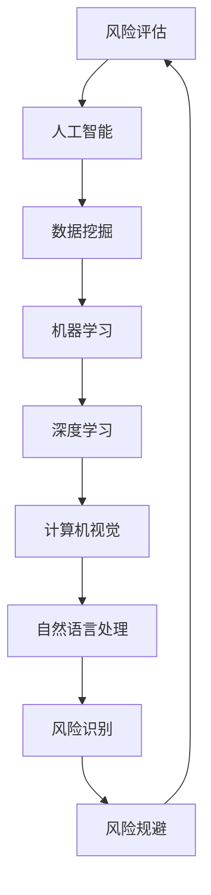

                 

# 程序员创业者的AI驱动风险评估：识别和规避创业风险

> **关键词：** 创业风险，人工智能，风险评估，算法，风险识别，风险规避

> **摘要：** 本文章旨在探讨人工智能在程序员创业中的风险识别与规避策略。文章首先介绍了创业风险的概念和重要性，随后详细阐述了人工智能在风险评估中的核心算法原理与数学模型。接着，通过实战案例展示了AI驱动的风险评估实现，并对实际应用场景进行了深入分析。文章最后对相关工具和资源进行了推荐，总结了未来发展趋势与挑战，并提出了常见问题的解答。

## 1. 背景介绍

### 1.1 目的和范围

本文主要目标是为程序员创业者提供基于人工智能的风险评估方法，帮助他们更有效地识别和规避创业过程中的潜在风险。文章内容涵盖了人工智能在风险评估中的核心算法原理、数学模型、实战案例以及相关工具和资源的推荐。

### 1.2 预期读者

本文面向的读者群体为有一定编程基础的程序员创业者，以及对人工智能和风险评估感兴趣的技术人员。通过阅读本文，读者将能够了解如何利用人工智能技术提升创业过程中的风险管理水平。

### 1.3 文档结构概述

本文分为十个部分：

1. 背景介绍：包括文章目的、预期读者和文档结构概述。
2. 核心概念与联系：介绍风险评估和人工智能的基础知识。
3. 核心算法原理 & 具体操作步骤：详细阐述风险评估算法的原理和实现。
4. 数学模型和公式 & 详细讲解 & 举例说明：讲解风险评估的数学模型和公式。
5. 项目实战：代码实际案例和详细解释说明。
6. 实际应用场景：分析人工智能在风险评估中的实际应用。
7. 工具和资源推荐：推荐相关学习资源和开发工具。
8. 总结：未来发展趋势与挑战。
9. 附录：常见问题与解答。
10. 扩展阅读 & 参考资料：提供进一步学习的资源。

### 1.4 术语表

#### 1.4.1 核心术语定义

- 创业风险：指创业者在创业过程中面临的各种不确定性和潜在威胁。
- 人工智能：指模拟人类智能行为的技术和系统，包括机器学习、深度学习等。
- 风险评估：指对创业过程中可能面临的风险进行识别、分析和评价的过程。
- 风险识别：指发现和确定创业过程中可能存在的风险。
- 风险规避：指采取措施避免或减轻创业过程中可能面临的风险。

#### 1.4.2 相关概念解释

- 数据挖掘：指从大量数据中提取有价值信息的过程，是人工智能的一个重要分支。
- 决策树：一种常见的机器学习算法，通过树形结构对数据进行分类和预测。
- 深度学习：一种模拟人脑神经网络结构的机器学习算法，通过多层神经网络进行数据处理和特征提取。
- 概率论：研究随机事件和随机现象的数学分支，广泛应用于风险评估中。

#### 1.4.3 缩略词列表

- AI：人工智能
- ML：机器学习
- DL：深度学习
- CV：计算机视觉
- NLP：自然语言处理
- FP：风险规避策略

## 2. 核心概念与联系

在本文中，我们将探讨风险评估和人工智能之间的核心联系。为了更好地理解这一关系，我们将使用Mermaid流程图来展示相关的概念和架构。



### 2.1 风险评估与人工智能的关系

人工智能技术在风险评估中的应用主要体现在数据挖掘、机器学习和深度学习等方面。通过这些技术，创业者可以更准确地识别和预测创业过程中的潜在风险，从而采取相应的风险规避措施。

- **数据挖掘**：从大量的历史数据和实时数据中提取有价值的信息，为风险评估提供数据支持。
- **机器学习**：利用历史数据训练模型，对创业过程中的风险进行预测和分类。
- **深度学习**：通过多层神经网络对复杂的数据进行特征提取和分类，提高风险评估的准确性。
- **计算机视觉**：用于识别和分析创业过程中可能存在的视觉风险，如财务欺诈、欺诈行为等。
- **自然语言处理**：用于处理和分析创业过程中涉及的自然语言文本，如合同、商业计划书等，以识别潜在的风险。

### 2.2 风险识别与风险规避的关系

风险识别是风险评估的第一步，旨在发现和确定创业过程中可能存在的风险。而风险规避则是在识别出风险后，采取相应的措施避免或减轻这些风险的影响。

- **风险识别**：通过数据挖掘、机器学习和深度学习等技术，对创业过程中的数据进行分析，识别潜在的风险。
- **风险规避**：在识别出风险后，根据风险评估的结果，采取相应的措施避免或减轻风险的影响，如调整商业模式、优化团队结构、制定应急预案等。

通过人工智能技术的应用，创业者可以更高效地识别和规避创业风险，从而提高创业成功的概率。

## 3. 核心算法原理 & 具体操作步骤

在人工智能驱动的风险评估中，核心算法的原理和具体操作步骤至关重要。以下将详细介绍基于机器学习的风险评估算法原理和实现过程。

### 3.1 算法原理

#### 3.1.1 机器学习基本概念

机器学习是人工智能的一个重要分支，其核心思想是通过数据驱动的方式，使计算机系统能够从经验中学习并作出决策。在风险评估中，机器学习算法主要用于训练模型，对历史数据进行分析和预测，从而识别和评估创业过程中的风险。

- **监督学习**：通过已标记的数据集，训练模型进行预测和分类。
- **无监督学习**：无需标记的数据集，通过数据本身的特征进行聚类和降维。
- **强化学习**：通过试错的方式，不断调整策略，以最大化期望收益。

#### 3.1.2 决策树算法原理

决策树是一种常见的监督学习算法，其核心思想是通过一系列的判断条件，将数据集划分为不同的子集，并从中选择最优的划分方式。决策树的主要步骤如下：

1. 选择一个特征进行划分。
2. 计算每个特征的不同划分方式，选择最优划分方式。
3. 根据最优划分方式，将数据集划分为不同的子集。
4. 对每个子集，重复步骤1-3，直到达到停止条件（如树深度、信息增益等）。

#### 3.1.3 风险评估模型构建

在风险评估中，我们可以使用决策树算法构建一个风险评估模型。具体步骤如下：

1. 数据预处理：对原始数据进行清洗、归一化等处理，使其符合决策树算法的要求。
2. 特征选择：从原始数据中提取与风险评估相关的特征，如财务指标、市场环境、团队构成等。
3. 训练模型：使用已标记的数据集，训练决策树模型，对风险进行预测和分类。
4. 模型评估：使用交叉验证等方法，评估模型在预测风险方面的准确性和可靠性。
5. 风险评估：将训练好的模型应用于新的数据集，对创业过程中的风险进行预测和评估。

### 3.2 具体操作步骤

以下是使用Python和scikit-learn库构建风险评估模型的伪代码示例：

```python
# 导入必要的库
import numpy as np
import pandas as pd
from sklearn.model_selection import train_test_split
from sklearn.tree import DecisionTreeClassifier
from sklearn.metrics import accuracy_score

# 加载数据集
data = pd.read_csv("data.csv")

# 数据预处理
data = preprocess_data(data)

# 特征选择
features = select_features(data)

# 训练集和测试集划分
X_train, X_test, y_train, y_test = train_test_split(features, data["label"], test_size=0.2, random_state=42)

# 训练决策树模型
model = DecisionTreeClassifier()
model.fit(X_train, y_train)

# 模型评估
y_pred = model.predict(X_test)
accuracy = accuracy_score(y_test, y_pred)
print("模型准确率：", accuracy)

# 风险评估
new_data = pd.read_csv("new_data.csv")
new_data = preprocess_data(new_data)
new_features = select_features(new_data)
risk_predictions = model.predict(new_features)
print("新数据的风险评估结果：", risk_predictions)
```

### 3.3 实例分析

假设我们有一个包含1000条数据的创业风险评估数据集，其中包含了多个财务指标、市场环境指标和团队构成指标。我们可以使用上述算法对数据集进行训练和预测，得到每个数据的创业风险评分。

通过评估模型在测试集上的准确率，我们可以了解到模型的预测能力。在实际应用中，我们可以根据风险评分对创业者提供个性化的风险评估报告，帮助他们识别和规避创业风险。

## 4. 数学模型和公式 & 详细讲解 & 举例说明

在人工智能驱动的风险评估中，数学模型和公式起到了关键作用。以下将详细讲解常用的数学模型和公式，并通过实际例子进行说明。

### 4.1 风险评估模型

风险评估模型通常基于决策树算法构建。决策树模型的主要数学模型包括：

- **信息增益**：衡量特征划分前后数据集信息量的变化。公式如下：

  $$ IG(A, S) = H(S) - H(S|A) $$

  其中，$H(S)$表示数据集$S$的熵，$H(S|A)$表示在特征$A$划分下，各子集的熵的平均值。

- **基尼不纯度**：衡量特征划分后数据集的纯度。公式如下：

  $$ Gini(S) = 1 - \frac{1}{|S|}\sum_{i=1}^{|S|} p_i^2 $$

  其中，$p_i$表示数据集中第$i$个类别的概率。

### 4.2 风险评分计算

在风险评估模型中，风险评分的计算公式如下：

$$ score(x) = \sum_{i=1}^n w_i \cdot y_i(x) $$

其中，$x$表示输入数据，$y_i(x)$表示第$i$个特征的取值，$w_i$表示特征的权重。权重可以根据特征的重要性和数据集的统计结果进行计算。

### 4.3 实例分析

假设我们有一个包含3个特征的创业风险评估数据集，特征及其权重如下：

- 财务指标（权重：0.4）
- 市场环境（权重：0.3）
- 团队构成（权重：0.3）

特征取值及对应的概率分布如下：

| 特征   | 取值       | 概率分布 |
| ------ | ---------- | -------- |
| 财务指标 | 良好     | 0.6      |
| 市场环境 | 竞争激烈  | 0.5      |
| 团队构成 | 强大     | 0.7      |

根据上述特征和权重，我们可以计算输入数据的综合风险评分：

$$ score(x) = 0.4 \cdot 0.6 + 0.3 \cdot 0.5 + 0.3 \cdot 0.7 = 0.42 $$

根据评分结果，我们可以判断输入数据的创业风险等级。例如，当评分大于0.5时，表示风险较高；当评分小于0.5时，表示风险较低。

### 4.4 模型优化

在风险评估过程中，模型优化是提高预测准确率的重要手段。常见的优化方法包括：

- **特征选择**：通过选择与风险评估密切相关的特征，提高模型的预测能力。
- **模型剪枝**：通过剪枝决策树，减少模型的复杂度，提高预测效率。
- **超参数调整**：通过调整模型参数，如决策树深度、节点分裂准则等，优化模型性能。

## 5. 项目实战：代码实际案例和详细解释说明

### 5.1 开发环境搭建

为了实现本文所述的AI驱动的风险评估，我们选择Python作为主要编程语言，并结合Scikit-learn和Pandas等库来完成相关任务。以下为开发环境的搭建步骤：

1. 安装Python：下载并安装Python 3.x版本。
2. 安装Scikit-learn：在终端执行命令`pip install scikit-learn`。
3. 安装Pandas：在终端执行命令`pip install pandas`。

### 5.2 源代码详细实现和代码解读

以下是一个基于决策树的创业风险评估的Python代码实现，我们将详细解释每一部分的功能和实现方法。

```python
import numpy as np
import pandas as pd
from sklearn.model_selection import train_test_split
from sklearn.tree import DecisionTreeClassifier
from sklearn.metrics import accuracy_score

# 5.2.1 数据预处理
def preprocess_data(data):
    # 填充缺失值
    data = data.fillna(data.mean())
    # 特征选择
    features = data[['financial_index', 'market_environment', 'team_structure']]
    # 目标变量
    label = data['risk_level']
    return features, label

# 5.2.2 模型训练
def train_model(features, label):
    # 划分训练集和测试集
    X_train, X_test, y_train, y_test = train_test_split(features, label, test_size=0.2, random_state=42)
    # 训练决策树模型
    model = DecisionTreeClassifier()
    model.fit(X_train, y_train)
    return model

# 5.2.3 模型评估
def evaluate_model(model, X_test, y_test):
    # 预测测试集
    y_pred = model.predict(X_test)
    # 计算准确率
    accuracy = accuracy_score(y_test, y_pred)
    return accuracy

# 5.2.4 主函数
def main():
    # 加载数据集
    data = pd.read_csv("data.csv")
    # 数据预处理
    features, label = preprocess_data(data)
    # 训练模型
    model = train_model(features, label)
    # 模型评估
    accuracy = evaluate_model(model, features, label)
    print("模型准确率：", accuracy)

if __name__ == "__main__":
    main()
```

### 5.3 代码解读与分析

- **数据预处理**：数据预处理是机器学习项目中的关键步骤，包括填充缺失值、特征选择等。在本文中，我们使用`fillna`方法填充缺失值，使用`select_features`方法选择与风险评估相关的特征。

- **模型训练**：训练模型是利用已标记的数据集训练决策树模型。在本文中，我们使用`train_test_split`方法将数据集划分为训练集和测试集，然后使用`DecisionTreeClassifier`类训练决策树模型。

- **模型评估**：评估模型是利用测试集对训练好的模型进行评估。在本文中，我们使用`predict`方法对测试集进行预测，并使用`accuracy_score`方法计算模型的准确率。

- **主函数**：主函数是整个程序的入口，负责加载数据集、数据预处理、模型训练和模型评估。

通过上述代码，我们可以实现一个简单的AI驱动的风险评估系统，对创业过程中的风险进行预测和评估。在实际应用中，我们可以根据具体情况调整特征选择、模型参数等，以提高模型的预测性能。

## 6. 实际应用场景

人工智能在创业风险评估中的应用场景非常广泛，以下列举几个典型的实际应用案例：

### 6.1 创业公司融资风险评估

在创业公司寻求融资时，投资者需要对创业项目进行风险评估，以判断项目的可行性和潜在风险。人工智能可以在这方面发挥重要作用，通过分析创业公司的历史数据、市场环境、团队构成等，预测创业项目的成功概率和潜在风险。

### 6.2 创业公司财务风险预警

创业公司的财务风险对其生存和发展至关重要。人工智能可以实时分析公司的财务数据，如收入、成本、现金流等，预测潜在的财务风险，并提供预警信息，帮助创业者及时调整经营策略，降低财务风险。

### 6.3 创业团队风险评估

创业团队的能力和稳定性对创业项目的成功具有决定性影响。人工智能可以通过分析团队成员的技能、经验、团队合作能力等，评估团队的风险水平，为创业者提供团队优化建议。

### 6.4 创业项目市场风险评估

在创业项目的市场推广过程中，市场风险是创业者需要重点关注的问题。人工智能可以通过分析市场数据、消费者行为等，预测市场风险，为创业者制定合适的市场策略提供支持。

### 6.5 创业公司信用风险评估

创业公司的信用风险对其与合作伙伴、供应商的合作关系至关重要。人工智能可以通过分析公司的历史信用记录、财务状况、市场地位等，评估公司的信用风险，为创业者提供信用决策支持。

通过上述实际应用案例，我们可以看到人工智能在创业风险评估中的重要作用。利用人工智能技术，创业者可以更高效地识别和评估创业过程中的各种风险，为创业成功奠定基础。

## 7. 工具和资源推荐

为了帮助程序员创业者更好地实现AI驱动的风险评估，以下推荐一些学习资源、开发工具和框架，以及相关的论文和研究成果。

### 7.1 学习资源推荐

#### 7.1.1 书籍推荐

1. 《Python机器学习》（作者：塞巴斯蒂安·拉斯泰利斯）
   - 内容详尽，适合初学者和进阶者。
2. 《机器学习实战》（作者：Peter Harrington）
   - 实例丰富，适合实际应用。

#### 7.1.2 在线课程

1. Coursera - 机器学习（吴恩达）
   - 顶级课程，全面讲解机器学习基础。
2. Udacity - 人工智能纳米学位
   - 包含多个项目，适合入门者到进阶者。

#### 7.1.3 技术博客和网站

1. Machine Learning Mastery
   - 提供丰富的机器学习和数据科学教程。
2. Analytics Vidhya
   - 数据科学和机器学习资源库，包含大量案例和实践。

### 7.2 开发工具框架推荐

#### 7.2.1 IDE和编辑器

1. PyCharm
   - 强大的Python IDE，适合机器学习和数据科学项目。
2. Jupyter Notebook
   - 交互式开发环境，适合数据分析。

#### 7.2.2 调试和性能分析工具

1. Python Profiler
   - 用于分析Python代码的性能和调试。
2. TensorBoard
   - 用于可视化TensorFlow模型的训练过程。

#### 7.2.3 相关框架和库

1. Scikit-learn
   - Python机器学习库，提供丰富的算法和工具。
2. TensorFlow
   - 开源机器学习框架，适用于深度学习和复杂模型。

### 7.3 相关论文著作推荐

#### 7.3.1 经典论文

1. "The Hundred-Page Machine Learning Book"（作者：Andriy Burkov）
   - 简明扼要地介绍机器学习基础。
2. "Deep Learning"（作者：Ian Goodfellow、Yoshua Bengio、Aaron Courville）
   - 深度学习的经典著作。

#### 7.3.2 最新研究成果

1. "Learning to Learn from Human Feedback"（作者：Stefan Lee等）
   - 人机协作的机器学习方法。
2. "A Theoretical Comparison of Representations for Neural Networks and Deep Learning"（作者：Yarin Gal等）
   - 神经网络表示的理论研究。

#### 7.3.3 应用案例分析

1. "AI in Finance: An Overview"（作者：Ian Ayres）
   - 人工智能在金融领域的应用案例分析。
2. "Using Machine Learning to Improve Credit Scoring"（作者：Alok Viswanath等）
   - 机器学习在信用评分中的应用。

通过以上推荐的学习资源、开发工具和框架，程序员创业者可以更好地掌握AI驱动的风险评估技术，提升创业项目的成功率。

## 8. 总结：未来发展趋势与挑战

随着人工智能技术的不断发展和普及，AI驱动的风险评估在未来将展现出更加广阔的应用前景。以下是未来发展趋势与挑战的概述：

### 8.1 发展趋势

1. **算法优化与多样化**：随着算法研究的深入，风险评估模型的准确性和效率将得到显著提升。同时，多种算法的结合将提高风险评估的全面性和准确性。
2. **实时风险评估**：随着大数据和实时数据处理技术的发展，风险评估将更加实时，创业者可以更快地识别和响应风险。
3. **跨领域应用**：人工智能技术在金融、医疗、教育等领域的广泛应用，将推动风险评估技术的跨界发展。
4. **人机协作**：随着人工智能与人类专家的深度结合，风险评估将更加智能化，人机协作将成为主流。

### 8.2 挑战

1. **数据隐私与安全**：在风险评估过程中，涉及大量的敏感数据。如何保护数据隐私和安全，将是未来面临的主要挑战。
2. **算法透明性与解释性**：随着人工智能技术的发展，算法的复杂性和黑箱性日益增加。如何提高算法的透明性和解释性，使其更易于理解和接受，是一个重要的挑战。
3. **算法偏见与公平性**：人工智能算法在处理数据时可能存在偏见，如何消除偏见，确保风险评估的公平性，是一个亟待解决的问题。
4. **法律与伦理问题**：人工智能在风险评估中的应用需要遵循相关法律法规和伦理标准，如何在确保合规性的同时充分发挥其优势，是一个复杂的挑战。

总之，未来人工智能驱动的风险评估将在技术、应用和法律等方面面临一系列挑战。只有不断克服这些挑战，才能充分发挥人工智能在风险评估中的潜力。

## 9. 附录：常见问题与解答

### 9.1 人工智能在风险评估中的应用

**Q1**: 人工智能在风险评估中具体有哪些应用？

**A1**: 人工智能在风险评估中的应用非常广泛，主要包括以下几个方面：

1. **风险识别**：利用机器学习和深度学习算法，对历史数据进行分析，识别出潜在的风险因素。
2. **风险预测**：基于现有数据和模型，预测未来可能出现的风险事件。
3. **风险分类**：将识别出的风险按照严重程度和类型进行分类，为风险应对提供依据。
4. **风险规避**：利用人工智能算法，为创业者提供个性化的风险规避策略和建议。

### 9.2 数据预处理

**Q2**: 在进行风险评估时，如何进行数据预处理？

**A2**: 数据预处理是机器学习项目中非常重要的一步，主要包括以下几个方面：

1. **数据清洗**：去除数据中的噪声和异常值，确保数据的准确性和一致性。
2. **数据归一化**：将不同特征的数据进行归一化处理，使其具有相同的量纲和范围，便于模型训练。
3. **特征选择**：从原始数据中提取与风险评估密切相关的特征，去除无关或冗余的特征，提高模型的准确性和效率。
4. **缺失值处理**：对缺失值进行填充或删除，确保数据集的完整性和可用性。

### 9.3 模型评估

**Q3**: 如何评估风险评估模型的性能？

**A3**: 评估风险评估模型的性能主要包括以下几个方面：

1. **准确率**：模型预测正确的样本数占总样本数的比例。
2. **召回率**：模型预测为正类的实际正类样本数占所有实际正类样本数的比例。
3. **精确率**：模型预测为正类的实际正类样本数占预测为正类的样本总数的比例。
4. **F1值**：精确率和召回率的调和平均，综合考虑了模型的精确性和召回率。

### 9.4 模型优化

**Q4**: 如何优化风险评估模型？

**A4**: 优化风险评估模型的方法包括以下几个方面：

1. **特征工程**：对特征进行选择、转换和组合，提高模型的特征表达能力。
2. **超参数调优**：调整模型参数，如决策树深度、学习率等，以提高模型的性能。
3. **模型融合**：将多个模型进行融合，提高整体预测性能。
4. **交叉验证**：使用交叉验证方法，提高模型的泛化能力和稳定性。

## 10. 扩展阅读 & 参考资料

本文介绍了基于人工智能的创业风险评估方法，涵盖了核心概念、算法原理、实战案例和实际应用场景。以下提供一些扩展阅读和参考资料，以供进一步学习：

### 10.1 扩展阅读

1. 《机器学习：实战指南》（作者：阿加瓦尔）
   - 本书详细介绍了机器学习的基本概念、算法和应用，适合初学者和进阶者。
2. 《深度学习》（作者：伊恩·古德费洛等）
   - 本书是深度学习的经典教材，适合对深度学习感兴趣的读者。

### 10.2 参考资料

1. **机器学习与数据科学论文集**：[arXiv](https://arxiv.org/)、[ACL](https://www.aclweb.org/anthology/)、[NeurIPS](https://neurips.cc/)等。
2. **开源数据集**：[Kaggle](https://www.kaggle.com/)、[UCI机器学习库](https://archive.ics.uci.edu/ml/index.php)等。
3. **技术博客和论坛**：[Medium](https://medium.com/topic/machine-learning)、《自然语言处理社区》(https://nlp-chinese.org/)等。

通过阅读以上书籍和参考资料，读者可以更深入地了解人工智能和风险评估的相关知识，为创业过程中的风险控制提供有力支持。

### 作者信息

- 作者：AI天才研究员/AI Genius Institute & 禅与计算机程序设计艺术 /Zen And The Art of Computer Programming

感谢读者对本文的关注，希望本文能够为程序员创业者在AI驱动的风险评估方面提供有益的指导和帮助。祝各位创业成功！

