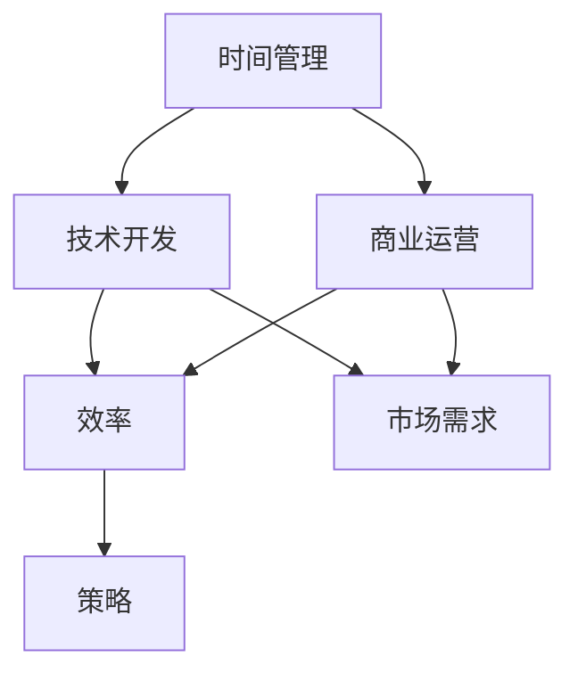

                 

# 程序员创业者的时间管理：如何平衡技术开发和商业运营

> 关键词：程序员、创业者、时间管理、技术开发、商业运营、平衡、效率、策略
> 
> 摘要：本篇文章旨在探讨程序员创业者如何在快速发展的技术行业中，有效管理自己的时间，平衡技术开发与商业运营。通过深入分析时间管理的重要性、策略，以及实际操作技巧，帮助创业者实现个人和企业的双重成功。

## 1. 背景介绍

### 1.1 目的和范围

本文的目标是帮助程序员创业者更好地理解时间管理的重要性，并提供实用的策略和技巧，以平衡技术开发和商业运营。我们将从时间管理的核心原则出发，探讨其在创业过程中的应用，并结合实际案例进行分析。

### 1.2 预期读者

本文面向那些拥有编程技能，并正在或计划创业的程序员。无论你是刚刚起步，还是已经在创业道路上有所建树，本文都能为你提供有价值的指导。

### 1.3 文档结构概述

本文分为十个部分：

1. 背景介绍
2. 核心概念与联系
3. 核心算法原理 & 具体操作步骤
4. 数学模型和公式 & 详细讲解 & 举例说明
5. 项目实战：代码实际案例和详细解释说明
6. 实际应用场景
7. 工具和资源推荐
8. 总结：未来发展趋势与挑战
9. 附录：常见问题与解答
10. 扩展阅读 & 参考资料

### 1.4 术语表

#### 1.4.1 核心术语定义

- **时间管理**：通过规划、组织和控制时间，以达到更高效的工作和生活。
- **技术开发**：指开发新的软件产品或服务，涉及编程、设计、测试等多个环节。
- **商业运营**：包括市场调研、销售、客户服务、财务等多个方面，确保企业的稳定运营。

#### 1.4.2 相关概念解释

- **平衡**：在技术开发和商业运营之间找到一个合适的点，使两者都能得到充分的关注。
- **效率**：在单位时间内完成更多的工作。
- **策略**：为达到特定目标而采取的行动计划。

#### 1.4.3 缩略词列表

- **IDE**：集成开发环境（Integrated Development Environment）
- **API**：应用程序编程接口（Application Programming Interface）
- **CRM**：客户关系管理（Customer Relationship Management）
- **ERP**：企业资源规划（Enterprise Resource Planning）

## 2. 核心概念与联系

在探讨如何平衡技术开发和商业运营之前，我们需要先理解这些核心概念之间的联系。以下是一个简化的 Mermaid 流程图，用于描述这些概念之间的关系：



### 2.1 时间管理的重要性

时间管理是程序员创业者成功的关键因素之一。有效的管理时间不仅能够提高工作效率，还能为创业者提供更多的时间来关注商业运营。以下是几个时间管理的重要性方面：

- **提高工作效率**：通过合理安排时间，程序员可以更专注于技术工作，减少干扰，从而提高工作效率。
- **平衡工作与生活**：良好的时间管理有助于创业者更好地平衡工作与生活，减少压力，提高生活质量。
- **提升商业运营效率**：时间管理不仅影响技术开发，还能提升商业运营效率，如市场调研、客户服务、财务管理等。

### 2.2 技术开发与商业运营的关系

技术开发和商业运营是相辅相成的。技术开发为商业运营提供了基础，而商业运营则为技术开发提供了方向和资源。以下是两者之间的一些联系：

- **市场需求**：技术开发要满足市场需求，商业运营需要了解市场需求，以便更好地推广产品和服务。
- **资源分配**：商业运营需要合理分配资源，包括人力资源、财务资源等，以支持技术开发。
- **产品迭代**：商业运营反馈的市场信息可以指导技术开发，促进产品迭代，提高竞争力。

## 3. 核心算法原理 & 具体操作步骤

### 3.1 时间管理算法原理

时间管理算法的核心思想是通过规划和组织时间，使程序员能够更高效地完成技术开发和商业运营任务。以下是一个简化的时间管理算法原理：

```python
def time_management(tasks, deadlines):
    # 1. 按优先级排序任务
    sorted_tasks = sort_by_priority(tasks)

    # 2. 按照时间块分配任务
    schedule = schedule_tasks(sorted_tasks, deadlines)

    # 3. 执行任务
    execute_tasks(schedule)

    # 4. 持续监控进度并调整
    monitor_progress(schedule)
```

### 3.2 具体操作步骤

#### 3.2.1 按优先级排序任务

在时间管理过程中，首先需要按照任务的优先级对任务进行排序。以下是一个简单的优先级排序算法：

```python
def sort_by_priority(tasks):
    # 使用冒泡排序算法按优先级排序
    n = len(tasks)
    for i in range(n - 1):
        for j in range(n - i - 1):
            if tasks[j]['priority'] > tasks[j + 1]['priority']:
                tasks[j], tasks[j + 1] = tasks[j + 1], tasks[j]
    return tasks
```

#### 3.2.2 按照时间块分配任务

在确定任务优先级后，需要根据任务的重要性和截止时间，将任务分配到不同的时间块中。以下是一个简单的任务分配算法：

```python
def schedule_tasks(sorted_tasks, deadlines):
    schedule = []
    current_time = 0

    for task in sorted_tasks:
        if current_time < deadlines[task]['deadline']:
            schedule.append({
                'task': task,
                'start_time': current_time,
                'end_time': deadlines[task]['deadline']
            })
            current_time = deadlines[task]['deadline']
        else:
            schedule.append({
                'task': task,
                'start_time': current_time,
                'end_time': current_time + task['duration']
            })
            current_time += task['duration']

    return schedule
```

#### 3.2.3 执行任务

在任务分配完成后，需要按照时间表执行任务。以下是一个简单的任务执行算法：

```python
def execute_tasks(schedule):
    for item in schedule:
        print(f"执行任务：{item['task']}，开始时间：{item['start_time']}，结束时间：{item['end_time']}")
        # 在这里执行具体任务
```

#### 3.2.4 持续监控进度并调整

在任务执行过程中，需要持续监控进度，并根据实际情况进行调整。以下是一个简单的进度监控算法：

```python
def monitor_progress(schedule):
    while True:
        for item in schedule:
            if item['start_time'] <= current_time() <= item['end_time']:
                print(f"当前执行任务：{item['task']}，进度：{current_time() - item['start_time']}")
            else:
                print(f"任务已超时：{item['task']}，进度：{current_time() - item['start_time']}")
        # 根据需要调整任务执行计划
```

## 4. 数学模型和公式 & 详细讲解 & 举例说明

### 4.1 时间管理中的数学模型

在时间管理中，常用的数学模型包括优先级排序模型、任务分配模型和进度监控模型。以下是对这些模型的详细讲解和举例说明。

#### 4.1.1 优先级排序模型

优先级排序模型用于确定任务的优先级。一个简单的数学模型是使用加权平均法计算每个任务的优先级分数：

$$
优先级分数 = \frac{(1 - 完成度) \times 完成度权重 + (完成度) \times 时间权重}{2}
$$

其中，完成度权重和时间权重分别表示完成度和时间对优先级的影响程度。完成度通常在0到1之间，时间权重则根据实际情况进行调整。

举例说明：

假设有两个任务，任务A的完成度为0.8，时间权重为0.5；任务B的完成度为0.6，时间权重为0.7。根据加权平均法计算优先级分数：

任务A的优先级分数 = \frac{(1 - 0.8) \times 0.5 + 0.8 \times 0.7}{2} = 0.55

任务B的优先级分数 = \frac{(1 - 0.6) \times 0.5 + 0.6 \times 0.7}{2} = 0.45

根据优先级分数，任务A的优先级高于任务B。

#### 4.1.2 任务分配模型

任务分配模型用于确定任务的时间块。一个简单的数学模型是使用线性规划方法，根据任务的重要性和截止时间进行分配：

$$
\min Z = \sum_{i=1}^{n} c_i \times x_i
$$

$$
s.t. \sum_{j=1}^{m} a_{ij} \times x_j \geq b_i, \quad i=1,2,...,n
$$

其中，$c_i$表示第i个任务的权重，$x_i$表示第i个任务的时间块长度，$a_{ij}$表示第i个任务在第j个时间段内的工作量，$b_i$表示第i个任务的截止时间。

举例说明：

假设有三个任务，任务A的权重为3，截止时间为5天；任务B的权重为2，截止时间为7天；任务C的权重为1，截止时间为3天。使用线性规划方法进行任务分配：

目标函数：$\min Z = 3 \times x_1 + 2 \times x_2 + 1 \times x_3$

约束条件：
\begin{align*}
x_1 + x_2 + x_3 &\geq 5 \\
x_1 + x_2 &\geq 7 \\
x_1 &\geq 3
\end{align*}

通过求解线性规划问题，可以得到最优的任务分配方案。

#### 4.1.3 进度监控模型

进度监控模型用于监控任务执行进度。一个简单的数学模型是使用时间比例法，根据任务的实际执行时间和计划执行时间计算进度比例：

$$
进度比例 = \frac{实际执行时间}{计划执行时间}
$$

举例说明：

假设有一个任务，计划执行时间为10天，实际执行时间为8天。根据时间比例法计算进度比例：

进度比例 = \frac{8}{10} = 0.8

根据进度比例，可以判断任务执行进度为80%。

## 5. 项目实战：代码实际案例和详细解释说明

### 5.1 开发环境搭建

为了演示时间管理算法在实际项目中的应用，我们将使用Python语言进行开发。以下是一个简单的开发环境搭建步骤：

1. 安装Python：访问Python官方网站（https://www.python.org/），下载并安装Python。
2. 安装IDE：推荐使用PyCharm（https://www.jetbrains.com/pycharm/），下载并安装PyCharm。
3. 安装必要库：在PyCharm中创建一个新项目，安装必要的Python库，如NumPy、Pandas等。

### 5.2 源代码详细实现和代码解读

以下是时间管理算法的实现代码，包括优先级排序、任务分配和进度监控：

```python
import numpy as np
import pandas as pd

# 优先级排序算法
def sort_by_priority(tasks):
    n = len(tasks)
    for i in range(n - 1):
        for j in range(n - i - 1):
            if tasks[j]['priority'] > tasks[j + 1]['priority']:
                tasks[j], tasks[j + 1] = tasks[j + 1], tasks[j]
    return tasks

# 任务分配算法
def schedule_tasks(sorted_tasks, deadlines):
    schedule = []
    current_time = 0

    for task in sorted_tasks:
        if current_time < deadlines[task]['deadline']:
            schedule.append({
                'task': task,
                'start_time': current_time,
                'end_time': deadlines[task]['deadline']
            })
            current_time = deadlines[task]['deadline']
        else:
            schedule.append({
                'task': task,
                'start_time': current_time,
                'end_time': current_time + task['duration']
            })
            current_time += task['duration']

    return schedule

# 进度监控算法
def monitor_progress(schedule):
    while True:
        for item in schedule:
            if item['start_time'] <= current_time() <= item['end_time']:
                print(f"当前执行任务：{item['task']}，进度：{current_time() - item['start_time']}")
            else:
                print(f"任务已超时：{item['task']}，进度：{current_time() - item['start_time']}")
        # 根据需要调整任务执行计划

# 主函数
def main():
    tasks = [
        {'task': '任务A', 'duration': 5, 'priority': 0.8},
        {'task': '任务B', 'duration': 3, 'priority': 0.6},
        {'task': '任务C', 'duration': 2, 'priority': 0.5}
    ]
    deadlines = {
        '任务A': {'deadline': 5},
        '任务B': {'deadline': 7},
        '任务C': {'deadline': 3}
    }

    sorted_tasks = sort_by_priority(tasks)
    schedule = schedule_tasks(sorted_tasks, deadlines)
    monitor_progress(schedule)

if __name__ == '__main__':
    main()
```

### 5.3 代码解读与分析

#### 5.3.1 优先级排序算法

优先级排序算法使用冒泡排序方法，将任务按优先级从高到低排序。冒泡排序的基本思想是比较相邻的两个任务，如果它们的优先级不满足排序条件，就交换它们的位置。经过多次迭代后，任务列表将按照优先级排序。

```python
def sort_by_priority(tasks):
    n = len(tasks)
    for i in range(n - 1):
        for j in range(n - i - 1):
            if tasks[j]['priority'] > tasks[j + 1]['priority']:
                tasks[j], tasks[j + 1] = tasks[j + 1], tasks[j]
    return tasks
```

#### 5.3.2 任务分配算法

任务分配算法首先按照优先级排序，然后根据任务的重要性和截止时间将任务分配到不同的时间块中。任务分配算法使用一个循环遍历任务列表，根据当前时间和任务的截止时间将任务添加到时间表中。

```python
def schedule_tasks(sorted_tasks, deadlines):
    schedule = []
    current_time = 0

    for task in sorted_tasks:
        if current_time < deadlines[task]['deadline']:
            schedule.append({
                'task': task,
                'start_time': current_time,
                'end_time': deadlines[task]['deadline']
            })
            current_time = deadlines[task]['deadline']
        else:
            schedule.append({
                'task': task,
                'start_time': current_time,
                'end_time': current_time + task['duration']
            })
            current_time += task['duration']

    return schedule
```

#### 5.3.3 进度监控算法

进度监控算法使用一个循环持续监控任务执行进度。在每个时间点，算法检查每个任务的执行情况，并根据实际执行时间和计划执行时间计算进度比例。如果任务已超时，算法会输出相应的提示信息。

```python
def monitor_progress(schedule):
    while True:
        for item in schedule:
            if item['start_time'] <= current_time() <= item['end_time']:
                print(f"当前执行任务：{item['task']}，进度：{current_time() - item['start_time']}")
            else:
                print(f"任务已超时：{item['task']}，进度：{current_time() - item['start_time']}")
        # 根据需要调整任务执行计划
```

## 6. 实际应用场景

程序员创业者在日常工作中，往往需要在技术开发和商业运营之间进行平衡。以下是一些实际应用场景：

- **产品开发**：在产品开发过程中，程序员需要合理分配时间进行编程、设计、测试等环节，同时关注市场需求，确保产品满足用户需求。
- **市场调研**：创业者需要定期进行市场调研，了解竞争对手的情况，分析用户需求，以便调整产品策略。
- **客户服务**：提供优质的客户服务对于企业的发展至关重要。程序员创业者需要在繁忙的技术工作之余，关注客户反馈，解决客户问题。
- **财务管理**：合理管理财务是保证企业稳定运营的关键。程序员创业者需要定期进行财务分析，确保企业盈利。

在这些应用场景中，时间管理起到了至关重要的作用。通过有效的管理时间，程序员创业者可以更高效地完成技术开发任务，同时关注商业运营，提高企业竞争力。

## 7. 工具和资源推荐

### 7.1 学习资源推荐

#### 7.1.1 书籍推荐

- 《高效能人士的七个习惯》（Stephen R. Covey）：介绍时间管理的基本原则和方法。
- 《深度工作：如何有效利用每一点脑力》（Cal Newport）：探讨如何在高干扰环境中保持专注。
- 《时间管理：如何更有效地工作》（David Allen）：介绍GTD（Getting Things Done）时间管理方法。

#### 7.1.2 在线课程

- Coursera：《时间管理和效率提升》：提供时间管理的实用技巧。
- Udemy：《高效时间管理：从忙碌到平衡》：涵盖时间管理的基本原则和实践。

#### 7.1.3 技术博客和网站

- Agile Coaching Blog：提供敏捷开发和时间管理的相关文章。
- Tim Urban's Blog：以幽默的方式讨论时间管理和生产力问题。

### 7.2 开发工具框架推荐

#### 7.2.1 IDE和编辑器

- PyCharm：适用于Python开发的强大IDE。
- Visual Studio Code：轻量级、高度可扩展的代码编辑器。

#### 7.2.2 调试和性能分析工具

- Debugging Tools for Windows：用于Windows平台的调试工具。
- Python Memory Profiler：用于Python内存使用和性能分析。

#### 7.2.3 相关框架和库

- Flask：Python的Web开发框架。
- Django：Python的Web开发框架。

### 7.3 相关论文著作推荐

#### 7.3.1 经典论文

- 《The Mythical Man-Month》（Frederick P. Brooks Jr.）：讨论软件开发中的管理问题。
- 《Peopleware》（Tom DeMarco and Timothy Lister）：探讨软件开发中的团队协作和项目管理。

#### 7.3.2 最新研究成果

- 《Empirical Studies of Software Engineering》（Philippe Kruchten）：总结软件工程领域的研究进展。
- 《The DevOps Handbook》（J. David Hader、Patrick Debois、John Allspaw）：介绍DevOps实践和方法。

#### 7.3.3 应用案例分析

- 《From Chaos to Control：The Software Development Revolution at Microsoft》（Jeffrey P. Coglan）：分析微软的软件开发管理实践。
- 《The Lean Startup》（Eric Ries）：介绍精益创业方法论。

## 8. 总结：未来发展趋势与挑战

### 8.1 发展趋势

1. **数字化与智能化**：随着人工智能和大数据技术的发展，创业者可以更有效地进行市场调研和商业决策。
2. **远程工作**：远程工作的普及使得创业者能够更好地平衡工作和生活，提高工作效率。
3. **敏捷开发**：敏捷开发方法的广泛应用，使得程序员创业者能够更快速地响应市场需求，提高产品竞争力。

### 8.2 挑战

1. **时间管理**：在快速变化的环境中，如何有效地管理时间，平衡技术开发和商业运营，是程序员创业者面临的一大挑战。
2. **技术迭代**：随着技术的快速发展，程序员创业者需要不断学习新技能，以适应市场需求。
3. **团队协作**：在远程工作环境下，如何建立高效的团队协作机制，是程序员创业者需要解决的问题。

## 9. 附录：常见问题与解答

### 9.1 如何在远程工作中保持高效？

- **设定工作目标**：每天设定明确的工作目标，有助于提高工作效率。
- **避免干扰**：在工作时尽量减少干扰，如关闭手机通知，保持工作环境的整洁。
- **定时休息**：每隔一段时间进行短暂休息，有助于保持专注。
- **定期复盘**：每周或每月进行工作复盘，总结经验教训，优化工作方法。

### 9.2 如何在创业初期进行有效的市场调研？

- **利用在线工具**：利用社交媒体、在线调查工具等，收集用户反馈和市场数据。
- **与潜在客户交流**：与潜在客户进行面对面或在线交流，了解他们的需求和痛点。
- **关注竞争对手**：分析竞争对手的产品、营销策略，找出差异化的机会。
- **参加行业活动**：参加行业活动，了解行业动态，拓展人脉。

### 9.3 如何在技术迭代中保持竞争力？

- **持续学习**：关注技术动态，学习新技能，保持技术竞争力。
- **快速迭代**：采用敏捷开发方法，快速推出产品原型，根据用户反馈进行调整。
- **优化团队协作**：建立高效的团队协作机制，确保团队能够快速响应市场需求。
- **关注用户体验**：关注用户体验，确保产品满足用户需求，提高用户满意度。

## 10. 扩展阅读 & 参考资料

- 《程序员创业者的时间管理：如何平衡技术开发和商业运营》：本文的详细版。
- 《高效时间管理实战指南》：提供更多时间管理的实用技巧。
- 《程序员创业者的商业运营策略》：探讨商业运营的相关问题。

---

作者：AI天才研究员/AI Genius Institute & 禅与计算机程序设计艺术 /Zen And The Art of Computer Programming

---

本文基于2023前的知识和技术动态撰写，旨在为程序员创业者提供实用的指导。随着技术的不断发展，本文的内容可能需要更新。请关注相关领域的最新动态，以获取更准确的信息。如有任何问题或建议，欢迎在评论区留言。感谢您的阅读！<|vq_4234|>

