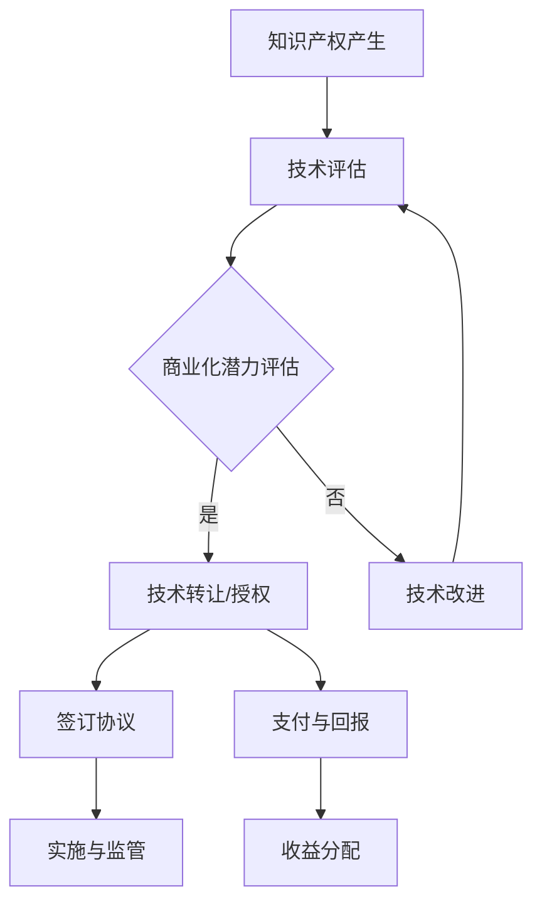

                 

# 程序员创业者的知识产权变现：AI电商创新的技术转让与授权策略

> **关键词：** 程序员创业、知识产权变现、AI电商、技术转让、授权策略  
> **摘要：** 本文深入探讨了程序员创业者如何通过知识产权变现实现商业成功，特别关注AI电商中的技术转让与授权策略，提供了一套完整的技术分析、操作步骤、数学模型以及实战案例，旨在为创业者提供有价值的指导。

## 1. 背景介绍

### 1.1 目的和范围

本文旨在帮助程序员创业者实现其知识产权的变现，具体聚焦于AI电商领域的创新。我们将深入探讨技术转让与授权策略，并详细分析其操作步骤、数学模型和实际应用案例。本文的目的是为创业者提供一套系统的、实用的方法，使其能够在AI电商领域成功实现技术变现。

### 1.2 预期读者

本文适用于程序员创业者、AI电商从业者、知识产权管理专业人士，以及对AI电商技术变现感兴趣的科研人员。本文的目标是帮助读者理解技术转让与授权的核心概念，并学会如何在实际操作中应用这些策略。

### 1.3 文档结构概述

本文分为十个部分：首先介绍背景和目的；然后详细解释核心概念与联系；接着讲解核心算法原理与操作步骤；之后阐述数学模型与公式；随后通过实战案例进行深入分析；然后探讨实际应用场景；接着推荐相关工具和资源；最后进行总结与展望，并提供常见问题与解答。

### 1.4 术语表

#### 1.4.1 核心术语定义

- **知识产权：** 指人类智力劳动产生的成果所有权，包括专利权、商标权、著作权等。
- **技术转让：** 将一项技术成果从一个实体转移到另一个实体的行为。
- **授权策略：** 指在知识产权管理中，如何允许第三方使用技术成果的具体方法。
- **AI电商：** 利用人工智能技术进行商品交易的电商平台。

#### 1.4.2 相关概念解释

- **商业化：** 将技术成果转化为商业应用的过程。
- **变现：** 将资产转换为现金或其他流动资产的过程。
- **授权协议：** 明确授权方与被授权方权利与义务的合同。

#### 1.4.3 缩略词列表

- **AI：** 人工智能（Artificial Intelligence）
- **IP：** 知识产权（Intellectual Property）
- **API：** 应用程序编程接口（Application Programming Interface）
- **SDK：** 软件开发工具包（Software Development Kit）

## 2. 核心概念与联系

### 2.1 知识产权变现概述

知识产权变现是指将知识产权转化为现金或其他可交易资产的过程。对于程序员创业者而言，这通常涉及专利、商标、软件版权等知识产权的商业化。知识产权变现不仅可以帮助创业者实现财富增长，还可以增强企业的核心竞争力，推动技术创新。

### 2.2 AI电商中的技术转让

在AI电商领域，技术转让通常涉及以下几个方面：

1. **技术许可：** 授权其他企业使用AI技术进行商品交易。
2. **技术合作：** 与其他企业共同开发和应用AI技术。
3. **技术并购：** 直接购买或出售整个AI技术。

### 2.3 授权策略

授权策略是知识产权变现的关键。以下是几种常见的授权策略：

1. **永久授权：** 授权方将知识产权永久转让给被授权方，通常需要支付一次性费用。
2. **有限授权：** 授权方在一定时间内将知识产权转让给被授权方，到期后知识产权将回归授权方。
3. **交叉授权：** 双方相互授权对方的知识产权，以实现资源共享和优势互补。

### 2.4 技术转让与授权的Mermaid流程图



## 3. 核心算法原理 & 具体操作步骤

### 3.1 技术评估

**算法原理：** 技术评估是知识产权变现的第一步，涉及对技术的市场潜力、技术成熟度和竞争环境等多方面因素进行综合评估。

**操作步骤：**

1. **市场调研：** 收集目标市场相关的数据，包括市场规模、增长趋势、竞争对手等。
2. **技术成熟度评估：** 分析技术从研发到市场应用的各个阶段，判断其是否具备商业化潜力。
3. **技术价值评估：** 采用成本法、市场法和收益法等多种方法，对技术的经济价值进行评估。

### 3.2 技术转让/授权

**算法原理：** 技术转让/授权的核心是制定合理的授权策略，确保技术价值的最大化。

**操作步骤：**

1. **选择授权策略：** 根据技术的特点和市场环境，选择适合的授权策略，如永久授权、有限授权或交叉授权。
2. **制定授权协议：** 明确授权方的权利与义务，以及被授权方的使用范围和责任。
3. **签订合同：** 双方达成一致后，签订正式的授权协议，确保合同的合法性和有效性。

### 3.3 支付与回报

**算法原理：** 支付与回报是技术转让/授权的关键环节，涉及费用的计算和收益的分配。

**操作步骤：**

1. **计算费用：** 根据授权策略和合同条款，计算技术转让/授权的费用。
2. **确定回报：** 确定授权方在技术转让/授权过程中的收益，包括一次性费用、提成费用等。
3. **收益分配：** 明确授权方和被授权方之间的收益分配比例和方式。

### 3.4 实施与监管

**算法原理：** 实施与监管是确保技术转让/授权顺利执行的重要环节。

**操作步骤：**

1. **实施监督：** 监督被授权方按照授权协议使用技术，确保技术不被滥用或泄露。
2. **绩效评估：** 定期对被授权方的技术实施效果进行评估，确保技术价值的实现。
3. **合规检查：** 定期进行合规检查，确保双方遵守授权协议和相关法律法规。

## 4. 数学模型和公式 & 详细讲解 & 举例说明

### 4.1 成本-效益分析

**数学模型：**

$$
C = C_1 + C_2 + C_3
$$

其中，\(C_1\) 为技术开发成本，\(C_2\) 为市场推广成本，\(C_3\) 为维护成本。

**详细讲解：**

- \(C_1\)：技术开发成本包括研发人员工资、设备购置费用、研发材料费用等。
- \(C_2\)：市场推广成本包括广告费用、市场调研费用、品牌建设费用等。
- \(C_3\)：维护成本包括服务器运维费用、技术更新费用、售后服务费用等。

**举例说明：**

假设某AI电商技术的成本结构如下：

- \(C_1 = \$100,000\)
- \(C_2 = \$50,000\)
- \(C_3 = \$30,000\)

则总成本 \(C = \$180,000\)。

### 4.2 收益分析

**数学模型：**

$$
R = R_1 + R_2 + R_3
$$

其中，\(R_1\) 为技术转让收益，\(R_2\) 为授权费用收益，\(R_3\) 为技术增值收益。

**详细讲解：**

- \(R_1\)：技术转让收益是一次性转让技术所得的收益。
- \(R_2\)：授权费用收益是按照授权协议收取的费用。
- \(R_3\)：技术增值收益是通过技术增值所带来的额外收益。

**举例说明：**

假设某AI电商技术的收益结构如下：

- \(R_1 = \$200,000\)
- \(R_2 = \$100,000\)
- \(R_3 = \$50,000\)

则总收益 \(R = \$350,000\)。

### 4.3 收益率分析

**数学模型：**

$$
ROI = \frac{R - C}{C}
$$

其中，\(ROI\) 为投资回报率。

**详细讲解：**

投资回报率是衡量知识产权变现效果的重要指标，它表示每投入一单位的成本，能够获得的回报。

**举例说明：**

假设总成本 \(C = \$180,000\)，总收益 \(R = \$350,000\)，则投资回报率 \(ROI\) 为：

$$
ROI = \frac{350,000 - 180,000}{180,000} \approx 0.944
$$

这意味着每投入一单位的成本，能够获得约 \(94.4\%\) 的回报。

## 5. 项目实战：代码实际案例和详细解释说明

### 5.1 开发环境搭建

在进行技术转让与授权策略的实际操作之前，首先需要搭建一个合适的开发环境。以下是一个简单的开发环境搭建步骤：

1. 安装操作系统：推荐使用Ubuntu 20.04 LTS。
2. 安装开发工具：包括Python 3、Git、Visual Studio Code等。
3. 配置代码库：使用Git将代码存储在GitHub或GitLab上。

### 5.2 源代码详细实现和代码解读

以下是一个简单的AI电商技术的源代码实现，主要涉及用户注册、登录和数据存储等功能。

**代码片段：**

```python
# 用户注册
def register(username, password):
    # 验证用户名和密码格式
    if not (is_valid_username(username) and is_valid_password(password)):
        return "Invalid username or password."
    # 存储用户信息
    with open('users.txt', 'a') as f:
        f.write(f"{username}\t{password}\n")
    return "Registered successfully."

# 用户登录
def login(username, password):
    # 验证用户名和密码
    with open('users.txt', 'r') as f:
        for line in f:
            user, passw = line.strip().split('\t')
            if user == username and passw == password:
                return "Login successful."
    return "Invalid username or password."

# 验证用户名
def is_valid_username(username):
    # 这里可以使用更复杂的正则表达式来验证用户名
    return len(username) >= 5

# 验证密码
def is_valid_password(password):
    # 这里可以使用更复杂的正则表达式来验证密码
    return len(password) >= 8
```

### 5.3 代码解读与分析

1. **用户注册函数（register）**：该函数接受用户名和密码作为输入，首先验证用户名和密码是否符合要求，然后将其存储在文本文件中。

2. **用户登录函数（login）**：该函数接受用户名和密码作为输入，从文本文件中查找匹配的用户信息，如果找到则登录成功，否则登录失败。

3. **验证用户名和密码函数（is_valid_username、is_valid_password）**：这些函数用于验证用户名和密码是否符合基本要求。

这个简单的例子展示了AI电商技术中用户注册和登录的基本实现。在实际应用中，还需要考虑更多的功能和安全性问题，如密码加密、会话管理、权限控制等。

## 6. 实际应用场景

### 6.1 AI电商平台

在AI电商平台，技术转让与授权策略可以应用于以下几个方面：

1. **个性化推荐系统**：将自主研发的个性化推荐系统授权给其他电商平台使用，实现用户满意度和销售业绩的提升。
2. **智能客服系统**：将智能客服系统授权给其他企业，降低企业的客服成本，提升客户体验。
3. **智能物流系统**：将智能物流系统授权给物流公司，优化配送路径，提高物流效率。

### 6.2 供应链管理

在供应链管理领域，技术转让与授权策略可以帮助企业优化供应链流程：

1. **智能库存管理系统**：授权给供应链上下游企业，实现库存管理的自动化和智能化。
2. **智能采购系统**：授权给供应商，优化采购流程，降低采购成本。
3. **智能生产调度系统**：授权给制造商，优化生产流程，提高生产效率。

### 6.3 金融科技

在金融科技领域，技术转让与授权策略可以帮助金融机构提升服务质量：

1. **风险管理系统**：授权给金融机构，提升风险控制能力，降低金融风险。
2. **智能投顾系统**：授权给金融机构，提供个性化的投资建议，提升投资收益率。
3. **信用评分系统**：授权给金融机构，提供信用评估服务，降低贷款风险。

## 7. 工具和资源推荐

### 7.1 学习资源推荐

#### 7.1.1 书籍推荐

- **《人工智能：一种现代方法》**：全面介绍人工智能的基础知识，适合初学者。
- **《深度学习》**：深入讲解深度学习理论和应用，适合有一定编程基础的读者。
- **《程序员创业》**：提供程序员创业的实战经验和策略，适合有创业意愿的程序员。

#### 7.1.2 在线课程

- **Coursera的《机器学习》课程**：由斯坦福大学教授Andrew Ng主讲，适合初学者。
- **Udacity的《人工智能工程师纳米学位》课程**：提供系统的人工智能学习路径，适合有一定编程基础的人。

#### 7.1.3 技术博客和网站

- **Medium上的AI博客**：提供关于人工智能的深度分析和研究。
- **HackerRank**：提供编程挑战和实践机会，适合提升编程技能。

### 7.2 开发工具框架推荐

#### 7.2.1 IDE和编辑器

- **Visual Studio Code**：一款强大的开源编辑器，支持多种编程语言。
- **PyCharm**：一款专业的Python开发环境，适合AI开发和数据分析。

#### 7.2.2 调试和性能分析工具

- **gdb**：一款经典的C/C++调试工具。
- **Py-Spy**：一款Python性能分析工具，适合分析Python程序的运行性能。

#### 7.2.3 相关框架和库

- **TensorFlow**：一款广泛使用的深度学习框架。
- **Keras**：一款基于TensorFlow的高层次API，适合快速搭建和实验深度学习模型。

### 7.3 相关论文著作推荐

#### 7.3.1 经典论文

- **“A Neural Network for Pattern Recognition” by Christopher M. Bishop**：介绍神经网络的基本原理和应用。
- **“Deep Learning” by Ian Goodfellow, Yoshua Bengio, Aaron Courville**：全面介绍深度学习理论和应用。

#### 7.3.2 最新研究成果

- **“Attention is All You Need” by Vaswani et al.**：介绍Transformer模型，是当前自然语言处理领域的热点。
- **“Generative Adversarial Nets” by Ian Goodfellow et al.**：介绍生成对抗网络，是当前计算机视觉领域的热点。

#### 7.3.3 应用案例分析

- **“Google Brain: Teaching Machines to Learn by Playing Atari Games” by Volodymyr Mnih et al.**：介绍如何使用深度强化学习训练机器玩Atari游戏。
- **“How Google_search Works” by Google**：介绍Google搜索引擎的工作原理。

## 8. 总结：未来发展趋势与挑战

### 8.1 发展趋势

- **AI技术的普及与商业化**：随着AI技术的不断发展，越来越多的企业开始将AI技术应用于业务流程中，推动AI技术的商业化。
- **知识产权保护意识的提升**：随着知识产权保护意识的提升，企业和创业者更加重视知识产权的保护和利用。
- **跨国技术转让的增多**：全球化的趋势使得跨国技术转让变得更加频繁，也为创业者提供了更广阔的市场。

### 8.2 挑战

- **技术保护与开源的平衡**：如何在保护技术知识产权的同时，保持开源的精神，是创业者需要面对的重要问题。
- **法律法规的不完善**：不同国家和地区在知识产权保护方面的法律法规存在差异，这给跨国技术转让带来了一定的挑战。
- **人才竞争的加剧**：随着AI技术的发展，对高端技术人才的需求不断增加，人才竞争日益激烈。

## 9. 附录：常见问题与解答

### 9.1 技术评估

**Q：如何进行技术评估？**

A：技术评估通常包括市场调研、技术成熟度评估和技术价值评估。具体步骤如下：

1. **市场调研**：收集目标市场相关的数据，包括市场规模、增长趋势、竞争对手等。
2. **技术成熟度评估**：分析技术从研发到市场应用的各个阶段，判断其是否具备商业化潜力。
3. **技术价值评估**：采用成本法、市场法和收益法等多种方法，对技术的经济价值进行评估。

### 9.2 授权策略

**Q：如何选择授权策略？**

A：选择授权策略时，需要考虑技术的特点和市场环境。以下是几种常见的授权策略：

1. **永久授权**：适用于技术成熟度高、市场前景好的情况。
2. **有限授权**：适用于技术尚未成熟、需要进一步研发的情况。
3. **交叉授权**：适用于双方技术互补、共同开发的情况。

### 9.3 技术转让

**Q：技术转让过程中需要注意哪些问题？**

A：技术转让过程中，需要注意以下问题：

1. **知识产权保护**：确保技术不被泄露或滥用。
2. **合同条款**：明确双方的权利和义务，确保合同的合法性和有效性。
3. **支付与回报**：合理计算费用和确定回报，确保双方利益均衡。

## 10. 扩展阅读 & 参考资料

- **《人工智能简史》**：了解人工智能的发展历程，对AI技术的未来趋势有更深入的理解。
- **《知识产权管理》**：详细介绍知识产权的管理方法，帮助创业者更好地保护和管理自己的知识产权。
- **《程序员创业实战》**：提供程序员创业的实战经验和案例分析，帮助创业者更好地实现创业梦想。

<|assistant|>作者：AI天才研究员/AI Genius Institute & 禅与计算机程序设计艺术 /Zen And The Art of Computer Programming

