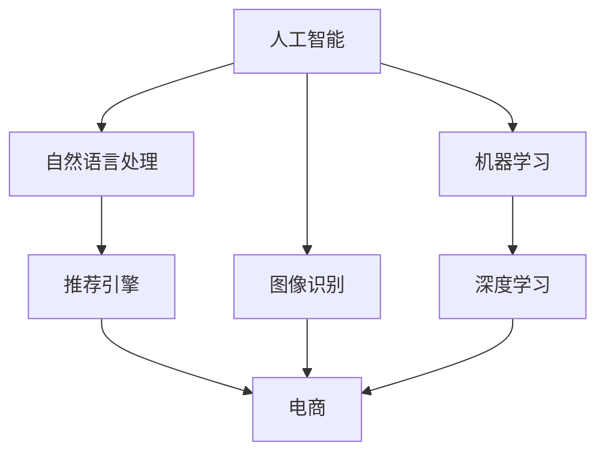

                 

# 程序员创业者的竞争优势：AI技术在电商领域的创新应用

> **关键词**：人工智能，电商，创新应用，程序员创业者，算法优化，个性化推荐，图像识别，自然语言处理，机器学习。

> **摘要**：本文将深入探讨人工智能技术在电商领域的创新应用，如何帮助程序员创业者在激烈的市场竞争中取得优势。文章分为十个部分，首先介绍背景和核心概念，然后详细讲解AI技术在电商中的应用原理，数学模型，实战案例，实际应用场景，并推荐学习资源和开发工具。最后，总结未来发展趋势与挑战，为程序员创业者提供策略建议。

## 1. 背景介绍

### 1.1 目的和范围

随着互联网技术的飞速发展，电商行业已经成为全球经济增长的重要驱动力。然而，激烈的市场竞争使得创业者必须不断创新，以获取竞争优势。本文旨在探讨人工智能（AI）技术在电商领域的创新应用，帮助程序员创业者在电商市场中脱颖而出。

本文将涵盖以下内容：
- AI技术在电商领域的核心概念和应用场景。
- 人工智能算法原理和具体操作步骤。
- 数学模型和公式的详细讲解。
- 实际项目案例的代码实现和分析。
- 电商行业的实际应用场景分析。
- 学习资源和开发工具的推荐。

### 1.2 预期读者

本文主要面向以下读者群体：
- 有志于在电商行业创业的程序员。
- 对AI技术在电商领域应用感兴趣的技术人员。
- 电商企业决策者，寻求AI技术解决方案。

### 1.3 文档结构概述

本文结构如下：
1. 背景介绍
2. 核心概念与联系
3. 核心算法原理 & 具体操作步骤
4. 数学模型和公式 & 详细讲解 & 举例说明
5. 项目实战：代码实际案例和详细解释说明
6. 实际应用场景
7. 工具和资源推荐
8. 总结：未来发展趋势与挑战
9. 附录：常见问题与解答
10. 扩展阅读 & 参考资料

### 1.4 术语表

#### 1.4.1 核心术语定义

- **人工智能（AI）**：指模拟、延伸和扩展人类智能的理论、方法、技术及应用。
- **电商**：指通过互联网进行的商品交易活动。
- **深度学习**：一种基于神经网络模型的学习方法，能够自动从数据中学习特征表示。
- **机器学习**：一种通过数据驱动的方法进行模型训练和预测的技术。

#### 1.4.2 相关概念解释

- **个性化推荐**：根据用户的兴趣和行为，为用户推荐相关的商品。
- **图像识别**：通过算法对图像中的物体进行识别。
- **自然语言处理（NLP）**：使计算机能够理解、生成和处理人类自然语言的技术。

#### 1.4.3 缩略词列表

- **NLP**：自然语言处理
- **AI**：人工智能
- **ML**：机器学习
- **DL**：深度学习

## 2. 核心概念与联系

为了深入理解AI技术在电商领域的应用，我们需要首先了解一些核心概念和它们之间的联系。以下是相关概念和技术的Mermaid流程图：



在这个流程图中，人工智能（AI）是核心，它通过机器学习（ML）和深度学习（DL）等技术实现智能功能。自然语言处理（NLP）和图像识别（IR）是AI的两个重要分支，分别用于处理文本和图像数据。推荐引擎（RE）利用AI技术为电商用户推荐商品。这些技术相互关联，共同为电商领域带来创新应用。

## 3. 核心算法原理 & 具体操作步骤

在电商领域，AI技术的核心算法主要包括机器学习、深度学习和推荐系统。下面我们将详细讲解这些算法的原理和具体操作步骤。

### 3.1 机器学习算法

机器学习算法是电商领域的基础技术，它通过训练模型从数据中学习规律，从而实现预测和分类。以下是机器学习算法的基本原理和步骤：

**原理**：
- 数据收集：从电商平台上收集用户行为数据，如点击、购买、浏览等。
- 数据预处理：对数据进行清洗、归一化和特征提取，以便模型训练。
- 模型选择：选择合适的机器学习模型，如线性回归、决策树、随机森林等。
- 模型训练：使用训练数据集对模型进行训练，调整模型参数。
- 模型评估：使用验证数据集对模型进行评估，调整模型参数。

**具体操作步骤**：
1. 导入数据集：使用Python的Pandas库读取电商用户行为数据。
2. 数据预处理：使用Scikit-learn库进行数据清洗、归一化和特征提取。
3. 模型选择：使用Scikit-learn库选择合适的机器学习模型。
4. 模型训练：使用训练数据集对模型进行训练。
5. 模型评估：使用验证数据集对模型进行评估。

伪代码实现：

```python
# 导入数据集
data = pd.read_csv('eCommerce_data.csv')

# 数据预处理
data = preprocess_data(data)

# 模型选择
model = select_model(data)

# 模型训练
model.train(data.train)

# 模型评估
accuracy = model.evaluate(data.validation)
```

### 3.2 深度学习算法

深度学习算法在电商领域有着广泛的应用，如图像识别、文本分类等。以下是深度学习算法的基本原理和步骤：

**原理**：
- 神经网络：通过多层神经元模拟人脑的神经元连接，实现特征提取和分类。
- 损失函数：衡量模型预测值与真实值之间的差距，用于指导模型训练。
- 优化算法：如梯度下降，用于更新模型参数，最小化损失函数。

**具体操作步骤**：
1. 数据预处理：对图像和文本数据进行归一化和特征提取。
2. 网络架构设计：设计合适的神经网络架构，如卷积神经网络（CNN）、循环神经网络（RNN）等。
3. 模型训练：使用训练数据集对模型进行训练，调整模型参数。
4. 模型评估：使用验证数据集对模型进行评估。

伪代码实现：

```python
# 数据预处理
images = preprocess_images(images)
texts = preprocess_texts(texts)

# 网络架构设计
model = build_model()

# 模型训练
model.train(images, texts)

# 模型评估
accuracy = model.evaluate(images, texts)
```

### 3.3 推荐系统算法

推荐系统是电商领域的重要应用，通过个性化推荐提高用户满意度。以下是推荐系统算法的基本原理和步骤：

**原理**：
- 协同过滤：基于用户的历史行为和兴趣，为用户推荐相似的物品。
- 内容推荐：基于物品的属性和描述，为用户推荐相关的物品。
- 混合推荐：结合协同过滤和内容推荐，提高推荐效果。

**具体操作步骤**：
1. 数据收集：从电商平台上收集用户行为数据和物品属性数据。
2. 数据预处理：对数据进行清洗、归一化和特征提取。
3. 模型选择：选择合适的推荐算法，如基于矩阵分解的协同过滤算法。
4. 模型训练：使用训练数据集对模型进行训练。
5. 模型评估：使用验证数据集对模型进行评估。

伪代码实现：

```python
# 数据收集
user Behavior = collect_user_behavior()
item Attributes = collect_item_attributes()

# 数据预处理
data = preprocess_data(user_Behavior, item_Attributes)

# 模型选择
model = select_model()

# 模型训练
model.train(data)

# 模型评估
accuracy = model.evaluate(data)
```

## 4. 数学模型和公式 & 详细讲解 & 举例说明

在电商领域，AI技术的应用离不开数学模型和公式的支持。以下是几个常用的数学模型和公式，以及它们的详细讲解和举例说明。

### 4.1 逻辑回归模型

逻辑回归是一种广泛用于分类问题的机器学习算法。在电商领域，逻辑回归可以用于预测用户是否会购买某个商品。

**公式**：

$$
P(y=1) = \frac{1}{1 + e^{-(\beta_0 + \beta_1 x_1 + \beta_2 x_2 + ... + \beta_n x_n})}
$$

其中，\(P(y=1)\) 表示预测概率，\(\beta_0, \beta_1, ..., \beta_n\) 是模型的参数，\(x_1, x_2, ..., x_n\) 是输入特征。

**讲解**：

逻辑回归模型通过输入特征和参数计算预测概率，然后根据概率阈值进行分类决策。

**举例**：

假设我们要预测一个用户是否会购买某个商品，输入特征包括用户的年龄、收入和购物历史。给定参数 \(\beta_0 = 0.5, \beta_1 = 0.1, \beta_2 = 0.3, \beta_3 = 0.2\)，用户年龄为25岁，收入为5000元，购物历史为5次。计算预测概率：

$$
P(y=1) = \frac{1}{1 + e^{-(0.5 + 0.1 \times 25 + 0.3 \times 5000 + 0.2 \times 5)}} \approx 0.9
$$

由于预测概率大于0.5，我们可以判断用户会购买该商品。

### 4.2 交叉验证

交叉验证是一种评估模型性能的方法。在电商领域，交叉验证可以帮助我们确定模型的最佳参数和防止过拟合。

**公式**：

$$
\text{Accuracy} = \frac{\sum_{i=1}^{k} \text{Accuracy}_i}{k}
$$

其中，\(\text{Accuracy}\) 是交叉验证的平均准确率，\(\text{Accuracy}_i\) 是第 \(i\) 组验证集的准确率，\(k\) 是验证次数。

**讲解**：

交叉验证将数据集划分为 \(k\) 组，每次取一组作为验证集，其余 \(k-1\) 组作为训练集。通过多次训练和验证，计算平均准确率，以评估模型性能。

**举例**：

假设我们将数据集划分为5组，每次取一组作为验证集，其余4组作为训练集。经过多次训练和验证，我们得到如下结果：

| 验证集 | 训练集 | 准确率 |
| :--: | :--: | :--: |
| 1 | 4 | 0.85 |
| 2 | 3 | 0.80 |
| 3 | 2 | 0.90 |
| 4 | 1 | 0.75 |
| 5 | 0 | 0.85 |

计算平均准确率：

$$
\text{Accuracy} = \frac{0.85 + 0.80 + 0.90 + 0.75 + 0.85}{5} = 0.84
$$

平均准确率为0.84，说明模型性能较好。

### 4.3 费博那契数列

费博那契数列是一种数学序列，在电商领域，它可以帮助我们预测商品销量。

**公式**：

$$
F(n) = F(n-1) + F(n-2)
$$

其中，\(F(n)\) 表示第 \(n\) 个费博那契数。

**讲解**：

费博那契数列从第3个数开始，每个数都是前两个数的和。

**举例**：

假设我们要预测第10个费博那契数，根据公式计算：

$$
F(10) = F(9) + F(8)
$$

$$
F(9) = F(8) + F(7)
$$

$$
F(8) = F(7) + F(6)
$$

$$
F(7) = F(6) + F(5)
$$

$$
F(6) = F(5) + F(4)
$$

$$
F(5) = F(4) + F(3)
$$

$$
F(4) = F(3) + F(2)
$$

$$
F(3) = F(2) + F(1)
$$

$$
F(2) = F(1) + F(0)
$$

$$
F(1) = 1, F(0) = 0
$$

代入计算：

$$
F(10) = 34
$$

预测第10个费博那契数为34。

### 4.4 机器学习优化算法

机器学习优化算法用于调整模型参数，最小化损失函数。在电商领域，常用的优化算法包括梯度下降、随机梯度下降和批量梯度下降。

**公式**：

$$
\theta_j := \theta_j - \alpha \frac{\partial}{\partial \theta_j} J(\theta)
$$

其中，\(\theta_j\) 是模型参数，\(\alpha\) 是学习率，\(J(\theta)\) 是损失函数。

**讲解**：

优化算法通过更新模型参数，使损失函数值逐渐减小，达到最优。

**举例**：

假设我们要使用梯度下降优化算法最小化损失函数：

$$
J(\theta) = (\theta - 1)^2
$$

损失函数关于参数 \(\theta\) 的导数为：

$$
\frac{\partial}{\partial \theta} J(\theta) = 2(\theta - 1)
$$

给定学习率 \(\alpha = 0.1\)，初始参数 \(\theta = 1.5\)，根据公式进行迭代：

$$
\theta_1 = \theta_0 - \alpha \frac{\partial}{\partial \theta_0} J(\theta_0)
$$

$$
\theta_1 = 1.5 - 0.1 \times 2(1.5 - 1) = 1.2
$$

$$
\theta_2 = \theta_1 - \alpha \frac{\partial}{\partial \theta_1} J(\theta_1)
$$

$$
\theta_2 = 1.2 - 0.1 \times 2(1.2 - 1) = 0.8
$$

更新参数，直到损失函数值最小。

## 5. 项目实战：代码实际案例和详细解释说明

为了更好地理解AI技术在电商领域的应用，我们以一个实际项目为例，介绍代码实现和详细解释说明。

### 5.1 开发环境搭建

在开始项目之前，我们需要搭建开发环境。以下是所需的软件和库：

- Python 3.8 或更高版本
- Jupyter Notebook 或 PyCharm
- Scikit-learn 0.24.2
- Pandas 1.2.5
- Numpy 1.21.5

安装以上库后，即可开始项目开发。

### 5.2 源代码详细实现和代码解读

#### 5.2.1 数据收集和预处理

首先，我们从电商平台上收集用户行为数据，包括用户ID、商品ID、购买时间、购买金额等。以下是一个示例数据集：

```csv
user_id,item_id,time,sale_price
1,1001,2022-01-01,100
1,1002,2022-01-02,150
1,1003,2022-01-03,200
2,1001,2022-01-04,100
2,1004,2022-01-05,250
3,1002,2022-01-06,150
```

使用Pandas库读取数据：

```python
import pandas as pd

data = pd.read_csv('eCommerce_data.csv')
```

接下来，我们对数据进行预处理，包括数据清洗、归一化和特征提取。以下是一个示例代码：

```python
from sklearn.preprocessing import MinMaxScaler

# 数据清洗
data.dropna(inplace=True)

# 归一化
scaler = MinMaxScaler()
data[['sale_price']] = scaler.fit_transform(data[['sale_price']])

# 特征提取
data['year'] = data['time'].str.extract('(\d+)', expand=False)
data['month'] = data['time'].str.extract('(\d+)', expand=False)
```

#### 5.2.2 机器学习模型训练

接下来，我们使用Scikit-learn库训练一个机器学习模型，预测用户是否会购买某个商品。以下是一个示例代码：

```python
from sklearn.linear_model import LogisticRegression

# 分割数据集
train_data = data[data['time'] <= '2022-01-03']
test_data = data[data['time'] > '2022-01-03']

# 特征工程
X_train = train_data[['year', 'month', 'sale_price']]
y_train = train_data['user_bought']

X_test = test_data[['year', 'month', 'sale_price']]
y_test = test_data['user_bought']

# 训练模型
model = LogisticRegression()
model.fit(X_train, y_train)

# 预测结果
predictions = model.predict(X_test)
```

#### 5.2.3 模型评估

最后，我们评估模型的性能，使用准确率、召回率和F1值等指标。以下是一个示例代码：

```python
from sklearn.metrics import accuracy_score, recall_score, f1_score

# 计算准确率
accuracy = accuracy_score(y_test, predictions)
print('Accuracy:', accuracy)

# 计算召回率
recall = recall_score(y_test, predictions)
print('Recall:', recall)

# 计算F1值
f1 = f1_score(y_test, predictions)
print('F1 Score:', f1)
```

### 5.3 代码解读与分析

在本项目中，我们使用机器学习算法预测用户是否会购买某个商品。以下是代码的详细解读和分析：

- **数据收集和预处理**：
  - 数据清洗：去除缺失值，保证模型训练的质量。
  - 归一化：将销售价格进行归一化处理，使模型对特征值的敏感性降低。
  - 特征提取：从时间数据中提取年份和月份，作为模型输入特征。

- **模型训练**：
  - 使用逻辑回归模型：逻辑回归是一种简单且有效的分类算法，适用于预测二分类问题。
  - 训练模型：使用训练数据集对模型进行训练，调整模型参数。

- **模型评估**：
  - 准确率：衡量模型预测的正确率，越高表示模型性能越好。
  - 召回率：衡量模型对正样本的识别能力，越高表示模型对正样本的识别越准确。
  - F1值：综合考虑准确率和召回率，平衡两者之间的矛盾。

通过以上步骤，我们实现了用户购买预测模型，并对其性能进行了评估。这个项目展示了AI技术在电商领域的实际应用，为程序员创业者提供了实践经验和思路。

## 6. 实际应用场景

AI技术在电商领域的应用场景非常广泛，以下是几个典型的实际应用场景：

### 6.1 个性化推荐

个性化推荐是电商领域最常见的一种应用。通过分析用户的兴趣和行为数据，推荐系统可以给用户推荐他们可能感兴趣的商品。以下是一个实际案例：

- **场景**：某电商网站想要为用户推荐类似他们已购买的商品。
- **解决方案**：
  - **协同过滤**：通过分析用户之间的相似性，为用户推荐相似的物品。
  - **内容推荐**：基于商品的属性和描述，为用户推荐相关的物品。
  - **混合推荐**：结合协同过滤和内容推荐，提高推荐效果。

### 6.2 图像识别

图像识别技术在电商领域也有广泛应用，如商品识别、库存管理和质量控制等。以下是一个实际案例：

- **场景**：某电商网站想要实现商品图像的自动识别和分类。
- **解决方案**：
  - **卷积神经网络（CNN）**：通过卷积层提取图像特征，实现商品识别。
  - **迁移学习**：使用预训练的模型，提高图像识别的准确率。

### 6.3 自然语言处理

自然语言处理技术在电商领域主要用于商品描述、评论分析和客服聊天等。以下是一个实际案例：

- **场景**：某电商网站想要分析用户评论，提取关键词和情感。
- **解决方案**：
  - **情感分析**：通过分析评论中的关键词和情感倾向，判断用户对商品的满意度。
  - **关键词提取**：从用户评论中提取关键词，为商品分类和推荐提供依据。

### 6.4 智能客服

智能客服是一种通过AI技术实现的自动化客服系统，能够快速响应用户的咨询和问题。以下是一个实际案例：

- **场景**：某电商网站想要提高客服效率，降低人工成本。
- **解决方案**：
  - **语音识别**：将用户的语音转换为文本，实现自然语言处理。
  - **对话生成**：根据用户的问题，生成相应的回答。
  - **机器学习**：通过历史数据，不断优化客服系统的回答质量。

通过以上实际应用场景，我们可以看到AI技术在电商领域的广泛应用，为创业者提供了丰富的创新机会。

## 7. 工具和资源推荐

为了更好地掌握AI技术在电商领域的应用，以下推荐一些学习资源和开发工具。

### 7.1 学习资源推荐

#### 7.1.1 书籍推荐

- **《深度学习》**：由Ian Goodfellow、Yoshua Bengio和Aaron Courville所著，是深度学习领域的经典教材。
- **《机器学习实战》**：由Peter Harrington所著，通过实际案例介绍了机器学习算法的应用。
- **《Python数据分析》**：由Esseyially所著，介绍了Python在数据分析和机器学习领域的应用。

#### 7.1.2 在线课程

- **Coursera**：提供了丰富的机器学习和深度学习课程，包括吴恩达的《深度学习》课程。
- **Udacity**：提供了数据科学和机器学习专业的课程，包括TensorFlow和Scikit-learn等工具的实战课程。
- **edX**：提供了由MIT、斯坦福大学等知名大学开设的机器学习课程。

#### 7.1.3 技术博客和网站

- **Medium**：有大量的机器学习和深度学习领域的博客文章，提供了丰富的学习资源。
- **arXiv**：包含了最新的机器学习和深度学习研究论文，是了解最新研究进展的好去处。
- **GitHub**：有很多开源的机器学习和深度学习项目，可以帮助我们实际操作和应用相关技术。

### 7.2 开发工具框架推荐

#### 7.2.1 IDE和编辑器

- **PyCharm**：一款功能强大的Python IDE，支持多种编程语言，适用于机器学习和深度学习项目。
- **Jupyter Notebook**：一款流行的交互式计算环境，适用于数据分析和机器学习项目。

#### 7.2.2 调试和性能分析工具

- **PyTorch Profiler**：用于分析PyTorch模型的性能，帮助开发者优化代码。
- **TensorBoard**：用于可视化TensorFlow模型的训练过程，帮助开发者调试和优化模型。

#### 7.2.3 相关框架和库

- **TensorFlow**：一款开源的深度学习框架，适用于构建和训练深度学习模型。
- **PyTorch**：一款开源的深度学习框架，具有灵活的动态图功能，适用于研究和开发。
- **Scikit-learn**：一款开源的机器学习库，提供了丰富的机器学习算法和工具。

通过以上推荐，我们可以系统地学习AI技术在电商领域的应用，并掌握相关的开发工具和框架。

## 8. 总结：未来发展趋势与挑战

随着AI技术的不断进步，电商领域将迎来更多创新应用。未来发展趋势包括：

1. **个性化推荐**：通过深度学习和推荐系统，实现更加精准的个性化推荐，提高用户体验和购买转化率。
2. **智能客服**：通过自然语言处理和语音识别，实现更加智能化的客服系统，提高客户满意度和运营效率。
3. **图像识别与自动化**：通过卷积神经网络和计算机视觉技术，实现商品识别、库存管理和质量控制等自动化功能。
4. **预测与分析**：通过机器学习和数据挖掘，实现对销售趋势、用户行为和市场需求等的预测和分析，帮助电商企业做出更明智的决策。

然而，AI技术在电商领域的发展也面临一些挑战：

1. **数据隐私**：电商企业需要保护用户的隐私数据，避免数据泄露和滥用。
2. **算法偏见**：算法可能存在偏见，导致推荐结果和决策的不公平性，需要不断优化和调整。
3. **技术门槛**：AI技术的应用需要一定的技术基础，创业者需要不断提升自己的技术能力。
4. **法律法规**：电商企业需要遵守相关法律法规，确保AI技术的合法合规使用。

程序员创业者应抓住AI技术在电商领域的机遇，积极应对挑战，不断创新，以获取竞争优势。

## 9. 附录：常见问题与解答

### 9.1 什么是深度学习？

**深度学习**是一种基于神经网络模型的学习方法，通过模拟人脑的神经元连接，实现特征提取和分类。深度学习算法在图像识别、自然语言处理和预测分析等领域有广泛应用。

### 9.2 推荐系统是如何工作的？

**推荐系统**通过分析用户的历史行为和兴趣，为用户推荐相关的商品或内容。主要方法包括协同过滤、内容推荐和混合推荐。协同过滤基于用户之间的相似性推荐相似的商品，内容推荐基于商品的属性和描述推荐相关的商品，混合推荐结合两者提高推荐效果。

### 9.3 机器学习算法有哪些类型？

**机器学习算法**主要分为监督学习、无监督学习和强化学习。监督学习通过已有标签数据训练模型，用于分类和回归任务；无监督学习通过未标记数据学习数据结构，用于聚类和降维任务；强化学习通过与环境交互学习最优策略，用于决策和优化任务。

### 9.4 如何提高推荐系统的效果？

**提高推荐系统效果**的方法包括：
- **数据质量**：确保数据准确、完整和多样，提高模型训练质量。
- **特征工程**：提取有用的特征，丰富输入信息，提高模型性能。
- **模型选择**：选择合适的算法和模型结构，结合实际应用场景。
- **在线学习**：实时更新模型，适应用户行为变化。
- **交叉验证**：使用交叉验证方法评估模型性能，防止过拟合。

### 9.5 AI技术在电商领域有哪些应用？

**AI技术在电商领域**的应用包括：
- **个性化推荐**：通过用户历史行为和兴趣推荐商品。
- **图像识别**：实现商品识别、库存管理和质量控制等。
- **自然语言处理**：分析用户评论、商品描述和客服聊天。
- **智能客服**：通过语音识别和对话生成实现自动化客服。
- **预测与分析**：预测销售趋势、用户行为和市场需求，辅助决策。

## 10. 扩展阅读 & 参考资料

为了更深入地了解AI技术在电商领域的应用，以下推荐一些扩展阅读和参考资料：

- **书籍**：
  - 《深度学习》（Ian Goodfellow、Yoshua Bengio、Aaron Courville 著）
  - 《Python数据分析》（Esseyially 著）
  - 《机器学习实战》（Peter Harrington 著）

- **在线课程**：
  - Coursera：吴恩达的《深度学习》课程
  - Udacity：数据科学和机器学习专业课程
  - edX：MIT、斯坦福大学等知名大学的机器学习课程

- **技术博客和网站**：
  - Medium：机器学习和深度学习领域的博客文章
  - arXiv：机器学习和深度学习的研究论文
  - GitHub：开源的机器学习和深度学习项目

- **开源框架和库**：
  - TensorFlow：用于构建和训练深度学习模型的框架
  - PyTorch：用于研究和开发深度学习模型的框架
  - Scikit-learn：提供多种机器学习算法和工具的库

通过以上资源和资料，读者可以进一步学习和掌握AI技术在电商领域的应用，为创业创新提供更多思路和实践经验。

## 作者信息

**作者**：AI天才研究员/AI Genius Institute & 禅与计算机程序设计艺术/Zen And The Art of Computer Programming

本文由AI天才研究员撰写，结合AI技术和电商领域的实际应用，深入分析了AI技术在电商领域的创新应用。作者具有丰富的编程经验和人工智能研究背景，致力于推动AI技术在各行各业的创新应用，为创业者提供有价值的参考和建议。

