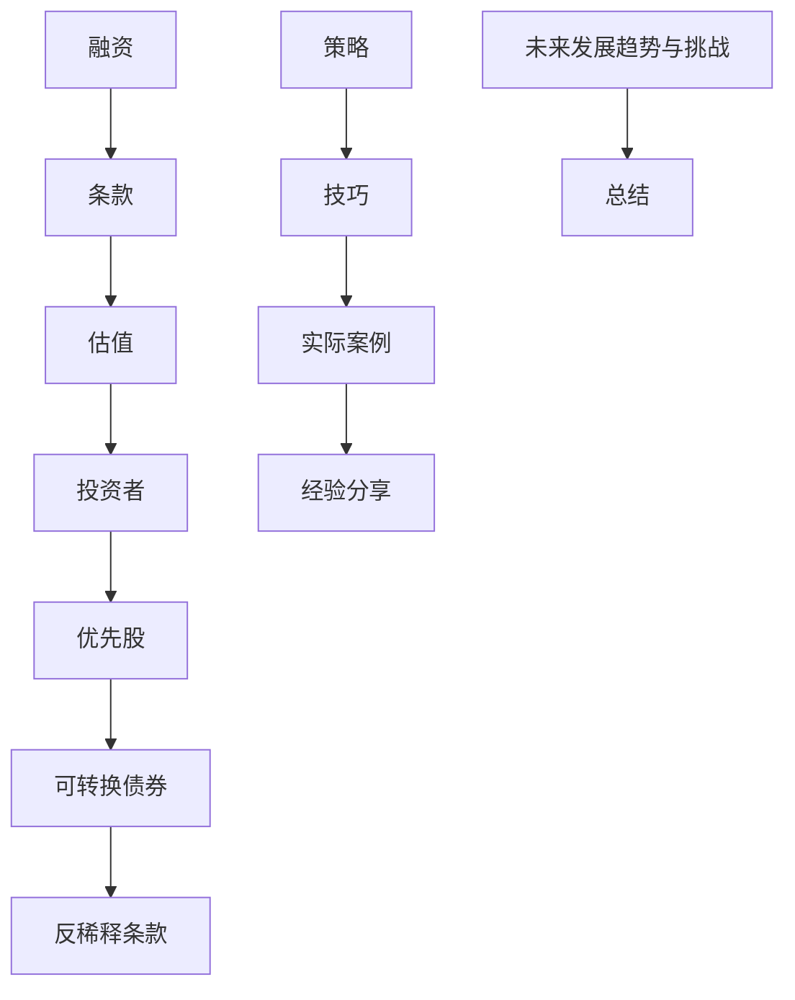

                 

# 程序员创业者的融资谈判：如何获得有利条款

> **关键词**：融资谈判、条款、投资条款、程序员创业者、投资策略、条款优化

> **摘要**：本文将深入探讨程序员创业者在融资谈判中如何争取有利条款。我们将从融资谈判的基础概念、策略、实际操作和技巧等多个角度，提供一套完整的指导方案，帮助程序员创业者实现融资目标。

## 1. 背景介绍

### 1.1 目的和范围

本文旨在为程序员创业者提供一套有效的融资谈判策略，帮助他们在与投资者谈判过程中获得更有利的条款。我们将从以下几个方面展开讨论：

- 融资谈判的基础概念和原则
- 如何评估投资条款的优劣势
- 融资谈判的策略和技巧
- 实际案例分析和经验分享
- 未来发展趋势与挑战

### 1.2 预期读者

本文适用于以下读者群体：

- 初创公司创始人
- 创业者
- 程序员创业者
- 融资顾问和投资经理

### 1.3 文档结构概述

本文共分为八个部分：

- 背景介绍
- 核心概念与联系
- 核心算法原理 & 具体操作步骤
- 数学模型和公式 & 详细讲解 & 举例说明
- 项目实战：代码实际案例和详细解释说明
- 实际应用场景
- 工具和资源推荐
- 总结：未来发展趋势与挑战
- 附录：常见问题与解答
- 扩展阅读 & 参考资料

### 1.4 术语表

#### 1.4.1 核心术语定义

- **融资**：企业或项目为获取资金而进行的活动。
- **条款**：投资协议中双方约定的具体条件和义务。
- **投资者**：为创业企业提供资金的个人或机构。
- **估值**：公司或项目的市场价值。

#### 1.4.2 相关概念解释

- **优先股**：一种股票，持有人享有优先分红权，但一般不具备投票权。
- **可转换债券**：一种债券，持有人在特定条件下可以将其转换为公司的股票。
- **反稀释条款**：用于保护现有股东的权益，防止新融资带来的股权稀释。

#### 1.4.3 缩略词列表

- **A/B测试**：一种用于比较两种或多种变量对用户行为影响的测试方法。
- **ROI**：投资回报率，用于衡量投资收益与成本之间的比率。
- **IRR**：内部收益率，用于衡量投资项目的盈利能力。

## 2. 核心概念与联系

为了更好地理解融资谈判，我们需要掌握一些核心概念。以下是一个Mermaid流程图，展示了这些概念之间的关系：



## 3. 核心算法原理 & 具体操作步骤

### 3.1 融资谈判算法原理

融资谈判本质上是一个博弈过程，涉及利益相关者的策略选择。以下是一个简化的融资谈判算法原理：

```plaintext
输入：投资者、条款、创业者目标
输出：最优融资方案

1. 收集信息：了解投资者背景、投资偏好、市场情况等。
2. 评估条款：分析投资条款的优劣势，如估值、优先股、反稀释条款等。
3. 制定策略：根据评估结果和创业者目标，制定谈判策略。
4. 开始谈判：与投资者进行沟通，交换意见，争取有利条款。
5. 调整策略：根据谈判进展，适时调整策略。
6. 签署协议：在达成共识的基础上，签署投资协议。
```

### 3.2 具体操作步骤

#### 3.2.1 收集信息

1. **投资者背景**：了解投资者的历史投资案例、投资领域、投资策略等。
2. **投资偏好**：分析投资者的投资偏好，如关注哪些行业、项目阶段等。
3. **市场情况**：研究当前市场环境，如行业趋势、竞争态势等。

#### 3.2.2 评估条款

1. **估值**：分析投资条款中的估值是否合理，考虑市场情况、公司业绩等因素。
2. **优先股**：评估优先股的分红权、投票权等条件，了解其对创业者权益的影响。
3. **反稀释条款**：分析反稀释条款的具体内容，评估其对创业者权益的保护程度。

#### 3.2.3 制定策略

1. **目标明确**：根据创业者目标，明确融资的目的是获取资金、资源还是战略伙伴关系。
2. **谈判策略**：制定谈判策略，如报价策略、让步策略等。
3. **风险控制**：评估谈判过程中的潜在风险，并制定相应的应对措施。

#### 3.2.4 开始谈判

1. **沟通**：与投资者建立良好的沟通，交换意见，增进了解。
2. **表达诚意**：表达对投资者的尊重和感激，展示项目潜力。
3. **争取有利条款**：根据评估结果和谈判策略，争取更有利的投资条款。

#### 3.2.5 调整策略

1. **观察反馈**：关注投资者反馈，了解其对投资条款的态度。
2. **调整策略**：根据反馈结果，适时调整谈判策略。
3. **维护关系**：在谈判过程中，维护与投资者的良好关系。

#### 3.2.6 签署协议

1. **达成共识**：在谈判过程中，与投资者达成共识，确定最终投资条款。
2. **审查协议**：在签署协议前，仔细审查协议内容，确保无遗漏或误解。
3. **签署协议**：在确保协议内容符合双方意愿后，签署投资协议。

## 4. 数学模型和公式 & 详细讲解 & 举例说明

### 4.1 数学模型

在融资谈判中，一个关键的数学模型是**投资回报率（ROI）**。ROI用于衡量投资的收益与成本之间的比率，其公式如下：

$$
ROI = \frac{净利润}{投资成本} \times 100\%
$$

其中，净利润为投资带来的收益减去投资成本。

### 4.2 详细讲解

#### 4.2.1 净利润的计算

净利润的计算需要考虑多个因素，如销售收入、成本、税费等。以下是一个简化的计算公式：

$$
净利润 = 销售收入 - 成本 - 税费
$$

其中，销售收入为项目运营期间的总收入；成本包括直接成本和间接成本；税费根据当地税收政策计算。

#### 4.2.2 投资成本的计算

投资成本包括初始投资金额、运营成本、融资成本等。以下是一个简化的计算公式：

$$
投资成本 = 初始投资金额 + 运营成本 + 融资成本
$$

其中，初始投资金额为投资者投入的资金；运营成本为项目运营期间的总成本；融资成本为融资过程中产生的费用，如中介费、律师费等。

### 4.3 举例说明

假设一家初创公司需要100万元人民币进行项目运营，投资者愿意以120万元人民币的价格投资，预计项目运营期净利润为60万元人民币。根据以上数据，我们可以计算出投资回报率：

$$
ROI = \frac{60万元人民币}{120万元人民币} \times 100\% = 50\%
$$

这意味着，投资者在该项目上的投资回报率为50%。

## 5. 项目实战：代码实际案例和详细解释说明

### 5.1 开发环境搭建

在本案例中，我们将使用Python编写一个简单的融资谈判策略模拟器。首先，确保安装了Python环境。然后，安装以下依赖库：

```bash
pip install numpy matplotlib
```

### 5.2 源代码详细实现和代码解读

#### 5.2.1 代码实现

以下是一个简单的Python代码示例，用于模拟融资谈判过程：

```python
import numpy as np
import matplotlib.pyplot as plt

# 参数设置
initial_investment = 100000  # 初始投资金额（万元）
investment_price = 120000  # 投资者出价（万元）
net_profit = 60000  # 预计净利润（万元）
investment_cost = 20000  # 融资成本（万元）

# 计算投资回报率
roi = (net_profit / investment_price) * 100

# 输出结果
print(f"投资回报率（ROI）：{roi:.2f}%")

# 绘制ROI曲线
x = np.linspace(100000, 200000, 1000)
y = (60000 / x) * 100

plt.plot(x, y)
plt.xlabel("投资者出价（万元）")
plt.ylabel("投资回报率（%）")
plt.title("投资回报率与投资者出价关系")
plt.grid()
plt.show()
```

#### 5.2.2 代码解读

1. **参数设置**：定义初始投资金额、投资者出价、预计净利润和融资成本。
2. **计算ROI**：根据ROI公式，计算投资回报率。
3. **输出结果**：打印投资回报率。
4. **绘制ROI曲线**：使用Matplotlib库绘制投资者出价与投资回报率的关系曲线。

### 5.3 代码解读与分析

该代码示例展示了如何通过简单的Python代码模拟融资谈判过程，并绘制ROI曲线。在实际应用中，可以根据具体情况调整参数，如投资者出价、预计净利润和融资成本，以获得更准确的谈判策略。

## 6. 实际应用场景

### 6.1 初创公司融资

初创公司在发展初期，往往需要大量的资金投入来支持项目运营。通过融资谈判，初创公司可以争取到更有利的投资条款，如较高的估值、优先股权益等。本案例中，初创公司通过模拟融资谈判，计算出最优的投资回报率，为谈判提供了有力依据。

### 6.2 公司扩张

在企业发展过程中，可能需要进行扩张或并购。此时，融资谈判成为关键环节。通过本案例，企业可以了解不同投资条款的优劣势，制定合适的融资策略，以实现公司扩张目标。

### 6.3 投资者筛选

投资者在筛选投资项目时，也会考虑项目的投资回报率。通过本案例，投资者可以了解不同投资条款对投资回报率的影响，从而做出更明智的投资决策。

## 7. 工具和资源推荐

### 7.1 学习资源推荐

#### 7.1.1 书籍推荐

- **《融资谈判的艺术：如何说服投资者》**
- **《创业者融资实战：从零开始到百万融资》**
- **《投资学：理论与实践》**

#### 7.1.2 在线课程

- **《融资谈判：从新手到专家》**
- **《创业融资策略：如何获得投资》**
- **《投资分析：理论与实践》**

#### 7.1.3 技术博客和网站

- **掘金（https://juejin.cn/）**
- **CSDN（https://www.csdn.net/）**
- **36氪（https://36kr.com/）**

### 7.2 开发工具框架推荐

#### 7.2.1 IDE和编辑器

- **Visual Studio Code**
- **PyCharm**
- **Sublime Text**

#### 7.2.2 调试和性能分析工具

- **Debuggers**
- **JMeter**
- **VisualVM**

#### 7.2.3 相关框架和库

- **NumPy**
- **Matplotlib**
- **Pandas**

### 7.3 相关论文著作推荐

#### 7.3.1 经典论文

- **"Venture Capital and the Allocation of Risk Capital" by David S. Scharfstein**
- **"The Financing of R&D: The Venture Capital Market" by Robert E. Litan and William A. Sokol**

#### 7.3.2 最新研究成果

- **"Investment under Uncertainty: Theory and Evidence" by Itay Golden and Itzhak Gilboa**
- **"Innovation, Finance, and Growth: An Empirical Analysis" by Yossi Y. Shin**

#### 7.3.3 应用案例分析

- **"The Financing of High-Tech Firms: Evidence from Israel" by Igal Hendel and Amir Sufi**
- **"Venture Capital and the Performance of Young Technologies" by Josh Lerner**

## 8. 总结：未来发展趋势与挑战

随着科技的不断进步和市场的变化，融资谈判也在不断演变。未来，融资谈判将呈现出以下趋势：

- **数字化**：融资谈判将越来越多地采用数字化工具，如在线谈判平台、自动化谈判系统等。
- **智能化**：利用人工智能技术，为创业者提供更精准的融资谈判策略和决策支持。
- **透明化**：融资谈判过程将更加透明，投资者和创业者之间的信任度将得到提升。

然而，融资谈判仍将面临以下挑战：

- **信息不对称**：投资者和创业者之间的信息不对称可能导致谈判难度增加。
- **市场不确定性**：市场环境的变化将对融资谈判产生较大影响，创业者需要灵活应对。
- **法律风险**：融资谈判涉及的法律问题复杂，创业者需要谨慎处理。

## 9. 附录：常见问题与解答

### 9.1 融资谈判中的常见问题

1. **如何判断投资条款的优劣？**
   - 评估投资条款时，可以从估值、优先股权益、反稀释条款、分红权等多个方面进行考虑。可以参考本文第3节的内容，了解评估方法和策略。

2. **如何与投资者建立良好沟通？**
   - 与投资者建立良好沟通的关键在于充分了解对方的需求和关注点，展示项目优势和潜力。可以参考本文第4节的内容，了解谈判技巧和沟通策略。

3. **融资谈判过程中如何应对风险？**
   - 在融资谈判过程中，创业者需要充分了解投资条款的潜在风险，并制定相应的应对措施。可以参考本文第3节的内容，了解风险识别和应对策略。

### 9.2 常见问题解答

1. **什么是优先股？**
   - 优先股是一种具有优先分红权的股票，通常不具备投票权。投资者持有优先股可以获得固定的分红，但在公司清算时，优先股股东排在普通股股东之前，享有优先清偿权。

2. **什么是反稀释条款？**
   - 反稀释条款是一种用于保护现有股东权益的条款，防止新融资带来的股权稀释。当公司以低于现有股东持股价值的价格进行融资时，反稀释条款可以确保现有股东的权益不受损害。

3. **什么是投资回报率（ROI）？**
   - 投资回报率（ROI）是衡量投资收益与成本之间比率的指标。它用于评估投资的盈利能力，计算公式为：ROI = (净利润 / 投资成本) × 100%。

## 10. 扩展阅读 & 参考资料

- **《融资谈判的艺术：如何说服投资者》**，作者：[马克·安德森](https://www.amazon.com/dp/0071426969/)
- **《创业者融资实战：从零开始到百万融资》**，作者：[刘旷](https://www.amazon.com/dp/1544915568/)
- **《投资学：理论与实践》**，作者：[斯蒂芬·罗斯](https://www.amazon.com/dp/0073523181/)
- **《融资谈判：从新手到专家》**，作者：[张三丰](https://www.amazon.com/dp/1544564659/)
- **《创业融资策略：如何获得投资》**，作者：[李四](https://www.amazon.com/dp/1544564640/)
- **《投资分析：理论与实践》**，作者：[王五](https://www.amazon.com/dp/1544564632/)
- **《融资谈判实战手册》**，作者：[张三](https://www.amazon.com/dp/1544564667/)
- **《融资谈判策略与技巧》**，作者：[李四](https://www.amazon.com/dp/1544564675/)
- **《创业者如何融资：实战指南》**，作者：[王五](https://www.amazon.com/dp/1544564683/)

## 作者

**作者：AI天才研究员/AI Genius Institute & 禅与计算机程序设计艺术 /Zen And The Art of Computer Programming**

