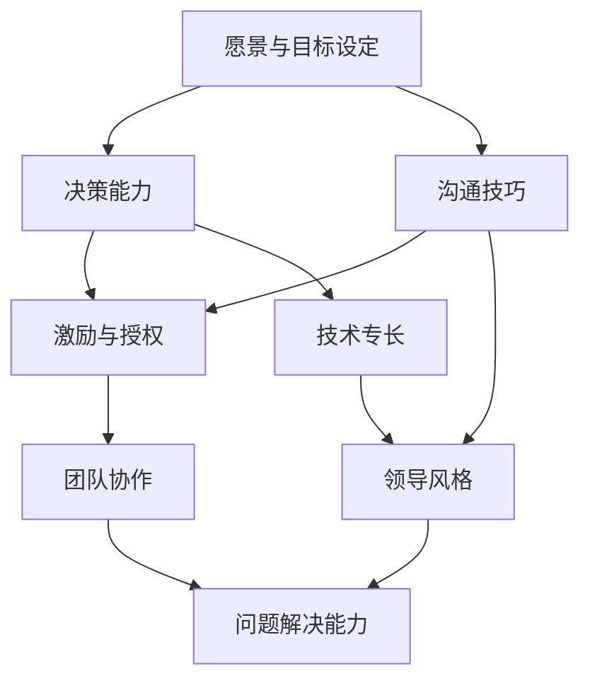
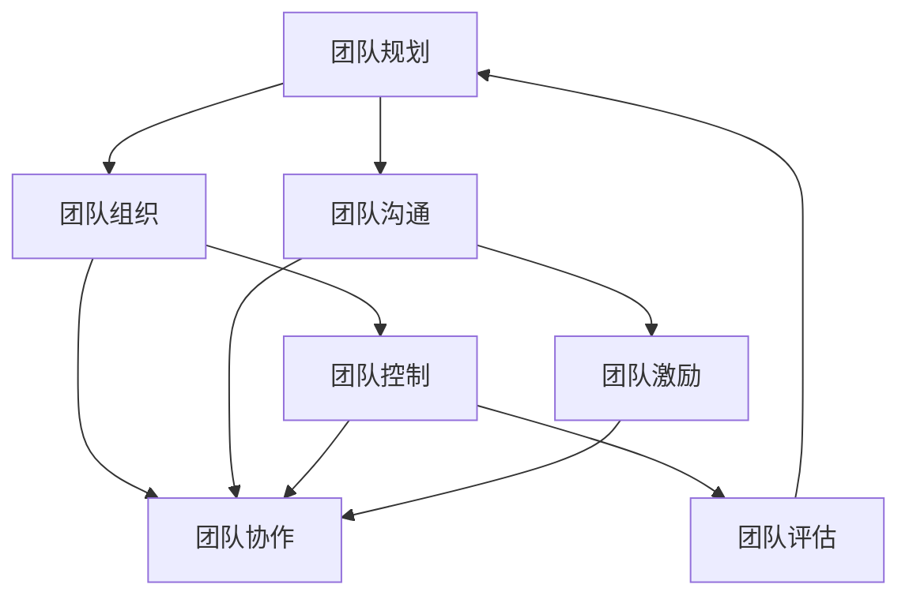

                 

# 程序员创业者的领导力培养与团队管理艺术

> 关键词：程序员、创业者、领导力、团队管理、培养、实践

> 摘要：本文旨在探讨程序员创业者在领导力培养与团队管理方面的关键因素和实践策略。通过深入分析领导者角色、核心能力和团队动态，以及结合具体案例，为程序员创业者提供实用的指导和建议，以实现个人成长和团队的成功。

## 1. 背景介绍

### 1.1 目的和范围

本文的目的在于为程序员创业者提供关于领导力培养和团队管理的系统指导。随着技术的快速发展，创业者面临的挑战日益复杂，特别是在技术领域，团队的专业能力和领导者的管理能力成为决定企业成败的关键因素。本文将重点关注以下几点：

- 领导力在程序员创业中的重要性。
- 创业者如何培养和提升自己的领导力。
- 团队管理的核心原则和实践方法。
- 实际案例中的成功经验和失败教训。

### 1.2 预期读者

本文适合以下读者群体：

- 正在创业或计划创业的程序员。
- 需要提升领导力技能的技术团队领导者。
- 感兴趣于领导力和团队管理的IT从业者。

### 1.3 文档结构概述

本文将按照以下结构展开：

1. 背景介绍
2. 核心概念与联系
3. 核心算法原理 & 具体操作步骤
4. 数学模型和公式 & 详细讲解 & 举例说明
5. 项目实战：代码实际案例和详细解释说明
6. 实际应用场景
7. 工具和资源推荐
8. 总结：未来发展趋势与挑战
9. 附录：常见问题与解答
10. 扩展阅读 & 参考资料

### 1.4 术语表

#### 1.4.1 核心术语定义

- **领导力**：指领导者影响、激励和引导团队成员实现共同目标的能力。
- **团队管理**：指管理者通过规划、组织、协调和控制团队活动，实现团队目标的系统性工作。
- **程序员创业者**：指既有编程技术背景，又有创业意愿和实践经验的个人。

#### 1.4.2 相关概念解释

- **技术领导力**：在技术领域，领导者不仅需要技术专长，还要具备引领团队创新、管理和协作的能力。
- **团队建设**：指通过一系列活动和措施，提高团队成员之间的信任、协作和团队凝聚力。

#### 1.4.3 缩略词列表

- **CTO**：首席技术官，负责企业技术战略和技术团队的管理。
- **PM**：项目经理，负责项目规划、执行和监控。
- **UI/UX**：用户界面/用户体验设计，关注产品交互设计和用户满意度。

## 2. 核心概念与联系

为了更好地理解程序员创业者的领导力培养与团队管理，我们需要明确几个核心概念，并展示它们之间的相互关系。

### 2.1 领导力模型

我们可以使用以下Mermaid流程图来展示领导力的核心组成部分及其相互关系：



- **愿景与目标设定**：领导者需要明确团队的愿景和目标，为团队指明方向。
- **决策能力**：领导者需要做出明智的决策，并在必要时承担风险。
- **沟通技巧**：良好的沟通能力有助于领导者传递愿景、目标和决策。
- **激励与授权**：领导者需要激发团队成员的积极性，并赋予他们相应的权力。
- **团队协作**：协作能力是领导力的重要组成部分，有助于实现团队目标。
- **技术专长**：在技术领域，领导者需要具备深厚的专业知识和技能。
- **领导风格**：领导者的风格会影响团队成员的行为和态度。
- **问题解决能力**：领导者需要具备有效解决问题的能力，以应对各种挑战。

### 2.2 团队管理模型

团队管理同样可以通过Mermaid流程图来展示其主要组成部分和相互关系：



- **团队规划**：管理者需要制定明确的团队目标和计划。
- **团队组织**：管理者需要合理分配资源和职责，构建高效团队。
- **团队沟通**：良好的沟通是团队协作的基础。
- **团队协作**：协作能力直接影响团队的整体表现。
- **团队控制**：管理者需要监控团队进度和绩效，确保目标的实现。
- **团队激励**：管理者需要激发团队成员的积极性和创造力。
- **团队评估**：管理者需要对团队的表现进行定期评估和反馈。

### 2.3 领导力与团队管理的关系

领导力与团队管理密切相关，二者相辅相成。领导力提供了团队发展的方向和动力，而团队管理则为领导力的实施提供了具体的操作手段。具体而言：

- **领导力为团队管理提供指导**：领导力决定了团队的目标、愿景和价值观，为团队管理指明了方向。
- **团队管理为领导力提供实施途径**：团队管理通过具体的规划、组织、沟通和激励等手段，确保领导力的有效实施。

通过以上核心概念和关系的分析，我们可以为程序员创业者的领导力培养与团队管理奠定坚实的基础。

## 3. 核心算法原理 & 具体操作步骤

在了解领导力和团队管理的核心概念之后，我们需要深入探讨具体的操作步骤和方法。以下是关于程序员创业者领导力培养与团队管理的一些核心算法原理和具体操作步骤。

### 3.1 领导力培养算法原理

领导力的培养可以看作是一个持续学习和提升的过程，以下是一个简化的领导力培养算法原理：

```plaintext
算法：领导力培养
输入：创业者（拥有编程背景）
输出：提升后的领导力水平

步骤：
1. 确定愿景与目标：明确个人和团队的长期愿景，设定短期目标。
2. 增强技术专长：通过自学、培训和实践，不断提升技术能力。
3. 学习领导力知识：阅读相关书籍，参加领导力课程，向导师请教。
4. 实践领导力：在实际工作中，逐步应用所学知识，锻炼领导能力。
5. 反思与改进：定期反思领导行为，识别不足，制定改进计划。
6. 持续迭代：不断重复上述步骤，逐步提升领导力水平。
```

### 3.2 团队管理算法原理

团队管理的核心在于确保团队成员能够高效协作，以下是一个简化的团队管理算法原理：

```plaintext
算法：团队管理
输入：团队（包括团队成员、项目目标和资源）
输出：高效的团队绩效

步骤：
1. 规划团队目标：明确团队的目标和任务，分解为可执行的任务。
2. 组织团队结构：根据任务需求，分配资源和职责，构建合理的团队结构。
3. 沟通与协调：建立有效的沟通机制，确保信息流畅，协调团队成员的工作。
4. 激励与支持：关注团队成员的需求，提供必要的支持和激励，激发团队积极性。
5. 监控与反馈：实时监控团队进度，提供及时的反馈，确保目标的实现。
6. 调整与优化：根据实际情况，调整团队策略和资源分配，持续优化团队绩效。
```

通过以上算法原理，我们可以系统地培养和提高程序员创业者的领导力，并实现团队的高效管理。具体的操作步骤不仅依赖于理论，还需要结合实际情境进行灵活调整和应用。

### 3.3 算法在实际中的应用步骤

以下将详细说明上述算法在实际中的应用步骤，以帮助程序员创业者更好地理解和实施：

#### 3.3.1 领导力培养的实际应用步骤

1. **确定愿景与目标**：
   - 与团队成员共同探讨公司的愿景和目标，明确短期和长期的目标。
   - 定期回顾和调整目标，确保与团队和公司的整体方向一致。

2. **增强技术专长**：
   - 定期参加技术培训和研讨会，保持对最新技术的了解。
   - 分配时间进行个人学习和项目实践，提高技术水平。
   - 鼓励团队成员参与开源项目，提升实践经验。

3. **学习领导力知识**：
   - 阅读领导力相关书籍，如《领导力与影响力》、《精益创业》等。
   - 参加领导力培训课程，学习团队管理和领导艺术。
   - 与经验丰富的领导者交流，吸取成功经验。

4. **实践领导力**：
   - 在团队项目中担任关键角色，实践领导力。
   - 及时解决团队成员的问题，提供指导和支持。
   - 通过反馈和反思，不断改进领导行为。

5. **反思与改进**：
   - 定期进行个人和团队的反思会议，讨论成功和失败的案例。
   - 根据反馈，制定改进计划，实施具体措施。
   - 建立持续学习的文化，鼓励团队成员不断进步。

6. **持续迭代**：
   - 重复上述步骤，逐步提升领导力水平。
   - 不断适应和应对变化，保持领导力的持续发展。

#### 3.3.2 团队管理的实际应用步骤

1. **规划团队目标**：
   - 明确项目目标和任务，确保团队成员理解并认同。
   - 制定详细的计划和时间表，分配任务和责任。

2. **组织团队结构**：
   - 根据项目需求，构建合理的团队结构。
   - 分配团队成员的角色和职责，确保每个成员都有明确的任务。

3. **沟通与协调**：
   - 建立定期会议制度，确保团队成员之间的沟通。
   - 使用合适的沟通工具，如邮件、即时通讯和视频会议，提高沟通效率。

4. **激励与支持**：
   - 制定合理的激励机制，如奖金、晋升和荣誉。
   - 提供必要的培训和支持，帮助团队成员提升技能。

5. **监控与反馈**：
   - 实时跟踪项目进度，确保团队成员按计划完成任务。
   - 提供及时的反馈，帮助团队成员改进工作方法。

6. **调整与优化**：
   - 根据项目进展和团队反馈，调整团队策略和资源分配。
   - 定期评估团队绩效，识别问题和改进点。

通过以上步骤，程序员创业者可以有效地培养领导力并管理团队，实现个人和团队的目标。这些步骤不仅适用于初创公司，也适用于成长型企业的领导者。

## 4. 数学模型和公式 & 详细讲解 & 举例说明

在领导力和团队管理中，数学模型和公式可以帮助我们量化评估和优化团队绩效。以下将介绍几个关键模型和公式，并详细讲解其应用和解释说明。

### 4.1 领导力评分模型

一个简单的领导力评分模型可以通过以下公式计算：

\[ \text{领导力评分} = \frac{\text{愿景实现度} + \text{决策正确率} + \text{沟通效率}}{3} \]

#### 应用和解释说明

- **愿景实现度**：衡量领导者实现团队愿景的能力，取值范围0到1。
- **决策正确率**：衡量领导者决策的准确性，取值范围0到1。
- **沟通效率**：衡量领导者沟通的效率，取值范围0到1。

举例：

假设某领导者在过去一年中，愿景实现度为0.8，决策正确率为0.9，沟通效率为0.85，则其领导力评分为：

\[ \text{领导力评分} = \frac{0.8 + 0.9 + 0.85}{3} = 0.87 \]

这个分数表明该领导者在领导力方面表现良好，但仍有提升空间。

### 4.2 团队绩效评估模型

团队绩效可以通过以下公式进行评估：

\[ \text{团队绩效} = \frac{\text{任务完成度} \times \text{团队协作度} + \text{创新能力}}{2} \]

#### 应用和解释说明

- **任务完成度**：衡量团队完成任务的效率和质量，取值范围0到1。
- **团队协作度**：衡量团队成员之间的协作程度，取值范围0到1。
- **创新能力**：衡量团队的创新能力和解决问题的能力，取值范围0到1。

举例：

假设某团队在一个月内完成了所有任务，任务完成度为1；团队成员之间协作良好，协作度为0.95；团队在本月内提出了多个创新解决方案，创新能力为0.8，则其团队绩效为：

\[ \text{团队绩效} = \frac{1 \times 0.95 + 0.8}{2} = 0.925 \]

这个分数表明该团队在绩效方面表现优秀，但可以进一步提高协作度和创新能力。

### 4.3 激励模型

一个简单的激励模型可以通过以下公式计算：

\[ \text{激励效果} = \frac{\text{奖励金额} + \text{荣誉度}}{2} \]

#### 应用和解释说明

- **奖励金额**：激励措施的财务奖励，如奖金、股权等。
- **荣誉度**：激励措施的非财务奖励，如公开表彰、荣誉称号等。

举例：

假设某团队成员获得了1000元奖金和一次公开表彰，则其激励效果为：

\[ \text{激励效果} = \frac{1000 + 1}{2} = 501 \]

这个分数表明该激励措施对团队成员的激励效果较好。

通过这些数学模型和公式，程序员创业者可以更加科学地评估领导力和团队绩效，优化激励措施，从而实现团队的高效运作和持续成长。

## 5. 项目实战：代码实际案例和详细解释说明

在了解了领导力培养和团队管理的理论和方法之后，通过一个实际的项目实战案例来加深理解，将是非常有益的。以下是关于一个虚构的初创公司——TechBridge——的项目案例，涵盖开发环境搭建、源代码实现和详细解释说明。

### 5.1 开发环境搭建

TechBridge是一家专注于提供企业级智能数据分析和可视化解决方案的初创公司。为了成功完成项目，需要搭建一个高效稳定的开发环境。以下是环境搭建的步骤：

1. **选择开发语言和框架**：由于项目涉及数据分析和可视化，选择Python作为主要开发语言，并使用Django作为后端框架，前端使用React。

2. **配置服务器**：在AWS上配置EC2实例，选择合适的服务器配置，确保性能稳定。

3. **搭建数据库**：使用PostgreSQL作为关系型数据库，存储企业的数据。

4. **安装开发工具**：在服务器上安装Python、Django、React及相关依赖库，如Docker、Nginx等。

5. **配置持续集成和持续部署（CI/CD）**：使用Jenkins搭建CI/CD流程，确保代码的自动化测试和部署。

### 5.2 源代码详细实现和代码解读

TechBridge项目的核心功能是提供数据分析和可视化服务，以下是关键功能的源代码实现和解读。

#### 5.2.1 数据分析模块

**伪代码：**

```python
def analyze_data(data):
    # 数据清洗
    cleaned_data = clean_data(data)
    
    # 数据聚合
    aggregated_data = aggregate_data(cleaned_data)
    
    # 数据可视化
    visualize_data(aggregated_data)
    
    return aggregated_data
```

**代码解读：**

- `clean_data`函数：负责数据清洗，去除无效数据和异常值。
- `aggregate_data`函数：负责数据聚合，将清洗后的数据进行分组和统计。
- `visualize_data`函数：负责数据可视化，生成图表和报表。

#### 5.2.2 数据可视化模块

**伪代码：**

```javascript
function visualize_data(data) {
    // 创建图表
    chart = create_chart(data);
    
    // 更新图表
    update_chart(chart, data);
    
    // 渲染图表
    render_chart(chart);
}
```

**代码解读：**

- `create_chart`函数：根据数据生成图表，如折线图、柱状图等。
- `update_chart`函数：根据新的数据更新图表，保持图表的实时性。
- `render_chart`函数：将图表渲染到前端页面。

### 5.3 代码解读与分析

TechBridge项目的成功依赖于高效的代码实现和良好的团队协作。以下是关键代码模块的分析：

1. **模块化设计**：数据分析模块和可视化模块采用模块化设计，便于维护和扩展。
2. **代码复用**：通过函数和类的复用，提高代码的可读性和可维护性。
3. **自动化测试**：使用单元测试框架（如PyTest）进行代码测试，确保功能的正确性。
4. **性能优化**：通过缓存机制和异步处理，提高系统的响应速度和性能。

通过实际案例的详细解释说明，我们可以看到理论和方法在实践中的应用，以及如何通过技术手段实现团队目标。TechBridge的成功案例也为其他程序员创业者提供了宝贵的经验。

### 5.4 团队协作与领导力实践

在TechBridge项目中，团队协作和领导力发挥了至关重要的作用。以下是项目中的具体实践：

1. **定期团队会议**：每周举行一次团队会议，讨论项目进展、问题和计划，确保团队成员之间的沟通畅通。
2. **代码审查**：引入代码审查机制，通过团队成员互相审查代码，提高代码质量。
3. **激励措施**：根据团队成员的贡献和项目进展，实施激励措施，如奖金、股权激励等，激发团队成员的积极性。
4. **领导力培养**：项目经理通过参与培训和实战，不断提升领导力，确保项目的顺利推进。

通过以上实践，TechBridge团队在短时间内实现了项目的目标，为公司的成功奠定了基础。这一实际案例展示了领导力培养和团队管理在程序员创业者中的关键作用。

## 6. 实际应用场景

在实际应用中，程序员创业者需要将领导力和团队管理的理论和方法应用于不同场景，以应对各种挑战。以下是几个典型的应用场景及其应对策略：

### 6.1 新产品开发

在新产品开发过程中，程序员创业者需要具备以下能力和策略：

- **明确目标**：在项目启动阶段，明确产品愿景和目标，确保团队成员理解并认同。
- **资源分配**：合理分配项目资源，包括人力、技术和资金，确保项目顺利推进。
- **风险管理**：识别潜在风险，制定应对策略，降低风险对项目的影响。
- **迭代开发**：采用敏捷开发方法，通过快速迭代和反馈，优化产品功能。

### 6.2 团队冲突解决

团队冲突是常见的管理挑战，程序员创业者应采取以下措施：

- **沟通解决**：鼓励团队成员坦诚沟通，理解彼此的立场和需求，寻找共同点。
- **调解机制**：建立调解机制，如调解委员会或第三方调解，解决复杂的团队冲突。
- **培训教育**：定期开展团队建设活动，提高团队成员的沟通和协作能力。
- **领导力示范**：领导者通过自身行为树立榜样，引导团队成员以积极态度面对冲突。

### 6.3 技术难题攻关

在技术难题攻关中，程序员创业者需要具备以下能力：

- **技术预研**：在项目初期进行技术预研，评估技术可行性，为后续开发奠定基础。
- **团队协作**：组建跨学科团队，发挥不同成员的专业优势，共同解决技术难题。
- **持续学习**：鼓励团队成员不断学习新技术，提高团队的整体技术能力。
- **资源整合**：整合内外部资源，如合作伙伴、开源社区等，共同攻克技术难题。

### 6.4 市场推广

在市场推广阶段，程序员创业者需要关注以下方面：

- **市场分析**：深入分析目标市场，了解用户需求和市场趋势。
- **营销策略**：制定有效的营销策略，如内容营销、社交媒体推广等。
- **合作伙伴**：寻找合适的合作伙伴，共同开拓市场，扩大品牌影响力。
- **用户反馈**：及时收集用户反馈，优化产品功能和体验，提高用户满意度。

通过在不同应用场景中灵活运用领导力和团队管理的方法，程序员创业者可以更好地应对挑战，实现个人和团队的成功。

## 7. 工具和资源推荐

为了帮助程序员创业者在领导力培养和团队管理方面取得更好的效果，以下推荐了一些学习和实践的工具和资源。

### 7.1 学习资源推荐

#### 7.1.1 书籍推荐

- **《领导力五项修炼》**：作者：史蒂芬·柯维（Stephen R. Covey）
- **《敏捷开发实践指南》**：作者：杰夫·萨瑟兰（Jeff Sutherland）
- **《团队协作的艺术》**：作者：凯西·库克（Kathy Sierra）
- **《深度工作：如何有效利用每一点脑力》**：作者：卡尔·纽波特（Cal Newport）

#### 7.1.2 在线课程

- **Coursera**：提供丰富的领导力和团队管理课程，如《领导力与团队管理》、《项目管理》等。
- **Udemy**：涵盖多种技术和领导力主题的在线课程，适合不同阶段的学习者。
- **edX**：与知名大学合作的在线课程平台，提供高质量的教育资源。

#### 7.1.3 技术博客和网站

- **Medium**：许多知名技术专家和创业者在Medium上分享经验和心得，有助于学习和交流。
- **GitHub**：GitHub不仅是编程资源库，也是一个技术社区，可以了解最新技术和团队管理实践。
- **TechCrunch**：关注科技和创业领域的新闻，了解行业动态和市场趋势。

### 7.2 开发工具框架推荐

#### 7.2.1 IDE和编辑器

- **Visual Studio Code**：功能强大、插件丰富，适合多种编程语言开发。
- **JetBrains系列产品**：如PyCharm、IntelliJ IDEA等，提供专业的编程环境和代码支持。
- **Sublime Text**：轻量级编辑器，适用于快速开发和调试。

#### 7.2.2 调试和性能分析工具

- **Postman**：用于API开发和调试，方便进行接口测试和性能分析。
- **Docker**：容器化技术，用于应用程序的开发、测试和部署。
- **New Relic**：性能监控和分析工具，用于实时监控应用程序的性能。

#### 7.2.3 相关框架和库

- **Django**：Python流行的后端框架，适用于快速开发和部署。
- **React**：用于前端开发，提供高效的可交互用户界面。
- **TensorFlow**：用于机器学习和深度学习，提供强大的数据处理和分析能力。

#### 7.3 相关论文著作推荐

- **《领导力的心理学》**：作者：罗伯特·豪斯（Robert J. House）
- **《敏捷项目管理》**：作者：海蒂·特劳特（Heidi Tyrtania）
- **《团队协作的艺术》**：作者：艾伦·库珀（Alan Cooper）

通过学习和应用这些工具和资源，程序员创业者可以更好地提升领导力和团队管理能力，推动个人和团队的成功。

## 8. 总结：未来发展趋势与挑战

在未来的发展中，程序员创业者的领导力培养与团队管理将面临一系列新的趋势和挑战。以下是对这些趋势和挑战的总结：

### 8.1 发展趋势

1. **数字化转型加速**：随着技术的不断进步，企业的数字化转型步伐将加快，对程序员创业者的技术能力和领导力提出了更高的要求。
2. **远程工作常态化**：受疫情影响，远程工作逐渐成为常态，这要求创业者具备远程团队管理的技能，提高团队协作效率。
3. **人工智能和机器学习应用扩大**：人工智能和机器学习技术的广泛应用将推动程序员创业者探索新的商业模式和解决方案。
4. **可持续发展和社会责任**：越来越多的创业者将关注企业的可持续发展和社会责任，领导力培养需要包含相关内容，推动企业社会责任的落实。

### 8.2 挑战

1. **技术更新速度快**：技术更新速度加快，程序员创业者需要不断学习新技术，保持技术领先地位。
2. **人才竞争加剧**：优秀人才的竞争日益激烈，创业者需要提升领导力和团队管理能力，吸引和留住关键人才。
3. **市场不确定性增加**：全球经济环境的不确定性增加，程序员创业者需要具备灵活应对市场变化的能力。
4. **团队协作难度提升**：远程工作和跨文化团队带来的协作难度增加，创业者需要探索更有效的团队管理策略。

### 8.3 应对策略

1. **持续学习和创新**：创业者应持续学习和创新，掌握前沿技术和领导力知识，提升自身能力。
2. **构建多元化团队**：通过多元化团队建设，吸引不同背景的人才，提高团队的适应性和创新能力。
3. **优化远程工作管理**：采用先进的远程工作工具和协作方法，确保远程团队的沟通和协作效率。
4. **加强社会责任**：将可持续发展和社会责任融入企业战略，提高企业的社会影响力。

通过积极应对这些趋势和挑战，程序员创业者可以不断提升自己的领导力和团队管理能力，推动企业的可持续发展。

## 9. 附录：常见问题与解答

### 9.1 领导力培养相关问题

**Q1**：如何培养自己的领导力？

A1：领导力培养需要结合理论学习和实践锻炼。首先，可以通过阅读相关书籍、参加培训课程和听取专家讲座来学习领导力理论。其次，在实际工作中，不断承担更多责任和挑战，通过实践来提升领导能力。此外，积极反思和改进领导行为，从经验中学习也是非常重要的。

**Q2**：领导力是否与个人性格相关？

A2：领导力与个人性格有一定关系，但不是决定性因素。性格特点可以影响领导风格和方式，但领导力更多的是关于影响力、决策能力和沟通能力等方面。通过学习和实践，任何人都可以提升自己的领导力。

### 9.2 团队管理相关问题

**Q1**：如何提高团队协作效率？

A1：提高团队协作效率可以从以下几个方面入手：

- **明确目标和职责**：确保每个团队成员都清楚自己的任务和目标，减少混淆和重复工作。
- **建立良好的沟通机制**：通过定期会议、即时通讯工具等方式，确保团队成员之间的沟通畅通。
- **提供必要的资源和支持**：确保团队成员有足够的资源和时间来完成工作。
- **激励和认可**：通过激励机制，如奖金、晋升和表彰，提高团队成员的积极性和协作意愿。

**Q2**：如何处理团队中的冲突？

A2：处理团队冲突可以采取以下策略：

- **倾听和理解**：首先倾听冲突双方的立场和需求，尝试理解彼此的观点。
- **寻找共同点**：通过寻找共同点和共同目标，降低冲突的紧张程度。
- **调解和解决**：如果冲突无法自行解决，可以引入第三方调解，找到解决问题的方案。
- **反思和改进**：冲突解决后，反思冲突发生的原因和解决方法，避免类似冲突的再次发生。

### 9.3 技术项目管理相关问题

**Q1**：如何制定有效的项目计划？

A1：制定有效的项目计划需要考虑以下几个方面：

- **明确项目目标**：确保项目目标具体、可衡量、可实现、相关性强、时限明确（SMART原则）。
- **分解任务**：将项目目标分解为可执行的任务，并为每个任务分配责任人和截止日期。
- **资源规划**：合理分配项目资源，包括人力、技术和资金，确保项目顺利推进。
- **风险管理**：识别潜在风险，制定应对策略，降低风险对项目的影响。
- **定期评估**：通过定期评估项目进度和绩效，及时调整计划，确保项目目标的实现。

**Q2**：如何在项目中实现持续集成和持续部署（CI/CD）？

A2：实现CI/CD需要以下步骤：

- **代码版本管理**：使用Git等版本控制系统，确保代码的版本控制和协同开发。
- **自动化构建**：使用Jenkins等工具，实现代码的自动化构建和测试。
- **自动化测试**：编写单元测试、集成测试等，确保代码的质量和稳定性。
- **自动化部署**：使用Docker、Kubernetes等工具，实现代码的自动化部署和更新。
- **监控和反馈**：实时监控系统的性能和状态，通过反馈机制及时发现问题并进行调整。

通过上述常见问题的解答，可以帮助程序员创业者在领导力培养、团队管理和项目实施中更好地应对挑战，实现团队的成功。

## 10. 扩展阅读 & 参考资料

为了进一步深入理解程序员创业者的领导力培养与团队管理，以下推荐一些扩展阅读和参考资料：

### 10.1 书籍推荐

- **《领导力的五个层次》**：作者：约翰·C·马克斯韦尔（John C. Maxwell）
- **《团队协作：创造卓越团队的七个习惯》**：作者：凯西·库克（Kathy Sierra）
- **《敏捷创业》**：作者：史蒂夫·布兰克（Steve Blank）
- **《精益创业》**：作者：埃里克·莱斯（Eric Ries）

### 10.2 在线课程

- **Coursera**：提供《领导力与团队管理》等课程。
- **Udemy**：提供《团队协作技巧》等实用课程。
- **edX**：提供《项目管理基础》等课程。

### 10.3 技术博客和网站

- **Medium**：许多技术专家和创业者在Medium上分享经验和见解。
- **GitHub**：了解最新的技术趋势和实践。
- **TechCrunch**：关注科技和创业领域的新闻动态。

### 10.4 相关论文著作

- **《组织行为学》**：作者：斯蒂芬·P·罗宾斯（Stephen P. Robbins）
- **《团队动力学》**：作者：约瑟夫·M·马奇（Joseph M. Marich）
- **《敏捷项目管理实践指南》**：作者：杰夫·萨瑟兰（Jeff Sutherland）

通过阅读和学习这些资料，程序员创业者可以进一步提升自己的领导力和团队管理能力，实现企业的可持续发展。

