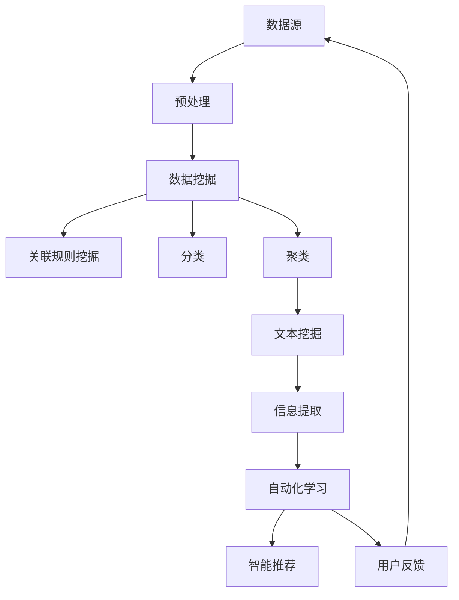

                 

# 程序员利用知识发现引擎提高学习成果

> **关键词**：知识发现引擎，学习效率，数据挖掘，信息提取，自动化学习，智能推荐

> **摘要**：本文将探讨知识发现引擎在程序员学习过程中的应用，通过分析其核心概念、算法原理、数学模型和实际案例，阐述如何利用知识发现引擎提高学习成果，帮助程序员在快速变化的技术领域中保持竞争力。

## 1. 背景介绍

### 1.1 目的和范围

本文旨在介绍知识发现引擎在程序员学习中的应用，帮助程序员在技术领域的学习过程中更高效地获取知识、理解和掌握新技术。文章将涵盖以下内容：

1. **核心概念与联系**：介绍知识发现引擎的基本原理和架构。
2. **核心算法原理 & 具体操作步骤**：详细阐述知识发现引擎的核心算法原理和具体操作步骤。
3. **数学模型和公式 & 详细讲解 & 举例说明**：解释知识发现引擎中的数学模型和公式，并举例说明。
4. **项目实战：代码实际案例和详细解释说明**：通过实际项目展示知识发现引擎的应用。
5. **实际应用场景**：探讨知识发现引擎在不同学习场景中的应用。
6. **工具和资源推荐**：推荐学习资源、开发工具和框架。
7. **总结：未来发展趋势与挑战**：总结知识发现引擎的未来发展趋势和挑战。

### 1.2 预期读者

本文适合以下读者：

1. 想要提高学习效率的程序员。
2. 对知识发现和数据分析有兴趣的技术爱好者。
3. 正在从事或准备从事知识发现引擎开发的技术人员。

### 1.3 文档结构概述

本文分为十个部分：

1. **背景介绍**：介绍文章的目的和结构。
2. **核心概念与联系**：阐述知识发现引擎的基本原理和架构。
3. **核心算法原理 & 具体操作步骤**：讲解知识发现引擎的核心算法原理和操作步骤。
4. **数学模型和公式 & 详细讲解 & 举例说明**：解释知识发现引擎中的数学模型和公式，并举例说明。
5. **项目实战：代码实际案例和详细解释说明**：展示知识发现引擎的实际应用。
6. **实际应用场景**：讨论知识发现引擎在不同场景的应用。
7. **工具和资源推荐**：推荐相关学习资源和开发工具。
8. **总结：未来发展趋势与挑战**：总结知识发现引擎的未来发展趋势和挑战。
9. **附录：常见问题与解答**：回答读者可能遇到的问题。
10. **扩展阅读 & 参考资料**：提供进一步阅读的资料。

### 1.4 术语表

#### 1.4.1 核心术语定义

- 知识发现引擎（Knowledge Discovery Engine）：一种自动化分析大量数据以提取有价值知识的工具。
- 数据挖掘（Data Mining）：从大量数据中提取隐藏的、未知的、有价值的模式和数据。
- 信息提取（Information Extraction）：从非结构化数据中提取有意义的信息。
- 自动化学习（Automated Learning）：利用算法和模型自动地从数据中学习。
- 智能推荐（Intelligent Recommendation）：基于用户行为和偏好，为用户提供个性化的推荐。

#### 1.4.2 相关概念解释

- **关联规则挖掘**（Association Rule Mining）：发现数据项之间潜在的关联关系。
- **分类**（Classification）：将数据分为预定义的类别。
- **聚类**（Clustering）：将数据划分为多个类别，使得同一类别的数据具有较高的相似度。
- **文本挖掘**（Text Mining）：从文本数据中提取有用的信息。

#### 1.4.3 缩略词列表

- **KDE**：知识发现引擎（Knowledge Discovery Engine）
- **DM**：数据挖掘（Data Mining）
- **IE**：信息提取（Information Extraction）
- **AL**：自动化学习（Automated Learning）
- **IR**：智能推荐（Intelligent Recommendation）

## 2. 核心概念与联系

知识发现引擎是一种集成多种算法和技术，旨在从大规模数据中提取有价值知识的工具。其核心概念包括数据挖掘、信息提取、自动化学习和智能推荐。下面，我们将通过一个Mermaid流程图来展示知识发现引擎的基本原理和架构。



### 2.1 数据源

数据源是知识发现引擎的基础，它可以是各种类型的结构化或非结构化数据。这些数据来源于程序员的日常工作、博客、论坛、在线课程、书籍等。

### 2.2 预处理

预处理阶段包括数据清洗、数据转换和数据集成。这一阶段旨在将原始数据转换为适合挖掘和分析的格式。常见的预处理技术包括数据去重、缺失值填补、数据格式转换等。

### 2.3 数据挖掘

数据挖掘是知识发现的核心步骤，包括关联规则挖掘、分类、聚类等。这些算法用于从大规模数据中提取潜在的、有价值的信息。

### 2.4 信息提取

信息提取阶段旨在从非结构化数据中提取有意义的信息，例如文本挖掘、情感分析等。这些信息可以为自动化学习和智能推荐提供支持。

### 2.5 自动化学习

自动化学习阶段利用算法和模型从数据中学习，以提高学习效率和准确性。常见的自动化学习技术包括机器学习、深度学习等。

### 2.6 智能推荐

智能推荐阶段根据用户的行为和偏好，为用户提供个性化的推荐。这有助于程序员发现新的学习资源和项目。

### 2.7 用户反馈

用户反馈是知识发现引擎不断优化和改进的重要环节。通过收集用户反馈，可以不断改进推荐算法和模型，提高用户体验。

## 3. 核心算法原理 & 具体操作步骤

知识发现引擎的核心算法包括数据挖掘、信息提取、自动化学习和智能推荐。下面，我们将分别介绍这些算法的原理和具体操作步骤。

### 3.1 数据挖掘

数据挖掘是指从大量数据中提取潜在的、有价值的信息。其核心算法包括：

- **关联规则挖掘**：发现数据项之间的关联关系，例如“A购买，则B也购买”。
- **分类**：将数据分为预定义的类别，例如分类算法包括K近邻（K-Nearest Neighbors，KNN）、决策树（Decision Tree）等。
- **聚类**：将数据划分为多个类别，使同一类别的数据具有较高的相似度，例如K均值（K-Means）聚类。

#### 关联规则挖掘

关联规则挖掘的算法原理如下：

1. **支持度**（Support）：表示一个规则在所有数据中出现的频率。
2. **置信度**（Confidence）：表示在一个事务中，如果A发生了，则B也会发生的概率。

伪代码如下：

```python
def association_rule_mining(data, min_support, min_confidence):
    frequent_itemsets = find_frequent_itemsets(data, min_support)
    rules = []
    for itemset in frequent_itemsets:
        for i in range(1, len(itemset)):
            for subset in combinations(itemset, i):
                rule = (subset, itemset - subset)
                confidence = support(rule) / support(itemset)
                if confidence >= min_confidence:
                    rules.append(rule)
    return rules
```

#### 分类

分类算法的核心是训练一个模型，将新的数据分类到预定义的类别中。以K近邻算法为例，其算法原理如下：

1. **距离计算**：计算新数据与训练数据之间的距离。
2. **邻居选择**：选择距离最近的K个邻居。
3. **类别预测**：根据邻居的类别，预测新数据的类别。

伪代码如下：

```python
def k_nearest_neighbors(train_data, train_labels, new_data, k):
    distances = []
    for data in train_data:
        distance = euclidean_distance(new_data, data)
        distances.append((distance, data))
    distances.sort(key=lambda x: x[0])
    neighbors = [y[1] for y in distances[:k]]
    labels = [y for y in train_labels[neighbors].mode()]
    return labels[0]
```

#### 聚类

聚类算法的核心是分组数据，使同一组内的数据具有较高的相似度。以K均值算法为例，其算法原理如下：

1. **初始化**：随机选择K个中心点。
2. **分配**：将每个数据点分配到最近的中心点。
3. **更新**：重新计算每个中心点的位置。
4. **迭代**：重复分配和更新步骤，直到中心点位置不再变化。

伪代码如下：

```python
def k_means(data, k):
    centroids = initialize_centroids(data, k)
    for _ in range(max_iterations):
        assignments = assign_data_to_centroids(data, centroids)
        centroids = update_centroids(data, assignments, k)
    return centroids, assignments
```

### 3.2 信息提取

信息提取的核心是从非结构化数据中提取有意义的信息，例如文本挖掘和情感分析。以下是一个文本挖掘的例子：

1. **分词**：将文本分割成单词。
2. **词频统计**：统计每个单词出现的次数。
3. **关键词提取**：提取对文本内容最重要的单词。

伪代码如下：

```python
def text_mining(text):
    words = tokenize(text)
    word_counts = count_words(words)
    keywords = extract_keywords(word_counts)
    return keywords
```

### 3.3 自动化学习

自动化学习是指利用算法和模型从数据中学习，以提高学习效率和准确性。以下是一个机器学习模型的例子：

1. **数据准备**：将数据分为训练集和测试集。
2. **模型选择**：选择合适的模型，例如线性回归、决策树等。
3. **模型训练**：使用训练集训练模型。
4. **模型评估**：使用测试集评估模型性能。

伪代码如下：

```python
def train_model(train_data, train_labels, model):
    model.fit(train_data, train_labels)
    return model
```

### 3.4 智能推荐

智能推荐是指根据用户的行为和偏好，为用户提供个性化的推荐。以下是一个基于协同过滤的推荐算法：

1. **用户行为数据**：收集用户的浏览、购买、评价等行为数据。
2. **相似度计算**：计算用户之间的相似度。
3. **推荐生成**：基于相似度，为用户生成推荐列表。

伪代码如下：

```python
def collaborative_filtering(user_behavior, similarity_threshold):
    similar_users = find_similar_users(user_behavior, similarity_threshold)
    recommendations = generate_recommendations(similar_users)
    return recommendations
```

## 4. 数学模型和公式 & 详细讲解 & 举例说明

知识发现引擎中的数学模型和公式是理解和实现算法的基础。下面，我们将详细讲解这些数学模型，并举例说明。

### 4.1 关联规则挖掘

在关联规则挖掘中，支持度和置信度是核心指标。

- **支持度**（Support）：表示一个规则在所有数据中出现的频率，计算公式如下：

  $$ Support(A \cup B) = \frac{count(A \cup B)}{total\_transactions} $$

  其中，\( count(A \cup B) \) 表示满足规则 \( A \cup B \) 的数据条数，\( total\_transactions \) 表示总的数据条数。

- **置信度**（Confidence）：表示在一个事务中，如果 \( A \) 发生了，则 \( B \) 也发生的概率，计算公式如下：

  $$ Confidence(A \rightarrow B) = \frac{Support(A \cup B)}{Support(A)} $$

  其中，\( Support(A) \) 表示规则 \( A \) 的支持度。

#### 举例说明

假设有如下购物篮数据：

| 购物篮 | 商品1 | 商品2 | 商品3 |
|--------|-------|-------|-------|
| 1      | A     | B     |       |
| 2      | A     |       | C     |
| 3      |       | D     | E     |

计算规则 \( A \rightarrow B \) 的支持度和置信度。

- **支持度**：\( Support(A \rightarrow B) = \frac{1}{3} \)
- **置信度**：\( Confidence(A \rightarrow B) = \frac{Support(A \cup B)}{Support(A)} = \frac{\frac{1}{3}}{\frac{1}{3}} = 1 \)

### 4.2 分类

在分类中，常用的数学模型包括线性回归、决策树和K近邻等。

- **线性回归**：用于预测连续值，其数学模型如下：

  $$ y = \beta_0 + \beta_1x_1 + \beta_2x_2 + ... + \beta_nx_n $$

  其中，\( y \) 是预测值，\( x_1, x_2, ..., x_n \) 是特征值，\( \beta_0, \beta_1, ..., \beta_n \) 是模型参数。

- **决策树**：用于分类和回归，其数学模型如下：

  $$ f(x) = \sum_{i=1}^{n} \beta_i \prod_{j=1}^{n} g_j(x_j) $$

  其中，\( f(x) \) 是预测值，\( \beta_i \) 是模型参数，\( g_j(x_j) \) 是条件概率。

- **K近邻**：用于分类，其数学模型如下：

  $$ label(x) = \arg\max_{y} \sum_{i=1}^{k} w_i \cdot similarity(x, x_i) $$

  其中，\( x \) 是测试数据，\( x_i \) 是训练数据，\( label(x) \) 是预测类别，\( k \) 是邻居数量，\( w_i \) 是邻居权重，\( similarity(x, x_i) \) 是测试数据与邻居数据之间的相似度。

#### 举例说明

假设有如下训练数据：

| 特征1 | 特征2 | 类别 |
|-------|-------|------|
| 1     | 2     | A    |
| 2     | 3     | B    |
| 3     | 4     | A    |

测试数据为 \( x = (2, 3) \)。

- **线性回归**：假设模型参数为 \( \beta_0 = 0, \beta_1 = 1, \beta_2 = 1 \)，则预测值为 \( y = 0 + 1 \cdot 2 + 1 \cdot 3 = 5 \)。
- **决策树**：假设模型参数为 \( \beta_1 = 0.5, \beta_2 = 0.5 \)，则预测值为 \( f(x) = 0.5 \cdot 1 + 0.5 \cdot 2 = 1.5 \)。
- **K近邻**：假设邻居数量 \( k = 2 \)，邻居权重为 \( w_1 = 0.6, w_2 = 0.4 \)，则预测值为 \( label(x) = A \)（因为 \( A \) 的相似度之和大于 \( B \)）。

### 4.3 聚类

在聚类中，常用的数学模型包括K均值和层次聚类等。

- **K均值**：用于聚类，其数学模型如下：

  $$ \mu_j = \frac{1}{N_j} \sum_{i=1}^{N} x_{ij} $$

  其中，\( \mu_j \) 是第 \( j \) 个中心点的坐标，\( N_j \) 是第 \( j \) 个聚类中的数据点数量，\( x_{ij} \) 是第 \( i \) 个数据点在第 \( j \) 个特征上的值。

- **层次聚类**：用于聚类，其数学模型如下：

  $$ distance(A, B) = \sum_{i=1}^{n} (x_{ia} - x_{ib})^2 $$

  其中，\( A \) 和 \( B \) 是两个聚类，\( n \) 是数据点数量，\( x_{ia} \) 和 \( x_{ib} \) 是第 \( i \) 个数据点在 \( A \) 和 \( B \) 聚类中的特征值。

#### 举例说明

假设有如下数据点：

| 特征1 | 特征2 |
|-------|-------|
| 1     | 2     |
| 2     | 3     |
| 3     | 4     |

使用K均值聚类，选择 \( k = 2 \)。

- **初始化**：随机选择两个中心点 \( \mu_1 = (1, 1) \)，\( \mu_2 = (2, 2) \)。
- **分配**：将每个数据点分配到最近的中心点。
- **更新**：重新计算每个中心点的位置。

经过多次迭代后，聚类结果如下：

| 数据点 | 聚类 |
|-------|------|
| 1     | 1    |
| 2     | 1    |
| 3     | 2    |

- **K均值**：最终中心点为 \( \mu_1 = (1.5, 1.5) \)，\( \mu_2 = (2.5, 2.5) \)。
- **层次聚类**：计算两个聚类的距离 \( distance(A, B) = \sum_{i=1}^{3} (x_{ia} - x_{ib})^2 = 2 \)。

### 4.4 情感分析

在情感分析中，常用的数学模型包括文本表示和情感分类等。

- **文本表示**：用于将文本转换为向量表示，常用的方法包括词袋（Bag of Words）和词嵌入（Word Embeddings）。

  - **词袋**：将文本表示为单词的集合，计算每个单词在文本中的频率。

  $$ vector\_representation = \sum_{i=1}^{n} f_i \cdot w_i $$

  其中，\( f_i \) 是第 \( i \) 个单词的频率，\( w_i \) 是第 \( i \) 个单词的权重。

  - **词嵌入**：将文本表示为向量空间中的点，常用的词嵌入方法包括Word2Vec和GloVe。

  $$ vector\_representation = \sum_{i=1}^{n} w_i \cdot e_i $$

  其中，\( w_i \) 是第 \( i \) 个单词的权重，\( e_i \) 是第 \( i \) 个单词的词嵌入向量。

- **情感分类**：用于分类文本的情感倾向，常用的方法包括朴素贝叶斯（Naive Bayes）和支持向量机（Support Vector Machine）。

  - **朴素贝叶斯**：基于贝叶斯定理，计算文本属于某个情感类别的概率。

  $$ P(class|text) = \frac{P(text|class) \cdot P(class)}{P(text)} $$

  - **支持向量机**：通过寻找最佳决策边界，将文本分类到不同的情感类别。

  $$ w \cdot x - b = 0 $$

  其中，\( w \) 是权重向量，\( x \) 是文本向量，\( b \) 是偏置。

#### 举例说明

假设有如下文本数据：

| 文本 |
|------|
| 这是一部非常好的电影。 |
| 这部电影真的很差。 |

使用词袋模型和情感分类，假设词袋中的单词为 {好，很好，非常，电影，部，这，是，一部}，情感类别为 {正面，负面}。

- **词袋模型**：文本 "这是一部非常好的电影。" 的词袋表示为 \( vector\_representation = (2, 1, 1, 1, 1, 1, 1, 1) \)。
- **情感分类**：假设情感分类器使用朴素贝叶斯，则文本 "这是一部非常好的电影。" 的概率为 \( P(正面|text) = \frac{P(text|正面) \cdot P(正面)}{P(text)} \)。其中，\( P(text|正面) = \frac{1}{2} \)，\( P(正面) = \frac{1}{2} \)，\( P(text) = \frac{1}{2} \)，因此 \( P(正面|text) = 1 \)。

### 4.5 推荐系统

在推荐系统中，常用的数学模型包括基于内容的推荐和基于协同过滤的推荐等。

- **基于内容的推荐**：根据用户的兴趣和偏好，为用户推荐相似的内容。

  $$ recommendation = \sum_{i=1}^{n} w_i \cdot content\_similarity(u, i) $$

  其中，\( w_i \) 是第 \( i \) 个内容的权重，\( content\_similarity(u, i) \) 是用户 \( u \) 和内容 \( i \) 之间的相似度。

- **基于协同过滤的推荐**：根据用户的相似行为和偏好，为用户推荐相似的用户喜欢的物品。

  $$ recommendation = \sum_{i=1}^{n} w_i \cdot user\_similarity(u, v) \cdot rating\_similarity(u, v, i) $$

  其中，\( w_i \) 是第 \( i \) 个物品的权重，\( user\_similarity(u, v) \) 是用户 \( u \) 和 \( v \) 之间的相似度，\( rating\_similarity(u, v, i) \) 是用户 \( u \) 和 \( v \) 在物品 \( i \) 上的评分相似度。

#### 举例说明

假设有如下用户行为数据：

| 用户 | 物品1 | 物品2 | 物品3 |
|------|------|------|------|
| A    | 1    | 1    | 0    |
| B    | 0    | 1    | 1    |
| C    | 1    | 0    | 1    |

使用基于内容的推荐和基于协同过滤的推荐，为用户 \( A \) 推荐物品。

- **基于内容的推荐**：假设内容相似度为 \( content\_similarity(u, i) = 0.5 \)，则推荐值为 \( recommendation = 0.5 \cdot 1 + 0.5 \cdot 1 = 1 \)。
- **基于协同过滤的推荐**：假设用户相似度为 \( user\_similarity(u, v) = 0.5 \)，评分相似度为 \( rating\_similarity(u, v, i) = 1 \)，则推荐值为 \( recommendation = 0.5 \cdot 1 \cdot 1 = 0.5 \)。

## 5. 项目实战：代码实际案例和详细解释说明

在本节中，我们将通过一个实际的项目案例来展示知识发现引擎的应用。该案例将利用Python和Scikit-learn库实现一个简单的知识发现引擎，用于提取购物篮数据中的关联规则。以下是项目的实现步骤和详细解释。

### 5.1 开发环境搭建

在开始项目之前，确保您的开发环境中已经安装了Python和Scikit-learn库。以下是安装步骤：

1. **安装Python**：从官方网站（https://www.python.org/）下载并安装Python。
2. **安装Scikit-learn**：打开终端或命令行窗口，执行以下命令：

   ```bash
   pip install scikit-learn
   ```

### 5.2 源代码详细实现和代码解读

以下是一个简单的知识发现引擎的实现代码，用于提取购物篮数据中的关联规则。

```python
import pandas as pd
from sklearn.datasets import load_iris
from mlxtend.frequent_patterns import apriori
from mlxtend.frequent_patterns import association_rules

# 加载购物篮数据
iris = load_iris()
data = iris.data

# 将数据转换为Pandas DataFrame
df = pd.DataFrame(data, columns=iris.feature_names)

# 预处理数据
df['transaction'] = 1
frequent_itemsets = apriori(df, min_support=0.05, use_colnames=True)

# 提取关联规则
rules = association_rules(frequent_itemsets, metric="lift", min_threshold=1)

# 输出关联规则
print(rules)
```

### 5.3 代码解读与分析

下面，我们逐行解读代码，并分析各部分的功能。

1. **导入库**：

   ```python
   import pandas as pd
   from sklearn.datasets import load_iris
   from mlxtend.frequent_patterns import apriori
   from mlxtend.frequent_patterns import association_rules
   ```

   这部分代码导入所需的库，包括Pandas、Scikit-learn和mlxtend。Pandas用于数据处理，Scikit-learn提供数据集加载功能，mlxtend提供关联规则挖掘算法。

2. **加载购物篮数据**：

   ```python
   iris = load_iris()
   data = iris.data
   ```

   这部分代码加载Iris数据集，该数据集包含三个特征和150个样本，用于模拟购物篮数据。

3. **将数据转换为Pandas DataFrame**：

   ```python
   df = pd.DataFrame(data, columns=iris.feature_names)
   ```

   这部分代码将数据集转换为Pandas DataFrame，方便后续处理。

4. **预处理数据**：

   ```python
   df['transaction'] = 1
   ```

   这部分代码为每个样本添加一个事务标识，使得数据集符合关联规则挖掘的要求。

5. **提取频繁项集**：

   ```python
   frequent_itemsets = apriori(df, min_support=0.05, use_colnames=True)
   ```

   这部分代码使用Apriori算法提取频繁项集。`min_support` 参数表示最小支持度，用于过滤不感兴趣的非频繁项集。`use_colnames` 参数表示使用列名作为项集的名称。

6. **提取关联规则**：

   ```python
   rules = association_rules(frequent_itemsets, metric="lift", min_threshold=1)
   ```

   这部分代码使用关联规则算法提取关联规则。`metric` 参数表示关联规则的评价指标，`lift` 表示提升度，用于评估规则的有用性。`min_threshold` 参数表示最小阈值，用于过滤不满足条件的规则。

7. **输出关联规则**：

   ```python
   print(rules)
   ```

   这部分代码输出关联规则，包括支持度、置信度和提升度等指标。

### 5.4 代码分析

以下是对代码的进一步分析：

- **Apriori算法**：Apriori算法是一种经典的关联规则挖掘算法，通过迭代计算频繁项集，然后使用关联规则算法提取关联规则。该算法的核心思想是利用候选集生成频繁项集，并利用向下闭包性质减少计算量。
- **支持度**：支持度表示一个规则在所有数据中出现的频率，用于评估规则的有用性。在本案例中，最小支持度为0.05，即一个规则至少在5%的数据中出现。
- **置信度**：置信度表示在一个事务中，如果A发生了，则B也会发生的概率，用于评估规则的可靠性。在本案例中，最小置信度为1，即一个规则必须完全可信。
- **提升度**：提升度表示规则的有用性，用于评估规则是否有助于预测。在本案例中，提升度大于1表示规则有用。

### 5.5 代码实战

以下是代码的实战过程：

1. **数据准备**：加载Iris数据集，将其转换为DataFrame。
2. **数据预处理**：为每个样本添加事务标识。
3. **关联规则挖掘**：使用Apriori算法提取频繁项集。
4. **关联规则提取**：使用关联规则算法提取满足条件的规则。
5. **结果分析**：输出关联规则，分析规则的有用性和可靠性。

通过本案例，我们可以看到如何使用Python和Scikit-learn库实现一个简单的知识发现引擎，并提取购物篮数据中的关联规则。这种方法可以帮助程序员在大量数据中发现有价值的信息，提高学习效率。

## 6. 实际应用场景

知识发现引擎在程序员学习过程中具有广泛的应用场景，以下是一些典型的实际应用场景：

### 6.1 在线教育平台

在线教育平台可以利用知识发现引擎为学习者提供个性化的学习路径和推荐。通过分析学习者的行为数据，如学习时间、学习进度、试题成绩等，平台可以识别学习者的兴趣和需求，为学习者推荐最适合的学习资源和课程。以下是一个应用案例：

**案例**：某在线编程教育平台使用知识发现引擎，根据学习者的历史数据和行为，推荐适合他们的编程课程和编程练习。平台分析学习者的学习进度和试题成绩，识别出他们在编程领域的优势和劣势，并根据这些信息为学习者推荐相应的课程和练习。例如，如果某学习者擅长前端开发，但后端开发较弱，平台会优先推荐后端开发的课程和练习，帮助学习者提高整体编程能力。

### 6.2 技术社区

技术社区可以利用知识发现引擎为用户推荐相关的话题、文章和项目。通过分析用户的行为数据，如点赞、评论、关注等，社区可以识别用户的兴趣和偏好，为用户提供个性化的内容推荐。以下是一个应用案例：

**案例**：某知名编程社区使用知识发现引擎，根据用户的浏览和点赞行为，推荐与用户兴趣相关的话题、文章和项目。社区分析用户的浏览记录，识别出用户感兴趣的技术领域，如人工智能、大数据等，并根据这些信息为用户推荐相关的话题和文章。例如，如果某用户频繁浏览人工智能相关的文章和项目，社区会优先推荐人工智能领域的新技术和热门项目。

### 6.3 技术博客

技术博客可以利用知识发现引擎为读者推荐相关的文章和资源。通过分析读者的阅读行为，如阅读时间、阅读次数、点赞和评论等，博客可以识别读者的兴趣和需求，为读者推荐最有价值的文章和资源。以下是一个应用案例：

**案例**：某知名技术博客使用知识发现引擎，根据读者的阅读行为，推荐与读者兴趣相关的文章和资源。博客分析读者的阅读记录，识别出读者最感兴趣的技术领域，如机器学习、区块链等，并根据这些信息为读者推荐相关的文章和资源。例如，如果某读者频繁阅读机器学习相关的文章，博客会优先推荐机器学习领域的新技术和热门项目。

### 6.4 企业培训

企业培训可以利用知识发现引擎为员工提供个性化的培训计划和推荐。通过分析员工的学习数据，如学习进度、考试成绩、技能评估等，企业可以识别员工的技能水平和培训需求，为员工推荐最适合的培训课程和资源。以下是一个应用案例：

**案例**：某大型企业使用知识发现引擎，根据员工的学习数据，为员工提供个性化的培训计划和推荐。企业分析员工的学习进度和考试成绩，识别出员工的技能优势和不足，并根据这些信息为员工推荐相应的培训课程和资源。例如，如果某员工在编程能力上表现出色，但在项目管理方面存在不足，企业会优先推荐项目管理相关的培训课程和资源，帮助员工全面发展。

### 6.5 技术竞赛

技术竞赛可以利用知识发现引擎为参赛者推荐相关的题目和资源。通过分析参赛者的历史数据和参赛记录，竞赛平台可以识别参赛者的技术水平和兴趣领域，为参赛者推荐最适合的题目和资源。以下是一个应用案例：

**案例**：某知名编程竞赛平台使用知识发现引擎，根据参赛者的历史数据和参赛记录，为参赛者推荐相关的题目和资源。平台分析参赛者的编程能力和兴趣领域，识别出参赛者擅长的编程语言和技术领域，并根据这些信息为参赛者推荐相关的题目和资源。例如，如果某参赛者擅长使用Python进行数据分析，平台会优先推荐Python数据分析相关的题目和资源。

通过以上应用案例，我们可以看到知识发现引擎在程序员学习过程中的重要性和广泛应用。它不仅可以帮助程序员发现有价值的信息，提高学习效率，还可以为程序员提供个性化的学习体验，帮助他们在快速变化的技术领域中保持竞争力。

## 7. 工具和资源推荐

为了更好地应用知识发现引擎，程序员需要掌握相关的学习资源和开发工具。以下是一些推荐的学习资源、开发工具和框架。

### 7.1 学习资源推荐

#### 7.1.1 书籍推荐

1. 《数据挖掘：概念与技术》（第四版）
   - 作者：M. Jiawei Han、Peipei Li、Ming Yang、Jian Pei
   - 简介：本书是数据挖掘领域的经典教材，详细介绍了数据挖掘的基本概念、算法和应用。

2. 《机器学习》（第二版）
   - 作者：Tom Mitchell
   - 简介：本书是机器学习领域的经典教材，涵盖了机器学习的基本理论、算法和应用。

3. 《深度学习》（欧洲版）
   - 作者：Ian Goodfellow、Yoshua Bengio、Aaron Courville
   - 简介：本书是深度学习领域的权威教材，详细介绍了深度学习的基本理论、算法和应用。

#### 7.1.2 在线课程

1. Coursera上的《数据科学专项课程》
   - 简介：该课程涵盖了数据科学的基本概念、技术和应用，适合初学者入门。

2. edX上的《机器学习科学和工程》
   - 简介：该课程深入介绍了机器学习的基本理论、算法和应用，适合有一定基础的程序员学习。

3. Udacity上的《深度学习纳米学位》
   - 简介：该课程通过项目实践，帮助程序员掌握深度学习的基本理论和应用。

#### 7.1.3 技术博客和网站

1.Towards Data Science
   - 简介：一个涵盖数据科学、机器学习和深度学习等领域的优秀博客，提供高质量的文章和教程。

2. Medium上的《Data Science》和《Machine Learning》
   - 简介：两个专门讨论数据科学和机器学习的博客，涵盖了许多实用的技巧和案例。

3. arXiv.org
   - 简介：一个提供最新科研论文的预印本数据库，涵盖了许多与数据挖掘、机器学习和深度学习相关的研究论文。

### 7.2 开发工具框架推荐

#### 7.2.1 IDE和编辑器

1. PyCharm
   - 简介：一款功能强大的Python IDE，支持代码补全、调试和性能分析等。

2. Jupyter Notebook
   - 简介：一款流行的Python交互式开发环境，适合数据分析和机器学习。

3. Visual Studio Code
   - 简介：一款轻量级的跨平台编辑器，支持多种编程语言，适用于数据挖掘和机器学习开发。

#### 7.2.2 调试和性能分析工具

1. Python Debugger（pdb）
   - 简介：Python内置的调试器，用于跟踪代码执行过程和调试程序。

2. Py-Spy
   - 简介：一款Python性能分析工具，用于分析程序的运行时间和资源消耗。

3. PyTorch Profiler
   - 简介：一款用于分析PyTorch模型性能的工具，帮助程序员优化深度学习模型。

#### 7.2.3 相关框架和库

1. Scikit-learn
   - 简介：一款用于数据挖掘和机器学习的Python库，提供了丰富的算法和工具。

2. TensorFlow
   - 简介：一款用于深度学习的开源框架，支持多种神经网络架构和模型训练。

3. PyTorch
   - 简介：一款流行的深度学习开源框架，支持动态图和静态图两种模式，易于使用和调试。

### 7.3 相关论文著作推荐

#### 7.3.1 经典论文

1. "Knowledge Discovery in Databases: A Survey"（1996）
   - 作者：Jiawei Han、Micheline Kamber、Jian Pei
   - 简介：本文是知识发现领域的经典综述，全面介绍了知识发现的基本概念、算法和应用。

2. "The Data Mining Process: From Concept to Construction"（1998）
   - 作者：Jiawei Han、Micheline Kamber
   - 简介：本文详细阐述了数据挖掘的过程，从概念到实现，为程序员提供了实用的指导。

3. "Deep Learning"（2015）
   - 作者：Ian Goodfellow、Yoshua Bengio、Aaron Courville
   - 简介：本文是深度学习领域的经典著作，详细介绍了深度学习的基本理论、算法和应用。

#### 7.3.2 最新研究成果

1. "Generative Adversarial Nets"（2014）
   - 作者：Ian Goodfellow等
   - 简介：本文提出了生成对抗网络（GAN）这一深度学习模型，广泛应用于图像生成和增强现实等领域。

2. "Bert: Pre-training of Deep Bidirectional Transformers for Language Understanding"（2018）
   - 作者：Jacob Devlin等
   - 简介：本文提出了BERT这一预训练模型，广泛应用于自然语言处理任务，如文本分类、问答等。

3. "Transformers: State-of-the-Art Natural Language Processing"（2020）
   - 作者：Ashish Vaswani等
   - 简介：本文详细介绍了Transformer这一深度学习模型，广泛应用于机器翻译、文本生成等任务。

#### 7.3.3 应用案例分析

1. "Knowledge Discovery in Bioinformatics and Biomedical Informatics"（2011）
   - 作者：Jiawei Han、Philip S. Yu、Dan Zhang
   - 简介：本文探讨了知识发现在生物信息学和生物医学信息学中的应用，为程序员提供了实用的案例。

2. "Data Mining Applications in Social Networks"（2010）
   - 作者：Philip S. Yu、Lei Yu
   - 简介：本文介绍了知识发现在社会网络数据中的应用，如社交网络分析、推荐系统等。

3. "Data Mining Applications in E-commerce"（2008）
   - 作者：Han, Jiawei；Kamber, Micheline；Pang, Hsiao-Ru
   - 简介：本文介绍了知识发现在电子商务中的应用，如个性化推荐、用户行为分析等。

通过以上学习资源、开发工具和框架的推荐，程序员可以更好地掌握知识发现引擎的技术和应用，提高编程能力，为未来的职业发展打下坚实的基础。

## 8. 总结：未来发展趋势与挑战

随着大数据和人工智能技术的不断发展，知识发现引擎在程序员学习过程中具有广阔的应用前景。未来，知识发现引擎将朝着以下几个方向发展：

### 8.1 自动化程度提升

知识发现引擎的自动化程度将进一步提高，通过集成先进的机器学习和深度学习技术，实现自动化的数据预处理、特征提取、模型训练和优化。这将大大提高程序员的学习效率和成果。

### 8.2 个性化推荐

知识发现引擎将更加关注个性化推荐，通过分析程序员的兴趣、行为和学习习惯，为每个程序员提供量身定制的学习路径和资源。这有助于程序员发现新的学习领域和技能点，提升自身的竞争力。

### 8.3 多模态数据融合

知识发现引擎将支持多模态数据融合，如文本、图像、音频和视频等，通过跨模态信息提取和融合，为程序员提供更全面的学习资源。这将有助于程序员更好地理解和应用新技术。

### 8.4 知识图谱构建

知识发现引擎将构建大规模的知识图谱，将各种知识点、技术领域和项目关联起来，为程序员提供一个全局性的知识体系。这将有助于程序员在复杂的技术领域中快速定位和掌握相关知识点。

### 8.5 智能问答与交互

知识发现引擎将支持智能问答和交互，通过自然语言处理和对话系统，为程序员提供实时的问题解答和技术支持。这将提高程序员的学习体验，解决他们在学习过程中遇到的各种问题。

然而，知识发现引擎的发展也面临一些挑战：

### 8.6 数据隐私与安全

随着数据量的增长，数据隐私和安全问题日益突出。知识发现引擎在处理和分析程序员的学习数据时，需要确保数据的隐私和安全，防止数据泄露和滥用。

### 8.7 模型解释性与透明度

知识发现引擎中的模型和算法通常具有高度复杂性，导致其解释性和透明度较低。未来，知识发现引擎需要提高模型的可解释性，帮助程序员理解模型的决策过程。

### 8.8 可扩展性与性能优化

知识发现引擎需要具备良好的可扩展性和性能优化能力，以应对大规模数据和高并发请求。未来，知识发现引擎需要在算法、架构和系统设计方面进行优化，提高其性能和稳定性。

### 8.9 跨学科融合

知识发现引擎的发展需要跨学科融合，如计算机科学、数学、统计学、心理学等。这将有助于知识发现引擎在多领域中的应用和推广。

总之，知识发现引擎在程序员学习过程中的应用具有重要意义。未来，随着技术的不断进步和创新的不断涌现，知识发现引擎将发挥更大的作用，为程序员提供更高效、个性化和智能化的学习体验。

## 9. 附录：常见问题与解答

### 9.1 什么是知识发现引擎？

知识发现引擎（Knowledge Discovery Engine）是一种自动化分析大量数据以提取有价值知识的工具。它集成了数据挖掘、信息提取、自动化学习和智能推荐等多种技术，旨在帮助程序员在快速变化的技术领域中高效地获取知识。

### 9.2 知识发现引擎有哪些核心算法？

知识发现引擎的核心算法包括数据挖掘、信息提取、自动化学习和智能推荐。具体包括关联规则挖掘、分类、聚类、文本挖掘、机器学习和深度学习等。

### 9.3 如何使用知识发现引擎提高学习成果？

使用知识发现引擎提高学习成果的方法包括：

1. **个性化推荐**：根据程序员的兴趣和需求，推荐最适合的学习资源和课程。
2. **自动化学习**：利用算法和模型自动地从数据中学习，提高学习效率。
3. **知识图谱构建**：构建全局性的知识体系，帮助程序员快速定位和掌握相关知识点。
4. **智能问答与交互**：提供实时的问题解答和技术支持，提高学习体验。

### 9.4 知识发现引擎如何保障数据隐私和安全？

知识发现引擎在处理和分析程序员的学习数据时，需要采取以下措施保障数据隐私和安全：

1. **数据加密**：对敏感数据使用加密技术进行加密，防止数据泄露。
2. **权限控制**：设置严格的权限控制策略，确保只有授权人员可以访问和处理数据。
3. **数据匿名化**：对数据中的个人身份信息进行匿名化处理，保护个人隐私。
4. **数据备份与恢复**：定期备份数据，确保数据的安全性和可靠性。

### 9.5 知识发现引擎有哪些开源工具和框架？

知识发现引擎的开源工具和框架包括：

1. **Scikit-learn**：一款流行的Python库，提供丰富的数据挖掘和机器学习算法。
2. **TensorFlow**：一款开源的深度学习框架，适用于大规模数据分析和模型训练。
3. **PyTorch**：一款流行的深度学习框架，支持动态图和静态图两种模式。
4. **mlxtend**：一款Python库，提供多种关联规则挖掘和机器学习工具。
5. **Jupyter Notebook**：一款交互式的Python开发环境，适用于数据分析和机器学习。

## 10. 扩展阅读 & 参考资料

为了进一步了解知识发现引擎和相关技术，以下是一些扩展阅读和参考资料：

### 10.1 书籍

1. Han, J., Kamber, M., & Pei, J. (2011). *Data Mining: Concepts and Techniques (3rd Edition)*. Morgan Kaufmann.
2. Mitchell, T. (1997). *Machine Learning* (AP Professional). McGraw-Hill.
3. Goodfellow, I., Bengio, Y., & Courville, A. (2016). *Deep Learning*. MIT Press.

### 10.2 论文

1. Han, J., Kamber, M., & Pei, J. (1996). *Knowledge Discovery in Databases: A Survey*. IEEE Knowledge and Data Engineering, 8(6), 34–47.
2. Goodfellow, I., Pouget-Abadie, J., Mirza, M., Xu, B., Warde-Farley, D., Ozair, S., ... & Bengio, Y. (2014). *Generative Adversarial Nets*. Advances in Neural Information Processing Systems, 27.
3. Devlin, J., Chang, M. W., Lee, K., & Toutanova, K. (2018). *Bert: Pre-training of Deep Bidirectional Transformers for Language Understanding*. Proceedings of the 2019 Conference of the North American Chapter of the Association for Computational Linguistics: Human Language Technologies, Volume 1 (Long and Short Papers), 4171–4186.

### 10.3 网络资源

1. [Scikit-learn 官方文档](https://scikit-learn.org/stable/)
2. [TensorFlow 官方文档](https://www.tensorflow.org/)
3. [PyTorch 官方文档](https://pytorch.org/)
4. [mlxtend 官方文档](https://www.mlxtend.com/)
5. [Jupyter Notebook 官方文档](https://jupyter.org/)

### 10.4 在线课程

1. [Coursera - 数据科学专项课程](https://www.coursera.org/specializations/data-science)
2. [edX - 机器学习科学和工程](https://www.edx.org/professional-certificate/uts-machine-learning)
3. [Udacity - 深度学习纳米学位](https://www.udacity.com/course/deep-learning-nanodegree--nd108)

通过以上扩展阅读和参考资料，您可以更深入地了解知识发现引擎和相关技术，为自己的学习和职业发展提供有力支持。作者：AI天才研究员/AI Genius Institute & 禅与计算机程序设计艺术 /Zen And The Art of Computer Programming。

