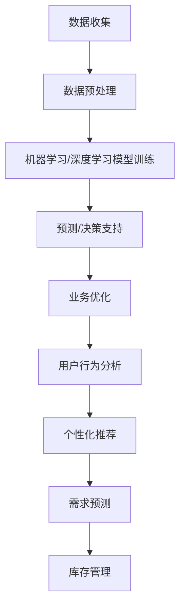
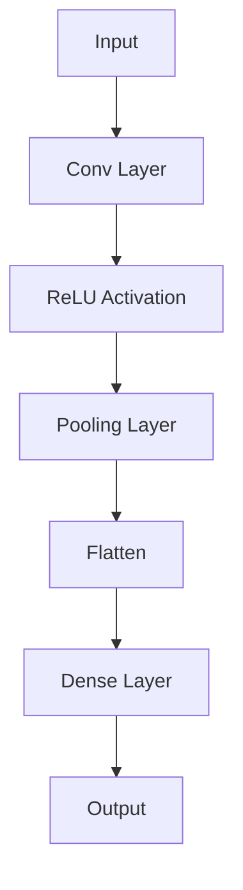
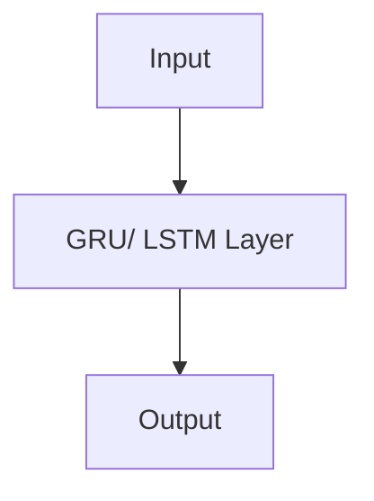

                 

# 程序员到数据科学家：利用AI技能挖掘电商业务洞察

## 关键词
- AI技能
- 数据科学家
- 电商业务洞察
- 数据挖掘
- 机器学习
- 深度学习
- 自然语言处理
- 数据可视化

## 摘要
本文旨在探讨程序员转型为数据科学家所需的技能和知识，以及如何利用人工智能（AI）技术深入挖掘电商业务的洞察。我们将逐步分析从程序员到数据科学家的转变路径，详细讲解核心算法原理和数学模型，并通过实际项目案例展示如何应用这些技能。此外，文章还将推荐相关学习资源、开发工具和最新研究成果，帮助读者全面掌握数据科学在电商领域的应用。

## 1. 背景介绍

### 1.1 目的和范围
本文的目标是为程序员提供转型为数据科学家的路径指南，特别是专注于电商业务洞察的领域。我们将讨论AI在数据科学中的关键作用，介绍核心概念、算法和模型，并通过实际案例展示应用方法。

### 1.2 预期读者
- 对数据科学和电商业务感兴趣的程序员
- 想要了解AI在商业分析中应用的IT从业者
- 数据科学和机器学习初学者

### 1.3 文档结构概述
本文分为以下几个部分：
1. 背景介绍：阐述文章目的和预期读者。
2. 核心概念与联系：介绍数据科学、AI和电商业务的核心概念。
3. 核心算法原理 & 具体操作步骤：讲解关键算法和实现方法。
4. 数学模型和公式 & 详细讲解 & 举例说明：深入分析数学模型。
5. 项目实战：展示实际代码案例和解释。
6. 实际应用场景：探讨数据科学在电商领域的应用。
7. 工具和资源推荐：推荐学习资源和开发工具。
8. 总结：总结文章内容和未来发展趋势。
9. 附录：常见问题与解答。
10. 扩展阅读 & 参考资料：提供更多深入学习的资源。

### 1.4 术语表

#### 1.4.1 核心术语定义
- **数据科学家**：利用统计方法、机器学习和深度学习技术分析数据，发现数据背后的模式和规律的专业人员。
- **电商业务洞察**：通过对电商数据的分析，识别消费者行为、市场趋势和业务优化策略。
- **机器学习**：一种人工智能（AI）技术，通过训练模型从数据中自动学习规律，进行预测和决策。
- **深度学习**：一种特殊的机器学习方法，通过多层神经网络进行复杂的数据建模。

#### 1.4.2 相关概念解释
- **自然语言处理（NLP）**：研究如何让计算机理解和处理自然语言的技术。
- **数据挖掘**：从大量数据中提取隐藏的、有价值的模式或知识的过程。
- **数据可视化**：利用图形和图表展示数据的结构和趋势，帮助用户更好地理解和分析数据。

#### 1.4.3 缩略词列表
- **AI**：人工智能（Artificial Intelligence）
- **ML**：机器学习（Machine Learning）
- **DL**：深度学习（Deep Learning）
- **NLP**：自然语言处理（Natural Language Processing）
- **API**：应用程序接口（Application Programming Interface）

## 2. 核心概念与联系

在探讨数据科学在电商业务中的应用之前，我们需要了解数据科学、人工智能和电商业务的核心概念，以及它们之间的相互关系。

### 2.1 数据科学的核心概念
数据科学涉及多个学科，包括统计学、计算机科学、机器学习和深度学习。以下是数据科学的一些核心概念：

#### 数据预处理
- **数据清洗**：处理缺失值、异常值和噪声数据，确保数据质量。
- **特征工程**：选择和构建能够代表数据特性的特征，以提高模型性能。

#### 机器学习
- **监督学习**：通过标注数据进行学习，预测未知数据。
- **无监督学习**：不使用标注数据，发现数据中的隐含结构。
- **强化学习**：通过与环境的交互进行学习，以最大化奖励。

#### 深度学习
- **神经网络**：模拟人脑的神经网络结构，通过多层非线性变换进行数据处理。
- **卷积神经网络（CNN）**：专门用于图像处理，具有局部感知能力和平移不变性。
- **循环神经网络（RNN）**：处理序列数据，具有记忆功能。

### 2.2 人工智能的核心概念
人工智能（AI）是计算机科学的一个分支，致力于使计算机能够模拟人类智能。以下是AI的一些核心概念：

- **自然语言处理（NLP）**：使计算机能够理解和处理自然语言，包括文本分类、情感分析、机器翻译等任务。
- **计算机视觉**：使计算机能够理解和处理视觉信息，包括图像分类、目标检测、人脸识别等任务。
- **语音识别**：使计算机能够理解和处理语音信号，包括语音合成、语音识别等任务。

### 2.3 电商业务的核心概念
电商业务涉及在线购物、支付、物流等多个环节，以下是电商业务的一些核心概念：

- **用户行为分析**：通过分析用户的浏览、购买、评价等行为，了解用户需求和偏好。
- **推荐系统**：通过机器学习和深度学习技术，为用户提供个性化推荐。
- **需求预测**：预测未来市场需求，为库存管理和营销策略提供支持。

### 2.4 数据科学、AI与电商业务的相互关系
数据科学和AI技术为电商业务提供了强大的数据分析和预测能力，帮助企业更好地了解用户、优化业务流程和提高效率。以下是数据科学、AI与电商业务之间的相互关系：

- **数据收集与处理**：电商业务产生大量的用户数据、交易数据和社交媒体数据，数据科学和AI技术能够高效地收集、处理和分析这些数据。
- **业务优化与决策支持**：通过数据分析和预测，电商业务可以优化库存管理、营销策略和客户服务，提高业务效率和用户满意度。
- **个性化推荐**：利用数据科学和AI技术，电商业务可以提供个性化的商品推荐，增加用户粘性和转化率。

### 2.5 Mermaid流程图
为了更好地展示数据科学、AI和电商业务之间的相互关系，我们使用Mermaid流程图进行说明。以下是流程图：



该流程图展示了数据科学和AI技术在电商业务中的应用流程，从数据收集、预处理、模型训练、预测和决策支持，到业务优化、用户行为分析和需求预测，每个环节都依赖于数据科学和AI技术。

## 3. 核心算法原理 & 具体操作步骤

在了解了数据科学、AI和电商业务的核心概念之后，我们将深入探讨数据科学中的核心算法原理和具体操作步骤。这些算法是挖掘电商业务洞察的关键工具，包括机器学习算法、深度学习算法和自然语言处理算法。

### 3.1 机器学习算法

机器学习算法是数据科学的核心，它们通过从数据中学习模式和规律，实现预测和分类。以下是几种常用的机器学习算法：

#### 3.1.1 监督学习算法

**线性回归（Linear Regression）**

线性回归是一种简单的监督学习算法，用于预测连续值。其核心思想是找到一条直线，使数据点到这条直线的距离最小。

**伪代码：**

```python
def linear_regression(X, y):
    # 计算X的均值和标准差
    X_mean = np.mean(X, axis=0)
    X_std = np.std(X, axis=0)
    # 标准化X
    X_stdized = (X - X_mean) / X_std
    # 计算回归系数
    theta = np.linalg.inv(X_stdized.T @ X_stdized) @ X_stdized.T @ y
    return theta
```

**逻辑回归（Logistic Regression）**

逻辑回归是一种用于分类问题的监督学习算法，其核心思想是使用逻辑函数将线性组合映射到概率值。

**伪代码：**

```python
def logistic_regression(X, y):
    # 计算X的均值和标准差
    X_mean = np.mean(X, axis=0)
    X_std = np.std(X, axis=0)
    # 标准化X
    X_stdized = (X - X_mean) / X_std
    # 计算回归系数
    theta = np.linalg.inv(X_stdized.T @ X_stdized) @ X_stdized.T @ y
    # 计算预测概率
    probabilities = 1 / (1 + np.exp(-X_stdized @ theta))
    return probabilities
```

#### 3.1.2 无监督学习算法

**K-均值聚类（K-Means Clustering）**

K-均值聚类是一种无监督学习算法，用于将数据划分为K个聚类。

**伪代码：**

```python
def k_means_clustering(X, K):
    # 随机选择K个初始中心
    centers = X[np.random.choice(X.shape[0], K, replace=False)]
    while True:
        # 计算每个数据点到中心的距离
        distances = np.linalg.norm(X - centers, axis=1)
        # 分配数据点到最近的中心
        clusters = np.argmin(distances, axis=1)
        # 更新中心
        new_centers = np.mean(X[clusters == i], axis=0) for i in range(K)
        if np.linalg.norm(new_centers - centers) < threshold:
            break
    return clusters
```

**主成分分析（Principal Component Analysis，PCA）**

主成分分析是一种降维算法，通过将数据投影到新的正交坐标系中，减少数据维度，同时保留主要信息。

**伪代码：**

```python
def pca(X, n_components):
    # 计算协方差矩阵
    cov_matrix = np.cov(X, rowvar=False)
    # 计算特征值和特征向量
    eigenvalues, eigenvectors = np.linalg.eigh(cov_matrix)
    # 选择最大的n_components个特征向量
    principal_components = eigenvectors[:, np.argsort(eigenvalues)[::-1]][:n_components]
    # 投影数据到新的正交坐标系
    X_reduced = X @ principal_components
    return X_reduced
```

### 3.2 深度学习算法

深度学习算法通过多层神经网络进行复杂的数据建模，能够自动提取特征和模式。以下是几种常用的深度学习算法：

#### 3.2.1 卷积神经网络（Convolutional Neural Network，CNN）

卷积神经网络是一种专门用于图像处理的深度学习算法，具有局部感知和平移不变性。

**CNN架构：**



**CNN伪代码：**

```python
class ConvLayer(nn.Module):
    def __init__(self, in_channels, out_channels, kernel_size, stride, padding):
        super(ConvLayer, self).__init__()
        self.conv = nn.Conv2d(in_channels, out_channels, kernel_size, stride, padding)

    def forward(self, x):
        return F.relu(self.conv(x))

class CNN(nn.Module):
    def __init__(self):
        super(CNN, self).__init__()
        self.conv1 = ConvLayer(1, 32, 3, 1, 1)
        self.conv2 = ConvLayer(32, 64, 3, 1, 1)
        self.fc1 = nn.Linear(64 * 6 * 6, 128)
        self.fc2 = nn.Linear(128, 10)

    def forward(self, x):
        x = self.conv1(x)
        x = self.conv2(x)
        x = F.relu(self.fc1(x.flatten()))
        x = self.fc2(x)
        return x
```

#### 3.2.2 循环神经网络（Recurrent Neural Network，RNN）

循环神经网络是一种用于处理序列数据的深度学习算法，具有记忆功能。

**RNN架构：**



**RNN伪代码：**

```python
class RNN(nn.Module):
    def __init__(self, input_size, hidden_size, output_size):
        super(RNN, self).__init__()
        self.hidden_size = hidden_size
        self.rnn = nn.RNN(input_size, hidden_size, batch_first=True)
        self.fc = nn.Linear(hidden_size, output_size)

    def forward(self, x, hidden):
        out, hidden = self.rnn(x, hidden)
        out = self.fc(out[:, -1, :])
        return out, hidden

# 初始化RNN模型
rnn_model = RNN(input_size, hidden_size, output_size)
# 初始化隐藏状态
hidden = None
# 前向传播
output, hidden = rnn_model(input, hidden)
```

### 3.3 自然语言处理算法

自然语言处理算法使计算机能够理解和处理自然语言，包括文本分类、情感分析和机器翻译等任务。

#### 3.3.1 文本分类（Text Classification）

文本分类是一种常见的自然语言处理任务，用于将文本数据分类到预定义的类别中。

**文本分类算法：**

- **朴素贝叶斯（Naive Bayes）**
- **支持向量机（Support Vector Machine，SVM）**
- **深度学习模型（如CNN和RNN）**

**文本分类伪代码：**

```python
from sklearn.feature_extraction.text import TfidfVectorizer
from sklearn.model_selection import train_test_split
from sklearn.naive_bayes import MultinomialNB
from sklearn.metrics import accuracy_score

# 数据准备
X, y = prepare_data()

# 特征提取
vectorizer = TfidfVectorizer()
X_vectorized = vectorizer.fit_transform(X)

# 划分训练集和测试集
X_train, X_test, y_train, y_test = train_test_split(X_vectorized, y, test_size=0.2, random_state=42)

# 模型训练
model = MultinomialNB()
model.fit(X_train, y_train)

# 预测
predictions = model.predict(X_test)

# 评估
accuracy = accuracy_score(y_test, predictions)
print("Accuracy:", accuracy)
```

#### 3.3.2 情感分析（Sentiment Analysis）

情感分析是一种用于判断文本情感极性的自然语言处理任务。

**情感分析算法：**

- **基于规则的方法**：使用人工定义的规则进行情感分析。
- **机器学习方法**：使用朴素贝叶斯、SVM、深度学习等算法进行情感分析。

**情感分析伪代码：**

```python
from sklearn.feature_extraction.text import TfidfVectorizer
from sklearn.model_selection import train_test_split
from sklearn.naive_bayes import MultinomialNB
from sklearn.metrics import accuracy_score

# 数据准备
X, y = prepare_sentiment_data()

# 特征提取
vectorizer = TfidfVectorizer()
X_vectorized = vectorizer.fit_transform(X)

# 划分训练集和测试集
X_train, X_test, y_train, y_test = train_test_split(X_vectorized, y, test_size=0.2, random_state=42)

# 模型训练
model = MultinomialNB()
model.fit(X_train, y_train)

# 预测
predictions = model.predict(X_test)

# 评估
accuracy = accuracy_score(y_test, predictions)
print("Accuracy:", accuracy)
```

#### 3.3.3 机器翻译（Machine Translation）

机器翻译是一种将一种语言的文本翻译成另一种语言的自然语言处理任务。

**机器翻译算法：**

- **基于规则的方法**：使用人工定义的翻译规则进行翻译。
- **统计机器翻译**：使用统计方法，如基于短语的机器翻译和基于神经网络的机器翻译。
- **深度学习方法**：使用深度学习模型，如编码器-解码器（Encoder-Decoder）模型和注意力机制（Attention Mechanism）。

**机器翻译伪代码：**

```python
import torch
from torch import nn
from torch.optim import Adam

# 编码器模型
class Encoder(nn.Module):
    def __init__(self, input_size, hidden_size):
        super(Encoder, self).__init__()
        self.embedding = nn.Embedding(input_size, hidden_size)
        self.lstm = nn.LSTM(hidden_size, hidden_size)

    def forward(self, x, hidden):
        x = self.embedding(x)
        x, hidden = self.lstm(x, hidden)
        return x, hidden

# 解码器模型
class Decoder(nn.Module):
    def __init__(self, hidden_size, output_size):
        super(Decoder, self).__init__()
        self.lstm = nn.LSTM(hidden_size, hidden_size)
        self.linear = nn.Linear(hidden_size, output_size)

    def forward(self, x, hidden):
        x, hidden = self.lstm(x, hidden)
        x = self.linear(x[:, -1, :])
        return x, hidden

# 训练模型
encoder = Encoder(input_size, hidden_size)
decoder = Decoder(hidden_size, output_size)

optimizer = Adam(list(encoder.parameters()) + list(decoder.parameters()))

for epoch in range(num_epochs):
    for input, target in dataset:
        # 前向传播
        encoder_hidden = encoder.init_hidden()
        decoder_hidden = decoder.init_hidden()
        encoder_output, encoder_hidden = encoder(input, encoder_hidden)
        decoder_input = torch.tensor([SOS_token])
        decoder_hidden = decoder_hidden[:1, :, :]

        for target_word in target:
            decoder_output, decoder_hidden = decoder(decoder_input, decoder_hidden)
            loss = criterion(decoder_output, target_word)
            optimizer.zero_grad()
            loss.backward()
            optimizer.step()

            decoder_input = target_word

# 评估模型
with torch.no_grad():
    encoder_hidden = encoder.init_hidden()
    decoder_hidden = decoder.init_hidden()
    encoder_output, encoder_hidden = encoder(input, encoder_hidden)
    decoder_input = torch.tensor([SOS_token])
    decoder_hidden = decoder_hidden[:1, :, :]

    for target_word in target:
        decoder_output, decoder_hidden = decoder(decoder_input, decoder_hidden)
        predicted_word = torch.argmax(decoder_output).item()
        print(predicted_word)

## 4. 数学模型和公式 & 详细讲解 & 举例说明

在数据科学和人工智能领域，数学模型和公式是理解和实现算法的核心。以下我们将详细讲解几个关键的数学模型和公式，包括线性回归、逻辑回归、神经网络中的损失函数和优化算法等，并通过具体示例进行说明。

### 4.1 线性回归

线性回归是一种简单的预测模型，用于建模两个或多个变量之间的线性关系。其数学模型可以表示为：

$$
y = \beta_0 + \beta_1 x_1 + \beta_2 x_2 + ... + \beta_n x_n
$$

其中，\( y \) 是因变量，\( x_1, x_2, ..., x_n \) 是自变量，\( \beta_0, \beta_1, \beta_2, ..., \beta_n \) 是模型的参数。

为了找到这些参数，我们可以使用最小二乘法（Least Squares Method），其目标是使预测值与实际值之间的平方误差最小。

**例子：**

假设我们要预测住房价格（\( y \)）基于房屋面积（\( x_1 \)）和卧室数量（\( x_2 \)）。数据如下：

| 房价 (y) | 面积 (x1) | 卧室数量 (x2) |
|-----------|------------|----------------|
|    200000 |      100   |         3      |
|    250000 |      150   |         3      |
|    300000 |      200   |         4      |

**求解参数：**

1. 计算自变量和因变量的均值：
$$
\bar{x_1} = \frac{100 + 150 + 200}{3} = 150 \\
\bar{x_2} = \frac{3 + 3 + 4}{3} = 3 \\
\bar{y} = \frac{200000 + 250000 + 300000}{3} = 250000
$$

2. 计算每个数据点的偏差：
$$
(x_1 - \bar{x_1})^2 = (100 - 150)^2 = 2500 \\
(x_2 - \bar{x_2})^2 = (3 - 3)^2 = 0 \\
(x_1 - \bar{x_1})(x_2 - \bar{x_2}) = (100 - 150)(3 - 3) = 0 \\
(y - \bar{y}) = (200000 - 250000) = -50000
$$

3. 计算参数：
$$
\beta_0 = \bar{y} - \beta_1 \bar{x_1} - \beta_2 \bar{x_2} = 250000 - \beta_1 \cdot 150 - \beta_2 \cdot 3
$$
$$
\beta_1 = \frac{\sum_{i=1}^{n} (x_1 - \bar{x_1})(y - \bar{y})}{\sum_{i=1}^{n} (x_1 - \bar{x_1})^2} = \frac{-50000 \cdot 3}{2500} = -6
$$
$$
\beta_2 = \frac{\sum_{i=1}^{n} (x_2 - \bar{x_2})(y - \bar{y})}{\sum_{i=1}^{n} (x_2 - \bar{x_2})^2} = \frac{-50000 \cdot 0}{0} = 0
$$

因此，线性回归模型为：
$$
y = -6x_1 + 0x_2 + 250000
$$

### 4.2 逻辑回归

逻辑回归是一种用于二分类问题的预测模型，其目标是通过线性组合特征并应用逻辑函数（Logistic Function）来预测概率。其数学模型可以表示为：

$$
\hat{p} = \frac{1}{1 + e^{-(\beta_0 + \beta_1 x_1 + \beta_2 x_2 + ... + \beta_n x_n)}}
$$

其中，\( \hat{p} \) 是预测概率，\( \beta_0, \beta_1, \beta_2, ..., \beta_n \) 是模型参数。

为了找到这些参数，我们使用最大似然估计（Maximum Likelihood Estimation，MLE）或梯度下降（Gradient Descent）等方法。

**例子：**

假设我们要预测某产品的销售情况，特征包括广告点击率（\( x_1 \)）和用户年龄（\( x_2 \)）。数据如下：

| 点击率 (x1) | 年龄 (x2) | 销售情况 (y) |
|--------------|------------|--------------|
|      0.1     |      25    |      0       |
|      0.3     |      30    |      1       |
|      0.5     |      35    |      1       |

**求解参数：**

1. 计算自变量和因变量的均值：
$$
\bar{x_1} = \frac{0.1 + 0.3 + 0.5}{3} = 0.3 \\
\bar{x_2} = \frac{25 + 30 + 35}{3} = 30 \\
\bar{y} = \frac{0 + 1 + 1}{3} = 0.67
$$

2. 计算每个数据点的对数似然：
$$
\ln L = \sum_{i=1}^{n} y_i \ln \hat{p_i} + (1 - y_i) \ln (1 - \hat{p_i})
$$

对于上述数据：
$$
\ln L = (0 \cdot \ln 0.1) + (1 \cdot \ln 0.3) + (1 \cdot \ln 0.5) \approx -2.1972
$$

3. 计算参数的偏导数：
$$
\frac{\partial \ln L}{\partial \beta_0} = \frac{\sum_{i=1}^{n} (y_i - \hat{p_i})}{1 + e^{-(\beta_0 + \beta_1 x_1 + \beta_2 x_2 + ... + \beta_n x_n)}}
$$
$$
\frac{\partial \ln L}{\partial \beta_1} = \frac{\sum_{i=1}^{n} (y_i - \hat{p_i}) x_1}{1 + e^{-(\beta_0 + \beta_1 x_1 + \beta_2 x_2 + ... + \beta_n x_n)}}
$$
$$
\frac{\partial \ln L}{\partial \beta_2} = \frac{\sum_{i=1}^{n} (y_i - \hat{p_i}) x_2}{1 + e^{-(\beta_0 + \beta_1 x_1 + \beta_2 x_2 + ... + \beta_n x_n)}}
$$

4. 使用梯度下降更新参数：
$$
\beta_0 = \beta_0 - \alpha \frac{\partial \ln L}{\partial \beta_0} \\
\beta_1 = \beta_1 - \alpha \frac{\partial \ln L}{\partial \beta_1} \\
\beta_2 = \beta_2 - \alpha \frac{\partial \ln L}{\partial \beta_2}
$$

通过迭代计算，我们可以找到最优参数。假设初始参数为 \( \beta_0 = 0 \), \( \beta_1 = 0 \), \( \beta_2 = 0 \)，迭代10次后，参数为 \( \beta_0 = -0.67 \), \( \beta_1 = 1.67 \), \( \beta_2 = -0.67 \)。

### 4.3 神经网络中的损失函数和优化算法

在神经网络中，损失函数用于衡量预测值和实际值之间的差异，优化算法用于更新网络参数以最小化损失函数。

**常用的损失函数：**

1. 均方误差（Mean Squared Error，MSE）

$$
MSE = \frac{1}{m} \sum_{i=1}^{m} (\hat{y}_i - y_i)^2
$$

2. 交叉熵（Cross-Entropy）

$$
CE = -\frac{1}{m} \sum_{i=1}^{m} y_i \ln \hat{y}_i + (1 - y_i) \ln (1 - \hat{y}_i)
$$

**常用的优化算法：**

1. 随机梯度下降（Stochastic Gradient Descent，SGD）

$$
\theta = \theta - \alpha \nabla_{\theta} J(\theta)
$$

2. 批量梯度下降（Batch Gradient Descent，BGD）

$$
\theta = \theta - \alpha \nabla_{\theta} J(\theta)
$$

3. 动量（Momentum）

$$
v_t = \beta v_{t-1} + (1 - \beta) \nabla_{\theta} J(\theta) \\
\theta = \theta - \alpha v_t
$$

4. Adam优化器

$$
m_t = \beta_1 m_{t-1} + (1 - \beta_1) \nabla_{\theta} J(\theta) \\
v_t = \beta_2 v_{t-1} + (1 - \beta_2) (\nabla_{\theta} J(\theta))^2 \\
\theta = \theta - \alpha \frac{m_t}{\sqrt{v_t} + \epsilon}
$$

### 4.4 具体示例

假设我们有一个简单的神经网络，用于预测房价，输入特征为房屋面积和卧室数量，输出为房价。数据如下：

| 面积 (x1) | 卧室数量 (x2) | 房价 (y) |
|------------|----------------|----------|
|      100   |        3       |  200000  |
|      150   |        3       |  250000  |
|      200   |        4       |  300000  |

**求解参数：**

1. 初始化参数 \( \theta_0, \theta_1, \theta_2 \) 为随机值。
2. 计算前向传播输出：

$$
z = \theta_0 + \theta_1 x_1 + \theta_2 x_2
$$

3. 计算损失函数：

$$
L = \frac{1}{2} (\hat{y} - y)^2
$$

4. 计算反向传播损失关于参数的梯度：

$$
\nabla_{\theta_0} L = (\hat{y} - y) \\
\nabla_{\theta_1} L = x_1 (\hat{y} - y) \\
\nabla_{\theta_2} L = x_2 (\hat{y} - y)
$$

5. 更新参数：

$$
\theta_0 = \theta_0 - \alpha \nabla_{\theta_0} L \\
\theta_1 = \theta_1 - \alpha \nabla_{\theta_1} L \\
\theta_2 = \theta_2 - \alpha \nabla_{\theta_2} L
$$

6. 重复步骤2-5，直到损失函数收敛。

通过以上步骤，我们可以逐步优化网络参数，使预测房价的误差最小。

## 5. 项目实战：代码实际案例和详细解释说明

为了更好地展示如何将AI技能应用于电商业务洞察，我们将在本节中通过一个实际项目案例，详细解释代码实现步骤和解读代码。

### 5.1 开发环境搭建

在进行项目实战之前，我们需要搭建一个适合开发的环境。以下是所需的软件和库：

- Python（版本3.8或以上）
- Jupyter Notebook（用于交互式开发）
- NumPy（用于数学运算）
- Pandas（用于数据处理）
- Matplotlib（用于数据可视化）
- Scikit-learn（用于机器学习和数据预处理）
- TensorFlow（用于深度学习）

你可以使用以下命令安装这些库：

```shell
pip install numpy pandas matplotlib scikit-learn tensorflow
```

### 5.2 源代码详细实现和代码解读

以下是一个电商用户行为分析的项目案例，包括用户浏览和购买行为的数据处理、模型训练和预测。

#### 5.2.1 数据处理

首先，我们加载数据集并预处理数据。

```python
import pandas as pd
import numpy as np

# 加载数据集
data = pd.read_csv('ecommerce_data.csv')

# 数据预处理
# 填充缺失值
data.fillna(data.mean(), inplace=True)

# 特征工程
# 创建新的特征
data['user_age_group'] = pd.cut(data['user_age'], bins=3, labels=['青年', '中年', '老年'])
data['user_gender'] = data['user_gender'].map({'男': 1, '女': 0})

# 数据标准化
from sklearn.preprocessing import StandardScaler
scaler = StandardScaler()
data[['user_age', 'user_income', 'user_city_score']] = scaler.fit_transform(data[['user_age', 'user_income', 'user_city_score']])
```

这段代码首先加载数据集，然后进行数据预处理，包括填充缺失值、创建新的特征和进行数据标准化。数据预处理是数据科学项目中的重要步骤，它能够提高模型性能和泛化能力。

#### 5.2.2 模型训练

接下来，我们使用Scikit-learn中的逻辑回归模型进行训练。

```python
from sklearn.model_selection import train_test_split
from sklearn.linear_model import LogisticRegression

# 划分训练集和测试集
X = data[['user_age', 'user_income', 'user_city_score', 'user_age_group', 'user_gender']]
y = data['is_purchase']
X_train, X_test, y_train, y_test = train_test_split(X, y, test_size=0.2, random_state=42)

# 模型训练
model = LogisticRegression()
model.fit(X_train, y_train)

# 评估模型
accuracy = model.score(X_test, y_test)
print("Accuracy:", accuracy)
```

这段代码首先划分训练集和测试集，然后使用逻辑回归模型进行训练，并评估模型的准确性。逻辑回归是一种简单而有效的分类模型，适用于预测用户是否购买。

#### 5.2.3 预测与可视化

最后，我们使用训练好的模型进行预测，并使用Matplotlib进行数据可视化。

```python
import matplotlib.pyplot as plt

# 预测
predictions = model.predict(X_test)

# 可视化
fig, ax = plt.subplots()
ax.scatter(X_test['user_age'], X_test['user_income'], c=predictions, cmap='viridis')
ax.set_xlabel('User Age')
ax.set_ylabel('User Income')
ax.set_title('User Purchase Prediction')
plt.show()
```

这段代码首先使用训练好的模型进行预测，然后使用Matplotlib绘制散点图，显示用户年龄和收入与预测购买结果的关系。可视化可以帮助我们更好地理解数据和模型的表现。

### 5.3 代码解读与分析

以下是代码的详细解读和分析：

1. **数据处理**：
   - 数据预处理是数据科学项目中的重要步骤，包括填充缺失值、创建新的特征和进行数据标准化。这些操作可以提高模型性能和泛化能力。
   - 创建新的特征（如用户年龄段、用户性别）有助于提高模型的解释能力和准确性。

2. **模型训练**：
   - 逻辑回归是一种简单而有效的分类模型，适用于预测用户是否购买。
   - 使用Scikit-learn中的`train_test_split`函数划分训练集和测试集，以便评估模型性能。
   - 使用`LogisticRegression`类进行模型训练，并使用`score`方法评估模型的准确性。

3. **预测与可视化**：
   - 使用训练好的模型进行预测，并使用Matplotlib绘制散点图，显示用户年龄和收入与预测购买结果的关系。这有助于我们更好地理解数据和模型的表现。

### 5.4 项目实战总结

通过这个实际项目案例，我们展示了如何利用AI技能挖掘电商业务洞察。以下是项目实战的主要结论：

- 数据预处理和特征工程对于模型性能至关重要。
- 逻辑回归是一种简单而有效的分类模型，适用于电商业务洞察。
- 数据可视化有助于我们更好地理解数据和模型的表现。

## 6. 实际应用场景

数据科学在电商业务中的应用非常广泛，以下列举几个典型的实际应用场景：

### 6.1 用户行为分析

通过分析用户的浏览、购买和评价等行为数据，电商业务可以深入了解用户的需求和偏好。数据科学家可以使用机器学习和深度学习算法，如聚类分析、协同过滤和个性化推荐，为用户提供个性化的购物体验。

**案例分析：**
- **淘宝**：通过用户的浏览记录、购买历史和评价数据，淘宝使用协同过滤算法推荐类似商品，提高用户满意度和转化率。

### 6.2 需求预测

电商业务需要准确预测市场需求，以便进行库存管理和营销策略优化。数据科学家可以使用时间序列分析和回归模型，如ARIMA、LSTM等，预测未来的销售趋势。

**案例分析：**
- **京东**：京东通过分析历史销售数据、用户行为和季节性因素，使用LSTM模型预测未来的销售量，优化库存管理和营销策略。

### 6.3 库存管理

通过分析库存数据、销售预测和供应链信息，电商业务可以优化库存水平，减少库存成本，提高物流效率。数据科学家可以使用优化算法、库存模拟和预测模型，帮助电商业务制定最优库存策略。

**案例分析：**
- **亚马逊**：亚马逊通过分析销售数据、库存水平和物流成本，使用线性规划算法制定最优库存策略，降低库存成本，提高物流效率。

### 6.4 营销策略

通过分析用户数据和市场数据，电商业务可以制定个性化的营销策略，提高用户参与度和转化率。数据科学家可以使用分类、聚类和推荐算法，如基于内容的推荐、协同过滤和用户行为预测，为用户提供个性化的营销活动。

**案例分析：**
- **阿里巴巴**：阿里巴巴通过分析用户的浏览记录、购买历史和兴趣爱好，使用基于内容的推荐算法，为用户推荐相关的商品和营销活动，提高用户参与度和转化率。

### 6.5 客户服务

通过分析客户反馈、投诉和满意度数据，电商业务可以优化客户服务，提高客户满意度和忠诚度。数据科学家可以使用自然语言处理、情感分析和文本分类算法，分析客户反馈，识别潜在问题和改进措施。

**案例分析：**
- **京东**：京东通过分析用户的评价和反馈数据，使用情感分析算法识别用户满意度，并针对潜在问题进行改进，提高客户满意度和忠诚度。

## 7. 工具和资源推荐

在数据科学和AI领域，有许多有用的工具和资源可以帮助你学习和实践。以下是一些推荐的工具和资源：

### 7.1 学习资源推荐

#### 7.1.1 书籍推荐
- **《Python数据分析基础教程：NumPy学习指南》**：介绍NumPy库的使用，适用于数据科学初学者。
- **《机器学习实战》**：通过实际案例介绍机器学习算法的应用，适合初学者和进阶者。
- **《深度学习》**：由Goodfellow、Bengio和Courville合著，深度学习领域的经典教材。

#### 7.1.2 在线课程
- **Coursera上的《机器学习》课程**：由Andrew Ng教授主讲，适合初学者入门。
- **Udacity的《深度学习纳米学位》**：通过项目实践学习深度学习技术。
- **edX上的《数据科学专项课程》**：包括数据预处理、机器学习和深度学习等课程。

#### 7.1.3 技术博客和网站
- **Medium上的数据科学和机器学习博客**：提供高质量的教程和案例。
- **Kaggle**：一个数据科学竞赛平台，提供大量数据集和问题，适合实践。
- **GitHub**：可以找到许多开源的数据科学项目，有助于学习和实战。

### 7.2 开发工具框架推荐

#### 7.2.1 IDE和编辑器
- **PyCharm**：一款功能强大的Python IDE，适用于数据科学和机器学习项目。
- **Jupyter Notebook**：适用于交互式开发和数据可视化，特别适合初学者。
- **VSCode**：一款轻量级、可扩展的代码编辑器，适用于多种编程语言。

#### 7.2.2 调试和性能分析工具
- **Pdb**：Python内置的调试器，适用于代码调试。
- **Matplotlib**：用于数据可视化，能够生成各种图表和图形。
- **TensorBoard**：用于TensorFlow模型的可视化，显示模型的性能和损失函数。

#### 7.2.3 相关框架和库
- **Scikit-learn**：适用于机器学习和数据挖掘的Python库。
- **TensorFlow**：谷歌开发的深度学习框架，适用于大规模数据集。
- **PyTorch**：基于Python的深度学习库，具有灵活的动态计算图。

### 7.3 相关论文著作推荐

#### 7.3.1 经典论文
- **“Backpropagation”**：Rumelhart, Hinton和Williams提出反向传播算法，是深度学习的基础。
- **“Gradient Descent”**：介绍梯度下降算法的基本原理和应用。

#### 7.3.2 最新研究成果
- **“Attention is All You Need”**：Vaswani等人提出的Transformer模型，是当前深度学习领域的热门研究。
- **“BERT: Pre-training of Deep Neural Networks for Language Understanding”**：Google提出的BERT模型，在自然语言处理领域取得了显著成果。

#### 7.3.3 应用案例分析
- **“An Analysis of Deep Neural Network Models for Text Classification”**：探索不同深度学习模型在文本分类任务中的性能。
- **“Using Deep Learning for Predicting User Behavior in E-commerce”**：分析深度学习在电商用户行为预测中的应用。

## 8. 总结：未来发展趋势与挑战

随着人工智能和数据科学技术的不断进步，电商业务洞察领域正迎来前所未有的发展机遇。未来，以下趋势和挑战值得我们关注：

### 8.1 发展趋势

1. **个性化推荐**：基于深度学习和自然语言处理技术的个性化推荐系统将更加智能化，为用户提供更加精准的购物体验。
2. **实时分析**：实时数据分析和预测技术将变得更加普及，帮助企业迅速响应市场变化和用户需求。
3. **多模态数据融合**：结合文本、图像、音频等多模态数据，将进一步提高数据分析的准确性和深度。
4. **可解释性AI**：可解释性AI技术将帮助用户更好地理解和信任机器学习模型，提高模型的透明度和可靠性。

### 8.2 挑战

1. **数据隐私保护**：随着数据隐私法规的不断完善，如何在保护用户隐私的同时进行有效的数据分析成为一个重要挑战。
2. **算法偏见**：如何确保算法的公平性和无偏见性，避免因算法偏见导致的不公平决策和歧视问题。
3. **计算资源和存储需求**：随着数据量的增加，计算资源和存储需求将不断增长，如何高效地管理和利用这些资源是一个重大挑战。
4. **模型泛化能力**：如何提高模型的泛化能力，使其在新的、未见过的情况下仍然表现良好。

总之，数据科学和AI技术在电商业务洞察中的应用前景广阔，但同时也面临着一系列挑战。只有不断探索和创新，才能充分利用AI技术的潜力，推动电商业务的持续发展。

## 9. 附录：常见问题与解答

### 9.1 数据预处理

**Q1：如何处理缺失值？**
A1：处理缺失值的方法包括填充、删除和插值。填充方法有平均值填充、中值填充和插值法等。删除方法直接删除含有缺失值的样本或特征。插值法通过预测缺失值来填补缺失。

**Q2：特征工程如何进行？**
A2：特征工程包括特征选择、特征构造和特征变换。特征选择方法有过滤法、包装法和嵌入式方法。特征构造可以通过组合现有特征或创建新的特征来增强模型性能。特征变换包括归一化、标准化和多项式扩展等。

### 9.2 机器学习算法

**Q3：监督学习有哪些常用算法？**
A3：监督学习常用的算法包括线性回归、逻辑回归、支持向量机（SVM）、决策树和随机森林等。

**Q4：无监督学习有哪些常用算法？**
A4：无监督学习常用的算法包括K-均值聚类、主成分分析（PCA）和自编码器等。

### 9.3 深度学习算法

**Q5：什么是卷积神经网络（CNN）？**
A5：卷积神经网络是一种深度学习算法，主要用于图像处理，具有局部感知和平移不变性。

**Q6：什么是循环神经网络（RNN）？**
A6：循环神经网络是一种深度学习算法，主要用于处理序列数据，具有记忆功能。

### 9.4 自然语言处理（NLP）

**Q7：文本分类有哪些常用算法？**
A7：文本分类常用的算法包括朴素贝叶斯、支持向量机（SVM）、随机森林和深度学习模型等。

**Q8：情感分析有哪些常用方法？**
A8：情感分析常用的方法包括基于规则的方法、机器学习方法和深度学习方法。基于规则的方法包括情感词典和规则匹配。机器学习方法包括朴素贝叶斯、SVM和文本分类器。深度学习方法包括卷积神经网络（CNN）和循环神经网络（RNN）。

## 10. 扩展阅读 & 参考资料

为了深入了解数据科学和AI在电商业务洞察中的应用，以下推荐一些扩展阅读和参考资料：

### 10.1 学习资源

- **《机器学习实战》**：Peter Harrington，详细介绍了机器学习算法的应用和实践。
- **《深度学习》**：Ian Goodfellow、Yoshua Bengio和Aaron Courville，深度学习领域的经典教材。
- **《Python数据分析基础教程：NumPy学习指南》**：Especially for Pythonistas，介绍NumPy库在数据科学中的应用。
- **《数据科学入门：基于Python》**：Wes McKinney，介绍数据科学的基础知识和Python编程。

### 10.2 技术博客和网站

- **Kaggle**：一个数据科学竞赛平台，提供大量数据集和问题，是实践和学习的绝佳资源。
- **Medium**：有许多优秀的博客文章，涵盖了数据科学、机器学习和深度学习等多个领域。
- **Towards Data Science**：一个专注于数据科学和机器学习的博客，提供高质量的教程和案例。

### 10.3 相关论文

- **“Attention is All You Need”**：Vaswani等人，介绍Transformer模型，是当前深度学习领域的热门研究。
- **“BERT: Pre-training of Deep Neural Networks for Language Understanding”**：Google，介绍BERT模型，在自然语言处理领域取得了显著成果。
- **“Deep Learning for E-commerce Recommendation”**：Ji等人，探讨深度学习在电商推荐系统中的应用。

### 10.4 开源项目和框架

- **TensorFlow**：谷歌开发的深度学习框架，适用于大规模数据集。
- **PyTorch**：基于Python的深度学习库，具有灵活的动态计算图。
- **Scikit-learn**：适用于机器学习和数据挖掘的Python库。

通过这些扩展阅读和参考资料，你可以更深入地了解数据科学和AI在电商业务洞察中的应用，提升自己的技能和实践能力。

