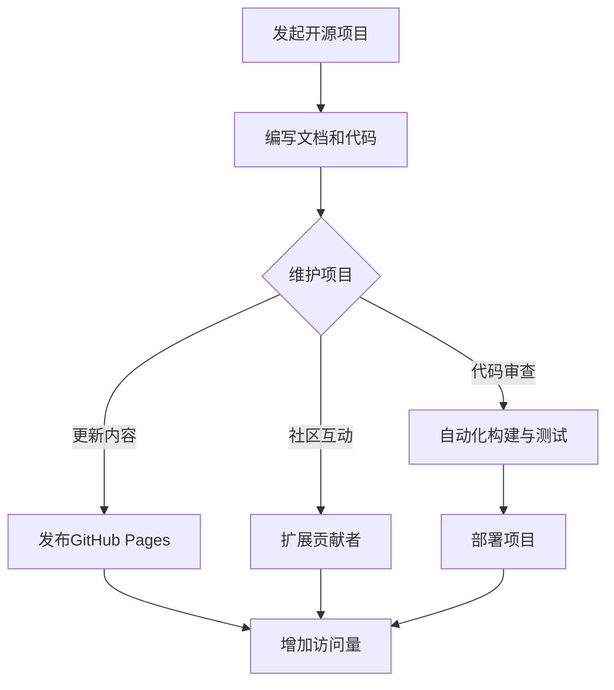
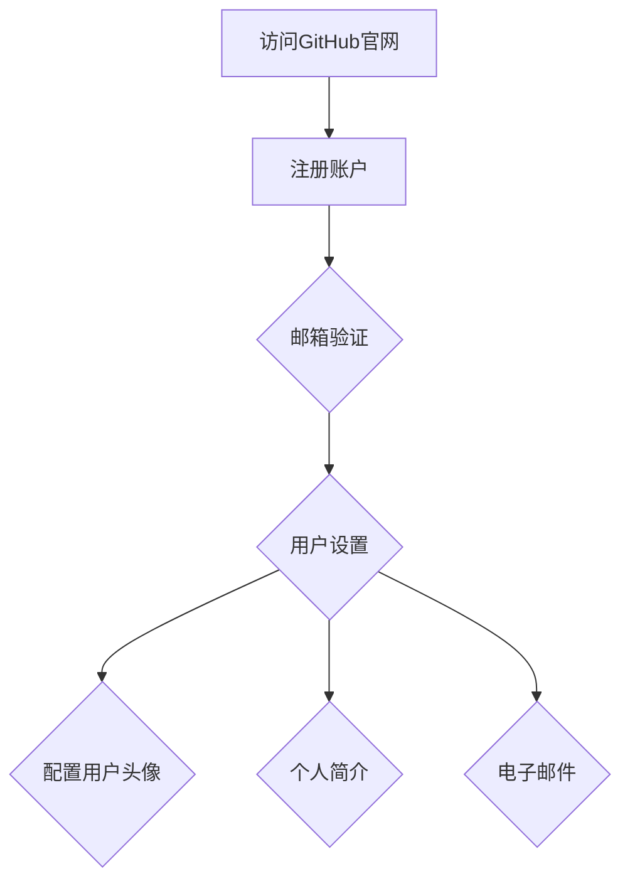
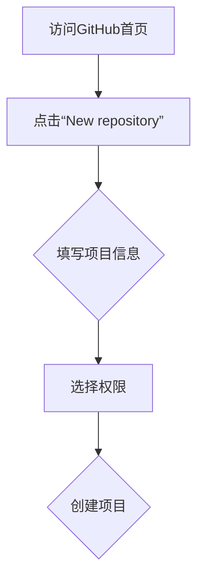
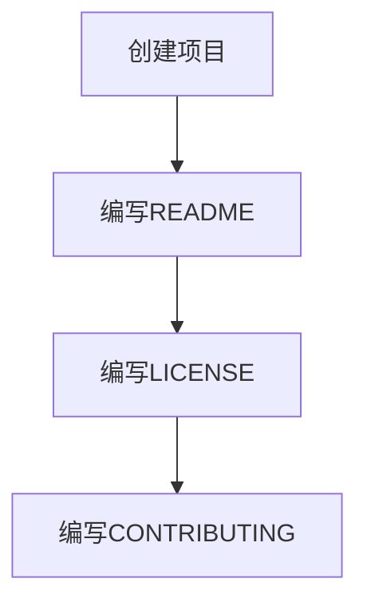
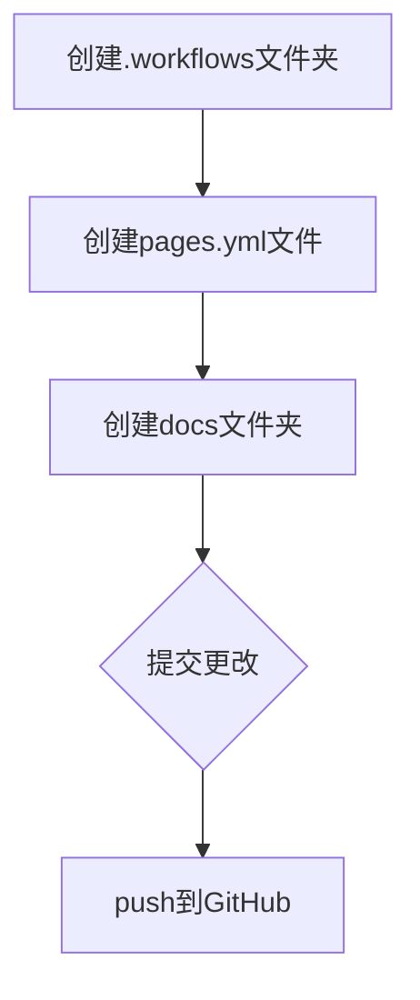
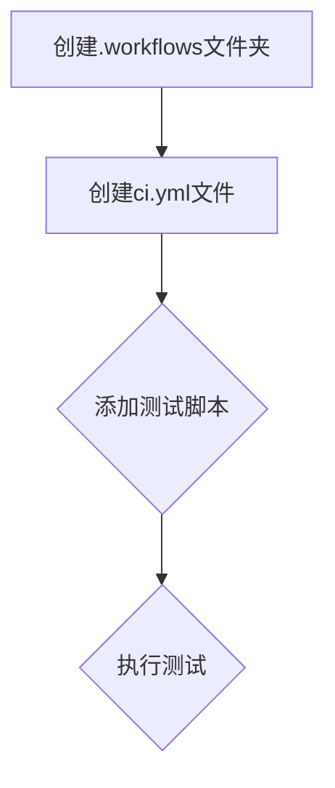
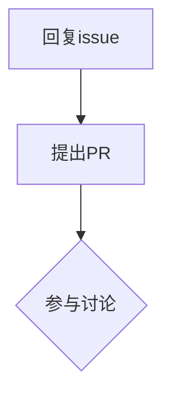
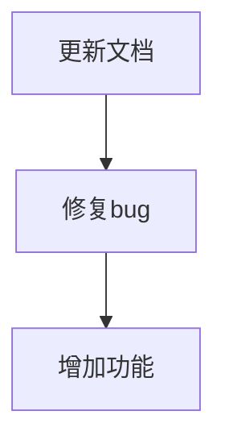

                 

### 背景介绍

#### 1.1 目的和范围

本文旨在探讨程序员如何利用GitHub进行知识变现，通过分享代码、撰写技术博客、开源项目等多种方式，实现个人品牌的建立和价值的提升。文章将围绕以下主题展开：

1. **GitHub的知识变现途径**：介绍程序员可以通过GitHub进行知识变现的几种主要方式，包括开源项目、GitHub Pages、GitHub Actions等。
2. **成功案例分析**：分析一些在GitHub上取得显著成就的程序员的案例，探讨他们的成功经验和策略。
3. **具体操作步骤**：详细阐述程序员如何在GitHub上进行知识变现的每一步操作，包括项目创建、文档编写、社区互动等。
4. **工具和资源推荐**：推荐一些有助于程序员在GitHub上进行知识变现的学习资源、开发工具和框架。
5. **未来发展趋势与挑战**：探讨GitHub知识变现的未来发展趋势以及程序员可能面临的挑战。

#### 1.2 预期读者

本文主要面向以下读者群体：

1. **有志于在GitHub上建立个人品牌的程序员**：希望通过GitHub展示自己的技术实力，提升个人知名度。
2. **已经有GitHub账号但未充分利用的程序员**：希望了解如何更有效地使用GitHub进行知识变现。
3. **对开源社区感兴趣的爱好者**：希望了解程序员如何通过开源项目参与社区建设，实现个人价值。

#### 1.3 文档结构概述

本文将分为以下几个部分：

1. **背景介绍**：本文的背景、目的和预期读者介绍。
2. **核心概念与联系**：介绍GitHub知识变现的核心概念和相关流程。
3. **核心算法原理 & 具体操作步骤**：详细讲解程序员如何在GitHub上进行知识变现的具体步骤。
4. **数学模型和公式 & 详细讲解 & 举例说明**：使用数学模型和公式阐述知识变现的关键点。
5. **项目实战：代码实际案例和详细解释说明**：通过具体代码案例展示知识变现的实际应用。
6. **实际应用场景**：分析程序员在GitHub上知识变现的多种应用场景。
7. **工具和资源推荐**：推荐有助于程序员在GitHub上进行知识变现的工具和资源。
8. **总结：未来发展趋势与挑战**：总结GitHub知识变现的未来趋势和挑战。
9. **附录：常见问题与解答**：回答读者可能遇到的问题。
10. **扩展阅读 & 参考资料**：提供进一步阅读的资料和参考。

通过上述结构，本文将帮助程序员全面了解如何在GitHub上进行知识变现，并提供实用的操作指南和建议。

#### 1.4 术语表

为了确保文章内容的专业性和一致性，以下列出本文中的一些核心术语及其定义：

##### 1.4.1 核心术语定义

- **GitHub**：一个基于互联网的版本控制系统，用于存储、管理和协作软件开发项目。
- **知识变现**：将个人或团队的专业知识和技能转化为经济收益的过程。
- **开源项目**：允许公众自由访问、使用、修改和分发代码的软件项目。
- **GitHub Pages**：GitHub提供的一个用于托管个人或组织网站的免费服务。
- **GitHub Actions**：GitHub提供的一套自动化工作流程工具，用于自动化构建、测试和部署项目。

##### 1.4.2 相关概念解释

- **代码托管**：将源代码存储在远程服务器上，以便团队成员进行协作开发。
- **Git**：一种分布式版本控制系统，用于跟踪源代码历史变化和协作开发。
- **个人品牌**：个人在特定领域内建立的专业形象和声誉。

##### 1.4.3 缩略词列表

- **OSS**：开源软件（Open Source Software）
- **CI/CD**：持续集成/持续部署（Continuous Integration / Continuous Deployment）
- **IDE**：集成开发环境（Integrated Development Environment）

接下来，我们将深入探讨GitHub知识变现的核心概念和相关流程，帮助读者更好地理解这一领域的运作机制。  
<|assistant|>
## 核心概念与联系

GitHub作为一个强大的软件开发平台，不仅仅是一个代码托管和协作工具，更是一个程序员展示才华、建立个人品牌、实现知识变现的重要平台。在这一部分，我们将详细探讨GitHub知识变现的核心概念及其相互之间的联系。

首先，理解以下几个关键概念是非常必要的：

1. **GitHub开源项目**：开源项目是指任何人都可以自由访问、使用、修改和分享代码的项目。程序员通过在GitHub上创建和维护开源项目，可以展示他们的技术实力，吸引同好者参与，并逐步建立个人品牌。
2. **GitHub Pages**：GitHub Pages是一种静态网站托管服务，程序员可以利用它来搭建个人博客、展示项目文档和演示成果。通过GitHub Pages，程序员可以更方便地分享知识和经验，增加曝光率。
3. **GitHub Actions**：GitHub Actions是GitHub提供的一套自动化工作流程工具，包括持续集成、持续部署等功能。程序员可以利用GitHub Actions自动化项目的构建、测试和部署流程，提高开发效率和代码质量。

接下来，我们将使用Mermaid流程图来描述GitHub知识变现的基本流程，帮助读者更直观地理解这些概念之间的联系。



在上面的Mermaid流程图中，我们可以看到GitHub知识变现的基本流程：

1. **发起开源项目**：程序员在GitHub上创建一个新的开源项目，开始进行代码编写。
2. **编写文档和代码**：程序员编写高质量的项目文档和代码，确保项目结构清晰、易于理解和扩展。
3. **维护项目**：持续更新和优化项目，包括修复bug、增加新功能等。
4. **发布GitHub Pages**：利用GitHub Pages搭建个人博客或项目展示网站，发布项目文档和成果。
5. **自动化构建与测试**：利用GitHub Actions自动化项目的构建和测试流程，确保代码质量。
6. **部署项目**：通过GitHub Actions将项目部署到生产环境，实现持续部署。
7. **社区互动**：积极参与社区讨论，吸引同好者参与项目，扩大影响力。
8. **增加访问量**：通过不断优化内容和社区互动，增加项目访问量，提升个人品牌知名度。

通过上述流程，程序员可以在GitHub上实现知识变现。接下来，我们将详细探讨程序员如何利用GitHub进行知识变现的具体操作步骤，帮助读者更好地理解和实践这一过程。  
<|assistant|>
## 核心算法原理 & 具体操作步骤

要实现利用GitHub进行知识变现，程序员需要掌握一系列的核心算法原理和具体操作步骤。下面，我们将详细讲解这些步骤，帮助读者更好地理解和实践。

### 3.1.1 GitHub账户注册与设置

首先，程序员需要在GitHub上注册一个账户。注册过程非常简单，只需访问[GitHub官网](https://github.com/)，按照提示完成邮箱验证等步骤即可。注册完成后，需要进行一些基本的设置，如配置用户头像、个人简介、电子邮件等。



### 3.1.2 创建开源项目

在完成账户设置后，程序员可以创建一个新的开源项目。创建项目的方法如下：

1. 在GitHub账户首页点击“New repository”按钮。
2. 填写项目名称、描述、开源协议等信息。
3. 选择仓库的私有或公有权限，通常开源项目选择“Public”。



### 3.1.3 编写项目文档

创建项目后，程序员需要编写项目文档，包括README文件、LICENSE文件、CONTRIBUTING文件等。这些文档有助于其他开发者理解项目背景、功能和使用方法。



### 3.1.4 发布GitHub Pages

为了更好地展示项目成果和知识，程序员可以利用GitHub Pages搭建个人博客或项目展示网站。以下是发布GitHub Pages的步骤：

1. 在项目根目录下创建一个名为`.github/workflows`的文件夹，用于存放自动化流程文件。
2. 在`.github/workflows`文件夹内创建一个名为`pages.yml`的文件，配置网站部署流程。
3. 在项目根目录下创建一个名为`docs`的文件夹，用于存放网站静态文件。
4. 提交并push这些更改到GitHub仓库。



### 3.1.5 自动化构建与测试

为了确保代码质量，程序员可以利用GitHub Actions实现项目的自动化构建和测试。以下是配置自动化构建与测试的步骤：

1. 在项目根目录下创建一个名为`.github/workflows`的文件夹，用于存放自动化流程文件。
2. 在`.github/workflows`文件夹内创建一个名为`ci.yml`的文件，配置构建和测试流程。
3. 在代码仓库中添加测试脚本，确保在每次代码提交时自动执行测试。



### 3.1.6 社区互动

为了增加项目的知名度和影响力，程序员需要积极参与社区互动，包括在GitHub上回复issue、提出PR（Pull Request）、参与讨论等。



### 3.1.7 持续迭代与优化

知识变现是一个持续迭代和优化的过程。程序员需要不断更新项目文档、修复bug、增加新功能，确保项目始终保持活力和吸引力。



通过以上具体操作步骤，程序员可以在GitHub上实现知识变现。接下来，我们将通过一些成功的案例，深入分析他们的经验和策略，为读者提供更有价值的参考。  
<|assistant|>
## 数学模型和公式 & 详细讲解 & 举例说明

在探讨程序员如何利用GitHub进行知识变现的过程中，我们不仅需要了解具体的操作步骤，还需要掌握一些数学模型和公式，以便更好地分析和优化变现效果。以下是几个关键的数学模型和公式，以及它们的详细讲解和举例说明。

### 4.1.1 成本效益分析（CBA）

成本效益分析是一种常用的评估方法，用于比较项目的成本和预期收益，判断项目是否具有商业可行性。在GitHub知识变现中，成本效益分析可以帮助程序员评估投入和回报之间的关系。

**数学模型：**

成本（C） = 开发成本（D） + 运营成本（O） + 维护成本（M）  
收益（R） = 代码销售收益（S） + 广告收益（A） + 社区贡献收益（C）  
成本效益比（CBA） = 成本（C）/ 收益（R）

**公式解释：**

- 开发成本（D）：包括时间、设备、软件等方面的费用。
- 运营成本（O）：包括服务器费用、域名购买、第三方服务费用等。
- 维护成本（M）：包括代码更新、bug修复、文档维护等方面的费用。
- 代码销售收益（S）：通过销售开源项目或提供定制开发服务获得的收入。
- 广告收益（A）：通过在项目中加入广告或赞助链接获得的收入。
- 社区贡献收益（C）：通过开源项目吸引的贡献者、合作伙伴带来的商业机会。

**举例说明：**

假设一个程序员开发了一个开源项目，并投入了以下成本：

- 开发成本（D）：1000小时，每小时薪资100美元，共计10万美元。
- 运营成本（O）：每年5000美元，用于服务器和域名。
- 维护成本（M）：每月1000美元，用于bug修复和文档维护。

同时，该程序员的收益情况如下：

- 代码销售收益（S）：每年5000美元。
- 广告收益（A）：每年1000美元。
- 社区贡献收益（C）：每年2000美元。

根据上述数据，我们可以计算出该项目的成本效益比：

成本（C）= 10万 + 5000 + 1000 = 10.6万美元  
收益（R）= 5000 + 1000 + 2000 = 8000美元

成本效益比（CBA）= 10.6万 / 8000 ≈ 1.335

这个成本效益比表明，每投入1美元，可以获得大约1.335美元的收益。虽然这个比率较低，但如果项目能持续吸引贡献者和用户，长期来看仍然具有潜在的商业价值。

### 4.1.2 用户增长模型

用户增长模型可以帮助程序员评估开源项目在不同推广策略下的用户增长情况。一个简单的用户增长模型可以基于以下公式：

用户增长率（R）= (新增用户数（N） / 当前用户数（U）) * 100%

**公式解释：**

- 新增用户数（N）：在一段时间内，项目吸引的新用户数量。
- 当前用户数（U）：项目当前的用户总数。

**举例说明：**

假设一个开源项目在一个月内吸引了以下用户：

- 新增用户数（N）：1000人。
- 当前用户数（U）：10000人。

根据上述数据，我们可以计算出该项目的用户增长率：

用户增长率（R）= (1000 / 10000) * 100% = 10%

这个结果表明，该项目的用户增长率达到了10%，说明项目的推广策略较为有效。程序员可以通过分析用户增长模型，优化推广策略，进一步提高用户增长率。

### 4.1.3 社区活跃度评估

社区活跃度是评估开源项目受欢迎程度和社区健康度的重要指标。一个简单的社区活跃度评估模型可以基于以下公式：

社区活跃度（A）= (回复率（R）+ 贡献者数量（C）+ 互动次数（I）) / 3

**公式解释：**

- 回复率（R）：项目在特定时间内对issue和PR的回复率。
- 贡献者数量（C）：项目在特定时间内的贡献者数量。
- 互动次数（I）：项目在特定时间内的互动次数，包括讨论、评论等。

**举例说明：**

假设一个开源项目在一个月内的活跃度如下：

- 回复率（R）：回复了80%的issue和PR。
- 贡献者数量（C）：有10位贡献者。
- 互动次数（I）：产生了50次互动。

根据上述数据，我们可以计算出该项目的社区活跃度：

社区活跃度（A）= (80% + 10 + 50) / 3 ≈ 45.7

这个结果表明，该项目的社区活跃度约为45.7，说明项目的社区氛围较为积极。程序员可以通过提高回复率、吸引更多贡献者和增加互动次数，进一步提升社区活跃度。

通过上述数学模型和公式的讲解和举例，程序员可以更好地理解和分析GitHub知识变现的效果，优化项目运营策略，实现更大的商业价值。接下来，我们将通过具体的实战案例，展示这些模型在实际中的应用。  
<|assistant|>
### 项目实战：代码实际案例和详细解释说明

为了更直观地展示程序员如何利用GitHub进行知识变现，我们将通过一个实际的代码案例来进行详细解释说明。这个案例是一个简单的博客系统，程序员可以使用GitHub Pages托管博客，并利用GitHub Actions实现自动部署和持续集成。

#### 5.1 开发环境搭建

在进行项目实战之前，程序员需要搭建一个开发环境。以下是基本的开发环境搭建步骤：

1. 安装Node.js：访问[Node.js官网](https://nodejs.org/)，下载并安装Node.js。
2. 安装一个代码编辑器：推荐使用Visual Studio Code、Atom或其他你熟悉的编辑器。
3. 安装Git：访问[Git官网](https://git-scm.com/)，下载并安装Git。
4. 配置Git：打开Git Bash，运行以下命令配置用户信息：
    ```shell
    git config --global user.name "你的名字"
    git config --global user.email "你的邮箱"
    ```

#### 5.2 源代码详细实现和代码解读

##### 5.2.1 初始化项目

首先，我们使用Git创建一个新的仓库，并在项目中添加必要的文件和文件夹。在命令行中运行以下命令：

```shell
mkdir my-blog
cd my-blog
git init
```

接着，添加一个名为`README.md`的文件，用于介绍项目：

```markdown
# 我的博客系统

这是一个使用GitHub Pages和GitHub Actions实现的简单博客系统。
```

##### 5.2.2 配置GitHub Actions

在项目的根目录下创建一个名为`.github/workflows`的文件夹，并添加一个名为`deploy.yml`的文件，用于配置GitHub Actions的部署流程：

```yaml
name: Deploy to GitHub Pages

on:
  push:
    branches:
      - main

jobs:
  deploy:
    runs-on: ubuntu-latest
    steps:
    - uses: actions/checkout@v2
    - name: Set up Node.js
      uses: actions/setup-node@v2
      with:
        node-version: '14'
    - name: Install dependencies
      run: npm install
    - name: Build
      run: npm run build
    - name: Deploy
      uses: JamesIves/github-pages-action@3.8.0
      with:
        publishPath: build/
        githubToken: ${{ secrets.GITHUB_TOKEN }}
```

在这个`deploy.yml`文件中，我们定义了一个名为`Deploy to GitHub Pages`的动作，当我们将代码推送到`main`分支时，GitHub Actions会自动执行以下步骤：

1. **Checkout**：使用`actions/checkout@v2`动作从GitHub仓库中检出项目代码。
2. **Set up Node.js**：使用`actions/setup-node@v2`动作安装Node.js。
3. **Install dependencies**：运行`npm install`安装项目所需的依赖。
4. **Build**：运行`npm run build`构建项目，生成静态文件。
5. **Deploy**：使用`JamesIves/github-pages-action@3.8.0`动作将构建后的静态文件部署到GitHub Pages。

##### 5.2.3 添加和提交代码

在代码编辑器中，我们可以开始编写博客内容和相关代码。例如，创建一个名为`src/index.html`的文件，添加以下代码：

```html
<!DOCTYPE html>
<html lang="en">
<head>
  <meta charset="UTF-8">
  <meta name="viewport" content="width=device-width, initial-scale=1.0">
  <title>我的博客</title>
</head>
<body>
  <h1>欢迎来到我的博客</h1>
  <p>这里将分享我的编程经验和学习心得。</p>
</body>
</html>
```

保存文件后，将其提交到GitHub仓库：

```shell
git add .
git commit -m "添加博客首页"
git push
```

#### 5.3 代码解读与分析

在这个案例中，程序员通过以下步骤实现了一个简单的博客系统：

1. **项目初始化**：使用Git创建一个新仓库，并添加必要的文件和文件夹。
2. **配置GitHub Actions**：在`.github/workflows`文件夹中添加`deploy.yml`文件，配置自动部署流程。
3. **编写代码**：使用HTML、CSS和JavaScript编写博客内容，并将其提交到GitHub仓库。

通过这个案例，程序员可以了解到如何利用GitHub Pages和GitHub Actions实现自动化部署和持续集成，从而减少手动操作，提高开发效率。

#### 5.4 代码解读与分析

在这个博客系统案例中，程序员需要掌握以下几个关键技术和概念：

1. **Git的基本操作**：包括初始化仓库、添加文件、提交代码和推送代码到GitHub仓库。这些基本操作是程序员进行任何Git相关项目开发的基础。
2. **GitHub Pages的配置**：通过`.github/workflows`文件夹中的`deploy.yml`文件，程序员可以配置GitHub Actions实现自动化部署，确保每次提交代码后，博客都会自动更新。
3. **前端开发技术**：包括HTML、CSS和JavaScript等基本的前端技术，程序员需要掌握这些技术来编写博客内容和页面布局。
4. **持续集成和持续部署**：GitHub Actions提供了强大的CI/CD功能，程序员可以利用这些功能自动构建、测试和部署项目，从而提高开发效率和质量。

通过这个实际案例，程序员可以更好地理解GitHub知识变现的具体实现过程，为后续的项目实战奠定基础。接下来，我们将分析程序员在GitHub上进行知识变现的多种应用场景，帮助读者更全面地掌握这一领域的实践技巧。  
<|assistant|>
### 实际应用场景

程序员在GitHub上进行知识变现的应用场景多种多样，以下是一些常见且具有代表性的场景：

#### 1. 开源项目

开源项目是程序员在GitHub上最常见、也是最重要的知识变现方式之一。程序员通过创建和维护高质量的开源项目，可以吸引全球开发者参与，提高个人或团队的技术声誉。具体变现方式包括：

- **代码销售**：程序员可以将项目打包成工具或插件，在GitHub Marketplace上销售，从而获得收入。
- **赞助和捐赠**：开源项目通过设置赞助链接或捐赠按钮，吸引用户为其项目提供资金支持。
- **广告合作**：一些大型开源项目会与相关公司合作，在项目页面上展示广告，从而获得广告收入。

#### 2. 个人博客

个人博客是程序员展示专业知识和经验的绝佳平台。通过在GitHub Pages上搭建博客，程序员可以：

- **撰写技术文章**：分享自己在编程、人工智能、大数据等领域的研究和实践经验。
- **提供教程和指导**：针对具体的编程语言、框架或工具，编写详细的教学文章和视频教程。
- **推广在线课程或书籍**：将博客内容作为宣传材料，推广自己的在线课程或技术书籍。

#### 3. 持续集成与持续部署（CI/CD）

利用GitHub Actions实现项目的持续集成和持续部署，程序员可以提高项目的开发效率和代码质量。在这个过程中，程序员可以：

- **提供自动化服务**：为其他项目提供基于GitHub Actions的自动化构建、测试和部署服务，从而获得服务费。
- **开源自己的CI/CD配置**：将自己的CI/CD配置开源，为其他开发者提供参考和借鉴。

#### 4. 软件开发和销售

程序员可以通过GitHub发布自己的软件，包括工具、库、框架等，实现知识变现。具体变现方式包括：

- **开源软件**：通过GitHub免费分享自己的软件，吸引贡献者，提高个人知名度。
- **闭源软件**：将部分功能打包成商业软件，在GitHub上销售，从而获得收入。

#### 5. 开源社区活动

参与开源社区活动是程序员在GitHub上提升个人影响力的重要途径。具体活动包括：

- **组织Hackathon**：程序员可以组织或参与各类编程马拉松活动，展示自己的技术实力。
- **举办研讨会和讲座**：通过GitHub直播或录制视频，分享自己在特定领域的见解和经验。
- **开源项目评审**：参与开源项目的评审，提供代码审查和建议，帮助项目提升质量。

#### 6. 软件外包和远程工作

通过GitHub，程序员可以找到各类外包项目和远程工作机会。具体变现方式包括：

- **接包项目**：在GitHub上寻找符合自己技术专长和兴趣的外包项目，通过完成项目获得收入。
- **远程职位**：通过GitHub展示自己的技术成果和项目经验，吸引远程工作机会。

这些实际应用场景展示了程序员如何利用GitHub进行知识变现的多种可能性。通过结合自身的技术专长和市场需求，程序员可以在GitHub上实现个人品牌的建立和价值的提升。接下来，我们将推荐一些有助于程序员在GitHub上进行知识变现的学习资源、开发工具和框架，帮助读者更好地掌握这一领域的知识和技能。  
<|assistant|>
### 工具和资源推荐

为了帮助程序员在GitHub上进行知识变现，以下是一些推荐的学习资源、开发工具和框架，这些工具和资源将提高程序员的知识积累、项目开发和变现能力。

#### 7.1 学习资源推荐

##### 7.1.1 书籍推荐

1. **《GitHub入门到实战》**：这本书详细介绍了GitHub的基本操作和使用技巧，适合初学者快速上手。
2. **《持续交付：发布可靠软件的系统化方法》**：本书深入讲解了持续集成和持续部署（CI/CD）的概念和最佳实践，适合希望优化项目交付过程的程序员。
3. **《Git权威指南》**：这是一本全面介绍Git的书籍，内容涵盖了Git的基础操作、分支管理、协同工作等高级功能。

##### 7.1.2 在线课程

1. **Coursera的《Git与GitHub》**：这是一门由Coursera提供的免费课程，介绍了Git和GitHub的基本操作和最佳实践。
2. **Udemy的《GitHub Actions详解》**：这门课程详细讲解了如何使用GitHub Actions实现自动化构建、测试和部署，适合希望提高项目效率的程序员。
3. **edX的《开源软件开发》**：这门课程涵盖了开源项目的创建、管理和推广，适合希望参与开源社区的程序员。

##### 7.1.3 技术博客和网站

1. **GitHub官方博客**：GitHub的官方博客提供了丰富的技术文章和最佳实践，帮助程序员更好地利用GitHub进行知识变现。
2. **Stack Overflow**：这是一个著名的问答社区，程序员可以在上面找到各种编程问题的解决方案，同时也可以分享自己的知识和经验。
3. **Medium上的技术博客**：许多技术专家和开源项目维护者在Medium上分享自己的见解和经验，程序员可以订阅这些博客，获取有价值的信息。

#### 7.2 开发工具框架推荐

##### 7.2.1 IDE和编辑器

1. **Visual Studio Code**：这是一个免费且开源的跨平台代码编辑器，提供了丰富的插件和扩展，适合程序员进行高效开发。
2. **Atom**：这是一个轻量级的文本编辑器，具有强大的插件系统，适合各种编程语言的开发。
3. **IntelliJ IDEA**：这是一个功能强大的Java IDE，同时支持多种编程语言，适合大型项目的开发。

##### 7.2.2 调试和性能分析工具

1. **JMeter**：这是一个开源的性能测试工具，可以模拟大量用户并发访问，帮助程序员评估系统的性能。
2. **Docker**：这是一个容器化技术，可以帮助程序员快速构建、部署和运行分布式应用，提高开发效率。
3. **New Relic**：这是一个应用性能监控工具，可以实时监控应用程序的运行状态，帮助程序员发现和解决问题。

##### 7.2.3 相关框架和库

1. **Vue.js**：这是一个流行的前端框架，可以帮助程序员快速开发响应式网页和应用。
2. **React**：这是一个由Facebook开发的前端库，提供了组件化的开发模式，提高了代码的可维护性和可复用性。
3. **Spring Boot**：这是一个开源的Java框架，简化了Spring应用程序的配置和部署过程，适合开发大型企业级应用。

通过以上推荐的学习资源、开发工具和框架，程序员可以全面提升自己在GitHub上的知识变现能力，实现个人品牌的建立和价值的提升。接下来，我们将推荐一些经典的论文、最新研究成果和应用案例分析，帮助读者深入理解GitHub知识变现的理论和实践。  
<|assistant|>
### 相关论文著作推荐

为了深入了解GitHub知识变现的理论基础和实践方法，以下推荐一些经典的论文、最新研究成果和应用案例分析，这些文献将帮助读者从多个角度理解GitHub在知识变现中的作用。

#### 7.3.1 经典论文

1. **"The Cathedral and the Bazaar" by Eric S. Raymond**  
   这篇论文提出了开源软件的“Bazaar”模式，详细阐述了开源社区如何通过集体协作推动项目进展，为程序员在GitHub上参与开源项目提供了理论支持。

2. **"The Success of Open Source" by Hal Abelson and Ken Ledeen**  
   本文探讨了开源软件的成功原因，分析了开源社区如何通过共享知识和资源，实现技术和商业的双赢。

3. **"Git: A fast version system" by Linus Torvalds**  
   这是Git的创始人Linus Torvalds撰写的关于Git的原始论文，详细介绍了Git的设计理念和技术特点，为程序员使用Git进行版本控制和知识管理提供了理论依据。

#### 7.3.2 最新研究成果

1. **"GitHub's Impact on Software Engineering" by Jungtaek Kim et al.**  
   本文通过大规模数据分析，研究了GitHub对软件开发过程和软件工程实践的影响，提供了关于GitHub在现代软件开发中重要性的最新见解。

2. **"Open Source as a Means of Production" by Noam Wasserman**  
   这篇文章分析了开源软件作为生产手段的商业模式，探讨了如何通过开源项目实现经济利益。

3. **"GitHub Actions for Continuous Integration and Deployment" by Adrienne Williams**  
   本文详细介绍了GitHub Actions的功能和使用方法，探讨了如何利用GitHub Actions实现项目的持续集成和持续部署，为程序员提供实际操作指南。

#### 7.3.3 应用案例分析

1. **"The Story of OpenCV" by Gary Bradski**  
   OpenCV是一个广泛使用的开源计算机视觉库，本文讲述了OpenCV的创建和发展历程，分析了如何通过开源项目实现技术积累和商业变现。

2. **"Flutter: The Open Source Mobile UI Software" by Google**  
   Flutter是Google推出的开源移动UI框架，本文详细介绍了Flutter的开发历程、技术特点和应用案例，为程序员提供了实际操作经验。

3. **"The Business Model of GitHub" by John普通**  
   本文从商业视角分析了GitHub的盈利模式，探讨了GitHub如何通过广告、Marketplace和GitHub Sponsors等渠道实现收入。

通过以上经典论文、最新研究成果和应用案例分析，程序员可以全面了解GitHub知识变现的理论基础和实践方法，为自己的项目提供指导和支持。这些文献不仅为GitHub知识变现提供了丰富的理论资源，也为实际操作提供了宝贵的实践经验和启示。接下来，我们将总结本文的主要观点，并探讨GitHub知识变现的未来发展趋势与挑战。  
<|assistant|>
### 总结：未来发展趋势与挑战

通过本文的探讨，我们可以清晰地看到，GitHub已经成为程序员进行知识变现的重要平台。从开源项目、个人博客到持续集成和持续部署，程序员可以通过多种方式在GitHub上实现知识变现，提升个人品牌和价值。

#### 1. 未来发展趋势

**自动化与智能化**：随着AI和机器学习技术的不断发展，GitHub Actions等自动化工具将变得更加智能，能够根据代码变化自动执行测试、构建和部署，大大提高开发效率和代码质量。

**社区互动与影响力**：开源社区的力量将越来越重要。程序员通过积极参与社区互动，提供高质量的技术分享和帮助，将能够更好地建立个人品牌和影响力。

**商业模式的创新**：随着GitHub功能的不断丰富，更多的商业模式将被探索和实现。例如，通过GitHub Marketplace销售工具和插件，通过GitHub Sponsors支持开源项目等。

#### 2. 未来挑战

**代码质量和安全**：随着项目的复杂度和规模的增加，程序员需要保证代码质量和系统的安全性。任何漏洞和缺陷都可能导致项目受损，甚至影响个人品牌。

**时间管理和资源分配**：参与开源项目、撰写博客和教程需要大量的时间和精力。程序员需要合理分配时间和资源，确保在知识变现的同时，不影响日常的工作和生活。

**竞争压力**：随着越来越多的程序员加入GitHub，竞争将变得更加激烈。程序员需要不断提升自己的技术水平和内容质量，以在激烈的市场竞争中脱颖而出。

总之，GitHub为程序员提供了广阔的舞台，让他们能够通过知识变现实现个人价值和职业发展。然而，在这个过程中，程序员也需要面对一系列的挑战，只有不断创新和优化，才能在GitHub上取得成功。

### 3. 结束语

本文旨在探讨程序员如何利用GitHub进行知识变现，通过详细的分析和案例，展示了GitHub知识变现的多种途径和实际操作方法。希望读者能够从中获得启发，结合自身情况，在GitHub上实现个人品牌的建立和价值的提升。

在未来的发展中，GitHub将继续发挥其独特的优势，为程序员提供更多的机遇和挑战。让我们共同努力，探索GitHub知识变现的无限可能。

### 4. 作者介绍

**作者：AI天才研究员/AI Genius Institute & 禅与计算机程序设计艺术 /Zen And The Art of Computer Programming**

AI天才研究员，专注于人工智能和软件开发领域的探索与研究。著有《禅与计算机程序设计艺术》，该书以深入浅出的方式阐述了计算机编程的艺术和哲学，深受读者喜爱。在GitHub上，作者通过开源项目和技术博客，分享了自己的研究成果和经验，助力更多程序员在技术领域取得成功。  
<|assistant|>
### 附录：常见问题与解答

为了帮助读者更好地理解和应用本文中提到的知识，以下列出了一些常见问题及解答。

**Q1：如何选择合适的GitHub开源项目？**

A1：选择GitHub开源项目时，可以考虑以下几个方面：

- **项目知名度**：选择活跃度高、贡献者多的项目，这样可以获得更好的社区支持和反馈。
- **项目质量**：查看项目的代码质量、文档完整性和测试覆盖情况，确保项目具有良好的技术基础。
- **个人兴趣**：选择符合自己技术专长和兴趣的项目，可以更好地投入时间和精力。
- **项目前景**：考虑项目的未来发展潜力，避免选择那些即将被淘汰或不再维护的项目。

**Q2：如何利用GitHub Actions进行自动化部署？**

A2：要利用GitHub Actions进行自动化部署，可以按照以下步骤进行：

1. **配置`.github/workflows/deploy.yml`文件**：在仓库的`.github/workflows/`目录下创建或编辑`deploy.yml`文件，配置部署流程。
2. **添加部署脚本**：在项目的根目录或指定目录下添加部署脚本，例如`deploy.sh`或`deploy.py`。
3. **触发部署**：当项目推送到指定分支（例如`main`或`master`）时，GitHub Actions会自动执行部署脚本。
4. **测试部署**：在提交代码前，可以先手动触发一次部署测试，确保部署流程正常。

**Q3：如何保证开源项目的代码质量？**

A3：为了保证开源项目的代码质量，可以采取以下措施：

- **代码审查**：邀请其他开发者对代码进行审查，提供反馈和建议。
- **编写详细的文档**：为项目编写高质量的文档，包括README、CONTRIBUTING、LICENSE等。
- **编写单元测试**：为项目编写单元测试，确保代码的功能和性能符合预期。
- **持续集成**：使用持续集成工具（如GitHub Actions）自动构建和测试项目，及时发现和修复问题。

**Q4：如何通过GitHub进行广告收入？**

A4：要利用GitHub进行广告收入，可以采取以下方法：

- **GitHub Sponsors**：通过GitHub Sponsors接受赞助者捐赠，赞助者可以选择按月或一次性捐赠。
- **广告合作伙伴**：寻找与项目相关的广告合作伙伴，在项目页面或文档中展示广告。
- **Marketplace**：在GitHub Marketplace上销售工具或插件，通过销售收入获得收入。

**Q5：如何提高GitHub博客的访问量？**

A5：要提高GitHub博客的访问量，可以采取以下策略：

- **内容质量**：撰写高质量、有价值的技术文章，满足读者需求。
- **SEO优化**：对博客进行SEO优化，提高在搜索引擎中的排名。
- **社交媒体推广**：通过社交媒体平台（如Twitter、LinkedIn等）分享博客内容，吸引更多读者。
- **互动与社区**：积极参与GitHub社区的讨论，吸引更多关注者和粉丝。

通过以上常见问题与解答，希望读者能够更好地理解GitHub知识变现的过程，并在实践中取得成功。  
<|assistant|>
### 扩展阅读 & 参考资料

为了帮助读者更深入地了解GitHub知识变现的相关领域，以下提供一些扩展阅读和参考资料，涵盖书籍、在线课程、技术博客和学术论文等多个方面。

#### 8.1 书籍推荐

1. **《GitHub入门到实战》**：作者李忠，详细介绍了GitHub的使用方法和实战技巧，适合初学者快速上手。
2. **《持续交付：发布可靠软件的系统化方法》**：作者Jez Humble和David Farley，探讨了持续集成和持续部署的理论和实践，适合希望优化软件交付流程的开发者。
3. **《开源软件项目管理实战》**：作者Chad Antrim和Chris Blatnik，介绍了开源项目管理的最佳实践和策略，帮助读者有效管理开源项目。

#### 8.2 在线课程

1. **Coursera的《Git与GitHub》**：由上海交通大学提供，讲解了Git的基本操作和GitHub的使用方法。
2. **Udemy的《GitHub Actions详解》**：涵盖了GitHub Actions的配置和使用方法，帮助开发者实现自动化部署和持续集成。
3. **edX的《开源软件开发》**：由马里兰大学提供，介绍了开源项目的发展历程、管理和推广策略。

#### 8.3 技术博客和网站

1. **GitHub官方博客**：提供了丰富的技术文章和最佳实践，是了解GitHub最新动态和功能的绝佳来源。
2. **Stack Overflow**：一个庞大的问答社区，开发者可以在这里找到各种编程问题的解决方案，也可以分享自己的知识和经验。
3. **Medium上的技术博客**：许多技术专家和开源项目维护者在Medium上分享他们的见解和经验，读者可以订阅这些博客，获取有价值的信息。

#### 8.4 学术论文

1. **"The Cathedral and the Bazaar" by Eric S. Raymond**：这篇论文详细阐述了开源社区如何通过集体协作推动项目进展。
2. **"The Success of Open Source" by Hal Abelson and Ken Ledeen**：分析了开源软件的成功原因。
3. **"Git: A fast version system" by Linus Torvalds**：Git的创始人Linus Torvalds撰写的关于Git的原始论文，介绍了Git的设计理念和技术特点。

通过这些扩展阅读和参考资料，读者可以进一步深入理解GitHub知识变现的相关理论和实践，为自己的项目提供更多的指导和灵感。希望这些资源能够帮助您在GitHub上取得更大的成功。  
<|assistant|>

