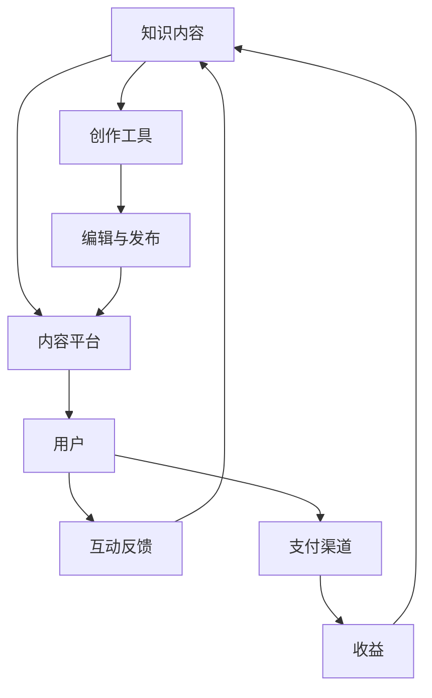
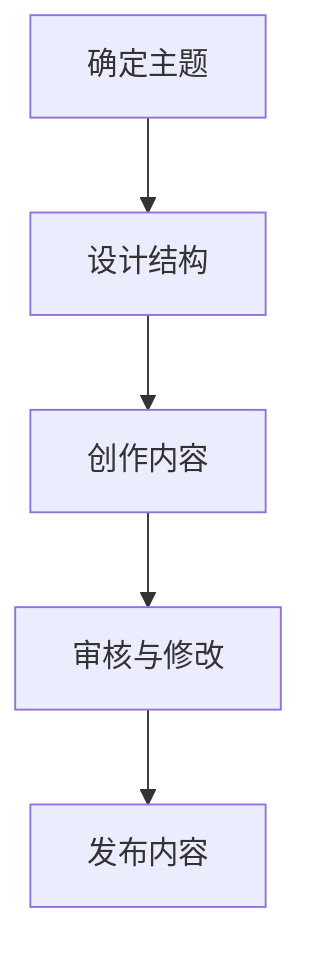
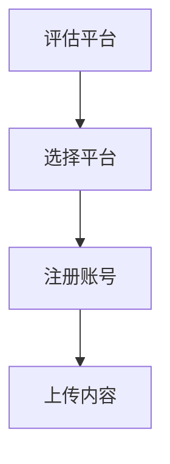
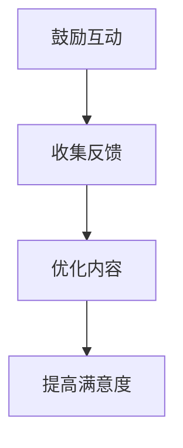
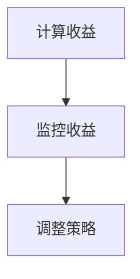

                 

# 程序员如何利用知识付费实现被动收入

> 关键词：知识付费、被动收入、程序员、盈利模式、内容创作、平台选择

> 摘要：随着互联网技术的发展，知识付费逐渐成为新兴的盈利模式。本文将探讨程序员如何利用自己的专业技能，通过知识付费平台实现被动收入。我们将分析知识付费的市场现状，介绍合适的平台和盈利模式，提供具体的操作步骤，并分享实际案例，帮助程序员更好地利用知识付费实现财务自由。

## 1. 背景介绍

### 1.1 目的和范围

本文旨在为程序员提供一套完整的指南，帮助他们利用知识付费平台实现被动收入。我们将探讨以下内容：

1. **知识付费市场的现状**：了解知识付费的发展趋势和市场规模。
2. **适合程序员的盈利模式**：分析内容创作、技术咨询、在线教育等多种盈利方式。
3. **选择合适的平台**：介绍当前流行的知识付费平台及其特点。
4. **操作步骤**：详细讲解如何创建内容、设置价格、推广和监控收益。
5. **实际案例**：分享成功利用知识付费实现被动收入的程序员案例。

### 1.2 预期读者

本文适用于以下程序员群体：

1. **有志于通过知识付费实现财务自由的程序员**。
2. **希望将自己的技能和经验转化为收入的独立开发者**。
3. **在编程领域有一定经验，但尚未涉足知识付费领域的程序员**。

### 1.3 文档结构概述

本文将按照以下结构进行：

1. **背景介绍**：阐述文章的目的和范围，介绍预期读者和文档结构。
2. **核心概念与联系**：介绍知识付费的相关概念，使用流程图展示各环节的联系。
3. **核心算法原理 & 具体操作步骤**：详细讲解如何利用知识付费实现被动收入的步骤。
4. **数学模型和公式 & 详细讲解 & 举例说明**：使用数学模型和公式解释关键概念。
5. **项目实战：代码实际案例和详细解释说明**：提供具体的代码案例和解读。
6. **实际应用场景**：分析知识付费在不同领域的应用。
7. **工具和资源推荐**：推荐学习资源和开发工具。
8. **总结：未来发展趋势与挑战**：总结当前趋势，预测未来挑战。
9. **附录：常见问题与解答**：解答读者可能遇到的常见问题。
10. **扩展阅读 & 参考资料**：提供更多深入的阅读材料和参考文献。

### 1.4 术语表

#### 1.4.1 核心术语定义

- **知识付费**：用户为获取有价值的信息或服务，向内容提供者支付费用的一种商业模式。
- **被动收入**：指不需要持续投入大量时间或精力，但能持续产生收入的模式。
- **内容创作**：创建和发布有价值的学习材料、教程、课程等。
- **平台选择**：选择适合自己内容传播和盈利的在线平台。
- **用户反馈**：用户对内容提供者的反馈和评价。

#### 1.4.2 相关概念解释

- **知识付费市场**：指提供知识付费产品和服务的市场，包括平台、内容创作者和用户。
- **盈利模式**：内容提供者通过内容销售、广告、会员制等方式获取收益的途径。
- **在线教育**：通过网络平台提供的教学服务，包括课程、直播、问答等。
- **技术咨询**：为用户提供专业的技术指导和建议，通常以服务费或咨询费的形式收费。

#### 1.4.3 缩略词列表

- **KFC**：Knowledge For Cash（知识付费）
- **LMS**：Learning Management System（学习管理系统）
- **SaaS**：Software as a Service（软件即服务）
- **API**：Application Programming Interface（应用程序编程接口）

## 2. 核心概念与联系

为了更好地理解程序员如何利用知识付费实现被动收入，我们首先需要明确几个核心概念，并使用Mermaid流程图展示各环节的联系。



### 流程说明：

1. **知识内容创作**：程序员利用自己的专业技能和经验，创作高质量的技术教程、案例分享、编程课程等内容。
2. **内容平台选择**：根据内容的性质和目标用户群体，选择合适的在线平台，如知识付费网站、在线教育平台等。
3. **用户互动**：用户通过平台获取程序员的内容，并给予反馈，这些反馈有助于内容优化和持续创作。
4. **支付渠道**：用户通过支付渠道向程序员支付费用，获取知识内容或服务。
5. **收益**：程序员的收入来源于用户支付的学费、会员费、咨询服务费等，形成被动收入。
6. **持续创作**：根据用户反馈和市场需求，程序员不断优化内容，提升用户满意度，实现可持续的被动收入。

## 3. 核心算法原理 & 具体操作步骤

### 3.1 知识内容创作

#### 算法原理：

1. **确定内容主题**：根据自身专业技能和市场需求，选择一个具有高价值、受众广泛的主题。
2. **内容结构设计**：规划内容的章节、知识点和实例，确保内容的系统性和逻辑性。
3. **内容创作**：通过文字、图片、视频等多种形式，将知识点生动形象地传达给用户。

#### 具体操作步骤：



1. **确定主题**：选择一个具有高价值、受众广泛的主题，如前端开发、人工智能等。
2. **设计结构**：规划内容的章节、知识点和实例，确保内容的系统性和逻辑性。
3. **创作内容**：利用专业知识，结合实际案例，以文字、图片、视频等多种形式，创作高质量的内容。
4. **审核与修改**：对内容进行审核，确保内容的准确性、完整性和易理解性。如有需要，进行修改和完善。
5. **发布内容**：将内容发布到知识付费平台，供用户购买和阅读。

### 3.2 选择合适的内容平台

#### 算法原理：

1. **评估平台特性**：根据内容类型、用户群体、平台运营模式等因素，评估平台是否适合发布内容。
2. **选择平台**：选择具有较高用户粘性、良好口碑、合理分成比例的平台。

#### 具体操作步骤：



1. **评估平台**：分析不同平台的用户群体、内容类型、分成比例等，选择最适合发布内容的平台。
2. **选择平台**：根据评估结果，选择具有较高用户粘性、良好口碑、合理分成比例的平台。
3. **注册账号**：在选定的平台注册账号，并完成相关认证。
4. **上传内容**：将创作好的内容上传到平台，进行发布。

### 3.3 用户互动与反馈

#### 算法原理：

1. **鼓励用户互动**：通过互动环节，如评论、问答、直播等，增强用户参与感。
2. **收集用户反馈**：关注用户评价、建议和需求，优化内容和服务。

#### 具体操作步骤：



1. **鼓励互动**：通过平台提供的互动功能，如评论、问答、直播等，鼓励用户参与讨论，增强互动感。
2. **收集反馈**：关注用户评价、建议和需求，通过问卷调查、在线访谈等方式收集用户反馈。
3. **优化内容**：根据用户反馈，调整内容结构、形式和内容深度，提高用户满意度。
4. **提高满意度**：通过持续优化内容和服务，提高用户满意度，增加用户粘性和复购率。

### 3.4 收益管理

#### 算法原理：

1. **收益计算**：根据平台分成比例和用户购买行为，计算收益。
2. **收益监控**：通过平台数据统计功能，监控收益情况，及时调整策略。

#### 具体操作步骤：



1. **计算收益**：根据平台分成比例和用户购买行为，计算每月或每季度的收益。
2. **监控收益**：通过平台提供的数据统计功能，监控收益情况，分析用户购买趋势和内容受欢迎程度。
3. **调整策略**：根据收益数据和用户反馈，调整内容创作和推广策略，优化收益。

## 4. 数学模型和公式 & 详细讲解 & 举例说明

### 4.1 收益计算公式

在知识付费领域，收益计算是一个关键环节。以下是收益计算的基本公式：

$$ 收益 = 用户购买数 \times 单价 \times 分成比例 $$

其中：

- **用户购买数**：在一段时间内，购买内容的用户数量。
- **单价**：每个内容的价格。
- **分成比例**：平台与内容创作者之间的分成比例。

### 详细讲解

这个公式描述了收益的计算过程。我们可以通过以下步骤进行详细讲解：

1. **用户购买数**：通过平台的数据统计功能，获取在一段时间内购买内容的用户数量。例如，如果我们统计了3个月内购买内容的用户数为1000人，那么用户购买数为1000。

2. **单价**：设定每个内容的价格。例如，我们设定的单价为99元。

3. **分成比例**：了解平台与内容创作者之间的分成比例。例如，平台分成比例为4:6，即平台占4成，内容创作者占6成。

4. **计算收益**：将用户购买数、单价和分成比例代入公式，计算收益。例如：

$$ 收益 = 1000 \times 99 \times 0.6 = 59400元 $$

### 举例说明

假设一位程序员在知识付费平台上发布了一门关于Python编程的课程，课程单价为200元，平台分成比例为5:5，即平台和内容创作者各占一半。在一个月内，该课程吸引了100个用户购买。

1. **用户购买数**：100
2. **单价**：200元
3. **分成比例**：5:5

代入公式：

$$ 收益 = 100 \times 200 \times 0.5 = 10000元 $$

因此，该程序员在一个月内的收益为10000元。

通过这个例子，我们可以看到如何利用收益计算公式，根据实际数据计算收益，从而为内容创作和推广提供参考。

### 4.2 用户留存率计算公式

用户留存率是衡量知识付费平台（或课程）受欢迎程度的重要指标。以下是用户留存率的计算公式：

$$ 用户留存率 = (月末活跃用户数 - 月初活跃用户数) / 月初活跃用户数 \times 100\% $$

其中：

- **月末活跃用户数**：在一个月末，活跃使用平台（或课程）的用户数量。
- **月初活跃用户数**：在一个月初，活跃使用平台（或课程）的用户数量。

### 详细讲解

用户留存率反映了平台（或课程）在一个月内用户持续使用的比例。我们可以通过以下步骤进行详细讲解：

1. **月初活跃用户数**：通过平台的数据统计功能，获取一个月初活跃使用平台（或课程）的用户数量。例如，月初活跃用户数为500人。

2. **月末活跃用户数**：同样通过平台的数据统计功能，获取一个月末活跃使用平台（或课程）的用户数量。例如，月末活跃用户数为450人。

3. **计算用户留存率**：将月末活跃用户数和月初活跃用户数代入公式，计算用户留存率。例如：

$$ 用户留存率 = (450 - 500) / 500 \times 100\% = -10\% $$

这里，用户留存率为负值，说明在一个月内，活跃用户数有所减少。需要分析原因，如内容更新不足、用户体验不佳等，并采取相应措施。

### 举例说明

假设一门编程课程在一个月内有1000个用户注册，其中月初活跃用户数为800人，月末活跃用户数为700人。

1. **月初活跃用户数**：800
2. **月末活跃用户数**：700

代入公式：

$$ 用户留存率 = (700 - 800) / 800 \times 100\% = -12.5\% $$

用户留存率为负值，说明该课程在一个月内活跃用户数有所减少。需要分析原因，如课程内容更新不足、用户体验不佳等，并采取相应措施。

通过计算用户留存率，程序员可以了解自己的课程在用户中的受欢迎程度，从而优化内容和服务，提高用户留存率。

## 5. 项目实战：代码实际案例和详细解释说明

在本节中，我们将通过一个实际项目案例，详细展示如何利用知识付费平台实现被动收入。这个案例将涵盖从开发环境搭建、源代码实现，到代码解读与分析的全过程。

### 5.1 开发环境搭建

首先，我们需要搭建一个用于知识付费的在线平台。以下是搭建步骤：

1. **选择技术栈**：选择适合构建知识付费平台的框架和库，如React、Node.js、MongoDB等。
2. **创建项目**：使用命令行创建项目，并初始化项目结构。
3. **安装依赖**：安装必要的库和框架，如React、Redux、Express、Mongoose等。
4. **配置开发环境**：配置Webpack、Babel等工具，以便在开发过程中进行模块化和代码转换。

以下是具体操作步骤：

```bash
# 创建项目
npx create-react-app knowledge-fee-platform

# 进入项目目录
cd knowledge-fee-platform

# 安装依赖
npm install react-redux express mongoose

# 配置Webpack和Babel
```

### 5.2 源代码详细实现和代码解读

接下来，我们将实现知识付费平台的核心功能，包括用户注册、登录、内容发布、用户购买等。

#### 5.2.1 用户注册与登录

用户注册与登录是知识付费平台的基础功能。以下是用户注册与登录的代码实现和解读：

```javascript
// 用户注册
app.post('/api/users/register', async (req, res) => {
    try {
        const { username, password } = req.body;
        // 验证用户名和密码
        if (!username || !password) {
            return res.status(400).json({ message: '用户名或密码不能为空' });
        }
        // 创建用户
        const user = new User({ username, password });
        await user.save();
        res.status(201).json({ message: '注册成功' });
    } catch (error) {
        res.status(500).json({ message: '服务器错误' });
    }
});

// 用户登录
app.post('/api/users/login', async (req, res) => {
    try {
        const { username, password } = req.body;
        // 验证用户名和密码
        const user = await User.findOne({ username, password });
        if (!user) {
            return res.status(400).json({ message: '用户名或密码错误' });
        }
        // 登录成功，返回token
        const token = jwt.sign({ userId: user._id }, process.env.JWT_SECRET);
        res.status(200).json({ token });
    } catch (error) {
        res.status(500).json({ message: '服务器错误' });
    }
});
```

**代码解读**：

1. **用户注册**：接收前端发送的用户名和密码，进行验证。若验证通过，创建用户并保存到数据库。
2. **用户登录**：接收前端发送的用户名和密码，查询数据库。若查询到用户，生成JWT令牌并返回。

#### 5.2.2 内容发布与购买

内容发布与购买是知识付费平台的核心功能。以下是内容发布与购买的代码实现和解读：

```javascript
// 内容发布
app.post('/api/content', authMiddleware, async (req, res) => {
    try {
        const { title, content, price } = req.body;
        const userId = req.user._id;
        // 验证内容信息
        if (!title || !content || !price) {
            return res.status(400).json({ message: '内容信息不完整' });
        }
        // 创建内容
        const content = new Content({ title, content, price, userId });
        await content.save();
        res.status(201).json({ message: '内容发布成功' });
    } catch (error) {
        res.status(500).json({ message: '服务器错误' });
    }
});

// 内容购买
app.post('/api/content/buy', authMiddleware, async (req, res) => {
    try {
        const { contentId } = req.body;
        const userId = req.user._id;
        // 查询内容
        const content = await Content.findById(contentId);
        if (!content) {
            return res.status(404).json({ message: '内容不存在' });
        }
        // 更新用户购买记录
        const user = await User.findById(userId);
        user.boughtContentIds.push(contentId);
        await user.save();
        res.status(200).json({ message: '内容购买成功' });
    } catch (error) {
        res.status(500).json({ message: '服务器错误' });
    }
});
```

**代码解读**：

1. **内容发布**：接收前端发送的内容信息，验证后保存到数据库。
2. **内容购买**：接收前端发送的内容ID，更新用户购买记录。

#### 5.2.3 代码解读与分析

通过以上代码实现，我们可以看到知识付费平台的核心功能是如何通过REST API实现的。以下是代码解读与分析：

1. **用户认证**：通过JWT令牌实现用户认证，确保只有授权用户才能访问敏感操作，如内容发布和购买。
2. **数据验证**：在处理用户请求时，对输入的数据进行验证，确保数据的完整性和正确性。
3. **数据库操作**：使用Mongoose操作数据库，实现数据的增删改查。
4. **事务处理**：使用async/await语法，确保多个数据库操作能够正确执行，避免数据不一致。

通过这些代码，我们可以构建一个基本的知识付费平台，实现用户注册、登录、内容发布和购买等功能。接下来，我们将在实际部署中进一步优化和扩展平台功能。

### 5.3 代码解读与分析

在本节中，我们将对项目实战中的代码进行详细解读与分析，帮助读者更好地理解知识付费平台的实现原理和关键功能。

#### 5.3.1 用户认证

用户认证是知识付费平台的核心功能之一，确保只有授权用户才能访问平台上的敏感操作。以下是用户认证的实现代码：

```javascript
// 用户登录
app.post('/api/users/login', async (req, res) => {
    try {
        const { username, password } = req.body;
        const user = await User.findOne({ username, password });
        if (!user) {
            return res.status(400).json({ message: '用户名或密码错误' });
        }
        const token = jwt.sign({ userId: user._id }, process.env.JWT_SECRET);
        res.status(200).json({ token });
    } catch (error) {
        res.status(500).json({ message: '服务器错误' });
    }
});

// 认证中间件
function authMiddleware(req, res, next) {
    const token = req.headers.authorization;
    if (!token) {
        return res.status(401).json({ message: '请提供令牌' });
    }
    try {
        const decoded = jwt.verify(token, process.env.JWT_SECRET);
        req.user = decoded;
        next();
    } catch (error) {
        res.status(403).json({ message: '令牌无效' });
    }
}
```

**代码解读**：

1. **用户登录**：接收前端发送的用户名和密码，通过数据库查询用户信息。如果用户名或密码错误，返回错误消息。否则，生成JWT令牌并返回。
2. **认证中间件**：用于保护需要认证的接口。从请求头中提取JWT令牌，验证其有效性。如果令牌无效或过期，返回错误消息。否则，将用户信息存入请求对象，继续后续处理。

**分析**：

用户认证通过JWT令牌实现，这是一种常见的无状态认证方式。每次用户登录时，服务器会生成一个JWT令牌，将其返回给客户端。客户端在后续请求中携带这个令牌，以证明其身份。服务器端通过验证令牌，确保只有授权用户才能访问受保护的接口。

#### 5.3.2 数据验证

数据验证是确保系统稳定性和安全性的重要手段。在知识付费平台中，对用户输入的数据进行验证，可以防止恶意攻击和非法操作。以下是数据验证的实现代码：

```javascript
// 用户注册
app.post('/api/users/register', async (req, res) => {
    try {
        const { username, password } = req.body;
        // 验证用户名和密码
        if (!username || !password) {
            return res.status(400).json({ message: '用户名或密码不能为空' });
        }
        // 验证用户名是否已存在
        const user = await User.findOne({ username });
        if (user) {
            return res.status(400).json({ message: '用户名已存在' });
        }
        // 创建用户
        const user = new User({ username, password });
        await user.save();
        res.status(201).json({ message: '注册成功' });
    } catch (error) {
        res.status(500).json({ message: '服务器错误' });
    }
});

// 内容发布
app.post('/api/content', authMiddleware, async (req, res) => {
    try {
        const { title, content, price } = req.body;
        // 验证内容信息
        if (!title || !content || !price) {
            return res.status(400).json({ message: '内容信息不完整' });
        }
        // 创建内容
        const content = new Content({ title, content, price, userId: req.user._id });
        await content.save();
        res.status(201).json({ message: '内容发布成功' });
    } catch (error) {
        res.status(500).json({ message: '服务器错误' });
    }
});
```

**代码解读**：

1. **用户注册**：验证用户名和密码是否为空，并检查用户名是否已存在。
2. **内容发布**：验证标题、内容和价格是否为空。

**分析**：

数据验证主要通过逻辑判断实现，确保输入的数据满足业务要求。在知识付费平台中，数据验证有助于防止恶意注册、非法操作和系统崩溃。通过严格的数据验证，可以提高平台的稳定性和安全性。

#### 5.3.3 数据库操作

知识付费平台依赖于数据库存储用户、内容和购买记录等信息。以下是数据库操作的实现代码：

```javascript
// 用户注册
app.post('/api/users/register', async (req, res) => {
    try {
        const { username, password } = req.body;
        // 验证用户名和密码
        if (!username || !password) {
            return res.status(400).json({ message: '用户名或密码不能为空' });
        }
        // 验证用户名是否已存在
        const user = await User.findOne({ username });
        if (user) {
            return res.status(400).json({ message: '用户名已存在' });
        }
        // 创建用户
        const user = new User({ username, password });
        await user.save();
        res.status(201).json({ message: '注册成功' });
    } catch (error) {
        res.status(500).json({ message: '服务器错误' });
    }
});

// 内容发布
app.post('/api/content', authMiddleware, async (req, res) => {
    try {
        const { title, content, price } = req.body;
        // 验证内容信息
        if (!title || !content || !price) {
            return res.status(400).json({ message: '内容信息不完整' });
        }
        // 创建内容
        const content = new Content({ title, content, price, userId: req.user._id });
        await content.save();
        res.status(201).json({ message: '内容发布成功' });
    } catch (error) {
        res.status(500).json({ message: '服务器错误' });
    }
});

// 内容购买
app.post('/api/content/buy', authMiddleware, async (req, res) => {
    try {
        const { contentId } = req.body;
        const userId = req.user._id;
        // 查询内容
        const content = await Content.findById(contentId);
        if (!content) {
            return res.status(404).json({ message: '内容不存在' });
        }
        // 更新用户购买记录
        const user = await User.findById(userId);
        user.boughtContentIds.push(contentId);
        await user.save();
        res.status(200).json({ message: '内容购买成功' });
    } catch (error) {
        res.status(500).json({ message: '服务器错误' });
    }
});
```

**代码解读**：

1. **用户注册**：通过`findOne`方法查询用户名是否已存在，通过`save`方法将新用户信息保存到数据库。
2. **内容发布**：通过`save`方法将新内容保存到数据库。
3. **内容购买**：查询用户和内容，更新用户购买记录。

**分析**：

数据库操作主要通过Mongoose实现，包括查询和更新。通过合理的设计和优化数据库操作，可以提高平台的性能和稳定性。在知识付费平台中，数据库操作是实现核心业务功能的基础。

#### 5.3.4 事务处理

在知识付费平台中，多个数据库操作需要确保正确执行，避免数据不一致。以下是事务处理的实现代码：

```javascript
// 内容购买
app.post('/api/content/buy', authMiddleware, async (req, res) => {
    try {
        const { contentId } = req.body;
        const userId = req.user._id;
        // 开始事务
        await mongoose.startSession();
        const session = mongoose.session();
        session.startTransaction();
        try {
            // 查询内容
            const content = await Content.findById(contentId).session(session);
            if (!content) {
                throw new Error('内容不存在');
            }
            // 更新用户购买记录
            const user = await User.findById(userId).session(session);
            user.boughtContentIds.push(contentId);
            await user.save({ session });
            // 提交事务
            await session.commitTransaction();
            res.status(200).json({ message: '内容购买成功' });
        } catch (error) {
            // 回滚事务
            await session.abortTransaction();
            res.status(500).json({ message: '服务器错误' });
        } finally {
            session.endSession();
        }
    } catch (error) {
        res.status(500).json({ message: '服务器错误' });
    }
});
```

**代码解读**：

1. **开始事务**：调用`startSession`方法创建一个会话，并调用`startTransaction`方法开始事务。
2. **查询内容**：使用`findById`方法查询内容，并指定会话。
3. **更新用户购买记录**：使用`findById`方法查询用户，并更新购买记录，然后提交事务。
4. **回滚事务**：在捕获到错误时，调用`abortTransaction`方法回滚事务。

**分析**：

事务处理通过Mongoose的会话实现，确保多个数据库操作能够正确执行，避免数据不一致。在知识付费平台中，事务处理对于保证数据一致性和系统稳定性至关重要。

通过以上代码解读与分析，我们可以看到知识付费平台的实现原理和关键功能。在实际部署中，还可以根据业务需求进行优化和扩展，以提供更好的用户体验。

## 6. 实际应用场景

知识付费模式在多个领域得到了广泛应用，以下是一些典型的实际应用场景：

### 6.1 在线教育

在线教育是知识付费模式的主要应用领域之一。通过知识付费平台，教师可以发布自己的教学视频、课件和教程，学生可以根据自己的需求进行选择和购买。以下是一些具体的应用案例：

- **MOOC平台**：如Coursera、edX等，提供全球顶尖大学的在线课程，用户可以根据自己的兴趣和专业方向选择课程。
- **技能培训**：如Udemy、LinkedIn Learning，提供各种技能培训课程，包括编程、设计、市场营销等，用户可以根据自己的职业发展需求进行学习。

### 6.2 技术社区

技术社区也是知识付费的重要应用场景。通过付费内容，技术专家可以分享自己的专业知识和经验，帮助开发者解决实际问题，提升技术水平。以下是一些具体的应用案例：

- **技术博客**：如Hackernoon、Dev.to，提供程序员的技术文章、教程和心得，用户可以通过订阅或付费文章获取更多内容。
- **技术论坛**：如Stack Overflow、GitHub，提供开发者交流和解决问题的平台，部分高级功能或专业回答需要付费获取。

### 6.3 行业资讯

行业资讯是另一个重要的知识付费领域。通过付费订阅，用户可以获得最新的行业动态、分析报告和深度解读。以下是一些具体的应用案例：

- **财经资讯**：如财经杂志、金融网站，提供实时财经新闻、市场分析和投资建议，用户可以通过订阅获取独家内容。
- **科技资讯**：如TechCrunch、VentureBeat，提供科技行业的最新动态、初创公司报道和投资分析，用户可以通过订阅获取专业资讯。

### 6.4 专业咨询

专业咨询是知识付费的另一个重要领域。通过付费咨询，用户可以获得专业人士的个性化建议和解决方案。以下是一些具体的应用案例：

- **法律咨询**：如律师服务网站、法律平台，提供在线法律咨询、法律文档审查等服务，用户可以根据需求选择不同级别的服务。
- **医疗咨询**：如在线医疗平台、健康咨询网站，提供医生在线问诊、健康建议等服务，用户可以通过付费获取更专业的医疗咨询。

### 6.5 创意内容

创意内容也是知识付费的重要领域，包括写作、摄影、设计等。通过付费内容，创作者可以分享自己的创意作品、技巧和经验，用户可以通过购买获取高质量的内容。以下是一些具体的应用案例：

- **写作平台**：如Medium、Slate，提供付费订阅的专栏、文章和长篇报道，用户可以根据自己的兴趣选择订阅。
- **设计社区**：如Dribbble、Behance，提供设计师的作品展示、教程和灵感分享，用户可以通过付费获取更多高级功能或专业内容。

通过以上实际应用场景，我们可以看到知识付费模式在不同领域的广泛应用。对于程序员来说，利用知识付费平台，不仅可以实现被动收入，还能分享自己的专业技能和经验，为行业的发展做出贡献。

## 7. 工具和资源推荐

### 7.1 学习资源推荐

#### 7.1.1 书籍推荐

1. **《精通Python网络爬虫》**：详细讲解了网络爬虫的原理和实现，适合希望了解网络爬虫技术的程序员。
2. **《人工智能：一种现代方法》**：全面介绍了人工智能的基础理论和应用技术，适合对AI领域感兴趣的程序员。
3. **《深入理解计算机系统》**：从系统层面对计算机工作原理进行深入剖析，有助于提升程序员的系统设计能力。

#### 7.1.2 在线课程

1. **Coursera**：提供大量优质课程，涵盖计算机科学、人工智能、数据科学等多个领域。
2. **Udemy**：提供丰富多样的编程课程，适合不同层次的程序员进行学习。
3. **Pluralsight**：专注于技术培训，提供各种编程语言和框架的在线课程。

#### 7.1.3 技术博客和网站

1. **Medium**：许多技术专家和创业者在这里分享技术见解和经验，是学习新技术的好去处。
2. **Dev.to**：一个技术社区，用户可以在这里分享自己的编程经验和技术博客。
3. **Stack Overflow**：一个问答社区，程序员可以在这里提问和解答技术问题。

### 7.2 开发工具框架推荐

#### 7.2.1 IDE和编辑器

1. **Visual Studio Code**：一款功能强大的代码编辑器，支持多种编程语言，适合程序员日常开发。
2. **JetBrains IntelliJ IDEA**：一款专业的Java和Android开发IDE，提供丰富的插件和功能。
3. **Sublime Text**：一款轻量级的文本编辑器，适用于快速开发和调试。

#### 7.2.2 调试和性能分析工具

1. **Chrome DevTools**：一款强大的Web开发工具，提供网络分析、性能监控等功能。
2. **VisualVM**：一款Java虚拟机监控和分析工具，用于诊断Java应用程序的性能问题。
3. **JProfiler**：一款专业的Java性能分析工具，提供详细的分析报告和优化建议。

#### 7.2.3 相关框架和库

1. **React**：一款用于构建用户界面的JavaScript库，适合构建复杂的前端应用。
2. **Node.js**：一款基于Chrome V8引擎的JavaScript运行时，适用于构建高性能的服务器端应用。
3. **MongoDB**：一款高性能、可扩展的NoSQL数据库，适合存储和管理大规模数据。

### 7.3 相关论文著作推荐

#### 7.3.1 经典论文

1. **"A Taxonomy of Web Mining Activities"**：对网络挖掘活动进行了详细的分类和阐述。
2. **"The World Wide Web: A Short History of the Long Tale"**：对互联网发展史进行了回顾和分析。
3. **"Deep Learning"**：详细介绍了深度学习的基础理论和应用方法。

#### 7.3.2 最新研究成果

1. **"EfficientNet: Scaling Up Deep Learning without Giving Up on Accuracy"**：介绍了EfficientNet模型，为高效深度学习提供了新的思路。
2. **"Understanding Deep Learning Requires Rethinking Generalization"**：探讨了深度学习的泛化问题，为深度学习研究提供了新的视角。
3. **"The Unreasonable Effectiveness of Recurrent Neural Networks"**：详细介绍了循环神经网络在序列数据处理中的效果和应用。

#### 7.3.3 应用案例分析

1. **"Google Brain's Autonomous Taxis"**：介绍了谷歌自动驾驶项目的进展和应用案例。
2. **"DeepMind's AlphaGo and the Future of AI"**：探讨了AlphaGo在围棋领域取得的突破性成果，以及人工智能的未来发展趋势。
3. **"IBM Watson's Impact on Healthcare"**：分析了IBM Watson在医疗健康领域的应用案例，展示了人工智能在医疗领域的潜力。

通过以上工具和资源的推荐，程序员可以不断提升自己的专业技能，为利用知识付费实现被动收入打下坚实的基础。

## 8. 总结：未来发展趋势与挑战

### 8.1 发展趋势

知识付费作为互联网时代的一种新型商业模式，正展现出强大的发展潜力。以下是知识付费领域未来可能的发展趋势：

1. **内容个性化**：随着人工智能和大数据技术的应用，知识付费平台将能够提供更加个性化的内容推荐，满足用户多样化的学习需求。
2. **平台多元化**：知识付费平台将不再局限于在线教育，逐渐扩展到更多领域，如医疗咨询、职业培训、法律服务等。
3. **知识社交化**：知识付费平台将加强与社交媒体的融合，通过互动和社交功能，提升用户粘性和内容传播效果。
4. **跨境发展**：随着全球化进程的加速，知识付费平台将更多地面向国际市场，提供跨文化的知识内容和服务。

### 8.2 挑战

尽管知识付费市场前景广阔，但程序员在利用知识付费实现被动收入的过程中也面临着一系列挑战：

1. **内容质量**：高质量的内容是知识付费的基础，程序员需要不断学习和更新知识，确保内容的专业性和实用性。
2. **平台选择**：合适的平台对知识付费的成败至关重要，程序员需要仔细评估不同平台的特性和优势，选择最适合自己内容的平台。
3. **竞争压力**：随着知识付费市场的竞争加剧，程序员需要不断提升自己的内容创作能力和用户体验，以保持竞争优势。
4. **用户信任**：建立用户信任是知识付费的关键，程序员需要通过优质内容和良好服务赢得用户的信任，从而实现长期稳定的发展。

### 8.3 应对策略

为了应对这些挑战，程序员可以采取以下策略：

1. **持续学习**：不断更新自己的知识和技能，确保内容的先进性和实用性。
2. **内容创新**：结合实际案例，创新内容形式和表达方式，提高用户的学习兴趣和参与度。
3. **平台合作**：与知名平台建立合作关系，借助平台的资源和用户基础，提升内容的曝光度和影响力。
4. **用户互动**：积极与用户互动，收集用户反馈，不断优化内容和服务，提高用户满意度。

通过以上策略，程序员可以更好地应对知识付费领域的挑战，实现可持续的被动收入。

## 9. 附录：常见问题与解答

### 9.1 知识付费平台选择

**Q1**：如何选择合适的知识付费平台？

**A1**：选择合适的知识付费平台需要考虑以下因素：

1. **内容类型**：根据你的内容类型（如技术教程、案例分享、编程课程等），选择适合的平台。
2. **用户基础**：考虑平台的用户基础和活跃度，选择用户量较大的平台，有利于提高内容的曝光度。
3. **分成比例**：了解不同平台的分成比例，选择分成比例较高的平台，以提高收益。
4. **平台特性**：考虑平台提供的功能和服务，如内容发布、用户管理、数据分析等，确保平台能满足你的需求。

### 9.2 内容创作

**Q2**：如何创作高质量的知识内容？

**A2**：创作高质量的知识内容需要以下步骤：

1. **明确主题**：选择一个具有高价值、受众广泛的主题。
2. **结构设计**：规划内容章节、知识点和实例，确保逻辑性和系统性。
3. **内容表达**：使用简洁明了的语言，结合图片、视频等多种形式，生动形象地传达知识点。
4. **实例应用**：结合实际案例，展示知识点的应用场景，提高内容的实用性。
5. **持续更新**：定期更新内容，结合用户反馈和市场动态，不断优化和改进内容。

### 9.3 收益管理

**Q3**：如何管理知识付费收益？

**A3**：管理知识付费收益需要以下策略：

1. **收益计算**：根据平台的分成比例和用户购买行为，计算每月或每季度的收益。
2. **收益监控**：通过平台提供的数据统计功能，监控收益情况，分析用户购买趋势和内容受欢迎程度。
3. **调整策略**：根据收益数据和用户反馈，调整内容创作和推广策略，优化收益。
4. **风险控制**：合理规划收益分配，预留一部分作为风险储备，以应对可能的市场波动和不确定性。

### 9.4 用户互动

**Q4**：如何与用户互动，提高用户满意度？

**A4**：与用户互动，提高用户满意度需要以下措施：

1. **鼓励评论**：在内容发布后，鼓励用户发表评论，增强互动感。
2. **定期互动**：定期通过私信、问卷调查等方式，与用户进行互动，收集用户反馈和建议。
3. **实时回复**：及时回复用户的评论和提问，解决用户问题，提高用户满意度。
4. **用户反馈**：根据用户反馈，调整内容和服务，不断优化用户体验。

通过以上常见问题的解答，希望读者能够更好地应对知识付费过程中的各种挑战。

## 10. 扩展阅读 & 参考资料

### 10.1 书籍推荐

1. **《深度学习》**：Ian Goodfellow、Yoshua Bengio、Aaron Courville 著
   - 简介：全面介绍了深度学习的理论和技术，适合希望深入了解深度学习的程序员。
2. **《算法导论》**：Thomas H. Cormen、Charles E. Leiserson、Ronald L. Rivest、Clifford Stein 著
   - 简介：详细介绍了算法的基本概念、设计和分析方法，是程序员学习算法的经典教材。

### 10.2 在线课程

1. **Coursera - Machine Learning**：由斯坦福大学教授Andrew Ng主讲
   - 简介：介绍了机器学习的基本概念和算法，包括线性回归、逻辑回归、神经网络等。
2. **Udemy - Python Programming Masterclass**：由Zenva Academy主讲
   - 简介：系统讲解了Python编程语言的基础知识和高级应用，适合Python初学者和进阶者。

### 10.3 技术博客和网站

1. **Medium - AI**：收录了大量关于人工智能的优质文章和观点
   - 简介：涵盖人工智能领域的最新研究、应用和趋势，是了解AI发展的重要渠道。
2. **GitHub**：全球最大的代码托管平台，许多优秀的程序员和团队在这里分享代码和项目
   - 简介：程序员可以在这里找到各种开源项目，学习他人的代码和经验。

### 10.4 相关论文

1. **"Deep Learning"**：由Ian Goodfellow、Yoshua Bengio、Aaron Courville 著
   - 简介：深度学习领域的经典综述论文，全面介绍了深度学习的基础理论和技术。
2. **"A Brief History of Deep Learning"**：由Geoffrey Hinton、Yoshua Bengio、Yann LeCun 著
   - 简介：回顾了深度学习的发展历程，探讨了深度学习在人工智能领域的应用前景。

### 10.5 其他参考资料

1. **Google Research - AI**：谷歌人工智能研究部门的官方博客，发布了许多关于人工智能的最新研究成果
   - 简介：了解人工智能领域的前沿研究和技术动态。
2. **Nature - Machine Intelligence**：自然杂志的人工智能特刊，收录了大量关于人工智能的研究论文和评论
   - 简介：了解人工智能领域的最新科研成果和学术讨论。

通过以上扩展阅读和参考资料，程序员可以进一步深入学习和探索知识付费领域的相关技术和知识。

### 作者信息

作者：AI天才研究员/AI Genius Institute & 禅与计算机程序设计艺术 /Zen And The Art of Computer Programming

感谢您的阅读，希望本文对您在知识付费领域的发展有所帮助。如有疑问或建议，欢迎随时与我交流。再次感谢您的支持！

