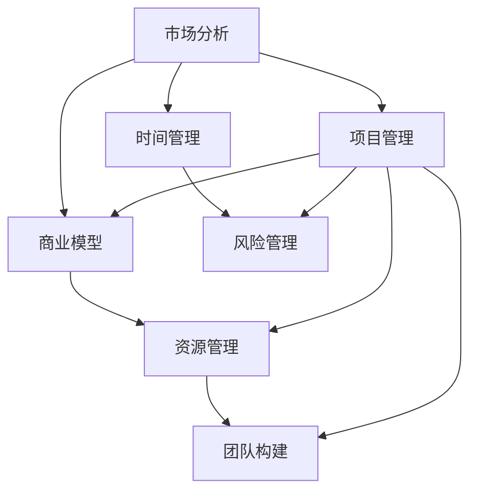

                 

# 程序员如何将副业升级为全职创业项目

> **关键词：** 程序员、副业、创业、全职、项目开发、资源管理、市场分析、团队构建

> **摘要：** 本文将探讨程序员如何有效地将副业转变为全职创业项目。通过详细的分析和指导，本文将帮助读者理解副业升级的必要条件和成功策略，并提供实用的工具和资源，以助力实现这一转型。

## 1. 背景介绍

### 1.1 目的和范围

本文旨在为那些希望在程序员职业生涯中实现职业升级的读者提供一条清晰的路径。我们将探讨如何从副业成功转型为全职创业项目，并重点分析成功转型的关键因素和策略。

### 1.2 预期读者

- 拥有编程技能的程序员和软件工程师
- 希望利用编程技能开展副业的个人
- 意图将副业升级为全职创业项目的创业者

### 1.3 文档结构概述

本文将分为以下几部分：

1. **背景介绍**：介绍文章的目的、范围和预期读者。
2. **核心概念与联系**：讨论与副业升级相关的重要概念。
3. **核心算法原理 & 具体操作步骤**：提供具体的操作步骤和伪代码。
4. **数学模型和公式 & 详细讲解 & 举例说明**：介绍相关的数学模型和公式，并举例说明。
5. **项目实战：代码实际案例和详细解释说明**：通过实际案例讲解开发过程。
6. **实际应用场景**：探讨副业升级后的应用场景。
7. **工具和资源推荐**：推荐学习资源和开发工具。
8. **总结：未来发展趋势与挑战**：总结未来趋势和面临的挑战。
9. **附录：常见问题与解答**：解答读者可能遇到的问题。
10. **扩展阅读 & 参考资料**：提供额外的阅读材料和参考文献。

### 1.4 术语表

#### 1.4.1 核心术语定义

- **副业**：在主要工作之外进行的、有收入来源的活动。
- **全职创业项目**：完全投入时间和精力去开发和运营的创业项目。
- **市场分析**：对目标市场的研究，以了解客户需求、竞争状况和市场规模。
- **资源管理**：对项目所需的资源（如资金、人力、技术等）进行有效管理和分配。

#### 1.4.2 相关概念解释

- **商业模型**：企业如何创造、传递和获取价值的系统。
- **时间管理**：合理规划和管理时间，以确保高效工作。
- **风险评估**：识别和评估项目可能面临的风险，并制定应对措施。

#### 1.4.3 缩略词列表

- **API**：应用程序接口（Application Programming Interface）
- **DB**：数据库（Database）
- **IDE**：集成开发环境（Integrated Development Environment）
- **SDK**：软件开发工具包（Software Development Kit）

## 2. 核心概念与联系

在探讨如何将副业升级为全职创业项目之前，我们需要理解几个关键概念及其相互关系。以下是这些概念及其在项目中的作用的 Mermaid 流程图：



### 2.1 市场分析

市场分析是理解目标市场和潜在客户需求的关键步骤。通过分析市场趋势、竞争对手和客户需求，程序员可以确定项目的可行性和市场潜力。

### 2.2 商业模型

商业模型是定义项目如何创造、传递和获取价值的方式。一个好的商业模型应该清晰明确，能够帮助程序员规划项目的盈利模式和持续发展。

### 2.3 资源管理

资源管理涉及对项目所需的各种资源（如资金、人力、技术等）进行有效分配和管理。合理的资源管理可以确保项目顺利推进，减少不必要的浪费。

### 2.4 团队构建

团队构建是确保项目成功的关键。一个多技能的团队可以提供多样化的视角和解决方案，从而提高项目的成功率。

### 2.5 时间管理

时间管理是确保项目按时完成的关键。合理的规划和管理时间可以避免延误和资源的浪费，提高项目效率。

### 2.6 风险管理

风险管理是识别和评估项目可能面临的风险，并制定应对措施的过程。通过有效的风险管理，程序员可以降低项目失败的可能性。

### 2.7 项目管理

项目管理是确保项目按计划、预算和质量要求完成的过程。一个有效的项目管理可以确保项目目标的实现。

## 3. 核心算法原理 & 具体操作步骤

在理解了核心概念之后，我们需要了解如何将副业成功升级为全职创业项目。以下是具体的操作步骤和伪代码：

### 3.1 市场分析

```pseudo
function performMarketAnalysis(product, targetMarket):
    1. 收集市场数据
        - 市场趋势
        - 竞争对手分析
        - 潜在客户需求

    2. 分析市场数据
        - 确定市场潜力
        - 确定目标客户群体

    3. 制定市场策略
        - 产品定位
        - 价格策略
        - 推广渠道

    return marketStrategy
```

### 3.2 商业模型

```pseudo
class BusinessModel:
    def __init__(self, product, marketStrategy):
        self.product = product
        self.marketStrategy = marketStrategy
        self.revenueModel = None
        self.costStructure = None

    def defineRevenueModel(self, pricingStrategy):
        self.revenueModel = PricingStrategy(pricingStrategy)

    def defineCostStructure(self, costComponents):
        self.costStructure = CostStructure(costComponents)

    def calculateProfit(self):
        revenue = self.revenueModel.calculateRevenue()
        cost = self.costStructure.calculateCost()
        profit = revenue - cost
        return profit
```

### 3.3 资源管理

```pseudo
class ResourceManagement:
    def __init__(self, funds, team):
        self.funds = funds
        self.team = team

    def allocateFunds(self, projectBudget):
        if self.funds >= projectBudget:
            self.funds -= projectBudget
            return True
        else:
            return False

    def recruitTeamMembers(self, requiredSkills):
        for member in self.team:
            if member.skills == requiredSkills:
                return True
        return False
```

### 3.4 团队构建

```pseudo
class TeamBuilding:
    def __init__(self, teamMembers):
        self.teamMembers = teamMembers

    def addMember(self, newMember):
        self.teamMembers.append(newMember)

    def removeMember(self, memberToRemove):
        self.teamMembers.remove(memberToRemove)

    def assignRoles(self):
        for member in self.teamMembers:
            member.role = self.determineRole(member.skills)
```

### 3.5 时间管理

```pseudo
class TimeManagement:
    def __init__(self, timeline):
        self.timeline = timeline

    def planTasks(self, tasks):
        for task in tasks:
            self.timeline.addTask(task)

    def trackProgress(self):
        for task in self.timeline.tasks:
            if task.completed == False:
                return False
        return True
```

### 3.6 风险管理

```pseudo
class RiskManagement:
    def __init__(self, risks):
        self.risks = risks

    def identifyRisks(self):
        self.risks = [risk for risk in potentialRisks if risk.exists]

    def assessRisks(self):
        for risk in self.risks:
            risk.level = self.determineRiskLevel(risk)

    def mitigateRisks(self):
        for risk in self.risks:
            if risk.level == "High":
                self.applyMitigation(risk)
```

## 4. 数学模型和公式 & 详细讲解 & 举例说明

在项目管理中，数学模型和公式可以帮助我们评估项目的风险、成本和收益。以下是一些常用的数学模型和公式：

### 4.1 风险评估模型

假设我们有一个项目，其成功概率为 P(Success)，风险成本为 C(Risk)，以下是风险评估的数学模型：

$$
RiskAssessment = P(Success) \times (1 - P(Failure)) \times C(Risk)
$$

其中，$P(Failure) = 1 - P(Success)$。

### 4.2 成本效益分析模型

成本效益分析用于评估项目的成本和收益。以下是一个简单的成本效益分析模型：

$$
Benefit-Cost Ratio (BCR) = \frac{Total Benefits}{Total Costs}
$$

其中，Total Benefits 表示项目的总收益，Total Costs 表示项目的总成本。

### 4.3 时间管理模型

假设项目有一个固定的预算 B，一个固定的时间 T，我们需要在时间 T 内完成项目，以下是时间管理模型：

$$
Effort = \frac{B}{C}
$$

其中，Effort 表示项目所需的总工作量，C 表示单位工作量所需的成本。

### 4.4 举例说明

假设我们有一个项目，其成功概率为 0.8，风险成本为 1000 美元，预算为 5000 美元，时间为 3 个月，成本为 200 美元/月。我们需要计算项目的风险评估和成本效益分析。

#### 风险评估：

$$
RiskAssessment = 0.8 \times (1 - 0.2) \times 1000 = 0.64 \times 1000 = 640 \text{ 美元}
$$

#### 成本效益分析：

$$
BCR = \frac{Total Benefits}{Total Costs} = \frac{5000}{5000 + 1000} = \frac{5000}{6000} = 0.8333
$$

## 5. 项目实战：代码实际案例和详细解释说明

### 5.1 开发环境搭建

为了实际展示如何将副业升级为全职创业项目，我们将创建一个简单的在线购物平台。以下是如何搭建开发环境的步骤：

1. 安装开发工具：安装一个支持前端和后端开发的集成开发环境（IDE），如 Visual Studio Code。
2. 创建项目目录：在本地计算机上创建一个项目目录，例如 `online-store`。
3. 初始化项目：在项目目录中运行 `npm init` 命令，创建一个 `package.json` 文件。
4. 安装依赖：使用 npm 或 yarn 安装项目所需的依赖，如 Express（后端框架）、React（前端框架）等。

### 5.2 源代码详细实现和代码解读

以下是一个简单的 React 前端和 Express 后端代码实现：

#### 前端代码（React）

```jsx
// src/App.js
import React, { useState } from 'react';
import './App.css';

function App() {
  const [items, setItems] = useState([]);

  const addToCart = (itemId) => {
    setItems([...items, itemId]);
  };

  return (
    <div className="App">
      <h1>Online Store</h1>
      <ul>
        {items.map((itemId, index) => (
          <li key={index}>Item {itemId}</li>
        ))}
      </ul>
      <button onClick={() => addToCart(1)}>Add Item 1</button>
      <button onClick={() => addToCart(2)}>Add Item 2</button>
    </div>
  );
}

export default App;
```

#### 后端代码（Express）

```javascript
// src/server.js
const express = require('express');
const app = express();

app.use(express.json());

app.post('/cart', (req, res) => {
  const itemId = req.body.itemId;
  // Logic to add item to cart
  res.send(`Item ${itemId} added to cart`);
});

const PORT = process.env.PORT || 3000;
app.listen(PORT, () => {
  console.log(`Server listening on port ${PORT}`);
});
```

### 5.3 代码解读与分析

#### 前端代码解读

- 使用 React 和 useState 钩子创建一个简单的购物车应用程序。
- `addToCart` 函数用于向购物车中添加商品。
- `items` 状态用于存储购物车中的商品列表。

#### 后端代码解读

- 使用 Express 创建一个简单的后端服务器。
- `/cart` 路由用于处理添加商品到购物车的请求。
- `req.body.itemId` 用于获取前端发送的 itemId。

通过这个简单的案例，我们可以看到如何使用 React 和 Express 实现一个在线购物平台的基本功能。这只是一个起点，实际项目中需要更多的功能和复杂性。

## 6. 实际应用场景

将副业升级为全职创业项目后，程序员可以在多个实际应用场景中发挥作用，例如：

1. **软件开发服务**：提供定制化的软件开发服务，如企业级应用程序、网站和移动应用程序。
2. **技术咨询**：为企业提供技术咨询服务，帮助他们解决技术难题。
3. **产品开发**：开发新的软件产品，如基于人工智能的应用程序、数据分析工具等。
4. **教育培训**：开设在线课程或研讨会，教授编程和软件开发知识。

这些应用场景不仅为程序员提供了职业发展机会，也为他们带来了更多的收入来源。

## 7. 工具和资源推荐

### 7.1 学习资源推荐

#### 7.1.1 书籍推荐

- **《软件工程：实践者的研究方法》**：提供了一个全面的软件工程方法，涵盖了项目管理、需求分析、设计、测试和部署。
- **《Head First 设计模式》**：通过生动的示例和案例，介绍了常用的设计模式，有助于提高代码的可维护性和扩展性。

#### 7.1.2 在线课程

- **Coursera 上的《计算机科学：算法导论》**：提供了深入的算法和数据结构知识，是软件开发者的必学课程。
- **Udemy 上的《React.js 实战教程》**：涵盖了 React 的基础知识，并通过实际项目帮助学习者掌握 React 的使用。

#### 7.1.3 技术博客和网站

- **Medium 上的《Software Engineering Daily》**：提供最新的软件工程技术文章和见解。
- **GitHub 上的开源项目**：学习并参与开源项目，可以帮助提高编程技能和了解最新技术趋势。

### 7.2 开发工具框架推荐

#### 7.2.1 IDE和编辑器

- **Visual Studio Code**：一款功能强大且可定制的集成开发环境，适用于多种编程语言。
- **IntelliJ IDEA**：一款专业的 Java 和 Kotlin 集成开发环境，提供丰富的功能，如智能代码完成、调试和性能分析。

#### 7.2.2 调试和性能分析工具

- **Chrome DevTools**：用于调试和优化网页性能的强大工具。
- **JMeter**：一款开源的性能测试工具，用于评估应用程序的负载能力和性能。

#### 7.2.3 相关框架和库

- **React**：用于构建用户界面的 JavaScript 库，适用于构建高性能的单页应用程序。
- **Express**：用于构建 Node.js web 应用程序的服务器框架。

### 7.3 相关论文著作推荐

#### 7.3.1 经典论文

- **"An Empirical Study of Failures in Large Scale Software Projects"**：探讨了软件项目失败的原因，对项目管理和风险管理提供了有价值的见解。

#### 7.3.2 最新研究成果

- **"Machine Learning for Software Engineering"**：探讨了如何利用机器学习技术提高软件开发的效率和质量。

#### 7.3.3 应用案例分析

- **"How Airbnb Built Its Frontend"**：分享了 Airbnb 在构建其前端系统时的经验和教训，对开发者具有借鉴意义。

## 8. 总结：未来发展趋势与挑战

### 8.1 发展趋势

- **技术多样性的增长**：随着云计算、大数据、人工智能等技术的不断发展，程序员将有更多的机会应用这些技术。
- **远程工作的普及**：疫情加速了远程工作的普及，程序员可以利用这一趋势开展全球业务。
- **个性化学习**：在线教育和个性化学习平台的发展，使程序员能够更好地提升自己的技能。

### 8.2 挑战

- **技术快速变化**：程序员需要不断学习新技术，以保持竞争力。
- **项目管理和沟通**：成功的创业项目需要有效的项目管理和团队沟通。
- **市场竞争**：激烈的竞争环境要求程序员提供高质量的产品和服务。

## 9. 附录：常见问题与解答

### 9.1 常见问题

- **Q：如何平衡全职工作和副业？**
- **A：合理规划时间，确保全职工作不受影响，并设定明确的目标和截止日期。**

- **Q：如何确定项目的市场潜力？**
- **A：通过市场调研、分析竞争对手和客户需求来确定项目的市场潜力。**

- **Q：如何管理创业项目中的风险？**
- **A：通过风险识别、评估和制定应对措施来管理风险。**

### 9.2 解答

- **关于时间平衡**：使用时间管理工具，如 Trello 或 Asana，来规划工作和副业的时间。明确全职工作和副业的优先级，确保两者都能得到充分关注。
- **关于市场潜力**：可以通过在线问卷调查、访谈潜在客户或使用市场分析工具来收集市场数据。此外，可以参考相关行业报告和市场研究。
- **关于风险管理**：可以创建一个风险矩阵来评估不同风险的可能性及其影响。然后，根据风险级别制定相应的应对策略，如降低风险、转移风险或接受风险。

## 10. 扩展阅读 & 参考资料

- **《软件工程：实践者的研究方法》**：作者：Roger S. Pressman
- **《Head First 设计模式》**：作者：Eric Freeman、Bert Bates、Bryan Helmig、Kathy Sierra
- **《Software Engineering Daily》**：网址：https://softwareengineeringdaily.com/
- **《How Airbnb Built Its Frontend》**：作者：Nathan Elovitz
- **《An Empirical Study of Failures in Large Scale Software Projects》**：作者：Philip P. Johnson、Rick S. Rabiser、Bruce R. Maxim
- **《Machine Learning for Software Engineering》**：作者：Arvind S. Satyanarayan、Sumit P. Kundu

以上是关于“程序员如何将副业升级为全职创业项目”的详细分析和讲解。希望本文能为那些希望转型的程序员提供有用的指导和建议。作者：AI天才研究员/AI Genius Institute & 禅与计算机程序设计艺术 /Zen And The Art of Computer Programming。如果您有任何疑问或建议，欢迎在评论区留言。感谢您的阅读！<|im_sep|>

