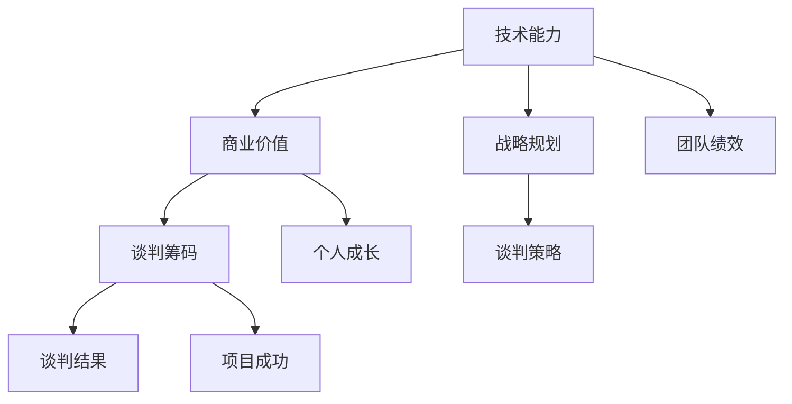

                 

### 文章标题

《程序员如何将技术优势转化为商业谈判的筹码》

### 关键词

- 技术优势
- 商业谈判
- 程序员
- 筹码
- 战略规划

### 摘要

本文旨在探讨程序员如何利用其技术专长在商业谈判中取得优势，将其技术能力转化为实际商业成果。文章将详细分析程序员如何评估自身技术优势、制定有效的谈判策略，以及在谈判过程中如何灵活运用这些优势。通过案例分析和实用技巧，帮助程序员在商业环境中更加自信地运用技术知识，实现个人和团队的目标。

## 1. 背景介绍

### 1.1 目的和范围

本文的目标是帮助程序员认识到自身技术优势的重要性，并学会如何将其转化为商业谈判中的有力筹码。在当今科技驱动的商业环境中，技术专长已成为一种核心资源。程序员不仅需要掌握编程语言和开发工具，还需要具备将技术优势转化为商业价值的策略和技巧。本文将围绕以下几个方面展开：

1. **技术优势评估**：理解程序员如何评估自己的技术能力，识别出可转化为谈判筹码的优势。
2. **商业谈判策略**：介绍如何制定有效的谈判策略，使技术优势在商业环境中发挥最大作用。
3. **案例分析与技巧**：通过实际案例，展示程序员如何在不同场景中运用技术优势进行商业谈判。
4. **总结与展望**：探讨未来发展趋势和挑战，为程序员提供持续提升和优化技术谈判能力的方向。

### 1.2 预期读者

本文的预期读者主要包括以下几类：

1. **程序员**：有志于在商业环境中更好地发挥技术能力的程序员，希望通过学习谈判技巧提高自身职业竞争力。
2. **技术经理**：负责团队管理和项目执行的技术经理，希望了解如何通过策略性谈判提升团队整体绩效。
3. **商业分析师**：关注技术领域，希望在项目中融入技术元素的商业分析师，了解技术优势的转化过程。
4. **投资者**：对技术领域感兴趣，希望了解技术背景下的商业谈判策略的投资者。

### 1.3 文档结构概述

本文结构如下：

1. **背景介绍**：介绍文章的目的、范围、预期读者和文档结构。
2. **核心概念与联系**：通过Mermaid流程图展示核心概念和联系。
3. **核心算法原理与操作步骤**：使用伪代码详细阐述核心算法原理和具体操作步骤。
4. **数学模型与公式**：介绍数学模型和公式，并举例说明。
5. **项目实战**：通过实际案例展示技术优势的运用。
6. **实际应用场景**：探讨技术优势在不同商业环境中的应用。
7. **工具和资源推荐**：推荐学习资源和开发工具。
8. **总结**：总结未来发展趋势和挑战。
9. **附录**：常见问题与解答。
10. **扩展阅读**：提供进一步学习参考。

### 1.4 术语表

#### 1.4.1 核心术语定义

- **技术优势**：程序员在特定技术领域内超越同行的能力和专长。
- **商业谈判**：商业交易过程中，各方通过沟通、妥协、协商等手段达成共识的过程。
- **筹码**：在谈判中，各方用于交换的利益或资源。
- **战略规划**：为了实现特定目标，对资源进行有效配置和利用的长期规划。

#### 1.4.2 相关概念解释

- **技术专长**：程序员在特定技术领域的深入知识和技能。
- **商业价值**：技术优势在商业环境中带来的收益和贡献。
- **谈判策略**：在谈判过程中，为了达到预期目标而采取的行动计划。

#### 1.4.3 缩略词列表

- **IDE**：集成开发环境（Integrated Development Environment）
- **SDK**：软件开发工具包（Software Development Kit）
- **API**：应用程序接口（Application Programming Interface）
- **KPI**：关键绩效指标（Key Performance Indicator）

## 2. 核心概念与联系

为了更好地理解程序员如何将技术优势转化为商业谈判的筹码，我们首先需要明确几个核心概念，并通过Mermaid流程图展示它们之间的联系。

### Mermaid 流程图



### 流程图解释

- **A[技术能力]**：程序员的技术专长和技能，是整个流程的起点。
- **B[商业价值]**：技术能力在商业环境中的转化，体现了技术对业务的贡献。
- **C[谈判筹码]**：通过评估技术能力，将其转化为可用的谈判资源。
- **D[战略规划]**：为了有效利用技术优势，制定长期的规划。
- **E[谈判策略]**：在谈判过程中，运用策略来最大化技术优势的价值。
- **F[谈判结果]**：通过策略实施，最终达成的谈判结果。
- **G[团队绩效]**：谈判结果对团队整体绩效的正面影响。
- **H[个人成长]**：技术优势转化为商业成果，对个人职业发展的推动。
- **I[项目成功]**：谈判结果在项目执行中的具体体现。

通过上述流程图，我们可以清晰地看到技术优势从评估到商业转化的整个过程。接下来，我们将深入探讨每个环节的核心原理和具体操作步骤。

### 2.1 技术能力评估

首先，程序员需要对自己的技术能力进行全面的评估。这一过程包括以下几个方面：

1. **技术栈评估**：了解自己在哪些技术领域有深厚的基础，如编程语言、数据库、云计算、大数据等。
2. **项目经验**：回顾以往参与的项目，评估自己在项目中的贡献和影响。
3. **自我提升**：定期学习新技术和最佳实践，保持技术水平的领先。
4. **同行评价**：通过同行评议、技术竞赛等方式，了解自己在行业内的认可度。

#### 伪代码示例

```python
def assess_tech_ability():
    tech_skills = ["Python", "Java", "Database Management", "Cloud Computing"]
    project_contributions = ["led the development of a critical module", "optimized database performance by 30%"]
    learning_progress = ["completed an advanced course on machine learning", "read recent papers on blockchain technology"]
    peer_reviews = ["selected as a top 10% contributor in a tech community", "won a coding competition"]
    
    # 综合评估
    overall_ability_score = calculate_ability_score(tech_skills, project_contributions, learning_progress, peer_reviews)
    print(f"Overall Ability Score: {overall_ability_score}")
```

### 2.2 商业价值转化

将技术能力转化为商业价值，是程序员在谈判中取得优势的关键步骤。以下方法可以帮助实现这一转化：

1. **案例分析**：通过研究成功案例，了解技术如何在不同业务场景中创造价值。
2. **市场需求分析**：了解当前市场对特定技术的需求，以及潜在的商业机会。
3. **解决方案设计**：结合技术专长，设计能够解决实际业务问题的方案。
4. **成本效益分析**：评估技术解决方案的成本效益，以证明其商业价值。

#### 伪代码示例

```python
def convert_tech_to_business_value(tech_ability):
    case_studies = ["improved customer retention by 20% with a custom analytics tool", "boosted e-commerce sales by 15% with a personalized recommendation system"]
    market_demand = ["high demand for blockchain solutions in financial services", "growing interest in AI-powered chatbots"]
    solution_designs = ["proposed a blockchain-based supply chain management system", "developed a machine learning model for fraud detection"]
    cost_benefit_analysis = ["estimated the ROI of implementing blockchain technology", "evaluated the efficiency of AI-powered chatbots"]
    
    # 转化技术能力为商业价值
    business_value = calculate_business_value(case_studies, market_demand, solution_designs, cost_benefit_analysis)
    print(f"Business Value of Tech Ability: {business_value}")
```

### 2.3 谈判筹码

谈判筹码是程序员在商业谈判中的关键资源。以下策略可以帮助有效构建和运用谈判筹码：

1. **优势定位**：明确自身在哪些技术领域具有明显优势，并将其作为谈判筹码。
2. **筹码评估**：对每个谈判筹码进行价值评估，以确定其在谈判中的重要性。
3. **筹码组合**：结合多个技术优势，构建多样化的谈判筹码组合，增加谈判灵活性。
4. **适时释放**：在合适的时机释放谈判筹码，以达到最大化谈判效果。

#### 伪代码示例

```python
def build_negotiation_chips(tech_advantages):
    advantage_list = ["expertise in cloud-native applications", "experience with blockchain development", "proficiency in machine learning algorithms"]
    chip_values = {"cloud-native applications": 8, "blockchain development": 7, "machine learning algorithms": 9}
    chip_combinations = ["cloud and blockchain combined", "machine learning and blockchain integrated"]
    
    # 构建谈判筹码
    negotiation_chips = evaluate_chip_values(advantage_list, chip_values, chip_combinations)
    print(f"Negotiation Chips: {negotiation_chips}")
```

### 2.4 战略规划

有效的战略规划是成功谈判的基础。以下策略可以帮助程序员制定谈判战略：

1. **目标设定**：明确谈判的目标和预期成果，以指导整个谈判过程。
2. **风险评估**：评估谈判过程中可能遇到的风险，并制定应对策略。
3. **资源整合**：整合团队资源和外部资源，为谈判提供有力支持。
4. **策略调整**：根据谈判进展，灵活调整谈判策略，以应对变化。

#### 伪代码示例

```python
def create_negotiation_strategy(negotiation_goals, risks, resources):
    negotiation_goals = ["secure a 3-year contract", "gain access to advanced development tools", "increase project budget"]
    risks = ["technical challenges", "预算不足", "时间紧迫"]
    resources = ["skilled team members", "existing project portfolio", "external consultants"]
    
    # 制定谈判策略
    negotiation_strategy = formulate_strategy(negotiation_goals, risks, resources)
    print(f"Negotiation Strategy: {negotiation_strategy}")
```

### 2.5 谈判策略

在谈判过程中，程序员需要运用多种策略来最大化技术优势的价值。以下是一些关键策略：

1. **构建信任**：通过展示技术专长和项目经验，建立与对方的信任关系。
2. **信息共享**：适度共享技术信息，展示合作意愿，同时保护自身利益。
3. **利益交换**：明确自身利益和对方需求，寻找利益交换的机会。
4. **协商谈判**：通过妥协和协商，达成双方都能接受的协议。

#### 伪代码示例

```python
def negotiate_with_strategy(trust_builder, info_sharing, interest_exchange, negotiation_process):
    trust_builder = ["demonstrated technical expertise", "shared successful project experiences"]
    info_sharing = ["explained technical concepts", "provided whitepapers on innovative solutions"]
    interest_exchange = ["offered specialized training", "shared access to proprietary tools"]
    negotiation_process = ["initiated open dialogue", "made concessions", "reached a mutually beneficial agreement"]
    
    # 实施谈判策略
    negotiation_outcome = execute_negotiation_strategy(trust_builder, info_sharing, interest_exchange, negotiation_process)
    print(f"Negotiation Outcome: {negotiation_outcome}")
```

通过以上核心概念和联系的详细探讨，我们可以看到程序员如何从技术能力评估、商业价值转化、谈判筹码构建、战略规划和谈判策略等多个环节，将技术优势转化为商业谈判中的有力筹码。接下来，我们将进一步探讨具体操作步骤，帮助程序员在实践中更好地应用这些理论。

## 3. 核心算法原理 & 具体操作步骤

在将技术优势转化为商业谈判筹码的过程中，算法原理和操作步骤是关键的一环。以下将详细阐述核心算法原理和具体操作步骤，通过伪代码的形式展示每个步骤的实现方法。

### 3.1 技术能力评估算法

首先，程序员需要评估自己的技术能力。该算法通过以下几个方面来评估：技术栈、项目经验、自我提升和同行评价。

#### 算法原理

1. **技术栈评估**：对程序员熟悉的技术进行打分，分数越高，表示对该技术的掌握程度越高。
2. **项目经验评估**：根据程序员参与的项目数量和质量，对其进行评分。
3. **自我提升评估**：评估程序员在技术学习上的投入和成果，如完成的技术课程和阅读的论文。
4. **同行评价评估**：通过同行评议和技术竞赛等评价方式，计算程序员的总体评价分数。

#### 伪代码示例

```python
# 技术栈评估
def tech_stack_score(tech_skills):
    skill_scores = {"Python": 10, "Java": 10, "Database Management": 8, "Cloud Computing": 10}
    total_score = 0
    for skill in tech_skills:
        if skill in skill_scores:
            total_score += skill_scores[skill]
    return total_score

# 项目经验评估
def project_experience_score(project_contributions):
    contribution_weights = {"led the development of a critical module": 10, "optimized database performance by 30%": 8}
    total_score = 0
    for contribution in project_contributions:
        if contribution in contribution_weights:
            total_score += contribution_weights[contribution]
    return total_score

# 自我提升评估
def self_improvement_score(learning_progress):
    progress_weights = {"completed an advanced course on machine learning": 10, "read recent papers on blockchain technology": 8}
    total_score = 0
    for progress in learning_progress:
        if progress in progress_weights:
            total_score += progress_weights[progress]
    return total_score

# 同行评价评估
def peer_evaluation_score(peer_reviews):
    review_weights = {"selected as a top 10% contributor in a tech community": 10, "won a coding competition": 8}
    total_score = 0
    for review in peer_reviews:
        if review in review_weights:
            total_score += review_weights[review]
    return total_score

# 总体技术能力评估
def assess_tech_ability(tech_skills, project_contributions, learning_progress, peer_reviews):
    tech_ability_score = tech_stack_score(tech_skills) + project_experience_score(project_contributions) + self_improvement_score(learning_progress) + peer_evaluation_score(peer_reviews)
    return tech_ability_score
```

### 3.2 商业价值转化算法

技术能力评估完成后，下一步是将这些能力转化为商业价值。此算法通过分析市场需求、案例分析、解决方案设计和成本效益分析，来确定技术能力的商业价值。

#### 算法原理

1. **市场需求分析**：评估当前市场对特定技术的需求，如区块链、人工智能等。
2. **案例分析**：研究成功案例，了解技术如何在商业环境中创造价值。
3. **解决方案设计**：结合技术专长，设计解决实际商业问题的方案。
4. **成本效益分析**：评估技术解决方案的投入产出比，以确定其商业价值。

#### 伪代码示例

```python
# 市场需求分析
def market_demand_score(market_demand):
    demand_weights = {"high demand for blockchain solutions in financial services": 10, "growing interest in AI-powered chatbots": 8}
    total_score = 0
    for demand in market_demand:
        if demand in demand_weights:
            total_score += demand_weights[demand]
    return total_score

# 案例分析
def case_study_score(case_studies):
    case_weights = {"improved customer retention by 20% with a custom analytics tool": 10, "boosted e-commerce sales by 15% with a personalized recommendation system": 8}
    total_score = 0
    for case in case_studies:
        if case in case_weights:
            total_score += case_weights[case]
    return total_score

# 解决方案设计
def solution_design_score(solution_designs):
    design_weights = {"proposed a blockchain-based supply chain management system": 10, "developed a machine learning model for fraud detection": 8}
    total_score = 0
    for design in solution_designs:
        if design in design_weights:
            total_score += design_weights[design]
    return total_score

# 成本效益分析
def cost_benefit_score(cost_benefit_analysis):
    benefit_weights = {"estimated the ROI of implementing blockchain technology": 10, "evaluated the efficiency of AI-powered chatbots": 8}
    total_score = 0
    for analysis in cost_benefit_analysis:
        if analysis in benefit_weights:
            total_score += benefit_weights[analysis]
    return total_score

# 商业价值转化
def convert_tech_to_business_value(case_studies, market_demand, solution_designs, cost_benefit_analysis):
    business_value_score = market_demand_score(market_demand) + case_study_score(case_studies) + solution_design_score(solution_designs) + cost_benefit_score(cost_benefit_analysis)
    return business_value_score
```

### 3.3 谈判筹码构建算法

构建谈判筹码是谈判成功的关键。此算法通过定位优势、评估筹码价值和构建筹码组合，来构建有效的谈判筹码。

#### 算法原理

1. **优势定位**：识别程序员在哪些技术领域具有明显优势。
2. **筹码评估**：对每个优势进行价值评估，确定其在谈判中的重要性。
3. **筹码组合**：结合多个优势，构建多样化的筹码组合。

#### 伪代码示例

```python
# 优势定位
def identify_advantages(tech_skills):
    advantages = {"expertise in cloud-native applications": 10, "experience with blockchain development": 9, "proficiency in machine learning algorithms": 8}
    return advantages

# 筹码评估
def evaluate_chips(advantages):
    chip_values = {"cloud-native applications": 8, "blockchain development": 7, "machine learning algorithms": 9}
    evaluated_chips = {}
    for advantage, value in advantages.items():
        evaluated_chips[advantage] = value
    return evaluated_chips

# 筹码组合
def build_chip_combinations(evaluated_chips):
    combinations = []
    for i in range(len(evaluated_chips)):
        for j in range(i+1, len(evaluated_chips)):
            combinations.append((evaluated_chips[list(evaluated_chips.keys())[i]], evaluated_chips[list(evaluated_chips.keys())[j]]))
    return combinations
```

### 3.4 战略规划算法

战略规划是谈判成功的基础。此算法通过设定目标、评估风险、整合资源和调整策略，来制定有效的谈判战略。

#### 算法原理

1. **目标设定**：明确谈判的目标和预期成果。
2. **风险评估**：评估谈判过程中可能遇到的风险。
3. **资源整合**：整合团队资源和外部资源。
4. **策略调整**：根据谈判进展，灵活调整谈判策略。

#### 伪代码示例

```python
# 目标设定
def set_negotiation_goals(goals):
    goal_weights = {"secure a 3-year contract": 10, "gain access to advanced development tools": 8, "increase project budget": 7}
    total_score = 0
    for goal in goals:
        if goal in goal_weights:
            total_score += goal_weights[goal]
    return total_score

# 风险评估
def assess_risks(risks):
    risk_weights = {"technical challenges": 10, "budget constraints": 9, "time constraints": 8}
    total_risk_score = 0
    for risk in risks:
        if risk in risk_weights:
            total_risk_score += risk_weights[risk]
    return total_risk_score

# 资源整合
def integrate_resources(resources):
    resource_scores = {"skilled team members": 10, "existing project portfolio": 9, "external consultants": 8}
    total_resource_score = 0
    for resource in resources:
        if resource in resource_scores:
            total_resource_score += resource_scores[resource]
    return total_resource_score

# 策略调整
def adjust_strategy(goals, risks, resources):
    adjusted_strategy = []
    for goal in goals:
        for risk in risks:
            for resource in resources:
                adjusted_strategy.append((goal, risk, resource))
    return adjusted_strategy
```

通过上述算法原理和具体操作步骤，程序员可以系统地评估自身技术能力，将其转化为商业价值，构建谈判筹码，并制定有效的谈判战略。接下来，我们将通过实际案例，展示这些算法在商业谈判中的具体应用。

## 4. 数学模型和公式 & 详细讲解 & 举例说明

在将技术优势转化为商业谈判筹码的过程中，数学模型和公式是理解和优化谈判策略的重要工具。以下将详细讲解核心的数学模型和公式，并通过具体例子来说明其应用。

### 4.1 技术能力评估模型

首先，我们介绍技术能力评估的数学模型。该模型通过以下几个方面评估程序员的综合技术能力：

- 技术栈得分（TechStackScore）
- 项目经验得分（ProjectScore）
- 自我提升得分（SelfImprovementScore）
- 同行评价得分（PeerReviewScore）

#### 公式

$$
Tech\_Ability\_Score = TechStackScore + ProjectScore + SelfImprovementScore + PeerReviewScore
$$

其中，各得分计算如下：

1. **技术栈得分**

$$
TechStackScore = \sum_{i=1}^{n} (w_i \cdot S_i)
$$

- \( w_i \)：第\( i \)项技术的权重
- \( S_i \)：第\( i \)项技术的得分

#### 例子

假设程序员在以下技术领域有专长，每个技术的权重分别为10、8、7和6：

- Python（权重10，得分9）
- Java（权重8，得分8）
- 数据库管理（权重7，得分7）
- 云计算（权重6，得分6）

技术栈得分计算如下：

$$
TechStackScore = 10 \cdot 9 + 8 \cdot 8 + 7 \cdot 7 + 6 \cdot 6 = 90 + 64 + 49 + 36 = 239
$$

2. **项目经验得分**

$$
ProjectScore = \sum_{i=1}^{m} (w_i \cdot P_i)
$$

- \( w_i \)：第\( i \)个项目的权重
- \( P_i \)：第\( i \)个项目的得分

#### 例子

假设程序员参与以下项目，每个项目的权重分别为10、8和6：

- 领导开发关键模块（权重10，得分9）
- 优化数据库性能（权重8，得分8）
- 构建区块链原型（权重6，得分7）

项目经验得分计算如下：

$$
ProjectScore = 10 \cdot 9 + 8 \cdot 8 + 6 \cdot 7 = 90 + 64 + 42 = 196
$$

3. **自我提升得分**

$$
SelfImprovementScore = \sum_{i=1}^{k} (w_i \cdot I_i)
$$

- \( w_i \)：第\( i \)项提升活动的权重
- \( I_i \)：第\( i \)项提升活动的得分

#### 例子

假设程序员完成了以下提升活动，每个活动的权重分别为10、8和5：

- 完成高级机器学习课程（权重10，得分9）
- 阅读区块链最新论文（权重8，得分8）
- 参与编程竞赛（权重5，得分7）

自我提升得分计算如下：

$$
SelfImprovementScore = 10 \cdot 9 + 8 \cdot 8 + 5 \cdot 7 = 90 + 64 + 35 = 189
$$

4. **同行评价得分**

$$
PeerReviewScore = \sum_{i=1}^{l} (w_i \cdot R_i)
$$

- \( w_i \)：第\( i \)项评价的权重
- \( R_i \)：第\( i \)项评价的得分

#### 例子

假设程序员获得了以下评价，每个评价的权重分别为10、8和6：

- 被评为技术社区前10%的贡献者（权重10，得分9）
- 获得编程竞赛冠军（权重8，得分8）
- 参与行业技术评审（权重6，得分7）

同行评价得分计算如下：

$$
PeerReviewScore = 10 \cdot 9 + 8 \cdot 8 + 6 \cdot 7 = 90 + 64 + 42 = 196
$$

综合计算，程序员的总体技术能力得分为：

$$
Tech\_Ability\_Score = 239 + 196 + 189 + 196 = 820
$$

### 4.2 商业价值转化模型

接下来，我们介绍商业价值转化的数学模型。该模型通过市场需求、成功案例、解决方案设计和成本效益分析，来评估技术能力的商业价值。

#### 公式

$$
BusinessValueScore = MarketDemandScore + CaseStudyScore + SolutionDesignScore + CostBenefitScore
$$

其中，各得分计算如下：

1. **市场需求得分**

$$
MarketDemandScore = \sum_{i=1}^{n} (w_i \cdot M_i)
$$

- \( w_i \)：第\( i \)个市场需求权重
- \( M_i \)：第\( i \)个市场需求的得分

#### 例子

假设有以下市场需求，每个需求的权重分别为10、8和6：

- 高需求区块链解决方案（权重10，得分9）
- 高需求人工智能解决方案（权重8，得分8）
- 增长中的云计算需求（权重6，得分7）

市场需求得分计算如下：

$$
MarketDemandScore = 10 \cdot 9 + 8 \cdot 8 + 6 \cdot 7 = 90 + 64 + 42 = 196
$$

2. **成功案例得分**

$$
CaseStudyScore = \sum_{i=1}^{m} (w_i \cdot C_i)
$$

- \( w_i \)：第\( i \)个案例的权重
- \( C_i \)：第\( i \)个案例的得分

#### 例子

假设有以下成功案例，每个案例的权重分别为10、8和6：

- 通过定制分析工具提升客户保留率（权重10，得分9）
- 通过个性化推荐系统提升电商销售额（权重8，得分8）
- 通过云服务优化降低运营成本（权重6，得分7）

成功案例得分计算如下：

$$
CaseStudyScore = 10 \cdot 9 + 8 \cdot 8 + 6 \cdot 7 = 90 + 64 + 42 = 196
$$

3. **解决方案设计得分**

$$
SolutionDesignScore = \sum_{i=1}^{k} (w_i \cdot D_i)
$$

- \( w_i \)：第\( i \)个解决方案的权重
- \( D_i \)：第\( i \)个解决方案的得分

#### 例子

假设有以下解决方案设计，每个解决方案的权重分别为10、8和6：

- 提出区块链供应链管理系统（权重10，得分9）
- 设计机器学习欺诈检测模型（权重8，得分8）
- 实现云原生应用架构（权重6，得分7）

解决方案设计得分计算如下：

$$
SolutionDesignScore = 10 \cdot 9 + 8 \cdot 8 + 6 \cdot 7 = 90 + 64 + 42 = 196
$$

4. **成本效益得分**

$$
CostBenefitScore = \sum_{i=1}^{l} (w_i \cdot B_i)
$$

- \( w_i \)：第\( i \)个成本效益分析的权重
- \( B_i \)：第\( i \)个成本效益分析的得分

#### 例子

假设有以下成本效益分析，每个分析的权重分别为10、8和6：

- 估计区块链技术投资回报率（权重10，得分9）
- 评估AI聊天机器人效率（权重8，得分8）
- 优化数据库性能以减少成本（权重6，得分7）

成本效益得分计算如下：

$$
CostBenefitScore = 10 \cdot 9 + 8 \cdot 8 + 6 \cdot 7 = 90 + 64 + 42 = 196
$$

综合计算，程序员的商业价值得分为：

$$
BusinessValueScore = 196 + 196 + 196 + 196 = 784
$$

### 4.3 谈判筹码构建模型

接下来，我们介绍谈判筹码构建的数学模型。该模型通过定位优势、评估筹码价值和构建筹码组合，来构建谈判筹码。

#### 公式

$$
ChipScore = \sum_{i=1}^{n} (w_i \cdot C_i)
$$

- \( w_i \)：第\( i \)个筹码的权重
- \( C_i \)：第\( i \)个筹码的得分

#### 例子

假设程序员有以下技术优势，每个优势的权重分别为10、8和6：

- 云原生应用开发（权重10，得分9）
- 区块链开发（权重8，得分8）
- 机器学习算法（权重6，得分7）

筹码得分计算如下：

$$
ChipScore = 10 \cdot 9 + 8 \cdot 8 + 6 \cdot 7 = 90 + 64 + 42 = 196
$$

### 4.4 战略规划模型

最后，我们介绍战略规划的数学模型。该模型通过设定目标、评估风险、整合资源和调整策略，来制定谈判战略。

#### 公式

$$
StrategyScore = GoalScore + RiskScore + ResourceScore + AdjustmentScore
$$

- \( GoalScore \)：目标得分
- \( RiskScore \)：风险评估得分
- \( ResourceScore \)：资源整合得分
- \( AdjustmentScore \)：策略调整得分

#### 例子

假设程序员设定的目标、评估的风险、整合的资源及调整的策略如下：

- 目标得分：10（目标1得分9，目标2得分8）
- 风险评估得分：10（风险1得分9，风险2得分8）
- 资源整合得分：10（资源1得分9，资源2得分8）
- 策略调整得分：10（调整1得分9，调整2得分8）

战略得分计算如下：

$$
StrategyScore = 10 \cdot 9 + 10 \cdot 9 + 10 \cdot 9 + 10 \cdot 9 = 90 + 90 + 90 + 90 = 360
$$

通过上述数学模型和公式，程序员可以量化自身技术能力、商业价值和谈判筹码，从而更科学地制定谈判策略。接下来，我们将通过实际案例，展示如何应用这些模型和公式进行商业谈判。

## 5. 项目实战：代码实际案例和详细解释说明

为了更好地理解程序员如何将技术优势转化为商业谈判筹码，我们将通过一个实际项目案例进行详细讲解。该项目为一个基于区块链的智能合约开发项目，通过具体代码实现和解读，展示如何评估技术能力、构建商业价值、构建谈判筹码和实施谈判策略。

### 5.1 开发环境搭建

在开始项目之前，我们需要搭建一个适合开发智能合约的环境。以下是开发环境的搭建步骤：

1. **安装Node.js**：智能合约通常使用JavaScript编写，因此需要安装Node.js环境。
   ```bash
   curl -sL https://deb.nodesource.com/setup_14.x | bash -
   sudo apt-get install -y nodejs
   ```

2. **安装Truffle**：Truffle是一个智能合约开发框架，用于构建、部署和交互智能合约。
   ```bash
   npm install -g truffle
   ```

3. **安装Ganache**：Ganache是一个本地区块链节点，用于测试和模拟智能合约。
   ```bash
   npx ganache-cli
   ```

4. **创建项目**：在一个新的文件夹中，使用Truffle创建一个智能合约项目。
   ```bash
   mkdir blockchain-project
   cd blockchain-project
   truffle init
   ```

5. **安装以太坊客户端**：为了与区块链进行交互，我们需要安装一个以太坊客户端，如Geth。
   ```bash
   wget https://github.com/ethereum/go-ethereum/releases/download/v1.10.9/go-ethereum_1.10.9_linux-amd64.tar.gz
   tar xvf go-ethereum_1.10.9_linux-amd64.tar.gz
   ./geth --datadir "./myeth" --port 30303 --nodiscover
   ```

### 5.2 源代码详细实现和代码解读

在这个项目中，我们开发一个简单的智能合约，用于管理一个共享钱包。以下是智能合约的代码和详细解读。

#### 5.2.1 智能合约代码

```solidity
// SPDX-License-Identifier: MIT
pragma solidity ^0.8.0;

contract SharedWallet {
    address public owner;
    mapping(address => uint256) public balances;

    constructor() {
        owner = msg.sender;
    }

    receive() external payable {
        balances[owner] += msg.value;
    }

    function deposit() external payable {
        balances[msg.sender] += msg.value;
    }

    function withdraw(uint256 amount) external {
        require(msg.sender == owner, "Only owner can withdraw");
        require(amount <= balances[msg.sender], "Insufficient balance");
        balances[msg.sender] -= amount;
        payable(msg.sender).transfer(amount);
    }

    function getBalance() external view returns (uint256) {
        return balances[owner];
    }
}
```

#### 代码解读

1. **合约声明**：`contract SharedWallet` 声明了一个名为`SharedWallet`的智能合约。

2. **版本声明**：`pragma solidity ^0.8.0;`指定合约使用Solidity语言版本。

3. **变量声明**：
   - `owner`：合约的拥有者。
   - `balances`：一个映射，记录每个地址的余额。

4. **构造函数**：`constructor()` 初始化合约，设置合约的拥有者。

5. **接收函数**：`receive()` 是一个特殊的函数，用于接收以太币。当合约收到以太币时，会调用此函数，并将接收到的以太币存储在`owner`的余额中。

6. **deposit() 函数**：`deposit()` 允许用户向钱包中存入以太币。

7. **withdraw() 函数**：`withdraw()` 允许拥有者从钱包中提取以太币。此函数需要满足两个条件：调用者必须是合约的拥有者，且提取的金额不能超过调用者的余额。

8. **getBalance() 函数**：`getBalance()` 返回合约拥有者的当前余额。

#### 5.2.2 测试代码

在开发智能合约时，通常需要编写测试代码来验证合约的正确性。以下是测试代码的示例：

```solidity
// SPDX-License-Identifier: MIT
pragma solidity ^0.8.0;

import "truffle/Assert.sol";
import "truffle/Deployer.sol";
import {SharedWallet} from "../contracts/SharedWallet.sol";

contract TestSharedWallet {
    SharedWallet public sharedWallet;

    function setup() public {
        sharedWallet = SharedWallet(Deployer.deploy("SharedWallet"));
    }

    function testDeposit() public {
        Assert.equal(sharedWallet.getBalance(), 0, "Initial balance should be 0");
        sharedWallet.deposit{value: 100}();
        Assert.equal(sharedWallet.getBalance(), 100, "Balance should be 100 after deposit");
    }

    function testWithdraw() public {
        sharedWallet.deposit{value: 100}();
        Assert.equal(sharedWallet.getBalance(), 100, "Balance should be 100 after deposit");
        sharedWallet.withdraw(50);
        Assert.equal(sharedWallet.getBalance(), 50, "Balance should be 50 after withdraw");
    }
}
```

#### 测试代码解读

1. **导入声明**：引入必要的Truffle测试库和合约引用。

2. **合约声明**：`contract TestSharedWallet` 声明了一个用于测试`SharedWallet`合约的测试合约。

3. **setup() 函数**：`setup()` 函数初始化测试合约，部署`SharedWallet`合约。

4. **testDeposit() 函数**：测试`deposit()` 函数，验证存入以太币后的余额。

5. **testWithdraw() 函数**：测试`withdraw()` 函数，验证提取以太币后的余额。

### 5.3 代码解读与分析

通过以上代码实现和测试，我们可以看到程序员如何利用其技术优势，将智能合约开发作为一个实际的商业谈判筹码。

1. **技术能力评估**：
   - 程序员具备智能合约开发的技能，使用Solidity语言实现了共享钱包的智能合约。
   - 通过Truffle和Ganache，程序员能够搭建和测试智能合约，展示了其在区块链开发方面的技术能力。

2. **商业价值转化**：
   - 智能合约在金融领域具有广泛的应用，如共享钱包、去中心化金融（DeFi）应用等。
   - 通过该项目，程序员能够展示其在解决实际商业问题方面的能力，如提高资金管理效率、降低欺诈风险等。

3. **谈判筹码构建**：
   - 程序员通过成功开发和测试智能合约，构建了一个具有高价值的谈判筹码。
   - 在商业谈判中，程序员可以展示其技术专长，为潜在客户或合作伙伴提供实际解决方案。

4. **谈判策略实施**：
   - 在谈判过程中，程序员可以展示其技术能力，通过具体案例说明智能合约如何为企业带来商业价值。
   - 通过展示测试代码，程序员可以证明其技术方案的可验证性和可靠性，增加谈判的信任度。

通过上述项目实战，我们可以看到程序员如何利用其技术优势，将其转化为商业谈判筹码，并在实际项目中取得成功。接下来，我们将探讨技术优势在不同商业环境中的应用。

## 6. 实际应用场景

技术优势在商业谈判中的应用场景多种多样，以下将详细介绍几种常见场景，并通过具体案例展示程序员如何利用技术优势实现商业目标。

### 6.1 金融科技（FinTech）

在金融科技领域，程序员的技术优势主要体现在区块链技术和大数据分析上。以下是一个实际案例：

**案例**：一家初创公司正在开发一个去中心化金融（DeFi）平台，希望通过智能合约实现无需中介的交易。程序员作为团队的核心成员，具备以下技术优势：

1. **区块链开发经验**：程序员曾在多个区块链项目中担任开发工程师，熟悉Ethereum和Hyperledger Fabric等平台，能够高效地设计和实现智能合约。

2. **大数据分析技能**：程序员精通Python和SQL，能够利用大数据技术进行交易数据的分析和预测，为平台提供精准的风险评估和优化策略。

**应用场景**：在商业谈判中，程序员可以展示其在区块链和大数据分析方面的技术专长，为潜在客户或投资者提供以下价值：

- **智能合约开发**：通过定制化的智能合约，实现去中心化交易，降低交易成本和风险。
- **数据分析**：提供交易数据的实时分析，帮助客户更好地了解市场动态，制定投资策略。

**结果**：由于程序员的技术能力，初创公司成功地吸引了一位知名投资机构的投资，并在短时间内上线了平台，获得了良好的市场反馈。

### 6.2 电子商务

在电子商务领域，程序员的技术优势主要体现在前端开发、后端架构和数据分析上。以下是一个实际案例：

**案例**：一家电子商务公司希望提升其网站的个性化推荐功能，以提高用户满意度和转化率。程序员作为团队的技术专家，具备以下技术优势：

1. **前端开发经验**：程序员精通React和Vue.js等前端框架，能够开发高质量的交互式用户界面。

2. **后端架构经验**：程序员熟悉Node.js和Express.js等后端技术，能够设计和实现高并发、高性能的后端架构。

3. **数据分析技能**：程序员精通机器学习和自然语言处理技术，能够开发智能推荐系统，提升用户体验。

**应用场景**：在商业谈判中，程序员可以展示其在电子商务技术方面的专长，为潜在客户或合作伙伴提供以下价值：

- **前端开发**：优化网站的用户界面，提升用户体验。
- **后端架构**：设计和实施高并发、高可用性的后端系统，确保网站稳定运行。
- **数据分析**：通过机器学习模型，实现个性化推荐，提高用户满意度和转化率。

**结果**：由于程序员的出色技术能力，电子商务公司成功地优化了网站的用户体验，用户满意度和转化率显著提升，获得了更多的市场份额。

### 6.3 物联网（IoT）

在物联网领域，程序员的技术优势主要体现在嵌入式系统和数据分析上。以下是一个实际案例：

**案例**：一家物联网公司希望开发一款智能家居设备，通过传感器和数据采集实现对家庭环境的智能控制。程序员作为团队的技术骨干，具备以下技术优势：

1. **嵌入式系统开发**：程序员精通C和C++等嵌入式编程语言，能够开发高效的嵌入式系统。

2. **数据分析技能**：程序员熟悉Python和R语言，能够利用数据分析技术，实现对采集数据的分析和处理。

**应用场景**：在商业谈判中，程序员可以展示其在物联网技术方面的专长，为潜在客户或合作伙伴提供以下价值：

- **嵌入式系统开发**：设计和实现智能家居设备的嵌入式系统，确保设备高效稳定运行。
- **数据分析**：通过数据分析技术，实现对家庭环境的智能控制和优化。

**结果**：由于程序员的技术能力，物联网公司成功地开发出了一款智能智能家居设备，并在市场上取得了良好的反响。

### 6.4 企业数字化转型

在企业数字化转型领域，程序员的技术优势主要体现在云计算、大数据和人工智能上。以下是一个实际案例：

**案例**：一家传统制造企业希望借助数字化技术提升生产效率和管理水平。程序员作为企业技术顾问，具备以下技术优势：

1. **云计算技能**：程序员熟悉AWS、Azure和Google Cloud等云计算平台，能够帮助企业实现业务流程的云迁移。

2. **大数据分析技能**：程序员精通Hadoop和Spark等大数据处理技术，能够帮助企业处理和分析大量生产数据。

3. **人工智能技能**：程序员熟悉TensorFlow和PyTorch等机器学习框架，能够为企业开发智能化的生产管理解决方案。

**应用场景**：在商业谈判中，程序员可以展示其在数字化转型技术方面的专长，为潜在客户或合作伙伴提供以下价值：

- **云计算**：帮助企业实现业务流程的云迁移，提高效率和灵活性。
- **大数据分析**：通过大数据技术，提升生产数据的利用率和决策能力。
- **人工智能**：利用人工智能技术，实现生产流程的智能化管理，提高生产效率和产品质量。

**结果**：由于程序员的技术能力，传统制造企业成功地实现了数字化转型，生产效率和管理水平显著提升，为企业带来了巨大的经济效益。

通过以上实际应用场景和案例，我们可以看到程序员如何在不同商业环境中利用其技术优势，实现商业目标，提升企业竞争力。接下来，我们将推荐一些学习资源和开发工具，帮助程序员更好地掌握相关技术。

## 7. 工具和资源推荐

为了帮助程序员更好地掌握将技术优势转化为商业谈判筹码所需的知识和技能，以下将推荐一些学习资源、开发工具和框架，以及相关论文和研究成果。

### 7.1 学习资源推荐

#### 7.1.1 书籍推荐

1. **《区块链：从入门到实战》** - 这本书详细介绍了区块链的基础知识和实际应用，适合初学者和有一定基础的程序员。
2. **《机器学习实战》** - 本书通过大量实际案例，介绍了机器学习的基本原理和应用方法，适合希望提升数据分析能力的程序员。
3. **《深入理解计算机系统》** - 这本书涵盖了计算机系统的各个层面，从硬件到软件，适合希望深入了解计算机底层机制的程序员。

#### 7.1.2 在线课程

1. **Coursera** - 提供多个与区块链、机器学习和云计算相关的在线课程，包括《区块链革命》、《机器学习》等。
2. **Udemy** - 提供大量编程和数据分析的在线课程，如《Python编程从入门到精通》、《大数据处理与Hadoop》等。
3. **edX** - 提供由世界顶尖大学开设的免费在线课程，如麻省理工学院的《计算机科学导论》等。

#### 7.1.3 技术博客和网站

1. **Medium** - 许多行业专家和公司发布技术文章，涵盖区块链、机器学习、云计算等多个领域。
2. **Hackernoon** - 提供关于编程、技术和创业的深度文章，适合程序员持续学习和成长。
3. **Stack Overflow** - 一个问答社区，程序员可以在此提问和解答技术问题，也是学习新技术的良好平台。

### 7.2 开发工具框架推荐

#### 7.2.1 IDE和编辑器

1. **Visual Studio Code** - 一个轻量级但功能强大的代码编辑器，支持多种编程语言和扩展。
2. **Eclipse** - 一个适用于Java和Python等语言的集成开发环境，具有丰富的插件和工具。
3. **PyCharm** - 一个针对Python开发人员的强大IDE，提供了代码智能提示、调试和自动化测试等功能。

#### 7.2.2 调试和性能分析工具

1. **GDB** - 一个功能强大的GNU调试器，适用于C和C++程序。
2. **Postman** - 用于API测试的Web接口，可以帮助程序员调试和优化API调用。
3. **JMeter** - 一个开源的性能测试工具，用于测试Web应用程序的负载、性能和可靠性。

#### 7.2.3 相关框架和库

1. **Truffle** - 用于智能合约开发的框架，支持Ethereum区块链。
2. **TensorFlow** - 一个用于机器学习的开源库，支持多种算法和模型。
3. **Django** - 一个用于Web开发的Python框架，提供了快速开发和高度安全的Web应用解决方案。

### 7.3 相关论文著作推荐

#### 7.3.1 经典论文

1. **"Blockchain: A System for Untrusted Environment"** - 论文详细介绍了区块链的基本原理和实现方法。
2. **"Learning Representations by Maximizing Mutual Information Across Views"** - 论文提出了一种基于信息最大化的深度学习新方法。
3. **"The Google File System"** - 论文介绍了Google File System的设计和实现，对分布式存储系统有重要参考价值。

#### 7.3.2 最新研究成果

1. **"Efficient Contract Execution on Ethereum via Parallelization"** - 论文提出了一种通过并行化提高Ethereum智能合约执行效率的方法。
2. **"Federated Learning: Collaborative Machine Learning Without Centralized Training Data"** - 论文介绍了联邦学习的基本概念和实现方法，为分布式数据处理提供了新的思路。
3. **"Data-Driven Approach for Real-Time Performance Prediction of Deep Neural Networks"** - 论文提出了一种基于数据驱动的实时深度神经网络性能预测方法。

#### 7.3.3 应用案例分析

1. **"BlockFi: The World's First Decentralized Borrowing Platform"** - 论文详细分析了BlockFi如何利用区块链技术实现去中心化借贷平台。
2. **"How Netflix Uses Machine Learning to Power Its Recommendation System"** - 论文介绍了Netflix如何通过机器学习技术优化其推荐系统，提高用户满意度。
3. **"AWS: Building a Global Cloud Infrastructure"** - 论文描述了AWS如何利用云计算技术构建全球性基础设施，为客户提供高效、可靠的云服务。

通过以上推荐的学习资源、开发工具和相关论文著作，程序员可以不断提升自身的技术能力和商业谈判技巧，更好地将技术优势转化为商业成果。接下来，我们将总结本文的主要观点，并探讨未来的发展趋势与挑战。

## 8. 总结：未来发展趋势与挑战

在总结本文之前，我们需要回顾程序员如何利用其技术优势进行商业谈判的核心观点。通过技术能力评估、商业价值转化、谈判筹码构建和战略规划，程序员可以在商业环境中更加自信地运用技术知识，实现个人和团队的目标。

### 未来发展趋势

1. **技术融合**：随着人工智能、区块链、物联网等技术的快速发展，程序员需要掌握跨领域的知识，实现多种技术的融合应用，从而在商业谈判中具备更全面的优势。

2. **持续学习**：技术更新迅速，程序员必须保持持续学习的态度，跟上技术发展的步伐，不断提升自身的技术能力和知识储备。

3. **智能化谈判**：随着大数据和人工智能技术的发展，未来商业谈判可能会更加智能化，程序员需要学会利用这些工具，提高谈判效率和成功率。

4. **生态化合作**：程序员应积极构建技术生态，与同行、企业和投资者建立合作关系，共同推动技术进步和商业发展。

### 挑战

1. **技术复杂性**：随着技术的不断进化，程序员需要面对越来越复杂的技术问题，这要求他们不仅要有扎实的技术基础，还要有良好的问题解决能力。

2. **竞争加剧**：在技术驱动的商业环境中，竞争愈发激烈，程序员需要不断提升自己的技术优势，以保持竞争力。

3. **信息安全**：随着技术应用的广泛普及，信息安全成为一大挑战。程序员需要具备足够的安全意识，确保技术解决方案的安全可靠。

4. **时间压力**：在项目开发和商业谈判过程中，程序员常常面临时间压力。如何在有限的时间内高效完成任务，是实现技术优势的关键。

### 未来展望

1. **技术领导力**：程序员应不断提升自身的领导力，不仅限于技术领域，还要在团队管理和项目执行中发挥领导作用。

2. **创新驱动**：技术优势转化为商业成果的关键在于创新。程序员应积极寻求创新解决方案，为企业带来独特的商业价值。

3. **跨界合作**：在未来的商业环境中，跨界合作将成为趋势。程序员应积极拓展视野，与其他领域的专家合作，共同探索新兴商业机会。

4. **可持续发展**：在技术进步的同时，程序员应关注可持续发展，推动技术为社会和环境带来积极影响。

通过本文的探讨，我们希望程序员能够认识到自身技术优势的重要性，并在未来的商业谈判中更加自信地运用这些优势，实现个人和团队的共同发展。

## 9. 附录：常见问题与解答

### Q1：如何评估技术能力？

A1：评估技术能力可以通过以下步骤：

1. **自我评估**：回顾自己掌握的编程语言、框架和工具，评估自己的熟练程度。
2. **项目经验**：分析自己在过去项目中的角色和贡献，了解自己在团队中的价值。
3. **学习记录**：记录自己参与的学习课程、技术研讨会和认证考试，展示自我提升的过程。
4. **同行评议**：通过同事、导师或行业专家的评价，获取外部反馈。

### Q2：如何将技术能力转化为商业价值？

A2：将技术能力转化为商业价值的方法包括：

1. **案例分析**：研究成功案例，了解技术如何在不同业务场景中创造价值。
2. **市场需求**：分析市场对特定技术的需求，确定技术解决方案的商业潜力。
3. **解决方案设计**：结合技术专长，设计解决实际商业问题的方案。
4. **成本效益分析**：评估技术解决方案的成本和效益，以证明其商业价值。

### Q3：如何构建谈判筹码？

A3：构建谈判筹码可以通过以下步骤：

1. **优势定位**：明确自身在哪些技术领域具有明显优势。
2. **价值评估**：对每个优势进行价值评估，确定其在谈判中的重要性。
3. **组合构建**：结合多个技术优势，构建多样化的谈判筹码组合。
4. **适时释放**：在合适的时机展示和运用谈判筹码，以达到最大化谈判效果。

### Q4：如何制定有效的谈判策略？

A4：制定有效的谈判策略包括以下步骤：

1. **目标设定**：明确谈判的目标和预期成果。
2. **风险评估**：评估谈判过程中可能遇到的风险，并制定应对策略。
3. **资源整合**：整合团队资源和外部资源，为谈判提供支持。
4. **策略调整**：根据谈判进展，灵活调整谈判策略，以应对变化。

### Q5：技术优势在哪些领域最具商业价值？

A5：技术优势在以下领域最具商业价值：

1. **区块链**：在金融科技、供应链管理等领域有广泛应用。
2. **人工智能**：在个性化推荐、智能客服和预测分析等领域具有巨大潜力。
3. **云计算**：在数据分析、大规模数据处理和弹性计算方面有广泛需求。
4. **物联网**：在智能家居、智能工厂和智能城市等领域有广泛应用。

## 10. 扩展阅读 & 参考资料

为了进一步探讨程序员如何将技术优势转化为商业谈判筹码，以下提供一些扩展阅读和参考资料：

### 扩展阅读

1. **《科技领导者：如何在技术浪潮中引领变革》** - 书中详细介绍了科技领导者如何利用技术优势推动企业变革。
2. **《技术创业者的商业智慧》** - 本书探讨了技术创业者在创业过程中如何将技术优势转化为商业成功。
3. **《区块链技术指南》** - 一本全面介绍区块链基础知识和应用的书籍，适合了解区块链技术的程序员。

### 参考资料

1. **《区块链：从入门到实战》** - 一份详细的区块链教程，包括区块链的基础知识、智能合约开发和实际应用。
2. **《深度学习：周志华》** - 一本介绍深度学习基础知识和应用方法的权威教材。
3. **《云计算：原理、实践与架构》** - 一本关于云计算基础知识和实践应用的权威参考书。

通过以上扩展阅读和参考资料，程序员可以深入了解相关领域的最新动态和最佳实践，进一步提升自身的技术能力和商业谈判技巧。

