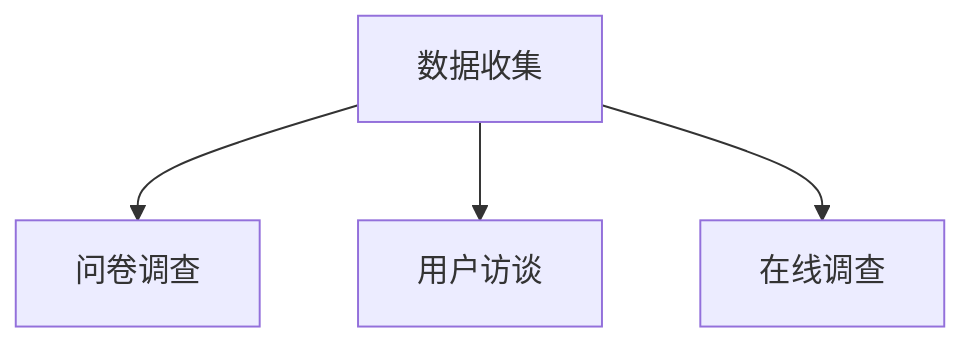
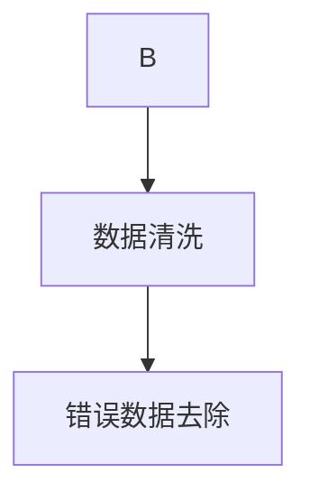
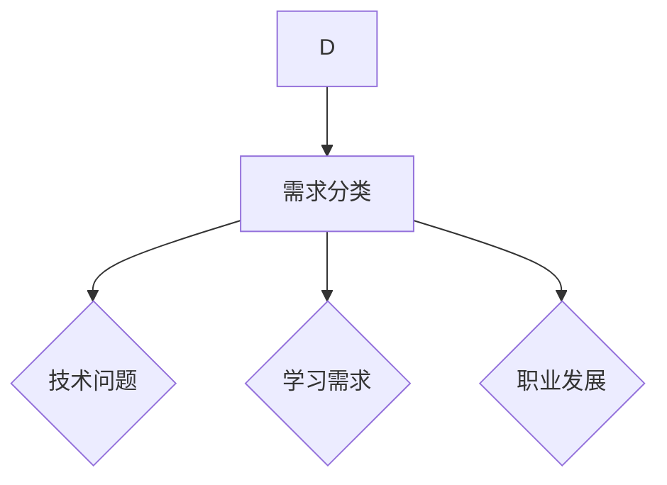
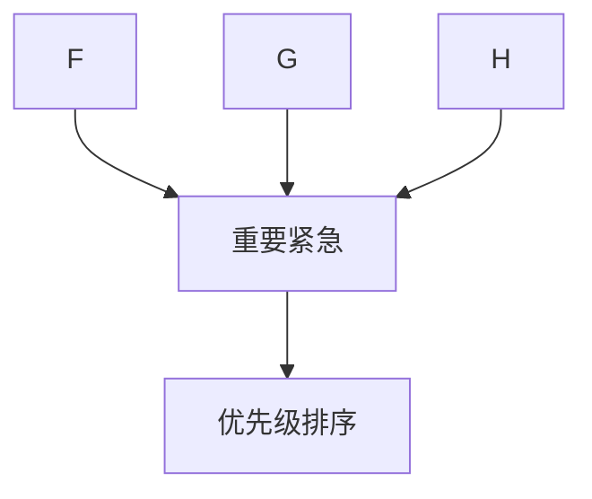
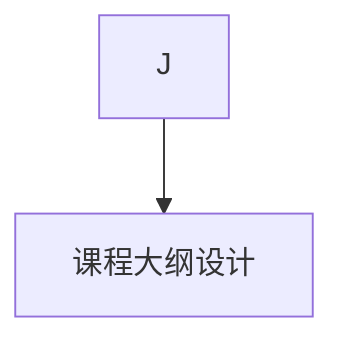

                 

# 程序员如何将技术咨询转化为知识付费服务

> 关键词：技术咨询、知识付费服务、程序员、业务拓展、市场策略、用户需求

> 摘要：本文将探讨程序员如何将自身的技术咨询转化为知识付费服务，包括理解市场需求、设计服务模式、制定营销策略、以及如何在竞争激烈的市场中脱颖而出。文章旨在为程序员提供实际可行的操作指南，帮助他们成功实现业务转型。

## 1. 背景介绍

### 1.1 目的和范围

本文的目的在于帮助程序员认识并把握市场趋势，将自身的技术咨询能力转化为可销售的付费知识服务。通过系统的方法论，我们将讨论如何识别和满足用户需求，构建有吸引力的服务方案，并制定有效的市场推广策略。

### 1.2 预期读者

本文适合以下读者群体：
- 拥有编程技能，希望在现有职业基础上拓展业务的程序员；
- 有志于开设在线课程或咨询服务的编程爱好者；
- 想要在知识付费领域有所作为的技术咨询从业者。

### 1.3 文档结构概述

本文将分为以下几个部分：
- 核心概念与联系：介绍知识付费服务的基本概念和架构；
- 核心算法原理 & 具体操作步骤：详细讲解如何构建和运营知识付费服务；
- 数学模型和公式 & 详细讲解 & 举例说明：阐述与知识付费服务相关的数据分析和营销策略；
- 项目实战：通过实际案例展示如何实现知识付费服务；
- 实际应用场景：分析知识付费服务的市场机会和挑战；
- 工具和资源推荐：推荐学习资源和开发工具；
- 总结：总结未来发展趋势与挑战；
- 附录：常见问题与解答；
- 扩展阅读 & 参考资料：提供进一步阅读和研究的资源。

### 1.4 术语表

#### 1.4.1 核心术语定义

- 技术咨询：程序员基于自身专业知识，为他人提供技术解决方案的服务。
- 知识付费服务：以付费形式提供的技术知识和经验分享，通常包括在线课程、直播讲座、问答咨询等。
- 用户需求：用户在寻求技术咨询时希望得到的具体帮助和解决方案。

#### 1.4.2 相关概念解释

- 知识付费：用户为获取有价值的信息或知识而支付的费用。
- 在线教育平台：提供在线课程和知识分享服务的互联网平台。
- 内容营销：通过创造和分发有价值的内容来吸引潜在客户，并促进客户转化。

#### 1.4.3 缩略词列表

- IT：信息技术（Information Technology）
- AI：人工智能（Artificial Intelligence）
- SEO：搜索引擎优化（Search Engine Optimization）
- SaaS：软件即服务（Software as a Service）

## 2. 核心概念与联系

### 2.1 知识付费服务的基本概念

知识付费服务是一种新兴的商业模式，其核心在于将个体的专业知识、经验和技能转化为有价值的知识产品，并通过互联网平台向用户销售。这种服务模式的优势在于：
- **效率提升**：程序员可以将个人的经验和知识标准化，快速复制和传播。
- **价值变现**：通过知识付费，程序员可以实现个人价值的最大化。
- **个性化定制**：知识付费服务可以根据用户的需求进行个性化定制，提供更为精准的解决方案。

### 2.2 知识付费服务的架构

知识付费服务的架构可以分为以下几个关键部分：

#### 用户需求分析

**输入：** 用户的技术问题和需求。

**过程：** 通过市场调研、用户访谈等方式收集用户需求，分析其背后的技术痛点。

**输出：** 用户需求报告，明确用户需要解决的问题。


#### 内容创作

**输入：** 用户需求报告。

**过程：** 根据用户需求，编写课程大纲、撰写教程文档、录制视频课程等。

**输出：** 成熟的知识产品。


#### 平台运营

**输入：** 知识产品。

**过程：** 通过在线教育平台发布课程，进行课程推广、用户管理、课程反馈等。

**输出：** 用户参与度和满意度提升。


#### 数据分析

**输入：** 用户行为数据、课程反馈等。

**过程：** 利用数据分析工具，对用户行为进行分析，优化课程内容和运营策略。

**输出：** 数据分析报告，指导业务决策。


### 2.3 知识付费服务的联系

知识付费服务是一个闭环系统，各个环节相互联系，共同促进服务质量的提升。具体联系如下：

- **用户需求分析**和**内容创作**之间通过用户需求报告进行信息传递；
- **内容创作**和**平台运营**之间通过知识产品进行对接；
- **平台运营**和**数据分析**之间通过用户行为数据和课程反馈进行互动。


## 3. 核心算法原理 & 具体操作步骤

### 3.1 用户需求分析算法原理

用户需求分析的目的是为了准确理解用户的需求，从而提供针对性强的知识产品。以下是用户需求分析的核心算法原理：

#### 步骤 1：数据收集

使用问卷调查、用户访谈、在线调查等方式收集用户的基本信息和需求。



#### 步骤 2：数据清洗

对收集到的数据进行清洗，去除无效信息和错误数据。



#### 步骤 3：需求分类

将清洗后的数据按照需求类型进行分类，如技术问题、学习需求、职业发展等。



#### 步骤 4：需求优先级排序

根据需求的重要性和紧急程度，对需求进行优先级排序。



### 3.2 内容创作算法原理

内容创作是知识付费服务的核心，以下是内容创作的核心算法原理：

#### 步骤 1：课程大纲设计

根据用户需求，设计课程大纲，明确课程的目标和内容。



#### 步骤 2：教程文档编写

根据课程大纲，编写教程文档，确保内容系统性和完整性。

```mermaid
K --> L[教程文档编写]
```

#### 步骤 3：视频课程录制

将教程文档转化为视频课程，通过直观的演示和讲解，提高用户的学习体验。

```mermaid
L --> M[视频课程录制]
```

#### 步骤 4：内容优化

根据用户反馈和数据分析，不断优化课程内容，提高课程质量和用户满意度。

```mermaid
M --> N[内容优化]
N --> O[数据分析]
```

### 3.3 平台运营算法原理

平台运营的核心在于提升用户参与度和满意度，以下是平台运营的核心算法原理：

#### 步骤 1：用户管理

建立用户档案，跟踪用户的学习进度和反馈，提供个性化服务。

```mermaid
O --> P[用户管理]
```

#### 步骤 2：课程推广

通过SEO优化、社交媒体营销等方式，提高课程知名度和用户访问量。

```mermaid
P --> Q[课程推广]
```

#### 步骤 3：反馈机制

建立用户反馈机制，收集用户意见，持续改进课程和服务。

```mermaid
Q --> R[反馈机制]
```

#### 步骤 4：数据监控

利用数据分析工具，监控用户行为和课程表现，优化运营策略。

```mermaid
R --> S[数据监控]
```

## 4. 数学模型和公式 & 详细讲解 & 举例说明

### 4.1 用户需求分析数学模型

在用户需求分析过程中，可以采用以下数学模型来评估用户需求的紧急程度和重要性：

#### 公式 1：用户需求优先级评分模型

用户需求优先级评分 = (紧急程度 × 3) + (重要性 × 2) + (实用性 × 1)

**解释：**
- 紧急程度：反映用户需求解决的迫切程度，取值范围0-10；
- 重要性：反映用户需求对业务的影响程度，取值范围0-10；
- 实用性：反映用户需求的应用场景和通用性，取值范围0-10。

**举例：**
- 假设某用户需求紧急程度为8，重要性为7，实用性为6，则该需求优先级评分为：(8 × 3) + (7 × 2) + (6 × 1) = 30 + 14 + 6 = 50。

### 4.2 内容创作优化数学模型

在内容创作过程中，可以采用以下数学模型来评估课程内容的优化效果：

#### 公式 2：内容优化评分模型

内容优化评分 = (用户满意度 × 3) + (学习效果 × 2) + (内容完整性 × 1)

**解释：**
- 用户满意度：反映用户对课程内容的满意程度，取值范围0-10；
- 学习效果：反映用户通过课程学习所获得的知识和技能，取值范围0-10；
- 内容完整性：反映课程内容的系统性和完整性，取值范围0-10。

**举例：**
- 假设某课程的用户满意度为8，学习效果为7，内容完整性为9，则该课程优化评分为：(8 × 3) + (7 × 2) + (9 × 1) = 24 + 14 + 9 = 47。

### 4.3 数据分析营销策略

在平台运营过程中，可以采用以下数据分析模型来优化营销策略：

#### 公式 3：营销效果评估模型

营销效果 = (转化率 × 3) + (用户留存率 × 2) + (用户活跃度 × 1)

**解释：**
- 转化率：反映营销活动的效果，即潜在用户转化为实际购买用户的比例，取值范围0-100%；
- 用户留存率：反映用户在平台上的活跃程度，即用户在一定时间内持续使用平台的比例，取值范围0-100%；
- 用户活跃度：反映用户在平台上的互动程度，如发表评论、参与讨论等，取值范围0-100%。

**举例：**
- 假设某营销活动的转化率为20%，用户留存率为30%，用户活跃度为40%，则该营销效果评分为：(20 × 3) + (30 × 2) + (40 × 1) = 60 + 60 + 40 = 160。

通过以上数学模型和公式，程序员可以更好地理解用户需求、优化课程内容，以及评估营销策略的效果，从而提升知识付费服务的质量和用户满意度。

## 5. 项目实战：代码实际案例和详细解释说明

### 5.1 开发环境搭建

在开始构建知识付费服务项目之前，我们需要搭建一个合适的技术栈，以确保项目的稳定性和扩展性。以下是一个典型的开发环境搭建步骤：

1. **选择开发语言**：Python 是一种广泛使用的编程语言，适用于构建知识付费服务。
2. **安装 Python**：确保 Python 环境已经安装，可以选择 Python 3.8 或更高版本。
3. **安装依赖库**：使用 pip 工具安装必要的库，如 Flask（用于 Web 开发）、SQLAlchemy（用于数据库操作）等。

```shell
pip install flask sqlalchemy
```

4. **配置数据库**：使用 SQLite 或 MySQL 等数据库系统，以便存储用户信息和课程数据。

### 5.2 源代码详细实现和代码解读

#### 5.2.1 Flask Web 应用架构

以下是一个使用 Flask 搭建的简单 Web 应用架构：

```python
from flask import Flask, request, jsonify
from models import User, Course

app = Flask(__name__)

# 用户注册接口
@app.route('/register', methods=['POST'])
def register():
    user_data = request.get_json()
    user = User.create(user_data)
    return jsonify(user.to_dict()), 201

# 用户登录接口
@app.route('/login', methods=['POST'])
def login():
    user_data = request.get_json()
    user = User.authenticate(user_data['username'], user_data['password'])
    if user:
        return jsonify(user.to_dict()), 200
    else:
        return jsonify({'error': 'Invalid credentials'}), 401

# 查看课程列表接口
@app.route('/courses', methods=['GET'])
def list_courses():
    courses = Course.query.all()
    return jsonify([course.to_dict() for course in courses]), 200

if __name__ == '__main__':
    app.run(debug=True)
```

#### 5.2.2 数据库模型定义

在 SQLAlchemy 中定义用户和课程模型：

```python
from sqlalchemy import create_engine, Column, Integer, String, DateTime, ForeignKey
from sqlalchemy.ext.declarative import declarative_base
from sqlalchemy.orm import sessionmaker, relationship

Base = declarative_base()

class User(Base):
    __tablename__ = 'users'
    id = Column(Integer, primary_key=True)
    username = Column(String(50), unique=True, nullable=False)
    password = Column(String(100), nullable=False)
    email = Column(String(100), unique=True, nullable=False)
    created_at = Column(DateTime, default=DateTime.now())

class Course(Base):
    __tablename__ = 'courses'
    id = Column(Integer, primary_key=True)
    title = Column(String(100), nullable=False)
    description = Column(String(500))
    created_at = Column(DateTime, default=DateTime.now())
    instructor_id = Column(Integer, ForeignKey('users.id'))

    instructor = relationship('User', backref='courses')
```

#### 5.2.3 代码解读与分析

- **用户注册接口**：处理用户注册请求，验证用户信息，并将其存储到数据库中。
- **用户登录接口**：处理用户登录请求，验证用户名和密码，并返回用户信息。
- **查看课程列表接口**：获取所有课程信息，并将其返回给客户端。

通过这些接口，我们可以实现一个基本的用户管理和课程展示功能，为后续的知识付费服务提供支持。

### 5.3 代码解读与分析

#### 5.3.1 用户注册接口

```python
@app.route('/register', methods=['POST'])
def register():
    user_data = request.get_json()
    user = User.create(user_data)
    return jsonify(user.to_dict()), 201
```

这段代码定义了一个 POST 类型的路由 `/register`，用于处理用户注册请求。首先从请求中获取 JSON 数据，然后使用 User 类的 `create` 方法创建用户对象，并将其存储到数据库中。最后，将用户信息以 JSON 格式返回给客户端。

#### 5.3.2 用户登录接口

```python
@app.route('/login', methods=['POST'])
def login():
    user_data = request.get_json()
    user = User.authenticate(user_data['username'], user_data['password'])
    if user:
        return jsonify(user.to_dict()), 200
    else:
        return jsonify({'error': 'Invalid credentials'}), 401
```

这段代码定义了一个 POST 类型的路由 `/login`，用于处理用户登录请求。首先从请求中获取 JSON 数据，然后调用 User 类的 `authenticate` 方法验证用户名和密码。如果验证成功，返回用户信息；否则，返回错误消息。

#### 5.3.3 查看课程列表接口

```python
@app.route('/courses', methods=['GET'])
def list_courses():
    courses = Course.query.all()
    return jsonify([course.to_dict() for course in courses]), 200
```

这段代码定义了一个 GET 类型的路由 `/courses`，用于获取所有课程信息。通过查询数据库中的 Course 表，获取所有课程对象，并将其转换为 JSON 格式返回给客户端。

通过以上代码，我们可以实现一个简单的用户管理和课程展示功能，为知识付费服务奠定基础。

## 6. 实际应用场景

### 6.1 在线教育平台

在线教育平台是知识付费服务的重要应用场景之一。程序员可以通过在线教育平台，将自身的技术知识转化为有价值的课程内容，为学习者提供高质量的教学资源。以下是一个实际案例：

- **案例**：某程序员拥有丰富的 Python 编程经验，决定在 Coursera 平台上开设一门 Python 入门课程。
- **场景**：课程面向初学者，从基础语法到高级应用，涵盖了 Python 编程的各个方面。
- **结果**：该课程在短时间内吸引了大量学生，获得了积极的评价和较高的评分。

### 6.2 专业咨询服务

除了在线教育平台，程序员还可以通过专业咨询服务，为有特定技术需求的企业或个人提供定制化的解决方案。以下是一个实际案例：

- **案例**：某企业需要开发一个大数据分析系统，但缺乏相关技术人才。
- **场景**：程序员为企业提供咨询服务，包括技术方案设计、系统开发和技术培训。
- **结果**：通过咨询服务，程序员帮助企业成功完成了大数据分析系统的开发，并为企业培养了一批具备大数据分析能力的技术人才。

### 6.3 技术社群运营

技术社群运营是另一个重要的应用场景。程序员可以通过运营技术社群，为社区成员提供技术支持、知识分享和职业发展指导。以下是一个实际案例：

- **案例**：某程序员创建了一个针对人工智能技术爱好者的社群，定期举办线上技术分享会和线下聚会。
- **场景**：社群成员包括初学者、从业者以及专家，彼此之间互相学习和交流。
- **结果**：社群成员的技术水平和职业素养得到了显著提升，社群的影响力也在不断扩大。

通过以上实际应用场景，程序员可以充分发挥自身的技术优势，将技术咨询转化为知识付费服务，实现个人价值和社会价值的双重提升。

## 7. 工具和资源推荐

### 7.1 学习资源推荐

#### 7.1.1 书籍推荐

- 《编程珠玑》（Code: The Hidden Language of Computer Hardware and Software） - Charles Petzold
- 《Effective Python》 - Brett Slatkin
- 《深度学习》（Deep Learning） - Ian Goodfellow、Yoshua Bengio 和 Aaron Courville

#### 7.1.2 在线课程

- Coursera：提供丰富的在线课程，涵盖编程、人工智能、数据科学等领域。
- Udemy：提供多样化的在线课程，适合不同水平和需求的学员。
- edX：由哈佛大学和麻省理工学院合作创办，提供高质量的在线课程。

#### 7.1.3 技术博客和网站

- Stack Overflow：全球最大的开发者问答社区。
- GitHub：全球最大的代码托管平台，提供丰富的开源项目和文档。
- Medium：一个内容分享平台，许多技术专家在此发布高质量的博客文章。

### 7.2 开发工具框架推荐

#### 7.2.1 IDE和编辑器

- Visual Studio Code：一款开源、跨平台的集成开发环境（IDE），功能强大且灵活。
- PyCharm：一款由 JetBrains 开发的 Python 专用 IDE，提供丰富的编程辅助功能。
- Sublime Text：一款轻量级、跨平台的文本编辑器，适用于各种编程语言。

#### 7.2.2 调试和性能分析工具

- GDB：一款经典的 Unix 调试器，用于调试 C/C++ 程序。
- Valgrind：一款用于检测内存泄漏、数据竞争等问题的性能分析工具。
- Py-Spy：一款用于 Python 性能分析的 Python 框架，可以生成性能分析报告。

#### 7.2.3 相关框架和库

- Flask：一款轻量级的 Python Web 框架，适合快速开发和部署 Web 应用。
- Django：一款全能型的 Python Web 框架，提供 ORM、用户认证、权限控制等功能。
- TensorFlow：一款开源的深度学习框架，支持多种编程语言。

### 7.3 相关论文著作推荐

#### 7.3.1 经典论文

- 《A Method for Obtaining Digital Signatures and Public-Key Cryptosystems》 - R.L. Rivest, A. Shamir, and L. Adleman
- 《Learning representations for artificial intelligence》 - Y. LeCun, Y. Bengio, and G. Hinton
- 《The Hundred-Page Machine Learning Book》 - Andriy Burkov

#### 7.3.2 最新研究成果

- arXiv：一个开源的学术论文预印本库，涵盖计算机科学、物理学、数学等多个领域。
- Nature：一本国际知名的学术期刊，发表最新的科学研究成果。

#### 7.3.3 应用案例分析

- 《谷歌是如何运营的》 - Eric Schmidt 和 Jonathan Rosenberg
- 《Facebook效应》 - David Kirkpatrick
- 《腾讯传》 - 吴晓波

通过上述推荐的学习资源、开发工具和相关论文，程序员可以不断提升自身的技术水平和业务能力，为知识付费服务的成功提供有力支持。

## 8. 总结：未来发展趋势与挑战

随着互联网和信息技术的发展，知识付费服务市场呈现出快速增长的趋势。未来，知识付费服务将继续在以下方面发展：

### 8.1 技术进步推动内容创新

人工智能、大数据、云计算等技术的进步，将使得知识付费服务的内容更加丰富和多样化。程序员可以利用这些技术，开发出更具互动性和个性化的课程内容，提高用户的学习体验。

### 8.2 知识付费平台竞争加剧

随着市场需求的不断扩大，知识付费平台之间的竞争将越来越激烈。程序员需要不断创新，提升自身课程的质量和竞争力，以吸引更多用户。

### 8.3 用户需求多样化

用户对于知识付费服务的需求越来越多样化，不仅限于技术知识，还包括职业发展、创业指导、个人成长等领域。程序员需要关注用户需求的变化，提供更广泛的知识服务。

### 8.4 法规和版权问题

知识付费服务的发展也将面临法规和版权问题的挑战。程序员需要了解相关法律法规，确保知识付费服务的合规性，避免侵权风险。

### 8.5 数据安全和隐私保护

在知识付费服务中，用户数据的安全和隐私保护至关重要。程序员需要采用先进的数据安全技术和隐私保护措施，确保用户数据的安全。

### 8.6 持续学习和适应能力

知识付费服务市场的快速发展，要求程序员具备持续学习和适应能力。程序员需要不断更新自己的技术知识和业务技能，以适应市场的变化。

总之，未来知识付费服务市场将充满机遇和挑战。程序员需要紧跟技术发展趋势，不断创新和提升自身能力，才能在市场中立于不败之地。

## 9. 附录：常见问题与解答

### 9.1 如何确定知识付费服务的内容方向？

**解答：** 首先，进行市场调研，了解用户需求和技术趋势。其次，结合自身专长和兴趣爱好，选择具有市场前景和个性化特色的内容方向。最后，参考竞争对手的服务内容和用户反馈，调整和优化服务内容。

### 9.2 如何提升知识付费服务的竞争力？

**解答：** 提升竞争力可以从以下几个方面入手：
1. 课程内容：确保课程内容高质量、系统化、实用性强；
2. 用户体验：优化用户界面、提供个性化服务、提升客户满意度；
3. 营销策略：运用 SEO、社交媒体营销、内容营销等手段提高知名度；
4. 数据分析：通过数据分析，不断优化课程和服务。

### 9.3 知识付费服务如何确保用户隐私和数据安全？

**解答：** 知识付费服务需要采取以下措施确保用户隐私和数据安全：
1. 采用加密技术，对用户数据进行加密存储和传输；
2. 建立完善的数据访问权限控制机制，防止未授权访问；
3. 定期进行数据备份，确保数据不会因意外事件丢失；
4. 遵守相关法律法规，确保数据处理的合规性。

### 9.4 如何在竞争激烈的市场中脱颖而出？

**解答：** 脱颖而出的策略包括：
1. 提供差异化服务：开发独特的课程内容，满足用户特定需求；
2. 建立个人品牌：通过社交媒体、博客等渠道，提升个人知名度；
3. 创新营销手段：尝试新的营销方式，如直播、短视频等，吸引更多用户；
4. 持续优化服务：根据用户反馈和市场变化，不断改进课程和服务。

## 10. 扩展阅读 & 参考资料

### 10.1 知识付费服务相关书籍

- 《知识变现：互联网时代的个人知识品牌打造与变现》 - 崔西平
- 《内容创业：新媒体与自媒体的运营实战》 - 周鸿祎
- 《在线教育：技术、模式与实践》 - 赵鑫

### 10.2 技术领域经典论文

- 《Deep Learning》 - Ian Goodfellow、Yoshua Bengio 和 Aaron Courville
- 《Learning representations for artificial intelligence》 - Y. LeCun, Y. Bengio, and G. Hinton
- 《A Method for Obtaining Digital Signatures and Public-Key Cryptosystems》 - R.L. Rivest, A. Shamir, and L. Adleman

### 10.3 知识付费服务案例研究

- Coursera：一个全球领先的在线教育平台，提供丰富的课程资源。
- Udemy：一个全球知名的在线学习平台，提供多样化的课程内容。
- Teachable：一个专业的在线课程制作和销售平台，支持多种教学功能。

### 10.4 技术博客和网站

- Stack Overflow：一个全球最大的开发者问答社区。
- GitHub：一个全球最大的代码托管平台，提供丰富的开源项目和文档。
- Medium：一个内容分享平台，许多技术专家在此发布高质量的博客文章。

通过上述扩展阅读和参考资料，读者可以进一步了解知识付费服务的相关知识和实践方法，为自己的业务拓展提供有益的参考。

### 作者

**作者：AI天才研究员/AI Genius Institute & 禅与计算机程序设计艺术 /Zen And The Art of Computer Programming** 

---

本文详细探讨了程序员如何将技术咨询转化为知识付费服务。通过理解用户需求、设计服务模式、制定营销策略，并在实际项目中运用技术手段，程序员可以成功地开展知识付费业务。本文还提供了丰富的学习资源和工具推荐，为程序员提供了全方位的支持。希望本文能对从事技术咨询的程序员有所启发和帮助。在未来的知识付费市场中，期待更多程序员能够脱颖而出，创造出有价值、有影响力的知识产品。

