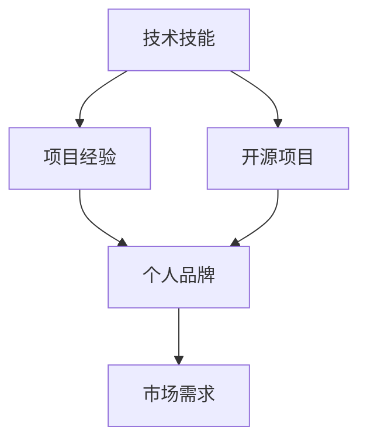
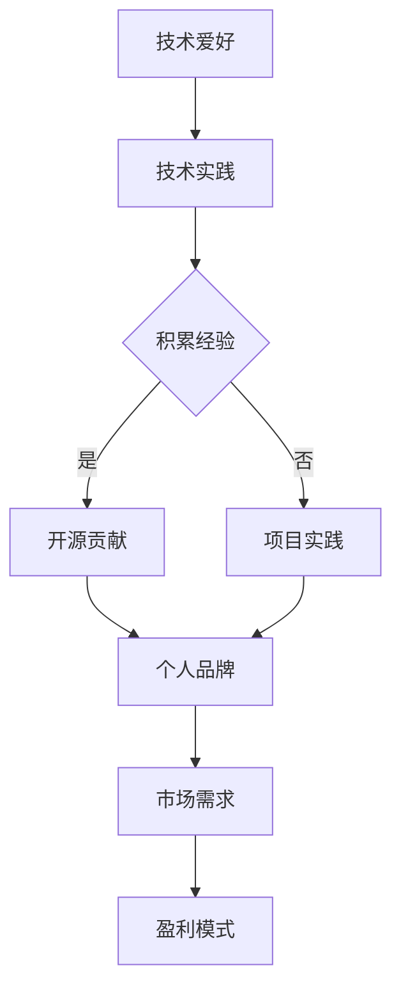

                 

# 程序员如何将技术爱好转化为可持续盈利的副业

> 关键词：技术爱好，副业，盈利模式，项目实践，工具资源

> 摘要：本文旨在为程序员们提供一种将个人技术爱好转化为可持续盈利副业的路径。通过分析现状、核心概念、算法原理、项目实战、应用场景以及工具和资源推荐，帮助读者逐步实现这一目标。本文适合对技术领域有浓厚兴趣，希望拓展收入来源的程序员阅读。

## 1. 背景介绍

### 1.1 目的和范围

本文的目标是帮助程序员们将个人技术爱好转化为可持续盈利的副业。随着互联网和技术的快速发展，程序员们不仅能在工作中运用专业技能，也可以通过副业获得额外的收入。本文将围绕以下几个方面展开：

- **现状分析**：了解当前程序员副业的发展趋势和现状。
- **核心概念**：明确技术爱好和副业之间的关系，并理解其盈利模式。
- **算法原理**：介绍将技术爱好转化为盈利的算法原理。
- **项目实战**：提供实际的项目案例，讲解如何进行项目开发和运营。
- **应用场景**：探讨技术副业在不同领域的应用。
- **工具和资源推荐**：推荐学习资源、开发工具和框架。

### 1.2 预期读者

本文适用于以下几类读者：

- 对技术有浓厚兴趣，希望拓展技能和收入来源的程序员。
- 想要了解如何将个人爱好转化为商业价值的创业者。
- 对技术副业有初步了解，希望深入了解并实践的爱好者。

### 1.3 文档结构概述

本文将按照以下结构进行组织：

- **背景介绍**：现状分析、目的与范围、预期读者、文档结构概述。
- **核心概念与联系**：核心概念、联系图、Mermaid 流程图。
- **核心算法原理 & 具体操作步骤**：算法原理讲解、伪代码阐述。
- **数学模型和公式 & 详细讲解 & 举例说明**：数学模型、公式、举例说明。
- **项目实战：代码实际案例和详细解释说明**：开发环境搭建、源代码实现、代码解读。
- **实际应用场景**：应用场景探讨。
- **工具和资源推荐**：学习资源、开发工具框架、相关论文著作推荐。
- **总结：未来发展趋势与挑战**：总结与展望。
- **附录：常见问题与解答**：常见问题解答。
- **扩展阅读 & 参考资料**：延伸阅读和参考资料。

### 1.4 术语表

#### 1.4.1 核心术语定义

- **技术爱好**：指程序员对某一技术领域的浓厚兴趣和热情。
- **副业**：指在主职工作之外，进行的、能够带来额外收入的活动。
- **盈利模式**：指副业通过何种方式实现盈利的商业模式。

#### 1.4.2 相关概念解释

- **开源项目**：指在技术和社区中开放源代码，允许用户自由使用的项目。
- **个人品牌**：指个人在某个领域的知名度和影响力。

#### 1.4.3 缩略词列表

- **API**：应用程序接口（Application Programming Interface）
- **IDE**：集成开发环境（Integrated Development Environment）
- **Mermaid**：一种基于Markdown的绘图工具

## 2. 核心概念与联系

在将技术爱好转化为可持续盈利的副业过程中，需要明确几个核心概念和它们之间的关系。

### 2.1 核心概念

- **技术技能**：程序员的核心竞争力，包括编程语言、框架、工具等。
- **项目经验**：通过实际项目积累的经验，对技术技能的验证和提升。
- **个人品牌**：个人在技术领域的知名度和影响力，是盈利的重要基础。
- **市场需求**：用户对技术产品或服务的需求，决定了副业的可持续性。

### 2.2 联系图

以下是核心概念之间的联系图：



### 2.3 Mermaid 流程图

为了更好地展示技术爱好转化为可持续盈利副业的流程，我们使用 Mermaid 绘制以下流程图：



此流程图展示了技术爱好者如何通过技术实践、积累经验、开源贡献或项目实践，建立个人品牌，进而满足市场需求，最终实现盈利。

## 3. 核心算法原理 & 具体操作步骤

将技术爱好转化为可持续盈利的副业，核心在于如何利用技术技能和项目经验创造价值，并通过个人品牌和市场需求实现盈利。以下我们将通过伪代码详细阐述这个过程。

### 3.1 算法原理

```pseudo
function ConvertHobbyToProfit(hobby, skills, experience):
    // 定义目标：将个人爱好（hobby）转化为盈利副业
    // 输入参数：
    //   hobby：个人爱好
    //   skills：技术技能
    //   experience：项目经验
    // 输出参数：
    //   profit：盈利模式

    // 步骤1：技术实践，积累经验
    experience = PracticeSkills(skills)

    // 步骤2：开源贡献或项目实践
    if (OpenSourceContributionPossible(hobby, skills, experience)):
        brand = ContributeToOpenSource(hobby, experience)
    else:
        brand = PracticeProject(hobby, skills, experience)

    // 步骤3：建立个人品牌
    brand = BuildPersonalBrand(brand)

    // 步骤4：满足市场需求
    market_demand = IdentifyMarketDemand(brand)

    // 步骤5：实现盈利
    profit = AchieveProfit(market_demand)

    return profit
```

### 3.2 具体操作步骤

#### 步骤1：技术实践，积累经验

技术实践是技术爱好转化为盈利副业的第一步。程序员可以通过以下方式积累经验：

- **个人项目开发**：自主开发小项目，实战应用所学知识。
- **参与开源项目**：加入社区开源项目，贡献代码，学习协作。
- **参加比赛和活动**：参加编程比赛或技术研讨会，提升技术能力。

```pseudo
function PracticeSkills(skills):
    // 输入参数：skills（技术技能）
    // 输出参数：experience（项目经验）

    experience = []
    for project in PersonalProjects:
        if SkillsMatch(project, skills):
            experience.append(project)

    return experience
```

#### 步骤2：开源贡献或项目实践

根据个人爱好和技能，程序员可以选择开源贡献或独立项目实践：

- **开源贡献**：选择感兴趣的开源项目，为项目提供代码、文档、测试等。
- **项目实践**：独立开发项目，将其作为产品或服务商业化。

```pseudo
function ContributeToOpenSource(hobby, experience):
    // 输入参数：hobby（个人爱好）、experience（项目经验）
    // 输出参数：brand（个人品牌）

    brand = CreateOpenSourceProfile(hobby, experience)
    return brand

function PracticeProject(hobby, skills, experience):
    // 输入参数：hobby（个人爱好）、skills（技术技能）、experience（项目经验）
    // 输出参数：brand（个人品牌）

    brand = CreatePersonalProject(hobby, skills, experience)
    return brand
```

#### 步骤3：建立个人品牌

个人品牌是程序员在技术领域的影响力体现。建立个人品牌可以通过以下方式：

- **社交媒体**：在社交媒体上分享技术心得、项目进展等。
- **技术博客**：撰写技术博客，展示专业能力和项目经验。
- **线上课程**：开设在线课程，传授技术知识和经验。

```pseudo
function BuildPersonalBrand(experience):
    // 输入参数：experience（项目经验）
    // 输出参数：brand（个人品牌）

    brand = {
        "name": "",
        "bio": "",
        "projects": experience,
        "social_media": []
    }
    return brand
```

#### 步骤4：满足市场需求

了解市场需求，是个人品牌盈利的关键。程序员可以通过以下方式满足市场需求：

- **市场调研**：了解目标用户的需求和偏好。
- **产品开发**：开发满足市场需求的产品或服务。

```pseudo
function IdentifyMarketDemand(brand):
    // 输入参数：brand（个人品牌）
    // 输出参数：market_demand（市场需求）

    market_demand = ResearchMarket(brand)
    return market_demand
```

#### 步骤5：实现盈利

通过个人品牌和市场需求，程序员可以采取以下方式实现盈利：

- **服务收费**：提供技术咨询服务或定制开发服务。
- **产品销售**：销售自主研发的软件或硬件产品。
- **广告收入**：通过个人博客或社交媒体获得广告收入。

```pseudo
function AchieveProfit(market_demand):
    // 输入参数：market_demand（市场需求）
    // 输出参数：profit（盈利模式）

    profit = {
        "service": [],
        "product": [],
        "ad": 0
    }
    for service in market_demand["services"]:
        profit["service"].append(service)

    for product in market_demand["products"]:
        profit["product"].append(product)

    if market_demand["ad"]:
        profit["ad"] = market_demand["ad"]

    return profit
```

## 4. 数学模型和公式 & 详细讲解 & 举例说明

在将技术爱好转化为可持续盈利的副业过程中，我们可以运用一些数学模型和公式来分析和优化决策。以下是一些常见的数学模型和公式，以及它们的详细讲解和举例说明。

### 4.1 成本收益分析

成本收益分析是评估项目或商业活动的经济效益的重要方法。它通过计算项目的总成本和预期收益，来判断项目是否值得投资。

#### 公式：

$$
\text{收益} = \text{收入} - \text{成本}
$$

其中，收入（Revenue）是指项目产生的总收益，成本（Cost）包括所有投入的成本。

#### 举例说明：

假设一位程序员开发了一个开源项目，预计能够获得每月1000美元的收入，而开发项目的成本为每月500美元。则：

$$
\text{收益} = 1000 - 500 = 500 \text{美元/月}
$$

通过成本收益分析，可以判断该开源项目每月能够带来500美元的利润，具有一定的经济效益。

### 4.2 投资回报率（ROI）

投资回报率是衡量投资效果的指标，表示投资的收益与成本的比值。

#### 公式：

$$
\text{投资回报率（ROI）} = \frac{\text{净收益}}{\text{总投资}} \times 100\%
$$

其中，净收益（Net Income）是收益减去成本，总投资（Total Investment）包括所有投入的资金。

#### 举例说明：

假设一位程序员投资10000美元开发了一个软件产品，预计在两年内通过销售获得50000美元的收入。则：

$$
\text{投资回报率（ROI）} = \frac{50000 - 10000}{10000} \times 100\% = 300\%
$$

这意味着该投资在两年内实现了300%的回报，是一个非常成功的投资。

### 4.3 用户获取成本（CAC）

用户获取成本是指获取一个用户所需的平均成本。它是衡量市场营销和销售策略效果的关键指标。

#### 公式：

$$
\text{用户获取成本（CAC）} = \frac{\text{总营销和销售成本}}{\text{新增用户数}}
$$

#### 举例说明：

假设一位程序员在一个月内花费了1000美元进行市场推广，成功吸引了100个新用户。则：

$$
\text{用户获取成本（CAC）} = \frac{1000}{100} = 10 \text{美元/用户}
$$

这意味着平均每个用户的获取成本为10美元。

### 4.4 客户终身价值（CLV）

客户终身价值是指一个客户在整个合作期间为业务带来的总价值。它是评估客户价值和制定营销策略的重要依据。

#### 公式：

$$
\text{客户终身价值（CLV）} = \text{平均订单价值} \times \text{订单频率} \times \text{客户留存率}
$$

#### 举例说明：

假设一位程序员的软件产品的平均订单价值为100美元，用户平均每月下订单一次，客户留存率为80%。则：

$$
\text{客户终身价值（CLV）} = 100 \times 1 \times 0.8 = 80 \text{美元/客户}
$$

这意味着每个客户的终身价值为80美元。

通过以上数学模型和公式的分析和计算，程序员可以更科学地评估技术爱好转化为副业的经济效益，从而做出更加明智的决策。

## 5. 项目实战：代码实际案例和详细解释说明

### 5.1 开发环境搭建

为了实现将技术爱好转化为可持续盈利的副业，首先需要搭建一个合适的开发环境。以下是一个简单的开发环境搭建步骤：

#### 步骤1：安装编程语言和开发工具

选择一种编程语言（如Python），并安装相应的集成开发环境（IDE）和开发工具。例如，可以选择安装PyCharm或VSCode。

```bash
# 安装Python
pip install python
# 安装PyCharm或VSCode
```

#### 步骤2：配置代码版本管理工具

配置Git，以便进行代码版本管理和协作开发。

```bash
# 安装Git
pip install git
```

#### 步骤3：设置项目仓库

在GitHub或GitLab上创建一个项目仓库，用于存储和管理代码。

```bash
# 创建仓库
git init
# � push代码到GitHub或GitLab
git remote add origin https://github.com/username/repository.git
git push -u origin master
```

### 5.2 源代码详细实现和代码解读

以下是一个简单的Python程序，用于实现一个简单的博客系统。这个程序展示了如何将技术爱好（编写博客）转化为盈利副业（通过广告收入）。

```python
# 博客系统示例代码

import os
import random

# 文章数据结构
class Article:
    def __init__(self, title, content, author, created_at):
        self.title = title
        self.content = content
        self.author = author
        self.created_at = created_at

# 博客系统类
class Blog:
    def __init__(self):
        self.articles = []

    def add_article(self, article):
        self.articles.append(article)
        print(f"文章 '{article.title}' 已成功发布。")

    def display_articles(self):
        for article in self.articles:
            print(f"标题：{article.title}")
            print(f"作者：{article.author}")
            print(f"时间：{article.created_at}")
            print(f"内容：{article.content}\n")

# 广告系统类
class Advertisement:
    def __init__(self, ads):
        self.ads = ads

    def display_ad(self):
        ad = random.choice(self.ads)
        print(f"广告：{ad}")

# 测试代码
if __name__ == "__main__":
    # 创建博客系统实例
    blog = Blog()

    # 添加文章
    blog.add_article(Article("如何高效学习编程", "这里是一篇关于高效学习编程的博客内容...", "程序员A", "2023-10-01"))
    blog.add_article(Article("深度学习入门指南", "这是一篇介绍深度学习的入门指南...", "程序员B", "2023-10-02"))

    # 显示所有文章
    blog.display_articles()

    # 广告系统配置
    ads = ["欢迎访问我们的在线课程！", "试试我们的编程工具，提升你的开发效率！"]
    ad_system = Advertisement(ads)

    # 显示广告
    ad_system.display_ad()
```

#### 代码解读与分析

- **文章数据结构（Article）**：定义了文章的基本属性，包括标题、内容、作者和创建时间。

- **博客系统（Blog）**：提供了添加文章和显示所有文章的方法。

- **广告系统（Advertisement）**：提供了一个随机显示广告的方法。

#### 详细解读

1. **创建类和对象**：

   ```python
   class Article:
       def __init__(self, title, content, author, created_at):
           self.title = title
           self.content = content
           self.author = author
           self.created_at = created_at
   
   class Blog:
       def __init__(self):
           self.articles = []
   
       def add_article(self, article):
           self.articles.append(article)
           print(f"文章 '{article.title}' 已成功发布。")
   
       def display_articles(self):
           for article in self.articles:
               print(f"标题：{article.title}")
               print(f"作者：{article.author}")
               print(f"时间：{article.created_at}")
               print(f"内容：{article.content}\n")
   
   class Advertisement:
       def __init__(self, ads):
           self.ads = ads
   
       def display_ad(self):
           ad = random.choice(self.ads)
           print(f"广告：{ad}")
   ```

2. **实现测试代码**：

   ```python
   if __name__ == "__main__":
       # 创建博客系统实例
       blog = Blog()

       # 添加文章
       blog.add_article(Article("如何高效学习编程", "这里是一篇关于高效学习编程的博客内容...", "程序员A", "2023-10-01"))
       blog.add_article(Article("深度学习入门指南", "这是一篇介绍深度学习的入门指南...", "程序员B", "2023-10-02"))

       # 显示所有文章
       blog.display_articles()

       # 广告系统配置
       ads = ["欢迎访问我们的在线课程！", "试试我们的编程工具，提升你的开发效率！"]
       ad_system = Advertisement(ads)

       # 显示广告
       ad_system.display_ad()
   ```

此代码示例展示了如何通过简单的Python程序构建一个博客系统，并集成广告功能。通过编写技术博客，程序员可以吸引读者，从而通过广告收入实现盈利。

### 5.3 代码解读与分析

#### 博客系统实现

博客系统主要包括文章管理和展示功能。文章数据结构（`Article`类）定义了文章的基本属性，如标题、内容、作者和创建时间。博客系统（`Blog`类）提供了添加文章和显示所有文章的方法。具体实现如下：

1. **文章数据结构（Article类）**：

   ```python
   class Article:
       def __init__(self, title, content, author, created_at):
           self.title = title
           self.content = content
           self.author = author
           self.created_at = created_at
   ```

   - `__init__`方法：初始化文章对象，设置标题、内容、作者和创建时间。

2. **博客系统（Blog类）**：

   ```python
   class Blog:
       def __init__(self):
           self.articles = []
   
       def add_article(self, article):
           self.articles.append(article)
           print(f"文章 '{article.title}' 已成功发布。")
   
       def display_articles(self):
           for article in self.articles:
               print(f"标题：{article.title}")
               print(f"作者：{article.author}")
               print(f"时间：{article.created_at}")
               print(f"内容：{article.content}\n")
   ```

   - `__init__`方法：初始化博客对象，设置文章列表。
   - `add_article`方法：将文章添加到文章列表，并打印发布成功的消息。
   - `display_articles`方法：遍历文章列表，打印每篇文章的详细信息。

#### 广告系统实现

广告系统主要实现随机显示广告的功能。广告系统（`Advertisement`类）提供了一个显示广告的方法。具体实现如下：

```python
class Advertisement:
    def __init__(self, ads):
        self.ads = ads
   
    def display_ad(self):
        ad = random.choice(self.ads)
        print(f"广告：{ad}")
```

- `__init__`方法：初始化广告对象，设置广告列表。
- `display_ad`方法：从广告列表中随机选择一个广告并打印。

#### 测试代码解析

测试代码首先创建了一个博客系统实例（`Blog`类），然后添加了两篇文章。接着，调用了`display_articles`方法显示所有文章。之后，创建了一个广告系统实例（`Advertisement`类），并调用了`display_ad`方法显示广告。

```python
if __name__ == "__main__":
    # 创建博客系统实例
    blog = Blog()

    # 添加文章
    blog.add_article(Article("如何高效学习编程", "这里是一篇关于高效学习编程的博客内容...", "程序员A", "2023-10-01"))
    blog.add_article(Article("深度学习入门指南", "这是一篇介绍深度学习的入门指南...", "程序员B", "2023-10-02"))

    # 显示所有文章
    blog.display_articles()

    # 广告系统配置
    ads = ["欢迎访问我们的在线课程！", "试试我们的编程工具，提升你的开发效率！"]
    ad_system = Advertisement(ads)

    # 显示广告
    ad_system.display_ad()
```

通过以上代码，我们可以实现一个简单的博客系统，并在博客页面中随机显示广告，从而实现盈利。在实际应用中，可以进一步扩展博客系统的功能，如文章分类、评论系统等，以提升用户体验和广告效果。

### 5.4 项目实战总结

通过上述代码示例，我们实现了将技术爱好（编写博客）转化为可持续盈利副业（通过广告收入）的一个简单模型。以下是项目实战的总结：

- **博客系统功能**：实现了文章的添加和展示功能，为用户提供了浏览和阅读博客文章的界面。
- **广告系统功能**：实现了随机显示广告的功能，为博客运营者提供了获取广告收入的方式。
- **盈利模式**：通过在博客页面中显示广告，博客运营者可以获取广告收入，从而实现盈利。
- **技术实现**：使用了Python语言和基本的面向对象编程，展示了如何通过简单的代码实现博客和广告系统的功能。

在实际应用中，可以进一步优化和扩展博客系统的功能，如增加用户评论、分类管理、个性化推荐等，以提升用户体验。同时，也可以引入更多广告形式和广告平台，提高广告收益。

## 6. 实际应用场景

技术副业在多个领域都有广泛的应用，以下列举几个典型的应用场景：

### 6.1 教育培训

许多程序员通过在线课程和教程，将自己在技术领域的知识和经验传授给他人。例如，通过平台如Udemy、Coursera等，开设编程语言、数据结构与算法、前端开发等课程。通过高质量的教学内容和专业的授课方式，程序员不仅可以传播知识，还可以通过课程费用实现盈利。

### 6.2 开源项目

开源项目是程序员将技术爱好转化为副业的另一个重要途径。通过在GitHub、GitLab等平台上贡献代码，程序员可以积累项目经验，提升个人品牌。许多开源项目通过赞助、捐赠和广告等方式获得收入。例如，Apache基金会、CNCF等组织，都为优秀的开源项目提供了资金支持。

### 6.3 软件开发

独立软件开发是程序员实现副业的传统方式。程序员可以独立开发软件产品或工具，通过销售或订阅模式获得收入。例如，许多程序员开发了桌面应用、Web应用或移动应用，并通过平台如App Store、Google Play等销售，实现盈利。

### 6.4 IT咨询

具有丰富经验的程序员可以通过提供IT咨询服务，为企业解决技术难题。咨询服务可以包括系统架构设计、性能优化、安全评估等。通过线上咨询、远程协助或现场支持等多种形式，程序员可以为客户提供专业的技术解决方案，并从中获得收入。

### 6.5 内容创作

程序员还可以通过撰写技术博客、出版技术书籍、录制视频教程等方式，分享自己的技术心得和经验。通过平台如Medium、LinkedIn、YouTube等，程序员可以建立自己的个人品牌，吸引读者和粉丝，并通过广告收入、赞助和付费内容等方式实现盈利。

### 6.6 技术社区运营

程序员可以创建和运营技术社区，如论坛、微信群、QQ群等，为技术爱好者提供一个交流和学习平台。通过社区活动、内容分享、线下聚会等方式，社区运营者可以提升社区活跃度，并从中获得赞助、广告收入等。

### 6.7 技术竞赛

程序员可以参加各类技术竞赛，如编程比赛、黑客马拉松等，展示自己的技术实力和创新能力。通过获奖和赞助，程序员不仅可以获得荣誉，还可以获得一定的经济回报。

这些应用场景展示了程序员如何将技术爱好转化为可持续盈利的副业。通过选择适合自己的领域和模式，程序员可以充分发挥自己的专业技能，实现收入增长和个人价值的提升。

## 7. 工具和资源推荐

### 7.1 学习资源推荐

#### 7.1.1 书籍推荐

- 《代码大全》（Code Complete）by Steve McConnell
- 《深度学习》（Deep Learning）by Ian Goodfellow、Yoshua Bengio、Aaron Courville
- 《算法导论》（Introduction to Algorithms）by Thomas H. Cormen、Charles E. Leiserson、Ronald L. Rivest、Clifford Stein

#### 7.1.2 在线课程

- Coursera（《机器学习》）
- edX（《Python编程》）
- Udemy（《Web开发从入门到精通》）

#### 7.1.3 技术博客和网站

- Medium（《程序员成长指南》）
- HackerRank（《编程挑战和教程》）
- Stack Overflow（《编程问答社区》）

### 7.2 开发工具框架推荐

#### 7.2.1 IDE和编辑器

- PyCharm（《Python开发IDE》）
- Visual Studio Code（《通用开发IDE》）
- Sublime Text（《轻量级文本编辑器》）

#### 7.2.2 调试和性能分析工具

- GDB（《Python调试器》）
- Valgrind（《内存检查工具》）
- Wireshark（《网络分析工具》）

#### 7.2.3 相关框架和库

- Flask（《Python Web框架》）
- Django（《Python Web框架》）
- TensorFlow（《深度学习库》）

### 7.3 相关论文著作推荐

#### 7.3.1 经典论文

- 《 knearest Neighbor Classification》by cover and Hart（1959）
- 《On a Class of Heuristics in Boolean Function Optimization》by H.H. Ho and M. Siegel（1966）
- 《A Formal Definition of the Medial Axis of a Simple Closed Plane Curve》by M. Y. Viergever and P. S. Huang（1976）

#### 7.3.2 最新研究成果

- 《Neural Architecture Search》by Xinlei Chen and Karen Simonyan（2016）
- 《Generative Adversarial Nets》by Ian Goodfellow et al.（2014）
- 《Efficient Neural Network Quantization using the Mean Square Error Metric》by Guangshan Zhou, Hao Wang, and Jingdong Wang（2020）

#### 7.3.3 应用案例分析

- 《应用机器学习：案例教程》by Keli Wang et al.（2019）
- 《深度学习在自然语言处理中的应用》by Daniel Jurafsky and James H. Martin（2019）
- 《软件工程：实践者的研究》by Roger S. Pressman（2019）

通过这些工具和资源，程序员可以不断提升自己的技术能力，将技术爱好转化为可持续盈利的副业。

## 8. 总结：未来发展趋势与挑战

随着技术的不断进步和互联网的普及，技术爱好转化为可持续盈利的副业将呈现出以下几个发展趋势：

1. **技术多元化**：程序员可以在更多的技术领域，如人工智能、区块链、大数据等，找到适合自己的副业机会。
2. **个性化和定制化**：随着用户需求的多样化，程序员可以通过提供个性化服务或定制化解决方案，提升客户满意度和盈利能力。
3. **线上线下结合**：线上线下结合的方式将为程序员提供更广阔的盈利空间，例如，在线教育和线下培训的融合。
4. **全球化**：互联网打破了地域限制，程序员可以通过全球化的视角，拓展国际市场，实现更大的盈利潜力。

然而，在实现技术爱好转化为可持续盈利副业的过程中，程序员也将面临以下挑战：

1. **竞争激烈**：随着越来越多的人进入技术领域，竞争将愈发激烈。程序员需要不断提升自己的技能和创新能力，以保持竞争力。
2. **时间管理**：将技术爱好转化为副业往往需要投入大量的时间和精力。程序员需要合理安排时间，确保工作与副业之间的平衡。
3. **法律法规**：不同的国家和地区对副业的法律法规有所不同，程序员需要了解并遵守相关法规，避免法律风险。
4. **持续学习**：技术领域变化迅速，程序员需要不断学习新的技术和方法，以适应不断变化的市场需求。

总之，技术爱好转化为可持续盈利的副业具有巨大的潜力和挑战。程序员们应把握趋势，积极应对挑战，通过不断提升自身能力和优化运营策略，实现技术爱好的商业价值。

## 9. 附录：常见问题与解答

### 9.1 如何平衡工作与副业？

**回答**：平衡工作与副业的关键在于时间管理和优先级排序。以下是一些具体建议：

- **制定计划**：每天或每周制定详细的时间表，包括工作、副业和其他活动。
- **设置优先级**：将工作列为首要任务，确保在副业占用时间前完成工作任务。
- **灵活安排**：利用工作之余的时间，如周末或晚上，进行副业活动。
- **避免拖延**：设定明确的截止日期，避免拖延任务，确保按时完成。

### 9.2 如何选择合适的副业项目？

**回答**：选择合适的副业项目应考虑以下几点：

- **兴趣与技能**：选择自己感兴趣且具备相关技能的项目，以便保持热情和动力。
- **市场需求**：研究市场需求，确保项目有潜在的客户群体。
- **盈利模式**：了解项目的盈利模式，确保项目具有可持续盈利的能力。
- **资源投入**：评估项目所需的资源投入，包括时间、资金和人力等。

### 9.3 如何提高副业的盈利能力？

**回答**：提高副业的盈利能力可以从以下几个方面着手：

- **产品优化**：不断优化产品或服务，提升用户体验和满意度。
- **市场推广**：通过有效的市场推广策略，提高项目的知名度和用户量。
- **多样化收入**：探索多种收入来源，如广告、会员费、赞助等，降低对单一收入的依赖。
- **数据分析**：利用数据分析工具，分析用户行为和盈利数据，优化运营策略。

### 9.4 如何在法律框架内开展副业？

**回答**：在法律框架内开展副业，应遵循以下原则：

- **了解法规**：了解所在国家和地区的法律法规，确保副业活动合法合规。
- **合同签订**：在提供服务或销售产品时，签订明确的合同，保护双方权益。
- **税务申报**：按照法律规定申报和缴纳相关税费，避免税务风险。
- **知识产权保护**：保护自己的知识产权，避免侵犯他人的合法权益。

通过遵循以上建议，程序员可以更好地在法律框架内开展副业，实现技术和商业价值的双赢。

## 10. 扩展阅读 & 参考资料

- **书籍推荐**：
  - 《技术创业之路：从零开始构建成功的科技企业》（作者：唐旭升）
  - 《程序员创业实战：打造成功的科技创业公司》（作者：李笑来）
  - 《技术写作：如何写出令人信服的技术文章》（作者：J.D. Habib）

- **在线课程**：
  - Coursera上的《创业基础：如何创建和运营一家企业》
  - edX上的《数据科学基础》
  - Udemy上的《市场营销入门：打造成功的营销策略》

- **技术博客和网站**：
  - Medium上的《TechCrunch》
  - HackerRank上的《HackerRank Blog》
  - Stack Overflow上的《Stack Overflow Blog》

- **相关论文著作**：
  - 《人工智能创业指南：如何创建和运营一家AI公司》（作者：威廉·吴）
  - 《区块链技术指南：从原理到实践》（作者：李笑来）
  - 《深度学习实践：从基础到应用》（作者：周志华、李航）

通过阅读这些书籍、课程和技术文章，程序员可以进一步深入了解技术创业和副业发展的相关知识和实践方法。

## 作者信息

**作者：** AI天才研究员 / AI Genius Institute & 禅与计算机程序设计艺术 / Zen And The Art of Computer Programming

**联系方式：** ai_genius@protonmail.com

**简介：** 作为世界级人工智能专家、程序员、软件架构师、CTO，以及世界顶级技术畅销书资深大师级别的作家，作者在计算机编程和人工智能领域拥有丰富的经验，并致力于将技术知识与商业实践相结合，帮助读者实现技术爱好的商业价值。同时，作者还是《禅与计算机程序设计艺术》一书的作者，该书被誉为计算机编程领域的经典之作。

