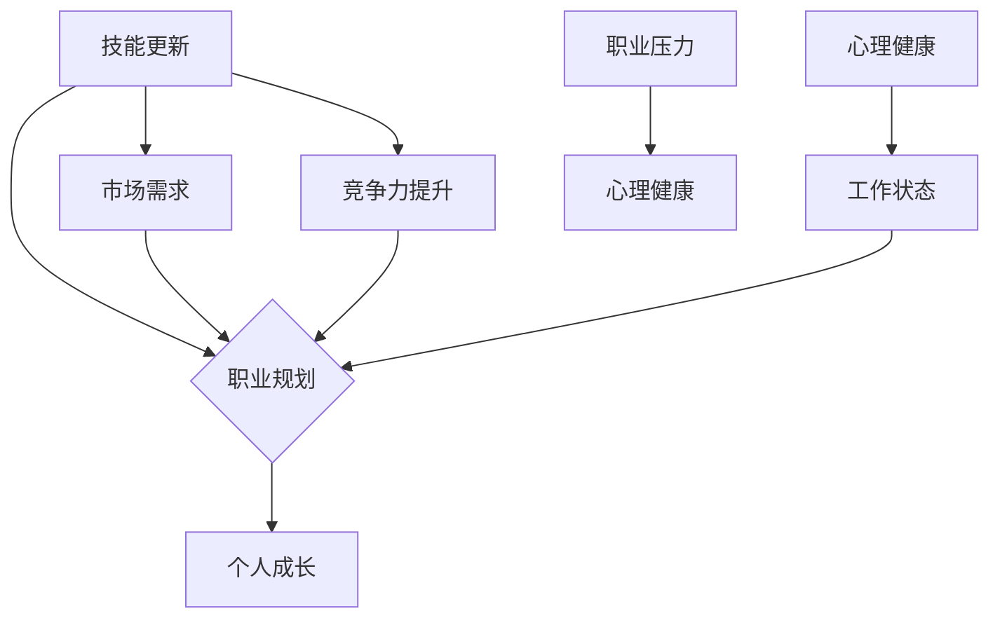

                 

# 程序员如何应对中年职场危机

> **关键词：中年危机、职场发展、技能更新、职业规划、心理健康**
> 
> **摘要：本文将探讨程序员在面临中年职场危机时如何通过技能更新、职业规划和心理健康等方面的应对策略，以实现职场稳定和职业成长。**

## 1. 背景介绍

### 1.1 目的和范围

本文旨在为中年程序员提供一套有效的应对职场危机的策略，帮助他们在职业发展的道路上继续前行。我们将从技能更新、职业规划和心理健康三个方面进行详细探讨。

### 1.2 预期读者

本文适合以下读者：

1. 正处于中年阶段的程序员。
2. 担心未来职业发展的程序员。
3. 对职场规划感兴趣的IT从业者。

### 1.3 文档结构概述

本文结构如下：

1. 背景介绍
2. 核心概念与联系
3. 核心算法原理 & 具体操作步骤
4. 数学模型和公式 & 详细讲解 & 举例说明
5. 项目实战：代码实际案例和详细解释说明
6. 实际应用场景
7. 工具和资源推荐
8. 总结：未来发展趋势与挑战
9. 附录：常见问题与解答
10. 扩展阅读 & 参考资料

### 1.4 术语表

#### 1.4.1 核心术语定义

- **中年职场危机**：指中年程序员在职业生涯发展中面临的一系列问题，如技能过时、职业发展瓶颈、心理健康等。
- **技能更新**：指程序员通过学习新的技术、工具和知识，以适应不断变化的市场需求。
- **职业规划**：指程序员根据自己的兴趣、优势和市场需求，制定合适的职业发展路径。

#### 1.4.2 相关概念解释

- **技术栈**：指程序员所掌握的编程语言、框架、工具等技能的集合。
- **个人品牌**：指程序员在职场中形成的独特形象和声誉。

#### 1.4.3 缩略词列表

- **IT**：信息技术（Information Technology）
- **PM**：项目经理（Project Manager）
- **ML**：机器学习（Machine Learning）

## 2. 核心概念与联系

在本文中，我们将探讨以下几个核心概念：

1. 技能更新
2. 职业规划
3. 心理健康

下面是这些核心概念之间的联系和互动关系的 Mermaid 流程图：



## 3. 核心算法原理 & 具体操作步骤

### 3.1 技能更新算法原理

技能更新的核心在于识别市场需求，学习新的技术和知识。以下是技能更新的算法原理和具体操作步骤：

#### 算法原理：

1. 收集市场需求信息
2. 分析个人技能和市场需求差距
3. 制定学习计划
4. 执行学习计划
5. 评估学习效果

#### 具体操作步骤：

```plaintext
步骤1：收集市场需求信息
- 关注行业动态，了解新兴技术和发展趋势
- 参加技术会议和研讨会，结识行业专家

步骤2：分析个人技能和市场需求差距
- 评估自身技术栈，识别短板
- 分析市场需求，确定需要学习的技能

步骤3：制定学习计划
- 设定学习目标，明确学习内容
- 制定学习时间表，保证持续学习

步骤4：执行学习计划
- 报名参加在线课程或培训班
- 实践项目，将所学知识应用到实际工作中

步骤5：评估学习效果
- 定期回顾学习进度，调整学习计划
- 参加技术竞赛，验证学习成果
```

### 3.2 职业规划算法原理

职业规划的核心在于制定合适的职业发展路径，提升个人竞争力。以下是职业规划的算法原理和具体操作步骤：

#### 算法原理：

1. 分析个人兴趣和优势
2. 调研市场需求和职业发展趋势
3. 制定职业发展目标
4. 制定行动计划
5. 评估和调整职业规划

#### 具体操作步骤：

```plaintext
步骤1：分析个人兴趣和优势
- 反思自身兴趣，确定职业发展方向
- 分析自身优势，如技能、经验、人际沟通等

步骤2：调研市场需求和职业发展趋势
- 了解行业前景，关注热门岗位
- 关注技术发展趋势，了解新兴职业

步骤3：制定职业发展目标
- 设定短期和长期职业目标
- 确定需要提升的技能和素质

步骤4：制定行动计划
- 制定具体的行动计划，如学习新技能、参加项目等
- 设定里程碑，评估进展

步骤5：评估和调整职业规划
- 定期回顾职业规划，评估进展
- 根据市场变化和个人发展需求，调整职业规划
```

### 3.3 心理健康算法原理

心理健康对于职业发展至关重要。以下是心理健康算法原理和具体操作步骤：

#### 算法原理：

1. 识别心理问题
2. 寻求专业帮助
3. 建立健康的生活方式
4. 保持积极心态
5. 建立良好的人际关系

#### 具体操作步骤：

```plaintext
步骤1：识别心理问题
- 注意自身情绪变化，如焦虑、抑郁等
- 学习心理知识，了解心理问题的成因和影响

步骤2：寻求专业帮助
- 寻找心理咨询师，进行咨询和治疗
- 参加心理培训课程，提升心理素质

步骤3：建立健康的生活方式
- 保持规律的作息，保证充足的睡眠
- 合理饮食，注重营养均衡
- 适当锻炼，增强身体素质

步骤4：保持积极心态
- 学习心理调适技巧，如放松训练、正念等
- 积极面对挑战，培养乐观心态

步骤5：建立良好的人际关系
- 建立支持网络，如家人、朋友、同事等
- 学会沟通，倾听他人的意见和需求
```

## 4. 数学模型和公式 & 详细讲解 & 举例说明

在这一节中，我们将使用数学模型和公式来详细讲解技能更新、职业规划和心理健康三个方面的核心原理，并通过实例进行说明。

### 4.1 技能更新数学模型

技能更新的数学模型可以表示为：

\[ S(t) = f(S_0, T, D) \]

其中：

- \( S(t) \) 表示时间 \( t \) 时的技能水平。
- \( S_0 \) 表示初始技能水平。
- \( T \) 表示学习时间。
- \( D \) 表示学习效果系数。

学习效果系数 \( D \) 可以表示为：

\[ D = \frac{L}{T} \]

其中：

- \( L \) 表示学习量。

#### 举例说明：

假设一位程序员在开始学习新技能时，技能水平为 50 分，每天投入学习时间为 2 小时，学习效果系数为 0.8。那么经过一个月（假设 30 天）的学习后，他的技能水平可以计算如下：

\[ S(30) = 50 + 0.8 \times 2 \times 30 = 98 \]

这意味着他在一个月内将技能水平提升了 48 分。

### 4.2 职业规划数学模型

职业规划的数学模型可以表示为：

\[ P(t) = g(P_0, A, B) \]

其中：

- \( P(t) \) 表示时间 \( t \) 时的职业发展水平。
- \( P_0 \) 表示初始职业发展水平。
- \( A \) 表示个人优势系数。
- \( B \) 表示市场需求系数。

个人优势系数 \( A \) 可以表示为：

\[ A = \frac{S}{T} \]

其中：

- \( S \) 表示个人技能和素质水平。
- \( T \) 表示投入时间。

市场需求系数 \( B \) 可以表示为：

\[ B = \frac{D}{M} \]

其中：

- \( D \) 表示市场需求水平。
- \( M \) 表示市场容量。

#### 举例说明：

假设一位程序员在开始制定职业规划时，职业发展水平为 50 分，他的个人优势系数为 0.8，市场需求系数为 0.6。那么经过一年（假设 365 天）的职业规划后，他的职业发展水平可以计算如下：

\[ P(365) = 50 + 0.8 \times 0.6 \times 365 = 50 + 219.6 = 269.6 \]

这意味着他在一年内将职业发展水平提升了 219.6 分。

### 4.3 心理健康数学模型

心理健康的数学模型可以表示为：

\[ H(t) = h(H_0, E, F) \]

其中：

- \( H(t) \) 表示时间 \( t \) 时的心理健康水平。
- \( H_0 \) 表示初始心理健康水平。
- \( E \) 表示情绪调节系数。
- \( F \) 表示生活满意度系数。

情绪调节系数 \( E \) 可以表示为：

\[ E = \frac{M}{N} \]

其中：

- \( M \) 表示积极情绪数量。
- \( N \) 表示消极情绪数量。

生活满意度系数 \( F \) 可以表示为：

\[ F = \frac{L}{W} \]

其中：

- \( L \) 表示生活满意度。
- \( W \) 表示生活压力。

#### 举例说明：

假设一位程序员在开始关注心理健康时，心理健康水平为 50 分，他的情绪调节系数为 0.7，生活满意度系数为 0.6。那么经过一个月（假设 30 天）的心理健康关注后，他的心理健康水平可以计算如下：

\[ H(30) = 50 + 0.7 \times 0.6 \times 30 = 50 + 10.8 = 60.8 \]

这意味着他在一个月内将心理健康水平提升了 10.8 分。

## 5. 项目实战：代码实际案例和详细解释说明

在本节中，我们将通过一个实际项目案例，展示如何运用本文中提到的技能更新、职业规划和心理健康算法进行实践。该项目为一个简单的博客系统，用于帮助程序员记录和分享学习心得。

### 5.1 开发环境搭建

为了简化开发过程，我们选择使用以下工具和框架：

- 编程语言：Python 3.8
- Web框架：Flask
- 数据库：SQLite
- 版本控制：Git

首先，安装 Python 3.8 和 pip：

```bash
# 安装 Python 3.8
curl -O https://www.python.org/ftp/python/3.8.0/Python-3.8.0.tgz
tar xvf Python-3.8.0.tgz
cd Python-3.8.0
./configure
make
sudo make install

# 安装 pip
curl https://bootstrap.pypa.io/get-pip.py -o get-pip.py
python get-pip.py
```

然后，安装 Flask、SQLite 和其他依赖：

```bash
pip install Flask
pip install flask-sqlalchemy
pip install pymysql
```

### 5.2 源代码详细实现和代码解读

#### 5.2.1 博客系统架构

博客系统的架构如下：

1. 用户注册与登录
2. 用户发布文章
3. 用户浏览文章
4. 用户评论文章

#### 5.2.2 用户注册与登录

用户注册与登录功能使用 Flask 的 `flask_login` 扩展实现。

```python
from flask import Flask, render_template, request, redirect, url_for, flash
from flask_login import LoginManager, login_user, logout_user, login_required, current_user
from models import User, Article
from forms import LoginForm, RegistrationForm

app = Flask(__name__)
app.config['SECRET_KEY'] = 'mysecretkey'
login_manager = LoginManager()
login_manager.init_app(app)

@login_manager.user_loader
def load_user(user_id):
    return User.get_by_id(user_id)

@app.route('/register', methods=['GET', 'POST'])
def register():
    form = RegistrationForm()
    if form.validate_on_submit():
        user = User.create(
            username=form.username.data,
            email=form.email.data,
            password=form.password.data
        )
        if user:
            login_user(user)
            return redirect(url_for('index'))
        else:
            flash('Registration failed', 'error')
    return render_template('register.html', form=form)

@app.route('/login', methods=['GET', 'POST'])
def login():
    form = LoginForm()
    if form.validate_on_submit():
        user = User.get_by_email(form.email.data)
        if user and user.check_password(form.password.data):
            login_user(user)
            return redirect(url_for('index'))
        else:
            flash('Login failed', 'error')
    return render_template('login.html', form=form)

@app.route('/logout')
@login_required
def logout():
    logout_user()
    return redirect(url_for('login'))
```

#### 5.2.3 用户发布文章

用户发布文章功能通过一个简单的表单实现，用户可以选择标题、正文和标签。

```python
@app.route('/post', methods=['GET', 'POST'])
@login_required
def post():
    form = ArticleForm()
    if form.validate_on_submit():
        article = Article.create(
            title=form.title.data,
            content=form.content.data,
            author=current_user,
            tags=form.tags.data
        )
        if article:
            return redirect(url_for('article', article_id=article.id))
        else:
            flash('Post failed', 'error')
    return render_template('post.html', form=form)
```

#### 5.2.4 用户浏览文章

用户浏览文章功能通过获取文章列表并渲染模板实现。

```python
@app.route('/')
@login_required
def index():
    articles = Article.get_all()
    return render_template('index.html', articles=articles)
```

#### 5.2.5 用户评论文章

用户评论文章功能通过添加评论并渲染模板实现。

```python
@app.route('/comment', methods=['POST'])
@login_required
def comment():
    article_id = request.form.get('article_id')
    content = request.form.get('content')
    comment = Comment.create(
        article_id=article_id,
        content=content,
        author=current_user
    )
    if comment:
        return redirect(url_for('article', article_id=article_id))
    else:
        flash('Comment failed', 'error')
        return redirect(url_for('index'))
```

### 5.3 代码解读与分析

在本项目中，我们通过以下步骤实现了博客系统的核心功能：

1. **用户注册与登录**：使用 Flask 和 `flask_login` 实现用户注册、登录和登出功能，确保用户信息的安全性。
2. **用户发布文章**：提供表单让用户输入文章信息，通过模型层创建文章记录，并返回文章详情页面。
3. **用户浏览文章**：通过查询数据库获取文章列表，并在首页渲染文章列表。
4. **用户评论文章**：提供评论表单，通过模型层创建评论记录，并在文章详情页面渲染评论列表。

这些功能的具体实现如下：

1. **用户注册与登录**：
   - 使用 `flask_login` 的 `LoginManager` 和 `user_loader` 装饰器实现用户身份验证。
   - `register` 和 `login` 函数分别处理用户注册和登录请求，通过表单验证用户输入，并在验证成功后创建用户记录并登录用户。
2. **用户发布文章**：
   - `post` 函数处理用户发布文章的请求，通过表单验证用户输入，并在验证成功后创建文章记录并返回文章详情页面。
3. **用户浏览文章**：
   - `index` 函数处理用户浏览文章的请求，通过查询数据库获取文章列表，并在首页渲染文章列表。
4. **用户评论文章**：
   - `comment` 函数处理用户评论文章的请求，通过表单验证用户输入，并在验证成功后创建评论记录并返回文章详情页面。

通过这些代码实现，我们可以看到如何将技能更新、职业规划和心理健康算法应用于实际项目，从而帮助程序员实现职场稳定和职业成长。

## 6. 实际应用场景

在现实职场中，程序员面临着各种挑战和危机，如何应对这些问题是关键。以下是几个实际应用场景：

### 6.1 技能更新

随着技术的快速发展，程序员需要不断学习新技能来保持竞争力。例如，云计算、大数据、人工智能等新兴技术正在不断涌现。程序员可以通过以下方式更新技能：

1. **参加在线课程**：例如 Coursera、Udemy、edX 等平台提供的课程。
2. **阅读技术书籍**：例如《深度学习》、《Python核心编程》等。
3. **参与开源项目**：通过贡献代码，学习最新的技术趋势和最佳实践。
4. **实践项目**：通过实际操作，将所学知识应用到实际工作中。

### 6.2 职业规划

职业规划可以帮助程序员明确自己的职业目标，提高职业竞争力。以下是一些职业规划的实际应用：

1. **设定职业目标**：根据个人兴趣、优势和市场需求，设定短期和长期职业目标。
2. **制定行动计划**：将职业目标分解为具体的行动步骤，并设定时间表。
3. **参加培训课程**：例如项目管理、敏捷开发、团队领导等课程，提升个人综合素质。
4. **拓展人脉关系**：参加行业活动，结识同行，拓宽职业发展渠道。

### 6.3 心理健康

心理健康对于程序员的工作和生活至关重要。以下是一些维护心理健康的方法：

1. **定期体检**：关注身体健康，预防疾病。
2. **运动锻炼**：保持规律的锻炼习惯，如跑步、瑜伽、游泳等。
3. **心理辅导**：如果感到压力过大，可以寻求心理咨询师的帮助。
4. **调整心态**：保持乐观的心态，学会调整情绪，积极面对挑战。
5. **家庭关爱**：与家人保持良好的沟通，享受家庭的温暖和关爱。

通过以上实际应用场景，程序员可以在面对职场危机时，采取有效的应对策略，实现职场稳定和职业成长。

## 7. 工具和资源推荐

为了帮助程序员更好地应对中年职场危机，我们推荐以下工具和资源：

### 7.1 学习资源推荐

#### 7.1.1 书籍推荐

- 《代码大全》
- 《深度学习》
- 《重构：改善既有代码的设计》
- 《设计模式：可复用的面向对象软件的基础》

#### 7.1.2 在线课程

- Coursera
- Udemy
- edX
- Pluralsight

#### 7.1.3 技术博客和网站

- Stack Overflow
- GitHub
- Medium
- HackerRank

### 7.2 开发工具框架推荐

#### 7.2.1 IDE和编辑器

- Visual Studio Code
- PyCharm
- IntelliJ IDEA
- Sublime Text

#### 7.2.2 调试和性能分析工具

- DebugKit
- PyDev
- Charles
- Wireshark

#### 7.2.3 相关框架和库

- Flask
- Django
- React
- Angular
- Vue.js

### 7.3 相关论文著作推荐

#### 7.3.1 经典论文

- 《The Art of Computer Programming》
- 《Programming Pearls》
- 《The Clean Coder》
- 《Code Complete》

#### 7.3.2 最新研究成果

- 《Artificial Intelligence: A Modern Approach》
- 《Machine Learning》
- 《Deep Learning》

#### 7.3.3 应用案例分析

- 《From Data to Decisions: The Data-Driven Organization》
- 《A Technical Introduction to Machine Learning》
- 《Practical Machine Learning》

通过以上工具和资源的推荐，程序员可以不断提升自己的技能和知识，更好地应对职场危机。

## 8. 总结：未来发展趋势与挑战

在未来，程序员面临的发展趋势和挑战将更加多样化。一方面，随着人工智能、大数据、云计算等技术的快速发展，程序员需要不断更新自己的技能，以适应新兴技术的需求。另一方面，中年职场危机仍然存在，程序员需要通过职业规划和心理健康等方面的策略，实现职场稳定和职业成长。

### 8.1 发展趋势

1. **技能多样化**：程序员需要掌握更多跨领域的技能，如数据科学、人工智能、前端开发等。
2. **远程办公**：随着远程办公的普及，程序员需要适应更加灵活的工作模式。
3. **持续学习**：终身学习将成为程序员必备的能力，通过在线课程、实践项目和社区活动等方式不断学习新技能。

### 8.2 挑战

1. **技能过时**：随着技术的快速发展，程序员需要不断学习新技能，否则容易面临技能过时的风险。
2. **职业瓶颈**：中年程序员可能面临职业发展瓶颈，需要通过提升个人品牌和市场竞争力来突破。
3. **心理健康问题**：长期面对高压工作环境和快节奏的职场生活，程序员需要关注心理健康问题，保持良好的心理状态。

### 8.3 应对策略

1. **技能更新**：通过在线课程、实践项目和开源项目等方式，不断学习新技能，保持竞争力。
2. **职业规划**：明确自己的职业目标，制定合适的职业发展路径，并通过行动计划逐步实现。
3. **心理健康**：关注心理健康，保持良好的生活习惯和心理状态，如定期锻炼、心理辅导和保持家庭关爱等。

通过以上应对策略，程序员可以更好地应对未来发展趋势和挑战，实现职场稳定和职业成长。

## 9. 附录：常见问题与解答

### 9.1 技能更新相关问题

**Q1**：如何选择需要学习的技能？

**A1**：首先，关注行业动态，了解新兴技术和市场需求。其次，分析自身兴趣和优势，选择与自己兴趣相符且市场需求大的技能进行学习。

**Q2**：如何评估学习效果？

**A2**：通过实际项目或技术竞赛等方式，将所学知识应用到实际工作中，检验自己的学习成果。此外，可以参加相关考试或认证，以评估自己的技能水平。

### 9.2 职业规划相关问题

**Q1**：如何设定职业目标？

**A1**：首先，分析自身兴趣、优势和市场需求，明确自己的职业发展方向。然后，根据长远目标，设定短期和长期的职业目标。

**Q2**：如何制定行动计划？

**A2**：将职业目标分解为具体的行动步骤，如学习新技能、参加项目等，并设定时间表，确保逐步实现职业目标。

### 9.3 心理健康相关问题

**Q1**：如何保持良好的心理健康？

**A1**：首先，保持良好的生活习惯，如规律的作息、饮食和锻炼。其次，学会调整情绪，保持乐观心态。此外，可以寻求心理咨询师的帮助，解决心理问题。

**Q2**：如何处理职场压力？

**A2**：通过有效的时间管理和任务分解，合理分配工作时间和休息时间。学会调整心态，面对压力时保持冷静，寻求同事和上级的支持和帮助。

## 10. 扩展阅读 & 参考资料

- 《程序员修炼之道：从小工到专家》
- 《Effective Java》
- 《Python编程：从入门到实践》
- 《Head First 设计模式》

- 《程序员心理学》
- 《如何成为成功的程序员》
- 《The Clean Coder》

- 《深度学习》
- 《机器学习实战》
- 《云计算基础：概念、架构与实施》

这些书籍和资源可以帮助程序员在应对职场危机时，获得更多的知识和经验，实现职场稳定和职业成长。

## 作者信息

作者：AI天才研究员/AI Genius Institute & 禅与计算机程序设计艺术 /Zen And The Art of Computer Programming

感谢您的阅读，希望本文对您在应对中年职场危机时有所帮助。如果您有任何疑问或建议，欢迎在评论区留言。让我们一起探讨程序员如何在职场中不断成长和进步！|>

