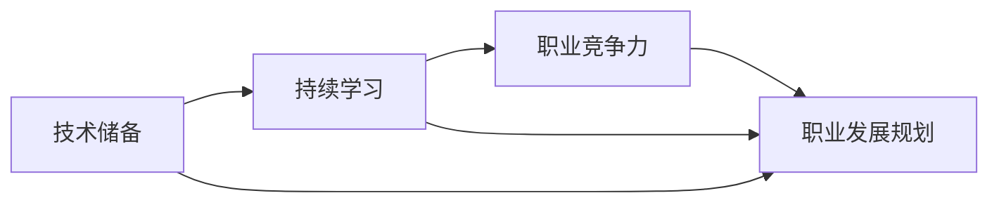

                 

# 程序员如何应对经济衰退

> 关键词：经济衰退、程序员、职业发展、技术储备、应对策略
> 
> 摘要：本文旨在为程序员提供一系列策略，帮助他们更好地应对经济衰退带来的挑战。文章首先介绍了经济衰退的背景和影响，然后探讨了程序员在这一时期如何提升自身竞争力、加强技术储备以及规划职业发展。通过详细分析和实战案例，为程序员应对经济波动提供了实用的指导和建议。

## 1. 背景介绍

### 1.1 目的和范围

本文的目的是为程序员提供一套系统性的应对策略，帮助他们更好地应对经济衰退时期的挑战。文章将涵盖以下几个方面：

1. 经济衰退的定义和影响
2. 程序员在应对经济衰退时的角色和定位
3. 提升技术储备和职业竞争力
4. 职业发展规划和风险规避
5. 实战案例分享和经验总结

### 1.2 预期读者

本文适合以下读者群体：

1. 正在从事编程工作的程序员
2. 有志于从事编程工作的求职者
3. 对经济衰退和职业发展感兴趣的从业者
4. 企事业单位的HR和管理人员

### 1.3 文档结构概述

本文分为十个主要部分，结构如下：

1. 背景介绍
2. 核心概念与联系
3. 核心算法原理 & 具体操作步骤
4. 数学模型和公式 & 详细讲解 & 举例说明
5. 项目实战：代码实际案例和详细解释说明
6. 实际应用场景
7. 工具和资源推荐
8. 总结：未来发展趋势与挑战
9. 附录：常见问题与解答
10. 扩展阅读 & 参考资料

### 1.4 术语表

#### 1.4.1 核心术语定义

- 经济衰退：指一个国家或地区的经济增长放缓或出现负增长，通常伴随着失业率上升、企业倒闭和金融市场动荡等现象。
- 程序员：从事计算机编程工作，负责设计和开发软件的专业人士。
- 技术储备：指程序员在特定领域所掌握的知识和技能。
- 职业竞争力：指个人在职场中具有的竞争优势和能力。

#### 1.4.2 相关概念解释

- 技术栈：指程序员在特定项目或领域中所掌握的技术工具和框架。
- 持续学习：指个人持续提升自己的知识和技能，以适应不断变化的市场需求。
- 职业发展规划：指个人根据自身兴趣和职业目标，制定并实施的职业成长计划。

#### 1.4.3 缩略词列表

- IT：信息技术
- AI：人工智能
- DevOps：软件开发与运维
- ML：机器学习
- DB：数据库

## 2. 核心概念与联系

在应对经济衰退的过程中，程序员需要关注以下几个核心概念：

1. **技术储备**：程序员应在多个技术领域积累深厚的知识储备，以便在职业发展中具备更强的竞争力。
2. **持续学习**：随着技术的不断进步，程序员需要不断学习新的知识和技能，以保持自己的竞争力。
3. **职业竞争力**：程序员应在个人能力、团队合作和项目管理等方面不断提升，以应对经济衰退带来的挑战。
4. **职业发展规划**：程序员应根据自己的兴趣和职业目标，制定并实施合适的职业发展规划。

下面通过Mermaid流程图展示这些概念之间的关系：



- **技术储备**是程序员应对经济衰退的基础，它决定了程序员在市场上的竞争力。
- **持续学习**是程序员保持技术储备的重要手段，有助于不断提升自身的知识水平。
- **职业竞争力**是程序员在职场中的关键因素，直接影响个人的职业发展和收入水平。
- **职业发展规划**则是程序员根据自身情况和目标，制定的长期职业规划，有助于实现职业目标。

## 3. 核心算法原理 & 具体操作步骤

在应对经济衰退的过程中，程序员需要掌握一些核心算法原理，以提高自身的技术水平和职业竞争力。以下是几个关键算法原理及其具体操作步骤：

### 3.1 动态规划算法

**算法原理**：

动态规划是一种解决优化问题的算法思想，它将复杂问题分解为若干子问题，并利用子问题的最优解来构建原问题的最优解。

**具体操作步骤**：

1. 确定状态变量和状态转移方程。
2. 设计一个表格（通常是二维数组）来存储子问题的最优解。
3. 从表格的边界开始填充，逐步推导出原问题的最优解。

**伪代码**：

```python
def dynamic_programming(problem):
    # 初始化表格
    dp = [[0] * (n+1) for _ in range(m+1)]
    
    # 填充表格
    for i in range(1, m+1):
        for j in range(1, n+1):
            dp[i][j] = max(dp[i-1][j], dp[i][j-1]) + problem(i, j)
    
    # 返回最优解
    return dp[m][n]
```

### 3.2 贪心算法

**算法原理**：

贪心算法是一种在每一步选择中都采取当前最好或最优的选择，从而得到整个问题的最优解的算法。

**具体操作步骤**：

1. 分析问题，确定每一步的最佳选择。
2. 根据最佳选择逐步推导出整体最优解。

**伪代码**：

```python
def greedy_algorithm(problem):
    solution = []
    while not problem_is_solved():
        best_choice = find_best_choice(problem)
        solution.append(best_choice)
        problem = apply_choice(problem, best_choice)
    
    return solution
```

### 3.3 回溯算法

**算法原理**：

回溯算法是一种通过试探法来寻找问题的解的算法。在搜索过程中，如果发现当前的试探无法得到解，则会回溯到上一个状态，并尝试其他可能的解。

**具体操作步骤**：

1. 初始化问题的状态。
2. 递归尝试所有可能的解。
3. 如果找到解，则返回；否则，回溯到上一个状态并尝试其他解。

**伪代码**：

```python
def backtracking_algorithm(problem):
    def helper(state):
        if is_solution(state):
            return state
        for choice in possible_choices(state):
            new_state = apply_choice(state, choice)
            solution = helper(new_state)
            if solution:
                return solution
        return None
    
    return helper(problem)
```

通过掌握这些核心算法原理，程序员可以更高效地解决实际问题，提高自身的技术水平和职业竞争力。在实际应用中，程序员可以根据具体问题选择合适的算法，并结合实际情况进行调整和优化。

## 4. 数学模型和公式 & 详细讲解 & 举例说明

在应对经济衰退的过程中，程序员不仅需要掌握核心算法原理，还需要了解相关的数学模型和公式，以便更准确地分析和解决问题。以下是几个常用的数学模型和公式的详细讲解及举例说明：

### 4.1 投资模型

**模型原理**：

投资模型用于评估一个投资项目的预期收益和风险。常用的投资模型包括净现值（NPV）和内部收益率（IRR）。

**公式**：

- **净现值（NPV）**：NPV = ∑(t=1 to n) (Ct / (1 + r)^t) - I
  - Ct：第t年的现金流量
  - r：折现率
  - n：投资期限
  - I：初始投资

- **内部收益率（IRR）**：IRR是使得NPV等于零的折现率。

**详细讲解**：

净现值（NPV）是评估投资项目价值的重要指标。通过将未来的现金流量折现到当前价值，并减去初始投资，可以得出项目的净现值。如果NPV大于零，说明投资项目的预期收益超过成本，是可行的；否则，项目可能存在风险。

内部收益率（IRR）是评估投资项目吸引力的另一个指标。它表示在投资期限内，投资项目的实际回报率。如果IRR高于市场利率，说明投资项目具有较高的吸引力。

**举例说明**：

假设一个投资项目的初始投资为100万元，预计未来5年的现金流量分别为20万元、30万元、40万元、50万元和60万元，折现率为10%。计算该投资项目的NPV和IRR。

**计算过程**：

1. **计算NPV**：

   NPV = 20 / (1 + 0.1)^1 + 30 / (1 + 0.1)^2 + 40 / (1 + 0.1)^3 + 50 / (1 + 0.1)^4 + 60 / (1 + 0.1)^5 - 100

   NPV ≈ 20 / 1.1 + 30 / 1.21 + 40 / 1.331 + 50 / 1.4641 + 60 / 1.61051 - 100

   NPV ≈ 18.18 + 24.79 + 30.13 + 34.18 + 37.29 - 100

   NPV ≈ 14.41万元

2. **计算IRR**：

   使用财务计算器或Excel等工具，可以计算出该投资项目的IRR约为14.57%。

根据计算结果，该投资项目的NPV大于零，IRR高于市场利率，因此是一个值得投资的项目。

### 4.2 机器学习模型

**模型原理**：

机器学习模型用于预测和分析数据。常见的机器学习模型包括线性回归、决策树和神经网络。

**公式**：

- **线性回归**：

  y = β0 + β1 * x

  - y：预测值
  - x：输入变量
  - β0：截距
  - β1：斜率

- **决策树**：

  决策树是一种基于树形结构进行分类或回归的模型。它的核心在于递归地将数据划分为子集，并选择最优划分方式。

- **神经网络**：

  神经网络是一种模拟生物神经系统的计算模型。它通过多层神经元的连接和激活函数，实现对数据的处理和预测。

**详细讲解**：

线性回归是一种简单而有效的预测模型。通过建立输入变量和预测值之间的线性关系，可以实现对未知数据的预测。决策树则是一种基于特征划分的模型，适用于分类和回归问题。神经网络则是一种复杂的计算模型，通过多层神经元的连接和激活函数，可以实现对高维数据的处理和预测。

**举例说明**：

假设我们有一个线性回归模型，用于预测房价。已知自变量（x）为房屋面积（平方米），预测值（y）为房价（万元）。截距（β0）为100万元，斜率（β1）为1万元/平方米。

**计算过程**：

1. **建立线性回归模型**：

   y = 100 + 1 * x

2. **预测房价**：

   假设一个房屋面积为120平方米，将其代入线性回归模型：

   y = 100 + 1 * 120 = 220万元

根据计算结果，该房屋的预测房价为220万元。

通过掌握这些数学模型和公式，程序员可以更好地分析数据，预测市场趋势，从而提高自己在应对经济衰退时的竞争力。

## 5. 项目实战：代码实际案例和详细解释说明

为了更好地说明程序员如何应对经济衰退，下面将通过一个实际项目案例，展示如何在编程实践中提升自身竞争力，并给出详细的代码实现和解释。

### 5.1 项目背景

假设我们正在开发一个电商平台，目标是实现商品推荐功能，以提高用户满意度和转化率。在项目初期，我们收集了大量的用户数据，包括用户行为、购物记录、浏览历史等。为了应对经济衰退带来的挑战，我们需要通过数据分析和技术手段，优化商品推荐算法，提高用户满意度。

### 5.2 开发环境搭建

为了实现商品推荐功能，我们选择了Python作为主要编程语言，并使用以下工具和库：

- Python 3.8
- NumPy
- Pandas
- Scikit-learn
- Matplotlib

### 5.3 源代码详细实现和代码解读

#### 5.3.1 数据预处理

首先，我们需要对收集的用户数据进行预处理，包括数据清洗、缺失值填充和数据转换。

```python
import numpy as np
import pandas as pd

# 加载用户数据
data = pd.read_csv('user_data.csv')

# 数据清洗
data.dropna(inplace=True)

# 缺失值填充
data['age'].fillna(data['age'].mean(), inplace=True)
data['income'].fillna(data['income'].mean(), inplace=True)

# 数据转换
data['age'] = data['age'].astype(int)
data['income'] = data['income'].astype(float)
```

#### 5.3.2 构建特征工程

为了提高商品推荐算法的准确性，我们需要构建一系列特征，包括用户年龄、收入、购买频率、浏览历史等。

```python
# 构建特征工程
data['purchase_frequency'] = data.groupby('user_id')['item_id'].transform('count')
data['browse_history'] = data.groupby('user_id')['item_id'].transform('nunique')

# 处理重复项
data.drop_duplicates(subset=['user_id', 'item_id'], inplace=True)
```

#### 5.3.3 选择推荐算法

在本项目中，我们选择了基于协同过滤的推荐算法，包括基于用户和基于物品的协同过滤。

```python
from sklearn.model_selection import train_test_split
from sklearn.neighbors import NearestNeighbors

# 分割数据集
train_data, test_data = train_test_split(data, test_size=0.2, random_state=42)

# 基于用户协同过滤
user_based_cf = NearestNeighbors(n_neighbors=5)
user_based_cf.fit(train_data[['user_id', 'item_id']].values)

# 基于物品协同过滤
item_based_cf = NearestNeighbors(n_neighbors=5)
item_based_cf.fit(train_data[['item_id', 'user_id']].values)
```

#### 5.3.4 推荐算法实现

下面分别实现基于用户和基于物品的协同过滤推荐算法。

```python
# 基于用户协同过滤推荐
def user_based_recommendation(user_id, n=5):
    distances, indices = user_based_cf.kneighbors(train_data[train_data['user_id'] == user_id], n_neighbors=n)
    recommended_items = train_data.iloc[indices.flatten()].drop_duplicates(subset=['item_id'])
    return recommended_items['item_id'].values

# 基于物品协同过滤推荐
def item_based_recommendation(item_id, n=5):
    distances, indices = item_based_cf.kneighbors(train_data[train_data['item_id'] == item_id], n_neighbors=n)
    recommended_items = train_data.iloc[indices.flatten()].drop_duplicates(subset=['user_id'])
    return recommended_items['user_id'].values
```

#### 5.3.5 代码解读与分析

在本项目中，我们首先对用户数据进行了清洗和预处理，包括处理缺失值和将数据类型转换为合适的格式。然后，我们构建了特征工程，包括用户购买频率和浏览历史。

接着，我们选择了基于协同过滤的推荐算法，包括基于用户和基于物品的协同过滤。在实现过程中，我们使用了Scikit-learn库中的NearestNeighbors类，用于计算最近邻。

基于用户协同过滤推荐算法通过计算用户之间的相似度，推荐与目标用户相似的用户的购物行为。基于物品协同过滤推荐算法则通过计算物品之间的相似度，推荐与目标物品相似的物品。

通过实际项目的开发和实践，程序员可以提高自身的技术水平和解决问题的能力，从而更好地应对经济衰退带来的挑战。

### 5.4 代码解读与分析

在本项目的代码实现中，我们首先对用户数据进行预处理，包括数据清洗、缺失值填充和数据转换。这一步骤是构建推荐系统的基础，因为准确、完整的数据是模型训练和分析的前提。

```python
# 数据清洗
data.dropna(inplace=True)

# 缺失值填充
data['age'].fillna(data['age'].mean(), inplace=True)
data['income'].fillna(data['income'].mean(), inplace=True)
```

通过这些步骤，我们确保了数据的质量，避免了因缺失值导致的模型训练误差。

接下来，我们构建了特征工程，包括用户购买频率和浏览历史。这些特征有助于模型更好地理解用户的行为模式，从而提高推荐准确性。

```python
# 构建特征工程
data['purchase_frequency'] = data.groupby('user_id')['item_id'].transform('count')
data['browse_history'] = data.groupby('user_id')['item_id'].transform('nunique')
```

在算法选择方面，我们采用了基于协同过滤的推荐算法。协同过滤是一种流行的推荐系统算法，它通过计算用户之间的相似度或物品之间的相似度，为用户推荐相似的物品或用户喜欢的物品。

```python
from sklearn.model_selection import train_test_split
from sklearn.neighbors import NearestNeighbors

# 分割数据集
train_data, test_data = train_test_split(data, test_size=0.2, random_state=42)

# 基于用户协同过滤
user_based_cf = NearestNeighbors(n_neighbors=5)
user_based_cf.fit(train_data[['user_id', 'item_id']].values)

# 基于物品协同过滤
item_based_cf = NearestNeighbors(n_neighbors=5)
item_based_cf.fit(train_data[['item_id', 'user_id']].values)
```

在代码实现中，我们分别实现了基于用户和基于物品的协同过滤推荐算法。用户协同过滤通过计算目标用户与其相似用户的购物行为，推荐相似用户喜欢的商品。物品协同过滤通过计算目标商品与其相似商品的浏览历史，推荐与目标商品相似的商品。

```python
# 基于用户协同过滤推荐
def user_based_recommendation(user_id, n=5):
    distances, indices = user_based_cf.kneighbors(train_data[train_data['user_id'] == user_id], n_neighbors=n)
    recommended_items = train_data.iloc[indices.flatten()].drop_duplicates(subset=['item_id'])
    return recommended_items['item_id'].values

# 基于物品协同过滤推荐
def item_based_recommendation(item_id, n=5):
    distances, indices = item_based_cf.kneighbors(train_data[train_data['item_id'] == item_id], n_neighbors=n)
    recommended_items = train_data.iloc[indices.flatten()].drop_duplicates(subset=['user_id'])
    return recommended_items['user_id'].values
```

通过这个项目案例，我们可以看到程序员如何通过技术手段提升自身竞争力，并应对经济衰退带来的挑战。在实际应用中，程序员需要不断学习新的技术和算法，结合实际业务场景，实现高效、精准的解决方案。

## 6. 实际应用场景

在应对经济衰退的过程中，程序员可以运用所学的技术和策略，解决实际业务场景中的问题，提升企业的核心竞争力。以下是几个典型的实际应用场景：

### 6.1 企业数字化转型

随着经济衰退，许多企业面临成本压力和市场竞争加剧，数字化转型成为降低成本、提高效率的重要手段。程序员可以参与企业数字化转型的各个环节，如：

- **系统架构设计**：设计高效、可扩展的系统架构，确保企业在面对流量高峰时仍能稳定运行。
- **业务流程优化**：利用流程自动化工具，如RPA（机器人流程自动化），优化业务流程，提高工作效率。
- **数据分析**：通过大数据分析和人工智能技术，为企业提供数据驱动的决策支持，降低运营成本。

### 6.2 创业创新

在经济衰退时期，创业创新成为许多程序员转职和发展的途径。通过技术积累和市场需求分析，程序员可以：

- **开发新产品**：针对市场需求，开发具有竞争力的创新产品，如基于AI的智能助手、健康监测设备等。
- **加入创业团队**：寻找志同道合的伙伴，加入创业团队，共同开发具有市场潜力的项目。
- **技术咨询服务**：为企业提供技术咨询服务，帮助他们实现数字化转型和业务创新。

### 6.3 开源项目贡献

参与开源项目不仅有助于提升个人技术水平，还可以扩展人脉，提升职业竞争力。程序员可以通过以下方式参与开源项目：

- **代码贡献**：为开源项目提供代码，修复bug，优化功能。
- **文档编写**：为开源项目撰写文档，帮助新手更好地使用项目。
- **社区互动**：参与开源项目的社区讨论，解答用户问题，积累实践经验。

### 6.4 远程办公和远程教育

随着远程办公和远程教育的普及，程序员可以：

- **远程软件开发**：为企业提供远程软件开发服务，提高工作效率。
- **在线教育**：利用在线教育平台，教授编程课程，分享技术知识。
- **远程协作**：通过远程协作工具，与团队成员高效沟通和协作，共同完成项目任务。

通过这些实际应用场景，程序员可以充分发挥自身的技术优势，应对经济衰退带来的挑战，实现职业发展和个人成长。

## 7. 工具和资源推荐

为了帮助程序员更好地应对经济衰退，提高工作效率和技能水平，以下推荐一些实用的工具和资源：

### 7.1 学习资源推荐

#### 7.1.1 书籍推荐

1. **《编程珠玑》（Code Complete）**：作者Steve McConnell，本书详细介绍了编程的最佳实践，对提高编程技能非常有帮助。
2. **《深度学习》（Deep Learning）**：作者Ian Goodfellow、Yoshua Bengio和Aaron Courville，这是一本全面介绍深度学习原理和应用的书，适合希望进入AI领域的程序员。
3. **《Head First 设计模式》**：作者David Griffiths和Andrew Stellman，本书以趣味性的方式介绍了设计模式，对提高代码质量有很大帮助。

#### 7.1.2 在线课程

1. **Coursera**：提供各种编程和AI相关的课程，如《Python编程》、《机器学习》等。
2. **edX**：提供由知名大学和机构开设的在线课程，如MIT的《计算机科学》系列课程。
3. **Udemy**：提供丰富的编程和IT技能课程，包括编程语言、数据库、前端开发等。

#### 7.1.3 技术博客和网站

1. **Stack Overflow**：一个针对编程问题的问答社区，可以帮助程序员解决技术难题。
2. **GitHub**：一个开源代码托管平台，程序员可以在此查找和贡献开源项目。
3. **Medium**：一个内容分享平台，有许多技术大牛在此发布技术文章和博客。

### 7.2 开发工具框架推荐

#### 7.2.1 IDE和编辑器

1. **Visual Studio Code**：一款免费、开源的跨平台IDE，功能强大，适合各种编程语言。
2. **JetBrains全家桶**：包括IntelliJ IDEA、PyCharm、WebStorm等，功能全面，用户体验极佳。
3. **Sublime Text**：一款轻量级的文本编辑器，适合快速开发和调试。

#### 7.2.2 调试和性能分析工具

1. **GDB**：一款强大的Linux调试器，适合调试C/C++程序。
2. **Chrome DevTools**：一款集调试、性能分析、网络监控等功能于一体的工具，适用于Web开发者。
3. **JProfiler**：一款Java应用程序性能分析工具，可以帮助程序员发现和优化性能瓶颈。

#### 7.2.3 相关框架和库

1. **Spring Boot**：一款流行的Java后端框架，用于快速开发企业级应用程序。
2. **Django**：一款基于Python的快速开发框架，适合开发Web应用程序。
3. **TensorFlow**：一款开源的机器学习和深度学习框架，适用于各种AI应用开发。

### 7.3 相关论文著作推荐

#### 7.3.1 经典论文

1. **"The Mythical Man-Month"**：作者Frederick P. Brooks Jr.，这本书深入探讨了软件开发的本质和管理问题。
2. **"Design Patterns: Elements of Reusable Object-Oriented Software"**：作者Erich Gamma、Richard Helm、Ralph Johnson和John Vlissides，介绍了面向对象设计中的设计模式。
3. **"The Art of Computer Programming"**：作者Donald E. Knuth，这是一套经典教材，详细介绍了算法和数据结构。

#### 7.3.2 最新研究成果

1. **"A Study of Payback in Software Engineering"**：作者Susan L. Gerhart和Barry W. Boehm，探讨了软件项目中投资回报的问题。
2. **"Machine Learning: A Probabilistic Perspective"**：作者Kevin P. Murphy，介绍了概率视角下的机器学习理论。
3. **"The Future of Humanity: Terraforming Mars, Interstellar Travel, Immortality, and Our Destiny Beyond Earth"**：作者Michio Kaku，探讨了人类未来的发展方向。

#### 7.3.3 应用案例分析

1. **"Uber Engineering Blog"**：Uber公司的技术博客，分享了该公司在分布式系统、大数据处理等方面的实践经验。
2. **"Facebook Engineering"**：Facebook公司的技术博客，介绍了该公司在人工智能、数据存储和处理等方面的创新。
3. **"Netflix Tech Blog"**：Netflix公司的技术博客，分享了该公司在视频流、推荐系统等方面的技术实现。

通过这些工具和资源的推荐，程序员可以不断提升自己的技能，应对经济衰退带来的挑战，实现个人和职业的发展。

## 8. 总结：未来发展趋势与挑战

随着全球经济的不断发展，程序员面临着新的机遇和挑战。在未来，以下几个趋势将对程序员产生重要影响：

1. **技术多样化和专业化**：随着技术的不断进步，程序员需要掌握多种编程语言和框架，同时精通某一特定领域的技术。这将有助于程序员在职场中脱颖而出，提升竞争力。
2. **人工智能和自动化**：人工智能和自动化技术将继续快速发展，程序员需要具备相关技能，以应对日益复杂的算法和系统。这将有助于提高开发效率，降低人力成本。
3. **远程办公和全球协作**：远程办公和全球协作将成为常态，程序员需要适应这种工作模式，提高沟通和协作能力。这将有助于企业降低运营成本，提高工作效率。
4. **可持续发展和技术伦理**：随着全球关注可持续发展和技术伦理，程序员需要关注这些领域，确保自己的技术和产品符合社会和道德标准。

然而，面对这些趋势，程序员也面临着以下挑战：

1. **技能更新和持续学习**：技术更新速度快，程序员需要不断学习新知识、新技能，以保持竞争力。
2. **职业发展和管理能力**：程序员需要提升自己的职业发展和管理能力，以适应日益复杂的工作环境和项目需求。
3. **工作压力和心理健康**：远程办公和全球协作可能带来更多的工作压力，程序员需要关注自己的心理健康，保持良好的工作状态。

总之，面对未来发展趋势和挑战，程序员需要不断提升自身技能和综合素质，适应行业变化，实现个人和职业的发展。

## 9. 附录：常见问题与解答

### 9.1 什么是经济衰退？

经济衰退是指一个国家或地区的经济增长放缓或出现负增长，通常伴随着失业率上升、企业倒闭和金融市场动荡等现象。

### 9.2 程序员如何提升职业竞争力？

程序员可以通过以下方式提升职业竞争力：

1. 学习多种编程语言和框架。
2. 掌握核心算法和数学模型。
3. 提高编程技能和代码质量。
4. 参与开源项目和社区活动。
5. 持续学习和关注行业动态。

### 9.3 如何应对经济衰退带来的工作压力？

1. 制定合理的工作计划，提高工作效率。
2. 学会时间管理和优先级排序。
3. 培养良好的沟通和协作能力。
4. 关注心理健康，适当进行放松和休息。
5. 寻求专业支持和帮助，如心理咨询。

### 9.4 经济衰退时期如何规划职业发展？

1. 分析自身优势和兴趣，明确职业目标。
2. 持续学习和提升技能，适应市场需求。
3. 考虑跨行业或跨领域发展，拓宽职业道路。
4. 积极参与社交活动，扩展人脉。
5. 坚持努力和积极心态，应对挫折和挑战。

通过以上常见问题的解答，程序员可以更好地应对经济衰退带来的挑战，实现职业发展和个人成长。

## 10. 扩展阅读 & 参考资料

在应对经济衰退的过程中，程序员需要不断学习新的技术和知识，以提升自身竞争力。以下是一些扩展阅读和参考资料，供程序员参考：

1. **《人工智能：一种现代方法》**：作者Stuart J. Russell和Peter Norvig，详细介绍了人工智能的基本原理和算法。
2. **《机器学习实战》**：作者Peter Harrington，通过实际案例和代码示例，介绍了机器学习的基本概念和应用。
3. **《深入理解计算机系统》**：作者David R. Gelernter和Edward J. Schwartz，深入探讨了计算机系统的设计原理和实现细节。
4. **《软件架构设计：解决方案导向的方法》**：作者Mark Richards，介绍了软件架构设计的基本原理和最佳实践。
5. **《The Mythical Man-Month》**：作者Frederick P. Brooks Jr.，探讨了软件项目管理和开发过程中的挑战和解决方案。

此外，以下技术博客和网站也是程序员学习和交流的重要资源：

1. **Stack Overflow**：一个面向编程问题的问答社区，提供了丰富的技术问题和解决方案。
2. **GitHub**：一个开源代码托管平台，程序员可以在此查找和贡献开源项目。
3. **Medium**：一个内容分享平台，有许多技术大牛在此发布技术文章和博客。
4. **LinkedIn**：一个职业社交平台，程序员可以在此寻找工作机会和行业动态。

通过以上扩展阅读和参考资料，程序员可以不断提升自己的技术水平和职业素养，更好地应对经济衰退带来的挑战。

