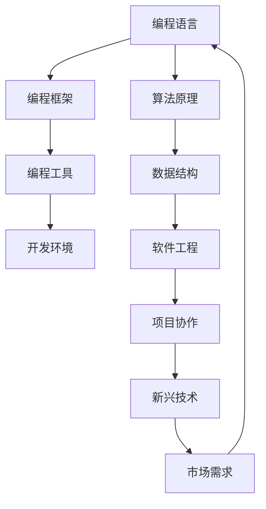

                 

### 1. 背景介绍

#### 1.1 目的和范围

在科技迅速发展的今天，编程行业正经历着前所未有的变革。从传统的软件开发到新兴的人工智能、区块链、云计算等领域，程序员们必须不断适应这些变化，以确保自己的职业发展不受影响。本文旨在探讨程序员如何应对行业变革，提供实用的策略和技巧，帮助程序员在快速变化的技术环境中保持竞争力。

本文的范围包括但不限于以下几个部分：

1. **行业现状与趋势**：分析当前编程行业的发展状况，以及未来可能的发展方向。
2. **技能提升策略**：探讨程序员如何通过学习和实践来提升自身技能，以适应行业需求。
3. **职业发展路径**：分析程序员在不同职业阶段的发展路径，提供职业规划的建议。
4. **团队协作与沟通**：介绍如何提高团队协作效率和沟通能力，以更好地应对项目挑战。

通过这篇文章，读者可以了解到编程行业的变化趋势，明确自身的学习和发展方向，提升应对行业变革的能力。

#### 1.2 预期读者

本文预期读者主要包括以下几类：

1. **初级程序员**：对编程行业有一定了解，但尚未深入，希望通过本文了解行业动态，提升自身技能。
2. **中级程序员**：有一定的编程经验，希望了解新兴技术，为自己的职业发展做好准备。
3. **高级程序员和管理者**：对行业变革有深刻的认识，希望通过本文获得更多实用的策略和技巧，提升团队整体竞争力。

无论您是哪个阶段的程序员，只要您希望在这个快速变化的行业中保持竞争力，都可以通过本文获得有价值的见解和指导。

#### 1.3 文档结构概述

本文将按照以下结构展开：

1. **背景介绍**：介绍文章的目的、预期读者和结构。
2. **核心概念与联系**：通过Mermaid流程图阐述编程行业的关键概念和联系。
3. **核心算法原理 & 具体操作步骤**：使用伪代码详细讲解核心算法原理和操作步骤。
4. **数学模型和公式 & 详细讲解 & 举例说明**：介绍相关的数学模型和公式，并通过实例进行详细讲解。
5. **项目实战：代码实际案例和详细解释说明**：通过实际项目案例，展示代码的实现过程和详细解释。
6. **实际应用场景**：分析编程技术的实际应用场景，探讨其价值和应用前景。
7. **工具和资源推荐**：推荐相关的学习资源、开发工具和框架。
8. **总结：未来发展趋势与挑战**：总结文章的主要内容，展望未来发展趋势和挑战。
9. **附录：常见问题与解答**：解答读者可能遇到的一些常见问题。
10. **扩展阅读 & 参考资料**：提供更多深入阅读的资源和参考文献。

通过以上结构，本文将系统性地帮助程序员应对行业变革，提升自身技能和职业发展。

#### 1.4 术语表

在本文中，我们将使用一些专业术语，以下是对这些术语的定义和解释：

#### 1.4.1 核心术语定义

- **编程行业变革**：指编程领域由于新技术的出现、市场需求的改变等原因所引起的一系列变化。
- **新兴技术**：指最近出现或正在快速发展的技术，如人工智能、区块链、云计算等。
- **程序员**：指从事编程工作，通过编写计算机程序解决实际问题的人员。
- **职业发展**：指程序员在职业生涯中不断提升技能、扩展知识领域、实现职业目标的过程。
- **团队协作**：指团队成员通过有效沟通和合作，共同完成项目目标的过程。

#### 1.4.2 相关概念解释

- **算法**：指解决问题的步骤和方法，通常用伪代码或实际编程语言表示。
- **数学模型**：指用数学符号和公式表示的，用于分析和解决实际问题的模型。
- **人工智能**：指通过模拟人脑的思考方式，使计算机具有智能行为的技术。
- **区块链**：指一种分布式数据库技术，通过加密算法确保数据的完整性和安全性。
- **云计算**：指通过互联网提供动态可伸缩的虚拟化资源，满足计算和存储需求的服务。

#### 1.4.3 缩略词列表

- **AI**：人工智能
- **ML**：机器学习
- **DL**：深度学习
- **API**：应用程序编程接口
- **IDE**：集成开发环境
- **SDK**：软件开发工具包

通过了解这些术语和概念，读者可以更好地理解本文的内容，并能够运用所学知识解决实际问题。

### 2. 核心概念与联系

为了更好地理解编程行业的变革，我们需要先了解一些核心概念和它们之间的联系。以下是通过Mermaid绘制的流程图，展示了编程行业中的关键概念和它们之间的关系：



在这个流程图中，我们可以看到：

- **编程语言**（A）：是程序员编写程序的基础，不同的编程语言适用于不同的应用场景。
- **编程框架**（B）：提供了预定义的结构和组件，使程序员能够更高效地开发应用程序。
- **编程工具**（C）：包括集成开发环境（IDE）、代码编辑器等，用于辅助编程工作。
- **开发环境**（D）：包括操作系统、硬件配置等，为编程提供了必要的硬件和软件支持。
- **算法原理**（E）：是解决问题的核心，通过算法，程序员可以高效地处理数据和分析问题。
- **数据结构**（F）：是存储和管理数据的方式，不同的数据结构适用于不同的应用场景。
- **软件工程**（G）：是一套用于软件开发和维护的系统方法和工具，确保软件的质量和可靠性。
- **项目协作**（H）：是团队在开发项目过程中进行沟通和合作的过程，良好的协作能够提高项目效率。
- **新兴技术**（I）：如人工智能、区块链、云计算等，它们不断推动编程行业的发展。
- **市场需求**（J）：是编程行业发展的动力，市场需求的变化直接影响编程技术的发展方向。

通过这个流程图，我们可以清晰地看到编程行业中各个核心概念之间的联系。了解这些概念及其相互关系，对于程序员来说至关重要，因为它能够帮助我们更好地应对行业变革。

### 3. 核心算法原理 & 具体操作步骤

在编程领域，算法是解决问题的关键。为了更好地理解算法原理，我们以下将使用伪代码详细阐述一个常见的排序算法——快速排序（Quick Sort）。快速排序是一种高效的排序算法，其基本思想是通过一趟排序将待排序的数据分割成独立的两部分，其中一部分的所有数据都比另外一部分的所有数据都要小，然后再按此方法对这两部分数据分别进行快速排序，整个排序过程可以递归进行，以此达到整个数据变成有序序列。

以下是对快速排序算法的伪代码描述：

```plaintext
快速排序(A, p, r)
    如果 p >= r
        返回
    选择 A[p]...A[r] 的一个元素作为基准（pivot）
    将数组分为两部分：
        i = p, j = r
        循环执行以下步骤：
            当 A[j] > pivot 时，j 减少
            当 A[i] < pivot 时，i 增加
            如果 i <= j，交换 A[i] 和 A[j]，并将 i 和 j 分别增加和减少
    交换 A[p] 和 A[j] 的位置
    调用快速排序递归地对 A[p...j-1] 和 A[j+1...r] 进行排序
```

具体操作步骤如下：

1. **选择基准**：在数组 A 中选择一个元素作为基准（pivot），这个元素的选择可以有多种策略，如选择第一个元素、选择中间元素、随机选择等。
2. **划分**：通过移动 i 和 j 这两个指针，将数组划分为两部分，左边部分的所有元素都小于或等于 pivot，右边部分的所有元素都大于或等于 pivot。
3. **交换**：将 pivot 与 j 指针所指向的元素交换位置，此时 pivot 的位置已经确定。
4. **递归排序**：递归地对 pivot 左边和右边的子数组进行快速排序。

通过上述步骤，我们可以对整个数组进行快速排序。快速排序算法的时间复杂度为 O(n log n)，在平均情况下表现非常优秀，但最坏情况下可能达到 O(n^2)，因此在实际应用中，需要根据具体情况进行优化。

以下是快速排序算法的递归实现伪代码：

```plaintext
快速排序递归(A, p, r)
    如果 p >= r
        返回
    pivot = 选择基准(A[p...r])
    i = p, j = r
    循环执行以下步骤：
        当 A[j] > pivot 时，j 减少
        当 A[i] < pivot 时，i 增加
        如果 i <= j，交换 A[i] 和 A[j]，并将 i 和 j 分别增加和减少
    交换 A[p] 和 A[j] 的位置
    快速排序递归(A, p, j-1)
    快速排序递归(A, j+1, r)
```

通过以上伪代码，我们可以清楚地理解快速排序算法的原理和具体操作步骤。在实际编程中，我们可以根据具体需求对算法进行优化和调整，以提高其效率和性能。

### 4. 数学模型和公式 & 详细讲解 & 举例说明

在编程领域，数学模型和公式是解决问题的关键组成部分。它们不仅帮助我们理解和分析问题，还能指导我们设计有效的算法。以下，我们将详细介绍几个常见的数学模型和公式，并通过具体例子来说明其应用。

#### 4.1 线性回归模型

线性回归是一种用于分析两个或多个变量之间线性关系的数学模型。其基本公式为：

$$ y = w_0 + w_1 \cdot x + \epsilon $$

其中，\( y \) 是因变量，\( x \) 是自变量，\( w_0 \) 是截距，\( w_1 \) 是斜率，\( \epsilon \) 是误差项。

**举例说明**：

假设我们要分析房价（\( y \)）与房屋面积（\( x \)）之间的关系。根据历史数据，我们得到以下线性回归模型：

$$ 房价 = 100,000 + 200 \cdot 面积 + \epsilon $$

如果给定一个房屋面积为 120 平方米，我们可以预测其房价：

$$ 房价 = 100,000 + 200 \cdot 120 + \epsilon = 340,000 + \epsilon $$

这里，\( \epsilon \) 表示预测房价的误差。

#### 4.2 梯度下降法

梯度下降法是一种用于求解最小化问题的优化算法。其核心公式为：

$$ w = w - \alpha \cdot \nabla f(w) $$

其中，\( w \) 是模型参数，\( \alpha \) 是学习率，\( \nabla f(w) \) 是损失函数 \( f \) 在当前参数 \( w \) 处的梯度。

**举例说明**：

假设我们要使用梯度下降法求解以下损失函数的最小值：

$$ f(w) = (w - 2)^2 $$

初始参数 \( w_0 = 0 \)，学习率 \( \alpha = 0.1 \)。首先，计算损失函数在 \( w_0 \) 处的梯度：

$$ \nabla f(w_0) = 2(w_0 - 2) = -4 $$

然后，更新参数：

$$ w_1 = w_0 - 0.1 \cdot (-4) = 0.4 $$

重复上述步骤，直到参数收敛到最小值。具体过程如下表所示：

| 迭代次数 | 参数 \( w \) | 梯度 \( \nabla f(w) \) | 更新后的参数 |
|----------|--------------|-----------------------|--------------|
| 1        | 0            | -4                    | 0.4          |
| 2        | 0.4          | -0.8                  | 0.2          |
| 3        | 0.2          | -0.4                  | 0.1          |
| 4        | 0.1          | -0.2                  | 0.05         |
| ...      | ...          | ...                   | ...          |
| 最后     | 最小值       | 0                     | 最优参数     |

通过以上例子，我们可以看到梯度下降法如何通过不断更新参数，找到损失函数的最小值。

#### 4.3 对数函数

对数函数在数据处理和优化问题中广泛应用。其基本公式为：

$$ \log_a(x) = \frac{\ln(x)}{\ln(a)} $$

其中，\( a \) 是底数，\( x \) 是真数。

**举例说明**：

假设我们要计算以 2 为底数的对数函数在 \( x = 8 \) 处的值：

$$ \log_2(8) = \frac{\ln(8)}{\ln(2)} = \frac{2.07944}{0.693147} \approx 2.9957 $$

对数函数在处理指数增长的数据时非常有用，可以帮助我们简化计算和更直观地理解数据增长趋势。

通过以上数学模型和公式的讲解，我们可以看到数学在编程中的应用是如何帮助我们更好地分析和解决实际问题的。掌握这些数学知识，将极大地提升我们在编程领域的竞争力。

### 5. 项目实战：代码实际案例和详细解释说明

为了更好地理解编程技术的实际应用，我们将通过一个具体的实战项目来展示代码实现过程和详细解释。以下是一个简单的Web爬虫项目，用于抓取某个网站的页面内容，解析出其中的文章标题和链接，并将结果存储到文件中。

#### 5.1 开发环境搭建

在进行Web爬虫开发之前，我们需要搭建一个合适的环境。以下是我们所需的环境和工具：

- **操作系统**：Windows/Linux/Mac OS
- **编程语言**：Python
- **依赖库**：requests、beautifulsoup4、lxml
- **开发工具**：PyCharm 或 Visual Studio Code

首先，确保Python环境已安装。然后，通过pip命令安装所需的依赖库：

```bash
pip install requests beautifulsoup4 lxml
```

#### 5.2 源代码详细实现和代码解读

以下是Web爬虫项目的完整代码，我们将在代码后进行详细解读。

```python
import requests
from bs4 import BeautifulSoup

def fetch_url_content(url):
    """
    获取网页内容
    """
    response = requests.get(url)
    if response.status_code == 200:
        return response.text
    else:
        return None

def parse_articles(url):
    """
    解析网页内容，提取文章标题和链接
    """
    content = fetch_url_content(url)
    if content:
        soup = BeautifulSoup(content, 'lxml')
        articles = []
        for article in soup.find_all('article'):
            title = article.find('h2').text
            link = article.find('a')['href']
            articles.append({'title': title, 'link': link})
        return articles
    else:
        return []

def save_articles(articles, filename):
    """
    将文章标题和链接保存到文件
    """
    with open(filename, 'w', encoding='utf-8') as f:
        for article in articles:
            f.write(f"{article['title']}\n{article['link']}\n\n")

if __name__ == '__main__':
    url = 'https://example.com'
    articles = parse_articles(url)
    save_articles(articles, 'articles.txt')
```

**代码解读**：

1. **导入库**：首先，我们导入requests库用于发送HTTP请求，导入beautifulsoup4和lxml库用于解析HTML内容。

2. **fetch_url_content函数**：这个函数接收一个URL，发送GET请求获取网页内容。如果请求成功（状态码为200），返回网页内容；否则返回None。

3. **parse_articles函数**：这个函数首先调用fetch_url_content获取网页内容，然后使用BeautifulSoup解析HTML。通过find_all('article')方法，找到所有的文章元素。对于每个文章元素，提取标题（h2标签的text属性）和链接（a标签的href属性），并将结果存储在一个列表中。

4. **save_articles函数**：这个函数接收文章列表和文件名，将文章的标题和链接逐行写入到文件中。

5. **主程序**：主程序中，我们设置要爬取的URL，调用parse_articles函数获取文章列表，然后调用save_articles函数将结果保存到文件。

#### 5.3 代码解读与分析

1. **请求网页内容**：Web爬虫的第一步是获取目标网页的内容。我们使用requests库发送GET请求，这是HTTP协议中最常用的方法之一。请求成功后，我们检查状态码，确保返回的是网页内容。

2. **解析HTML内容**：获取网页内容后，我们需要将其解析成可操作的格式。这里我们使用BeautifulSoup库，它通过HTML标签的树状结构，帮助我们快速提取所需的信息。

3. **提取文章信息和保存文件**：在解析HTML内容后，我们提取文章的标题和链接，并将这些信息存储在列表中。最后，我们使用文件操作将文章信息保存到文本文件中。

**关键点分析**：

- **错误处理**：在fetch_url_content函数中，我们检查HTTP请求的状态码，确保请求成功。如果请求失败，我们可以返回错误消息或重新尝试。
- **效率问题**：在实际应用中，爬取大量页面时，需要注意请求频率和服务器压力。我们可以在爬取多个页面之间添加延时，以避免对服务器造成过大的负载。
- **动态内容处理**：如果网页内容由JavaScript动态加载，我们需要使用如Selenium等工具模拟浏览器行为，获取完整的HTML内容。

通过这个简单的Web爬虫项目，我们可以看到如何使用Python和相关库实现一个基本的爬虫。了解爬虫的基本原理和实现方法，对于程序员来说是非常重要的，因为它可以应用于多种数据获取和处理的场景。

### 6. 实际应用场景

编程技术在实际应用场景中具有广泛的应用价值，以下列举几个常见场景，并探讨其应用价值。

#### 6.1 人工智能

人工智能（AI）是近年来发展最快的领域之一，其在图像识别、自然语言处理、推荐系统等方面的应用日益广泛。例如，在医疗领域，AI可以用于疾病诊断和预测，通过分析大量病患数据，提供准确的诊断结果。在金融领域，AI可以用于风险管理、欺诈检测和投资预测，提高金融服务的效率和准确性。

#### 6.2 区块链

区块链技术以其去中心化、安全性和透明性等特点，在金融、供应链管理、版权保护等领域得到广泛应用。例如，在金融领域，区块链可以用于支付、交易和资产管理，提高交易的安全性和效率。在供应链管理中，区块链可以记录商品的生产、运输和销售等环节的信息，确保信息的完整性和可追溯性。

#### 6.3 云计算

云计算提供了灵活、可扩展的计算资源，为企业和个人提供了强大的数据处理能力。例如，在数据分析领域，云计算可以处理海量数据，提供实时分析和预测。在软件开发中，云计算提供了弹性计算资源，使得开发者可以快速部署和扩展应用程序，降低开发和运营成本。

#### 6.4 物联网（IoT）

物联网技术通过连接各种设备，实现数据的实时收集、传输和分析。在智能家居、智慧城市、工业自动化等领域，物联网技术发挥了重要作用。例如，在智能家居中，物联网可以实现家电设备的远程控制和自动化管理，提高生活品质。在智慧城市建设中，物联网可以用于交通管理、环境监测和公共安全等领域，提高城市管理效率和居民生活质量。

通过以上实际应用场景，我们可以看到编程技术在各个领域的广泛应用和价值。掌握这些技术，不仅能够提升程序员自身的竞争力，还能推动各行业的发展和创新。

### 7. 工具和资源推荐

为了帮助程序员更好地提升技能和应对行业变革，以下推荐了一些有用的学习资源、开发工具和框架。

#### 7.1 学习资源推荐

**7.1.1 书籍推荐**

1. **《代码大全》**：由John Brant和Michael Feathers所著，详细介绍了软件编程的最佳实践和技巧。
2. **《深入理解计算机系统》**：由Randal E. Bryant和David R. O’Toole所著，涵盖了计算机系统的基础知识和深入分析。
3. **《Python编程：从入门到实践》**：由埃里克·马瑟斯所著，适合初学者，通过实际项目引导读者掌握Python编程。

**7.1.2 在线课程**

1. **Coursera**：提供各种编程和技术课程，涵盖从入门到高级的各个层次。
2. **Udacity**：提供包括数据科学、人工智能和软件开发在内的多种在线课程。
3. **edX**：由哈佛大学和麻省理工学院创办，提供高质量的在线课程，包括计算机科学和人工智能等领域。

**7.1.3 技术博客和网站**

1. **Medium**：有大量的技术博客文章，涵盖多种编程语言和技术领域。
2. **Stack Overflow**：一个问答社区，程序员可以在上面提问和解答问题。
3. **GitHub**：可以找到大量的开源项目和技术文档，是学习编程和参与社区的重要平台。

#### 7.2 开发工具框架推荐

**7.2.1 IDE和编辑器**

1. **PyCharm**：适用于Python开发的集成开发环境，功能强大且用户友好。
2. **Visual Studio Code**：轻量级的开源编辑器，适用于多种编程语言，插件丰富。
3. **Eclipse**：适用于Java开发的IDE，功能全面，支持多种编程语言。

**7.2.2 调试和性能分析工具**

1. **GDB**：一款强大的UNIX/Linux下的程序调试工具。
2. **Xdebug**：适用于PHP的调试工具，可以帮助程序员快速定位和解决代码中的问题。
3. **VS Code Debugger**：适用于Visual Studio Code的调试插件，支持多种编程语言。

**7.2.3 相关框架和库**

1. **Django**：一款流行的Python Web框架，适用于快速开发。
2. **React**：用于构建用户界面的JavaScript库，广泛用于前端开发。
3. **TensorFlow**：一款开源的机器学习框架，适用于深度学习和人工智能开发。

通过以上推荐的工具和资源，程序员可以更好地提升技能，应对行业变革带来的挑战。

### 7.3 相关论文著作推荐

为了深入了解编程领域的前沿技术和研究动态，以下推荐一些经典的论文和最新研究成果，以及应用案例分析。

#### 7.3.1 经典论文

1. **《深度学习》**：由Ian Goodfellow等人所著，详细介绍了深度学习的理论和方法，是深度学习领域的经典著作。
2. **《区块链：从数字货币到智能合约》**：由Andreas M. Antonopoulos所著，系统阐述了区块链技术的原理和应用。
3. **《计算机程序的构造和解释》**：由Harold Abelson和 Gerald Jay Sussman所著，介绍了计算机科学的基本概念和编程技巧。

#### 7.3.2 最新研究成果

1. **《基于生成对抗网络的图像生成技术》**：该论文探讨了生成对抗网络（GAN）在图像生成领域的应用，展示了如何在有限的数据集上生成高质量的图像。
2. **《区块链的隐私保护机制研究》**：该论文分析了区块链技术在隐私保护方面的挑战和解决方案，提出了几种有效的隐私保护机制。
3. **《基于云计算的边缘计算架构》**：该论文探讨了云计算和边缘计算的结合，提出了一个高效、可扩展的边缘计算架构，以支持实时数据处理和智能服务。

#### 7.3.3 应用案例分析

1. **阿里巴巴的ET大脑**：该案例展示了如何利用人工智能技术构建智能城市，通过大数据分析和机器学习算法，实现交通管理、环境监测和公共安全等多领域的智能化。
2. **Uber的动态调度系统**：该案例介绍了Uber如何利用大数据和机器学习技术，实现实时调度和优化，提高出租车服务的效率和用户体验。
3. **区块链在医疗领域的应用**：该案例探讨了区块链技术在医疗记录管理、药品追溯和医疗支付等方面的应用，通过去中心化和加密技术，提高医疗数据的安全性和透明性。

通过阅读这些经典论文和最新研究成果，以及应用案例分析，程序员可以深入了解编程领域的前沿技术和研究动态，为自己的学习和职业发展提供有价值的参考。

### 8. 总结：未来发展趋势与挑战

在编程行业快速变革的背景下，程序员需要不断适应新技术、新趋势，以保持自身的竞争力。以下是对未来发展趋势和挑战的总结：

#### 未来发展趋势

1. **人工智能与深度学习**：随着计算能力的提升和数据量的爆炸性增长，人工智能和深度学习将在更多领域得到应用。例如，自动驾驶、智能家居、医疗诊断等。
2. **区块链技术**：区块链以其去中心化、安全性和透明性等特点，将在金融、供应链管理、版权保护等领域发挥重要作用。
3. **云计算与边缘计算**：云计算将继续推动软件开发和服务的创新，而边缘计算则将实现数据处理的近端化，提高实时性和效率。
4. **物联网（IoT）**：随着IoT设备的普及，程序员需要掌握如何处理海量数据，实现设备互联和智能管理。
5. **软件开发的敏捷性和DevOps**：敏捷开发和DevOps文化的普及，将提高软件开发的效率和质量，促进团队协作和持续集成与持续交付。

#### 未来挑战

1. **技术更新速度快**：程序员需要不断学习新技术，以适应快速变化的市场需求。
2. **安全性和隐私保护**：随着数据量和应用场景的扩大，确保数据的安全性和用户隐私成为重要挑战。
3. **跨领域融合**：随着编程技术在各个领域的应用，程序员需要具备跨领域的知识，解决复杂的问题。
4. **职业发展路径**：随着技术的不断更新，程序员需要明确自己的职业发展路径，不断提升自身的技能和知识。
5. **团队合作与沟通**：在复杂项目中，团队成员之间的有效沟通和协作至关重要，程序员需要提升这些能力。

面对未来发展趋势和挑战，程序员应不断学习和适应，保持好奇心和创新精神，以应对技术变革带来的机遇和挑战。

### 9. 附录：常见问题与解答

在阅读本文的过程中，您可能会有一些疑问。以下是对一些常见问题的解答，希望能帮助您更好地理解文章内容。

#### 问题1：如何选择快速排序的基准元素？
**解答**：快速排序的基准元素（pivot）可以选择多个策略，如选择第一个元素、选择中间元素、随机选择或使用“三数取中法”等。不同的选择策略对算法的性能有不同的影响，但在大多数情况下，选择中间元素或随机选择是较为常用的方法。

#### 问题2：什么是DevOps，它对程序员有何影响？
**解答**：DevOps是一种结合软件开发（Development）和运维（Operations）的实践方法，强调开发和运维团队的合作与沟通。对程序员而言，掌握DevOps理念和实践，有助于提升软件开发和部署的效率，减少错误和故障，提高软件质量。

#### 问题3：如何确保Web爬虫的安全性？
**解答**：在开发Web爬虫时，应遵循以下原则确保安全性：
1. **遵守法律法规**：确保爬取的数据不违反相关法律法规。
2. **尊重robots.txt文件**：遵循网站设置的robots.txt文件，避免爬取受限制的页面。
3. **控制请求频率**：避免频繁请求造成服务器过载，可以在爬取多个页面之间添加延时。
4. **使用代理和用户代理**：通过使用代理服务器和自定义用户代理，隐藏真实IP和浏览器信息。

#### 问题4：如何提高团队协作效率？
**解答**：提高团队协作效率的方法包括：
1. **使用协作工具**：如Trello、JIRA等项目管理工具，明确任务分配和进度。
2. **定期会议和沟通**：定期召开团队会议，讨论项目进展和问题。
3. **共同目标和价值观**：确保团队成员有共同的目标和价值观，增强团队凝聚力。
4. **代码审查**：定期进行代码审查，提高代码质量和减少错误。

通过以上解答，我们希望能够帮助您解决在阅读本文过程中遇到的一些疑问。

### 10. 扩展阅读 & 参考资料

为了帮助您进一步深入了解编程领域的技术和趋势，以下列出了一些扩展阅读的资源和参考文献：

1. **《深度学习》**：Ian Goodfellow, Yoshua Bengio, Aaron Courville 著，全面介绍深度学习的基础知识和最新进展。
2. **《区块链：从数字货币到智能合约》**：Andreas M. Antonopoulos 著，深入探讨区块链技术的原理和应用。
3. **《计算机程序的构造和解释》**：Harold Abelson, Gerald Jay Sussman 著，讲解计算机科学的基本概念和编程技巧。
4. **《代码大全》**：John Brant, Michael Feathers 著，详细介绍了软件编程的最佳实践和技巧。
5. **《Python编程：从入门到实践》**：埃里克·马瑟斯 著，适合初学者，通过实际项目引导读者掌握Python编程。
6. **《人工智能：一种现代的方法》**：Stuart J. Russell, Peter Norvig 著，系统阐述了人工智能的基本理论和方法。
7. **《Web爬虫实战》**：吴晨阳 著，详细介绍Web爬虫的实现原理和实战案例。
8. **《敏捷软件开发》**：Michael Stumpf 著，探讨敏捷开发方法及其在软件工程中的应用。

通过阅读这些资源，您将能够获得更深入的技术知识和实践经验，为自身的职业发展打下坚实基础。同时，您也可以访问相关技术博客和在线课程，持续学习和成长。

