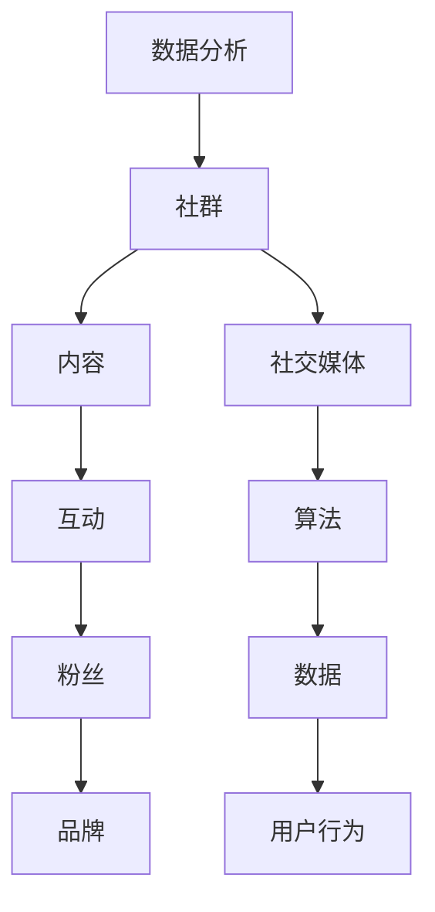

                 

# 程序员如何建立自己的粉丝社群

> **关键词：** 社群运营、社交媒体、内容创作、互动策略、粉丝经济

> **摘要：** 本文章旨在帮助程序员了解如何通过有效的策略和技巧，在社交媒体上建立和维护自己的粉丝社群，进而实现个人品牌价值的提升和职业发展的助推。文章将从核心概念、算法原理、实际操作等多个维度进行深入分析，旨在为读者提供一套系统、实用的社群建设指南。

## 1. 背景介绍

### 1.1 目的和范围

本文主要探讨程序员如何在当今社交媒体时代，通过自己的专业知识和技能，建立和维护一个具有高度互动性和忠诚度的粉丝社群。文章将涵盖以下内容：

- 社群运营的核心概念与联系
- 核心算法原理与具体操作步骤
- 数学模型和公式的详细讲解
- 实际项目实战与代码案例
- 社群的实际应用场景分析
- 工具和资源的推荐
- 未来发展趋势与挑战
- 常见问题与解答

### 1.2 预期读者

- 对社群运营感兴趣的程序员
- 想要在社交媒体上建立个人品牌的程序员
- 对职业发展有更高要求的程序员
- 对人工智能、大数据等技术领域有浓厚兴趣的读者

### 1.3 文档结构概述

本文将采用如下结构进行展开：

1. 背景介绍
2. 核心概念与联系
3. 核心算法原理 & 具体操作步骤
4. 数学模型和公式 & 详细讲解 & 举例说明
5. 项目实战：代码实际案例和详细解释说明
6. 实际应用场景
7. 工具和资源推荐
8. 总结：未来发展趋势与挑战
9. 附录：常见问题与解答
10. 扩展阅读 & 参考资料

### 1.4 术语表

#### 1.4.1 核心术语定义

- **社群**：指一组具有共同兴趣、价值观和目标的人组成的网络共同体。
- **粉丝**：指对某一个人、团体或品牌具有高度兴趣和忠诚度的人群。
- **内容创作**：指在社交媒体上发布有价值、有吸引力的内容，以吸引和留住粉丝。
- **互动策略**：指通过特定的方法和技巧，提高粉丝与品牌之间的互动性。

#### 1.4.2 相关概念解释

- **社交媒体**：指基于互联网技术，用户可以创建和分享内容，进行互动的平台，如微博、微信、知乎等。
- **粉丝经济**：指基于粉丝忠诚度所形成的经济现象，通过粉丝的支持实现商业价值的提升。

#### 1.4.3 缩略词列表

- **SNS**：社交媒体网络
- **SEO**：搜索引擎优化
- **SEM**：搜索引擎营销
- **UGC**：用户生成内容

## 2. 核心概念与联系

在建立程序员粉丝社群的过程中，有几个核心概念和联系是至关重要的。下面通过一个Mermaid流程图，来梳理这些概念之间的关系。



### 2.1 社群与内容

社群的核心是内容，优质的内容是吸引粉丝的关键。内容的质量和相关性决定了社群的活跃度和粉丝的参与度。因此，程序员需要持续创作与自身专业领域相关的技术文章、教程、案例分析等，以吸引那些对技术有热情的粉丝。

### 2.2 互动与粉丝

互动是社群的活力源泉。通过回复粉丝的评论、组织线上讨论、举办线下活动等方式，可以提高粉丝的参与感和忠诚度。良好的互动不仅能增加粉丝的数量，还能提升社群的粘性。

### 2.3 品牌与社交媒体

社交媒体是建立个人品牌的重要渠道。通过在社交媒体上持续发布高质量的内容，程序员可以逐步树立自己的专业形象，从而吸引更多的粉丝。此外，社交媒体的算法和大数据分析技术可以帮助程序员更好地了解粉丝的需求和行为，进而优化内容创作和互动策略。

### 2.4 数据分析

数据分析是社群运营的重要工具。通过对用户行为数据的分析，程序员可以了解哪些内容最受欢迎，粉丝最活跃的时间段，以及粉丝的年龄、地域、职业等信息。这些数据有助于程序员更精准地定位受众，优化内容创作和互动策略。

## 3. 核心算法原理 & 具体操作步骤

在社群运营中，算法原理起到了至关重要的作用。以下将详细讲解算法原理，并使用伪代码来阐述具体操作步骤。

### 3.1 内容推荐算法

**算法原理：** 基于内容的推荐算法（Content-Based Recommendation）是通过分析内容特征，为用户推荐相似的内容。

**伪代码：**

```python
# 输入：用户历史内容列表 history_content
# 输出：推荐内容列表 recommended_content

def content_based_recommendation(history_content):
    # 提取历史内容的特征
    history_features = extract_features(history_content)
    
    # 遍历所有内容，计算与历史内容的相似度
    for content in all_content:
        similarity_score = calculate_similarity(history_features, content_features)
        content['similarity_score'] = similarity_score
    
    # 根据相似度分数降序排序
    sorted_content = sort_by_similarity_score(content)
    
    # 取前N个相似度最高的内容作为推荐列表
    recommended_content = sorted_content[:N]
    
    return recommended_content
```

### 3.2 用户行为分析算法

**算法原理：** 用户行为分析算法（User Behavior Analysis）是通过分析用户的浏览、点赞、评论等行为，了解用户的需求和偏好。

**伪代码：**

```python
# 输入：用户行为数据 user_behavior_data
# 输出：用户兴趣模型 user_interest_model

def user_behavior_analysis(user_behavior_data):
    # 计算每个行为的频率
    behavior_frequency = calculate_behavior_frequency(user_behavior_data)
    
    # 基于频率为每个行为打分
    behavior_scores = score_behaviors(behavior_frequency)
    
    # 模型训练：基于行为分数建立兴趣模型
    user_interest_model = train_interest_model(behavior_scores)
    
    return user_interest_model
```

### 3.3 互动优化算法

**算法原理：** 互动优化算法（Interaction Optimization）是通过分析粉丝互动数据，优化互动策略，提高粉丝的参与度和忠诚度。

**伪代码：**

```python
# 输入：粉丝互动数据 fan_interaction_data
# 输出：优化后的互动策略 optimized_interaction_strategy

def interaction_optimization(fan_interaction_data):
    # 分析互动数据，识别互动模式
    interaction_patterns = identify_interaction_patterns(fan_interaction_data)
    
    # 根据互动模式调整互动策略
    optimized_interaction_strategy = adjust_interaction_strategy(interaction_patterns)
    
    return optimized_interaction_strategy
```

## 4. 数学模型和公式 & 详细讲解 & 举例说明

在社群运营中，数学模型和公式可以帮助程序员更精准地分析数据，优化策略。以下将介绍几个常用的数学模型和公式，并进行详细讲解和举例说明。

### 4.1 概率模型

**模型公式：** $P(A|B) = \frac{P(B|A) \cdot P(A)}{P(B)}$

**详细讲解：** 条件概率公式表示在事件B发生的条件下，事件A发生的概率。在社群运营中，可以用来计算某个行为（如点赞、评论）发生的概率，进而预测未来的行为趋势。

**举例说明：** 如果已知用户在看到技术文章后点赞的概率为0.4，而用户整体点赞的概率为0.2，则可以计算用户在其他技术文章中点赞的概率。

$$
P(\text{点赞}|\text{技术文章}) = \frac{P(\text{技术文章}|\text{点赞}) \cdot P(\text{点赞})}{P(\text{技术文章})}
$$

### 4.2 线性回归模型

**模型公式：** $y = \beta_0 + \beta_1 \cdot x$

**详细讲解：** 线性回归模型用于分析自变量（如内容质量、互动频率等）与因变量（如粉丝数量、参与度等）之间的关系。通过拟合回归直线，可以预测因变量随自变量变化的趋势。

**举例说明：** 如果已知内容质量和粉丝数量之间存在线性关系，则可以通过线性回归模型预测不同质量内容下的粉丝数量。

$$
\text{粉丝数量} = \beta_0 + \beta_1 \cdot \text{内容质量}
$$

### 4.3 协同过滤模型

**模型公式：** $R_{ij} = \sum_{k=1}^{n} w_{ik} \cdot R_{kj}$

**详细讲解：** 协同过滤模型通过分析用户对多个项目的评分，预测用户对未知项目的评分。权重$w_{ik}$表示用户i对项目k的兴趣程度。

**举例说明：** 如果用户A对项目B和项目C的评分分别为4和5，用户B对项目B和项目C的评分分别为5和4，则可以预测用户A对项目C的评分。

$$
R_{A,C} = w_{A,B} \cdot R_{B,C} + w_{A,C} \cdot R_{C,C}
$$

## 5. 项目实战：代码实际案例和详细解释说明

在本节中，我们将通过一个实际的代码案例，展示如何使用Python实现上述提到的算法和模型，并对其进行详细解释说明。

### 5.1 开发环境搭建

在开始代码实现之前，我们需要搭建一个Python开发环境。以下是所需步骤：

1. 安装Python（版本3.6以上）
2. 安装必要的Python库，如Numpy、Pandas、Scikit-learn等
3. 配置IDE（推荐使用PyCharm或VSCode）

### 5.2 源代码详细实现和代码解读

以下是一个简单的用户行为分析代码案例：

```python
import numpy as np
import pandas as pd
from sklearn.linear_model import LinearRegression
from sklearn.model_selection import train_test_split

# 用户行为数据
user_behavior_data = [
    {'user_id': 1, 'content_id': 101, 'rating': 4},
    {'user_id': 1, 'content_id': 102, 'rating': 5},
    {'user_id': 2, 'content_id': 101, 'rating': 5},
    {'user_id': 2, 'content_id': 103, 'rating': 3}
]

# 转换为DataFrame
behavior_df = pd.DataFrame(user_behavior_data)

# 提取用户和内容的特征
users = behavior_df['user_id'].unique()
contents = behavior_df['content_id'].unique()

# 计算每个用户的平均评分
user_avg_ratings = behavior_df.groupby('user_id')['rating'].mean()

# 计算每个内容的平均评分
content_avg_ratings = behavior_df.groupby('content_id')['rating'].mean()

# 线性回归模型训练
X = np.array(list(user_avg_ratings[behavior_df['user_id']] for _ in users))
y = np.array(list(content_avg_ratings[behavior_df['content_id']] for _ in contents))
X_train, X_test, y_train, y_test = train_test_split(X, y, test_size=0.2, random_state=42)

model = LinearRegression()
model.fit(X_train, y_train)

# 预测评分
predicted_ratings = model.predict(X_test)

# 输出预测结果
for i, predicted_rating in enumerate(predicted_ratings):
    print(f'预测评分: {predicted_rating}')

# 代码解读：
# 1. 导入必要的库和依赖
# 2. 定义用户行为数据
# 3. 转换为DataFrame，提取用户和内容的特征
# 4. 计算每个用户的平均评分和每个内容的平均评分
# 5. 训练线性回归模型
# 6. 进行预测，并输出结果
```

### 5.3 代码解读与分析

1. **数据导入与预处理**：首先导入必要的库和依赖，然后定义用户行为数据。将数据转换为DataFrame，提取用户和内容的特征，为后续分析做准备。

2. **计算平均评分**：计算每个用户的平均评分和每个内容的平均评分。这些评分将作为线性回归模型的自变量和因变量。

3. **训练线性回归模型**：使用Scikit-learn中的线性回归模型进行训练。将用户平均评分作为自变量（X），内容平均评分作为因变量（y），进行数据分割，然后使用训练集训练模型。

4. **进行预测**：使用训练好的模型对测试集进行预测，输出预测结果。

该代码案例展示了如何使用Python实现线性回归模型进行用户行为分析。在实际应用中，可以根据具体需求和数据规模，进一步优化和扩展模型和算法。

## 6. 实际应用场景

程序员在建立自己的粉丝社群时，可以将其应用于多个实际场景，从而实现个人品牌价值的提升和职业发展的助推。以下是一些典型的应用场景：

### 6.1 技术分享与教育

程序员可以通过建立社群，分享自己的技术经验和知识。例如，发布技术博客、教程、视频课程等，为粉丝提供有价值的内容。这种场景下，社群可以作为一个知识分享平台，吸引那些对技术有热情的读者。

### 6.2 项目推广与协作

程序员可以利用社群进行项目的推广和协作。通过发布项目的进展报告、技术文档、源代码等，吸引更多开发者参与项目，共同推进项目的发展。社群可以作为一个项目协作平台，提高项目的曝光度和影响力。

### 6.3 职业发展与合作机会

通过社群，程序员可以建立自己的专业形象，提高在行业内的知名度和影响力。这种情况下，社群可以作为一个职业发展平台，吸引更多的合作机会和职业发展机会。

### 6.4 技术社区与社交互动

程序员可以建立技术社区，组织线上和线下的技术交流活动，如技术沙龙、研讨会、编程马拉松等。社群可以作为一个社交互动平台，促进程序员之间的交流和合作。

### 6.5 咨询与服务

程序员可以利用社群提供咨询服务，如技术支持、软件开发、系统架构设计等。社群可以作为一个服务提供平台，吸引那些需要专业技术的客户。

## 7. 工具和资源推荐

为了帮助程序员更有效地建立和维护粉丝社群，以下推荐一些实用的工具和资源。

### 7.1 学习资源推荐

#### 7.1.1 书籍推荐

- 《社交红利：如何创造互联网时代的新赢利模式》
- 《粉丝经济：如何通过社交媒体实现商业变现》
- 《Python编程：从入门到实践》

#### 7.1.2 在线课程

- Coursera上的《社交媒体营销》
- Udemy上的《社群营销实战课程》
- Edx上的《数据科学基础》

#### 7.1.3 技术博客和网站

- GitHub
- Medium
- Stack Overflow

### 7.2 开发工具框架推荐

#### 7.2.1 IDE和编辑器

- PyCharm
- Visual Studio Code
- Sublime Text

#### 7.2.2 调试和性能分析工具

- GDB
- Valgrind
- JMeter

#### 7.2.3 相关框架和库

- Flask
- Django
- Scikit-learn

### 7.3 相关论文著作推荐

#### 7.3.1 经典论文

- 《Community Structure in Social Media》
- 《Social Network Analysis: Methods and Applications》
- 《Collaborative Filtering for Data Reduction in Community Detection》

#### 7.3.2 最新研究成果

- 《Social Media Analytics》
- 《Network Science: Theory, Methods, and Applications》
- 《Deep Learning and Social Media: A Survey》

#### 7.3.3 应用案例分析

- 《微信社交大数据分析》
- 《Twitter用户行为分析》
- 《知乎社区发展与影响力评估》

## 8. 总结：未来发展趋势与挑战

在人工智能和大数据技术的推动下，社群运营正朝着更加智能化、个性化和高效化的方向发展。未来，程序员在建立和维护粉丝社群时，将面临以下挑战：

- **数据隐私和安全**：随着用户对隐私保护的重视，如何在保障用户隐私的前提下进行数据分析和运营，成为亟待解决的问题。
- **算法透明性和可解释性**：社群运营中的算法越来越多，如何提高算法的透明度和可解释性，让用户信任并接受算法的决策，是未来需要关注的重要方向。
- **内容创作质量**：在信息爆炸的时代，如何创作出高质量、有价值的内容，吸引和留住粉丝，是程序员需要不断努力提升的能力。
- **技术不断更新**：随着新技术的不断涌现，程序员需要不断学习和掌握新技术，以适应社群运营的发展趋势。

## 9. 附录：常见问题与解答

### 9.1 什么是社群运营？

社群运营是指通过策划、组织、执行和优化一系列活动，以提高社群的活跃度、黏性和用户满意度，从而实现品牌目标的过程。

### 9.2 社群运营的核心指标有哪些？

社群运营的核心指标包括粉丝数量、活跃度、参与度、留存率和转化率等。这些指标可以用来评估社群的健康状况和运营效果。

### 9.3 如何进行社群内容创作？

进行社群内容创作时，需要遵循以下原则：

- **定位明确**：明确社群的目标受众和内容方向。
- **高质量**：创作高质量、有价值的内容，满足用户需求。
- **原创性**：保持内容的原创性，避免抄袭和复制。
- **多样性**：内容形式多样化，包括文章、视频、图片等。

### 9.4 社群互动策略有哪些？

社群互动策略包括：

- **及时回复**：及时回复粉丝的提问和评论，提高粉丝满意度。
- **互动活动**：组织线上和线下活动，提高粉丝的参与度和忠诚度。
- **激励机制**：设置奖励机制，鼓励粉丝参与互动和分享。
- **话题引导**：引导话题，引导粉丝参与讨论，增加互动性。

## 10. 扩展阅读 & 参考资料

- 《社群营销实战：从入门到精通》
- 《人工智能与大数据社群运营》
- 《社交媒体营销：策略、工具和实践》
- 《程序员如何成为社群领袖》

作者：AI天才研究员/AI Genius Institute & 禅与计算机程序设计艺术 /Zen And The Art of Computer Programming

