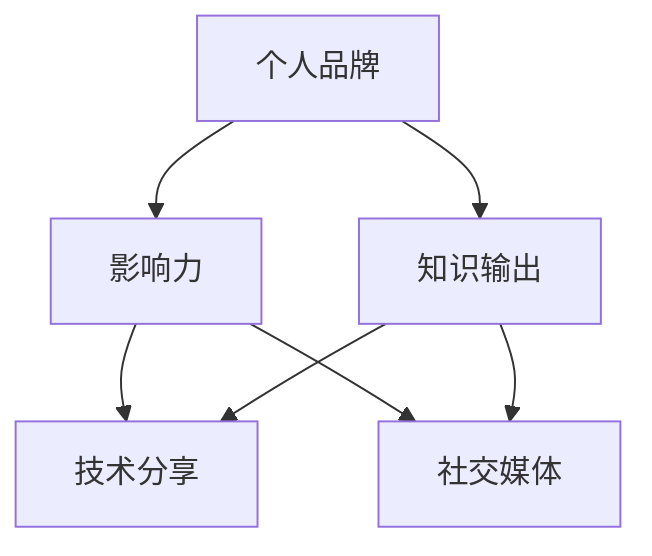

                 


# 程序员如何打造个人影响力

> **关键词：** 个人品牌建设，影响力，技术分享，社交媒体，知识输出
> 
> **摘要：** 本文将探讨程序员如何通过构建个人品牌、分享技术和经验，利用社交媒体和社区平台，以及持续学习和创新，来提升个人影响力。我们将逐步分析每一个步骤，提供具体的策略和实际操作案例，帮助程序员在技术领域脱颖而出。

## 1. 背景介绍

### 1.1 目的和范围

本文旨在为程序员提供一套系统性的方法，帮助他们打造个人影响力。我们将讨论以下内容：

- 个人品牌建设的重要性
- 如何通过分享知识和经验来建立个人影响力
- 利用社交媒体和社区平台扩展影响力
- 持续学习和创新的必要性

### 1.2 预期读者

本文适合以下读者：

- 初级和中级程序员，希望提升自己在技术领域的影响力
- 技术专家，希望进一步扩大自己的影响力
- 管理者或招聘人员，对技术人才的个人品牌建设感兴趣

### 1.3 文档结构概述

本文结构如下：

- 第1章：背景介绍，包括目的、范围和预期读者
- 第2章：核心概念与联系
- 第3章：核心算法原理 & 具体操作步骤
- 第4章：数学模型和公式 & 详细讲解 & 举例说明
- 第5章：项目实战：代码实际案例和详细解释说明
- 第6章：实际应用场景
- 第7章：工具和资源推荐
- 第8章：总结：未来发展趋势与挑战
- 第9章：附录：常见问题与解答
- 第10章：扩展阅读 & 参考资料

### 1.4 术语表

#### 1.4.1 核心术语定义

- 个人品牌：个人在专业领域中的形象和声誉。
- 影响力：个人或品牌在社会中所具有的引导和改变他人想法和行为的能力。
- 技术分享：分享个人在技术领域中的知识和经验。
- 社交媒体：用于社交互动和内容分享的网络平台。

#### 1.4.2 相关概念解释

- 内容输出：创建和发布有价值和有教育意义的内容。
- 社区平台：程序员聚集和交流的在线平台，如GitHub、Stack Overflow等。
- 知识输出：分享知识和经验的过程，包括撰写博客、发表演讲等。

#### 1.4.3 缩略词列表

- SEO：搜索引擎优化（Search Engine Optimization）
- 社交媒体（Social Media）
- 个人品牌（Personal Brand）

## 2. 核心概念与联系

在构建个人影响力之前，我们需要理解一些核心概念和它们之间的联系。以下是一个简化的Mermaid流程图，展示了这些概念之间的关系：



### 2.1 个人品牌

个人品牌是指个人在专业领域中的形象和声誉。一个强大的个人品牌能够帮助程序员在竞争激烈的技术市场中脱颖而出。要构建个人品牌，程序员需要：

- 确定专业领域和目标受众。
- 建立独特的个人形象和风格。
- 通过持续的内容输出和知识分享来巩固个人品牌。

### 2.2 影响力

影响力是指个人或品牌在社交网络中的引导和改变他人想法和行为的能力。对于程序员来说，影响力可以帮助他们获得更多的机会，如招聘、项目合作、演讲邀请等。要提升个人影响力，程序员可以：

- 在社交媒体上积极互动和分享。
- 参与社区讨论，提供有价值的见解和解决方案。
- 通过撰写博客、发表演讲等方式传播知识和经验。

### 2.3 知识输出

知识输出是建立个人品牌和影响力的重要途径。程序员可以通过以下方式输出知识：

- 撰写技术博客，分享编程技巧和项目经验。
- 制作教程视频，演示代码实现过程。
- 参与开源项目，贡献代码和文档。

### 2.4 技术分享

技术分享是程序员展现自己专业能力的重要方式。通过分享技术知识和经验，程序员可以：

- 帮助他人解决问题，提升自己的技术深度。
- 扩大自己的影响范围，吸引更多的关注。
- 建立自己的专业声誉。

### 2.5 社交媒体

社交媒体是程序员建立个人品牌和影响力的关键平台。以下是一些流行的社交媒体平台，程序员可以利用它们来提升个人影响力：

- **Twitter**：用于分享实时动态和观点。
- **LinkedIn**：专业社交网络，适合职业发展和人脉拓展。
- **GitHub**：展示代码项目和参与开源项目的平台。
- **Stack Overflow**：程序员交流和学习的技术问答社区。

## 3. 核心算法原理 & 具体操作步骤

构建个人影响力并不是一蹴而就的过程，而是一个系统的、持续努力的结果。以下是构建个人影响力的核心算法原理和具体操作步骤：

### 3.1 算法原理

构建个人影响力可以看作是一个多阶段的过程，包括以下几个方面：

1. **定位与目标受众确定**：明确自己在技术领域的定位和目标受众。
2. **内容创建与输出**：通过高质量的博客文章、教程视频、演讲等方式，输出有价值的知识内容。
3. **社交媒体运营**：利用社交媒体平台，扩大影响力，建立与受众的互动。
4. **社区参与与贡献**：积极参与开源项目和技术社区，分享经验和见解。
5. **持续学习和创新**：保持技术知识和技能的更新，不断创新。

### 3.2 具体操作步骤

1. **定位与目标受众确定**

   - **自我评估**：了解自己的技能和兴趣，确定自己在技术领域中的定位。
   - **市场调研**：分析当前技术趋势和市场需求，确定目标受众。
   - **制定计划**：根据定位和目标受众，制定长期和短期的个人影响力建设计划。

2. **内容创建与输出**

   - **知识梳理**：系统整理自己的知识和经验，形成有结构的内容。
   - **内容创作**：撰写博客文章、编写教程、制作视频等。
   - **内容发布**：选择合适的平台发布内容，如个人博客、GitHub、YouTube等。

3. **社交媒体运营**

   - **建立个人账号**：在多个社交媒体平台上建立个人账号，保持一致的形象和风格。
   - **内容分享**：定期分享自己的内容，与关注者互动。
   - **社群管理**：积极参与社群讨论，提供有价值的见解和帮助。

4. **社区参与与贡献**

   - **参与开源项目**：选择感兴趣的开源项目，贡献代码和文档。
   - **技术论坛和问答社区**：回答问题，分享经验，建立专业声誉。
   - **组织或参与活动**：参加技术会议、研讨会，扩展人脉。

5. **持续学习和创新**

   - **技术更新**：关注最新的技术动态，学习新技术。
   - **实践应用**：将所学知识应用到实际项目中，不断提升技能。
   - **持续分享**：将学习过程中的心得体会和实战经验分享出来。

### 3.3 伪代码示例

以下是一个简化的伪代码示例，用于描述构建个人影响力的过程：

```plaintext
function buildPersonalInfluence() {
    // 自我评估
    identifySkillsAndInterests()
    // 市场调研
    analyzeTechTrendsAndDemand()
    // 确定目标受众
    defineTargetAudience()
    // 制定计划
    createPersonalInfluencePlan()
    
    // 内容创建与输出
    organizeKnowledge()
    createContent(BlogPost, Tutorial, Video)
    publishContent(Content, Platform)
    
    // 社交媒体运营
    establishSocialMediaAccounts()
    shareContentRegularly()
    interactWithFollowers()
    
    // 社区参与与贡献
    contributeToOpenSourceProjects()
    participateInTechnicalCommunities()
    organizeOrAttendEvents()
    
    // 持续学习和创新
    stayUpdatedWithTechTrends()
    applyLearningToProjects()
    shareLearningExperience()
}
```

## 4. 数学模型和公式 & 详细讲解 & 举例说明

在构建个人影响力的过程中，可以采用一些数学模型来量化影响力和内容输出的效果。以下是一些常用的数学模型和公式，以及它们的详细讲解和举例说明。

### 4.1 雷利模型

雷利模型用于计算个人在社交媒体上的影响力。该模型基于关注者数量和互动率。

$$
影响力（I）= \frac{关注者数量（N）\times 互动率（R）}{1000}
$$

**详细讲解**：

- 关注者数量（N）：个人在社交媒体上的关注者数量。
- 互动率（R）：个人与关注者互动的比例，通常以百分比表示。

**举例说明**：

假设某程序员的关注者数量为1000，互动率为10%，则其影响力为：

$$
影响力（I）= \frac{1000 \times 10\%}{1000} = 10
$$

### 4.2 PageRank模型

PageRank模型是谷歌搜索引擎使用的算法，用于评估网页的重要性。该模型也可以用于评估个人在社交媒体上的影响力。

$$
影响力（I）= \frac{\sum_{i=1}^{N} PR(i) \times w(i)}{N}
$$

**详细讲解**：

- PR(i)：第i个网页（或个人）的PageRank得分。
- w(i)：第i个网页（或个人）的权重。
- N：网页（或个人）的总数。

**举例说明**：

假设某个程序员的PageRank得分为4，权重为0.5，总共有3个个人参与评分，则其影响力为：

$$
影响力（I）= \frac{4 \times 0.5 + 3 \times 0.5}{3} = 1.67
$$

### 4.3 关注者增长模型

关注者增长模型用于预测个人在社交媒体上的关注者增长速度。该模型基于内容质量和互动率。

$$
关注者增长速度（G）= \frac{内容质量（Q）\times 互动率（R）}{100}
$$

**详细讲解**：

- 内容质量（Q）：内容的质量和吸引力，通常以评分或点赞数表示。
- 互动率（R）：内容与受众互动的比例，通常以百分比表示。

**举例说明**：

假设某程序员的博客文章平均质量评分为4.5，互动率为20%，则其关注者增长速度为：

$$
关注者增长速度（G）= \frac{4.5 \times 20\%}{100} = 0.9
$$

### 4.4 社交媒体影响力模型

社交媒体影响力模型用于综合评估个人在社交媒体上的整体影响力。该模型结合了关注者数量、互动率和内容质量。

$$
社交媒体影响力（SI）= \frac{N \times R \times Q}{1000}
$$

**详细讲解**：

- 关注者数量（N）：个人在社交媒体上的关注者数量。
- 互动率（R）：个人与关注者互动的比例。
- 内容质量（Q）：个人发布内容的平均质量。

**举例说明**：

假设某程序员的关注者数量为2000，互动率为15%，内容质量评分为5，则其社交媒体影响力为：

$$
社交媒体影响力（SI）= \frac{2000 \times 15\% \times 5}{1000} = 1.5
$$

通过这些数学模型和公式，程序员可以更准确地评估自己的影响力，并优化内容输出策略，从而提升个人影响力。

## 5. 项目实战：代码实际案例和详细解释说明

为了更好地理解如何构建个人影响力，我们将通过一个具体的代码案例来展示如何通过技术分享和项目实践来提升个人影响力。

### 5.1 开发环境搭建

在这个案例中，我们将开发一个简单的网页应用程序，它能够根据用户输入的年龄计算预计退休时的资金需求。以下是开发环境搭建的步骤：

1. 安装Node.js：Node.js是一个用于构建高性能网站的JavaScript运行环境。您可以从Node.js官网（[nodejs.org](http://nodejs.org)）下载并安装。
2. 安装Visual Studio Code：Visual Studio Code是一个强大的代码编辑器，适合编写JavaScript代码。您可以从Visual Studio Code官网（[code.visualstudio.com](https://code.visualstudio.com/)）下载并安装。
3. 初始化项目：在Visual Studio Code中创建一个新的文件夹，然后使用以下命令初始化项目：

```bash
npm init -y
```

这将为您的项目创建一个`package.json`文件。

### 5.2 源代码详细实现和代码解读

以下是一个简单的退休计算器的代码实现，包括HTML、CSS和JavaScript部分。

#### HTML部分（index.html）

```html
<!DOCTYPE html>
<html lang="en">
<head>
    <meta charset="UTF-8">
    <meta name="viewport" content="width=device-width, initial-scale=1.0">
    <title>退休计算器</title>
    <link rel="stylesheet" href="styles.css">
</head>
<body>
    <h1>退休计算器</h1>
    <form id="retirement-form">
        <label for="age">年龄：</label>
        <input type="number" id="age" min="18" max="100" required>
        <label for="salary">当前收入：</label>
        <input type="number" id="salary" min="0" required>
        <label for="years_left">退休前年份：</label>
        <input type="number" id="years_left" min="0" required>
        <label for="retirement_age">退休年龄：</label>
        <input type="number" id="retirement_age" min="0" required>
        <button type="submit">计算</button>
    </form>
    <div id="result"></div>
    <script src="app.js"></script>
</body>
</html>
```

#### CSS部分（styles.css）

```css
body {
    font-family: Arial, sans-serif;
    margin: 0;
    padding: 0;
    display: flex;
    justify-content: center;
    align-items: center;
    height: 100vh;
    background-color: #f0f0f0;
}

form {
    background-color: #fff;
    padding: 20px;
    border-radius: 5px;
    box-shadow: 0 0 10px rgba(0, 0, 0, 0.1);
}

label {
    display: block;
    margin-top: 10px;
}

input {
    width: 100%;
    padding: 5px;
    margin-top: 5px;
    border: 1px solid #ccc;
    border-radius: 3px;
}

button {
    margin-top: 10px;
    padding: 5px 10px;
    background-color: #007bff;
    color: white;
    border: none;
    border-radius: 3px;
    cursor: pointer;
}

button:hover {
    background-color: #0056b3;
}
```

#### JavaScript部分（app.js）

```javascript
document.addEventListener('DOMContentLoaded', () => {
    const form = document.getElementById('retirement-form');
    const resultDiv = document.getElementById('result');

    form.addEventListener('submit', (e) => {
        e.preventDefault();
        const age = parseInt(document.getElementById('age').value, 10);
        const salary = parseFloat(document.getElementById('salary').value);
        const yearsLeft = parseInt(document.getElementById('years_left').value, 10);
        const retirementAge = parseInt(document.getElementById('retirement_age').value, 10);

        const yearsToWork = retirementAge - age;
        const totalSalary = salary * yearsToWork;
        const monthlyIncome = totalSalary / (12 * yearsToWork);
        const monthlyExpense = monthlyIncome * 0.7; // 假设每月支出为收入的70%

        resultDiv.innerHTML = `
            <p>预计退休时的月收入为：${monthlyIncome.toFixed(2)}元</p>
            <p>预计退休时的月支出为：${monthlyExpense.toFixed(2)}元</p>
            <p>预计退休时剩余资金为：${(monthlyIncome - monthlyExpense).toFixed(2)}元</p>
        `;
    });
});
```

### 5.3 代码解读与分析

#### HTML部分

HTML部分定义了网页的结构和布局，包括表单（form）和相应的输入框（input）。表单用于收集用户的年龄、当前收入、退休前年份和退休年龄，并包含一个提交按钮。

#### CSS部分

CSS部分用于美化网页，包括字体、颜色、边框和阴影等样式。这些样式确保了网页在不同设备上都有良好的展示效果。

#### JavaScript部分

JavaScript部分是逻辑的核心。当用户提交表单时，JavaScript会阻止默认的表单提交行为，然后读取用户输入的数据，计算退休时的月收入、月支出和剩余资金，并将结果显示在页面上。

以下是对关键代码的解读：

- `DOMContentLoaded`事件监听器：确保在DOM加载完成后才执行JavaScript代码。
- `form.addEventListener('submit', ...)`：添加表单提交事件监听器，当用户点击“计算”按钮时触发。
- `e.preventDefault()`：阻止表单的默认提交行为，防止页面刷新。
- 数据读取和计算：
  ```javascript
  const age = parseInt(document.getElementById('age').value, 10);
  const salary = parseFloat(document.getElementById('salary').value);
  // ...其他输入数据的读取
  ```
  这些代码使用`parseInt`和`parseFloat`函数读取用户输入的数值，并进行相应的类型转换。
- 结果显示：
  ```javascript
  resultDiv.innerHTML = `
      <p>预计退休时的月收入为：${monthlyIncome.toFixed(2)}元</p>
      <p>预计退休时的月支出为：${monthlyExpense.toFixed(2)}元</p>
      <p>预计退休时剩余资金为：${(monthlyIncome - monthlyExpense).toFixed(2)}元</p>
  `;
  ```
  使用`innerHTML`属性将计算结果插入到页面上的`div`元素中。

通过这个案例，程序员可以学习如何通过编写实用的代码和编写详细的代码注释来分享自己的知识和经验，从而在技术社区中建立个人影响力。

## 6. 实际应用场景

构建个人影响力不仅有助于提升职业发展和获得更多机会，还可以在多种实际应用场景中发挥重要作用。以下是一些常见的应用场景：

### 6.1 求职和职业发展

- **增强简历**：一个强大的个人品牌和广泛的影响力可以显著增强简历，使求职者在众多竞争者中脱颖而出。
- **获得面试机会**：在社交媒体和社区平台上分享技术见解和项目经验，可以吸引潜在雇主的注意，从而获得更多的面试机会。
- **职位晋升**：在团队中拥有较高的专业声誉和影响力，有助于在职业晋升竞争中取得优势。

### 6.2 项目合作和业务拓展

- **建立人脉**：通过参与开源项目和社区活动，可以结识志同道合的技术专家，拓展人脉网络。
- **合作机会**：个人影响力可以吸引项目合作机会，帮助团队解决技术难题或提供专业指导。
- **业务拓展**：在商业领域，个人品牌和影响力可以为企业带来更多商业机会，如咨询、培训或技术合作。

### 6.3 社区和知识分享

- **知识传播**：通过博客、教程和演讲，程序员可以将自己的知识和经验分享给更多的人，帮助他人成长。
- **社区贡献**：参与社区活动和开源项目，可以为技术社区做出贡献，提升自己的专业声誉。
- **专业认可**：在技术社区中拥有较高的影响力，可以赢得同行的认可和尊重。

### 6.4 技术培训和指导

- **在线课程**：具有影响力的程序员可以开设在线课程，分享自己的技术知识和实战经验。
- **一对一辅导**：为个人或企业提供一对一的技术指导和培训服务。
- **企业内训**：为企业员工提供定制化的技术培训，提升团队的技术水平。

通过这些实际应用场景，我们可以看到构建个人影响力对于程序员职业发展的多方面积极影响。它不仅能够提升个人的竞争力，还能够为社区和行业带来更多价值。

## 7. 工具和资源推荐

为了帮助程序员在构建个人影响力的过程中更加高效地学习和工作，以下是一些学习资源和开发工具的推荐。

### 7.1 学习资源推荐

#### 7.1.1 书籍推荐

- **《代码大全》（Code Complete）**：史蒂夫·迈克康奈尔（Steve McConnell）的经典著作，涵盖了编写高质量代码的各个方面。
- **《深入理解计算机系统》（Deep Dive into Systems）**：布莱恩·W·卡思伯（Brian W. Kernighan）和罗纳德·L·里齐（Ronald L. Rivest）合著的书籍，深入讲解了计算机系统的基本原理。
- **《设计模式：可复用面向对象软件的基础》（Design Patterns: Elements of Reusable Object-Oriented Software）**：埃里希·伽玛（Erich Gamma）、理查德·赫利希（Richard Helm）、约翰·V·小弗利姆（John V. Vlissides）和布莱恩·M·奥伯（Bruce M. Eckel）合著的设计模式经典。

#### 7.1.2 在线课程

- **Udacity**：提供多种技术课程，包括人工智能、机器学习、前端开发等。
- **Coursera**：与全球顶尖大学合作，提供高质量的课程，如斯坦福大学的《机器学习》课程。
- **edX**：提供来自哈佛大学、麻省理工学院等名校的课程，涵盖计算机科学、数据科学等多个领域。

#### 7.1.3 技术博客和网站

- **Medium**：一个广泛的技术博客平台，许多技术专家和公司都在这里分享见解和经验。
- **Hackernoon**：专注于技术、创业和科学的博客，内容丰富，涵盖多个技术领域。
- **GitHub**：不仅是一个代码托管平台，也是程序员分享技术知识、参与开源项目的重要社区。

### 7.2 开发工具框架推荐

#### 7.2.1 IDE和编辑器

- **Visual Studio Code**：一款轻量级但功能强大的代码编辑器，适用于多种编程语言。
- **IntelliJ IDEA**：专为Java和JavaScript等语言设计的强大IDE，支持多种编程语言。
- **Eclipse**：一款开源的IDE，适用于Java和企业级开发。

#### 7.2.2 调试和性能分析工具

- **Chrome DevTools**：用于Web开发的高级调试和性能分析工具。
- **VisualVM**：Java虚拟机的监控、调试和分析工具。
- **GDB**：通用调试器，适用于多种编程语言。

#### 7.2.3 相关框架和库

- **React**：用于构建用户界面的JavaScript库，由Facebook开发。
- **Spring Boot**：用于快速开发企业级应用的Java框架。
- **Django**：用于快速开发Web应用程序的Python框架。

### 7.3 相关论文著作推荐

#### 7.3.1 经典论文

- **《计算机程序的构造和解释》（Structure and Interpretation of Computer Programs）**：哈佐德·阿布拉罕森（Harold Abelson）和杰斯·苏拉里斯（Jessica Miller）合著的经典计算机科学教材。
- **《大型-scale机器学习》**：杰弗里·H·轩尼诗（Jeffrey D. Ullman）和安东诺斯·马库斯（Antonis Markatos）合著的机器学习教材。

#### 7.3.2 最新研究成果

- **《深度学习》（Deep Learning）**：伊恩·古德费洛（Ian Goodfellow）、约书亚·本吉奥（ Yoshua Bengio）和亚伦·库维尔（Aaron Courville）合著的深度学习权威教材。
- **《计算机视觉：算法与应用》**：刘俊丽和陈国良合著的计算机视觉教材。

#### 7.3.3 应用案例分析

- **《人工智能的应用案例》**：由业界专家撰写的一本案例集，涵盖了人工智能在各个行业的应用。
- **《大数据技术的应用案例》**：探讨大数据技术在金融、医疗、零售等领域的实际应用案例。

通过这些工具和资源的推荐，程序员可以更加系统地提升自己的技术能力和影响力，为构建个人品牌奠定坚实的基础。

## 8. 总结：未来发展趋势与挑战

在未来的发展中，构建个人影响力对于程序员来说将变得愈发重要。以下是一些趋势和面临的挑战：

### 8.1 发展趋势

1. **人工智能技术的普及**：随着人工智能技术的不断进步，程序员需要掌握更多相关技能，如机器学习、深度学习等，以适应未来的技术需求。
2. **知识共享和开源文化的推广**：开源项目和社区将越来越多地成为程序员学习和分享知识的主要平台，促进知识的共享和传播。
3. **社交媒体和社区平台的崛起**：社交媒体和社区平台将继续成为程序员构建个人影响力的关键渠道，尤其在内容创作和知识传播方面。
4. **技术职业多元化**：程序员不再局限于单一的技术领域，而是需要具备跨领域的综合技能，如前端开发、后端开发、数据科学等。

### 8.2 挑战

1. **持续学习压力**：技术更新速度快，程序员需要不断学习和适应新技术，这对个人的时间和精力提出了高要求。
2. **竞争激烈**：随着技术的普及，竞争变得更加激烈，程序员需要通过独特的个人品牌和影响力来脱颖而出。
3. **个人品牌维护**：构建和维护个人品牌需要持续的努力和投入，这可能会对个人的工作生活平衡产生影响。
4. **网络安全和隐私问题**：在社交媒体和社区平台上分享知识和经验时，程序员需要关注网络安全和隐私问题，避免泄露敏感信息。

总的来说，未来的发展趋势将带来更多机遇，同时也带来了新的挑战。程序员需要不断适应变化，提升自身技能，并通过构建个人影响力来应对这些挑战。

## 9. 附录：常见问题与解答

### 9.1 如何确定个人品牌定位？

**回答**：确定个人品牌定位的步骤包括：

1. **自我评估**：分析自己的技能、兴趣和价值观，确定自己最擅长和热爱的领域。
2. **市场调研**：研究当前市场需求和技术趋势，确定目标受众。
3. **选择领域**：结合自我评估和市场调研，选择一个既有发展前景又符合自己兴趣的领域进行深耕。
4. **制定计划**：根据定位，制定长期和短期的个人品牌建设计划。

### 9.2 社交媒体对个人品牌建设有哪些帮助？

**回答**：社交媒体对个人品牌建设的主要帮助包括：

1. **扩展影响力**：通过社交媒体平台，可以更广泛地传播个人品牌和内容，吸引更多的关注者。
2. **建立人脉**：参与社交媒体的互动，可以结识同行业人士，拓展人脉网络。
3. **提升知名度**：定期发布有价值的帖子或内容，可以提高个人在行业中的知名度和认可度。
4. **反馈和互动**：社交媒体提供了与受众互动的机会，可以收集反馈，优化个人品牌建设策略。

### 9.3 如何持续学习以保持个人竞争力？

**回答**：以下是一些保持个人竞争力的持续学习策略：

1. **关注行业动态**：定期阅读技术博客、期刊和新闻，了解最新的技术动态和趋势。
2. **参加在线课程**：利用在线课程平台，系统学习新技术和知识。
3. **实践应用**：将所学知识应用到实际项目中，通过实践来巩固和提升技能。
4. **参与开源项目**：参与开源项目，与其他开发者合作，提升实践能力。
5. **阅读经典著作**：阅读经典的计算机科学和技术书籍，打下扎实的基础。

### 9.4 构建个人影响力需要多长时间？

**回答**：构建个人影响力所需的时间因人而异，通常取决于以下因素：

1. **个人投入**：投入的时间和精力越多，个人影响力提升的速度通常越快。
2. **内容质量**：高质量的内容更容易吸引关注者，从而加快影响力提升的速度。
3. **互动频率**：定期与受众互动，保持活跃度，有助于快速建立和扩大影响力。
4. **平台选择**：选择适合自己的社交媒体和社区平台，有助于更有效地传播个人品牌。

总体来说，构建个人影响力是一个长期的过程，需要持续的努力和耐心。

## 10. 扩展阅读 & 参考资料

本文探讨了程序员如何构建个人影响力，提供了详细的步骤、工具和资源推荐。以下是一些扩展阅读和参考资料，供读者进一步学习和探索：

- **《如何赢得朋友与影响他人》（How to Win Friends and Influence People）**：戴尔·卡耐基（Dale Carnegie）的经典著作，提供了人际交往和影响力提升的策略。
- **《个人品牌的力量》（Personal Branding）**：汤姆·彼得斯（Tom Peters）的书籍，详细阐述了个人品牌的重要性及其构建方法。
- **《影响力：说服力的心理学》（Influence: The Psychology of Persuasion）**：罗伯特·西奥迪尼（Robert B. Cialdini）的著作，揭示了说服和影响力的心理学原理。
- **[个人品牌建设教程](https://personalbranding.com/)**：提供了一个全面的个人品牌建设教程，包括品牌定位、社交媒体运营等。
- **[Content Marketing Institute](https://contentmarketinginstitute.com/)**：一个提供内容营销资源和教程的网站，包括如何创建和推广高质量内容的策略。
- **[Personal Branding Blog](https://www.personalbrandingblog.com/)**：一个专注于个人品牌建设的博客，分享了一系列实用的个人品牌建设技巧和案例。

通过阅读这些资源和参考资料，程序员可以更深入地了解个人品牌建设和影响力提升的策略，从而更好地实现自己的职业目标。

### 作者信息

**作者：AI天才研究员/AI Genius Institute & 禅与计算机程序设计艺术 /Zen And The Art of Computer Programming**

