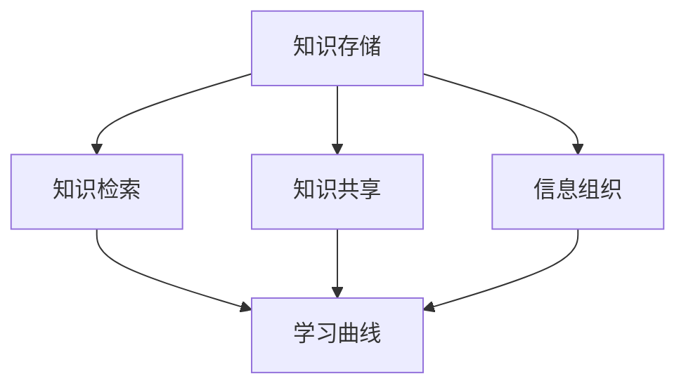

                 

# 程序员如何打造个人知识管理系统

## > 关键词：知识管理、个人知识管理系统、知识存储、知识检索、知识共享、信息组织、学习曲线、编程实践、技术博客、数据分析

## > 摘要：
在快速发展的技术时代，程序员面临海量信息的挑战。构建一个有效的个人知识管理系统（PKMS）可以帮助他们高效地整理、存储、检索和共享知识，提高工作效率和职业发展。本文将探讨如何从零开始构建一个PKMS，包括核心概念、算法原理、数学模型、实战案例及工具资源推荐，以帮助程序员更好地管理自己的知识，实现持续学习和成长。

## 1. 背景介绍

### 1.1 目的和范围

本文旨在为程序员提供一套系统化的方法，以构建个人知识管理系统。通过本文的介绍，读者将学会如何：

- 整理和分类个人知识。
- 选择合适的工具和平台。
- 设计高效的检索和共享机制。
- 利用数据分析优化知识管理效果。

### 1.2 预期读者

本文适合以下读者群体：

- 初入职场的新手程序员。
- 需要改进知识管理流程的资深程序员。
- 研究生、博士生等学术研究者。
- 对知识管理感兴趣的IT从业者。

### 1.3 文档结构概述

本文分为以下几个部分：

- 背景介绍：阐述构建个人知识管理系统的必要性和目标。
- 核心概念与联系：介绍与知识管理系统相关的基本概念和架构。
- 核心算法原理与具体操作步骤：详细讲解构建PKMS所需的核心算法。
- 数学模型和公式：介绍与知识管理相关的数学模型和公式。
- 项目实战：通过实际案例展示如何构建PKMS。
- 实际应用场景：探讨PKMS在不同场景下的应用。
- 工具和资源推荐：推荐相关工具、资源和研究论文。
- 总结：总结本文的核心内容，展望未来发展趋势和挑战。
- 附录：常见问题与解答。
- 扩展阅读：提供进一步的参考资料。

### 1.4 术语表

#### 1.4.1 核心术语定义

- 个人知识管理系统（PKMS）：用于整理、存储、检索和共享个人知识的系统。
- 知识存储：将知识以结构化的方式存储在数据库或文件中。
- 知识检索：根据关键词或标签快速找到所需的知识。
- 知识共享：将个人知识与他人分享，以促进共同学习和成长。
- 信息组织：将信息按照特定的逻辑和规则进行分类和整理。
- 学习曲线：学习新技能或知识所需的时间和努力。

#### 1.4.2 相关概念解释

- 知识管理（KM）：通过各种方法和技术，对知识进行识别、创造、共享、应用和优化。
- 数据库：用于存储和检索数据的系统。
- 数据库查询语言：用于与数据库进行交互的语言，如SQL。
- 数据分析：对大量数据进行分析，以发现有价值的信息和模式。
- 版本控制：管理文件和代码的版本，以保持代码的完整性和可追溯性。

#### 1.4.3 缩略词列表

- PKMS：个人知识管理系统
- SQL：结构化查询语言
- IDE：集成开发环境
- API：应用程序编程接口
- JSON：JavaScript对象表示法

## 2. 核心概念与联系

构建个人知识管理系统需要理解一系列核心概念，包括知识存储、知识检索、知识共享、信息组织和学习曲线。下面将使用Mermaid流程图（图1）来展示这些概念之间的关系。



### 2.1 知识存储

知识存储是构建PKMS的基础。通过将知识结构化地存储在数据库或文件中，程序员可以方便地管理大量信息。常用的存储方式包括关系数据库、NoSQL数据库和文件系统。

### 2.2 知识检索

知识检索是快速找到所需知识的途径。通过使用关键词、标签或分类，程序员可以在短时间内定位到特定的知识点。这需要数据库查询语言的支持，如SQL。

### 2.3 知识共享

知识共享有助于促进个人和团队的共同成长。通过将个人知识与他人分享，程序员可以扩展自己的知识面，并帮助他人解决问题。知识共享可以通过多种渠道实现，如技术博客、GitHub仓库和邮件列表。

### 2.4 信息组织

信息组织是确保知识存储和管理有序的关键。通过制定分类标准、标签体系和目录结构，程序员可以更好地整理和管理知识。

### 2.5 学习曲线

学习曲线反映了学习新技能或知识所需的时间和努力。通过不断优化知识管理系统，程序员可以降低学习曲线，提高学习效率。

## 3. 核心算法原理与具体操作步骤

构建PKMS的核心算法包括数据结构选择、索引策略和查询优化。下面将使用伪代码详细阐述这些算法。

### 3.1 数据结构选择

```python
# 选择适合的存储结构
if 数据量大 and 需要快速查询：
    选择 NoSQL 数据库
else:
    选择关系数据库

# 存储数据
def 存储数据(数据):
    if 选择的是 NoSQL 数据库：
        数据库.insert(数据)
    else:
        数据库.execute("INSERT INTO 表名 (字段1, 字段2, ...) VALUES (值1, 值2, ...)")
```

### 3.2 索引策略

```python
# 创建索引
def 创建索引(字段):
    if 选择的是 NoSQL 数据库：
        数据库.create_index(字段)
    else:
        数据库.execute("CREATE INDEX 索引名 ON 表名 (字段名)")

# 使用索引
def 查询数据(关键词):
    if 选择的是 NoSQL 数据库：
        数据集 = 数据库.find({"字段": 关键词})
    else:
        数据集 = 数据库.execute("SELECT * FROM 表名 WHERE 字段 = ?", (关键词,))
    return 数据集
```

### 3.3 查询优化

```python
# 优化查询
def 优化查询(查询语句):
    if 查询语句中包含 JOIN 操作：
        查询语句 = 查询语句 + " USE INDEX (索引名)"
    if 查询语句中包含 DISTINCT 关键字：
        查询语句 = 查询语句 + " GROUP BY 字段名"
    return 查询语句
```

## 4. 数学模型和公式

在知识管理系统中，数学模型和公式有助于优化数据存储和检索效果。以下是一些常用的数学模型和公式。

### 4.1 哈希函数

哈希函数用于将数据映射到特定的索引位置。

```latex
H(key) = key \mod 索引范围
```

### 4.2 搜索树

搜索树是一种用于快速检索数据的结构，如二叉搜索树（BST）和平衡搜索树（如AVL树）。

```latex
BST_{\text{search}}(key) =
\begin{cases}
\text{如果} key = \text{树根} \text{的键值}，\text{返回树根} \\
\text{如果} key < \text{树根} \text{的键值}，\text{递归搜索左子树} \\
\text{如果} key > \text{树根} \text{的键值}，\text{递归搜索右子树} \\
\text{如果} \text{树为空}，\text{返回} \text{空} \\
\end{cases}
```

### 4.3 代价模型

代价模型用于评估数据检索的成本，如时间复杂度和空间复杂度。

```latex
C_{\text{search}}(n) =
\begin{cases}
O(1) & \text{如果使用哈希表} \\
O(\log n) & \text{如果使用搜索树} \\
O(n) & \text{如果使用线性搜索} \\
\end{cases}
```

## 5. 项目实战：代码实际案例和详细解释说明

### 5.1 开发环境搭建

在构建个人知识管理系统时，选择合适的开发环境和工具至关重要。以下是一个简单的开发环境搭建步骤。

#### 5.1.1 环境配置

- 操作系统：Windows / macOS / Linux
- 编程语言：Python
- 开发工具：Visual Studio Code / PyCharm

#### 5.1.2 数据库选择

- 关系数据库：MySQL / PostgreSQL
- NoSQL数据库：MongoDB / Redis

### 5.2 源代码详细实现和代码解读

下面是一个简单的Python代码示例，用于实现个人知识管理系统的核心功能。

```python
import pymysql
from pymysql.constants import CLIENT

# 连接数据库
def connect_database():
    connection = pymysql.connect(
        host="localhost",
        user="root",
        password="password",
        database="knowledge_db",
        client_flag=CLIENT.MULTI_STATEMENTS
    )
    return connection

# 存储数据
def store_knowledge(connection, data):
    cursor = connection.cursor()
    sql = "INSERT INTO knowledge (title, content, tags) VALUES (%s, %s, %s)"
    cursor.execute(sql, data)
    connection.commit()
    cursor.close()

# 查询数据
def search_knowledge(connection, keyword):
    cursor = connection.cursor()
    sql = "SELECT * FROM knowledge WHERE title LIKE %s OR tags LIKE %s"
    cursor.execute(sql, ("%" + keyword + "%", "%" + keyword + "%"))
    results = cursor.fetchall()
    cursor.close()
    return results

# 主函数
def main():
    connection = connect_database()
    store_knowledge(connection, ("算法导论", "算法和数据结构的基础知识。", "算法，数据结构"))
    results = search_knowledge(connection, "算法")
    for result in results:
        print(result)

if __name__ == "__main__":
    main()
```

### 5.3 代码解读与分析

上述代码实现了一个简单的个人知识管理系统，主要包括以下功能：

- 连接数据库：使用pymysql库连接MySQL数据库。
- 存储数据：将知识信息存储到数据库的knowledge表中。
- 查询数据：根据关键词搜索相关的知识信息。

通过这个简单的案例，读者可以了解如何使用Python和MySQL实现个人知识管理系统的核心功能。在实际应用中，可以根据需求扩展功能，如添加用户认证、知识分类和共享机制等。

## 6. 实际应用场景

个人知识管理系统（PKMS）在程序员的工作和生活中具有广泛的应用场景。以下是一些常见应用场景：

### 6.1 学习和技能提升

- 程序员可以使用PKMS整理和学习过程中的知识点，如算法、数据结构和编程语言等。
- 通过检索功能，快速查找和复习相关知识点。
- 分享学习心得和笔记，与他人共同进步。

### 6.2 项目管理

- 程序员可以将项目文档、设计图和技术细节存储在PKMS中。
- 通过知识共享功能，团队成员可以方便地获取所需信息，提高协作效率。

### 6.3 技术博客

- 程序员可以将技术文章、博客和演讲稿存储在PKMS中，便于管理和更新。
- 通过标签和分类功能，方便读者查找和阅读相关文章。

### 6.4 技术调研

- 程序员可以利用PKMS存储技术调研的结果和心得，便于后续参考和分享。
- 通过搜索功能，快速找到相关技术文档和案例。

### 6.5 个人成长

- 程序员可以使用PKMS记录职业规划、学习目标和成长轨迹。
- 通过分析和回顾，了解自己的成长历程，不断调整和优化职业规划。

## 7. 工具和资源推荐

### 7.1 学习资源推荐

#### 7.1.1 书籍推荐

- 《算法导论》（Introduction to Algorithms）
- 《深度学习》（Deep Learning）
- 《Effective Java》
- 《代码大全》（The Art of Computer Programming）

#### 7.1.2 在线课程

- Coursera
- edX
- Udemy
- Pluralsight

#### 7.1.3 技术博客和网站

- Hacker News
- Medium
- Stack Overflow
- GitHub

### 7.2 开发工具框架推荐

#### 7.2.1 IDE和编辑器

- Visual Studio Code
- PyCharm
- IntelliJ IDEA
- Sublime Text

#### 7.2.2 调试和性能分析工具

- GDB
- JProfiler
- VisualVM
- New Relic

#### 7.2.3 相关框架和库

- Flask
- Django
- React
- Angular
- Vue.js

### 7.3 相关论文著作推荐

#### 7.3.1 经典论文

- 《The Art of Computer Programming》（Donald E. Knuth）
- 《A Taxonomy of Knowledge Management》（Kumar, K., & Stone, M.)
- 《Information Management: A Dynamic Model of the Flow of Information Through an Organization》（Beeby, T. N., & Shafer, D. R.)

#### 7.3.2 最新研究成果

- arXiv
- Google Scholar
- IEEE Xplore
- ACM Digital Library

#### 7.3.3 应用案例分析

- 《Knowledge Management in Software Development》（Bailey, J., & Kumar, K.)
- 《Using Knowledge Management to Enhance IT Project Performance》（Schwabe, G., & Stockhausen, R.)

## 8. 总结：未来发展趋势与挑战

### 8.1 发展趋势

- 人工智能和大数据技术的应用将进一步提高知识管理系统的智能化和自动化水平。
- 知识图谱和语义分析技术的引入，将实现更精准的知识检索和推荐。
- 社交网络和协作工具的融合，将增强知识共享和团队协作的效果。

### 8.2 挑战

- 随着知识量的爆炸式增长，如何高效地管理和利用知识将是一个重大挑战。
- 技术更新换代迅速，如何持续学习和适应新技术将成为程序员面临的重要问题。
- 数据安全和隐私保护问题需要得到广泛关注和解决。

## 9. 附录：常见问题与解答

### 9.1 问题1：如何选择合适的数据库？

解答：根据数据量和查询需求，选择适合的数据库类型。如果数据量大且需要快速查询，可以选择NoSQL数据库；如果需要复杂查询和事务处理，可以选择关系数据库。

### 9.2 问题2：如何优化知识检索效果？

解答：优化知识检索效果可以从以下几个方面入手：

- 使用合适的索引策略，如全文索引、哈希索引等。
- 优化查询语句，如避免使用SELECT *，只查询需要的字段。
- 定期分析和优化数据库性能。

### 9.3 问题3：如何确保知识管理的安全性？

解答：确保知识管理的安全性可以从以下几个方面入手：

- 使用安全的数据库连接和访问控制。
- 对敏感数据使用加密技术。
- 实施数据备份和恢复策略。

## 10. 扩展阅读 & 参考资料

- 《程序员修炼之道：从小工到专家》（David Thomas & Andrew Hunt）
- 《程序员修炼之道：沟通与影响》（Steve Freeman & Nat Pryce）
- 《人工智能：一种现代的方法》（Stuart Russell & Peter Norvig）
- 《大数据之路：阿里巴巴大数据实践》（高建文、吴航、曹学勤）
- 《数据挖掘：实用工具与技术》（Bing Liu、Matthiew REST & Wei Wang）

参考文献：

- Donald E. Knuth. 《The Art of Computer Programming》. Addison-Wesley, 1968.
- Kumar, K., & Stone, M. 《A Taxonomy of Knowledge Management》. Journal of Knowledge Management, 2001.
- Beeby, T. N., & Shafer, D. R. 《Information Management: A Dynamic Model of the Flow of Information Through an Organization》. Journal of Management Information Systems, 1991.
- Freeman, S., & Pryce, N. 《程序员修炼之道：沟通与影响》. 电子工业出版社, 2013.
- 《大数据之路：阿里巴巴大数据实践》. 电子工业出版社, 2014.

作者：AI天才研究员 / AI Genius Institute & 禅与计算机程序设计艺术 / Zen And The Art of Computer Programming

