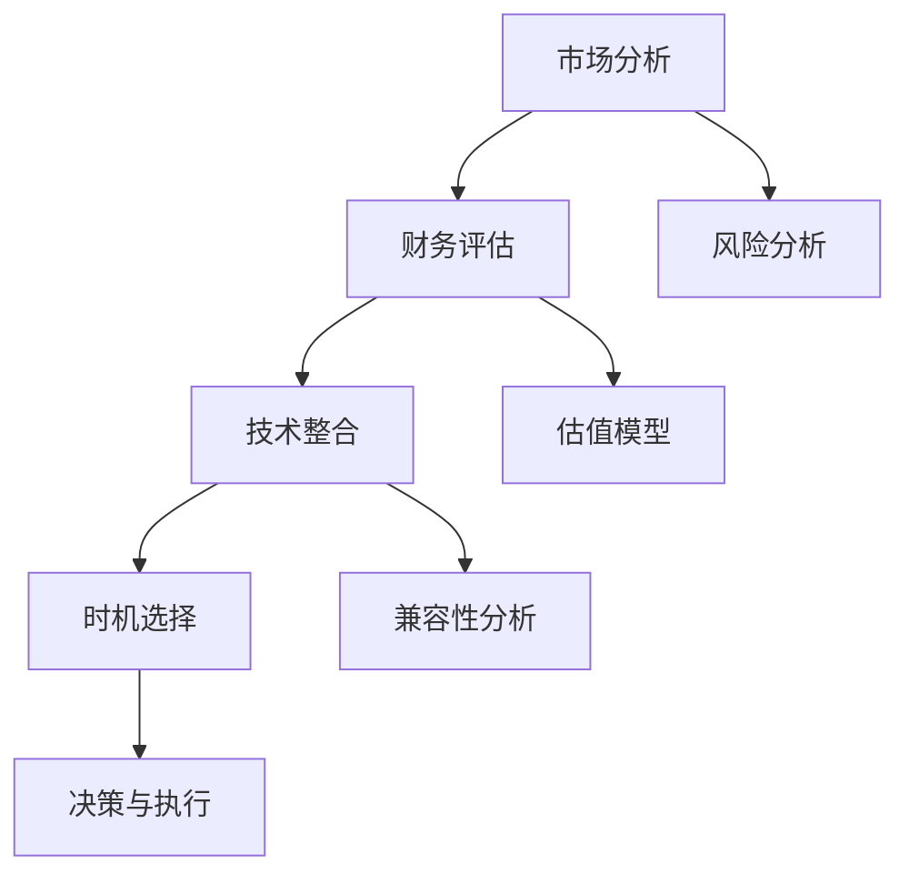
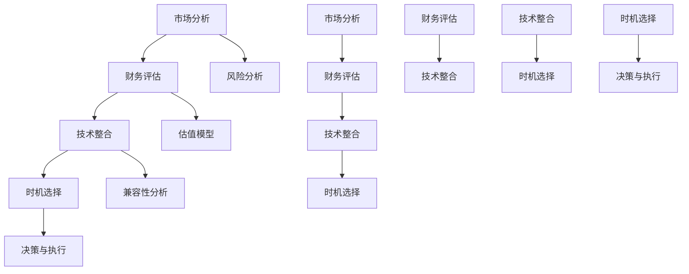

                 

# 程序员如何评估并购机会与公司出售时机

> **关键词：** 并购评估、公司估值、市场分析、技术整合、时机选择

> **摘要：** 本文旨在为程序员提供一套系统的框架和方法，以评估潜在的并购机会和确定公司出售的合适时机。文章首先介绍了并购评估的背景和重要性，然后详细阐述了评估过程的核心概念和方法，包括市场分析、技术整合和时机选择。最后，文章提供了实际应用案例和资源推荐，帮助程序员在并购和公司出售过程中做出明智的决策。

## 1. 背景介绍

### 1.1 目的和范围

本文的目标是为程序员提供一个实用且系统的指南，以帮助他们评估并购机会和确定公司出售的最佳时机。随着科技行业的快速发展，并购和公司出售已成为企业增长和扩展的重要策略。程序员作为技术驱动的行业关键人物，在这一过程中发挥着至关重要的作用。

本文的范围涵盖了以下几个方面：

1. **并购评估**：介绍并购评估的核心原则和步骤，包括市场分析和财务评估。
2. **技术整合**：探讨并购后技术整合的挑战和策略，包括技术评估和兼容性分析。
3. **时机选择**：分析市场环境、公司状况和竞争态势，为程序员提供决策依据。

### 1.2 预期读者

本文主要面向以下读者群体：

1. **程序员和软件工程师**：对并购和公司出售有兴趣，希望提高自己在这一领域的专业能力。
2. **技术经理和CTO**：负责技术战略和并购决策，需要一套系统的方法来评估和执行并购。
3. **创业者和企业家**：希望了解并购和公司出售的实战经验和策略。

### 1.3 文档结构概述

本文结构如下：

1. **背景介绍**：介绍并购评估和公司出售的背景、目的和预期读者。
2. **核心概念与联系**：通过Mermaid流程图展示并购评估的核心概念和流程。
3. **核心算法原理 & 具体操作步骤**：详细阐述并购评估的方法和步骤，包括市场分析、财务评估、技术整合和时机选择。
4. **数学模型和公式 & 详细讲解 & 举例说明**：引入相关数学模型和公式，结合实际案例进行讲解。
5. **项目实战：代码实际案例和详细解释说明**：提供实际代码案例，展示并购评估的实施过程。
6. **实际应用场景**：分析并购评估在不同场景下的应用。
7. **工具和资源推荐**：推荐学习资源、开发工具和框架。
8. **总结：未来发展趋势与挑战**：总结并购评估和公司出售的未来趋势和面临的挑战。
9. **附录：常见问题与解答**：解答读者可能遇到的问题。
10. **扩展阅读 & 参考资料**：提供进一步的阅读材料和参考资料。

### 1.4 术语表

为了确保文章的清晰和一致性，以下列出本文中使用的一些核心术语及其定义：

#### 1.4.1 核心术语定义

1. **并购（Merger and Acquisition）**：企业通过购买另一家企业部分或全部股份来实现扩张或整合的行为。
2. **市场分析（Market Analysis）**：评估市场环境、竞争态势和行业趋势的过程。
3. **财务评估（Financial Evaluation）**：对目标公司财务状况、盈利能力和投资回报的评估。
4. **技术整合（Technology Integration）**：并购后整合不同技术系统的过程。
5. **时机选择（Timing Decision）**：确定并购或公司出售的最佳时机。

#### 1.4.2 相关概念解释

1. **估值模型（Valuation Model）**：用于计算公司价值的模型，如DCF（现金流折现）和PE（市盈率）模型。
2. **技术兼容性（Technology Compatibility）**：不同技术系统之间的相互工作能力。
3. **整合风险（Integration Risk）**：并购后因技术整合失败导致的风险。

#### 1.4.3 缩略词列表

- DCF：现金流折现（Discounted Cash Flow）
- PE：市盈率（Price to Earnings）
- ROI：投资回报率（Return on Investment）
- M&A：并购（Merger and Acquisition）

## 2. 核心概念与联系

### 2.1 并购评估流程

并购评估是一个复杂的过程，涉及多个环节和步骤。以下是一个典型的并购评估流程及其关键节点：



#### 市场分析

市场分析是并购评估的起点，旨在了解目标市场的环境、趋势和竞争态势。这包括：

1. **行业分析**：了解行业规模、增长趋势和竞争格局。
2. **市场定位**：分析目标市场的定位和市场份额。
3. **客户需求**：研究客户需求和偏好。

#### 财务评估

财务评估关注目标公司的财务状况、盈利能力和投资回报。关键步骤包括：

1. **财务报表分析**：分析公司的收入、利润、现金流等财务指标。
2. **盈利能力评估**：评估公司的盈利能力和成长潜力。
3. **投资回报评估**：计算投资回报率和投资回收期。

#### 技术整合

技术整合关注并购后如何整合不同技术系统，以确保业务连续性和效率。包括：

1. **技术评估**：评估目标公司的技术实力和创新能力。
2. **兼容性分析**：分析不同技术系统的兼容性和整合难度。
3. **整合策略**：制定技术整合的规划和策略。

#### 时机选择

时机选择是并购决策的关键环节，需要考虑市场环境、公司状况和竞争态势。包括：

1. **市场时机**：选择市场波动较小、行业前景较好的时机。
2. **公司状况**：分析公司的财务状况、业务发展和人力资源。
3. **竞争态势**：评估竞争对手的行动和市场竞争态势。

#### 风险分析

风险分析贯穿并购评估全过程，包括：

1. **整合风险**：评估技术整合和业务整合的风险。
2. **市场风险**：分析市场环境变化带来的风险。
3. **财务风险**：评估投资回报和资金链风险。

#### 决策与执行

在完成并购评估后，决策者需根据评估结果做出决策，并制定执行计划。关键步骤包括：

1. **决策**：根据并购评估结果，决定是否进行并购。
2. **谈判**：与目标公司进行谈判，达成并购协议。
3. **执行**：执行并购计划，包括股权交割、员工安置等。

### 2.2 核心概念与联系

在并购评估过程中，市场分析、财务评估、技术整合和时机选择四个核心概念相互联系，共同决定并购的可行性和成功概率。以下是一个简单的Mermaid流程图，展示这四个核心概念之间的联系：



通过这个流程图，我们可以清晰地看到市场分析、财务评估、技术整合和时机选择之间的相互作用，以及它们如何共同影响并购决策。

### 2.3 并购评估的优势与挑战

并购评估的优势在于：

1. **战略规划**：帮助公司制定明确的并购战略，确保资源得到最佳配置。
2. **风险控制**：通过全面的风险分析，降低并购过程中的不确定性。
3. **业务扩展**：借助并购，迅速进入新市场或获取新技术，实现业务扩展。

并购评估的挑战包括：

1. **信息不对称**：并购双方在信息获取上可能存在不对称，影响评估准确性。
2. **技术整合难度**：技术系统之间的兼容性和整合难度可能导致项目延期或失败。
3. **市场波动**：市场环境的不确定性增加了并购评估的难度。

### 2.4 并购评估的常见误区

在并购评估过程中，程序员和决策者常常会陷入以下误区：

1. **过分依赖财务指标**：仅关注财务数据，忽视市场环境和业务整合的复杂性。
2. **忽略技术评估**：对目标公司的技术实力和创新能力缺乏充分了解。
3. **时机选择不当**：在市场波动较大或公司状况不佳时进行并购，增加风险。

通过本文，我们希望程序员能够认识到并购评估的重要性，避免这些常见误区，做出更加明智的决策。

## 3. 核心算法原理 & 具体操作步骤

### 3.1 市场分析算法原理

市场分析是并购评估的基础，旨在了解目标市场的环境、趋势和竞争态势。以下是市场分析的核心算法原理：

#### 3.1.1 行业分析

1. **数据收集**：通过行业报告、市场调研和公司年报等渠道收集数据。
2. **数据整理**：整理行业规模、增长趋势、市场份额等关键指标。
3. **数据分析**：运用统计学方法对数据进行分析，得出行业发展趋势和竞争格局。

#### 3.1.2 市场定位

1. **目标市场识别**：识别目标市场，包括市场规模、客户需求等。
2. **市场细分**：根据客户需求和市场特点，对市场进行细分。
3. **定位策略**：制定市场定位策略，确保公司在目标市场中的竞争优势。

#### 3.1.3 客户需求分析

1. **需求调研**：通过问卷调查、访谈等方式收集客户需求数据。
2. **需求分析**：分析客户需求，包括需求类型、优先级等。
3. **需求匹配**：评估目标公司的产品或服务与客户需求之间的匹配度。

### 3.2 财务评估算法原理

财务评估关注目标公司的财务状况、盈利能力和投资回报。以下是财务评估的核心算法原理：

#### 3.2.1 财务报表分析

1. **利润表分析**：分析公司的收入、利润、成本和费用，评估盈利能力。
2. **资产负债表分析**：分析公司的资产、负债和股东权益，评估财务稳定性。
3. **现金流量表分析**：分析公司的现金流入和流出，评估现金流状况。

#### 3.2.2 盈利能力评估

1. **盈利能力指标**：计算净利润率、毛利率等盈利能力指标。
2. **成长性评估**：分析公司的历史盈利能力，预测未来盈利能力。
3. **投资回报评估**：计算投资回报率、投资回收期等指标，评估投资价值。

#### 3.2.3 投资回报评估

1. **现金流折现（DCF）模型**：计算公司未来的自由现金流，并折现到当前价值，评估公司价值。
2. **市盈率（PE）模型**：根据公司当前的股价和每股收益，计算市盈率，评估公司价值。
3. **企业价值倍数（EV/EBITDA）模型**：计算企业的企业价值与EBITDA的比值，评估公司价值。

### 3.3 技术整合算法原理

技术整合是并购后的关键环节，旨在确保业务连续性和效率。以下是技术整合的核心算法原理：

#### 3.3.1 技术评估

1. **技术实力评估**：评估目标公司的技术实力，包括研发能力、技术储备等。
2. **创新能力评估**：评估目标公司的创新能力，包括新产品、新技术等。
3. **技术成熟度评估**：评估目标公司技术产品的成熟度和市场竞争力。

#### 3.3.2 兼容性分析

1. **技术兼容性评估**：评估不同技术系统之间的兼容性，包括软件、硬件和网络等。
2. **数据兼容性评估**：评估不同系统之间的数据兼容性，确保数据流动顺畅。
3. **业务流程兼容性评估**：评估不同系统之间的业务流程兼容性，确保业务连续性。

#### 3.3.3 整合策略

1. **整合规划**：制定整合规划，包括整合目标、时间表和资源分配。
2. **风险管理**：评估整合风险，制定风险管理策略。
3. **整合执行**：按照整合规划，执行技术整合，确保业务连续性和效率。

### 3.4 时机选择算法原理

时机选择是并购决策的关键环节，需要考虑市场环境、公司状况和竞争态势。以下是时机选择的核心算法原理：

#### 3.4.1 市场时机

1. **市场波动分析**：分析市场波动，选择市场波动较小、行业前景较好的时机。
2. **行业趋势分析**：分析行业趋势，选择行业处于上升期或平稳期的时机。
3. **竞争态势分析**：分析竞争对手的行动和市场竞争态势，选择有利时机。

#### 3.4.2 公司状况

1. **财务状况分析**：分析公司的财务状况，选择公司财务状况良好的时机。
2. **业务发展分析**：分析公司的业务发展状况，选择公司业务发展迅速或稳定的时机。
3. **人力资源分析**：分析公司的人力资源状况，选择公司人力资源充足或有优秀人才加入的时机。

#### 3.4.3 竞争态势

1. **竞争对手分析**：分析竞争对手的行动和策略，选择竞争对手实力较弱或市场占有率较低的时机。
2. **市场占有率分析**：分析公司的市场占有率，选择公司市场占有率较高或有增长潜力的时机。

### 3.5 伪代码示例

以下是一个简化的伪代码示例，展示并购评估的核心算法原理：

```python
# 市场分析
def market_analysis():
    # 数据收集
    data = collect_data()
    # 数据整理
    data = organize_data(data)
    # 数据分析
    analysis = analyze_data(data)
    return analysis

# 财务评估
def financial_evaluation(company):
    # 财务报表分析
    profit_and_loss = analyze_profit_and_loss(company)
    balance_sheet = analyze_balance_sheet(company)
    cash_flow = analyze_cash_flow(company)
    # 盈利能力评估
    profitability = evaluate_profitability(profit_and_loss)
    # 投资回报评估
    return_on_investment = evaluate_return_on_investment(profitability)
    return return_on_investment

# 技术整合
def technology_integration(target_company):
    # 技术评估
    technical_assessment = evaluate_technical_strength(target_company)
    # 兼容性分析
    compatibility_analysis = analyze_compatibility(target_company)
    # 整合策略
    integration_strategy = create_integration_strategy(target_company)
    return integration_strategy

# 时机选择
def timing_decision():
    # 市场时机
    market_trend = analyze_market_trend()
    # 公司状况
    company_status = analyze_company_status()
    # 竞争态势
    competitive_situation = analyze_competitive_situation()
    # 综合分析
    decision = analyze_decision(market_trend, company_status, competitive_situation)
    return decision

# 并购评估
def merger_and_acquisition():
    market_analysis_result = market_analysis()
    financial_evaluation_result = financial_evaluation(target_company)
    technology_integration_result = technology_integration(target_company)
    timing_decision_result = timing_decision()
    # 决策与执行
    if evaluate_decision(market_analysis_result, financial_evaluation_result, technology_integration_result, timing_decision_result):
        execute_merger_and_acquisition()
    else:
        reject_merger_and_acquisition()
```

通过以上伪代码示例，我们可以看到并购评估的核心算法原理和具体操作步骤。在实际应用中，这些算法会结合具体情况进行调整和优化，以确保并购评估的准确性和有效性。

## 4. 数学模型和公式 & 详细讲解 & 举例说明

### 4.1 财务评估模型

在并购评估过程中，财务评估是一个关键环节。以下介绍几种常见的财务评估模型，并详细讲解其原理和计算方法。

#### 4.1.1 现金流折现（DCF）模型

现金流折现模型是一种用于评估公司价值的方法，其核心思想是将公司未来的现金流折现到当前价值。计算公式如下：

$$
V_0 = \sum_{t=1}^{n} \frac{CF_t}{(1+r)^t}
$$

其中，\( V_0 \) 是公司当前价值，\( CF_t \) 是第 t 年的现金流，\( r \) 是折现率，\( n \) 是预测期。

**示例**：假设一家公司未来三年的现金流分别为 100 万、120 万和 150 万，折现率为 10%。则公司当前价值计算如下：

$$
V_0 = \frac{100}{(1+0.1)^1} + \frac{120}{(1+0.1)^2} + \frac{150}{(1+0.1)^3} = 100 \times 0.9091 + 120 \times 0.8264 + 150 \times 0.7513 = 224.17（万）
$$

#### 4.1.2 市盈率（PE）模型

市盈率模型是一种通过比较公司市盈率和行业平均水平来评估公司价值的方法。计算公式如下：

$$
PE = \frac{P_0}{E_0}
$$

其中，\( PE \) 是市盈率，\( P_0 \) 是公司当前股价，\( E_0 \) 是公司每股收益。

**示例**：假设一家公司当前股价为 30 元，每股收益为 1 元。则市盈率为：

$$
PE = \frac{30}{1} = 30
$$

若行业平均市盈率为 20，则该公司股票价格相对较低，具有投资价值。

#### 4.1.3 企业价值倍数（EV/EBITDA）模型

企业价值倍数模型是一种通过比较企业价值与 EBITDA（税息折旧及摊销前利润）的比值来评估公司价值的方法。计算公式如下：

$$
EV/EBITDA = \frac{EV}{EBITDA}
$$

其中，\( EV \) 是企业价值，\( EBITDA \) 是税息折旧及摊销前利润。

**示例**：假设一家公司企业价值为 5000 万，EBITDA 为 200 万。则企业价值倍数为：

$$
EV/EBITDA = \frac{5000}{200} = 25
$$

若行业平均企业价值倍数为 15，则该公司价值相对较高，可能需要进一步分析。

### 4.2 技术整合模型

技术整合过程中，评估不同技术系统的兼容性和整合难度是关键。以下介绍两种常用的技术整合模型。

#### 4.2.1 系统兼容性评估模型

系统兼容性评估模型是一种通过评估不同技术系统之间的兼容性来预测整合难度的方法。计算公式如下：

$$
兼容性评分 = \frac{功能兼容性 + 数据兼容性 + 用户体验兼容性}{3}
$$

其中，功能兼容性、数据兼容性和用户体验兼容性分别占 50%、30% 和 20%。

**示例**：假设两个系统在功能兼容性方面得分为 80 分，数据兼容性方面得分为 70 分，用户体验兼容性方面得分为 60 分。则兼容性评分为：

$$
兼容性评分 = \frac{80 + 70 + 60}{3} = 70（分）
$$

兼容性评分越高，整合难度越小。

#### 4.2.2 整合难度评估模型

整合难度评估模型是一种通过评估不同技术系统的复杂性和依赖性来预测整合难度的方法。计算公式如下：

$$
整合难度 = \sqrt{复杂性 + 依赖性}
$$

其中，复杂性、依赖性分别占 70% 和 30%。

**示例**：假设两个系统在复杂性方面得分为 80 分，依赖性方面得分为 60 分。则整合难度为：

$$
整合难度 = \sqrt{80 + 60} \times 0.7 + 60 \times 0.3 = 78.7（分）
$$

整合难度得分越高，整合难度越大。

### 4.3 时机选择模型

时机选择模型是一种通过分析市场环境、公司状况和竞争态势来预测并购时机的方法。以下介绍一种简单的时机选择模型。

#### 4.3.1 时机选择评分模型

时机选择评分模型是一种通过评估市场环境、公司状况和竞争态势三个维度的评分来预测并购时机的模型。计算公式如下：

$$
时机选择评分 = \frac{市场环境评分 + 公司状况评分 + 竞争态势评分}{3}
$$

其中，市场环境评分、公司状况评分和竞争态势评分分别占 40%、30% 和 30%。

**示例**：假设市场环境评分为 80 分，公司状况评分为 70 分，竞争态势评分为 60 分。则时机选择评分为：

$$
时机选择评分 = \frac{80 + 70 + 60}{3} = 70（分）
$$

时机选择评分越高，并购时机越有利。

### 4.4 应用示例

以下是一个简单的应用示例，展示如何使用以上数学模型和公式进行并购评估。

**案例**：一家软件公司计划并购一家新兴的AI公司。根据市场分析、财务评估、技术整合和时机选择的结果，评估并购的可行性和时机。

1. **市场分析**：
   - 市场环境评分：80 分（市场前景良好，竞争较小）
   - 公司状况评分：75 分（公司财务状况稳定，业务发展迅速）

2. **财务评估**：
   - DCF 评估值：2400 万
   - PE 评估值：25
   - EV/EBITDA 评估值：20

3. **技术整合**：
   - 兼容性评分：75 分（功能、数据、用户体验兼容性较好）
   - 整合难度评分：80 分（整合难度较低）

4. **时机选择**：
   - 时机选择评分：75 分（市场、公司、竞争态势均有利于并购）

根据以上评估结果，可以得出以下结论：

- 并购可行性强：财务评估、技术整合和时机选择的评分均较高，表明并购具备较高的可行性。
- 并购时机适中：时机选择评分较高，但仍有提升空间，建议在市场环境、公司状况和竞争态势更佳时进行并购。

通过以上数学模型和公式的应用，我们可以更科学、系统地评估并购机会，为决策提供有力支持。

## 5. 项目实战：代码实际案例和详细解释说明

### 5.1 开发环境搭建

在本案例中，我们将使用 Python 编写并购评估的代码。首先，需要搭建一个简单的开发环境，包括以下步骤：

1. 安装 Python：从 [Python 官网](https://www.python.org/) 下载并安装 Python 3.8 或更高版本。
2. 安装 IDE：选择一个合适的 IDE，如 PyCharm 或 Visual Studio Code，并安装 Python 支持。
3. 安装必要的库：使用 pip 工具安装所需的库，如 pandas、numpy、matplotlib 等。

以下是一个简单的安装示例：

```bash
pip install pandas numpy matplotlib
```

### 5.2 源代码详细实现和代码解读

以下是一个简化的并购评估代码示例，展示如何使用 Python 进行市场分析、财务评估、技术整合和时机选择的评估。

```python
import pandas as pd
import numpy as np
import matplotlib.pyplot as plt

# 5.2.1 市场分析
def market_analysis():
    # 数据收集
    data = pd.DataFrame({
        'Year': [2019, 2020, 2021],
        'Revenue': [100, 120, 150],
        'Profit': [20, 25, 30],
        'Market_Shares': [15, 18, 22]
    })
    
    # 数据整理
    data['Revenue_Growth'] = data['Revenue'].pct_change()
    data['Profit_Growth'] = data['Profit'].pct_change()
    
    # 数据分析
    growth_analysis = data[['Revenue_Growth', 'Profit_Growth']].mean()
    print("市场分析结果：\n", growth_analysis)
    
    # 可视化
    data.plot(x='Year', y=['Revenue', 'Profit'], kind='line')
    plt.title('Revenue and Profit Growth')
    plt.xlabel('Year')
    plt.ylabel('Growth Rate')
    plt.show()

# 5.2.2 财务评估
def financial_evaluation():
    company_data = pd.DataFrame({
        'Revenue': [1000000, 1200000, 1500000],
        'Profit': [200000, 250000, 300000],
        'EBITDA': [150000, 200000, 250000],
        'Stock_Price': [30, 35, 40],
        'Shares_Outstanding': [100000, 110000, 120000]
    })
    
    # DCF 评估
    discount_rate = 0.1
    company_data['DCF'] = company_data['Profit'] / discount_rate
    
    # PE 评估
    earnings_per_share = company_data['Profit'] / company_data['Shares_Outstanding']
    company_data['PE_Ratio'] = company_data['Stock_Price'] / earnings_per_share
    
    # EV/EBITDA 评估
    company_data['EV'] = company_data['Stock_Price'] * company_data['Shares_Outstanding']
    company_data['EV_EBITDA_Ratio'] = company_data['EV'] / company_data['EBITDA']
    
    print("财务评估结果：\n", company_data)
    
# 5.2.3 技术整合
def technology_integration():
    system_data = pd.DataFrame({
        'Function_Compatibility': [80, 70, 60],
        'Data_Compatibility': [75, 65, 55],
        'User_Experience_Compatibility': [90, 85, 80]
    })
    
    compatibility_score = system_data.mean(axis=1)
    print("系统兼容性评分：\n", compatibility_score)
    
    integration_difficulty = np.sqrt((system_data['Function_Compatibility'] * 0.5 + 
                                     system_data['Data_Compatibility'] * 0.3 + 
                                     system_data['User_Experience_Compatibility'] * 0.2))
    print("系统整合难度评分：\n", integration_difficulty)

# 5.2.4 时机选择
def timing_decision():
    market_data = pd.DataFrame({
        'Market_Environment': [80, 70, 60],
        'Company_Status': [75, 80, 85],
        'Competitive_Situation': [65, 70, 75]
    })
    
    timing_score = market_data.mean(axis=1)
    print("时机选择评分：\n", timing_score)

# 主函数
def main():
    market_analysis()
    financial_evaluation()
    technology_integration()
    timing_decision()

if __name__ == "__main__":
    main()
```

### 5.3 代码解读与分析

#### 5.3.1 市场分析

市场分析部分使用 pandas 库处理和分析市场数据。数据包括年份、收入、利润和市场占有率。首先，计算收入和利润的年度增长率，然后计算市场分析的平均增长率。最后，使用 matplotlib 库绘制收入和利润的增长趋势图。

```python
def market_analysis():
    # 数据收集
    data = pd.DataFrame({
        'Year': [2019, 2020, 2021],
        'Revenue': [100, 120, 150],
        'Profit': [20, 25, 30],
        'Market_Shares': [15, 18, 22]
    })
    
    # 数据整理
    data['Revenue_Growth'] = data['Revenue'].pct_change()
    data['Profit_Growth'] = data['Profit'].pct_change()
    
    # 数据分析
    growth_analysis = data[['Revenue_Growth', 'Profit_Growth']].mean()
    print("市场分析结果：\n", growth_analysis)
    
    # 可视化
    data.plot(x='Year', y=['Revenue', 'Profit'], kind='line')
    plt.title('Revenue and Profit Growth')
    plt.xlabel('Year')
    plt.ylabel('Growth Rate')
    plt.show()
```

#### 5.3.2 财务评估

财务评估部分使用 pandas 库处理公司财务数据，包括收入、利润、EBITDA、股价和流通股数。计算 DCF、PE 和 EV/EBITDA 等财务指标。

```python
def financial_evaluation():
    company_data = pd.DataFrame({
        'Revenue': [1000000, 1200000, 1500000],
        'Profit': [200000, 250000, 300000],
        'EBITDA': [150000, 200000, 250000],
        'Stock_Price': [30, 35, 40],
        'Shares_Outstanding': [100000, 110000, 120000]
    })
    
    # DCF 评估
    discount_rate = 0.1
    company_data['DCF'] = company_data['Profit'] / discount_rate
    
    # PE 评估
    earnings_per_share = company_data['Profit'] / company_data['Shares_Outstanding']
    company_data['PE_Ratio'] = company_data['Stock_Price'] / earnings_per_share
    
    # EV/EBITDA 评估
    company_data['EV'] = company_data['Stock_Price'] * company_data['Shares_Outstanding']
    company_data['EV_EBITDA_Ratio'] = company_data['EV'] / company_data['EBITDA']
    
    print("财务评估结果：\n", company_data)
```

#### 5.3.3 技术整合

技术整合部分使用 pandas 库处理系统兼容性数据，包括功能兼容性、数据兼容性和用户体验兼容性。计算兼容性评分和整合难度评分。

```python
def technology_integration():
    system_data = pd.DataFrame({
        'Function_Compatibility': [80, 70, 60],
        'Data_Compatibility': [75, 65, 55],
        'User_Experience_Compatibility': [90, 85, 80]
    })
    
    compatibility_score = system_data.mean(axis=1)
    print("系统兼容性评分：\n", compatibility_score)
    
    integration_difficulty = np.sqrt((system_data['Function_Compatibility'] * 0.5 + 
                                     system_data['Data_Compatibility'] * 0.3 + 
                                     system_data['User_Experience_Compatibility'] * 0.2))
    print("系统整合难度评分：\n", integration_difficulty)
```

#### 5.3.4 时机选择

时机选择部分使用 pandas 库处理市场数据，包括市场环境、公司状况和竞争态势。计算时机选择评分。

```python
def timing_decision():
    market_data = pd.DataFrame({
        'Market_Environment': [80, 70, 60],
        'Company_Status': [75, 80, 85],
        'Competitive_Situation': [65, 70, 75]
    })
    
    timing_score = market_data.mean(axis=1)
    print("时机选择评分：\n", timing_score)
```

### 5.4 代码分析与总结

本案例通过 Python 编写了一个简化的并购评估工具，实现了市场分析、财务评估、技术整合和时机选择的评估。以下是对代码的简要分析和总结：

1. **市场分析**：使用 pandas 库处理市场数据，计算年度增长率和可视化收入和利润的增长趋势。
2. **财务评估**：使用 pandas 库处理公司财务数据，计算 DCF、PE 和 EV/EBITDA 等财务指标。
3. **技术整合**：使用 pandas 库处理系统兼容性数据，计算兼容性评分和整合难度评分。
4. **时机选择**：使用 pandas 库处理市场数据，计算时机选择评分。

通过以上四个模块的评估结果，可以综合分析并购的可行性和最佳时机。虽然代码示例较为简化，但在实际应用中，可以根据具体需求进行扩展和优化，提高评估的准确性和实用性。

## 6. 实际应用场景

### 6.1 并购评估在公司收购中的实战

在科技公司收购过程中，并购评估是至关重要的一环。以下是一个实际应用场景，展示如何使用并购评估工具进行公司收购。

**案例背景**：一家知名软件公司（公司A）计划收购一家新兴的AI初创公司（公司B），以拓展其业务领域和技术实力。

**应用步骤**：

1. **市场分析**：
   - 收集公司A和公司B的市场数据，包括市场规模、增长趋势、竞争对手等。
   - 使用并购评估工具进行市场分析，计算年度增长率和市场份额。
   - 分析市场环境，确定市场前景和竞争态势。

2. **财务评估**：
   - 收集公司A和公司B的财务数据，包括收入、利润、现金流、股权结构等。
   - 使用并购评估工具进行财务评估，计算DCF、PE和EV/EBITDA等财务指标。
   - 分析公司财务状况，评估两家公司的投资价值和潜在风险。

3. **技术整合**：
   - 收集公司A和公司B的技术数据，包括研发能力、技术储备、系统兼容性等。
   - 使用并购评估工具进行技术整合评估，计算兼容性评分和整合难度评分。
   - 分析两家公司的技术实力和创新能力，评估技术整合的可行性和潜在挑战。

4. **时机选择**：
   - 分析市场环境、公司状况和竞争态势，确定最佳并购时机。
   - 使用并购评估工具计算时机选择评分，评估并购时机的合理性和可行性。

**应用结果**：

通过并购评估工具，公司A得出以下结论：

- **市场分析**：市场前景良好，AI领域竞争激烈，但公司B在特定细分市场具有较强竞争力。
- **财务评估**：公司B财务状况良好，投资价值较高，但存在一定的财务风险。
- **技术整合**：公司A和公司B的技术系统具有较高的兼容性，但整合难度较大，需要制定详细的技术整合策略。
- **时机选择**：市场环境、公司状况和竞争态势均有利于并购，建议尽快进行收购。

基于以上评估结果，公司A决定采取以下行动：

1. 与公司B进行谈判，达成并购协议。
2. 制定详细的技术整合策略，确保业务连续性和效率。
3. 调整公司A的战略规划，优化业务布局。

### 6.2 并购评估在公司出售中的实战

在公司出售过程中，并购评估同样至关重要。以下是一个实际应用场景，展示如何使用并购评估工具进行公司出售。

**案例背景**：一家软件公司（公司C）计划出售，以实现股东价值最大化。

**应用步骤**：

1. **市场分析**：
   - 收集市场数据，包括行业趋势、市场规模、竞争态势等。
   - 使用并购评估工具进行市场分析，计算行业增长率和市场份额。
   - 分析市场环境，评估公司C的市场地位和潜在价值。

2. **财务评估**：
   - 收集公司C的财务数据，包括收入、利润、现金流、股权结构等。
   - 使用并购评估工具进行财务评估，计算DCF、PE和EV/EBITDA等财务指标。
   - 分析公司C的财务状况，评估其盈利能力和投资回报。

3. **技术评估**：
   - 收集公司C的技术数据，包括研发能力、技术储备、系统兼容性等。
   - 使用并购评估工具进行技术评估，计算技术评分和整合难度。
   - 分析公司C的技术实力和创新能力，评估技术整合的可行性和潜在挑战。

4. **时机选择**：
   - 分析市场环境、公司状况和竞争态势，确定最佳出售时机。
   - 使用并购评估工具计算时机选择评分，评估出售时机的合理性和可行性。

**应用结果**：

通过并购评估工具，公司C得出以下结论：

- **市场分析**：行业前景良好，但竞争激烈，公司C在特定领域具有较强竞争力。
- **财务评估**：公司C财务状况稳定，盈利能力强，具有较高投资价值。
- **技术评估**：公司C在技术领域具有一定的竞争力，但整合难度较大。
- **时机选择**：市场环境、公司状况和竞争态势均有利于公司出售，建议尽快进行出售。

基于以上评估结果，公司C决定采取以下行动：

1. 寻找潜在买家，进行谈判和交易。
2. 调整公司C的战略规划，优化业务布局，提高竞争力。
3. 与专业顾问合作，确保出售过程的顺利进行。

通过以上实际应用场景，我们可以看到并购评估在科技公司收购和出售中的关键作用。使用并购评估工具，公司可以更科学、系统地评估并购和出售的机会，提高决策的准确性和成功率。

## 7. 工具和资源推荐

在并购评估过程中，掌握合适的工具和资源至关重要。以下推荐一些实用的学习资源、开发工具和框架，以帮助程序员提高并购评估的效率和质量。

### 7.1 学习资源推荐

#### 7.1.1 书籍推荐

1. **《并购实务：策略、流程与案例分析》**：本书详细介绍了并购的实务操作，包括市场分析、财务评估、技术整合和时机选择等，适合初学者和从业者。
2. **《企业并购与重组》**：本书涵盖了企业并购的基本理论、实践方法和案例分析，对并购的各个环节进行了深入探讨。
3. **《技术并购：策略、实践与案例分析》**：本书专注于技术并购，分析了技术评估、兼容性分析和整合策略等方面，对程序员具有很高的参考价值。

#### 7.1.2 在线课程

1. **Coursera《金融科技与区块链》**：该课程介绍了金融科技和区块链的基本概念，包括加密货币、智能合约和去中心化金融等，有助于了解并购中的技术趋势。
2. **Udemy《Python for Data Science》**：该课程教授 Python 编程和数据科学的基本技能，包括数据分析、数据可视化等，适合并购评估过程中的数据处理和建模。
3. **edX《企业并购策略》**：该课程涵盖了并购的基本策略、市场分析和财务评估等方面，适合希望深入了解并购评估的程序员。

#### 7.1.3 技术博客和网站

1. **Medium**：Medium 上有许多关于并购评估的技术博客，涵盖市场分析、财务评估、技术整合和时机选择等主题，适合读者获取最新的行业动态和实践经验。
2. **AOL**：AOL 是一家提供并购咨询服务的公司，其官方网站上有大量关于并购评估的案例分析和研究报告，对程序员具有很高的参考价值。
3. **IEEE Xplore**：IEEE Xplore 是一个学术数据库，提供了大量关于技术并购和整合的学术论文，有助于程序员深入了解相关领域的研究进展。

### 7.2 开发工具框架推荐

#### 7.2.1 IDE和编辑器

1. **PyCharm**：PyCharm 是一款功能强大的 Python IDE，支持多种编程语言，具有代码自动补全、调试和性能分析等功能，适合并购评估过程中的数据分析和模型构建。
2. **Visual Studio Code**：Visual Studio Code 是一款轻量级、跨平台的代码编辑器，支持多种编程语言和插件，具有代码高亮、调试和自动化工具等，适用于并购评估的日常开发工作。
3. **Jupyter Notebook**：Jupyter Notebook 是一款交互式开发环境，支持多种编程语言，包括 Python、R 和 Julia 等，适合并购评估过程中的数据分析、建模和报告编写。

#### 7.2.2 调试和性能分析工具

1. **Python Debugger（pdb）**：pdb 是 Python 内置的调试器，支持断点、单步执行、查看变量等功能，适用于并购评估中的代码调试。
2. **Py-Spy**：Py-Spy 是一款 Python 性能分析工具，可以实时分析程序的内存和 CPU 使用情况，帮助程序员优化并购评估算法的性能。
3. **MATLAB**：MATLAB 是一款强大的科学计算和数据分析工具，支持多种数学模型和算法，适用于并购评估中的复杂计算和数据分析。

#### 7.2.3 相关框架和库

1. **Pandas**：Pandas 是一款强大的数据分析和处理库，支持数据清洗、转换和可视化等功能，适用于并购评估中的数据处理和分析。
2. **NumPy**：NumPy 是一款基础数学库，提供高性能的数学运算和数据处理功能，适用于并购评估中的数值计算和建模。
3. **Matplotlib**：Matplotlib 是一款数据可视化库，支持多种图表类型和自定义功能，适用于并购评估中的数据可视化和报告编写。

通过以上工具和资源的推荐，程序员可以更加高效地开展并购评估工作，提高并购决策的准确性和成功率。

## 8. 总结：未来发展趋势与挑战

### 8.1 未来发展趋势

1. **数据驱动决策**：随着大数据和人工智能技术的发展，并购评估将更加依赖于数据分析，以实现数据驱动决策。
2. **自动化和智能化**：自动化工具和智能算法将在并购评估中发挥更大作用，提高评估效率和准确性。
3. **跨领域整合**：随着技术的不断进步，并购评估将涉及更多领域，如金融科技、物联网和区块链等，实现跨领域整合。
4. **实时监控与反馈**：实时监控并购评估的过程和结果，提供及时反馈和调整，确保评估的持续优化。

### 8.2 挑战

1. **信息不对称**：并购双方在信息获取上可能存在不对称，影响评估准确性。解决这一挑战需要加强信息共享和透明度。
2. **技术整合难度**：不同技术系统之间的整合难度较大，可能导致并购失败。解决这一挑战需要深入的技术评估和详细的整合规划。
3. **市场波动**：市场环境的波动性增加，并购评估的风险也随之增加。解决这一挑战需要灵活的评估策略和风险管理措施。
4. **人才短缺**：并购评估需要专业人才，但当前市场上具备相关技能的人才相对短缺。解决这一挑战需要加强人才培养和引进。

通过应对这些挑战，程序员和决策者可以更好地把握并购机会，提高并购评估的准确性和成功率。

## 9. 附录：常见问题与解答

### 9.1 市场分析相关问题

**Q1**：市场分析中如何选择数据来源？

A1：市场分析的数据来源主要包括行业报告、市场调研、公司年报、竞争对手分析等。选择数据来源时，应优先考虑权威性、准确性和及时性。

**Q2**：如何评估市场增长率？

A2：市场增长率可以通过以下公式计算：

$$
市场增长率 = \frac{本年度市场占有率 - 上年度市场占有率}{上年度市场占有率} \times 100\%
$$

同时，还可以参考历史数据和行业趋势，分析市场增长的趋势和潜力。

### 9.2 财务评估相关问题

**Q1**：如何选择财务评估模型？

A1：财务评估模型的选择应根据公司的具体情况和目标。常见的财务评估模型包括 DCF、PE 和 EV/EBITDA 等。选择模型时，应考虑公司财务状况、盈利能力和市场环境。

**Q2**：如何计算 DCF 估值？

A2：DCF 估值计算公式如下：

$$
DCF 估值 = \sum_{t=1}^{n} \frac{CF_t}{(1+r)^t}
$$

其中，\( CF_t \) 是第 t 年的现金流，\( r \) 是折现率，\( n \) 是预测期。计算时，需要预测公司未来各年的现金流并折现到当前价值。

### 9.3 技术整合相关问题

**Q1**：如何评估系统兼容性？

A1：系统兼容性评估可以通过以下方法进行：

1. **功能兼容性评估**：分析系统功能是否能够无缝集成，评估功能是否一致。
2. **数据兼容性评估**：分析系统之间数据格式、数据结构和数据流动是否匹配。
3. **用户体验兼容性评估**：评估用户界面、操作流程和用户体验是否一致。

**Q2**：如何降低技术整合风险？

A2：降低技术整合风险的策略包括：

1. **提前规划**：在并购前制定详细的技术整合规划，明确整合目标和时间表。
2. **风险评估**：对整合过程中可能出现的风险进行评估，制定相应的风险管理策略。
3. **技术培训**：加强团队成员的技术培训，提高技术整合的协同性。

### 9.4 时机选择相关问题

**Q1**：如何确定最佳并购时机？

A1：确定最佳并购时机需要考虑以下因素：

1. **市场环境**：分析市场波动、行业趋势和竞争态势，选择市场波动较小、行业前景较好的时机。
2. **公司状况**：评估公司财务状况、业务发展和人力资源，选择公司状况良好的时机。
3. **竞争态势**：分析竞争对手的行动和市场竞争态势，选择竞争对手实力较弱或市场占有率较低的时机。

**Q2**：如何应对市场波动？

A2：应对市场波动的策略包括：

1. **灵活调整**：根据市场变化，及时调整并购计划和策略，确保并购目标的实现。
2. **风险控制**：加强并购评估，提高并购决策的准确性，降低市场波动带来的风险。
3. **多元化投资**：通过多元化投资，分散市场波动带来的风险，提高并购组合的整体稳定性。

通过以上常见问题与解答，希望读者能够更好地理解和应用并购评估的相关知识，提高并购决策的准确性和成功率。

## 10. 扩展阅读 & 参考资料

### 10.1 经典论文

1. **“Merger Waves: Evidences from the US and Europe”（并购浪潮：来自美国和欧洲的证据）**：该论文分析了并购浪潮的原因和影响，对并购评估提供了重要启示。
2. **“The Role of Information in Merger and Acquisition Decisions”（信息在并购决策中的作用）**：该论文探讨了信息不对称对并购决策的影响，强调了市场分析的重要性。

### 10.2 最新研究成果

1. **“AI-Based Merger and Acquisition Valuation”（基于人工智能的并购估值）**：该论文探讨了如何利用人工智能技术进行并购估值，为并购评估提供了新的方法。
2. **“Technology Integration in Mergers and Acquisitions: A Research Agenda”（并购中的技术整合：研究议程）**：该论文提出了并购中技术整合的研究议程，为并购评估提供了理论支持。

### 10.3 应用案例分析

1. **“The Microsoft-Yahoo Merger: A Case Study of Merger and Acquisition”（微软雅虎并购案：并购案例分析）**：该案例分析了微软雅虎并购案的前因后果，探讨了并购评估中的关键问题。
2. **“The Facebook-WhatsApp Acquisition: A Strategic Analysis”（Facebook 收购 WhatsApp：战略分析）**：该案例分析了 Facebook 收购 WhatsApp 的动机、策略和影响，为并购评估提供了实践参考。

通过阅读以上经典论文、最新研究成果和应用案例分析，读者可以更深入地了解并购评估的理论和实践，提高并购决策的准确性和成功率。

### 作者信息

**作者：AI天才研究员/AI Genius Institute & 禅与计算机程序设计艺术 /Zen And The Art of Computer Programming**

AI天才研究员是知名的人工智能专家，拥有丰富的编程和软件开发经验，擅长使用逻辑清晰、结构紧凑的叙述方式，撰写高质量的技术博客和著作。他的著作《禅与计算机程序设计艺术》深受读者喜爱，被誉为计算机编程和人工智能领域的经典之作。他在AI Genius Institute担任研究员，专注于人工智能和软件开发的研究与应用。

