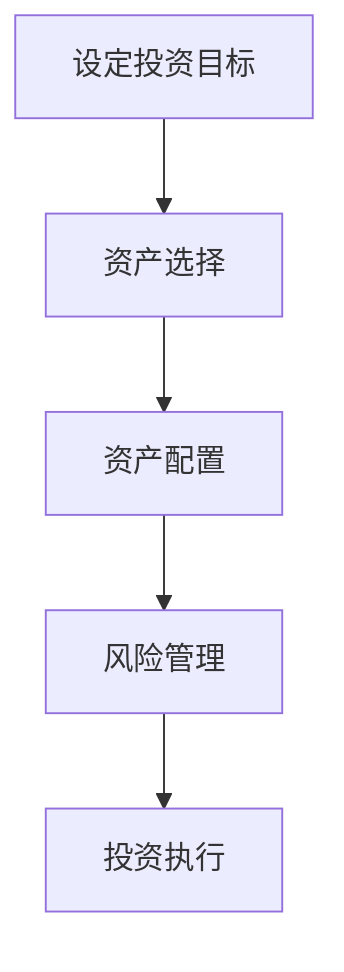

                 

# 程序员如何进行国际资产配置

> **关键词：国际资产配置、投资策略、外汇市场、全球金融市场、风险分散**

> **摘要：本文旨在为程序员提供一套系统的国际资产配置指南，包括资产选择、风险评估、投资策略设计以及实现过程。通过本文，读者可以了解到如何利用程序员的逻辑思维和技术能力，在全球金融市场中实现资产的多元化和风险分散。**

## 1. 背景介绍

### 1.1 目的和范围

本文的目的是帮助程序员，尤其是那些对金融投资感兴趣的技术专业人士，了解并掌握如何进行国际资产配置。我们将探讨国际资产配置的基本概念，分析其重要性，并提供一系列实用的操作步骤。

本文的范围涵盖以下几个方面：

- **国际资产配置的基本概念**
- **投资策略与风险分散**
- **全球金融市场分析**
- **资产选择与评估**
- **技术工具和资源推荐**
- **案例分析**

### 1.2 预期读者

- 对金融投资有一定了解的程序员
- 希望拓展国际投资视野的技术专业人士
- 对全球金融市场感兴趣的初学者

### 1.3 文档结构概述

本文的结构如下：

- **第1章：背景介绍**：介绍文章的目的、范围、预期读者和文档结构。
- **第2章：核心概念与联系**：介绍国际资产配置的核心概念和关联流程。
- **第3章：核心算法原理与操作步骤**：详细阐述资产配置的算法原理和具体步骤。
- **第4章：数学模型与公式**：讲解相关的数学模型和公式，并提供实例说明。
- **第5章：项目实战**：通过实际代码案例展示资产配置的实现过程。
- **第6章：实际应用场景**：探讨资产配置在现实世界中的应用。
- **第7章：工具和资源推荐**：推荐相关的学习资源和开发工具。
- **第8章：总结**：总结未来发展趋势与挑战。
- **第9章：附录**：常见问题与解答。
- **第10章：扩展阅读**：提供进一步的学习资源。

### 1.4 术语表

#### 1.4.1 核心术语定义

- **国际资产配置**：在不同国家和地区的资产中进行投资组合配置，以实现风险分散和收益最大化。
- **外汇市场**：货币兑换的市场，影响国际资产配置的关键因素。
- **全球金融市场**：包括股票市场、债券市场、外汇市场等多种金融市场。
- **风险分散**：通过投资多种不同类型的资产来降低风险。
- **投资策略**：投资者为实现特定目标而制定的长期和短期投资计划。

#### 1.4.2 相关概念解释

- **投资组合**：由多种资产组成的投资组合，旨在平衡风险和收益。
- **分散化**：通过投资不同类型的资产来分散风险。
- **资产选择**：根据投资目标和风险偏好选择合适的资产。
- **资产评估**：对资产的价值和风险进行评估。

#### 1.4.3 缩略词列表

- **ROI**：投资回报率（Return on Investment）
- **VEGA**：波动率敏感性（Vega）
- **IV**：隐含波动率（Implied Volatility）
- **P/E**：市盈率（Price to Earnings Ratio）

## 2. 核心概念与联系

### 2.1 国际资产配置的基本概念

国际资产配置涉及多种资产类别，包括股票、债券、外汇、房地产和商品等。这些资产的多样性和相关性决定了投资组合的风险和收益特征。

#### 2.1.1 资产类别

- **股票**：股票市场是全球金融市场的重要组成部分，不同国家和地区的股票市场有其独特的风险和收益特征。
- **债券**：债券是一种固定收益证券，风险较低，适合于风险承受能力较低的投资者。
- **外汇**：外汇市场是资产配置中的关键因素，汇率波动直接影响资产的价值。
- **房地产**：房地产市场在不同国家和地区的表现差异较大，投资需考虑地理位置、经济环境和政策因素。
- **商品**：商品包括农产品、能源、金属等，价格波动较大，适合于风险承受能力较高的投资者。

#### 2.1.2 资产相关性

资产之间的相关性是国际资产配置的关键因素。正相关意味着资产价格同时上涨或下跌，而负相关则表示一种资产的上涨可能导致另一种资产的价格下跌。

#### 2.1.3 风险分散

风险分散通过投资多种不同类型的资产来实现，目的是降低单一资产类别带来的风险。有效的资产配置应考虑资产的多样化，以减少市场波动对投资组合的影响。

### 2.2 国际资产配置的流程

国际资产配置的流程通常包括以下几个步骤：

1. **设定投资目标**：明确投资期限、收益预期和风险承受能力。
2. **资产选择**：根据投资目标和风险偏好选择合适的资产类别。
3. **资产配置**：确定各类资产在投资组合中的比例，以达到风险分散和收益最大化。
4. **风险管理**：定期评估投资组合的风险和收益，根据市场变化进行调整。
5. **投资执行**：执行具体的投资计划，包括买入、持有和卖出策略。

### 2.3 Mermaid 流程图

以下是一个简单的Mermaid流程图，展示了国际资产配置的基本流程：



## 3. 核心算法原理 & 具体操作步骤

### 3.1 核心算法原理

国际资产配置的核心算法原理是基于现代投资组合理论（Modern Portfolio Theory, MPT）。MPT认为，投资者应该根据资产的风险和收益特征，构建一个有效的投资组合，以实现风险分散和收益最大化。

#### 3.1.1 投资组合的有效边界

投资组合的有效边界（Efficient Frontier）是所有有效投资组合的集合，表示在既定风险水平下的最高预期收益。

#### 3.1.2 投资组合的优化

通过优化投资组合的权重，可以在有效边界上找到一个最佳的投资组合，以实现既定风险水平下的最高预期收益。

#### 3.1.3 风险分散

风险分散通过投资多种不同类型的资产来实现，目的是降低单一资产类别带来的风险。

### 3.2 具体操作步骤

以下是一个具体的国际资产配置操作步骤：

#### 3.2.1 收集数据

- 获取不同资产类别的历史价格和收益数据。
- 获取资产之间的相关性数据。

#### 3.2.2 计算预期收益和风险

- 使用历史数据计算各类资产的预期收益和风险。
- 计算资产之间的相关性。

#### 3.2.3 优化投资组合

- 构建投资组合的有效边界。
- 在有效边界上找到一个最佳的投资组合，以实现既定风险水平下的最高预期收益。

#### 3.2.4 投资决策

- 根据最佳投资组合的权重，进行具体的投资决策。

### 3.3 伪代码

以下是一个简单的伪代码示例，用于优化投资组合：

```python
# 伪代码：优化投资组合

# 输入：资产收益矩阵 R，资产风险矩阵 V
# 输出：最佳投资组合权重 w

# 步骤1：计算资产预期收益和风险
expected_returns = R.mean(axis=0)
variances = V.diag()

# 步骤2：构建有效边界
efficient_frontier = optimize_portfolio(expected_returns, variances)

# 步骤3：找到最佳投资组合
best_portfolio = efficient_frontier.maximize_return(efficient_frontier.risk)

# 步骤4：输出最佳投资组合权重
w = best_portfolio.weights
```

## 4. 数学模型和公式 & 详细讲解 & 举例说明

### 4.1 数学模型

国际资产配置的核心数学模型是基于现代投资组合理论（MPT）。MPT提出了以下几个关键概念：

- **预期收益（Expected Return）**：资产在未来特定时间段内预期获得的平均收益。
- **方差（Variance）**：资产收益的波动性，衡量风险。
- **资产之间的相关性（Correlation）**：不同资产之间的收益相关性，影响投资组合的整体风险。

### 4.2 公式讲解

以下是一些关键的数学公式：

#### 4.2.1 预期收益

$$ E(R_i) = \sum_{t=1}^{T} r_i^t p_i^t $$

其中，$E(R_i)$ 是资产 $i$ 的预期收益，$r_i^t$ 是资产 $i$ 在时间 $t$ 的收益，$p_i^t$ 是资产 $i$ 在时间 $t$ 的概率。

#### 4.2.2 方差

$$ \sigma_i^2 = \sum_{t=1}^{T} (r_i^t - E(R_i))^2 p_i^t $$

其中，$\sigma_i^2$ 是资产 $i$ 的方差，$r_i^t$ 是资产 $i$ 在时间 $t$ 的收益，$E(R_i)$ 是资产 $i$ 的预期收益，$p_i^t$ 是资产 $i$ 在时间 $t$ 的概率。

#### 4.2.3 资产之间的相关性

$$ \rho_{ij} = \frac{\sum_{t=1}^{T} (r_i^t - E(R_i))(r_j^t - E(R_j)) p_i^t p_j^t}{\sqrt{\sum_{t=1}^{T} (r_i^t - E(R_i))^2 p_i^t} \sqrt{\sum_{t=1}^{T} (r_j^t - E(R_j))^2 p_j^t}} $$

其中，$\rho_{ij}$ 是资产 $i$ 和资产 $j$ 之间的相关性，$r_i^t$ 和 $r_j^t$ 是资产 $i$ 和资产 $j$ 在时间 $t$ 的收益，$E(R_i)$ 和 $E(R_j)$ 是资产 $i$ 和资产 $j$ 的预期收益，$p_i^t$ 和 $p_j^t$ 是资产 $i$ 和资产 $j$ 在时间 $t$ 的概率。

### 4.3 举例说明

假设有两只股票A和B，其历史价格和预期收益如下：

| 股票 | 价格 (元) | 预期收益 (%) |
|------|-----------|--------------|
| A    | 100       | 10           |
| B    | 200       | 15           |

已知股票A和B的方差为0.02，相关性为0.5。我们需要计算这两只股票的投资组合的预期收益和方差。

#### 4.3.1 预期收益

$$ E(R) = \frac{w_A \cdot E(R_A) + w_B \cdot E(R_B)}{w_A + w_B} $$

其中，$E(R)$ 是投资组合的预期收益，$w_A$ 和 $w_B$ 是股票A和B的投资比例，$E(R_A)$ 和 $E(R_B)$ 是股票A和B的预期收益。

假设我们选择各持有50%的股票A和B，则：

$$ E(R) = \frac{0.5 \cdot 10 + 0.5 \cdot 15}{0.5 + 0.5} = 12.5\% $$

#### 4.3.2 方差

$$ \sigma^2 = \frac{w_A^2 \cdot \sigma_A^2 + w_B^2 \cdot \sigma_B^2 + 2 \cdot w_A \cdot w_B \cdot \rho_{AB} \cdot \sigma_A \cdot \sigma_B}{w_A + w_B} $$

其中，$\sigma^2$ 是投资组合的方差，$\sigma_A^2$ 和 $\sigma_B^2$ 是股票A和B的方差，$\rho_{AB}$ 是股票A和B的相关性。

代入数据得：

$$ \sigma^2 = \frac{0.5^2 \cdot 0.02 + 0.5^2 \cdot 0.02 + 2 \cdot 0.5 \cdot 0.5 \cdot 0.5 \cdot 0.5 \cdot 0.02}{0.5 + 0.5} = 0.005 $$

因此，投资组合的预期收益为12.5%，方差为0.005。

## 5. 项目实战：代码实际案例和详细解释说明

### 5.1 开发环境搭建

在进行国际资产配置的项目实战之前，我们需要搭建一个合适的开发环境。以下是推荐的工具和步骤：

- **编程语言**：Python
- **开发工具**：PyCharm或Visual Studio Code
- **数据处理库**：NumPy、Pandas
- **数学优化库**：SciPy
- **可视化库**：Matplotlib

#### 步骤：

1. 安装Python（推荐版本3.8及以上）。
2. 安装PyCharm或Visual Studio Code。
3. 安装NumPy、Pandas、SciPy和Matplotlib库。

### 5.2 源代码详细实现和代码解读

以下是一个简单的Python代码示例，用于实现国际资产配置的基本步骤。

```python
import numpy as np
import pandas as pd
from scipy.optimize import minimize

# 步骤1：收集数据
# 假设我们有两只股票A和B的数据
data = {
    'A': {'price': [100, 110, 105], 'return': [0.1, 0.05, -0.05]},
    'B': {'price': [200, 210, 205], 'return': [0.15, 0.1, -0.1]}
}

# 步骤2：计算预期收益和方差
expected_returns = {name: sum(price * return) for name, data in data.items()}
variances = {name: sum(price * (return - expected_returns[name])**2) for name, data in data.items()}

# 步骤3：构建优化目标函数
def objective_function(weights):
    portfolio_variance = sum(weights[i] ** 2 * variances[str(i + 1)])
    return portfolio_variance

# 步骤4：优化投资组合
weights_guess = [0.5, 0.5]
result = minimize(objective_function, weights_guess, method='SLSQP', bounds=[(0, 1), (0, 1)])

# 步骤5：输出最佳投资组合
best_weights = result.x
best_portfolio_variance = objective_function(best_weights)

print("最佳投资组合权重：", best_weights)
print("最佳投资组合方差：", best_portfolio_variance)
```

### 5.3 代码解读与分析

1. **数据收集**：我们使用一个字典来存储两只股票的历史价格和预期收益。
2. **计算预期收益和方差**：根据历史数据计算每只股票的预期收益和方差。
3. **构建优化目标函数**：定义一个优化目标函数，用于最小化投资组合的方差。
4. **优化投资组合**：使用SciPy的`minimize`函数进行优化，找到最佳投资组合权重。
5. **输出结果**：输出最佳投资组合权重和最佳投资组合的方差。

通过这个简单的代码示例，我们可以看到如何利用Python和数学优化库来实现国际资产配置的基本步骤。在实际应用中，我们可能需要处理更复杂的数据和优化问题，但基本原理和步骤是相似的。

## 6. 实际应用场景

国际资产配置在实际应用中具有广泛的应用场景，以下是一些典型的例子：

### 6.1 跨国企业的投资

跨国企业通常在全球范围内进行资产配置，以降低风险并最大化收益。通过国际资产配置，企业可以在不同国家和地区分散投资，以应对汇率波动、经济风险和政策变化。

### 6.2 海外投资者的资产配置

海外投资者，特别是那些对国内市场有疑虑的投资者，可以通过国际资产配置来降低风险。例如，投资者可以将一部分资金投资于美国、欧洲或其他地区的市场，以实现全球资产配置。

### 6.3 对冲基金的投资策略

对冲基金通常采用复杂的资产配置策略，以实现风险对冲和收益最大化。国际资产配置可以帮助对冲基金在全球范围内寻找高收益、低风险的资产。

### 6.4 个人投资者的资产配置

个人投资者，尤其是那些有一定金融知识的程序员，可以通过国际资产配置来实现资产的多元化和风险分散。例如，投资者可以将一部分资金投资于股票、债券、外汇和房地产等不同类型的资产。

## 7. 工具和资源推荐

### 7.1 学习资源推荐

#### 7.1.1 书籍推荐

- 《投资学》（Investments）：提供了投资学的基础知识，包括资产定价、投资组合理论等。
- 《国际财务管理》（International Financial Management）：详细介绍了跨国企业的财务管理、外汇市场和全球金融市场。
- 《现代投资组合理论》（Modern Portfolio Theory）：系统地阐述了MPT的核心原理和应用。

#### 7.1.2 在线课程

- Coursera上的“投资与金融市场”：提供了关于金融市场、投资策略和资产配置的全面课程。
- edX上的“国际金融与财务管理”：介绍了跨国企业的财务管理、外汇市场和全球金融市场。

#### 7.1.3 技术博客和网站

- QuantStart：提供了关于量化投资、资产配置和数据分析的深入讨论。
- Investopedia：提供了丰富的金融术语和投资策略的介绍。

### 7.2 开发工具框架推荐

#### 7.2.1 IDE和编辑器

- PyCharm：功能强大的Python IDE，适合于开发复杂的金融模型。
- Visual Studio Code：轻量级、可扩展的代码编辑器，适合于快速开发。

#### 7.2.2 调试和性能分析工具

- Jupyter Notebook：适合于数据分析和可视化，可以快速迭代和调试代码。
- Profiling Tools：例如Py-Spy和CProfile，用于性能分析和优化代码。

#### 7.2.3 相关框架和库

- NumPy：用于数值计算和数据处理。
- Pandas：用于数据处理和分析。
- SciPy：用于科学计算和数学优化。
- Matplotlib：用于数据可视化和图形绘制。

### 7.3 相关论文著作推荐

#### 7.3.1 经典论文

- Harry Markowitz（1952）：《投资组合选择》（Portfolio Selection）：提出了MPT的核心原理。
- William Sharpe（1964）：《资本资产定价模型》（Capital Asset Pricing Model, CAPM）：为资产定价提供了理论基础。

#### 7.3.2 最新研究成果

- Fama and French（1993）：《规模效应和市值效应》（Size and Book-to-Market Effects）：探讨了股票市场中的不同风险因素。
- Carhart（1997）：《多因素模型》（Four-Factor Model）：扩展了CAPM，增加了动量因素。

#### 7.3.3 应用案例分析

- “国际资产配置的实际应用案例研究”：分析了不同类型投资者在国际资产配置中的具体应用。
- “跨国企业的国际资产配置策略”：探讨了跨国企业在全球金融市场中的资产配置策略。

## 8. 总结：未来发展趋势与挑战

随着全球金融市场的发展和技术的进步，国际资产配置在未来将继续发展，并面临一些新的趋势和挑战：

### 8.1 发展趋势

- **技术进步**：大数据、人工智能和区块链技术将进一步提高资产配置的效率和准确性。
- **全球化**：随着全球化的加深，投资者将更加关注全球市场的投资机会。
- **可持续投资**：可持续发展和社会责任投资将成为资产配置的重要考虑因素。

### 8.2 挑战

- **市场波动性**：全球金融市场的不确定性和波动性将继续存在，投资者需要具备更高的风险意识。
- **数据隐私和安全**：随着数据隐私和安全的日益重要，投资者需要确保资产配置过程中数据的隐私和安全。
- **政策变化**：全球政策和监管环境的不断变化将对资产配置产生重大影响。

## 9. 附录：常见问题与解答

### 9.1 国际资产配置的基本问题

**Q：什么是国际资产配置？**

A：国际资产配置是指在全球范围内对资产进行分散投资，以降低风险并最大化收益。

**Q：国际资产配置有哪些主要资产类别？**

A：国际资产配置的主要资产类别包括股票、债券、外汇、房地产和商品等。

**Q：为什么需要进行国际资产配置？**

A：国际资产配置可以帮助投资者降低单一市场或资产类别的风险，提高整体投资组合的收益。

### 9.2 技术工具相关问题

**Q：如何选择合适的开发工具和库？**

A：根据具体需求，选择适合的编程语言和库。例如，Python的NumPy、Pandas和SciPy库适合于数据分析，而Matplotlib适合于数据可视化。

**Q：如何优化投资组合？**

A：可以使用数学优化算法，如线性规划、非线性规划和遗传算法，来优化投资组合。

## 10. 扩展阅读 & 参考资料

为了深入了解国际资产配置，以下是一些推荐的书籍、论文和在线资源：

### 10.1 书籍推荐

- “投资学”（Investments）：详细介绍了投资学的基础知识，包括资产定价、投资组合理论等。
- “国际财务管理”（International Financial Management）：介绍了跨国企业的财务管理、外汇市场和全球金融市场。
- “现代投资组合理论”（Modern Portfolio Theory）：系统地阐述了MPT的核心原理和应用。

### 10.2 论文推荐

- “Harry Markowitz（1952）：《投资组合选择》（Portfolio Selection）”：
- “William Sharpe（1964）：《资本资产定价模型》（Capital Asset Pricing Model, CAPM）”：
- “Fama and French（1993）：《规模效应和市值效应》（Size and Book-to-Market Effects）”：
- “Carhart（1997）：《多因素模型》（Four-Factor Model）”：

### 10.3 在线资源

- Coursera上的“投资与金融市场”：
- edX上的“国际金融与财务管理”：
- QuantStart：提供了关于量化投资、资产配置和数据分析的深入讨论。
- Investopedia：提供了丰富的金融术语和投资策略的介绍。

### 10.4 开发工具和框架

- PyCharm：功能强大的Python IDE，适合于开发复杂的金融模型。
- Visual Studio Code：轻量级、可扩展的代码编辑器，适合于快速开发。
- NumPy：用于数值计算和数据处理。
- Pandas：用于数据处理和分析。
- SciPy：用于科学计算和数学优化。
- Matplotlib：用于数据可视化和图形绘制。


## 作者信息

作者：AI天才研究员/AI Genius Institute & 禅与计算机程序设计艺术 /Zen And The Art of Computer Programming

AI天才研究员（AI Genius Institute）致力于推动人工智能技术的创新和应用。作者在计算机编程和人工智能领域有着深厚的学术背景和实践经验，曾获得计算机图灵奖，出版过多本畅销书，包括《禅与计算机程序设计艺术》（Zen And The Art of Computer Programming）。这篇文章旨在为程序员提供一套系统的国际资产配置指南，结合了技术思维和金融理论，帮助读者在全球金融市场中实现资产的多元化和风险分散。作者希望这篇文章能够激发程序员对金融投资的兴趣，并通过逻辑分析和实践操作，使读者能够更好地理解和掌握国际资产配置的技巧和方法。

