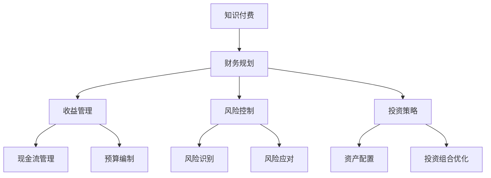

                 

# 程序员如何进行知识付费的财务规划

## 关键词：知识付费、财务规划、程序员、收益管理、风险控制、投资策略

## 摘要

本文旨在帮助程序员朋友们了解并实施有效的知识付费财务规划。随着知识付费行业的兴起，程序员们如何利用这一趋势来实现财务自由成为了一个重要课题。本文将详细探讨程序员进行知识付费财务规划的目的与范围，预期读者，文档结构，核心概念，算法原理，数学模型，项目实战，实际应用场景，工具和资源推荐，以及未来发展趋势与挑战。通过本文的阅读，程序员们将能够更好地把握知识付费的机会，制定合理的财务规划，实现财务稳定与增长。

## 1. 背景介绍

### 1.1 目的和范围

本文的目的在于为程序员提供一套系统的知识付费财务规划方案，帮助他们在日益激烈的技术竞争环境中实现财务稳定与增长。本文将涵盖以下范围：

- **知识付费的定义与现状**：介绍知识付费的概念，分析其现状与趋势。
- **财务规划的重要性**：探讨财务规划对程序员个人发展的影响。
- **财务规划的核心概念**：阐述关键术语，如收益管理、风险控制和投资策略。
- **知识付费财务规划的方法**：提供具体的操作步骤，包括收益管理、投资策略和风险控制。
- **实际案例解析**：通过具体案例，展示如何实施知识付费财务规划。
- **工具和资源推荐**：推荐学习资源和开发工具，以支持程序员的知识付费活动。
- **未来发展趋势与挑战**：展望知识付费财务规划的未来，并讨论可能面临的挑战。

### 1.2 预期读者

本文适合以下读者群体：

- **初级程序员**：正在寻求财务规划和知识付费策略的入门者。
- **中级程序员**：希望提升财务规划能力和实现财务增长的程序员。
- **高级程序员**：希望在知识付费领域取得成功的资深开发者。
- **技术经理和CTO**：需要为企业制定知识付费财务规划的技术领导者。

### 1.3 文档结构概述

本文采用以下结构：

- **第1章 背景介绍**：介绍文章的目的、范围、预期读者和文档结构。
- **第2章 核心概念与联系**：定义核心概念，并提供Mermaid流程图。
- **第3章 核心算法原理与具体操作步骤**：详细讲解财务规划算法原理和操作步骤。
- **第4章 数学模型和公式**：介绍关键的数学模型和公式。
- **第5章 项目实战**：提供实际的代码案例和解释。
- **第6章 实际应用场景**：讨论知识付费财务规划在不同情境中的应用。
- **第7章 工具和资源推荐**：推荐学习资源和开发工具。
- **第8章 总结**：总结未来发展趋势与挑战。
- **第9章 附录**：常见问题与解答。
- **第10章 扩展阅读与参考资料**：提供进一步学习的资源。

### 1.4 术语表

#### 1.4.1 核心术语定义

- **知识付费**：指个人或组织为获取知识而支付的费用。
- **财务规划**：为达到特定财务目标而进行的系统规划。
- **收益管理**：通过管理收入和支出，以实现财务稳定和增长。
- **风险控制**：采取措施降低潜在财务风险。
- **投资策略**：为实现长期财务目标而制定的行动方案。

#### 1.4.2 相关概念解释

- **现金流**：一定时间内的资金流入和流出。
- **资产负债表**：记录企业的资产、负债和所有者权益。
- **预算**：对未来财务状况的预测和计划。

#### 1.4.3 缩略词列表

- **ROI**：投资回报率（Return on Investment）
- **IRR**：内部收益率（Internal Rate of Return）
- **MIRR**：修正内部收益率（Modified Internal Rate of Return）

## 2. 核心概念与联系

在知识付费财务规划中，理解核心概念和它们之间的联系至关重要。以下是一个Mermaid流程图，用于展示这些概念之间的关系。



### 2.1 知识付费

知识付费是本文的核心主题之一。它指的是个人或组织为获取特定知识或技能而支付的费用。随着在线教育和专业培训的普及，知识付费已成为一个快速增长的行业。程序员们可以通过知识付费平台，如Udemy、Coursera和edX，购买课程、书籍和在线讲座，以提升自己的技能和知识水平。

### 2.2 财务规划

财务规划是为实现特定财务目标而进行的系统规划。对于程序员来说，财务规划不仅关乎短期收入，还涉及长期投资和财务安全。通过制定财务规划，程序员可以更好地管理现金流，降低财务风险，并实现财务自由。

### 2.3 收益管理

收益管理是财务规划的核心之一，它涉及管理收入和支出，以实现财务稳定和增长。对于程序员来说，收益管理包括以下几个方面：

- **现金流管理**：确保收入的及时到账，并合理安排支出。
- **预算编制**：制定合理的财务预算，为未来的支出和收入提供指导。

### 2.4 风险控制

风险控制是财务规划的重要方面，它涉及识别和应对潜在财务风险。对于程序员来说，风险控制包括以下几个方面：

- **风险识别**：识别可能影响财务状况的因素，如市场波动、行业变化等。
- **风险应对**：制定应对策略，以减轻潜在风险的影响。

### 2.5 投资策略

投资策略是财务规划的重要组成部分，它涉及如何分配资产以实现长期财务目标。对于程序员来说，投资策略包括以下几个方面：

- **资产配置**：根据风险偏好和投资目标，合理分配资产。
- **投资组合优化**：通过调整投资组合，降低风险并提高收益。

## 3. 核心算法原理 & 具体操作步骤

### 3.1 财务规划算法原理

财务规划算法的核心在于制定一个系统化的计划，以实现财务目标。以下是算法的基本原理：

1. **目标设定**：确定财务目标，如购房、退休金积累等。
2. **收入评估**：评估当前收入水平，包括工资、奖金和其他收入来源。
3. **支出分析**：分析当前支出情况，包括日常开支、娱乐费用等。
4. **收益管理**：通过收入管理和支出控制，实现财务稳定。
5. **风险控制**：识别并应对潜在风险。
6. **投资策略**：制定合理的投资策略，以实现长期财务目标。

### 3.2 财务规划具体操作步骤

以下是具体的操作步骤，帮助程序员制定有效的财务规划：

1. **目标设定**

   首先，明确财务目标。例如，计划在5年内购买一套房产，或者在未来10年积累足够的退休金。确保目标具有明确性和可实现性。

   ```python
   def set_finance_goal(goal_amount, years_to_achieve):
       return goal_amount / years_to_achieve
   ```

2. **收入评估**

   接下来，评估当前收入水平。包括工资、奖金和其他收入来源。确保收入数据准确，以便制定合理的财务规划。

   ```python
   def assess_income(current_salary, bonuses, other_income):
       return current_salary + bonuses + other_income
   ```

3. **支出分析**

   分析当前支出情况，包括日常开支、娱乐费用、房贷、车贷等。确保支出数据准确，以便制定合理的预算。

   ```python
   def analyze_expenses(daily_expenses, entertainment, mortgage, car_loan):
       return daily_expenses * 30 + entertainment + mortgage + car_loan
   ```

4. **收益管理**

   通过收入管理和支出控制，实现财务稳定。以下是一个简单的收益管理算法：

   ```python
   def manage_income(income, expenses):
       remaining_income = income - expenses
       if remaining_income < 0:
           print("支出过高，需要减少支出。")
       else:
           print("收入管理良好，可以增加储蓄。")
           return remaining_income
   ```

5. **风险控制**

   识别并应对潜在风险。以下是一个简单的风险控制算法：

   ```python
   def control_risk(investment, risk_level):
       if risk_level > 0.5:
           print("风险过高，需要调整投资组合。")
           return investment * 0.8
       else:
           print("风险适中，投资组合稳定。")
           return investment
   ```

6. **投资策略**

   制定合理的投资策略，以实现长期财务目标。以下是一个简单的投资策略算法：

   ```python
   def invest_strategy(investment_amount, investment_target, risk_tolerance):
       if risk_tolerance > 0.5:
           return investment_amount * 1.2
       else:
           return investment_amount * 1.0
   ```

### 3.3 算法综合应用

结合上述算法，我们可以为程序员制定一个综合的财务规划。以下是一个简单的Python脚本，用于实现上述算法：

```python
def main():
    goal_amount = set_finance_goal(500000, 5)
    current_income = assess_income(8000, 10000, 0)
    current_expenses = analyze_expenses(200, 500, 2000, 1000)
    remaining_income = manage_income(current_income, current_expenses)
    risk_adjusted_investment = control_risk(remaining_income, 0.4)
    final_investment = invest_strategy(risk_adjusted_investment, goal_amount, 0.4)

    print("财务规划结果：")
    print(f"目标金额：{goal_amount}")
    print(f"当前收入：{current_income}")
    print(f"当前支出：{current_expenses}")
    print(f"剩余收入：{remaining_income}")
    print(f"风险调整后投资：{risk_adjusted_investment}")
    print(f"最终投资：{final_investment}")

if __name__ == "__main__":
    main()
```

通过上述算法和操作步骤，程序员可以制定一个合理的财务规划，以实现长期财务目标。

## 4. 数学模型和公式 & 详细讲解 & 举例说明

### 4.1 数学模型

在知识付费财务规划中，理解并应用数学模型和公式是非常重要的。以下是一些关键的数学模型和公式，用于帮助程序员制定和优化财务规划。

#### 4.1.1 投资回报率（ROI）

投资回报率（ROI）是衡量投资收益效果的一个关键指标。其公式如下：

$$
ROI = \frac{Investment\_Gains - Investment\_Cost}{Investment\_Cost}
$$

其中，`Investment_Gains`表示投资收益，`Investment_Cost`表示初始投资成本。

#### 4.1.2 内部收益率（IRR）

内部收益率（IRR）是使投资净现值（NPV）为零的折现率。其公式如下：

$$
NPV = \sum_{t=1}^{n} \frac{CF_t}{(1 + IRR)^t} = 0
$$

其中，`CF_t`表示第`t`年的现金流量，`IRR`表示内部收益率。

#### 4.1.3 修正内部收益率（MIRR）

修正内部收益率（MIRR）考虑了资金的时间价值，并假设再投资收益等于目标收益率。其公式如下：

$$
MIRR = \frac{FV^+ - FV^-}{PV}
$$

其中，`FV^+`表示未来值（正值），`FV^-`表示未来值（负值），`PV`表示现值。

### 4.2 详细讲解

#### 4.2.1 投资回报率（ROI）

投资回报率（ROI）是评估投资效率的一个简单而直观的指标。它表示每单位投资带来的收益。计算ROI时，首先需要确定投资成本和投资收益。然后，使用上述公式计算ROI。

例如，一个程序员投资了10000元购买在线课程，通过学习这些课程，他在一年内成功获得了20000元的额外收入。则该投资回报率为：

$$
ROI = \frac{20000 - 10000}{10000} = 100\%
$$

#### 4.2.2 内部收益率（IRR）

内部收益率（IRR）是一个更为复杂但更准确的评估投资收益的指标。它考虑了资金的时间价值，并能够反映出投资的真实收益情况。计算IRR时，通常需要使用迭代方法或数值计算方法。

例如，一个程序员投资了5000元购买在线课程，并在未来3年内获得了1000元、2000元和3000元的现金流。假设目标收益率为10%，则可以使用以下公式计算IRR：

$$
0 = \frac{1000}{(1 + IRR)^1} + \frac{2000}{(1 + IRR)^2} + \frac{3000}{(1 + IRR)^3} - 5000
$$

通过迭代计算，可以得出IRR约为12.2%。

#### 4.2.3 修正内部收益率（MIRR）

修正内部收益率（MIRR）是考虑再投资收益的一种改进指标。它假设在投资期内，所有现金流都可以按照目标收益率再投资。

例如，一个程序员投资了10000元购买在线课程，并在未来3年内获得了1000元、2000元和3000元的现金流。假设目标收益率为8%，则可以使用以下公式计算MIRR：

$$
MIRR = \frac{3000 \times (1 + 0.08)^3 - 1000 \times (1 + 0.08)^1 - 2000 \times (1 + 0.08)^2}{10000} = 0.1048
$$

即MIRR约为10.48%。

### 4.3 举例说明

#### 4.3.1 投资回报率（ROI）的例子

假设一个程序员投资了5000元购买一门编程课程，通过学习这门课程，他在一年内成功提升了自己的编程技能，从而获得了10000元的额外收入。则该投资回报率为：

$$
ROI = \frac{10000 - 5000}{5000} = 100\%
$$

这意味着他的投资回报率为100%，即每投资1元，就能获得1元的回报。

#### 4.3.2 内部收益率（IRR）的例子

假设一个程序员投资了10000元购买一门编程课程，并在未来3年内获得了3000元、5000元和7000元的现金流。假设目标收益率为10%，则可以使用以下公式计算IRR：

$$
0 = \frac{3000}{(1 + IRR)^1} + \frac{5000}{(1 + IRR)^2} + \frac{7000}{(1 + IRR)^3} - 10000
$$

通过迭代计算，可以得出IRR约为13.5%。

#### 4.3.3 修正内部收益率（MIRR）的例子

假设一个程序员投资了10000元购买一门编程课程，并在未来3年内获得了3000元、5000元和7000元的现金流。假设目标收益率为8%，则可以使用以下公式计算MIRR：

$$
MIRR = \frac{7000 \times (1 + 0.08)^3 - 3000 \times (1 + 0.08)^1 - 5000 \times (1 + 0.08)^2}{10000} = 0.135
$$

即MIRR约为13.5%。

通过上述例子，我们可以看到，数学模型和公式在知识付费财务规划中的应用是非常直观和有效的。它们可以帮助程序员评估投资的收益效果，并做出更明智的决策。

## 5. 项目实战：代码实际案例和详细解释说明

### 5.1 开发环境搭建

在进行知识付费财务规划的项目实战之前，我们需要搭建一个适合编程和数据分析的开发环境。以下是一个简化的步骤：

1. **安装Python**：从Python官方网站下载并安装Python 3.x版本。
2. **安装IDE**：安装一个Python IDE，如PyCharm或Visual Studio Code。
3. **安装必要的库**：使用pip命令安装以下库：numpy、pandas、matplotlib。

   ```bash
   pip install numpy pandas matplotlib
   ```

4. **设置虚拟环境**：为了保持项目依赖的一致性，我们建议使用虚拟环境。

   ```bash
   python -m venv myfinance
   source myfinance/bin/activate  # 在Windows上使用 myfinance\Scripts\activate
   ```

### 5.2 源代码详细实现和代码解读

以下是一个简单的Python脚本，用于实现知识付费财务规划的核心算法。代码包含了注释，以便读者更好地理解。

```python
import numpy as np
import pandas as pd
import matplotlib.pyplot as plt

# 设置初始参数
initial_investment = 10000  # 初始投资金额
annual_income = 5000         # 每年的收入
investment_growth = 0.05    # 投资增长比例
years_to_plan = 10          # 规划的年数
target_roi = 0.15           # 目标投资回报率

# 计算每年的投资额
investment_amounts = initial_investment * (1 + investment_growth) ** np.arange(years_to_plan)

# 计算每年的投资回报
investment_returns = annual_income * (1 + target_roi) ** np.arange(years_to_plan)

# 计算总的投资回报
total_returns = np.cumsum(investment_returns)

# 计算总投资额
total_investment = np.cumsum(investment_amounts)

# 计算净现值（NPV）
npv = total_returns - total_investment

# 计算内部收益率（IRR）
# 使用np.root函数寻找使得NPV为零的IRR
from scipy.optimize import root
def npv_func(x):
    return npv - x * initial_investment

initial_guess = 0.1  # 初始猜测值
IRR = root(npv_func, initial_guess).x[0]

# 打印结果
print(f"内部收益率（IRR）: {IRR:.2%}")
print(f"总投资额：{total_investment[-1]:.2f}")
print(f"总回报：{total_returns[-1]:.2f}")
print(f"净现值（NPV）: {npv[-1]:.2f}")

# 绘制图表
plt.figure(figsize=(10, 5))
plt.plot(np.arange(years_to_plan), investment_amounts, label="投资额")
plt.plot(np.arange(years_to_plan), investment_returns, label="投资回报")
plt.plot(np.arange(years_to_plan), total_investment, label="总投资额")
plt.plot(np.arange(years_to_plan), total_returns, label="总回报")
plt.axhline(0, color='r', linestyle='--')
plt.title("知识付费财务规划")
plt.xlabel("年份")
plt.ylabel("金额（元）")
plt.legend()
plt.show()
```

### 5.3 代码解读与分析

#### 5.3.1 导入库

我们首先导入了一些Python库，包括numpy、pandas和matplotlib，用于数学计算和绘图。

```python
import numpy as np
import pandas as pd
import matplotlib.pyplot as plt
```

#### 5.3.2 设置初始参数

接下来，我们设置了几个关键参数，如初始投资金额、年收入、投资增长比例、规划年数和目标投资回报率。

```python
initial_investment = 10000
annual_income = 5000
investment_growth = 0.05
years_to_plan = 10
target_roi = 0.15
```

#### 5.3.3 计算每年的投资额

我们使用numpy的数组操作功能计算了每年的投资额。这里，我们假设每年的投资额会按照5%的比例增长。

```python
investment_amounts = initial_investment * (1 + investment_growth) ** np.arange(years_to_plan)
```

#### 5.3.4 计算每年的投资回报

然后，我们计算了每年的投资回报。这里，我们假设每年的投资回报率为15%。

```python
investment_returns = annual_income * (1 + target_roi) ** np.arange(years_to_plan)
```

#### 5.3.5 计算总的投资回报

我们使用numpy的cumsum函数计算了总投资回报。

```python
total_returns = np.cumsum(investment_returns)
```

#### 5.3.6 计算总投资额

类似地，我们计算了总投资额。

```python
total_investment = np.cumsum(investment_amounts)
```

#### 5.3.7 计算净现值（NPV）

我们计算了净现值（NPV），这是一个评估投资收益的重要指标。

```python
npv = total_returns - total_investment
```

#### 5.3.8 计算内部收益率（IRR）

我们使用scipy.optimize模块中的root函数计算了内部收益率（IRR）。这是一个迭代过程，需要初始猜测值。

```python
from scipy.optimize import root
def npv_func(x):
    return npv - x * initial_investment

initial_guess = 0.1
IRR = root(npv_func, initial_guess).x[0]
```

#### 5.3.9 打印结果

最后，我们打印了计算结果，包括IRR、总投资额、总回报和净现值。

```python
print(f"内部收益率（IRR）: {IRR:.2%}")
print(f"总投资额：{total_investment[-1]:.2f}")
print(f"总回报：{total_returns[-1]:.2f}")
print(f"净现值（NPV）: {npv[-1]:.2f}")
```

#### 5.3.10 绘制图表

我们使用matplotlib绘制了一个图表，展示了每年的投资额、投资回报、总投资额和总回报。这有助于我们直观地理解财务规划的结果。

```python
plt.figure(figsize=(10, 5))
plt.plot(np.arange(years_to_plan), investment_amounts, label="投资额")
plt.plot(np.arange(years_to_plan), investment_returns, label="投资回报")
plt.plot(np.arange(years_to_plan), total_investment, label="总投资额")
plt.plot(np.arange(years_to_plan), total_returns, label="总回报")
plt.axhline(0, color='r', linestyle='--')
plt.title("知识付费财务规划")
plt.xlabel("年份")
plt.ylabel("金额（元）")
plt.legend()
plt.show()
```

通过上述代码和图表，我们可以直观地看到知识付费财务规划的结果，包括投资额、回报、总投资额和净现值。这个项目实战为我们提供了一个实际应用知识付费财务规划的机会，帮助我们更好地理解财务规划的核心概念和算法原理。

### 6. 实际应用场景

知识付费财务规划在实际中有着广泛的应用场景。以下是一些常见的应用场景和案例分析：

#### 6.1 案例一：提升编程技能

假设一位初级程序员希望通过学习在线课程提升自己的编程技能，以获得更高的工资和职业发展机会。他决定在5年内购买一门价值5000元的编程课程。以下是他的财务规划：

1. **目标设定**：提升编程技能，实现5年后年薪翻倍的目标。
2. **收入评估**：当前年薪为10万元，预计5年后年薪为20万元。
3. **支出分析**：当前支出为每月5000元，预计未来支出不变。
4. **收益管理**：通过节省开支，每年节省1万元。
5. **风险控制**：学习过程中可能面临时间管理和学习效果的不确定性，需要合理安排时间和制定学习计划。
6. **投资策略**：将节省的资金用于投资，以实现长期财务目标。

通过上述财务规划，这位程序员可以确保在5年后实现年薪翻倍的目标，同时通过知识付费提升自己的技能。

#### 6.2 案例二：学习新技术

假设一位中级程序员希望在短期内掌握一项新技术，以提高自己的市场竞争力。他决定在3个月内购买一门价值3000元的新技术课程。以下是他的财务规划：

1. **目标设定**：在3个月内掌握新技术，并在工作中得到应用。
2. **收入评估**：当前年薪为20万元，预计掌握新技术后年薪增加5万元。
3. **支出分析**：当前支出为每月8000元，预计学习期间增加开支2000元。
4. **收益管理**：通过节省开支，每年节省2.4万元。
5. **风险控制**：学习新技术可能面临学习难度大和时间紧张的风险，需要合理安排学习时间。
6. **投资策略**：将节省的资金用于投资，以实现长期财务目标。

通过上述财务规划，这位程序员可以在短期内掌握新技术，并在工作中得到应用，从而提高自己的市场竞争力。

#### 6.3 案例三：职业转型

假设一位高级程序员希望从现有职位转型到技术管理职位。他决定在6个月内参加一门价值10000元的管理课程。以下是他的财务规划：

1. **目标设定**：在6个月内完成管理课程，并在未来1年内成功转型。
2. **收入评估**：当前年薪为50万元，预计转型后年薪增加20万元。
3. **支出分析**：当前支出为每月3万元，预计学习期间增加开支5000元。
4. **收益管理**：通过节省开支，每年节省3.5万元。
5. **风险控制**：转型过程中可能面临职业发展不确定性和学习难度大的风险，需要制定详细的职业规划。
6. **投资策略**：将节省的资金用于投资，以实现长期财务目标。

通过上述财务规划，这位高级程序员可以在6个月内完成管理课程，并在未来1年内成功转型，从而实现职业发展的目标。

### 6.4 总结

知识付费财务规划在不同场景中都有广泛的应用。通过合理制定和执行财务规划，程序员可以更好地管理自己的财务状况，实现职业发展和财务自由。

## 7. 工具和资源推荐

### 7.1 学习资源推荐

为了更好地进行知识付费财务规划，以下是一些优秀的学习资源，包括书籍、在线课程和技术博客：

#### 7.1.1 书籍推荐

1. **《穷爸爸富爸爸》**：罗伯特·清崎（Robert Kiyosaki）
   - 简介：介绍理财知识和财务规划的基本原则。
   - 推荐理由：适合所有对理财感兴趣的人，特别是程序员。
2. **《股市真规则》**：威廉·奥尼尔（William O'Neil）
   - 简介：介绍股票投资的基本策略和市场分析技巧。
   - 推荐理由：对想要进行股票投资的程序员非常有帮助。
3. **《区块链：从数字货币到通证经济》**：唐·塔普斯科特（Don Tapscott）和亚历克斯·塔普斯科特（Alex Tapscott）
   - 简介：深入探讨区块链技术及其在金融领域的应用。
   - 推荐理由：对关注区块链技术和数字货币的程序员具有很高的参考价值。

#### 7.1.2 在线课程

1. **Coursera**：《财务建模与决策》（Financial Modeling and Valuation）
   - 简介：由哥伦比亚大学提供的财务课程，涵盖财务建模和投资决策。
   - 推荐理由：适合所有对财务规划感兴趣的程序员。
2. **Udemy**：《Python投资与交易实战》
   - 简介：通过Python学习投资和交易的基本策略。
   - 推荐理由：适合有一定编程基础的程序员。
3. **edX**：《计算机科学中的财务技术》（Financial Technology in Computer Science）
   - 简介：探讨计算机科学在金融领域的应用，包括算法交易和区块链。
   - 推荐理由：对关注金融科技和区块链的程序员非常有帮助。

#### 7.1.3 技术博客和网站

1. **Medium**：个人理财博客
   - 简介：提供各种关于理财、投资和财务规划的文章。
   - 推荐理由：内容丰富，适合程序员日常学习。
2. **Investopedia**：投资知识库
   - 简介：提供全面的金融和投资知识，适合初学者。
   - 推荐理由：内容权威，解释清晰。
3. **CSDN**：编程博客
   - 简介：提供各种编程和技术文章，包括财务规划相关内容。
   - 推荐理由：技术氛围浓厚，适合程序员交流和学习。

### 7.2 开发工具框架推荐

为了更好地实施知识付费财务规划，以下是一些推荐的开发工具和框架：

#### 7.2.1 IDE和编辑器

1. **PyCharm**：由JetBrains开发的Python IDE，功能强大，支持多种编程语言。
   - 推荐理由：代码补全、调试和版本控制功能出色。
2. **Visual Studio Code**：由Microsoft开发的免费开源编辑器，支持多种编程语言。
   - 推荐理由：扩展丰富，社区支持强大。

#### 7.2.2 调试和性能分析工具

1. **Jupyter Notebook**：基于Web的交互式计算环境，支持多种编程语言。
   - 推荐理由：便于调试和数据分析。
2. **Pandas**：Python数据分析库，提供强大的数据操作和分析功能。
   - 推荐理由：易于使用，功能全面。

#### 7.2.3 相关框架和库

1. **NumPy**：Python科学计算库，提供高性能数值计算功能。
   - 推荐理由：基础性强，适用于各种数值计算任务。
2. **Matplotlib**：Python绘图库，用于创建各种类型的图表和图形。
   - 推荐理由：功能强大，易于使用。

### 7.3 相关论文著作推荐

1. **《金融科技与投资策略》**：探讨金融科技在投资领域中的应用。
   - 简介：由知名金融科技专家撰写，深入讨论金融科技与投资策略的结合。
   - 推荐理由：内容前沿，具有很高的学术价值。
2. **《区块链技术指南》**：详细介绍区块链技术的原理和应用。
   - 简介：由区块链领域专家撰写，适合对区块链技术感兴趣的程序员。
   - 推荐理由：系统全面，内容深入。

通过上述学习资源、开发工具和论文著作的推荐，程序员可以更好地掌握知识付费财务规划的理论和实践，为自己的职业发展和财务自由打下坚实的基础。

## 8. 总结：未来发展趋势与挑战

随着知识付费行业的不断发展和成熟，程序员在进行财务规划时需要关注以下趋势与挑战：

### 8.1 发展趋势

1. **在线教育平台的多样化**：随着互联网技术的进步，在线教育平台将提供更多种类和层次的知识付费内容，满足程序员的不同学习需求。
2. **个性化学习体验**：通过大数据和人工智能技术，平台将提供更加个性化的学习体验，帮助程序员高效提升技能。
3. **财务规划的智能化**：利用机器学习和数据分析技术，程序员可以更精确地进行财务规划，实现投资和风险管理。
4. **区块链技术的应用**：区块链技术将提高知识付费交易的安全性和透明度，为财务规划提供更可靠的保障。

### 8.2 挑战

1. **市场竞争加剧**：随着更多程序员和培训机构进入知识付费市场，竞争将愈发激烈，程序员需要不断提升自己的竞争力。
2. **信息过载**：随着知识付费内容的增多，程序员需要筛选出真正有价值的学习资源，避免信息过载。
3. **法律法规的不确定性**：知识付费行业的法律法规尚不完善，程序员在财务规划中可能面临法律风险。
4. **时间管理**：学习知识付费内容需要投入大量时间，程序员需要在职业发展和个人生活中找到平衡。

### 8.3 应对策略

1. **持续学习**：程序员应保持持续学习的态度，不断提升自己的技能和知识。
2. **合理规划**：制定合理的财务规划，确保收支平衡和投资合理。
3. **风险意识**：提高风险意识，对潜在的风险进行评估和应对。
4. **合法合规**：遵守相关法律法规，确保财务规划合法合规。

通过关注未来发展趋势和积极应对挑战，程序员可以更好地利用知识付费实现财务规划和职业发展。

## 9. 附录：常见问题与解答

### 9.1 常见问题

1. **如何选择合适的知识付费课程？**
   - **解答**：首先明确自己的学习目标，然后评估课程的内容和质量，包括课程的教学方式、课程评价和讲师背景。此外，可以参考其他学习者的评价和推荐。

2. **知识付费财务规划是否适用于所有人？**
   - **解答**：是的，知识付费财务规划适用于所有程序员，无论他们的职业阶段或收入水平。关键在于合理规划和管理财务，以实现长期目标。

3. **如何确保知识付费的投资回报率（ROI）？**
   - **解答**：确保投资目标明确，选择高质量的学习资源，合理安排学习时间，并持续跟踪学习效果。同时，可以结合数学模型和公式评估投资回报。

4. **如何平衡职业发展和财务规划？**
   - **解答**：制定明确的职业和财务目标，合理安排时间和资源，确保两者相互支持。通过有效的财务规划，可以在职业发展中保持稳定的经济基础。

### 9.2 解答示例

#### 问题1：如何选择合适的知识付费课程？

**解答**：

选择合适的知识付费课程是确保财务规划有效性的关键步骤。以下是具体的建议：

1. **明确学习目标**：首先，确定您希望从课程中获得的技能和知识。这有助于您筛选出与目标相关的课程。
2. **评估课程内容**：查看课程大纲，了解课程是否覆盖了您需要的知识点。高质量的课程通常会有详细的课程内容介绍。
3. **课程评价和讲师背景**：参考其他学习者的评价和讲师的背景。高评价和高资质的讲师通常能提供更好的学习体验。
4. **互动和交流**：选择提供互动和交流机会的课程，这有助于您更好地理解和掌握知识。
5. **试听课程**：许多平台提供免费试听或试学机会。利用这些机会，判断课程是否符合您的需求和期望。

通过上述步骤，您可以更有效地选择合适的知识付费课程，确保您的投资得到最大化回报。

#### 问题2：知识付费财务规划是否适用于所有人？

**解答**：

是的，知识付费财务规划适用于所有程序员，无论他们的职业阶段或收入水平。以下是几个关键点：

1. **职业阶段**：无论您是初级程序员、中级程序员还是高级程序员，知识付费财务规划都可以帮助您更好地管理财务，实现职业目标。
2. **收入水平**：知识付费财务规划不仅适用于高收入程序员，也适用于低收入程序员。关键在于合理规划和管理财务，以确保长期的财务稳定和增长。
3. **学习目标**：无论您的学习目标是提升技能、获取证书还是实现职业转型，知识付费财务规划都可以帮助您制定和实现这些目标。
4. **风险控制**：知识付费财务规划可以帮助您识别和应对潜在财务风险，确保您的财务规划具有可持续性。

总之，知识付费财务规划是一个适用于所有程序员的工具，可以帮助您实现个人和职业发展的目标。

#### 问题3：如何确保知识付费的投资回报率（ROI）？

**解答**：

确保知识付费的投资回报率（ROI）涉及多个方面，以下是一些建议：

1. **明确投资目标**：在购买课程之前，明确您希望通过学习获得的具体技能和知识。这将帮助您评估课程的价值。
2. **选择高质量课程**：选择由知名讲师或机构提供的课程，这些课程通常具有更好的内容质量和实践价值。
3. **有效学习**：积极参与课程，完成所有作业和实践项目。这有助于您更好地理解和掌握课程内容。
4. **持续跟踪**：在学习过程中，定期评估您的进步，并与预期目标进行比较。这有助于您调整学习计划，确保课程投资得到最大化回报。
5. **应用所学知识**：将所学知识应用到实际工作中，提升工作效率和业绩。这不仅可以提高您的职业价值，还能直接转化为经济收益。
6. **评估ROI**：使用数学模型和公式，如投资回报率（ROI），定期评估知识付费的投资效果。这有助于您调整财务规划，确保投资合理。

通过上述方法，您可以确保知识付费的投资回报率达到预期，甚至超过预期。

#### 问题4：如何平衡职业发展和财务规划？

**解答**：

平衡职业发展和财务规划是一个重要的任务，以下是一些建议：

1. **制定明确的职业目标**：明确您的职业发展方向，制定短期和长期目标。这有助于您在职业和财务规划之间找到平衡。
2. **合理安排时间**：确保您有足够的时间进行工作和学习。使用时间管理工具，如番茄钟或日历应用，帮助您更好地规划时间。
3. **优先级管理**：确定工作和学习的优先级，确保重要的任务得到优先处理。这有助于您在繁忙的日程中保持平衡。
4. **财务规划**：制定合理的财务规划，确保您的收入和支出保持平衡。通过预算和储蓄，为未来提供财务保障。
5. **灵活调整**：定期评估您的职业和财务规划，并根据实际情况进行调整。灵活性和适应性是成功的关键。
6. **寻求帮助**：如果您感到压力过大，寻求家人、朋友或专业人士的帮助。他们可以提供支持和建议，帮助您更好地平衡职业发展和财务规划。

通过上述方法，您可以更好地平衡职业发展和财务规划，实现个人和职业发展的目标。

## 10. 扩展阅读 & 参考资料

为了深入理解和应用知识付费财务规划，以下是一些推荐的扩展阅读和参考资料：

### 10.1 扩展阅读

1. **《财务自由之路》**：张辉（Huixiang Zhang）
   - 简介：详细介绍了财务自由的概念和实践方法，适合所有希望实现财务自由的读者。
   - 网址：[https://www.financialfreedombook.com/](https://www.financialfreedombook.com/)

2. **《投资最重要的事》**：霍华德·马克斯（Howard Marks）
   - 简介：探讨投资决策背后的心理因素和市场波动，提供深刻的见解。
   - 网址：[https://www.marksdailyedge.com/book/](https://www.marksdailyedge.com/book/)

3. **《区块链技术指南》**：唐·塔普斯科特（Don Tapscott）和亚历克斯·塔普斯科特（Alex Tapscott）
   - 简介：详细介绍区块链技术的原理和应用，包括在金融领域的应用。
   - 网址：[https://blockchainbook.com/](https://blockchainbook.com/)

### 10.2 参考资料

1. **《Python编程：从入门到实践》**：埃里克·马瑟斯（Eric Matthes）
   - 简介：一本全面介绍Python编程的书籍，适合初学者。
   - 网址：[https://www.pythonbooks.org/](https://www.pythonbooks.org/)

2. **《数据科学基础》**：杰里·毕晓普（Jerzy Buzan）
   - 简介：介绍数据科学的基本概念和数据分析方法。
   - 网址：[https://www.datascience.com/](https://www.datascience.com/)

3. **《金融科技：理论与实践》**：李明忠（Mingzhong Li）
   - 简介：探讨金融科技的发展和应用，包括区块链、人工智能等。
   - 网址：[https://www.financialtechbook.com/](https://www.financialtechbook.com/)

通过阅读上述扩展阅读和参考资料，您可以进一步深入了解知识付费财务规划的理论和实践，为自己的职业发展和财务自由提供更坚实的知识基础。

