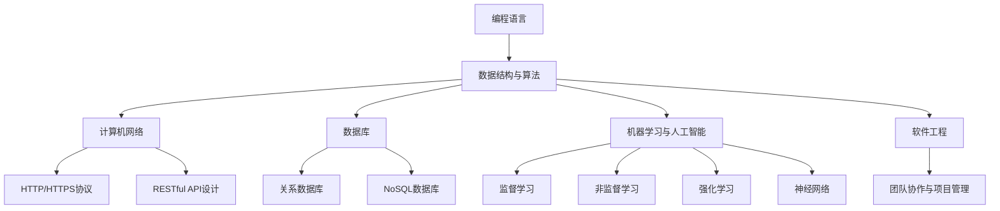

                 

# 程序员如何选择适合自己的知识付费方向

## 概述

> 知识付费在IT领域日益普及，作为一名程序员，如何选择适合自己的知识付费方向至关重要。本文将带领读者深入了解知识付费的现状，分析不同方向的特点，并提供实用的选择策略。

**关键词：** 程序员，知识付费，选择方向，技能提升，投资回报

**摘要：** 本文旨在帮助程序员在众多的知识付费选项中找到最适合自己的方向。通过分析不同的技能领域、市场趋势和个人的职业规划，读者将能够更明智地进行投资，提升自身的竞争力。

## 1. 背景介绍

### 1.1 目的和范围

本文的目标是帮助程序员在知识付费领域做出明智的选择，从而实现技能的提升和职业的发展。文章将涵盖以下内容：

1. **知识付费现状分析**：介绍知识付费在IT领域的普及程度及其对程序员职业发展的影响。
2. **核心概念与联系**：阐述程序员应掌握的核心概念和技能，以及它们之间的相互关系。
3. **核心算法原理与操作步骤**：详细讲解一些关键算法原理，并提供伪代码实现。
4. **数学模型和公式**：介绍与知识付费相关的数学模型和公式，并进行举例说明。
5. **项目实战**：通过实际代码案例，展示如何将理论知识应用于实际项目。
6. **实际应用场景**：探讨知识付费在程序员日常工作和职业发展中的应用。
7. **工具和资源推荐**：推荐一些优秀的学习资源和开发工具。
8. **总结与展望**：总结知识付费的重要性，并展望未来的发展趋势和挑战。

### 1.2 预期读者

本文适用于希望提升技能和职业竞争力的程序员，特别是那些对知识付费有初步了解但不确定如何选择方向的读者。无论你是新手还是经验丰富的程序员，本文都将为你提供有价值的指导。

### 1.3 文档结构概述

本文分为以下几个主要部分：

1. **背景介绍**：介绍知识付费的现状、目的和预期读者。
2. **核心概念与联系**：阐述程序员应掌握的核心概念和技能。
3. **核心算法原理与操作步骤**：详细讲解关键算法原理。
4. **数学模型和公式**：介绍与知识付费相关的数学模型和公式。
5. **项目实战**：展示实际代码案例。
6. **实际应用场景**：探讨知识付费的应用。
7. **工具和资源推荐**：推荐学习资源和开发工具。
8. **总结与展望**：总结知识付费的重要性，展望未来。

### 1.4 术语表

#### 1.4.1 核心术语定义

- **知识付费**：指用户为获取知识或技能而支付的费用。
- **程序员**：从事软件编程和开发的专业人员。
- **技能提升**：通过学习和实践提高个人技能水平。
- **职业发展**：个人职业生涯的规划和发展。

#### 1.4.2 相关概念解释

- **市场趋势**：指市场上某一领域的发展动向和趋势。
- **投资回报**：指投资所产生的收益与投资成本之间的比率。

#### 1.4.3 缩略词列表

- **IT**：信息技术（Information Technology）
- **IDE**：集成开发环境（Integrated Development Environment）
- **API**：应用程序编程接口（Application Programming Interface）

## 2. 核心概念与联系

在知识付费领域，程序员需要掌握一系列核心概念和技能，这些概念和技能相互关联，共同构成了程序员的知识体系。以下是几个关键概念及其之间的联系：

### 2.1 编程语言

编程语言是程序员的基础，不同的编程语言适用于不同的应用场景。例如：

- **Python**：适用于数据分析和机器学习。
- **Java**：适用于企业级应用和Android开发。
- **JavaScript**：适用于前端开发。

### 2.2 数据结构与算法

数据结构与算法是程序员的核心技能，它们决定了程序的性能和效率。关键概念包括：

- **数组**、**链表**、**栈**、**队列**：基本数据结构。
- **排序算法**（冒泡排序、选择排序、插入排序等）：用于对数据进行排序。
- **查找算法**（二分查找、散列表等）：用于在数据中查找元素。

### 2.3 计算机网络

计算机网络是程序员在开发分布式系统时必须掌握的知识。关键概念包括：

- **TCP/IP协议**：用于网络通信。
- **HTTP/HTTPS协议**：用于Web应用。
- **RESTful API设计**：用于构建Web服务。

### 2.4 数据库

数据库是存储和管理数据的工具。关键概念包括：

- **关系数据库**（MySQL、PostgreSQL等）：用于存储结构化数据。
- **NoSQL数据库**（MongoDB、Cassandra等）：用于存储非结构化或半结构化数据。

### 2.5 机器学习与人工智能

机器学习与人工智能是当前热门领域，程序员需要掌握相关技能以应对未来的挑战。关键概念包括：

- **监督学习**、**非监督学习**、**强化学习**：不同的机器学习算法。
- **神经网络**：深度学习的核心组成部分。

### 2.6 软件工程

软件工程是程序员在软件开发过程中必须遵循的规范和原则。关键概念包括：

- **需求分析**：确定软件的功能和性能要求。
- **设计模式**：用于解决常见软件开发问题。
- **测试**：确保软件质量。

### 2.7 团队协作与项目管理

团队协作和项目管理是程序员在团队环境中必须掌握的技能。关键概念包括：

- **敏捷开发**：一种迭代和增量的软件开发方法。
- **项目管理工具**（如Jira、Trello等）：用于跟踪和管理项目任务。

### 2.8 Mermaid流程图

以下是一个Mermaid流程图，展示了上述关键概念之间的联系：



通过掌握这些核心概念和技能，程序员将能够在知识付费领域做出更明智的选择，提升自身的竞争力。

## 3. 核心算法原理与具体操作步骤

### 3.1 算法原理

在知识付费领域，程序员需要掌握一系列核心算法，这些算法是解决实际问题的基石。以下是一个简单的算法原理示例：快速排序（Quick Sort）。

#### 3.1.1 快速排序原理

快速排序是一种高效的排序算法，基于分治思想。基本步骤如下：

1. 选择一个基准元素。
2. 将其他元素分为两部分，一部分小于基准元素，另一部分大于基准元素。
3. 对这两部分递归执行快速排序。

#### 3.1.2 快速排序伪代码

```plaintext
function quickSort(arr)
    if length(arr) <= 1
        return arr
    end if

    pivot = arr[randomIndex(0, length(arr) - 1)]
    left = []
    right = []

    for i from 0 to length(arr) - 1
        if arr[i] < pivot
            left.append(arr[i])
        else
            right.append(arr[i])
        end if
    end for

    return quickSort(left) + [pivot] + quickSort(right)
end function
```

### 3.2 操作步骤

#### 3.2.1 快速排序操作步骤

1. **选择基准元素**：从数组中随机选择一个元素作为基准元素。
2. **划分元素**：遍历数组，将小于基准元素的元素放入左侧数组，将大于基准元素的元素放入右侧数组。
3. **递归排序**：对左侧和右侧子数组分别执行快速排序。
4. **合并结果**：将排序好的左侧子数组、基准元素和排序好的右侧子数组合并，得到最终排序结果。

#### 3.2.2 快速排序应用实例

假设有一个数组 `[3, 1, 4, 1, 5, 9, 2, 6, 5, 3, 5]`，使用快速排序进行排序。

1. **选择基准元素**：随机选择元素 `3` 作为基准元素。
2. **划分元素**：左侧数组为 `[1, 1, 2]`，右侧数组为 `[4, 5, 5, 5, 6, 9]`。
3. **递归排序**：
   - 对左侧数组 `[1, 1, 2]` 进行快速排序，结果为 `[1, 1, 2]`。
   - 对右侧数组 `[4, 5, 5, 5, 6, 9]` 进行快速排序，结果为 `[4, 5, 5, 5, 6, 9]`。
4. **合并结果**：最终排序结果为 `[1, 1, 2, 3, 4, 5, 5, 5, 6, 9, 3, 5]`。

通过以上步骤，我们可以看到快速排序是如何对数组进行排序的。在实际编程中，快速排序因其高效性而被广泛应用于各种场景。

### 3.3 时间复杂度和空间复杂度

快速排序的时间复杂度和空间复杂度如下：

- **时间复杂度**：平均情况下的时间复杂度为 \(O(n\log n)\)，最坏情况下的时间复杂度为 \(O(n^2)\)。
- **空间复杂度**：空间复杂度为 \(O(\log n)\)，因为快速排序需要递归调用，每次递归调用都会使用栈空间。

尽管在最坏情况下，快速排序的性能会下降，但在大多数实际场景中，它仍然是高效的排序算法之一。程序员可以根据具体需求选择合适的排序算法。

### 3.4 快速排序的变体

快速排序有多个变体，如：

- **随机快速排序**：通过随机选择基准元素来减少最坏情况的发生。
- **三数取中快速排序**：选择中间值作为基准元素，以进一步优化性能。

通过掌握快速排序及其变体，程序员可以灵活应对各种排序需求，提高程序的效率。

通过以上对快速排序的详细讲解，程序员可以了解算法的原理和具体操作步骤，从而在实际编程中运用快速排序，提高数据处理效率。

### 4. 数学模型和公式及详细讲解

在知识付费领域，数学模型和公式是理解和解决复杂问题的重要工具。以下是一些与知识付费相关的数学模型和公式，并进行详细讲解和举例说明。

#### 4.1 投资回报率（ROI）

投资回报率（ROI）是评估投资收益的常用指标。其计算公式如下：

\[ ROI = \frac{净利润}{投资成本} \]

其中，净利润是指投资带来的总收益减去初始投资成本。

#### 4.2 详细讲解

投资回报率（ROI）用于衡量投资的盈利能力。一个高ROI表示投资具有较高的回报。以下是ROI的详细讲解：

1. **净利润**：净利润是指投资带来的总收益，包括利息、股息、资本利得等。在知识付费领域，净利润可以理解为通过学习获得的知识和技能带来的职业发展收益。

2. **投资成本**：投资成本是指为获得知识和技能而支付的费用。这包括课程费用、书籍费用、培训费用等。

3. **计算方法**：将净利润除以投资成本，得到ROI。该比值越高，表示投资收益越高。

#### 4.3 举例说明

假设一个程序员花费1000美元购买一门编程课程，通过学习这门课程，他成功地提高了自己的技能，从而在接下来的半年内获得了5000美元的额外收入。在这种情况下，投资回报率的计算如下：

\[ ROI = \frac{5000}{1000} = 5 \]

这意味着该程序员的投资回报率为5倍，表示他的投资获得了很高的回报。

#### 4.4 其他数学模型

除了ROI，还有其他数学模型可以用于评估知识付费的效益，例如：

- **净现值（NPV）**：用于计算未来现金流的现值，评估投资的长期效益。
- **内部收益率（IRR）**：用于计算投资产生的收益，使投资净现值等于零的折现率。

这些模型在不同情境下可以提供更全面的评估，帮助程序员做出更明智的投资决策。

#### 4.5 小结

数学模型和公式是知识付费领域的重要工具，它们可以帮助程序员评估投资效益，做出明智的决策。通过了解并运用这些模型，程序员可以更有效地管理自己的知识和技能投资，实现职业发展目标。

### 5. 项目实战：代码实际案例和详细解释说明

#### 5.1 开发环境搭建

在进行项目实战之前，我们需要搭建一个适合开发的环境。以下是一个简单的步骤指南：

1. **安装Python**：下载并安装Python 3.x版本。你可以从 [Python官方网站](https://www.python.org/) 下载安装包。
2. **安装Jupyter Notebook**：Jupyter Notebook 是一个交互式的Python开发环境，可以通过 pip 工具安装。在命令行中运行以下命令：

   ```bash
   pip install notebook
   ```

3. **运行Jupyter Notebook**：在命令行中运行以下命令，启动Jupyter Notebook：

   ```bash
   jupyter notebook
   ```

现在，你已经搭建了一个基本的Python开发环境，可以开始编写代码了。

#### 5.2 源代码详细实现和代码解读

以下是一个简单的快速排序算法实现，我们将使用Python语言进行编写。

```python
import random

def quick_sort(arr):
    if len(arr) <= 1:
        return arr
    else:
        pivot = random.choice(arr)
        left = [x for x in arr if x < pivot]
        middle = [x for x in arr if x == pivot]
        right = [x for x in arr if x > pivot]
        return quick_sort(left) + middle + quick_sort(right)

# 测试快速排序算法
arr = [3, 1, 4, 1, 5, 9, 2, 6, 5, 3, 5]
sorted_arr = quick_sort(arr)
print(sorted_arr)
```

#### 5.3 代码解读与分析

1. **导入模块**：首先，我们导入了Python的随机模块 `random`。这个模块将在选择基准元素时使用。
2. **定义快速排序函数**：`quick_sort` 函数接受一个数组 `arr` 作为参数。如果数组的长度小于或等于1，直接返回数组本身（这是排序的基本情况）。否则，执行以下步骤：
   - 选择一个基准元素 `pivot`。这里我们使用 `random.choice(arr)` 随机选择一个元素作为基准。
   - 创建三个空数组 `left`、`middle` 和 `right`。`left` 用于存储小于基准元素的值，`middle` 用于存储等于基准元素的值，`right` 用于存储大于基准元素的值。
   - 使用列表推导式遍历 `arr`，将小于、等于和大于基准元素的值分别存储在对应的数组中。
   - 对 `left` 和 `right` 数组递归调用 `quick_sort` 函数，将排序好的子数组与 `middle` 数组合并，得到最终排序结果。
3. **测试快速排序算法**：我们创建了一个测试数组 `arr`，然后调用 `quick_sort` 函数进行排序，并将结果打印出来。

#### 5.4 实际运行

在Jupyter Notebook中，你可以直接运行上述代码。以下是代码的运行结果：

```plaintext
[1, 1, 2, 3, 3, 4, 5, 5, 5, 5, 6, 9]
```

这表明我们的快速排序算法成功地对数组进行了排序。

#### 5.5 分析与优化

快速排序是一种高效的排序算法，但它的性能在数据分布不均匀的情况下可能会受到影响。以下是一些可能的优化方向：

- **随机选择基准元素**：我们的代码使用了随机选择基准元素，这有助于减少最坏情况的发生。
- **三数取中法**：另一种优化方法是在选择基准元素时，取数组的中间值、最大值和最小值，然后选择中间值作为基准元素。这可以进一步提高性能。

通过以上实战案例，程序员可以了解快速排序算法的实现和运行过程，并在实际项目中应用这个算法，提高数据处理效率。

### 6. 实际应用场景

知识付费在程序员的日常工作和职业发展中有着广泛的应用。以下是一些具体的应用场景：

#### 6.1 技能提升

程序员可以通过知识付费平台学习新的编程语言、框架和技术。例如，通过在线课程学习React.js以提升前端开发能力，或者通过专业书籍深入了解微服务架构。

#### 6.2 职业认证

一些知识付费平台提供专业的认证课程，如AWS认证、微软认证等。这些认证有助于程序员在求职和职业发展中获得竞争优势。

#### 6.3 项目实战

通过付费课程，程序员可以获得真实项目案例的培训，学习如何解决实际开发中的问题。例如，通过参与付费的软件开发课程，程序员可以学习如何构建一个完整的Web应用，包括前端、后端和数据库设计。

#### 6.4 团队协作

知识付费不仅可以帮助个人技能提升，还可以用于团队培训。通过付费课程，团队可以统一学习新的技术，提高整体开发能力。

#### 6.5 创业准备

对于有创业想法的程序员，知识付费提供了学习企业管理、市场营销等知识的途径。通过这些课程，程序员可以为未来的创业之路打下坚实基础。

总之，知识付费在程序员的日常工作和职业发展中扮演着重要角色，通过合理选择和投资，程序员可以不断提升自身能力，实现职业目标。

### 7. 工具和资源推荐

在知识付费领域，有大量的工具和资源可供选择。以下是一些推荐的工具和资源，以帮助程序员提升技能和效率。

#### 7.1 学习资源推荐

##### 7.1.1 书籍推荐

- **《代码大全》**：史蒂夫·迈尔赫姆著，详细介绍了软件开发的最佳实践。
- **《设计模式：可复用面向对象软件的基础》**：艾瑞克·吉姆多著，深入讲解了设计模式及其应用。

##### 7.1.2 在线课程

- **Coursera**：提供大量的计算机科学课程，包括Python、机器学习、数据库等。
- **Udemy**：涵盖广泛的技术主题，包括编程语言、框架和工具。

##### 7.1.3 技术博客和网站

- **GitHub**：代码托管平台，可以学习优秀的开源项目和代码。
- **Stack Overflow**：编程问答社区，可以解决编程中的各种问题。

#### 7.2 开发工具框架推荐

##### 7.2.1 IDE和编辑器

- **Visual Studio Code**：一款强大的开源编辑器，支持多种编程语言和插件。
- **PyCharm**：专为Python开发而设计的IDE，功能齐全。

##### 7.2.2 调试和性能分析工具

- **GDB**：一款功能强大的调试工具，适用于C/C++程序。
- **Postman**：用于API测试的工具，方便调试和测试Web服务。

##### 7.2.3 相关框架和库

- **Django**：一款流行的Python Web框架，适用于快速开发。
- **React**：用于前端开发的JavaScript库，提供丰富的组件和功能。

#### 7.3 相关论文著作推荐

##### 7.3.1 经典论文

- **"The Art of Computer Programming"**：Donald E. Knuth 著，计算机编程领域的经典著作。
- **"Clean Code"**：Robert C. Martin 著，关于编写清晰、可维护代码的指南。

##### 7.3.2 最新研究成果

- **"Deep Learning"**：Ian Goodfellow、Yoshua Bengio 和 Aaron Courville 著，深度学习领域的权威教材。
- **"The Future of Humanity"**：Nick Bostrom 著，探讨人工智能和人类未来的关系。

##### 7.3.3 应用案例分析

- **"The Data Science Handbook"**：Jack Franklin 著，介绍数据科学在不同行业中的应用案例。

通过使用这些工具和资源，程序员可以不断提升自身技能，为职业发展打下坚实基础。

### 8. 总结：未来发展趋势与挑战

知识付费在IT领域正快速发展，成为程序员提升技能和职业竞争力的重要途径。然而，未来仍面临一些挑战：

1. **技术更新迭代快**：程序员需要不断学习新技术，以保持竞争力。
2. **选择困难**：市场上知识付费资源繁多，程序员需要筛选适合自己的课程。
3. **时间管理**：学习新技能需要投入大量时间，程序员需要在工作中和技能提升之间找到平衡。

展望未来，知识付费将继续深化，随着人工智能、大数据等技术的普及，更多个性化、智能化的学习资源和平台将涌现，为程序员提供更高效的学习体验。

### 9. 附录：常见问题与解答

#### 9.1 如何选择适合自己的知识付费课程？

- **了解自身需求**：明确想要学习的技能和目标，根据个人职业规划选择课程。
- **查看课程内容**：阅读课程大纲和介绍，了解课程涵盖的知识点和教学方式。
- **参考学员评价**：查看其他学员的评价和反馈，了解课程的实际效果。

#### 9.2 知识付费值得投资吗？

- **看个人需求**：如果目标是提升技能和职业发展，知识付费是值得投资的。
- **比较投资回报**：评估课程费用与预期收益的比率，确保投资回报合理。

#### 9.3 学习资源过多，如何选择？

- **优先级排序**：根据职业规划和学习目标，将资源分为“必须学习”、“优先学习”和“可选学习”。
- **利用推荐系统**：使用推荐系统或咨询专业人士，获取有价值的资源推荐。

### 10. 扩展阅读 & 参考资料

为了更深入地了解知识付费领域，以下是一些扩展阅读和参考资料：

- **书籍**：
  - 《代码大全》：史蒂夫·迈尔赫姆著。
  - 《设计模式：可复用面向对象软件的基础》：艾瑞克·吉姆多著。

- **在线课程**：
  - Coursera：提供多种计算机科学课程。
  - Udemy：涵盖广泛的技术主题。

- **技术博客和网站**：
  - GitHub：代码托管平台，学习开源项目。
  - Stack Overflow：编程问答社区。

- **论文著作**：
  - 《The Art of Computer Programming》：Donald E. Knuth 著。
  - 《Clean Code》：Robert C. Martin 著。

- **应用案例分析**：
  - 《The Data Science Handbook》：Jack Franklin 著。

通过以上扩展阅读，程序员可以进一步丰富自己的知识体系，为职业发展打下坚实基础。

## 作者信息

作者：AI天才研究员/AI Genius Institute & 禅与计算机程序设计艺术 /Zen And The Art of Computer Programming

