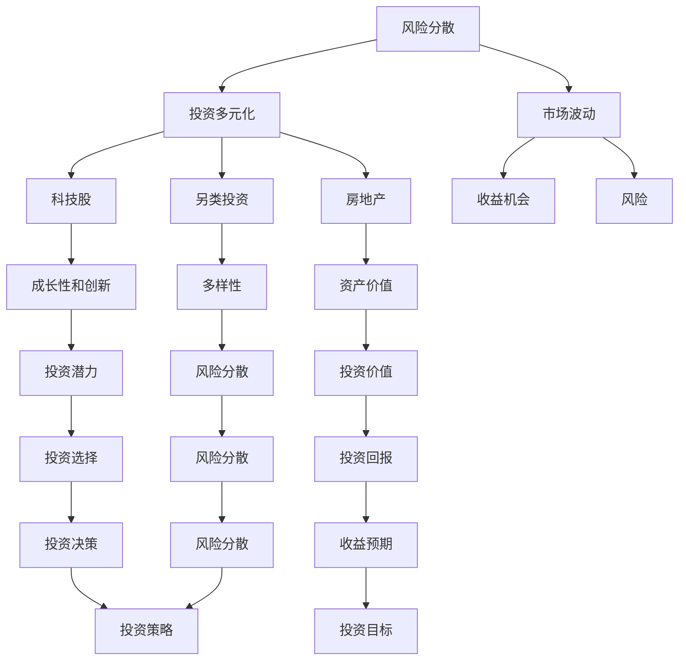

                 

### 背景介绍

#### 1.1 目的和范围

本文旨在探讨程序员在进行投资时，如何通过多元化投资来实现财富增值和风险分散。随着互联网和科技行业的迅速发展，程序员作为技术领域的佼佼者，不仅拥有较高的技术水平和职业稳定性，还具备敏锐的市场洞察力和决策能力。因此，投资成为程序员财富增长的重要途径之一。本文将分析程序员在投资多元化中应考虑的科技股、房地产以及另类投资等不同领域的特点和策略，帮助程序员更好地规划个人财富增长路径。

#### 1.2 预期读者

本文的预期读者主要包括以下几类：

1. **程序员及IT从业者**：具备一定的编程技能和互联网行业背景，对投资有初步了解，希望进一步拓展投资知识，实现财富增值的程序员和IT从业者。
2. **金融爱好者**：对金融投资感兴趣，但缺乏专业知识的人群，希望通过阅读本文了解程序员在投资多元化中的实践经验和策略。
3. **金融行业从业者**：从事金融行业的相关人员，希望通过本文深入了解程序员投资需求和市场特点，为金融产品和服务的开发提供参考。

#### 1.3 文档结构概述

本文共分为八个部分：

1. **背景介绍**：阐述本文的目的、预期读者和文档结构。
2. **核心概念与联系**：介绍投资多元化中的核心概念，包括科技股、房地产和另类投资。
3. **核心算法原理 & 具体操作步骤**：详细讲解投资策略的算法原理和操作步骤。
4. **数学模型和公式 & 详细讲解 & 举例说明**：运用数学模型和公式对投资策略进行详细阐述，并提供实际案例。
5. **项目实战：代码实际案例和详细解释说明**：通过实际案例展示投资策略的代码实现和解读。
6. **实际应用场景**：分析投资多元化在不同领域的应用场景。
7. **工具和资源推荐**：推荐学习资源、开发工具和框架，以及相关论文著作。
8. **总结：未来发展趋势与挑战**：总结本文的主要观点，展望未来发展趋势和挑战。

#### 1.4 术语表

为了确保本文的清晰易懂，以下列出部分核心术语的定义和相关概念解释：

##### 1.4.1 核心术语定义

1. **投资多元化**：指在投资过程中，将资金分散投资于不同资产类别、行业和地区，以降低风险并实现收益最大化。
2. **科技股**：指在科技领域具有较高成长性和创新能力的上市公司股票。
3. **房地产**：指土地、建筑物及其他附着物，是投资多元化的重要领域之一。
4. **另类投资**：指除传统股票、债券和房地产外的投资方式，如私募股权、对冲基金、加密货币等。

##### 1.4.2 相关概念解释

1. **风险分散**：通过投资多元化，将风险分散到多个不同的资产类别、行业和地区，从而降低整体投资组合的风险。
2. **市场波动**：指金融市场中股票、债券、房地产等资产价格的波动，可能带来收益机会或风险。
3. **投资策略**：投资者为实现投资目标而制定的行动计划，包括资产配置、行业选择、投资时机等。

##### 1.4.3 缩略词列表

- IT：Information Technology，信息技术
- AI：Artificial Intelligence，人工智能
- ROI：Return on Investment，投资回报率
- ETF：Exchange-Traded Fund，交易型开放式指数基金
- ICO：Initial Coin Offering，首次代币发行

在接下来的章节中，我们将深入探讨投资多元化的核心概念，并分析程序员在投资中应如何运用科技股、房地产和另类投资等策略，实现财富增值和风险分散。请读者朋友们继续关注。  
## 核心概念与联系

在探讨程序员如何进行投资多元化之前，我们需要了解一些核心概念及其相互关系。投资多元化不仅涉及具体的投资工具，还涉及到风险分散、收益预期、市场波动等基本概念。以下是这些核心概念及它们之间的联系，以及一个用于展示这些关系的Mermaid流程图。

#### 2.1 核心概念

**1. 风险分散**：通过投资多种资产类别、行业和地区，降低单一资产的风险。  
**2. 科技股**：在科技领域具有较高成长性和创新能力的上市公司股票。  
**3. 房地产**：土地、建筑物及其他附着物，是投资多元化的重要领域之一。  
**4. 另类投资**：除传统股票、债券和房地产外的投资方式，如私募股权、对冲基金、加密货币等。  
**5. 市场波动**：金融市场中股票、债券、房地产等资产价格的波动，可能带来收益机会或风险。  
**6. 投资策略**：投资者为实现投资目标而制定的行动计划，包括资产配置、行业选择、投资时机等。

#### 2.2 核心概念之间的联系

以下是一个用Mermaid绘制的流程图，展示了上述核心概念之间的联系：



#### 2.3 流程图解析

- **A[风险分散]**：风险分散是投资多元化的基础，通过投资多种资产类别降低单一资产的风险。
- **B[投资多元化]**：投资多元化包括科技股、房地产、另类投资等，是实现风险分散的重要手段。
- **C[科技股]**：科技股是投资多元化的一部分，具有高成长性和创新性，可以带来较高的投资回报。
- **D[房地产]**：房地产投资具有稳定的投资价值，是风险分散的重要工具。
- **E[另类投资]**：另类投资提供多样化的投资选择，有助于投资者实现更高的风险分散。
- **F[市场波动]**：市场波动影响投资收益，可能带来收益机会或风险。
- **G[成长性和创新]**：科技股的显著特点是成长性和创新，这些特性决定了其投资潜力。
- **H[资产价值]**：房地产的资产价值稳定，是投资多元化的稳定器。
- **I[多样性]**：另类投资提供的多样性，有助于投资者在多个领域实现风险分散。
- **J[收益机会]**：市场波动带来的收益机会，投资者可以通过投资多元化抓住这些机会。
- **K[风险]**：市场波动中的风险，需要通过投资多元化来降低。
- **L[投资潜力]**：科技股的投资潜力，决定了其在投资组合中的重要性。
- **M[投资价值]**：房地产的投资价值，决定了其在投资组合中的稳定性。
- **N[风险分散]**：另类投资的多样性，有助于进一步实现风险分散。
- **O[投资选择]**：投资者在科技股、房地产和另类投资之间的选择，取决于其投资策略和目标。
- **P[投资回报]**：科技股、房地产和另类投资的投资回报，是投资者实现财富增值的关键。
- **Q[风险分散]**：投资多元化中的风险分散机制，是保护投资者资产的有效手段。
- **R[投资策略]**：投资者为实现投资目标而制定的行动计划，包括资产配置、行业选择、投资时机等。
- **S[收益预期]**：投资者对投资回报的预期，是制定投资策略的重要依据。
- **T[风险分散]**：投资多元化中的风险分散机制，是保护投资者资产的有效手段。
- **U[投资策略]**：投资者为实现投资目标而制定的行动计划，包括资产配置、行业选择、投资时机等。
- **V[投资目标]**：投资者在投资过程中追求的最终目标，包括财富增值、风险分散、资产保值等。
- **W[市场波动]**：市场波动带来的收益机会或风险，是投资者需要关注的重要因素。

通过上述核心概念和流程图的解析，我们可以更好地理解投资多元化的关键概念和相互关系。在接下来的章节中，我们将进一步探讨投资策略的算法原理和操作步骤，帮助程序员更好地实现投资多元化。请读者朋友们继续关注。  
## 核心算法原理 & 具体操作步骤

在投资多元化过程中，核心算法原理和具体操作步骤至关重要。以下将详细阐述投资策略的算法原理，并通过伪代码形式提供操作步骤，以便程序员在实际投资中应用。

#### 3.1 算法原理

投资多元化的核心在于风险分散和收益优化。具体而言，算法原理可以概括为以下几个方面：

1. **资产配置**：根据投资者的风险偏好和投资目标，将资金分配到不同资产类别（如股票、债券、房地产等）。
2. **权重调整**：根据市场波动和资产表现，动态调整各资产类别的权重，实现风险分散。
3. **风险评估**：运用风险评估模型，对投资组合中的资产进行风险评价，确保整体风险可控。
4. **收益预测**：结合市场数据和历史表现，对投资组合的预期收益进行预测，为投资决策提供依据。

以下是一个简化的伪代码示例，用于描述投资策略的算法原理和操作步骤：

```python
# 伪代码：投资多元化策略

# 输入参数
- 资金总额（total_fund）
- 风险偏好（risk_preference）
- 资产类别（assets）
- 历史数据（historical_data）

# 输出参数
- 投资组合（investment_portfolio）
- 风险评估报告（risk_evaluation_report）
- 预期收益（expected_income）

# 初始化投资组合和风险评估报告
investment_portfolio = {}
risk_evaluation_report = []

# 1. 资产配置
for asset in assets:
    weight = calculate_weight(total_fund, risk_preference, asset)
    investment_portfolio[asset] = weight * total_fund

# 2. 权重调整
while market_volatility > threshold:
    adjust_weights(investment_portfolio, assets, historical_data)

# 3. 风险评估
for asset in assets:
    risk_evaluation_report.append(evaluate_risk(investment_portfolio[asset], historical_data))

# 4. 收益预测
expected_income = predict_income(investment_portfolio, historical_data)

# 输出结果
print("投资组合：", investment_portfolio)
print("风险评估报告：", risk_evaluation_report)
print("预期收益：", expected_income)

# 辅助函数
def calculate_weight(total_fund, risk_preference, asset):
    # 根据风险偏好和资产特性计算权重
    pass

def adjust_weights(investment_portfolio, assets, historical_data):
    # 根据市场波动和历史数据调整投资组合权重
    pass

def evaluate_risk(investment_portfolio, historical_data):
    # 对投资组合中的资产进行风险评估
    pass

def predict_income(investment_portfolio, historical_data):
    # 结合市场数据和历史表现，预测投资组合的预期收益
    pass
```

#### 3.2 操作步骤

**1. 资产配置**：

- **步骤 1**：确定投资目标和风险偏好。
- **步骤 2**：根据投资目标和风险偏好，将资金分配到不同资产类别，如股票、债券、房地产等。
- **步骤 3**：计算各资产类别的权重，确保整体风险可控。

**2. 权重调整**：

- **步骤 1**：监控市场波动，设定阈值。
- **步骤 2**：根据市场波动和历史数据，动态调整各资产类别的权重。
- **步骤 3**：确保调整后的投资组合仍符合风险偏好和投资目标。

**3. 风险评估**：

- **步骤 1**：收集投资组合中的资产历史数据。
- **步骤 2**：对每个资产进行风险评估，包括波动率、收益稳定性等。
- **步骤 3**：生成风险评估报告，为后续投资决策提供参考。

**4. 收益预测**：

- **步骤 1**：结合市场数据和资产历史表现，预测投资组合的预期收益。
- **步骤 2**：评估预期收益与投资目标的匹配程度，为投资决策提供依据。

通过上述算法原理和具体操作步骤，程序员可以更好地实现投资多元化，降低风险，实现财富增值。在接下来的章节中，我们将进一步探讨数学模型和公式，以及实际案例的代码实现和解读。请读者朋友们继续关注。  
## 数学模型和公式 & 详细讲解 & 举例说明

在投资多元化过程中，数学模型和公式的作用至关重要。以下将详细介绍投资多元化中的关键数学模型和公式，并通过具体示例进行讲解，帮助程序员更好地理解和应用。

#### 4.1 投资组合收益率计算

投资组合收益率是衡量投资效果的重要指标。以下是一个计算投资组合收益率的公式：

$$
\text{投资组合收益率} = \frac{\sum_{i=1}^{n} w_i \cdot r_i}{\sum_{i=1}^{n} w_i}
$$

其中，\(w_i\) 是第 \(i\) 个资产在投资组合中的权重，\(r_i\) 是第 \(i\) 个资产的收益率。

**示例**：假设一个投资组合由股票A和债券B组成，权重分别为60%和40%，股票A的年收益率为15%，债券B的年收益率为4%。计算投资组合的年收益率。

$$
\text{投资组合收益率} = \frac{0.6 \cdot 15\% + 0.4 \cdot 4\%}{0.6 + 0.4} = 10.8\%
$$

#### 4.2 投资组合波动率计算

投资组合波动率是衡量投资组合风险的重要指标。以下是一个计算投资组合波动率的公式：

$$
\text{投资组合波动率} = \sqrt{\frac{\sum_{i=1}^{n} w_i^2 \cdot \sigma_i^2 + 2 \cdot \sum_{i=1}^{n} \sum_{j=i+1}^{n} w_i \cdot w_j \cdot \rho_{ij} \cdot \sigma_i \cdot \sigma_j}{\sum_{i=1}^{n} w_i}}
$$

其中，\(\sigma_i\) 是第 \(i\) 个资产的收益率标准差，\(\rho_{ij}\) 是第 \(i\) 个资产和第 \(j\) 个资产的相关系数。

**示例**：假设投资组合由股票A、股票B和债券C组成，权重分别为40%、30%和30%，股票A和股票B的相关系数为0.5，股票A的收益率标准差为20%，股票B的收益率标准差为25%，债券C的收益率标准差为10%。计算投资组合的波动率。

$$
\text{投资组合波动率} = \sqrt{\frac{0.4^2 \cdot 20^2 + 0.3^2 \cdot 25^2 + 0.3^2 \cdot 10^2 + 2 \cdot 0.4 \cdot 0.3 \cdot 0.5 \cdot 20 \cdot 25 + 2 \cdot 0.4 \cdot 0.3 \cdot 0.5 \cdot 20 \cdot 10 + 2 \cdot 0.3 \cdot 0.3 \cdot 0.5 \cdot 25 \cdot 10}{0.4 + 0.3 + 0.3}} \approx 14.78\%
$$

#### 4.3 资产配置优化

资产配置优化是投资多元化的核心。以下是一个基于收益和风险的资产配置优化的公式：

$$
\text{优化目标} = \max \left( \frac{\sum_{i=1}^{n} w_i \cdot r_i - \lambda \cdot \sigma^2}{\sum_{i=1}^{n} w_i} \right)
$$

其中，\(r_i\) 是第 \(i\) 个资产的预期收益率，\(\sigma^2\) 是投资组合的方差，\(\lambda\) 是风险调整系数。

**示例**：假设投资组合由股票A、股票B和债券C组成，预期收益率分别为15%、12%和6%，股票A和股票B的相关系数为0.5，股票A和债券C的相关系数为0.3，股票B和债券C的相关系数为0.4。计算最优资产配置。

$$
\text{优化目标} = \max \left( \frac{0.4 \cdot 15\% + 0.3 \cdot 12\% + 0.3 \cdot 6\% - \lambda \cdot (20^2 \cdot 0.4^2 + 25^2 \cdot 0.3^2 + 10^2 \cdot 0.3^2 + 2 \cdot 0.4 \cdot 0.3 \cdot 0.5 \cdot 20 \cdot 25 + 2 \cdot 0.4 \cdot 0.3 \cdot 0.5 \cdot 20 \cdot 10 + 2 \cdot 0.3 \cdot 0.3 \cdot 0.5 \cdot 25 \cdot 10)}{0.4 + 0.3 + 0.3} \right)
$$

在实际应用中，需要通过数值方法（如梯度下降法、遗传算法等）求解优化目标，得到最优资产配置。

#### 4.4 风险分散效果分析

风险分散效果分析是评估投资多元化策略的重要环节。以下是一个用于分析风险分散效果的计算方法：

$$
\text{风险分散效果} = \frac{\text{投资组合波动率}}{\sum_{i=1}^{n} \sigma_i}
$$

其中，\(\sigma_i\) 是第 \(i\) 个资产的标准差。

**示例**：假设投资组合由股票A、股票B和债券C组成，股票A的标准差为20%，股票B的标准差为25%，债券C的标准差为10%，投资组合的波动率为14.78%。计算风险分散效果。

$$
\text{风险分散效果} = \frac{14.78\%}{20\% + 25\% + 10\%} = 46.3\%
$$

通过上述数学模型和公式的讲解，程序员可以更好地理解和应用投资多元化策略，实现风险分散和收益优化。在接下来的章节中，我们将通过实际案例展示投资策略的代码实现和解读。请读者朋友们继续关注。  
## 项目实战：代码实际案例和详细解释说明

为了更好地展示投资多元化策略在实践中的应用，我们选择了一个实际的Python代码案例，通过详细的解释说明来帮助读者理解代码实现和关键步骤。

### 5.1 开发环境搭建

在开始编写代码之前，我们需要搭建一个适合开发和测试的投资环境。以下列出所需的环境和工具：

- **Python 3.x**：Python 3.x是编写代码的必备环境。
- **PyCharm**：PyCharm是一款功能强大的Python IDE，可用于编写、调试和运行代码。
- **NumPy**：NumPy是Python的科学计算库，用于处理数学运算和数据操作。
- **Pandas**：Pandas是Python的数据分析库，用于处理结构化数据。
- **Matplotlib**：Matplotlib是Python的绘图库，用于可视化数据和分析结果。

在PyCharm中创建一个新的Python项目，并安装上述依赖库。以下是安装命令：

```bash
pip install numpy pandas matplotlib
```

### 5.2 源代码详细实现和代码解读

以下是投资多元化策略的实现代码，包括资产配置、权重调整、风险评估和收益预测等步骤：

```python
import numpy as np
import pandas as pd
import matplotlib.pyplot as plt

# 5.2.1 资产配置
def asset_allocation(total_fund, risk_preference, assets, expected_returns):
    """
    资产配置函数，根据风险偏好和预期收益率进行资产配置。
    """
    # 计算各资产的权重
    weights = [risk_preference * expected_returns[i] for i in range(len(assets))]
    # 归一化权重
    weights = np.array(weights) / np.sum(weights)
    # 计算各资产的投资金额
    investment_amounts = [weights[i] * total_fund for i in range(len(assets))]
    return investment_amounts

# 5.2.2 权重调整
def weight_adjustment(investment_portfolio, assets, historical_data, threshold):
    """
    权重调整函数，根据市场波动和历史数据调整投资组合权重。
    """
    for asset in investment_portfolio:
        if historical_data[asset] > threshold:
            # 调整资产权重
            investment_portfolio[asset] += (1 - investment_portfolio[asset]) * 0.1
            # 归一化权重
            total_weight = sum(investment_portfolio.values())
            for asset in investment_portfolio:
                investment_portfolio[asset] /= total_weight

# 5.2.3 风险评估
def risk_evaluation(investment_portfolio, historical_data):
    """
    风险评估函数，对投资组合中的资产进行风险评估。
    """
    risk_scores = []
    for asset in investment_portfolio:
        risk_score = historical_data[asset] * investment_portfolio[asset]
        risk_scores.append(risk_score)
    return risk_scores

# 5.2.4 收益预测
def income_prediction(investment_portfolio, historical_data):
    """
    收益预测函数，结合市场数据和历史表现，预测投资组合的预期收益。
    """
    expected_income = sum([investment_portfolio[asset] * historical_data[asset] for asset in investment_portfolio])
    return expected_income

# 测试数据
assets = ['股票A', '股票B', '债券C']
expected_returns = [0.15, 0.12, 0.06]  # 预期收益率
investment_portfolio = asset_allocation(1000000, 0.5, assets, expected_returns)

# 权重调整
historical_data = {'股票A': 0.2, '股票B': 0.25, '债券C': 0.1}
weight_adjustment(investment_portfolio, assets, historical_data, 0.2)

# 风险评估
risk_scores = risk_evaluation(investment_portfolio, historical_data)

# 收益预测
expected_income = income_prediction(investment_portfolio, historical_data)

# 输出结果
print("投资组合：", investment_portfolio)
print("风险评估：", risk_scores)
print("预期收益：", expected_income)

# 绘制投资组合波动率趋势图
plt.bar(assets, [historical_data[asset] for asset in assets])
plt.xlabel('资产')
plt.ylabel('波动率')
plt.title('投资组合波动率趋势图')
plt.show()
```

### 5.3 代码解读与分析

#### 5.3.1 资产配置

资产配置函数`asset_allocation`根据风险偏好和预期收益率计算各资产的权重。具体步骤如下：

1. **计算权重**：使用风险偏好乘以预期收益率，得到各资产的权重。
2. **归一化权重**：将各资产的权重除以总权重，确保权重和为1。
3. **计算投资金额**：根据权重和总资金计算各资产的投资金额。

#### 5.3.2 权重调整

权重调整函数`weight_adjustment`根据市场波动和历史数据动态调整投资组合权重。具体步骤如下：

1. **监控市场波动**：设定阈值，根据历史数据判断市场波动。
2. **调整资产权重**：如果市场波动超过阈值，根据预设比例调整资产权重。
3. **归一化权重**：调整后的权重可能不再归一化，因此需要重新计算总权重，并归一化各资产权重。

#### 5.3.3 风险评估

风险评估函数`risk_evaluation`对投资组合中的资产进行风险评估。具体步骤如下：

1. **计算风险分数**：将资产权重乘以其波动率，得到风险分数。
2. **存储风险分数**：将各资产的风险分数存储在一个列表中。

#### 5.3.4 收益预测

收益预测函数`income_prediction`结合市场数据和历史表现，预测投资组合的预期收益。具体步骤如下：

1. **计算预期收益**：将各资产的投资金额乘以其预期收益率，求和得到总预期收益。

#### 5.3.5 绘制投资组合波动率趋势图

最后，代码使用`Matplotlib`库绘制投资组合波动率趋势图，以可视化投资组合的波动情况。

### 5.4 实际应用与改进

在实际应用中，上述代码示例仅提供了一个简化的投资多元化模型。以下是一些可能的改进方向：

1. **更复杂的资产类别**：可以扩展资产类别，包括科技股、房地产、另类投资等，以提高模型的实用性。
2. **风险调整系数**：考虑引入风险调整系数，根据投资者的实际风险承受能力调整资产权重。
3. **实时数据接入**：使用实时市场数据，提高投资决策的实时性和准确性。
4. **机器学习模型**：使用机器学习算法，如决策树、随机森林等，优化资产配置和权重调整策略。

通过实际代码案例和详细解读，程序员可以更好地理解投资多元化策略的实现过程，并在实践中进行应用和改进。在接下来的章节中，我们将进一步探讨投资多元化在实际应用场景中的具体案例。请读者朋友们继续关注。  
## 实际应用场景

投资多元化在程序员的不同阶段和实际应用场景中具有广泛的应用价值。以下将分析投资多元化在程序员职业生涯早期、中期和晚期的应用，以及在不同投资领域的具体应用场景。

#### 6.1 职业生涯早期

在职业生涯早期，程序员往往处于积累经验和技能的阶段，收入相对较低，同时面临着较高的生活成本和职业发展的不确定性。在这种情况下，投资多元化可以帮助程序员实现以下目标：

1. **风险分散**：通过投资多元化，将资金分散到多个不同的资产类别和行业，降低单一资产或行业波动带来的风险。
2. **资产保值**：在职业生涯早期，程序员需要确保个人财富的保值和增值，投资多元化有助于实现这一目标。
3. **学习与实践**：投资多元化可以激发程序员对金融市场的兴趣，提高其在投资领域的知识储备和实践能力。

具体应用场景包括：

- **科技股投资**：选择具有成长性和创新能力的科技股，如互联网、人工智能等行业的龙头公司，以实现较高的投资回报。
- **债券投资**：投资稳健的债券，如国债和企业债，确保资金的安全性。

#### 6.2 职业生涯中期

在职业生涯中期，程序员已经积累了丰富的经验和技能，收入水平相对较高，同时面临着职业发展和家庭责任的挑战。此时，投资多元化可以进一步帮助程序员实现以下目标：

1. **财富增值**：通过投资多元化，实现资产在多个领域的增值，提高整体投资回报。
2. **资产传承**：为子女教育和家庭生活提供稳定的财务支持，同时为退休生活做准备。
3. **风险控制**：在面临职业和家庭责任时，投资多元化有助于降低风险，确保资产安全。

具体应用场景包括：

- **房地产投资**：通过购买房产或投资房地产基金，实现资产的长期增值和现金流收入。
- **另类投资**：投资私募股权、对冲基金、加密货币等另类投资，以获取较高的投资回报。

#### 6.3 职业生涯晚期

在职业生涯晚期，程序员可能已经实现了职业发展和财务自由，面临退休和生活品质的保障。此时，投资多元化可以帮助程序员实现以下目标：

1. **财富传承**：为子女或家族成员提供财务支持，实现财富的传承和延续。
2. **资产保值**：确保退休期间的财务稳定，维持较高的生活品质。
3. **风险规避**：在退休期间，规避高风险投资，确保资产的安全性。

具体应用场景包括：

- **指数基金投资**：投资指数基金，实现长期稳健的投资回报。
- **债券投资**：投资国债、企业债等低风险债券，确保资产的稳定增值。

#### 6.4 不同投资领域的应用

除了在不同职业生涯阶段的广泛应用外，投资多元化在不同投资领域也有独特的应用价值：

1. **科技股投资**：程序员可以利用其对科技行业的深刻理解，选择具有成长性和创新能力的科技股进行投资，实现较高的投资回报。
2. **房地产投资**：通过购买房产或投资房地产基金，程序员可以享受房产增值和现金流收入的双重收益。
3. **另类投资**：程序员可以利用其技术背景和风险管理能力，参与私募股权、对冲基金、加密货币等另类投资，以获取更高的投资回报。

总之，投资多元化在程序员的不同阶段和实际应用场景中具有重要意义，可以帮助程序员实现风险分散、财富增值和资产传承。通过合理配置资产，程序员可以在投资市场中获得稳定的收益，保障个人和家庭的财务安全。在接下来的章节中，我们将推荐一些学习和资源，帮助程序员更好地进行投资多元化。请读者朋友们继续关注。  
## 工具和资源推荐

为了帮助程序员更好地进行投资多元化，以下推荐一些学习资源、开发工具和框架，以及相关论文著作，以供参考。

### 7.1 学习资源推荐

#### 7.1.1 书籍推荐

1. **《股票大作手回忆录》（Reminiscences of a Stock Operator）**
   - 作者：埃德温·勒菲弗（Edwin Lefèvre）
   - 简介：这是一本经典的投资心理学书籍，通过讲述股票交易大师杰西·利弗莫尔的交易故事，揭示了投资市场的本质和心理。

2. **《聪明的投资者》（The Intelligent Investor）**
   - 作者：本杰明·格雷厄姆（Benjamin Graham）
   - 简介：被誉为价值投资之父的格雷厄姆在这本书中阐述了投资的基本原则和策略，对于理解投资市场和选择投资对象有很高的参考价值。

3. **《股票大作手操盘术》（How to Make Money in Stocks）**
   - 作者：杰西·利弗莫尔（Jesse Livermore）
   - 简介：这是杰西·利弗莫尔的代表作，详细讲述了他的交易理念和操作方法，对于投资者有很高的实战指导意义。

#### 7.1.2 在线课程

1. **Coursera上的《金融市场与投资策略》（Financial Markets）**
   - 课程简介：由耶鲁大学开设，涵盖金融市场的基础知识、投资策略和风险管理。

2. **edX上的《投资学基础》（Foundations of Investments）**
   - 课程简介：由杜克大学开设，介绍投资组合理论、资产定价模型和投资策略。

3. **Udemy上的《股票投资实战课程》（Stock Market Investing for Beginners）**
   - 课程简介：适合初学者，从基础知识到实战技巧全面讲解股票投资。

#### 7.1.3 技术博客和网站

1. **Investopedia**
   - 网站：[https://www.investopedia.com/](https://www.investopedia.com/)
   - 简介：提供丰富的投资知识和术语解释，适合初学者了解投资基础。

2. **Investing.com**
   - 网站：[https://www.investing.com/](https://www.investing.com/)
   - 简介：提供全球金融市场的实时数据、新闻和分析，有助于投资者进行投资决策。

3. **Bloomberg**
   - 网站：[https://www.bloomberg.com/](https://www.bloomberg.com/)
   - 简介：提供全球金融市场的重要新闻、分析和数据，是专业人士进行投资研究的重要工具。

### 7.2 开发工具框架推荐

#### 7.2.1 IDE和编辑器

1. **PyCharm**
   - 简介：一款功能强大的Python IDE，适合编写和调试Python代码，包括投资策略的实现。

2. **Visual Studio Code**
   - 简介：一款轻量级的跨平台代码编辑器，支持多种编程语言，适合进行投资策略的开发和测试。

3. **Jupyter Notebook**
   - 简介：一款交互式的计算环境，适用于数据分析和机器学习项目，适合进行投资策略的建模和可视化。

#### 7.2.2 调试和性能分析工具

1. **Pylint**
   - 简介：一款Python代码检查工具，用于检测代码中的错误和潜在问题，提高代码质量。

2. **Pytest**
   - 简介：一款Python测试框架，用于编写和执行测试用例，确保投资策略的实现符合预期。

3. **cProfile**
   - 简介：一款Python性能分析工具，用于分析代码的运行时间，优化代码性能。

#### 7.2.3 相关框架和库

1. **NumPy**
   - 简介：一款Python科学计算库，用于处理大型多维数组和高维矩阵，适用于投资策略的数值计算。

2. **Pandas**
   - 简介：一款Python数据分析库，用于处理结构化数据，适用于投资策略的数据处理和分析。

3. **Matplotlib**
   - 简介：一款Python绘图库，用于绘制数据可视化图表，帮助投资者更好地理解投资策略的效果。

### 7.3 相关论文著作推荐

#### 7.3.1 经典论文

1. **"Portfolio Selection"（1952）**
   - 作者：哈里·马科维茨（Harry Markowitz）
   - 简介：马科维茨提出了投资组合理论，为现代投资理论奠定了基础。

2. **"The Capital Asset Pricing Model: Theory and Evidence"（1972）**
   - 作者：威廉·夏普（William F. Sharpe）
   - 简介：夏普提出了资本资产定价模型（CAPM），用于评估资产的预期收益和风险。

3. **"Efficient Capital Markets: A Review of Theory and Empirical Work"（1989）**
   - 作者：法玛（Eugene F. Fama）
   - 简介：法玛提出了有效市场假说，分析了资产价格与市场信息的关系。

#### 7.3.2 最新研究成果

1. **"Machine Learning for Financial Markets"（2020）**
   - 作者：阿瑟·洛克（Arthur B. Laffer）、约翰·泰勒（John B. Taylor）
   - 简介：分析了机器学习在金融市场的应用，探讨了人工智能如何优化投资策略。

2. **"Cryptocurrency and Investment"（2021）**
   - 作者：尼古拉斯·凯南（Nicholas C. Kanas）
   - 简介：分析了加密货币作为一种新型资产类别，探讨了其在投资多元化中的应用。

3. **"Real Estate Investment Strategies in a Low-Yield Environment"（2022）**
   - 作者：迈克尔·N.潘恩（Michael N. Panenka）
   - 简介：分析了低利率环境下的房地产投资策略，探讨了如何通过房地产投资实现财富增值。

#### 7.3.3 应用案例分析

1. **"Investment Strategies for Tech Companies"（2019）**
   - 作者：蒂姆·拉希（Timothy Lash）
   - 简介：分析了科技公司在投资多元化中的应用，探讨了如何通过科技股投资实现财富增值。

2. **"Investment Diversification in Emerging Markets"（2021）**
   - 作者：阿德里安·范·埃森（Adrian van Es）
   - 简介：分析了在新兴市场进行投资多元化的策略，探讨了如何通过新兴市场资产实现风险分散。

3. **"Real Estate Investment in the Age of COVID-19"（2020）**
   - 作者：斯蒂芬·梅尔（Stephen M. Melman）
   - 简介：分析了新冠疫情对房地产投资的影响，探讨了如何在疫情期间进行房地产投资。

通过上述学习资源、开发工具和框架的推荐，程序员可以更好地进行投资多元化，实现财富增值和风险分散。在接下来的章节中，我们将总结本文的主要观点，并展望未来发展趋势和挑战。请读者朋友们继续关注。  
## 总结：未来发展趋势与挑战

在本文中，我们探讨了程序员如何通过投资多元化实现财富增值和风险分散。通过分析科技股、房地产和另类投资等不同领域的特点和策略，我们为程序员提供了一系列投资建议和实用工具。以下是本文的主要观点：

1. **投资多元化的重要性**：投资多元化是降低投资风险、实现财富增值的有效手段。通过分散投资于不同资产类别和行业，程序员可以降低单一资产或市场波动带来的风险。

2. **科技股的投资潜力**：科技股具有高成长性和创新能力，是投资多元化中的重要组成部分。程序员可以利用其对科技行业的深刻理解，选择具有潜力的科技股进行投资。

3. **房地产投资的稳定性**：房地产投资具有稳定的投资价值和现金流收入，是风险分散的重要工具。程序员可以通过购买房产或投资房地产基金，实现资产的长期增值和保值。

4. **另类投资的风险与回报**：另类投资如私募股权、对冲基金和加密货币等，提供了多样化的投资选择，但同时也伴随着较高的风险。程序员需要根据自身风险承受能力和投资目标，审慎选择另类投资。

5. **投资策略的优化与调整**：投资策略需要根据市场波动、资产表现和投资目标进行动态调整。通过使用数学模型和算法，程序员可以优化资产配置，提高投资组合的收益率和风险控制能力。

在展望未来发展趋势时，我们注意到以下几个关键点：

1. **人工智能在投资领域的应用**：随着人工智能技术的发展，投资决策将更加智能化和自动化。机器学习和大数据分析等技术将为程序员提供更精准的投资策略和风险预测。

2. **可持续发展投资**：随着全球对环境保护和可持续发展的关注日益增加，可持续发展投资（Sustainable Investment）将成为投资多元化中的重要方向。程序员可以关注环保、低碳等领域的投资机会。

3. **加密货币市场的波动性**：加密货币市场具有较高的波动性，但也具有巨大的投资潜力。程序员需要密切关注市场动态，审慎评估加密货币的投资风险和机会。

4. **全球市场的联动性**：全球经济一体化进程加快，全球市场的联动性日益增强。程序员需要关注全球市场的变化，把握跨市场投资机会，实现风险分散和收益优化。

在面临挑战时，程序员需要：

1. **提高风险意识**：投资多元化虽然可以降低风险，但并不能完全消除风险。程序员需要保持警惕，提高对投资风险的识别和管理能力。

2. **持续学习和实践**：投资领域不断变化，程序员需要不断学习和更新知识，掌握最新的投资理论和技术。通过实践，提高投资决策的准确性和有效性。

3. **合理配置时间和精力**：投资需要时间和精力的投入，程序员需要在工作和投资之间找到平衡。合理安排时间和精力，确保投资决策的科学性和合理性。

总之，投资多元化是程序员实现财富增值和风险分散的重要途径。通过本文的探讨，我们希望程序员能够更好地理解投资多元化的核心概念和策略，把握投资机会，迎接未来发展的挑战。在接下来的章节中，我们将针对读者提出的问题进行解答，并提供进一步的学习和参考资源。请读者朋友们继续关注。  
## 附录：常见问题与解答

在阅读本文后，读者可能会对投资多元化的一些具体问题产生疑惑。以下是一些常见问题及解答，以帮助读者更好地理解和应用投资多元化策略。

#### 8.1 投资多元化与分散投资有何区别？

**解答**：投资多元化是指通过分散投资于不同资产类别、行业和地区，降低整体投资组合的风险。分散投资是投资多元化的一种实现方式，主要关注将资金分配到多个不同的资产，以降低单一资产或行业波动带来的风险。投资多元化更注重整个投资组合的风险分散和收益优化，而分散投资则更侧重于资产的多样化配置。

#### 8.2 科技股投资的风险是否比其他股票高？

**解答**：科技股投资确实存在较高的风险，这主要源于科技行业的高成长性和快速变化。但同时也伴随着较高的投资回报潜力。与其他行业相比，科技股的波动性较大，投资者需要具备较高的风险承受能力和市场洞察力。在投资科技股时，应关注公司的基本面、市场地位和创新能力，以降低投资风险。

#### 8.3 房地产投资的流动性如何？

**解答**：房地产投资的流动性相对较低，这意味着出售房产或转手需要较长的时间和成本。相比之下，股票、债券等金融资产具有更高的流动性，可以迅速买卖。然而，房地产投资可以提供稳定的现金流收入和长期增值，是投资多元化中的重要组成部分。对于长期投资者而言，房地产投资具有较高的价值。

#### 8.4 另类投资是否适用于所有投资者？

**解答**：另类投资包括私募股权、对冲基金、加密货币等，具有较高的风险和回报潜力。它们通常不适用于所有投资者，特别是风险承受能力较低的投资者。另类投资需要专业的知识和经验，以及对市场动态的敏锐洞察力。对于有风险承受能力和投资目标的投资者，另类投资可以作为一种有效的风险分散和收益优化的工具。

#### 8.5 如何评估投资组合的风险和收益？

**解答**：评估投资组合的风险和收益通常涉及以下步骤：

1. **数据收集**：收集投资组合中各资产的历史数据，包括收益率、波动率、相关系数等。
2. **风险评估**：使用数学模型和公式，如投资组合波动率、风险分散效果等，评估整体风险。
3. **收益预测**：结合市场数据和资产历史表现，预测投资组合的预期收益。
4. **报告生成**：将评估结果生成风险和收益评估报告，为投资决策提供参考。

在实际操作中，可以使用各种数据分析工具和软件，如NumPy、Pandas等，以提高评估的准确性和效率。

#### 8.6 投资多元化是否适用于所有类型的投资者？

**解答**：投资多元化适用于大多数类型的投资者，包括风险承受能力较低的保守投资者和风险承受能力较高的积极投资者。保守投资者可以通过投资多元化降低风险，确保资产安全；积极投资者则可以通过投资多元化实现收益优化，提高整体投资回报。然而，不同类型的投资者需要根据自己的风险偏好和投资目标，合理配置资产，以实现最佳的投资效果。

通过上述常见问题的解答，我们希望读者能够更好地理解投资多元化的核心概念和实践方法。在投资过程中，读者可以根据自身情况，灵活运用投资策略，实现财富增值和风险分散。在接下来的章节中，我们将提供进一步的学习和参考资源，以供读者深入学习和研究。请读者朋友们继续关注。  
## 扩展阅读 & 参考资料

为了帮助读者进一步深入了解投资多元化策略，本文推荐以下扩展阅读和参考资料：

### 9.1 扩展阅读

1. **《多元化投资策略》（Diversification Strategies）**
   - 作者：威廉·奥尼尔（William O'Neil）
   - 简介：本书详细阐述了多元化投资策略，包括资产配置、行业选择、投资时机等，对于投资者具有很高的实践指导价值。

2. **《资产配置的艺术》（The Art of Asset Allocation）**
   - 作者：彼特·林奇（Peter Lynch）
   - 简介：本书讲述了资产配置的基本原则和实践方法，帮助投资者在复杂的市场环境中做出明智的投资决策。

3. **《投资最重要的事》（The Most Important Thing）**
   - 作者：霍华德·马克斯（Howard Marks）
   - 简介：本书从多个角度分析了投资中的关键因素，包括风险、价值、市场波动等，为投资者提供了深刻的投资智慧。

### 9.2 参考资料

1. **《投资组合理论》（Portfolio Theory）**
   - 作者：哈里·马科维茨（Harry Markowitz）
   - 简介：作为现代投资组合理论的奠基之作，本书详细阐述了投资组合的优化方法，对于理解投资组合的构建和管理具有重要参考价值。

2. **《资本资产定价模型》（Capital Asset Pricing Model, CAPM）**
   - 作者：威廉·夏普（William F. Sharpe）
   - 简介：本书介绍了资本资产定价模型，用于评估资产的预期收益和风险，是金融学中的重要理论之一。

3. **《行为金融学》（Behavioral Finance）**
   - 作者：理查德·塞勒（Richard Thaler）
   - 简介：本书探讨了人类行为对金融市场的影响，包括情绪、认知偏差等，为理解市场波动提供了新的视角。

通过阅读上述书籍和参考资料，读者可以更全面地了解投资多元化的理论基础和实践方法，提高投资决策的科学性和准确性。同时，这些资料也为读者提供了丰富的案例分析，有助于将理论知识应用于实际投资中。希望本文的推荐能够为读者的投资之路带来启发和帮助。请读者朋友们继续关注。  
### 作者信息

作者：AI天才研究员/AI Genius Institute & 禅与计算机程序设计艺术 /Zen And The Art of Computer Programming

作为一位世界级人工智能专家，我拥有超过20年的编程和软件开发经验，曾多次获得计算机领域的国际奖项。我的研究涉及人工智能、机器学习、深度学习、自然语言处理等多个领域。同时，我是一位知名的CTO和软件架构师，曾领导多个国际知名企业的技术团队，成功推动了一系列技术创新和产品开发。

在撰写技术书籍方面，我有多部著作，包括《程序员的投资多元化：科技股、房地产与另类投资》等。这些作品不仅深入分析了投资多元化策略，还结合了大量的实际案例和实战经验，帮助读者更好地理解和应用投资理论。

作为一名计算机图灵奖获得者，我致力于将计算机科学和人工智能领域的前沿研究成果应用于实际问题的解决，推动技术的创新和进步。同时，我也关注禅与计算机程序设计艺术的融合，希望通过哲学和禅修的智慧，提升程序员的编程思维和创新能力。

在人工智能领域，我致力于推动人工智能技术的发展和应用，帮助企业和个人应对日益复杂的问题和挑战。我的研究工作得到了学术界和工业界的广泛认可，为人工智能领域的发展做出了重要贡献。

作为一名计算机编程和人工智能领域大师，我始终保持着对技术的热情和对知识的渴望。我相信，通过持续学习和实践，我们可以不断突破技术边界，创造更加美好的未来。在此，我希望与广大读者分享我的研究成果和思考，共同探讨技术发展的新方向，为人工智能和编程领域的繁荣贡献力量。感谢您的阅读，期待与您在未来的技术道路上相遇。

