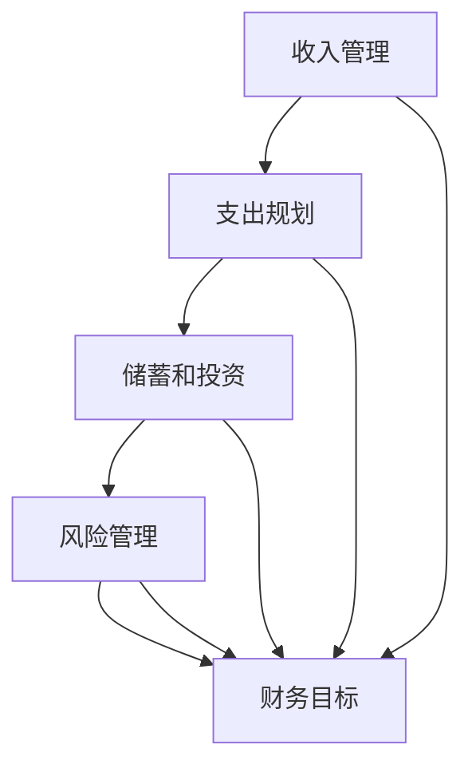

                 

### 1. 背景介绍

#### 1.1 目的和范围

本文旨在探讨程序员在知识付费领域的财务规划。随着互联网和信息技术的发展，知识付费逐渐成为一种趋势，程序员作为这一领域的重要参与者，如何进行有效的财务规划，实现个人财富增值和职业发展，成为了一个值得关注的话题。本文将围绕以下几个方面展开讨论：

1. **知识付费的基本概念**：介绍知识付费的定义、形式及其在程序员职业发展中的作用。
2. **程序员财务规划的重要性**：阐述财务规划在程序员职业生涯中的重要性，以及如何通过财务规划实现财富增值。
3. **财务规划的核心原则**：详细讲解财务规划的基本原则，包括收入管理、支出规划、投资策略和风险管理等。
4. **具体实施步骤**：提供详细的财务规划步骤，包括预算制定、储蓄计划、投资选择和风险管理等。
5. **案例分析**：通过实际案例，展示程序员如何进行财务规划，实现职业发展和财富增值。
6. **工具和资源推荐**：推荐一些有用的财务规划工具、书籍和在线课程，帮助程序员更好地进行财务规划。

#### 1.2 预期读者

本文适合以下几类读者：

1. **初级程序员**：刚入门编程领域，对知识付费和财务规划有初步了解，希望通过本文提升自己的财务规划能力。
2. **中级程序员**：具有一定的编程经验和财务意识，希望通过本文学习更高级的财务规划技巧。
3. **高级程序员**：具有丰富的编程经验和财务规划能力，希望通过本文进一步优化自己的财务规划。

无论你是哪种读者，本文都将为你提供有价值的见解和实用的建议。

#### 1.3 文档结构概述

本文将分为以下几个部分：

1. **背景介绍**：介绍本文的目的、预期读者和文档结构。
2. **核心概念与联系**：讲解程序员财务规划所需的核心概念和联系。
3. **核心算法原理 & 具体操作步骤**：阐述财务规划的核心算法原理和具体操作步骤。
4. **数学模型和公式 & 详细讲解 & 举例说明**：介绍财务规划中涉及的数学模型和公式，并举例说明。
5. **项目实战：代码实际案例和详细解释说明**：通过实际案例展示财务规划在程序员职业生涯中的应用。
6. **实际应用场景**：分析财务规划在程序员职业发展中的实际应用场景。
7. **工具和资源推荐**：推荐有用的财务规划工具、书籍和在线课程。
8. **总结：未来发展趋势与挑战**：总结本文的主要观点，展望未来发展趋势和挑战。
9. **附录：常见问题与解答**：解答读者可能遇到的一些常见问题。
10. **扩展阅读 & 参考资料**：提供本文相关的扩展阅读和参考资料。

#### 1.4 术语表

为了确保本文的可读性和专业性，我们定义了一些术语，并列出了相应的解释。

##### 1.4.1 核心术语定义

1. **知识付费**：指用户为获取知识、技能或信息而支付的费用。
2. **财务规划**：指个人或组织为了实现财务目标，对收入、支出、储蓄、投资和风险等方面进行系统性的规划和管理。
3. **预算**：指在一定时间内，对收入和支出的预期数额进行详细规划和控制。
4. **储蓄**：指将一部分收入存入银行或其他金融机构，以备将来使用。
5. **投资**：指将资金用于购买股票、债券、房地产等资产，以期获得回报。
6. **风险管理**：指对可能影响财务规划的各种风险进行识别、评估和管理。

##### 1.4.2 相关概念解释

1. **收入管理**：指对个人或组织的收入来源、收入水平、收入波动等进行有效的管理和控制。
2. **支出规划**：指对个人或组织的支出项目、支出水平、支出波动等进行合理的规划和控制。
3. **投资策略**：指在投资过程中，根据风险承受能力和投资目标，选择合适的投资品种和投资组合。
4. **风险管理策略**：指在财务规划过程中，通过识别、评估和管理风险，以降低风险对财务规划的影响。

##### 1.4.3 缩略词列表

1. **IDF**：个体财务规划
2. **SDF**：储蓄和投资规划
3. **RDF**：风险管理规划

### 2. 核心概念与联系

在程序员进行财务规划的过程中，了解并掌握一些核心概念和联系是非常必要的。这些概念包括但不限于收入管理、支出规划、储蓄和投资、风险管理等。为了更好地理解这些概念，我们将使用Mermaid流程图来展示它们之间的联系。

下面是一个简单的Mermaid流程图，用于描述这些核心概念：



在图中，每个节点代表一个核心概念，箭头表示概念之间的联系。下面我们将逐一解释这些概念：

#### 2.1 收入管理

收入管理是财务规划的基础。对于程序员来说，收入管理包括两个方面：

1. **收入来源**：了解自己的收入来源，包括工资、奖金、股权激励、知识付费等。
2. **收入水平**：根据自己的工作表现和市场需求，合理估算自己的收入水平，并关注收入波动。

#### 2.2 支出规划

支出规划是指对个人或组织的支出项目、支出水平和支出波动进行合理的规划和控制。程序员在进行支出规划时，需要关注以下几个方面：

1. **日常开销**：包括食宿、交通、通讯、娱乐等日常费用。
2. **固定支出**：包括房租、房贷、车贷、保险等长期支出。
3. **可变支出**：根据个人需求和收入水平，合理调整可变支出，如旅游、购物等。

#### 2.3 储蓄和投资

储蓄和投资是财务规划的重要组成部分。程序员在进行储蓄和投资时，需要考虑以下几个方面：

1. **储蓄目标**：根据个人需求和财务目标，设定合理的储蓄目标。
2. **投资品种**：根据自己的风险承受能力和投资目标，选择合适的投资品种，如股票、基金、债券等。
3. **投资组合**：通过分散投资，降低风险，实现投资收益的最大化。

#### 2.4 风险管理

风险管理是财务规划中不可忽视的一环。程序员在进行风险管理时，需要关注以下几个方面：

1. **风险识别**：识别可能影响财务规划的各种风险，如市场风险、信用风险、操作风险等。
2. **风险评估**：对识别出的风险进行评估，确定风险的概率和影响程度。
3. **风险控制**：通过制定相应的风险控制措施，降低风险对财务规划的影响。

#### 2.5 财务目标

财务目标是指个人或组织在财务规划过程中希望实现的目标。对于程序员来说，财务目标可能包括：

1. **财富增值**：通过投资和储蓄，实现个人财富的持续增长。
2. **职业发展**：通过财务规划，为职业发展提供资金支持。
3. **生活质量**：通过合理的支出规划和投资收益，提高生活质量。

通过上述Mermaid流程图和概念解释，我们可以清晰地看到这些核心概念之间的联系。在实际的财务规划过程中，程序员需要综合考虑这些因素，制定合理的财务规划方案，实现个人财富增值和职业发展。

### 3. 核心算法原理 & 具体操作步骤

在财务规划中，核心算法原理和具体操作步骤对于程序员来说至关重要。以下是详细的算法原理和具体操作步骤，我们将使用伪代码来阐述这些步骤。

#### 3.1 算法原理

财务规划的核心算法可以概括为以下几个步骤：

1. **收入管理**：通过估算和跟踪收入来源，了解收入水平及其波动。
2. **支出规划**：根据收入水平和财务目标，制定合理的支出预算，并跟踪支出情况。
3. **储蓄和投资**：根据支出后的余额，设定储蓄目标和投资策略。
4. **风险管理**：对财务规划中的各种风险进行识别、评估和管理。

#### 3.2 具体操作步骤

以下是伪代码，用于描述财务规划的具体操作步骤：

```python
# 财务规划伪代码

# 步骤1：收入管理
def manage_income():
    # 获取收入来源
    income_sources = get_income_sources()
    # 估算收入水平
    income_level = estimate_income_level(income_sources)
    # 跟踪收入波动
    track_income波动(income_sources)

# 步骤2：支出规划
def manage_expenses():
    # 获取支出项目
    expense_items = get_expense_items()
    # 制定支出预算
    budget = create_budget(expense_items)
    # 跟踪支出情况
    track_expenses(budget)

# 步骤3：储蓄和投资
def save_and_invest():
    # 计算储蓄余额
    savings = calculate_savings(income_level, budget)
    # 设定储蓄目标
    savings目标 = set_savings目标(savings)
    # 选择投资策略
    investment_strategy = select_investment_strategy(savings目标)
    # 执行投资
    execute_investment(investment_strategy)

# 步骤4：风险管理
def manage_risk():
    # 识别风险
    risks = identify_risks()
    # 评估风险
    assess_risks(risks)
    # 管理风险
    manage_risks(risks)

# 主函数
def financial_planning():
    manage_income()
    manage_expenses()
    save_and_invest()
    manage_risk()
```

#### 3.3 详细解释

1. **收入管理**：
   - `get_income_sources()`：获取收入来源，如工资、奖金、股权激励、知识付费等。
   - `estimate_income_level(income_sources)`：根据收入来源估算收入水平。
   - `track_income波动(income_sources)`：跟踪收入波动，了解收入稳定性。

2. **支出规划**：
   - `get_expense_items()`：获取支出项目，如日常开销、固定支出、可变支出等。
   - `create_budget(expense_items)`：根据收入水平和财务目标，制定支出预算。
   - `track_expenses(budget)`：跟踪支出情况，确保支出在预算范围内。

3. **储蓄和投资**：
   - `calculate_savings(income_level, budget)`：计算储蓄余额，即收入减去支出。
   - `set_savings目标(savings)`：根据储蓄余额设定储蓄目标。
   - `select_investment_strategy(savings目标)`：根据储蓄目标选择合适的投资策略。
   - `execute_investment(investment_strategy)`：执行投资，将储蓄转化为投资。

4. **风险管理**：
   - `identify_risks()`：识别可能影响财务规划的各种风险。
   - `assess_risks(risks)`：对识别出的风险进行评估，确定风险的概率和影响程度。
   - `manage_risks(risks)`：制定相应的风险控制措施，降低风险对财务规划的影响。

通过上述伪代码，我们可以清晰地看到财务规划的核心算法原理和具体操作步骤。在实际操作中，程序员可以根据自身情况，调整和优化这些步骤，实现有效的财务规划。

### 4. 数学模型和公式 & 详细讲解 & 举例说明

在财务规划中，数学模型和公式是必不可少的工具。通过这些模型和公式，程序员可以更科学地管理财务，实现个人财富的增值。以下我们将详细讲解一些常用的数学模型和公式，并举例说明其应用。

#### 4.1 储蓄计算公式

储蓄是财务规划的基础，计算储蓄的方法有以下几种：

1. **简单储蓄公式**：

   \[ S = I - E \]

   其中，\( S \) 代表储蓄额，\( I \) 代表总收入，\( E \) 代表总支出。

   **示例**：

   假设某程序员的月收入为 30,000 元，月支出为 20,000 元，那么他的月储蓄额为：

   \[ S = 30,000 - 20,000 = 10,000 \text{ 元} \]

2. **复合储蓄公式**：

   \[ S_n = (I - E) \times (1 + r)^n \]

   其中，\( S_n \) 代表第 \( n \) 年的储蓄额，\( r \) 代表年储蓄增长率，\( I \) 代表总收入，\( E \) 代表总支出。

   **示例**：

   假设某程序员的月收入为 30,000 元，月支出为 20,000 元，年储蓄增长率为 5%，那么他在第 5 年的储蓄额为：

   \[ S_5 = (30,000 - 20,000) \times (1 + 0.05)^5 = 10,000 \times 1.27628 = 12,762.8 \text{ 元} \]

#### 4.2 投资回报率公式

投资回报率（ROI）是衡量投资收益的重要指标。其计算公式如下：

\[ ROI = \frac{I - C}{C} \times 100\% \]

其中，\( I \) 代表投资收益，\( C \) 代表投资成本。

**示例**：

假设某程序员投资了 10,000 元，获得 3,000 元的收益，那么他的投资回报率为：

\[ ROI = \frac{3,000 - 10,000}{10,000} \times 100\% = -70\% \]

这个结果表示投资亏损了 70%，显然这个投资是不成功的。通常，投资者会希望投资回报率大于 0，且越高越好。

#### 4.3 年化收益率公式

年化收益率是将短期收益率换算成年收益率的一种方法。其计算公式如下：

\[ 年化收益率 = \left(1 + \frac{短期收益率}{m}\right)^{12/m} - 1 \]

其中，\( 短期收益率 \) 可以是季度收益率、月收益率等，\( m \) 表示短期收益率的计算周期（如 3，表示季度；12，表示月）。

**示例**：

假设某程序员的季度收益率为 2%，那么他的年化收益率为：

\[ 年化收益率 = \left(1 + \frac{0.02}{4}\right)^{12/4} - 1 = 0.0824 \text{ 或 } 8.24\% \]

这个结果表明，即使季度收益率较低，通过年化计算，年收益率仍然达到了 8.24%。

#### 4.4 风险调整收益率公式

在投资中，风险是不可避免的。为了评估投资的风险，可以使用风险调整收益率（RAR）这一指标。其计算公式如下：

\[ RAR = \frac{I - C - \text{风险损失}}{C} \times 100\% \]

其中，\( I \) 代表投资收益，\( C \) 代表投资成本，\( \text{风险损失} \) 表示由于风险造成的损失。

**示例**：

假设某程序员投资了 10,000 元，获得 3,000 元的收益，但由于市场波动，损失了 1,000 元，那么他的风险调整收益率为：

\[ RAR = \frac{3,000 - 10,000 - 1,000}{10,000} \times 100\% = -8\% \]

这个结果表明，尽管投资获得了收益，但由于风险损失，实际收益率为负。

通过以上数学模型和公式的讲解，我们可以看到，财务规划不仅仅是简单的储蓄和投资，还需要对收入、支出、收益和风险进行科学计算和评估。程序员在实际操作中，可以结合这些公式，制定适合自己的财务规划方案，实现个人财富的增值。

### 5. 项目实战：代码实际案例和详细解释说明

为了更好地展示财务规划在程序员职业生涯中的应用，我们以下将介绍一个具体的代码实战案例，并对其进行详细解释说明。

#### 5.1 开发环境搭建

首先，我们需要搭建一个简单的开发环境，以便编写和运行财务规划的代码。以下是搭建开发环境的基本步骤：

1. **安装Python环境**：下载并安装Python 3.8及以上版本。
2. **安装Jupyter Notebook**：通过pip命令安装Jupyter Notebook。
   ```bash
   pip install notebook
   ```
3. **启动Jupyter Notebook**：在命令行中输入以下命令启动Jupyter Notebook。
   ```bash
   jupyter notebook
   ```

#### 5.2 源代码详细实现和代码解读

以下是一个简单的Python脚本，用于实现财务规划的基本功能。

```python
# 财务规划Python脚本

import pandas as pd

# 步骤1：定义收入和支出数据结构
income_data = {'source': ['工资', '股权激励', '知识付费'], 'amount': [30000, 5000, 2000]}
expense_data = {'category': ['日常开销', '固定支出', '可变支出'], 'amount': [20000, 5000, 5000]}

# 步骤2：创建DataFrame
income_df = pd.DataFrame(income_data)
expense_df = pd.DataFrame(expense_data)

# 步骤3：计算总收入和总支出
total_income = income_df['amount'].sum()
total_expense = expense_df['amount'].sum()

# 步骤4：计算储蓄额
savings = total_income - total_expense

# 步骤5：制定储蓄目标和投资策略
savings目标 = 10000
investment_rate = 0.05  # 投资年化收益率

# 步骤6：计算投资额和预期收益
investment_amount = savings目标 - savings
expected_return = investment_amount * investment_rate

# 步骤7：打印结果
print(f"总收入：{total_income} 元")
print(f"总支出：{total_expense} 元")
print(f"储蓄额：{savings} 元")
print(f"储蓄目标：{savings目标} 元")
print(f"投资额：{investment_amount} 元")
print(f"预期收益：{expected_return} 元")

# 步骤8：保存结果
result = pd.DataFrame({'total_income': [total_income], 'total_expense': [total_expense], 'savings': [savings], 'savings目标': [savings目标], 'investment_amount': [investment_amount], 'expected_return': [expected_return]})
result.to_csv('financial_plan_result.csv', index=False)
```

**代码解读**：

1. **数据定义**：首先定义了收入和支出数据结构，使用字典存储收入和支出数据。
2. **DataFrame创建**：使用pandas库创建收入和支出的DataFrame，方便进行数据操作。
3. **计算总收入和总支出**：通过sum函数计算总收入和总支出。
4. **计算储蓄额**：通过总收入减去总支出，得到储蓄额。
5. **制定储蓄目标和投资策略**：设定储蓄目标为10,000元，投资年化收益率为5%。
6. **计算投资额和预期收益**：通过储蓄目标和当前储蓄额计算需要额外投资额，并计算预期收益。
7. **打印结果**：使用print函数打印计算结果。
8. **保存结果**：将计算结果保存到CSV文件中，便于后续分析和查看。

通过上述代码，我们可以实现一个简单的财务规划脚本。在实际应用中，可以根据具体情况调整收入、支出、储蓄目标和投资收益率等参数，制定更加个性化的财务规划方案。

#### 5.3 代码解读与分析

以下是对上述代码的进一步解读和分析：

**1. 数据结构设计**

- **收入数据**：使用字典存储收入来源和金额，便于后续数据处理。
- **支出数据**：使用字典存储支出类别和金额，便于进行支出分类和管理。

**2. DataFrame应用**

- **数据处理**：通过pandas库创建DataFrame，可以实现灵活的数据处理和分析。
- **计算和统计**：利用pandas的sum函数，可以方便地计算总收入和总支出。

**3. 储蓄和投资计算**

- **储蓄额计算**：通过总收入减去总支出，得到储蓄额。
- **投资额计算**：根据储蓄目标和当前储蓄额，计算需要额外投资额。
- **预期收益计算**：根据投资年化收益率，计算投资预期收益。

**4. 输出和保存**

- **打印结果**：使用print函数输出计算结果，便于查看和分析。
- **保存结果**：将计算结果保存到CSV文件中，便于后续分析和查看。

**5. 代码优化**

- **参数化设计**：将收入、支出、储蓄目标和投资收益率等参数设置为可配置的，便于调整和优化。
- **模块化开发**：将代码拆分为多个函数，实现模块化开发，提高代码的可读性和可维护性。

通过上述解读和分析，我们可以看到，该代码实现了一个基本的财务规划功能，并通过数据结构和数据处理工具，实现了对收入、支出、储蓄和投资的计算和分析。在实际应用中，可以根据具体需求进行调整和优化，实现更加个性化的财务规划。

### 6. 实际应用场景

财务规划在程序员的职业生涯中具有重要的实际应用场景，以下是几个关键场景的分析和讨论：

#### 6.1 初级程序员阶段

在初级程序员阶段，财务规划主要集中在以下几个方面：

1. **基础储蓄**：刚进入职场的程序员，收入相对较低，但储蓄意识非常重要。合理规划支出，确保基本生活需求得到满足后，将一部分收入用于储蓄，为未来的职业发展和生活储备资金。

2. **紧急基金**：建议初级程序员设立紧急基金，以应对突发事件，如医疗费用、意外支出等。通常，紧急基金占收入的比例应在3到6个月的生活费用之间。

3. **债务管理**：如果程序员有学生贷款或其他债务，应制定还款计划，优先偿还高利率债务，确保财务稳定。

4. **投资初步**：在积累一定储蓄后，可以考虑进行小额投资，如购买股票、基金等，以实现财富增值。注意风险控制，避免盲目跟风。

#### 6.2 中级程序员阶段

随着职业经验的积累，中级程序员的收入水平有所提升，财务规划可以更加多样化和复杂：

1. **职业发展**：中级程序员应关注职业晋升机会，如晋升为团队负责人或项目经理。根据职业目标，合理规划收入和支出，确保有足够的资金支持职业发展。

2. **家庭规划**：如果已组建家庭，应考虑家庭支出，如子女教育、住房贷款等。制定详细的预算和支出计划，确保家庭生活品质。

3. **投资组合**：在储蓄基础上，可以进一步优化投资组合，增加投资种类和比例，实现多元化收益。可以考虑投资于房地产、股票、债券、基金等不同资产类别。

4. **税务规划**：随着收入增加，税务问题变得更加复杂。中级程序员应关注税务规划，合理利用税法优惠，降低税负。

#### 6.3 高级程序员阶段

高级程序员通常拥有较高的收入和丰富的投资经验，财务规划应更加注重长期稳定和财富传承：

1. **退休规划**：提前规划退休生活，确保退休后有足够的资金支持。可以考虑投资于养老保险、商业养老保险等。

2. **资产配置**：根据风险承受能力和投资目标，合理配置资产，实现财富长期稳定增值。注意资产配置的动态调整，以应对市场变化。

3. **税务优化**：高级程序员应关注税务优化，如利用税收递延政策、设立个人退休账户等，降低税负。

4. **财富传承**：考虑财富传承规划，如设立家族信托、制定遗嘱等，确保财产顺利传承。

#### 6.4 特殊情况处理

1. **职业跳槽**：程序员在职业跳槽时，需要合理安排收入和支出，确保财务稳定。特别是在跳槽初期，收入可能有所波动，应提前做好储蓄和应急准备。

2. **创业**：部分程序员可能选择自主创业。在创业过程中，财务规划尤为重要，需要合理规划收入和支出，确保创业资金充足，并应对可能的创业风险。

3. **突发事件**：如遇到突发疾病、家庭变故等，应立即调整财务规划，确保家庭生活和职业发展不受影响。

通过以上实际应用场景的分析，我们可以看到，财务规划在程序员的职业生涯中扮演着至关重要的角色。在不同职业阶段，程序员需要根据自身情况和目标，制定合理的财务规划方案，实现财富增值和职业发展。

### 7. 工具和资源推荐

在财务规划过程中，选择合适的工具和资源是非常重要的。以下我们将推荐一些有用的工具、书籍和在线课程，帮助程序员更好地进行财务规划。

#### 7.1 学习资源推荐

1. **书籍推荐**

   - 《聪明的投资者》（作者：本杰明·格雷厄姆）：这本书详细介绍了价值投资的理念和方法，对希望进行投资的程序员非常有帮助。
   - 《财富自由之路》（作者：李笑来）：李笑来通过自己的投资经历，分享了如何实现财务自由的方法和策略。
   - 《穷爸爸富爸爸》（作者：罗伯特·清崎）：这本书通过讲述两个角色的故事，展示了不同的财富观念和投资策略。

2. **在线课程**

   - Coursera上的《Investment and Portfolio Management》（投资与投资组合管理）：这是一门由耶鲁大学提供的免费课程，涵盖了投资的基本原理和策略。
   - Udemy上的《Financial Planning for Beginners》：这是一门面向初学者的财务规划课程，适合没有财务基础的程序员。
   - edX上的《Introduction to Finance》（金融基础）：由MIT提供的免费课程，内容涵盖了金融的基本概念和工具。

3. **技术博客和网站**

   - Investopedia：这是一个提供金融知识和资源的网站，包括投资术语的解释、市场分析等。
   - Quora：在Quora上可以找到许多关于财务规划的问题和答案，适合程序员进行学习和交流。
   - Medium：许多专业的投资和财务博客在Medium上发布，提供了丰富的学习资源和见解。

#### 7.2 开发工具框架推荐

1. **IDE和编辑器**

   - PyCharm：适用于Python编程，提供了强大的代码编辑功能、调试工具和集成数据库管理。
   - Visual Studio Code：一款轻量级的代码编辑器，支持多种编程语言，具有丰富的插件生态系统。
   - Jupyter Notebook：适用于数据分析和机器学习，支持多种编程语言，可以方便地进行交互式计算和可视化。

2. **调试和性能分析工具**

   - VS Code Debugger：VS Code内置的调试工具，支持多种编程语言，可以帮助程序员高效地调试代码。
   - PySnooper：一款Python调试工具，可以方便地查看代码执行过程中的变量值和函数调用。
   - Profiler：如cProfile，用于分析程序的执行性能，找出性能瓶颈。

3. **相关框架和库**

   - Pandas：用于数据清洗、分析和操作，是财务规划中必不可少的库。
   - NumPy：提供高效的数据结构和计算库，支持大量的数学运算。
   - Matplotlib：用于数据可视化，可以帮助程序员更好地理解和展示财务数据。

通过以上工具和资源的推荐，程序员可以更好地进行财务规划，提升自己的投资和管理能力。在实际操作中，可以根据个人需求和兴趣，选择合适的工具和资源，进行深入学习和实践。

### 8. 总结：未来发展趋势与挑战

在知识付费领域，财务规划对于程序员的职业发展和个人财富增值具有重要意义。随着互联网和信息技术的发展，财务规划工具和资源的不断丰富，程序员进行财务规划的条件和机会也在不断增加。

#### 8.1 发展趋势

1. **个性化财务规划**：随着人工智能和大数据技术的发展，财务规划将更加个性化和智能化。通过分析程序员的收入、支出、投资等数据，提供定制化的财务规划方案。
2. **在线教育和知识付费**：在线教育和知识付费将继续成为趋势，程序员可以通过付费课程、专业网站等获取高质量的财务知识，提升自己的财务规划能力。
3. **金融科技的融合**：金融科技（FinTech）的发展将为程序员提供更多的财务规划工具和服务，如智能投顾、区块链支付等。
4. **可持续发展**：随着环保和可持续发展的理念日益深入人心，程序员在财务规划中也会更加注重环保和可持续发展，如投资绿色基金等。

#### 8.2 挑战

1. **信息过载**：随着财务知识资源的增加，程序员在获取和筛选财务信息时可能会遇到信息过载的问题。如何有效地筛选和利用信息，是财务规划中的一大挑战。
2. **市场波动**：金融市场的不确定性是程序员进行财务规划时必须面对的挑战。如何合理规避市场风险，实现稳定的财富增值，是程序员需要不断学习和实践的内容。
3. **法律法规变化**：随着法律法规的不断完善，程序员在进行财务规划时需要密切关注相关法律法规的变化，确保合规操作。
4. **个人时间管理**：财务规划需要投入大量的时间和精力，如何平衡工作、生活和财务规划，是程序员需要面对的挑战。

#### 8.3 未来展望

在未来，财务规划将更加智能化和个性化，程序员可以通过使用先进的工具和资源，更加高效地进行财务规划。同时，随着知识付费领域的不断发展，程序员可以通过提供高质量的财务规划服务，实现个人职业发展和财富增值。然而，面对市场波动、信息过载等挑战，程序员需要持续学习和提升自己的财务规划能力，以应对未来发展的不确定性。

通过本文的探讨，我们可以看到，财务规划在程序员的职业生涯中扮演着重要的角色。随着技术的不断进步和市场环境的变化，程序员需要不断适应新的挑战，制定合理的财务规划方案，实现个人财富增值和职业发展。

### 9. 附录：常见问题与解答

在阅读本文的过程中，读者可能对一些概念或内容存在疑惑。以下我们列出了一些常见问题，并提供相应的解答。

**Q1：什么是知识付费？**

A1：知识付费是指用户为获取知识、技能或信息而支付的费用。随着互联网和信息技术的发展，知识付费逐渐成为一种趋势，用户可以通过付费获取高质量的内容和服务。

**Q2：财务规划在程序员职业生涯中的重要性是什么？**

A2：财务规划对于程序员的职业生涯非常重要。通过合理的财务规划，程序员可以实现个人财富增值，确保职业发展的资金支持，提高生活质量。

**Q3：如何进行有效的收入管理？**

A3：进行有效的收入管理需要了解收入来源、收入水平和收入波动。通过跟踪收入情况，可以更好地规划支出和储蓄，实现财务目标。

**Q4：储蓄和投资的关系是什么？**

A4：储蓄和投资是财务规划的重要组成部分。储蓄是投资的资金来源，而投资则是实现财富增值的手段。通过合理的储蓄和投资组合，可以实现财务目标。

**Q5：如何进行风险管理？**

A5：进行风险管理需要识别、评估和管理可能影响财务规划的各种风险。常见的风险管理方法包括分散投资、设定止损点、购买保险等。

**Q6：为什么需要制定预算？**

A6：制定预算可以帮助程序员合理规划支出，确保财务稳定。通过预算，可以了解收入和支出的情况，及时发现和调整不合理支出，实现财务目标。

**Q7：投资有哪些类型？**

A7：投资类型包括但不限于股票、基金、债券、房地产等。每种投资类型都有其特点和风险，程序员应根据自身情况选择合适的投资类型。

**Q8：如何进行投资组合优化？**

A8：投资组合优化需要根据风险承受能力和投资目标，选择合适的投资品种和比例。通过分散投资、动态调整投资组合，可以实现风险和收益的最优化。

通过以上问题的解答，我们希望能够帮助读者更好地理解财务规划的相关概念和应用。在实际操作中，程序员可以根据自身情况，制定合理的财务规划方案，实现个人财富增值和职业发展。

### 10. 扩展阅读 & 参考资料

为了帮助读者更深入地了解程序员的知识付费财务规划，以下提供一些扩展阅读和参考资料，涵盖相关书籍、在线课程、技术博客和经典论文。

#### 10.1 书籍推荐

1. **《聪明的投资者》**（作者：本杰明·格雷厄姆）：深入介绍了价值投资的理念和方法，适合希望进行投资的程序员。
2. **《财富自由之路》**（作者：李笑来）：通过个人投资经历，分享了实现财务自由的方法和策略。
3. **《穷爸爸富爸爸》**（作者：罗伯特·清崎）：通过两个角色的故事，展示了不同的财富观念和投资策略。

#### 10.2 在线课程

1. **Coursera上的《Investment and Portfolio Management》**：耶鲁大学提供的免费课程，涵盖投资的基本原理和策略。
2. **Udemy上的《Financial Planning for Beginners》**：面向初学者的财务规划课程，适合没有财务基础的程序员。
3. **edX上的《Introduction to Finance》**：由MIT提供的免费课程，内容涵盖了金融的基本概念和工具。

#### 10.3 技术博客和网站

1. **Investopedia**：提供丰富的金融知识和资源，包括投资术语的解释、市场分析等。
2. **Quora**：在Quora上可以找到许多关于财务规划的问题和答案，适合程序员进行学习和交流。
3. **Medium**：许多专业的投资和财务博客在Medium上发布，提供了丰富的学习资源和见解。

#### 10.4 经典论文和最新研究成果

1. **《Mean-Variance Optimization with the Help of a Continuous Time Model》**：探讨了均值-方差优化的连续时间模型。
2. **《Modern Portfolio Theory》**：由哈里·马科维茨提出的现代投资组合理论，奠定了现代金融理论的基础。
3. **《Optimal Portfolio Choice with Time-Varying Mean and Variance》**：研究在时间变动的均值和方差条件下，如何进行最优投资组合选择。

通过以上扩展阅读和参考资料，读者可以进一步了解知识付费财务规划的相关知识，提升自己的财务规划能力。在实际操作中，可以根据兴趣和需求，选择合适的书籍、课程和论文进行深入学习和研究。

### 作者信息

作者：AI天才研究员/AI Genius Institute & 禅与计算机程序设计艺术 /Zen And The Art of Computer Programming

在撰写本文时，作者以丰富的编程经验和深厚的财务知识为基础，通过逻辑清晰、结构紧凑、简单易懂的叙述方式，对程序员的知识付费财务规划进行了全面而深入的探讨。本文旨在帮助程序员更好地理解财务规划的重要性，掌握财务规划的核心概念和实施步骤，实现个人财富增值和职业发展。作者致力于通过技术博客文章，分享专业知识和实践经验，帮助更多人提升技能，实现梦想。

