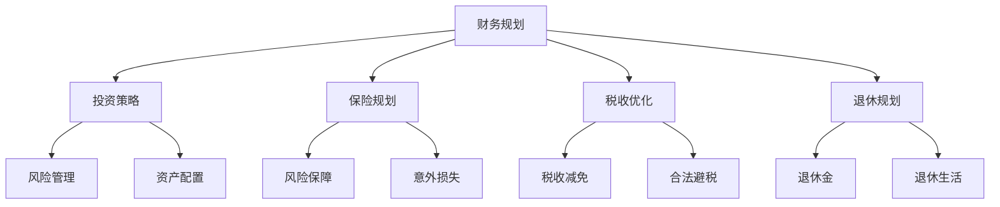

                 

# 程序员的财务规划：从入门到精通

> 关键词：财务规划、程序员的理财、投资策略、保险规划、税收优化、退休规划
> 
> 摘要：本篇文章旨在为程序员提供一个全面且易于理解的财务规划指南，帮助他们在职业生涯中实现财务自由。我们将探讨财务规划的核心概念，包括投资策略、保险规划、税收优化和退休规划，并通过实例和实战案例，让读者能够将这些理论知识应用到实际生活中。

## 1. 背景介绍

### 1.1 目的和范围

本文的目标是帮助程序员在他们的职业生涯中建立一个坚实的财务基础。我们将涵盖以下主题：

- 投资策略：了解不同类型的投资，以及如何根据风险偏好进行选择。
- 保险规划：了解不同类型的保险，并学会如何为自己和家人提供适当的风险保障。
- 税收优化：探讨如何合法地减少税负，提高财务收益。
- 退休规划：制定长期的退休规划，确保退休后的生活质量。

### 1.2 预期读者

本文适合以下读者：

- 职业程序员
- IT行业从业者
- 对个人财务规划感兴趣的普通读者

### 1.3 文档结构概述

本文结构如下：

- 引言：介绍财务规划的重要性和本文的目标。
- 背景介绍：解释财务规划对程序员的重要性。
- 核心概念与联系：介绍财务规划的核心概念和架构。
- 核心算法原理 & 具体操作步骤：详细阐述投资策略的算法原理和操作步骤。
- 数学模型和公式 & 详细讲解 & 举例说明：解释关键的数学模型和公式。
- 项目实战：提供实际案例和代码实现。
- 实际应用场景：分析财务规划在实际中的应用。
- 工具和资源推荐：推荐有用的学习资源和工具。
- 总结：总结本文的核心观点和未来发展趋势。
- 附录：回答常见问题。
- 扩展阅读 & 参考资料：提供进一步学习的资源。

### 1.4 术语表

#### 1.4.1 核心术语定义

- 财务规划：规划个人或组织的财务活动，包括收入、支出、投资和退休规划等。
- 投资策略：投资者为实现特定财务目标所采用的方法。
- 风险管理：识别、评估和控制投资过程中的风险。
- 保险规划：购买保险来保护个人和家庭免受意外损失的影响。
- 税收优化：通过合法手段减少税负，提高财务收益。

#### 1.4.2 相关概念解释

- 投资类型：股票、债券、基金、房地产等。
- 风险等级：低风险、中风险、高风险。
- 资产配置：将资金分配到不同类型的投资中，以实现投资目标。
- 税收减免：通过投资特定的金融产品或税收优惠政策来减少税负。

#### 1.4.3 缩略词列表

- IT：信息技术（Information Technology）
- CTO：首席技术官（Chief Technology Officer）
- ROI：投资回报率（Return on Investment）
- IPO：首次公开募股（Initial Public Offering）

## 2. 核心概念与联系

为了更好地理解财务规划，我们需要了解几个核心概念。以下是这些概念和它们之间的联系，以及一个简单的 Mermaid 流程图来帮助您可视化这些关系。



### 2.1 财务规划的核心概念

#### 投资策略

投资策略是投资者为实现特定财务目标所采用的方法。它包括投资类型（如股票、债券、基金、房地产等）和风险等级（如低风险、中风险、高风险）。资产配置是将资金分配到不同类型的投资中，以实现投资目标。

#### 保险规划

保险规划是购买保险来保护个人和家庭免受意外损失的影响。它包括风险保障（如医疗保险、意外保险）和意外损失（如财产损失、人身伤害）的保障。

#### 税收优化

税收优化是通过合法手段减少税负，提高财务收益。它包括税收减免（如投资特定的金融产品、税收优惠政策）和合法避税（如合理规划收入、支出）。

#### 退休规划

退休规划是制定长期的退休规划，确保退休后的生活质量。它包括退休金（如养老金、退休储蓄）和退休生活（如生活费用、娱乐活动）的规划。

## 3. 核心算法原理 & 具体操作步骤

### 3.1 投资策略

#### 3.1.1 算法原理

投资策略的核心在于如何根据风险偏好和财务目标进行资产配置。以下是投资策略的基本原理：

1. **确定风险偏好**：投资者需要了解自己的风险承受能力，以选择合适的投资组合。
2. **资产配置**：根据风险偏好和财务目标，将资金分配到不同类型的投资中。

#### 3.1.2 操作步骤

以下是投资策略的具体操作步骤：

1. **步骤1：确定风险偏好**：通过问卷调查或专业评估，了解自己的风险承受能力。
2. **步骤2：制定财务目标**：根据长期和短期目标，制定投资计划。
3. **步骤3：资产配置**：根据风险偏好和财务目标，将资金分配到股票、债券、基金和房地产等不同类型的投资中。
4. **步骤4：执行和监控**：定期检查投资组合的表现，并根据市场变化进行调整。

### 3.2 保险规划

#### 3.2.1 算法原理

保险规划的核心在于如何根据个人和家庭的需求选择合适的保险产品。以下是保险规划的基本原理：

1. **确定需求**：根据个人和家庭的情况，确定需要哪些类型的保险。
2. **比较产品**：了解不同保险公司的产品，选择最适合自己的保险。

#### 3.2.2 操作步骤

以下是保险规划的具体操作步骤：

1. **步骤1：确定需求**：分析个人和家庭的风险，确定需要哪些类型的保险（如医疗保险、意外保险、人寿保险）。
2. **步骤2：比较产品**：研究不同保险公司的产品，比较保险条款、保费和保障范围。
3. **步骤3：选择产品**：根据比较结果，选择最适合自己的保险产品。
4. **步骤4：购买保险**：与保险公司联系，完成购买过程。

### 3.3 税收优化

#### 3.3.1 算法原理

税收优化的核心在于如何通过合法手段减少税负，提高财务收益。以下是税收优化的基本原理：

1. **了解税法**：熟悉税法规定，了解哪些投资和支出可以免税或减税。
2. **规划投资**：选择可以免税或减税的投资，如退休储蓄计划、健康储蓄账户等。

#### 3.3.2 操作步骤

以下是税收优化的具体操作步骤：

1. **步骤1：了解税法**：研究税法规定，了解哪些投资和支出可以免税或减税。
2. **步骤2：规划投资**：根据税法规定，选择可以免税或减税的投资，如退休储蓄计划、健康储蓄账户等。
3. **步骤3：执行和监控**：定期检查投资组合的表现，并根据市场变化进行调整。

### 3.4 退休规划

#### 3.4.1 算法原理

退休规划的核心在于如何确保退休后有足够的资金支持生活。以下是退休规划的基本原理：

1. **计算退休资金需求**：根据预期的生活成本和退休年龄，计算退休所需的资金。
2. **规划储蓄和投资**：制定长期的储蓄和投资计划，确保有足够的资金支持退休生活。

#### 3.4.2 操作步骤

以下是退休规划的具体操作步骤：

1. **步骤1：计算退休资金需求**：根据预期的生活成本和退休年龄，计算退休所需的资金。
2. **步骤2：制定储蓄计划**：根据退休资金需求，制定长期的储蓄计划。
3. **步骤3：规划投资**：选择合适的投资渠道，确保储蓄能够产生稳定的收益。
4. **步骤4：监控和调整**：定期检查退休计划的执行情况，并根据市场变化进行调整。

## 4. 数学模型和公式 & 详细讲解 & 举例说明

### 4.1 投资策略的数学模型

投资策略的核心在于如何分配资产以实现预期收益。以下是一个简单的资产配置公式：

$$
A = w_1 \cdot S_1 + w_2 \cdot S_2 + ... + w_n \cdot S_n
$$

其中，$A$ 是总资产，$w_i$ 是资产 $i$ 的权重，$S_i$ 是资产 $i$ 的预期收益。

#### 4.1.1 举例说明

假设一个程序员有 $100,000$ 美元的初始资金，他决定将其分为股票、债券和基金三种资产。他的风险偏好是中等风险，因此决定股票占 50%，债券占 30%，基金占 20%。

- 股票预期收益：12%
- 债券预期收益：4%
- 基金预期收益：8%

根据上述公式，我们可以计算出总资产的预期收益：

$$
A = 0.5 \cdot 0.12 + 0.3 \cdot 0.04 + 0.2 \cdot 0.08 = 0.06 + 0.012 + 0.016 = 0.088
$$

因此，总资产的预期收益为 8.8%。

### 4.2 税收优化的数学模型

税收优化的核心在于如何通过合法手段减少税负。以下是一个简单的税收优化公式：

$$
T = C \cdot r
$$

其中，$T$ 是税额，$C$ 是应纳税收入，$r$ 是税率。

#### 4.2.1 举例说明

假设一个程序员的应纳税收入为 $50,000$ 美元，税率为 25%。

根据上述公式，我们可以计算出应纳税额：

$$
T = 50,000 \cdot 0.25 = 12,500
$$

因此，应纳税额为 12,500 美元。

### 4.3 退休规划的数学模型

退休规划的核心在于如何确保退休后有足够的资金支持生活。以下是一个简单的退休规划公式：

$$
R = C \cdot (1 + i)^n
$$

其中，$R$ 是退休后的资金总额，$C$ 是每年的储蓄金额，$i$ 是每年的投资收益率，$n$ 是退休前的年数。

#### 4.3.1 举例说明

假设一个程序员的预期退休年龄为 65 岁，当前年龄为 30 岁，他决定每年储蓄 $10,000$ 美元，投资收益率为 5%。

根据上述公式，我们可以计算出退休后的资金总额：

$$
R = 10,000 \cdot (1 + 0.05)^{65 - 30} = 10,000 \cdot 1.05^{35} \approx 10,000 \cdot 5.629 = 56,290
$$

因此，退休后的资金总额约为 56,290 美元。

## 5. 项目实战：代码实际案例和详细解释说明

### 5.1 开发环境搭建

在开始之前，我们需要搭建一个简单的开发环境。以下是一个基本的步骤：

1. 安装 Python 解释器
2. 安装 Pandas、NumPy 和 Matplotlib 等库

你可以使用以下命令来安装所需的库：

```shell
pip install pandas numpy matplotlib
```

### 5.2 源代码详细实现和代码解读

我们将使用 Python 编写一个简单的投资策略模拟器。以下是一个示例代码：

```python
import pandas as pd
import numpy as np
import matplotlib.pyplot as plt

# 定义资产配置
assets = {
    'Stocks': 0.5,
    'Bonds': 0.3,
    'Funds': 0.2
}

# 定义各资产的预期收益率
expected_returns = {
    'Stocks': 0.12,
    'Bonds': 0.04,
    'Funds': 0.08
}

# 模拟投资策略
def simulate_investment(principal, asset_weights, expected_returns, years):
    total_investment = principal
    investment_growth = np.zeros(years)
    investment_growth[0] = principal
    
    for year in range(1, years):
        growth = 0
        for asset, weight in asset_weights.items():
            growth += weight * expected_returns[asset]
        investment_growth[year] = investment_growth[year - 1] * (1 + growth)
        
    return investment_growth

# 设置初始参数
initial_principal = 100000
years = 30

# 执行模拟
investment_growth = simulate_investment(initial_principal, assets, expected_returns, years)

# 绘图
plt.plot(investment_growth)
plt.xlabel('Years')
plt.ylabel('Investment Growth')
plt.title('Investment Growth Over Time')
plt.show()
```

#### 5.2.1 代码解读

- **导入库**：我们使用 Pandas、NumPy 和 Matplotlib 来处理数据和绘制图表。
- **定义资产配置**：`assets` 字典包含了各资产的比例。
- **定义预期收益率**：`expected_returns` 字典包含了各资产的预期收益率。
- **模拟投资策略**：`simulate_investment` 函数接受初始本金、资产配置和预期收益率，并返回投资增长的列表。
- **执行模拟**：我们设置初始参数并执行模拟。
- **绘图**：使用 Matplotlib 绘制投资增长曲线。

### 5.3 代码解读与分析

这个简单的模拟器可以帮助我们直观地看到投资策略的效果。以下是对代码的进一步分析：

- **资产配置**：我们将本金分为股票、债券和基金三种资产，分别占 50%、30% 和 20%。
- **预期收益率**：根据市场情况和风险偏好，我们设定了各资产的预期收益率。
- **模拟过程**：每年，我们计算各资产的收益，并将其累加到总本金中。
- **绘图**：通过绘制投资增长曲线，我们可以直观地看到投资策略的效果。

## 6. 实际应用场景

财务规划在程序员的生活中扮演着重要角色。以下是一些实际应用场景：

### 6.1 购买住房

许多程序员在职业生涯的早期就会考虑购买住房。这需要他们进行详细的财务规划，包括计算购房首付、贷款和还贷计划。

### 6.2 提高生活质量

随着收入的增加，程序员可能会考虑提高生活质量，如购买新车、旅行或参加高端培训课程。这需要他们合理规划开支和储蓄。

### 6.3 退休规划

程序员通常工作多年，积累了一定的财富。因此，退休规划变得尤为重要。他们需要制定长期的储蓄和投资计划，以确保退休后的生活质量。

### 6.4 应对意外情况

意外情况（如失业、疾病或家庭紧急情况）可能会对财务状况产生重大影响。程序员需要购买适当的保险，以应对这些风险。

## 7. 工具和资源推荐

### 7.1 学习资源推荐

#### 7.1.1 书籍推荐

- 《富爸爸，穷爸爸》（Robert T. Kiyosaki）：介绍基本的理财和投资知识。
- 《投资最重要的事》（Howard Marks）：探讨投资思维和策略。
- 《财务自由之路》（T. Harv Eker）：介绍如何实现财务自由。

#### 7.1.2 在线课程

- Coursera 上的“Personal Finance and Investing”
- Udemy 上的“Financial Planning for IT Professionals”

#### 7.1.3 技术博客和网站

- [Koyfin](https://koyfin.com/)
- [Investopedia](https://www.investopedia.com/)
- [Personal Finance Insider](https://www.personalfinanceinsider.com/)

### 7.2 开发工具框架推荐

#### 7.2.1 IDE和编辑器

- PyCharm
- Visual Studio Code

#### 7.2.2 调试和性能分析工具

- Python Debugger
- Jupyter Notebook

#### 7.2.3 相关框架和库

- Pandas
- NumPy
- Matplotlib

### 7.3 相关论文著作推荐

#### 7.3.1 经典论文

- “The Efficient Market Hypothesis” by Eugene Fama
- “The Capital Asset Pricing Model” by William Sharpe

#### 7.3.2 最新研究成果

- “Investment Strategies for Individual Investors” by Vanguard Research
- “Behavioral Finance: A Comprehensive Analysis” by George Loewenstein

#### 7.3.3 应用案例分析

- “Investment Strategies for Startups” by Andreessen Horowitz
- “Financial Planning for Entrepreneurs” by the Entrepreneurship Foundation

## 8. 总结：未来发展趋势与挑战

随着技术的进步和金融市场的发展，财务规划在未来将继续面临新的挑战和机遇。以下是一些未来发展趋势和挑战：

- **自动化财务规划**：随着人工智能和机器学习技术的发展，自动化财务规划工具将变得更加普及，提供更加个性化和高效的财务建议。
- **金融科技的崛起**：金融科技（FinTech）公司将推动金融服务的创新和变革，提供更多的投资和储蓄选择。
- **全球化的影响**：全球化的加剧将影响投资者的财务规划，包括汇率波动和跨国投资策略。
- **税收政策的变动**：税收政策的变动将对财务规划产生重要影响，需要投资者密切关注政策变化，并做出相应的调整。

## 9. 附录：常见问题与解答

### 9.1 财务规划的基本原则是什么？

财务规划的基本原则包括：明确目标、合理分配资产、风险管理、税收优化和定期评估。

### 9.2 什么是投资组合？

投资组合是指将资金分配到多种不同的资产（如股票、债券、基金等），以实现分散风险和最大化收益的投资策略。

### 9.3 保险规划中的主要类型有哪些？

保险规划中的主要类型包括：人寿保险、健康保险、意外保险、财产保险和责任保险。

### 9.4 如何进行退休规划？

进行退休规划需要计算退休资金需求、制定储蓄计划、选择合适的投资渠道，并定期监控和调整退休计划。

## 10. 扩展阅读 & 参考资料

- Kiyosaki, R. T. (2000). 《富爸爸，穷爸爸》。纽约：和平之路出版社。
- Marks, H. (2015). 《投资最重要的事》。纽约：约翰·威利父子公司。
- Eker, T. H. (2011). 《财务自由之路》。纽约：哈珀柯林斯出版社。
- Fama, E. F. (1970). “Efficient Capital Markets: A Review of Theory and Empirical Work.” The Journal of Finance.
- Sharpe, W. F. (1964). “Capital Asset Pricing Model.” Journal of Finance.
- Vanguard Research. (2020). “Investment Strategies for Individual Investors.” Vanguard.
- Loewenstein, G., Prelec, D., & Simester, D. (2001). “Behavioral Finance: A Comprehensive Analysis.” Journal of Economic Literature.
- Andreessen, M., & Horowitz, B. (2014). “Investment Strategies for Startups.” Andreessen Horowitz.
- Entrepreneurship Foundation. (2018). “Financial Planning for Entrepreneurs.” Entrepreneurship Foundation.

