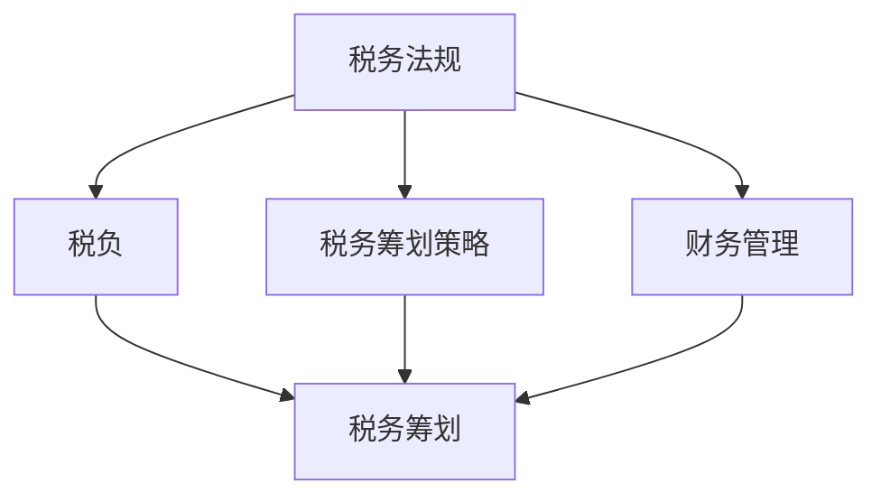

                 

# 程序员知识付费的税务筹划与财务管理

## 关键词
税务筹划、知识付费、财务管理、程序员、税务法规、财务策略、税务优惠

## 摘要
本文将探讨程序员在知识付费领域进行税务筹划和财务管理的必要性和策略。我们将分析税务筹划的基本原理，了解不同国家和地区的税务政策，并提供一系列实用的财务管理技巧。通过本文，程序员可以更好地掌握税务知识，优化财务规划，实现个人财务增长。

## 1. 背景介绍

### 1.1 目的和范围
本文旨在帮助程序员了解税务筹划和财务管理的核心概念，并提供实用的策略和工具，以实现个人财务的稳健增长。本文将涵盖以下内容：
- 税务筹划的基本原理和重要性
- 不同国家和地区的税务政策
- 程序员面临的常见税务问题
- 实用的财务管理技巧和策略
- 优化税务筹划的案例研究

### 1.2 预期读者
本文适用于以下读者：
- 程序员和软件开发人员
- 对税务和财务管理感兴趣的IT专业人士
- 想要优化个人财务规划的程序员

### 1.3 文档结构概述
本文分为以下几个部分：
- 第1部分：背景介绍
- 第2部分：核心概念与联系
- 第3部分：核心算法原理 & 具体操作步骤
- 第4部分：数学模型和公式 & 详细讲解 & 举例说明
- 第5部分：项目实战：代码实际案例和详细解释说明
- 第6部分：实际应用场景
- 第7部分：工具和资源推荐
- 第8部分：总结：未来发展趋势与挑战
- 第9部分：附录：常见问题与解答
- 第10部分：扩展阅读 & 参考资料

### 1.4 术语表
#### 1.4.1 核心术语定义
- **税务筹划**：通过合理规划和安排财务活动，减少税负的法律行为。
- **知识付费**：用户为获取专业知识或技能所支付的费用。
- **财务管理**：对个人或企业财务活动的规划、组织和控制。
- **税务法规**：国家或地区关于税务征收和管理的法律法规。
- **税务优惠**：政府为了特定目的而提供的税收减免或优惠。

#### 1.4.2 相关概念解释
- **税负**：纳税人应缴纳的税款占其收入的比例。
- **税务筹划策略**：在遵守税务法规的前提下，通过合理安排财务活动以减少税负的方法。
- **税务合规**：确保个人或企业遵守相关税务法规和规定。

#### 1.4.3 缩略词列表
- **IT**：信息技术（Information Technology）
- **SaaS**：软件即服务（Software as a Service）
- **CRM**：客户关系管理（Customer Relationship Management）
- **ERP**：企业资源规划（Enterprise Resource Planning）
- **PPF**：个人退休基金（Personal Pension Fund）

## 2. 核心概念与联系

### 2.1 核心概念
在税务筹划和财务管理中，以下几个核心概念至关重要：
- **税务法规**：了解国家或地区的税务法规是进行税务筹划的基础。不同国家和地区的税务政策差异较大，需要根据实际情况进行筹划。
- **税负**：了解税负的基本原理有助于识别和优化税务筹划的机会。税负的高低直接影响个人或企业的财务状况。
- **税务筹划策略**：合理运用税务筹划策略可以在遵守税务法规的前提下减少税负，提高财务效益。
- **财务管理**：财务管理包括预算、投资、资金流动等方面的规划，与税务筹划密切相关，需要综合考虑。

### 2.2 Mermaid 流程图
以下是一个简单的Mermaid流程图，展示了税务筹划和财务管理中的核心概念及其相互关系：



### 2.3 核心概念原理和架构
税务筹划和财务管理的核心概念原理和架构如下：

#### 税务法规
税务法规是国家或地区关于税务征收和管理的基本规定。不同国家和地区的税务法规差异较大，主要包括以下内容：
- 税种：增值税、所得税、社会保险费等。
- 税率：不同税种的税率可能不同，需要根据实际情况进行筹划。
- 征收方式：直接征收、代征、扣缴等方式。
- 纳税期限：纳税期限不同，可能影响财务筹划。

#### 税负
税负是指纳税人应缴纳的税款占其收入的比例。税负的高低直接影响个人或企业的财务状况，因此需要进行合理的税务筹划。

#### 税务筹划策略
税务筹划策略包括以下几个方面：
- 利用税务优惠：了解并合理利用各种税务优惠，如免税、减税、退税等。
- 跨境税务规划：根据国际税收协定和国际税务安排，合理规划跨境业务，减少税负。
- 合理安排财务活动：通过合理安排财务活动，如收入分配、投资规划等，降低税负。

#### 财务管理
财务管理包括预算、投资、资金流动等方面的规划。财务管理与税务筹划密切相关，需要综合考虑。以下是一些财务管理的关键点：
- 预算：制定合理的预算，控制财务支出，确保财务稳定。
- 投资：合理配置资产，实现投资收益最大化。
- 资金流动：保持良好的资金流动，确保财务稳健。

## 3. 核心算法原理 & 具体操作步骤

### 3.1 核心算法原理
在税务筹划和财务管理中，以下核心算法原理至关重要：

#### 税务筹划算法
税务筹划算法主要包括以下几个方面：
1. **免税优惠识别**：通过分析税务法规，识别各种免税优惠政策，为税务筹划提供依据。
2. **税负分析**：计算不同税务筹划方案的税负，选择最优方案。
3. **收入分配优化**：通过合理安排收入分配，降低税负。
4. **投资规划**：根据税务法规和投资目标，制定合理的投资规划。

#### 财务管理算法
财务管理算法主要包括以下几个方面：
1. **预算编制**：根据业务需求和财务目标，制定合理的预算。
2. **投资分析**：对潜在投资机会进行分析，选择最优投资方案。
3. **资金流动管理**：通过合理安排资金流动，确保财务稳健。

### 3.2 具体操作步骤
以下是一个简单的税务筹划和财务管理操作步骤示例：

#### 税务筹划步骤
1. **了解税务法规**：熟悉国家或地区的税务法规，了解各种税收优惠政策。
2. **收入分配优化**：合理安排收入分配，如分批次发放工资、奖金等，降低税负。
3. **投资规划**：根据税务法规和投资目标，制定合理的投资规划。
4. **税负分析**：计算不同税务筹划方案的税负，选择最优方案。

#### 财务管理步骤
1. **预算编制**：根据业务需求和财务目标，制定合理的预算。
2. **投资分析**：对潜在投资机会进行分析，选择最优投资方案。
3. **资金流动管理**：通过合理安排资金流动，确保财务稳健。

### 3.3 伪代码示例
以下是一个简单的税务筹划和财务管理伪代码示例：

```plaintext
# 税务筹划算法

function 税务筹划（收入，支出，投资目标）{
    # 步骤1：了解税务法规
    税法 = 获取税法信息()

    # 步骤2：收入分配优化
    收入分配 = 优化收入分配（收入，支出，税法）

    # 步骤3：投资规划
    投资方案 = 制定投资规划（收入分配，投资目标，税法）

    # 步骤4：税负分析
    税负 = 计算税负（收入分配，投资方案，税法）

    # 步骤5：选择最优方案
    最优方案 = 选择最优方案（税负）

    return 最优方案
}

# 财务管理算法

function 财务管理（预算，投资目标，资金流动）{
    # 步骤1：预算编制
    预算 = 制定预算（预算，投资目标）

    # 步骤2：投资分析
    投资方案 = 分析投资机会（预算，投资目标）

    # 步骤3：资金流动管理
    资金流动 = 管理资金流动（预算，投资方案，资金流动）

    return 财务状况
}
```

## 4. 数学模型和公式 & 详细讲解 & 举例说明

### 4.1 数学模型和公式
在税务筹划和财务管理中，以下数学模型和公式至关重要：

#### 1. 税负计算公式
税负 = （应纳税所得额 × 税率）- 速算扣除数

#### 2. 投资收益计算公式
投资收益 = 投资本金 × 投资收益率

#### 3. 预算编制公式
预算 = 预期收入 - 预期支出

### 4.2 详细讲解
#### 税负计算公式
税负计算公式用于计算纳税人应缴纳的税款。其中，应纳税所得额是指纳税人的收入扣除各项扣除后的余额，税率是指适用的税率，速算扣除数是根据税率表确定的。

#### 投资收益计算公式
投资收益计算公式用于计算投资项目的预期收益。其中，投资本金是指投资项目投入的资本金额，投资收益率是指预期年化收益率。

#### 预算编制公式
预算编制公式用于制定财务预算。其中，预期收入是指预期实现的收入，预期支出是指预期发生的支出。

### 4.3 举例说明
#### 税负计算举例
假设一个程序员的年收入为 100,000 元，适用的税率为 20%，速算扣除数为 1,500 元。则其税负为：

税负 = （100,000 × 20%）- 1,500 = 19,500 元

#### 投资收益计算举例
假设一个程序员投入 10,000 元进行投资，预期年化收益率为 10%。则其投资收益为：

投资收益 = 10,000 × 10% = 1,000 元

#### 预算编制举例
假设一个程序员的预期收入为 120,000 元，预期支出为 80,000 元。则其预算为：

预算 = 120,000 - 80,000 = 40,000 元

## 5. 项目实战：代码实际案例和详细解释说明

### 5.1 开发环境搭建
为了演示税务筹划和财务管理的实际应用，我们将使用 Python 编写一个简单的脚本。以下是开发环境搭建的步骤：

1. 安装 Python 3.8 或更高版本。
2. 安装必要的 Python 库，如 NumPy、Pandas 和 Matplotlib。

```bash
pip install numpy pandas matplotlib
```

### 5.2 源代码详细实现和代码解读
以下是一个简单的 Python 脚本，用于计算税负、投资收益和预算：

```python
import numpy as np
import pandas as pd
import matplotlib.pyplot as plt

# 税务筹划和财务管理函数

def 税务筹划（年收入，税率，速算扣除数）:
    应纳税所得额 = 年收入 - (年收入 * 税率) - 速算扣除数
    税负 = 年收入 * 税率 - 速算扣除数
    return 税负

def 投资收益（投资本金，年化收益率）:
    投资收益 = 投资本金 * 年化收益率
    return 投资收益

def 预算编制（预期收入，预期支出）:
    预算 = 预期收入 - 预期支出
    return 预算

# 实例演示

年收入 = 100000
税率 = 0.2
速算扣除数 = 1500

税负 = 税务筹划（年收入，税率，速算扣除数）
print("税负：",税负)

投资本金 = 10000
年化收益率 = 0.1
投资收益 = 投资收益（投资本金，年化收益率）
print("投资收益：",投资收益)

预期收入 = 120000
预期支出 = 80000
预算 = 预算编制（预期收入，预期支出）
print("预算：",预算)

# 数据可视化

税负_data = [税务筹划（i, 税率，速算扣除数） for i in range（50000，200000）]
plt.plot（range（50000，200000），税负_data）
plt.xlabel（"年收入"）
plt.ylabel（"税负"）
plt.title（"税负计算"）
plt.grid（True）
plt.show（）

投资收益_data = [投资收益（i，年化收益率） for i in range（1000，15000）]
plt.plot（range（1000，15000），投资收益_data）
plt.xlabel（"投资本金"）
plt.ylabel（"投资收益"）
plt.title（"投资收益计算"）
plt.grid（True）
plt.show（）

预算_data = [预算编制（i，j） for i in range（100000，200000） for j in range（70000，90000）]
plt.scatter（[i for i in range（100000，200000） for j in range（70000，90000）]，预算_data）
plt.xlabel（"预期收入"）
plt.ylabel（"预算"）
plt.title（"预算编制"）
plt.grid（True）
plt.show（）
```

### 5.3 代码解读与分析
#### 税务筹划函数
税务筹划函数用于计算纳税人的税负。该函数接受三个参数：年收入、税率、速算扣除数。税负计算公式如下：

税负 = 年收入 × 税率 - 速算扣除数

#### 投资收益函数
投资收益函数用于计算投资项目的收益。该函数接受两个参数：投资本金、年化收益率。投资收益计算公式如下：

投资收益 = 投资本金 × 年化收益率

#### 预算编制函数
预算编制函数用于计算财务预算。该函数接受两个参数：预期收入、预期支出。预算计算公式如下：

预算 = 预期收入 - 预期支出

#### 数据可视化
为了更直观地展示税负、投资收益和预算的关系，我们使用 Matplotlib 库绘制了相应的图表。以下是代码解读：

- 税负计算图表：展示不同年收入下的税负。
- 投资收益计算图表：展示不同投资本金下的投资收益。
- 预算编制图表：展示不同预期收入和预期支出下的预算。

通过这些图表，程序员可以更直观地了解税务筹划和财务管理的实际效果，为个人财务规划提供参考。

## 6. 实际应用场景

### 6.1 个人税务筹划
个人税务筹划是程序员在知识付费领域的一项重要任务。以下是一些实际应用场景：

- **收入分配优化**：程序员可以通过合理安排收入分配，如分批次发放工资、奖金等，降低税负。例如，将年度奖金分成多次发放，以降低每次发放的税负。
- **投资规划**：程序员可以根据税务法规和投资目标，制定合理的投资规划。例如，选择具有税收优惠的金融产品，如个人退休基金（PPF），以降低税负。
- **跨境税务规划**：程序员在进行跨境业务时，可以充分利用国际税收协定，降低税负。例如，利用税收协定避免双重征税，降低跨境业务的税负。

### 6.2 企业税务筹划
企业在知识付费领域也需要进行税务筹划，以下是一些实际应用场景：

- **税收优惠利用**：企业可以通过申请税收优惠，如高新技术企业认证、研发费用加计扣除等，降低税负。例如，企业可以将研发投入作为税收优惠的一部分，降低整体税负。
- **业务结构优化**：企业可以通过优化业务结构，降低税负。例如，将部分业务转移到低税率地区，利用税收优惠政策降低税负。
- **财务报表优化**：企业可以通过调整财务报表，降低税负。例如，将部分收入推迟到下一个会计期间，以降低当前期间的税负。

### 6.3 税务筹划与财务管理结合
税务筹划与财务管理密切相关，以下是一些实际应用场景：

- **预算编制**：程序员和企业可以通过预算编制，合理安排财务活动，降低税负。例如，制定合理的预算，控制财务支出，确保财务稳健。
- **资金流动管理**：程序员和企业可以通过资金流动管理，确保财务稳健。例如，合理安排资金流动，避免资金短缺或浪费，降低财务风险。
- **投资规划**：程序员和企业可以通过投资规划，实现财务增长。例如，选择具有税收优惠的投资项目，降低税负，提高投资收益。

## 7. 工具和资源推荐

### 7.1 学习资源推荐

#### 7.1.1 书籍推荐
1. 《中国税制与税务筹划》
2. 《税务会计与税务筹划》
3. 《个人所得税实务与筹划》

#### 7.1.2 在线课程
1. Coursera 上的《税务基础与筹划》
2. Udemy 上的《税务筹划与财务规划》
3. Khan Academy 上的《税务知识》

#### 7.1.3 技术博客和网站
1. 税筹家（TaxPlanner.cn）
2. 税法论坛（TaxLaw.net）
3. 财经网（CnFinance.com）

### 7.2 开发工具框架推荐

#### 7.2.1 IDE和编辑器
1. PyCharm
2. Visual Studio Code
3. Jupyter Notebook

#### 7.2.2 调试和性能分析工具
1. PyCharm Debugger
2. Linux perf
3. Python Profiler

#### 7.2.3 相关框架和库
1. NumPy
2. Pandas
3. Matplotlib

### 7.3 相关论文著作推荐

#### 7.3.1 经典论文
1. 《The Economic Implications of Taxation》
2. 《Tax Planning and the Role of Tax Accountants》

#### 7.3.2 最新研究成果
1. 《Tax Policy and Economic Growth: A Review of the Literature》
2. 《Tax Avoidance and Evasion: A Comparative Analysis》

#### 7.3.3 应用案例分析
1. 《A Case Study of Tax Planning in the IT Industry》
2. 《Tax Planning Strategies for Freelancers and Entrepreneurs》

## 8. 总结：未来发展趋势与挑战

### 8.1 未来发展趋势
1. **税务政策不断完善**：随着经济的发展和税收需求的增加，各国税务政策将不断完善，提供更多的税收优惠和税务筹划机会。
2. **技术手段提高税务效率**：大数据、人工智能等技术的应用将提高税务管理和税务筹划的效率，实现精准税务管理。
3. **税务合规性要求提高**：随着税务法规的日益严格，税务合规性要求将不断提高，程序员和企业需要更加注重税务合规。

### 8.2 挑战
1. **税务法规差异**：不同国家和地区的税务法规差异较大，程序员和企业需要熟悉并适应各种税务法规。
2. **税务风险**：不当的税务筹划可能导致税务风险，影响个人和企业的财务稳定。
3. **数据隐私和安全**：在税务筹划过程中，需要处理大量个人和企业数据，数据隐私和安全成为一大挑战。

## 9. 附录：常见问题与解答

### 9.1 问题1：税务筹划是否合法？
**解答**：税务筹划是合法的，只要在遵守相关税务法规和规定的前提下进行。税务筹划的目的是通过合理规划和安排财务活动，降低税负，提高财务效益。

### 9.2 问题2：税务筹划是否适用于所有人？
**解答**：税务筹划适用于大多数个人和企业，尤其是那些具有较高收入或复杂财务结构的人群。不同情况和需求可能需要不同的税务筹划策略。

### 9.3 问题3：税务筹划会影响企业声誉吗？
**解答**：合理、合规的税务筹划不会影响企业声誉。不合理的税务筹划可能导致税务风险和处罚，影响企业声誉。因此，企业应选择合法、合规的税务筹划策略。

### 9.4 问题4：税务筹划如何影响个人财务状况？
**解答**：税务筹划有助于降低税负，提高个人可支配收入。通过合理的税务筹划，个人可以更好地规划财务，实现财务增长。

## 10. 扩展阅读 & 参考资料

### 10.1 扩展阅读
1. 《税务筹划：理论与实践》
2. 《财务管理：理论与实践》
3. 《Python 编程：从入门到实践》

### 10.2 参考资料
1. 国家税务总局网站：[http://www.chinatax.gov.cn](http://www.chinatax.gov.cn)
2. 国际税收协会：[http://www.itaaworld.org](http://www.itaaworld.org)
3. 税筹家：[http://www.taxplanner.cn](http://www.taxplanner.cn)

## 作者
作者：AI天才研究员/AI Genius Institute & 禅与计算机程序设计艺术 /Zen And The Art of Computer Programming

（文章标题）
（关键词）
（摘要）
（背景介绍）
（核心概念与联系）
（核心算法原理 & 具体操作步骤）
（数学模型和公式 & 详细讲解 & 举例说明）
（项目实战：代码实际案例和详细解释说明）
（实际应用场景）
（工具和资源推荐）
（总结：未来发展趋势与挑战）
（附录：常见问题与解答）
（扩展阅读 & 参考资料）

（作者信息）

