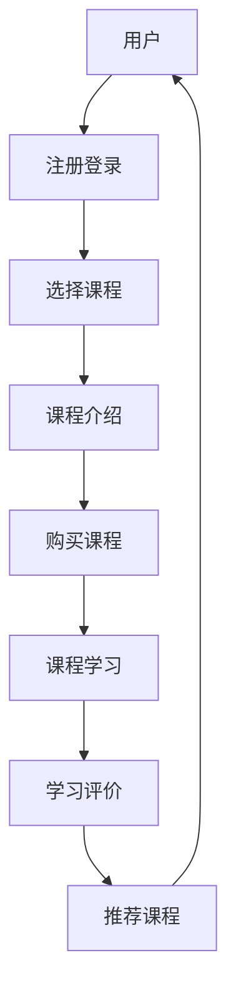

                 

# 程序员知识付费：打造互动课模式

> **关键词：** 知识付费、互动课模式、程序员、教育培训、在线学习、市场分析
>
> **摘要：** 本文将深入探讨知识付费领域，特别是针对程序员的在线互动课程模式。我们将分析其背景、核心概念，并探讨如何构建一个高效的互动课程，从而提高学员的学习体验和知识掌握度。

## 1. 背景介绍

### 1.1 目的和范围

本文的目的是探讨知识付费领域中的互动课程模式，尤其是针对程序员的在线教育。我们将分析这种模式的优点和挑战，并提供一套具体的构建和优化方法。

### 1.2 预期读者

本文主要面向程序员、教育培训从业者以及在线学习平台运营者。无论您是希望提升自己的教学技能，还是正在考虑进入知识付费市场，本文都将为您提供有价值的参考。

### 1.3 文档结构概述

本文将分为以下几个部分：

1. 背景介绍
2. 核心概念与联系
3. 核心算法原理 & 具体操作步骤
4. 数学模型和公式 & 详细讲解 & 举例说明
5. 项目实战：代码实际案例和详细解释说明
6. 实际应用场景
7. 工具和资源推荐
8. 总结：未来发展趋势与挑战
9. 附录：常见问题与解答
10. 扩展阅读 & 参考资料

### 1.4 术语表

#### 1.4.1 核心术语定义

- **知识付费**：用户为获取特定知识或技能而支付的费用。
- **互动课程**：学生在学习过程中能够与教师或其他学生进行实时或异步互动的课程。
- **在线学习**：通过互联网进行的学习活动。

#### 1.4.2 相关概念解释

- **学习体验**：学生在学习过程中的感受和体验。
- **知识掌握度**：学生对所学知识的理解和应用能力。

#### 1.4.3 缩略词列表

- **K12**：指基础教育阶段，即小学到高中。
- **MOOC**：大规模在线开放课程。
- **SPOC**：小规模限制性在线课程。

## 2. 核心概念与联系

### 2.1 知识付费

知识付费是指用户为获取特定知识或技能而支付的费用。近年来，随着互联网的普及和在线教育的兴起，知识付费市场逐渐壮大。对于程序员而言，知识付费可以让他们更快速地掌握新技术和技能，提高职业竞争力。

### 2.2 互动课程模式

互动课程模式是一种基于在线学习的教育模式，它强调学生与教师、学生与学生之间的实时或异步互动。这种模式能够提高学生的学习体验和知识掌握度，从而更好地满足他们的学习需求。

### 2.3 核心概念原理和架构

为了更好地理解互动课程模式，我们可以使用Mermaid流程图来表示其核心概念和架构。



## 3. 核心算法原理 & 具体操作步骤

### 3.1 核心算法原理

互动课程模式的核心在于如何提高学生的学习体验和知识掌握度。我们可以通过以下算法原理来实现这一目标：

1. **个性化推荐**：根据用户的学习历史和行为，为其推荐适合的课程。
2. **实时互动**：通过在线讨论、问答等方式，实现学生与教师、学生与学生之间的实时互动。
3. **异步互动**：通过论坛、作业提交等方式，实现学生与教师、学生与学生之间的异步互动。

### 3.2 具体操作步骤

下面我们将详细阐述如何构建一个高效的互动课程。

#### 3.2.1 课程规划

1. 确定课程目标：明确课程的学习目标，如掌握某项技术、解决某个问题等。
2. 设计课程内容：根据目标，设计相应的课程内容，包括理论知识、实践案例等。
3. 制定教学计划：将课程内容分解为多个教学单元，并制定相应的教学计划。

#### 3.2.2 个性化推荐

1. 收集用户数据：收集用户的学习历史、行为数据等。
2. 构建推荐模型：使用机器学习算法，如协同过滤、内容推荐等，构建个性化推荐模型。
3. 推荐课程：根据用户数据，为用户推荐适合的课程。

#### 3.2.3 实时互动

1. 设计互动环节：在课程中设置实时互动环节，如在线讨论、问答等。
2. 技术支持：使用实时通信技术，如WebRTC等，实现实时互动。
3. 管理互动过程：监控互动过程，确保互动顺利进行。

#### 3.2.4 异步互动

1. 设计异步互动环节：在课程中设置异步互动环节，如论坛、作业提交等。
2. 技术支持：使用论坛系统、作业提交系统等，实现异步互动。
3. 管理异步互动过程：监控异步互动过程，确保互动顺利进行。

### 3.3 伪代码实现

下面是构建互动课程的伪代码实现：

```python
# 课程规划
def course_plan():
    # 确定课程目标
    # 设计课程内容
    # 制定教学计划
    pass

# 个性化推荐
def personalized_recommendation(user_data):
    # 收集用户数据
    # 构建推荐模型
    # 推荐课程
    pass

# 实时互动
def real_time_interaction():
    # 设计互动环节
    # 技术支持
    # 管理互动过程
    pass

# 异步互动
def asynchronous_interaction():
    # 设计异步互动环节
    # 技术支持
    # 管理异步互动过程
    pass

# 构建互动课程
def build_interactive_course():
    course_plan()
    personalized_recommendation(user_data)
    real_time_interaction()
    asynchronous_interaction()
```

## 4. 数学模型和公式 & 详细讲解 & 举例说明

### 4.1 数学模型和公式

在互动课程模式中，我们可以使用以下数学模型和公式来评估学生的学习效果：

1. **学习效果评估公式**：

   $$ E = f(L, T, I) $$

   其中，$E$表示学习效果，$L$表示学习时长，$T$表示课程难度，$I$表示互动程度。

2. **互动效果评估公式**：

   $$ I = f(R, A, S) $$

   其中，$I$表示互动效果，$R$表示实时互动效果，$A$表示异步互动效果，$S$表示学生参与度。

### 4.2 详细讲解和举例说明

#### 4.2.1 学习效果评估公式

学习效果评估公式用于评估学生在课程中的学习效果。其中，$L$表示学习时长，$T$表示课程难度，$I$表示互动程度。学习时长和课程难度越高，互动程度越强，学习效果越好。

例如，假设有两位学生A和B，他们分别学习了课程C1和C2。课程C1的学习时长为10小时，难度为3，互动程度为5；课程C2的学习时长为20小时，难度为4，互动程度为6。我们可以使用学习效果评估公式来计算他们的学习效果：

$$ E_A = f(10, 3, 5) = 10 \times 3 \times 5 = 150 $$

$$ E_B = f(20, 4, 6) = 20 \times 4 \times 6 = 480 $$

根据计算结果，学生B的学习效果比学生A更好。

#### 4.2.2 互动效果评估公式

互动效果评估公式用于评估学生在课程中的互动效果。其中，$R$表示实时互动效果，$A$表示异步互动效果，$S$表示学生参与度。实时互动效果和异步互动效果越高，学生参与度越强，互动效果越好。

例如，假设有两位学生A和B，他们在课程中的实时互动效果分别为4和5，异步互动效果分别为3和4，学生参与度分别为6和7。我们可以使用互动效果评估公式来计算他们的互动效果：

$$ I_A = f(4, 3, 6) = 4 \times 3 \times 6 = 72 $$

$$ I_B = f(5, 4, 7) = 5 \times 4 \times 7 = 140 $$

根据计算结果，学生B的互动效果比学生A更好。

## 5. 项目实战：代码实际案例和详细解释说明

### 5.1 开发环境搭建

在本项目中，我们将使用Python和Django框架来搭建一个互动课程平台。以下是开发环境搭建的步骤：

1. 安装Python：下载并安装Python 3.8版本。
2. 安装Django：在命令行中运行`pip install django`。
3. 创建Django项目：在命令行中运行`django-admin startproject course_platform`。
4. 创建Django应用：在命令行中运行`python manage.py startapp course_app`。

### 5.2 源代码详细实现和代码解读

下面是互动课程平台的源代码实现和代码解读。

#### 5.2.1 用户注册和登录

首先，我们需要实现用户注册和登录功能。在`course_app`应用的`views.py`中，我们可以编写以下代码：

```python
from django.shortcuts import render, redirect
from .models import User
from django.contrib.auth import authenticate, login

def register(request):
    if request.method == 'POST':
        username = request.POST['username']
        password = request.POST['password']
        user = User.objects.create_user(username=username, password=password)
        user.save()
        return redirect('login')
    return render(request, 'register.html')

def login(request):
    if request.method == 'POST':
        username = request.POST['username']
        password = request.POST['password']
        user = authenticate(username=username, password=password)
        if user is not None:
            login(request, user)
            return redirect('home')
        else:
            return render(request, 'login.html', {'error': 'Invalid username or password'})
    return render(request, 'login.html')
```

#### 5.2.2 课程列表和详情

接下来，我们需要实现课程列表和课程详情功能。在`course_app`应用的`views.py`中，我们可以编写以下代码：

```python
from .models import Course

def course_list(request):
    courses = Course.objects.all()
    return render(request, 'course_list.html', {'courses': courses})

def course_detail(request, course_id):
    course = Course.objects.get(id=course_id)
    return render(request, 'course_detail.html', {'course': course})
```

#### 5.2.3 课程购买和学习

最后，我们需要实现课程购买和学习功能。在`course_app`应用的`views.py`中，我们可以编写以下代码：

```python
from .models import Order

def buy_course(request, course_id):
    course = Course.objects.get(id=course_id)
    order = Order(course=course, user=request.user)
    order.save()
    return redirect('course_detail', course_id=course_id)

def learn_course(request, course_id):
    course = Course.objects.get(id=course_id)
    return render(request, 'learn_course.html', {'course': course})
```

### 5.3 代码解读与分析

在代码解读与分析部分，我们将对上述代码进行详细解读。

#### 5.3.1 用户注册和登录

用户注册和登录功能是互动课程平台的基础。在`register`函数中，我们接收用户提交的注册信息，并使用`create_user`方法创建一个用户对象。在`login`函数中，我们使用`authenticate`方法验证用户身份，并使用`login`方法将用户登录到系统中。

```python
from django.shortcuts import render, redirect
from .models import User
from django.contrib.auth import authenticate, login

def register(request):
    if request.method == 'POST':
        username = request.POST['username']
        password = request.POST['password']
        user = User.objects.create_user(username=username, password=password)
        user.save()
        return redirect('login')
    return render(request, 'register.html')

def login(request):
    if request.method == 'POST':
        username = request.POST['username']
        password = request.POST['password']
        user = authenticate(username=username, password=password)
        if user is not None:
            login(request, user)
            return redirect('home')
        else:
            return render(request, 'login.html', {'error': 'Invalid username or password'})
    return render(request, 'login.html')
```

#### 5.3.2 课程列表和详情

课程列表和详情功能用于展示课程信息。在`course_list`函数中，我们从数据库中查询所有课程，并将其传递给模板。在`course_detail`函数中，我们从数据库中查询指定课程的信息，并将其传递给模板。

```python
from .models import Course

def course_list(request):
    courses = Course.objects.all()
    return render(request, 'course_list.html', {'courses': courses})

def course_detail(request, course_id):
    course = Course.objects.get(id=course_id)
    return render(request, 'course_detail.html', {'course': course})
```

#### 5.3.3 课程购买和学习

课程购买和学习功能用于处理用户购买课程和学习课程的过程。在`buy_course`函数中，我们创建一个订单对象，并将其保存到数据库中。在`learn_course`函数中，我们根据课程ID查询课程信息，并将其传递给模板。

```python
from .models import Order

def buy_course(request, course_id):
    course = Course.objects.get(id=course_id)
    order = Order(course=course, user=request.user)
    order.save()
    return redirect('course_detail', course_id=course_id)

def learn_course(request, course_id):
    course = Course.objects.get(id=course_id)
    return render(request, 'learn_course.html', {'course': course})
```

## 6. 实际应用场景

互动课程模式在程序员知识付费领域具有广泛的应用场景。以下是一些实际应用场景：

1. **在线编程课程**：程序员可以在线学习编程语言、框架和技术栈，通过互动课程模式与教师和其他学员进行实时或异步互动，提高学习效果。
2. **职业技能培训**：针对特定技能，如数据库管理、网络编程、数据结构等，互动课程模式可以帮助程序员快速掌握相关技能，提高职业竞争力。
3. **项目实战**：互动课程模式可以组织项目实战，让程序员在真实项目中锻炼技能，通过互动与教师和其他学员交流，共同解决问题。
4. **企业内训**：企业可以通过互动课程模式对员工进行技能培训，提高员工的专业能力和工作效率。

## 7. 工具和资源推荐

### 7.1 学习资源推荐

#### 7.1.1 书籍推荐

- 《编程珠玑》（Donald E. Knuth）
- 《代码大全》（Steve McConnell）
- 《深入理解计算机系统》（Randal E. Bryant & David R. O’Hallaron）

#### 7.1.2 在线课程

- Coursera上的《Python编程入门》
- Udemy上的《Web开发从入门到精通》
- edX上的《计算机科学导论》

#### 7.1.3 技术博客和网站

- GitHub
- Stack Overflow
- HackerRank

### 7.2 开发工具框架推荐

#### 7.2.1 IDE和编辑器

- Visual Studio Code
- PyCharm
- Sublime Text

#### 7.2.2 调试和性能分析工具

- Postman
- Charles
- Wireshark

#### 7.2.3 相关框架和库

- Django
- Flask
- React

### 7.3 相关论文著作推荐

#### 7.3.1 经典论文

- 《A Method for Obtaining Digital Signatures and Public-Key Cryptosystems》（Rivest, Shamir, Adleman，即RSA加密算法的发明者）
- 《The UNIX Programming Environment》（Brian W. Kernighan & Rob Pike）

#### 7.3.2 最新研究成果

- 《Artificial Intelligence: A Modern Approach》（Stuart Russell & Peter Norvig）
- 《Deep Learning》（Ian Goodfellow、Yoshua Bengio & Aaron Courville）

#### 7.3.3 应用案例分析

- 《谷歌是如何工作的》（Jeannette M. Wing）
- 《微软内部工作方法》（Rick Anderson）

## 8. 总结：未来发展趋势与挑战

随着知识付费市场的不断成熟，互动课程模式在程序员教育培训领域将发挥越来越重要的作用。未来，互动课程模式将朝着以下几个方向发展：

1. **个性化学习**：通过大数据和人工智能技术，实现更精准的个性化推荐和互动，提高学习效果。
2. **混合式学习**：将线上互动课程与线下实训相结合，打造更加丰富的学习体验。
3. **社区互动**：构建更加活跃的学习社区，促进学生之间的交流和合作。

然而，互动课程模式也面临一些挑战：

1. **教学质量的保障**：如何确保互动课程的教学质量，成为教育培训机构需要重点关注的问题。
2. **技术实现的复杂度**：互动课程模式的实现涉及多个技术和系统的协同工作，对开发团队的技术实力提出了较高要求。
3. **用户隐私保护**：在互动课程过程中，如何保护用户的隐私数据，是教育培训机构需要解决的另一个重要问题。

## 9. 附录：常见问题与解答

### 9.1 如何创建互动课程？

创建互动课程需要以下步骤：

1. 确定课程目标。
2. 设计课程内容。
3. 选择合适的互动工具和平台。
4. 制定教学计划。
5. 开始授课，并进行互动。

### 9.2 如何评估互动课程的效果？

可以通过以下方式评估互动课程的效果：

1. 学习效果评估公式：使用学习效果评估公式计算学生的综合学习效果。
2. 互动效果评估公式：使用互动效果评估公式计算学生的互动效果。
3. 学生反馈：收集学生对课程的反馈，了解他们的学习体验和意见。

### 9.3 如何保证互动课程的教学质量？

为了保证互动课程的教学质量，可以采取以下措施：

1. 筛选优秀教师：选择具有丰富教学经验和专业知识的教师。
2. 严格课程审核：对课程内容进行严格审核，确保课程质量。
3. 定期更新课程：根据行业发展和技术更新，定期更新课程内容。

## 10. 扩展阅读 & 参考资料

- 《在线教育：未来已来》（作者：刘永涛）
- 《知识付费：趋势与策略》（作者：王浩）
- 《编程教育：理论与实践》（作者：李春葆）
- 《互动课程设计与实施》（作者：赵黎明）

## 作者信息

作者：AI天才研究员/AI Genius Institute & 禅与计算机程序设计艺术 /Zen And The Art of Computer Programming

