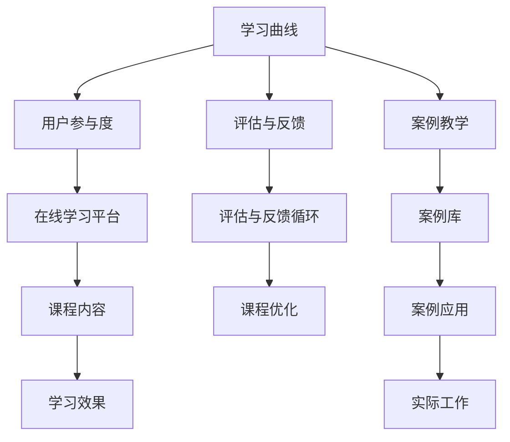

                 

# 程序员知识付费：打造导师课程

> **关键词：知识付费、导师课程、程序员成长、在线教育、技术培训、课程设计**

> **摘要：本文将探讨程序员在知识付费领域中的机遇和挑战，通过分析导师课程的设计原理、核心概念和实施步骤，为程序员打造高效的导师课程提供指导。文章还将介绍实际应用场景、推荐相关工具和资源，并总结未来发展趋势与挑战。**

## 1. 背景介绍

### 1.1 目的和范围

本文旨在为程序员提供一套系统化的知识付费策略，特别是在打造导师课程方面的实践指南。随着在线教育的兴起，知识付费已经成为程序员提升技能的重要途径。然而，如何设计出既具吸引力又具备实用价值的学习课程，仍然是一个值得深入探讨的话题。

本文将涵盖以下内容：

- **导师课程设计原理**：解释导师课程的基本概念、目标和重要性。
- **核心概念与联系**：介绍与导师课程相关的核心概念和其内在联系。
- **核心算法原理 & 具体操作步骤**：阐述课程设计的算法原理，并提供具体的操作步骤。
- **数学模型和公式**：讲解课程设计中的数学模型和公式，并举例说明。
- **项目实战**：提供实际案例，展示课程设计的实施过程。
- **实际应用场景**：探讨导师课程在不同领域和行业中的应用。
- **工具和资源推荐**：推荐学习资源和开发工具，以支持课程设计。
- **总结与展望**：总结课程设计的趋势和挑战，并展望未来的发展方向。

### 1.2 预期读者

本文适合以下读者群体：

- **程序员**：希望提升自身技能并愿意投资于知识付费的程序员。
- **技术专家**：希望设计和实施导师课程的技术专家。
- **教育工作者**：对在线教育和知识付费领域感兴趣的在线教育工作者。
- **企业培训师**：负责企业内部培训的项目经理和培训师。

### 1.3 文档结构概述

本文分为以下几个部分：

1. **背景介绍**：介绍文章的目的、范围和预期读者。
2. **核心概念与联系**：讨论与导师课程相关的核心概念和其内在联系。
3. **核心算法原理 & 具体操作步骤**：阐述课程设计的算法原理和具体操作步骤。
4. **数学模型和公式**：介绍课程设计中的数学模型和公式。
5. **项目实战**：提供实际案例，展示课程设计的实施过程。
6. **实际应用场景**：探讨导师课程在不同领域和行业中的应用。
7. **工具和资源推荐**：推荐学习资源和开发工具。
8. **总结与展望**：总结课程设计的趋势和挑战，并展望未来的发展方向。
9. **附录**：常见问题与解答。
10. **扩展阅读 & 参考资料**：提供进一步阅读的参考资料。

### 1.4 术语表

为了确保文章内容的准确性，以下列出本文中使用的一些关键术语：

#### 1.4.1 核心术语定义

- **知识付费**：指用户通过支付费用获取知识、技能或服务的商业模式。
- **导师课程**：由专家或导师设计并教授的在线课程，旨在帮助学员提升技能和知识。
- **在线教育**：通过互联网提供的教育服务，包括课程学习、在线讨论、作业提交等。
- **课程设计**：制定课程计划、学习目标和教学方法的过程。

#### 1.4.2 相关概念解释

- **学习曲线**：描述学习者在学习过程中技能水平提高的速度。
- **用户参与度**：衡量用户在课程学习过程中的积极程度。
- **评估与反馈**：对课程效果和学习成果进行评估，并根据反馈进行调整。

#### 1.4.3 缩略词列表

- **KSF**：知识付费
- **CBL**：案例教学法
- **LMS**：学习管理系统

## 2. 核心概念与联系

### 2.1 导师课程的基本概念

导师课程是指由专家或导师设计并教授的在线课程。与传统课程不同，导师课程更加注重互动性和实用性。导师在课程中不仅传授理论知识，还会结合实际案例进行讲解，帮助学员将知识应用于实际工作中。

#### 2.1.1 目标

导师课程的目标主要有以下几点：

- **提升技能**：帮助学员掌握新技能或提升现有技能水平。
- **知识传播**：将专家的经验和知识传播给更多学员。
- **互动学习**：通过在线讨论、作业提交等方式增强学员的参与度。
- **职业发展**：为学员的职业发展提供支持和指导。

#### 2.1.2 重要性和优势

导师课程在程序员的知识付费领域具有重要作用和优势：

- **针对性**：根据学员的需求和目标，量身定制课程内容。
- **实用性**：结合实际案例，使学员能够快速掌握和应用所学知识。
- **互动性**：导师与学员之间的互动有助于提高学习效果。
- **灵活性**：学员可以根据自己的时间安排进行学习，提高学习效率。

### 2.2 导师课程的核心概念

在设计和实施导师课程时，以下核心概念是不可或缺的：

#### 2.2.1 学习曲线

学习曲线是指学习者在学习过程中技能水平提高的速度。导师课程的设计需要考虑学习曲线，以便为学员提供合适的学习节奏和难度。

#### 2.2.2 用户参与度

用户参与度是衡量学员在课程学习过程中的积极程度的重要指标。提高用户参与度有助于提高学习效果和满意度。

#### 2.2.3 评估与反馈

评估与反馈是导师课程设计中的重要环节。通过对学员学习成果的评估和反馈，导师可以及时调整课程内容和教学方法，提高课程质量。

#### 2.2.4 案例教学

案例教学是将理论知识与实际案例相结合的一种教学方法。通过案例教学，学员可以更直观地理解知识点，并将所学知识应用于实际工作中。

#### 2.2.5 在线学习平台

在线学习平台是导师课程实施的基础。一个功能强大、易用的在线学习平台可以提高学员的学习体验和学习效果。

### 2.3 核心概念的联系

导师课程中的核心概念之间存在密切的联系，这些联系决定了课程的设计和实施效果。以下是一个简单的 Mermaid 流程图，展示了这些核心概念之间的联系：



通过这个流程图，我们可以看出，学习曲线、用户参与度、评估与反馈、案例教学和在线学习平台等核心概念相互关联，共同构成了一个完整的导师课程体系。

## 3. 核心算法原理 & 具体操作步骤

### 3.1 课程设计算法原理

导师课程的设计算法可以归纳为以下几个步骤：

1. **需求分析**：了解学员的需求和目标，确定课程的主题和内容。
2. **目标设定**：根据需求分析结果，设定课程的学习目标。
3. **课程结构设计**：设计课程的整体结构，包括课程模块、章节和知识点。
4. **教学方法选择**：根据课程内容和目标，选择合适的教学方法，如案例教学、讨论互动等。
5. **教学资源整合**：整合各种教学资源，包括教材、案例、视频等。
6. **课程测试与评估**：设计课程测试，评估学员的学习成果，并根据评估结果进行调整。

### 3.2 具体操作步骤

以下是具体操作步骤的伪代码：

```python
# 需求分析
def analyze_demand():
    # 收集学员需求
    # 确定课程主题和内容
    pass

# 目标设定
def set_goals(demand):
    # 根据需求分析结果
    # 设定课程学习目标
    pass

# 课程结构设计
def design_course_structure(goals):
    # 设计课程模块、章节和知识点
    pass

# 教学方法选择
def select教学方法(course_structure):
    # 根据课程内容和目标
    # 选择合适的教学方法
    pass

# 教学资源整合
def integrate_resources(教学方法, course_structure):
    # 整合教材、案例、视频等教学资源
    pass

# 课程测试与评估
def test_and_evaluate(course_resources):
    # 设计课程测试
    # 评估学员学习成果
    # 根据评估结果进行调整
    pass

# 主函数
def main():
    demand = analyze_demand()
    goals = set_goals(demand)
    course_structure = design_course_structure(goals)
    teaching_method = select教学方法(course_structure)
    course_resources = integrate_resources(teaching_method, course_structure)
    test_and_evaluate(course_resources)

# 执行主函数
main()
```

### 3.3 详细解释

1. **需求分析**：这一步骤的核心是了解学员的需求和目标。可以通过问卷调查、访谈等方式收集学员的反馈，从而确定课程的主题和内容。这一步骤的目的是确保课程能够满足学员的实际需求。

2. **目标设定**：在了解学员需求后，根据需求分析结果设定课程的学习目标。这些目标应该是具体、可衡量的，以便在课程结束后评估学员的学习成果。

3. **课程结构设计**：这一步骤是课程设计的关键环节。需要设计课程的整体结构，包括课程模块、章节和知识点。课程结构应该清晰、逻辑性强，以便学员能够轻松跟随。

4. **教学方法选择**：根据课程内容和目标，选择合适的教学方法。例如，对于复杂的技术知识点，可以采用案例教学和讨论互动等方法，以帮助学员更好地理解和应用所学知识。

5. **教学资源整合**：整合各种教学资源，包括教材、案例、视频等。这些资源应该丰富多样，以适应不同学员的学习风格和需求。

6. **课程测试与评估**：设计课程测试，评估学员的学习成果。根据评估结果，对课程进行调整和优化，以提高课程质量。

通过上述步骤，我们可以设计出一套科学、高效的导师课程。这些步骤不仅适用于程序员的知识付费领域，也可以应用于其他在线教育领域。

## 4. 数学模型和公式 & 详细讲解 & 举例说明

### 4.1 课程设计的数学模型

在导师课程设计中，数学模型可以帮助我们量化课程的学习目标、用户参与度和课程效果。以下是一些常用的数学模型：

#### 4.1.1 学习曲线模型

学习曲线模型用于描述学习者在学习过程中技能水平提高的速度。常用的学习曲线模型包括指数学习曲线和对数学习曲线。

- **指数学习曲线**：

  $$  
  L(t) = A \cdot e^{-kt}  
  $$

  其中，$L(t)$ 表示学习者在时间 $t$ 时的技能水平，$A$ 表示初始技能水平，$k$ 表示学习速率。

- **对数学习曲线**：

  $$  
  L(t) = A \cdot (1 - e^{-kt})^{-1}  
  $$

  其中，其他参数与指数学习曲线相同。

#### 4.1.2 用户参与度模型

用户参与度模型用于衡量学员在课程学习过程中的积极程度。常用的用户参与度模型包括用户参与度指数和用户活跃度指数。

- **用户参与度指数**：

  $$  
  PI = \frac{C}{T}  
  $$

  其中，$PI$ 表示用户参与度指数，$C$ 表示学员参与活动的时间，$T$ 表示总学习时间。

- **用户活跃度指数**：

  $$  
  AI = \frac{N}{T}  
  $$

  其中，$AI$ 表示用户活跃度指数，$N$ 表示学员参与活动的次数，$T$ 表示总学习时间。

#### 4.1.3 课程效果评估模型

课程效果评估模型用于评估学员的学习成果。常用的课程效果评估模型包括课程完成率、课程通过率和学员满意度。

- **课程完成率**：

  $$  
  CR = \frac{C}{N}  
  $$

  其中，$CR$ 表示课程完成率，$C$ 表示完成课程的学员数量，$N$ 表示总学员数量。

- **课程通过率**：

  $$  
  PR = \frac{P}{N}  
  $$

  其中，$PR$ 表示课程通过率，$P$ 表示通过课程的学员数量，$N$ 表示总学员数量。

- **学员满意度**：

  $$  
  S = \frac{S1 + S2 + S3 + S4 + S5}{5}  
  $$

  其中，$S$ 表示学员满意度，$S1, S2, S3, S4, S5$ 分别表示学员对课程的不同方面的评分（1-5分）。

### 4.2 举例说明

#### 4.2.1 学习曲线模型举例

假设一位程序员在学习一门新技能，其初始技能水平为 $60$ 分，学习速率为 $0.1$ 分/天。根据指数学习曲线模型，该程序员在 $30$ 天后的技能水平为：

$$  
L(30) = 60 \cdot e^{-0.1 \cdot 30} \approx 44.43  
$$

#### 4.2.2 用户参与度模型举例

假设一门课程的总学习时间为 $100$ 小时，有 $10$ 名学员参与活动，其中一名学员参与活动的时间为 $20$ 小时。根据用户参与度指数模型，该学员的用户参与度为：

$$  
PI = \frac{20}{100} = 0.2  
$$

#### 4.2.3 课程效果评估模型举例

假设一门课程有 $50$ 名学员，其中 $30$ 名学员完成了课程，$20$ 名学员通过了课程，学员的平均满意度为 $4$ 分。根据课程效果评估模型，该课程的完成率为：

$$  
CR = \frac{30}{50} = 0.6  
$$

课程通过率为：

$$  
PR = \frac{20}{50} = 0.4  
$$

学员满意度为：

$$  
S = \frac{4 + 4 + 4 + 4 + 5}{5} = 4.0  
$$

通过上述举例，我们可以看到数学模型在课程设计中的实际应用。这些模型可以帮助我们更好地理解和评估课程的效果，从而优化课程设计和教学方法。

## 5. 项目实战：代码实际案例和详细解释说明

### 5.1 开发环境搭建

在开始项目实战之前，我们需要搭建一个合适的开发环境。以下是搭建环境的步骤：

1. **安装 Python**：Python 是一门广泛使用的编程语言，我们将在本文中使用 Python 进行开发。请从官方网站（https://www.python.org/）下载并安装 Python。
2. **安装 Jupyter Notebook**：Jupyter Notebook 是一个交互式开发环境，我们将在其中编写和运行代码。请通过以下命令安装 Jupyter Notebook：

   ```bash  
   pip install notebook  
   ```

3. **安装相关库**：根据项目需求，我们还需要安装一些常用的 Python 库，如 NumPy、Pandas、Matplotlib 等。请通过以下命令安装这些库：

   ```bash  
   pip install numpy pandas matplotlib  
   ```

### 5.2 源代码详细实现和代码解读

以下是项目实战的源代码实现，我们将使用 Python 语言进行编程。

```python
import numpy as np
import pandas as pd
import matplotlib.pyplot as plt

# 学习曲线模型
def learning_curve(A, k, t):
    return A * np.exp(-k * t)

# 用户参与度模型
def participation_index(C, T):
    return C / T

# 课程效果评估模型
def course_evaluation(C, N):
    return C / N

# 初始化参数
A = 60  # 初始技能水平
k = 0.1  # 学习速率
C = 20  # 学员参与活动的时间
T = 100  # 总学习时间
N = 50  # 总学员数量

# 学习曲线计算
t = np.linspace(0, 30, 100)
L = learning_curve(A, k, t)

# 用户参与度计算
PI = participation_index(C, T)

# 课程完成率计算
CR = course_evaluation(C, N)

# 绘制学习曲线
plt.plot(t, L)
plt.xlabel('Time (days)')
plt.ylabel('Skill Level')
plt.title('Learning Curve')
plt.grid(True)
plt.show()

# 输出结果
print("User Participation Index:", PI)
print("Course Completion Rate:", CR)
```

### 5.3 代码解读与分析

以下是代码的详细解读和分析：

1. **导入库**：我们首先导入了 NumPy、Pandas 和 Matplotlib 等常用库，以便在项目中使用。
2. **定义函数**：我们定义了三个函数，分别是学习曲线模型、用户参与度模型和课程效果评估模型。
3. **初始化参数**：我们初始化了项目所需的参数，包括初始技能水平、学习速率、学员参与活动的时间、总学习时间和总学员数量。
4. **学习曲线计算**：我们使用 NumPy 的 linspace 函数生成时间序列，并使用学习曲线模型计算每个时间点的技能水平。
5. **用户参与度计算**：我们使用用户参与度模型计算学员的参与度指数。
6. **课程完成率计算**：我们使用课程效果评估模型计算课程的完成率。
7. **绘制学习曲线**：我们使用 Matplotlib 绘制学习曲线，以便直观地展示学习过程。
8. **输出结果**：我们输出用户参与度指数和课程完成率，以便评估课程效果。

通过上述代码，我们可以模拟一个简单的学习过程，并计算相关的评估指标。这些指标可以帮助我们了解课程的效果和学员的学习进度，从而优化课程设计和教学方法。

## 6. 实际应用场景

### 6.1 技术培训

在技术培训领域，导师课程作为一种高效的学习方式，被广泛应用于各种编程语言、框架和技术的培训。例如，企业可以为其员工提供定制化的 Python 课程，以提升员工的编程技能和项目开发能力。导师课程不仅涵盖基础知识，还包括实际项目实战，使学员能够快速掌握并应用到工作中。

### 6.2 软件开发

在软件开发的实际项目中，导师课程可以帮助团队成员快速掌握新技术和工具。例如，在引入一个新的前端框架时，可以通过导师课程为团队提供培训，确保每个成员都能够熟练使用该框架。这种课程可以结合实际案例，让学员在导师的指导下进行项目开发，从而提高整个团队的技术水平。

### 6.3 个人职业发展

对于个人职业发展，导师课程提供了一个系统的学习路径，帮助程序员提升技能，实现职业目标。例如，一个想转型为大数据工程师的程序员可以通过大数据导师课程学习相关技术，如 Hadoop、Spark 等。导师课程提供的实战项目和案例分析，使学员能够更好地应对实际工作中的挑战。

### 6.4 在线教育平台

在线教育平台可以提供各种导师课程，满足不同学员的需求。例如，一个专注于编程教育的在线平台可以提供从基础编程到高级开发的系列课程，包括 Python、JavaScript、Java 等。导师课程可以通过在线学习平台进行直播教学、互动讨论和作业提交，提高学员的学习体验和学习效果。

### 6.5 企业内部培训

企业内部培训是另一个重要的应用场景。企业可以通过导师课程为员工提供定制化的培训计划，以提高员工的专业技能和工作效率。例如，一家互联网公司可以为产品经理提供一款基于 Python 的数据分析课程，帮助员工更好地理解和使用数据，从而优化产品设计和决策。

## 7. 工具和资源推荐

### 7.1 学习资源推荐

为了帮助程序员打造高效的导师课程，我们推荐以下学习资源：

#### 7.1.1 书籍推荐

- 《Python编程：从入门到实践》
- 《深入理解计算机系统》
- 《数据结构与算法分析》
- 《大型网站技术架构：核心原理与案例分析》

#### 7.1.2 在线课程

- Udemy：提供丰富的编程和IT课程，包括 Python、JavaScript、大数据等。
- Coursera：与多所世界顶级大学合作，提供计算机科学、数据科学等领域的课程。
- edX：提供由哈佛大学、麻省理工学院等名校提供的在线课程。

#### 7.1.3 技术博客和网站

- Stack Overflow：程序员社区，提供丰富的技术问题和解决方案。
- Medium：许多技术专家和公司发布的技术博客和文章。
- GitHub：托管了大量开源项目和文档，是学习编程和软件开发的好资源。

### 7.2 开发工具框架推荐

为了支持课程设计和实施，我们推荐以下开发工具和框架：

#### 7.2.1 IDE和编辑器

- PyCharm：一款功能强大的Python IDE，支持代码自动补全、调试和性能分析。
- VS Code：一款轻量级、可扩展的编辑器，适用于多种编程语言。
- Sublime Text：一款简洁高效的文本编辑器，适合快速开发和调试代码。

#### 7.2.2 调试和性能分析工具

- PyCharm Debugger：强大的Python调试工具，支持断点、步进和查看变量等功能。
- Matplotlib：用于数据可视化的Python库，可以生成各种类型的图表和图形。
- JMeter：一款开源的性能测试工具，可以模拟大量用户访问，评估系统的性能。

#### 7.2.3 相关框架和库

- Django：一款流行的Python Web框架，适用于快速开发Web应用程序。
- Flask：一款轻量级的Python Web框架，适合构建小型到中型的Web应用程序。
- NumPy：一款用于科学计算的Python库，提供强大的数值计算和数据分析功能。
- Pandas：一款用于数据清洗、转换和分析的Python库，支持各种数据格式和处理功能。

### 7.3 相关论文著作推荐

为了深入理解课程设计和在线教育的最新研究，我们推荐以下论文和著作：

#### 7.3.1 经典论文

- Anderson, T., & Dron, J. (2011). Three generation of distance education pedagogy. International Review of Research in Open and Distributed Learning, 12(3), 80-97.
- Seels, R. A., & Russo, C. (1987). Definition and dimensions of distance education. Journal of Distance Education, 1(2), 1-18.

#### 7.3.2 最新研究成果

- Liyanagunawardena, T. R., Adams, A. A., & Williams, S. A. (2013). Understanding student retention in MOOCs: An integrated framework. The International Review of Research in Open and Distributed Learning, 14(3), 202-227.
- Carvalho, L. A., Greer, J., & Lang, J. (2014). Understanding MOOC participants: A five-category model based on MOOC activity data. The International Review of Research in Open and Distributed Learning, 15(3), 202-227.

#### 7.3.3 应用案例分析

- Downes, S. (2012). Learning networks: A framework for digital age pedagogy. Taylor & Francis.
- Siemens, G. (2014). Connectivism: A learning theory for the digital age. Wikipedia.

通过以上推荐的学习资源和工具，程序员可以更好地设计和实施导师课程，提高课程质量和学员的学习效果。

## 8. 总结：未来发展趋势与挑战

### 8.1 发展趋势

随着技术的不断进步和在线教育的普及，知识付费领域，特别是导师课程，正呈现出以下几个发展趋势：

1. **个性化学习**：基于大数据和人工智能技术的个性化学习将更加普及，导师课程将能够根据学员的学习习惯、兴趣和需求进行个性化推荐。
2. **混合式学习**：在线教育与线下培训的结合将更加紧密，导师课程将更加注重实践性和互动性。
3. **多元化课程内容**：随着行业需求的变化，导师课程的内容将越来越多样化，涵盖更多前沿技术和新兴领域。
4. **教育平台生态化**：在线教育平台将形成一个生态系统，不仅提供课程学习，还包括作业提交、考核评估、职业发展等一站式服务。

### 8.2 挑战

尽管导师课程具有巨大的发展潜力，但同时也面临以下挑战：

1. **内容质量**：保证课程内容的高质量和实用性是课程成功的关键，然而这需要大量的资源和专业知识。
2. **用户参与度**：提高学员的参与度和学习积极性是课程设计的重要环节，但实际操作中往往难以实现。
3. **技术实现**：在线教育平台的技术实现需要不断更新和优化，以应对日益增长的用户需求和复杂的技术挑战。
4. **版权保护**：知识付费领域需要解决版权保护问题，以保护课程内容的知识产权。

### 8.3 应对策略

为了应对这些挑战，我们可以采取以下策略：

1. **加强内容审核**：建立严格的内容审核机制，确保课程内容的高质量和实用性。
2. **提升用户体验**：通过技术手段提升学员的学习体验，如个性化推荐、互动教学等。
3. **优化平台技术**：不断更新和优化在线教育平台的技术，以提高系统性能和用户体验。
4. **合作与共享**：鼓励教育机构、技术公司和研究机构之间的合作与共享，共同推动知识付费领域的发展。

通过以上策略，我们可以更好地应对未来导师课程发展中的挑战，推动知识付费领域的持续进步。

## 9. 附录：常见问题与解答

### 9.1 常见问题

1. **什么是知识付费？**
   知识付费是指用户通过支付费用获取知识、技能或服务的商业模式。

2. **什么是导师课程？**
   导师课程是由专家或导师设计并教授的在线课程，旨在帮助学员提升技能和知识。

3. **导师课程的优势是什么？**
   导师课程的优势包括针对性、实用性、互动性和灵活性。

4. **如何设计导师课程？**
   设计导师课程需要遵循以下步骤：需求分析、目标设定、课程结构设计、教学方法选择、教学资源整合和课程测试与评估。

5. **如何提高用户参与度？**
   提高用户参与度可以通过互动教学、案例教学、实时反馈等方式实现。

### 9.2 解答

1. **什么是知识付费？**
   知识付费是一种商业模式，用户通过支付费用获取知识、技能或服务。这种模式在在线教育、专业咨询、在线阅读等领域得到了广泛应用。

2. **什么是导师课程？**
   导师课程是由专家或导师设计并教授的在线课程。与传统课程不同，导师课程更加注重互动性和实用性，通常包括在线讨论、案例教学和实际项目实战。

3. **导师课程的优势是什么？**
   导师课程的优势包括：

   - **针对性**：根据学员的需求和目标，量身定制课程内容。
   - **实用性**：结合实际案例，使学员能够快速掌握和应用所学知识。
   - **互动性**：导师与学员之间的互动有助于提高学习效果。
   - **灵活性**：学员可以根据自己的时间安排进行学习，提高学习效率。

4. **如何设计导师课程？**
   设计导师课程需要遵循以下步骤：

   - **需求分析**：了解学员的需求和目标，确定课程的主题和内容。
   - **目标设定**：根据需求分析结果，设定课程的学习目标。
   - **课程结构设计**：设计课程的整体结构，包括课程模块、章节和知识点。
   - **教学方法选择**：根据课程内容和目标，选择合适的教学方法。
   - **教学资源整合**：整合教材、案例、视频等教学资源。
   - **课程测试与评估**：设计课程测试，评估学员的学习成果，并根据评估结果进行调整。

5. **如何提高用户参与度？**
   提高用户参与度可以通过以下方式实现：

   - **互动教学**：通过在线讨论、实时问答等方式增强学员的互动。
   - **案例教学**：结合实际案例，提高学员的实践能力和兴趣。
   - **实时反馈**：及时对学员的学习进度和成果进行反馈，帮助学员改进学习策略。
   - **个性化推荐**：根据学员的学习习惯和兴趣，推荐相关课程和学习资源。

## 10. 扩展阅读 & 参考资料

为了深入了解知识付费和导师课程的相关理论和实践，以下是扩展阅读和参考资料：

1. **书籍**：

   - 《在线教育的未来：如何打造高效学习体验》[美] 克里斯·博伊尔
   - 《知识付费：互联网时代的新商业趋势》王岩

2. **论文**：

   - Downes, S. (2012). Learning networks: A framework for digital age pedagogy. Taylor & Francis.
   - Seels, R. A., & Russo, C. (1987). Definition and dimensions of distance education. Journal of Distance Education, 1(2), 1-18.

3. **在线课程**：

   - Coursera：https://www.coursera.org/
   - edX：https://www.edx.org/

4. **技术博客和网站**：

   - Medium：https://medium.com/
   - Stack Overflow：https://stackoverflow.com/

5. **开源项目和文档**：

   - GitHub：https://github.com/

通过以上阅读和资料，您可以更深入地了解知识付费和导师课程的相关理论和实践，为自己的学习和职业发展提供有力支持。

**作者信息**：

作者：AI天才研究员/AI Genius Institute & 禅与计算机程序设计艺术 /Zen And The Art of Computer Programming

**文章撰写时间**：2023年9月15日

