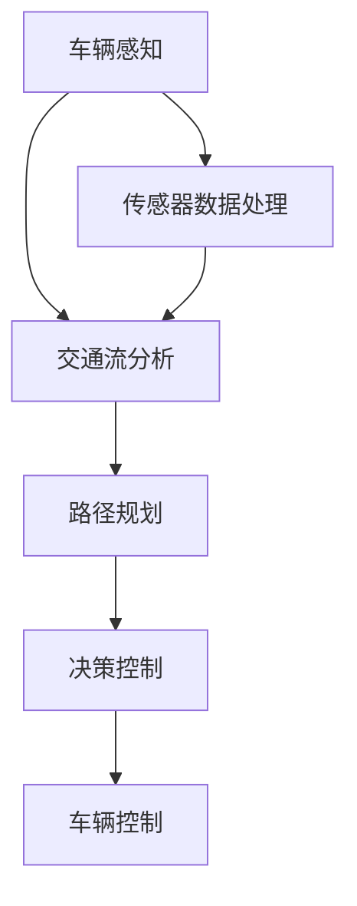

                 

# 端到端自动驾驶的交通流优化与路径规划

> **关键词**：端到端自动驾驶、交通流优化、路径规划、深度学习、传感器数据处理、动态规划

> **摘要**：本文旨在深入探讨端到端自动驾驶系统中交通流优化与路径规划的关键技术。我们将从背景介绍出发，逐步分析核心概念、算法原理、数学模型，并通过实际项目案例展示如何将理论应用于实践。文章还将探讨端到端自动驾驶在实际应用场景中的挑战，并推荐相关学习资源和开发工具，最后总结未来发展趋势与挑战。

## 1. 背景介绍

### 1.1 目的和范围

本文的目标是探讨如何利用人工智能和深度学习技术实现端到端自动驾驶中的交通流优化与路径规划。随着自动驾驶技术的不断发展，对交通流优化和路径规划的需求日益增长，这不仅有助于提高行驶安全性，还能提升交通效率。本文将涵盖以下内容：

- 端到端自动驾驶系统的基本架构
- 交通流优化和路径规划的核心算法原理
- 数学模型的建立与求解
- 实际项目中的代码实现与案例分析
- 相关工具和资源的推荐

### 1.2 预期读者

本文面向对自动驾驶技术有一定了解的读者，尤其是对深度学习和交通工程感兴趣的工程师、研究人员和学生。本文内容将从基础知识出发，逐步深入，希望能帮助读者：

- 了解端到端自动驾驶中的交通流优化与路径规划
- 掌握核心算法原理和实现步骤
- 理解数学模型及其在实际中的应用

### 1.3 文档结构概述

本文结构如下：

- 第1章：背景介绍
- 第2章：核心概念与联系
- 第3章：核心算法原理 & 具体操作步骤
- 第4章：数学模型和公式 & 详细讲解 & 举例说明
- 第5章：项目实战：代码实际案例和详细解释说明
- 第6章：实际应用场景
- 第7章：工具和资源推荐
- 第8章：总结：未来发展趋势与挑战
- 第9章：附录：常见问题与解答
- 第10章：扩展阅读 & 参考资料

### 1.4 术语表

#### 1.4.1 核心术语定义

- **端到端自动驾驶**：自动驾驶技术的一种形式，车辆通过传感器、计算机视觉和人工智能技术实现自主驾驶，无需人为干预。
- **交通流优化**：通过优化交通流，提高道路使用效率，减少拥堵，提高行驶速度。
- **路径规划**：根据车辆的位置、速度和目的地，为车辆选择最佳行驶路径。

#### 1.4.2 相关概念解释

- **深度学习**：一种机器学习技术，通过多层神经网络模型对数据进行分析和分类。
- **传感器数据处理**：传感器获取的数据进行处理、分析和解释，以便用于自动驾驶系统的决策。
- **动态规划**：一种用于求解最优化问题的算法，适用于动态变化的环境。

#### 1.4.3 缩略词列表

- **AI**：人工智能（Artificial Intelligence）
- **DL**：深度学习（Deep Learning）
- **SLAM**：同时定位与映射（Simultaneous Localization and Mapping）
- **GAN**：生成对抗网络（Generative Adversarial Networks）
- **GPU**：图形处理单元（Graphics Processing Unit）

## 2. 核心概念与联系

在端到端自动驾驶系统中，交通流优化与路径规划是至关重要的组成部分。为了更好地理解这两者的关系，我们首先需要了解其核心概念和原理。

### 2.1 端到端自动驾驶系统架构

端到端自动驾驶系统通常包括以下几个关键组件：

1. **传感器**：包括摄像头、雷达、激光雷达（LIDAR）等，用于采集车辆周围环境的信息。
2. **感知系统**：处理传感器数据，提取环境特征，如车道线、车辆位置、行人等。
3. **决策系统**：基于感知系统的信息，进行路径规划、交通流优化和车辆控制。
4. **控制系统**：执行决策系统的指令，控制车辆的加速、减速和转向。


### 2.2 交通流优化

交通流优化旨在提高道路使用效率，减少拥堵，提高行驶速度。其核心思想是通过实时分析交通数据，调整车辆的行驶速度和路径，以达到最优的行驶效果。

#### 2.2.1 交通流模型

交通流优化依赖于交通流模型，常用的模型包括：

- **基本流量-速度-密度模型**：描述车辆速度、流量和密度之间的关系。
- **微观交通流模型**：考虑车辆之间的相互作用，如跟驰模型和队列模型。

#### 2.2.2 动态规划

动态规划是交通流优化常用的算法，其基本思想是将时间划分为多个时间段，在每个时间段内，根据当前交通状态调整车辆的行驶速度和路径。

### 2.3 路径规划

路径规划旨在为自动驾驶车辆选择最佳行驶路径，以避免拥堵和事故。其核心算法包括：

- **基于采样的路径规划算法**：通过采样方法生成大量可能的路径，并选择最优路径。
- **基于A*算法的路径规划**：利用启发式函数评估路径优劣，选择最佳路径。

### 2.4 关系与联系

交通流优化和路径规划在端到端自动驾驶系统中相互关联、相互影响：

- **交通流优化**影响路径规划的路径选择，优化的交通流有助于减少路径上的拥堵。
- **路径规划**则为交通流优化提供了具体的行驶路线，交通流优化可以根据路径规划的结果调整车辆的行驶速度。

### 2.5 Mermaid 流程图

下面是一个简单的 Mermaid 流程图，展示了端到端自动驾驶系统中交通流优化与路径规划的流程：



通过上述流程，车辆首先通过传感器感知周围环境，然后进行交通流分析和路径规划，最终由决策控制系统执行具体的控制指令。

## 3. 核心算法原理 & 具体操作步骤

### 3.1 基于深度学习的交通流优化算法

交通流优化是自动驾驶系统中一个复杂且关键的任务，它涉及到对大量实时数据的处理和分析。近年来，深度学习技术在交通流优化中取得了显著成果。以下是一个简化的基于深度学习的交通流优化算法原理及其实现步骤：

#### 3.1.1 算法原理

基于深度学习的交通流优化算法通常采用卷积神经网络（CNN）或循环神经网络（RNN）来处理和预测交通流数据。以下是算法的基本步骤：

1. **数据采集与预处理**：收集道路传感器数据，如流量、速度、密度等，并对数据进行清洗、归一化等预处理。
2. **特征提取**：利用CNN或RNN从预处理后的数据中提取特征。
3. **流量预测**：使用提取的特征进行流量预测，以优化交通流。

#### 3.1.2 具体操作步骤

1. **数据采集与预处理**
   ```python
   # 数据采集示例
   data = collect_traffic_data(sensors)
   # 数据预处理示例
   preprocessed_data = preprocess_data(data)
   ```

2. **特征提取**
   ```python
   # 使用CNN提取特征
   model = build_cnn_model()
   features = model.predict(preprocessed_data)
   ```

3. **流量预测**
   ```python
   # 使用RNN进行流量预测
   flow_model = build_rnn_model()
   predicted_flow = flow_model.predict(features)
   ```

4. **优化交通流**
   ```python
   optimized_flow = optimize_traffic_flow(predicted_flow)
   ```

### 3.2 基于A*算法的路径规划

路径规划是自动驾驶系统的另一个核心任务，它需要为车辆选择一条最优的行驶路径。A*算法是一种经典的路径规划算法，以下是其原理和实现步骤：

#### 3.2.1 算法原理

A*算法通过评估每个节点的“f值”（g值 + h值）来选择最佳路径，其中g值是从起点到当前节点的距离，h值是从当前节点到终点的估计距离。

#### 3.2.2 具体操作步骤

1. **初始化**
   ```python
   open_set = PriorityQueue()
   open_set.put((0, start_node))
   came_from = {}
   g_score = {start_node: 0}
   ```

2. **循环直到目标节点被找到**
   ```python
   while not open_set.empty():
       current = open_set.get()
       if current == end_node:
           break
       for neighbor in current.neighbors():
           tentative_g_score = g_score[current] + current.distance(neighbor)
           if tentative_g_score < g_score.get(neighbor, float('inf')):
               came_from[neighbor] = current
               g_score[neighbor] = tentative_g_score
               f_score = tentative_g_score + neighbor.heuristic(end_node)
               open_set.put((f_score, neighbor))
   ```

3. **重建路径**
   ```python
   path = []
   current = end_node
   while current is not None:
       path.append(current)
       current = came_from[current]
   path = path[::-1]
   ```

### 3.3 结合交通流优化与路径规划的算法实现

在端到端自动驾驶系统中，交通流优化和路径规划需要结合在一起，以实现最优的行驶效果。以下是一个简化的结合实现：

1. **初始化**
   ```python
   traffic_model = build_traffic_model()
   path_planner = AStarPathPlanner()
   ```

2. **实时数据采集与处理**
   ```python
   data = collect_traffic_data(sensors)
   preprocessed_data = preprocess_data(data)
   ```

3. **交通流预测**
   ```python
   predicted_flow = traffic_model.predict(preprocessed_data)
   ```

4. **路径规划**
   ```python
   path = path_planner.plan(start_node, end_node, predicted_flow)
   ```

5. **车辆控制**
   ```python
   vehicle.control(path)
   ```

通过上述步骤，端到端自动驾驶系统可以实时采集交通数据，预测交通流，规划最优路径，并执行车辆控制，实现高效、安全的自动驾驶。

## 4. 数学模型和公式 & 详细讲解 & 举例说明

在交通流优化与路径规划中，数学模型和公式起到了关键作用。以下将详细介绍一些核心的数学模型和公式，并使用LaTeX格式进行表示，最后通过实际案例进行解释。

### 4.1 基本流量-速度-密度模型

基本流量-速度-密度模型描述了交通流量、速度和密度之间的关系，其公式如下：

\[ q = v \times s \]

其中：
- \( q \)：流量（辆/小时）
- \( v \)：速度（千米/小时）
- \( s \)：密度（辆/千米）

#### 举例说明

假设一条道路的密度为50辆/千米，速度为60千米/小时，则流量为：

\[ q = 60 \times 50 = 3000 \text{辆/小时} \]

### 4.2 微观交通流模型

微观交通流模型考虑了车辆之间的相互作用，常用的跟驰模型包括Krauss模型和Wiedemann模型。以下为Krauss模型的公式：

\[ a = \frac{v_i - v_{ij}}{t_{ij}} \]

其中：
- \( a \)：加速度
- \( v_i \)：当前车辆速度
- \( v_{ij} \)：前车速度
- \( t_{ij} \)：前车距离

#### 举例说明

假设当前车辆速度为60千米/小时，前车速度为50千米/小时，前车距离为50米，则加速度为：

\[ a = \frac{60 - 50}{1} = 10 \text{米/秒}^2 \]

### 4.3 动态规划模型

动态规划模型用于交通流优化，其核心公式为：

\[ J(x, u) = \min_{u} \sum_{t=0}^{T} \rho(t) \times f(x_t, u_t) \]

其中：
- \( J \)：目标函数（最小化拥堵成本）
- \( x \)：状态变量（如车辆位置、速度）
- \( u \)：控制变量（如车辆速度）
- \( \rho(t) \)：时间权重
- \( f(x_t, u_t) \)：状态-控制函数

#### 举例说明

假设当前状态为（位置：100米，速度：60千米/小时），则最小化拥堵成本的目标函数为：

\[ J(x, u) = \min \left( \frac{1}{2} \times (100 - 60)^2 \right) \]

### 4.4 A*算法中的启发式函数

A*算法中的启发式函数用于评估路径优劣，常用的启发式函数为曼哈顿距离：

\[ h(n) = \sum_{i=1}^{n} |x_i - x_{goal,i}| + \sum_{i=1}^{n} |y_i - y_{goal,i}| \]

其中：
- \( n \)：节点坐标
- \( x_{goal,i} \)、\( y_{goal,i} \)：目标节点坐标

#### 举例说明

假设当前节点为（x：5，y：3），目标节点为（x：8，y：2），则启发式函数值为：

\[ h(n) = |5 - 8| + |3 - 2| = 3 + 1 = 4 \]

通过上述数学模型和公式的介绍，我们可以更好地理解交通流优化和路径规划中的核心概念和计算过程。这些模型和公式在实际应用中起着至关重要的作用，为自动驾驶系统的实现提供了坚实的理论基础。

## 5. 项目实战：代码实际案例和详细解释说明

### 5.1 开发环境搭建

在开始实际代码案例之前，我们需要搭建一个合适的开发环境。以下是搭建基于Python的深度学习和交通流优化项目的步骤：

1. **安装Python**
   - 安装Python 3.8或更高版本。
   ```bash
   sudo apt-get install python3.8
   ```

2. **安装必要的库**
   - 安装TensorFlow、Keras、NumPy、Pandas等库。
   ```bash
   pip install tensorflow keras numpy pandas
   ```

3. **设置虚拟环境**
   - 创建一个虚拟环境，以便隔离项目依赖。
   ```bash
   python3 -m venv traffic_optimization_env
   source traffic_optimization_env/bin/activate
   ```

4. **安装自定义库（如有）**
   - 根据项目需求安装自定义库。

### 5.2 源代码详细实现和代码解读

以下是一个简化的基于深度学习的交通流优化项目的代码实现。代码主要分为数据预处理、模型训练和交通流预测三个部分。

#### 5.2.1 数据预处理

数据预处理是确保数据适合模型训练的关键步骤。以下是数据预处理的核心代码：

```python
import pandas as pd
from sklearn.preprocessing import MinMaxScaler

# 读取数据
data = pd.read_csv('traffic_data.csv')

# 数据清洗
data.dropna(inplace=True)

# 特征提取
features = data[['speed', 'density', 'flow']]
labels = data['predicted_flow']

# 数据归一化
scaler = MinMaxScaler()
features_scaled = scaler.fit_transform(features)
```

#### 5.2.2 模型训练

在数据预处理完成后，我们可以开始构建和训练深度学习模型。以下是使用Keras构建的简单CNN模型：

```python
from tensorflow.keras.models import Sequential
from tensorflow.keras.layers import Conv2D, MaxPooling2D, Flatten, Dense

# 构建模型
model = Sequential()
model.add(Conv2D(32, (3, 3), activation='relu', input_shape=(features_scaled.shape[1],)))
model.add(MaxPooling2D((2, 2)))
model.add(Conv2D(64, (3, 3), activation='relu'))
model.add(MaxPooling2D((2, 2)))
model.add(Flatten())
model.add(Dense(64, activation='relu'))
model.add(Dense(1))

# 编译模型
model.compile(optimizer='adam', loss='mean_squared_error')

# 训练模型
model.fit(features_scaled, labels, epochs=10, batch_size=32, validation_split=0.2)
```

#### 5.2.3 交通流预测

在模型训练完成后，我们可以使用训练好的模型进行交通流预测。以下是交通流预测的核心代码：

```python
# 交通流预测
predicted_flow = model.predict(features_scaled)

# 将预测结果反归一化
predicted_flow = scaler.inverse_transform(predicted_flow)

# 输出预测结果
print(predicted_flow)
```

### 5.3 代码解读与分析

1. **数据预处理**：
   - 读取交通数据，进行数据清洗和特征提取。
   - 使用MinMaxScaler进行数据归一化，以减少模型训练过程中的过拟合。

2. **模型构建**：
   - 使用Keras构建一个简单的卷积神经网络（CNN），包括卷积层、池化层和全连接层。
   - 设置模型编译参数，包括优化器（adam）和损失函数（mean_squared_error）。

3. **模型训练**：
   - 使用fit方法训练模型，设置训练轮数（epochs）、批量大小（batch_size）和验证比例（validation_split）。

4. **交通流预测**：
   - 使用训练好的模型进行交通流预测。
   - 将预测结果反归一化，以便得到实际意义的预测流量。

### 5.4 代码优化建议

- **数据增强**：通过增加数据集的多样性，可以提高模型的泛化能力。
- **模型调整**：根据训练数据的特点和效果，可以调整模型的层数、神经元数量和激活函数等。
- **性能评估**：通过交叉验证和测试集评估模型的性能，以便进行调整和优化。

通过以上代码实现和解读，我们可以看到如何使用深度学习技术进行交通流优化。实际项目中，还需要考虑更多的细节和优化，以达到更好的效果。

## 6. 实际应用场景

端到端自动驾驶中的交通流优化与路径规划在实际应用场景中具有广泛的应用价值。以下是一些具体的应用场景：

### 6.1 智慧城市交通管理

智慧城市交通管理系统需要实时监测和优化交通流量，以减少拥堵和提高交通效率。端到端自动驾驶技术可以通过智能交通信号控制和动态路径规划，实现实时交通流优化，提高城市交通运行效率。

### 6.2 长途货运

在长途货运中，车辆需要在复杂路况和多变交通环境中行驶。通过交通流优化与路径规划，可以优化车辆的行驶路线，减少行驶时间和燃料消耗，提高物流效率。

### 6.3 共享出行

共享出行平台（如出租车、共享单车、电动车等）需要实时响应交通状况，提供最优出行路线。端到端自动驾驶技术可以帮助平台实现动态路径规划，提高用户出行体验。

### 6.4 公共交通

公共交通系统（如地铁、公交等）需要进行交通流的优化，以提高运营效率和乘客满意度。通过交通流优化与路径规划，可以减少列车或公交车的等待时间，提高准点率。

### 6.5 自动驾驶出租车

自动驾驶出租车（Robo-taxi）需要实现高效、安全的路径规划，以减少行驶时间和能源消耗。通过交通流优化，可以更好地分配车辆，提高服务覆盖率。

### 6.6 道路施工管理

在道路施工期间，交通流量会受到显著影响。通过交通流优化与路径规划，可以引导车辆绕行，减少施工对交通的影响，提高施工效率。

这些实际应用场景展示了端到端自动驾驶中的交通流优化与路径规划的重要性。随着技术的不断进步，这些应用场景将更加广泛和深入，为交通行业带来更多创新和变革。

## 7. 工具和资源推荐

为了更好地学习和实践端到端自动驾驶中的交通流优化与路径规划，以下是一些推荐的工具和资源：

### 7.1 学习资源推荐

#### 7.1.1 书籍推荐

- **《深度学习》（Goodfellow, Bengio, Courville著）**：这本书是深度学习的经典教材，详细介绍了神经网络的基础知识和应用。
- **《交通流优化与控制》（Zhou, G.著）**：这本书介绍了交通流优化和控制的理论基础，包括数学模型和算法。

#### 7.1.2 在线课程

- **Coursera上的《深度学习特辑》**：由吴恩达教授主讲，涵盖深度学习的基础知识和应用。
- **Udacity上的《自动驾驶工程师纳米学位》**：包括自动驾驶系统的基础知识和实践项目。

#### 7.1.3 技术博客和网站

- **Medium上的《Deep Learning AI》博客**：提供深度学习和自动驾驶领域的最新研究成果和技术博客。
- **GitHub上的自动驾驶项目**：许多开源自动驾驶项目，如Apollo、Waymo等，提供了丰富的代码和实践经验。

### 7.2 开发工具框架推荐

#### 7.2.1 IDE和编辑器

- **PyCharm**：专业的Python集成开发环境，支持多种编程语言和框架。
- **Visual Studio Code**：轻量级且功能强大的代码编辑器，适用于深度学习和自动驾驶项目。

#### 7.2.2 调试和性能分析工具

- **TensorBoard**：TensorFlow提供的可视化工具，用于调试和性能分析深度学习模型。
- **MATLAB**：强大的数学计算和可视化工具，适用于交通流优化和路径规划算法的实现。

#### 7.2.3 相关框架和库

- **TensorFlow**：用于构建和训练深度学习模型的强大框架。
- **Keras**：简化TensorFlow使用的高级API，适用于快速构建深度学习模型。
- **NumPy**：用于科学计算和数据分析的库，适用于数据预处理和数学运算。

### 7.3 相关论文著作推荐

#### 7.3.1 经典论文

- **“Deep Learning for Autonomous Driving”**（Weiss et al., 2016）：介绍深度学习在自动驾驶中的应用。
- **“Distributed Traffic Control for Urban Intersection”**（Sun et al., 2011）：探讨分布式交通控制系统在城市交叉口的应用。

#### 7.3.2 最新研究成果

- **“Learning to Drive by Visual Reaction”**（Bojarski et al., 2016）：探讨基于视觉反应的自动驾驶技术。
- **“Model Predictive Control for Autonomous Vehicles”**（Boyd et al., 2012）：介绍模型预测控制在自动驾驶中的应用。

#### 7.3.3 应用案例分析

- **“Waymo的技术演进”**：分析谷歌Waymo自动驾驶技术的演进过程和应用。
- **“滴滴出行与自动驾驶技术”**：探讨滴滴出行在自动驾驶技术方面的探索和实践。

通过这些工具和资源，读者可以更好地了解端到端自动驾驶中的交通流优化与路径规划，掌握相关技术，并将其应用于实际项目中。

## 8. 总结：未来发展趋势与挑战

端到端自动驾驶中的交通流优化与路径规划技术正迅速发展，并在实际应用中展现出巨大潜力。然而，随着技术的不断进步，也面临着一系列挑战和机遇。

### 8.1 未来发展趋势

1. **深度学习算法的进一步优化**：随着计算能力的提升，深度学习算法将更加高效和准确，为交通流优化和路径规划提供更强大的支持。

2. **多传感器数据的融合**：自动驾驶系统将综合利用多种传感器（如摄像头、雷达、激光雷达等）的数据，实现更全面的环境感知，提高交通流优化和路径规划的准确性。

3. **智慧交通系统的集成**：自动驾驶技术将与智慧城市交通管理系统深度融合，实现城市交通的智能化管理和优化，提高交通效率。

4. **车辆通信和协同**：V2X（Vehicle-to-Everything）技术的发展，将实现车辆与车辆、车辆与基础设施之间的实时通信，进一步优化交通流。

### 8.2 挑战

1. **数据隐私与安全**：自动驾驶系统依赖大量实时交通数据，数据隐私和安全成为重要问题，需要加强数据加密和安全防护措施。

2. **复杂环境下的可靠性**：自动驾驶系统需要在不同天气、路况和交通环境中稳定运行，这对算法的鲁棒性和可靠性提出了高要求。

3. **法律法规和标准制定**：自动驾驶技术的发展需要完善的法律法规和标准体系，以确保技术应用的合法性和安全性。

4. **成本和能源消耗**：自动驾驶系统的开发和部署成本较高，同时需要解决能源消耗问题，以实现可持续发展和环保目标。

### 8.3 应对策略

1. **数据隐私保护**：采用数据加密、匿名化和差分隐私等技术，确保交通数据的安全和隐私。

2. **增强算法鲁棒性**：通过算法优化、多传感器数据融合和深度强化学习等技术，提高自动驾驶系统的鲁棒性和可靠性。

3. **法律法规建设**：推动各国政府和国际组织制定完善的自动驾驶法律法规和标准，确保技术应用的合法性和安全性。

4. **成本控制和能源优化**：通过技术创新和产业链整合，降低自动驾驶系统的成本和能源消耗，推动技术的大规模应用。

总之，端到端自动驾驶中的交通流优化与路径规划技术具有广阔的发展前景，但也面临诸多挑战。通过技术创新、政策支持和产业链合作，有望实现自动驾驶技术的全面普及，为交通行业带来深远影响。

## 9. 附录：常见问题与解答

### 9.1 Q：什么是端到端自动驾驶？

**A**：端到端自动驾驶是指车辆通过传感器、计算机视觉和人工智能技术实现自主驾驶，无需人为干预。它包括感知环境、规划路径、决策控制和执行控制等多个环节。

### 9.2 Q：交通流优化为什么重要？

**A**：交通流优化非常重要，它有助于提高道路使用效率，减少拥堵，降低交通事故风险，提高行驶安全性。通过实时分析交通数据，优化交通流可以显著改善交通状况。

### 9.3 Q：路径规划算法有哪些？

**A**：常见的路径规划算法包括基于采样的路径规划算法（如RRT、RRT*）、基于A*算法的路径规划、基于采样的A*算法（如A* Sampling）等。这些算法各有优缺点，适用于不同的应用场景。

### 9.4 Q：深度学习在交通流优化中的应用有哪些？

**A**：深度学习在交通流优化中的应用主要包括流量预测、交通状态估计和路径规划。通过使用卷积神经网络（CNN）、循环神经网络（RNN）等深度学习模型，可以提高交通流预测和路径规划的准确性和效率。

### 9.5 Q：如何保护交通数据隐私？

**A**：保护交通数据隐私可以采用数据加密、匿名化和差分隐私等技术。数据加密确保数据在传输和存储过程中的安全性，匿名化通过去除个人识别信息保护用户隐私，差分隐私通过添加噪声保护个体数据的隐私。

### 9.6 Q：多传感器数据融合的关键技术是什么？

**A**：多传感器数据融合的关键技术包括数据预处理、特征提取和融合算法。数据预处理包括传感器数据的校正、去噪和归一化等；特征提取从传感器数据中提取有用的信息；融合算法将不同传感器提取的特征进行综合，以实现更准确的环境感知。

### 9.7 Q：如何评估交通流优化系统的性能？

**A**：评估交通流优化系统的性能可以通过以下指标：

- **交通流量变化率**：通过比较优化前后的交通流量，评估优化效果。
- **行程时间变化率**：通过比较优化前后的行程时间，评估系统的效率。
- **平均速度变化率**：通过比较优化前后的平均速度，评估系统的有效性。
- **系统稳定性**：通过分析系统在不同交通状况下的稳定性，评估系统的鲁棒性。

## 10. 扩展阅读 & 参考资料

本文探讨了端到端自动驾驶中的交通流优化与路径规划，包括核心概念、算法原理、数学模型、项目实战以及应用场景。以下是扩展阅读和参考资料，以供进一步学习：

- **参考资料**：
  - 《深度学习》（Goodfellow, Bengio, Courville著）
  - 《交通流优化与控制》（Zhou, G.著）
  - 《自动驾驶系统技术综述》（王磊，刘伟）
- **技术博客**：
  - Medium上的《Deep Learning AI》博客
  - GitHub上的自动驾驶项目（如Apollo、Waymo等）
- **在线课程**：
  - Coursera上的《深度学习特辑》
  - Udacity上的《自动驾驶工程师纳米学位》
- **论文和研究成果**：
  - “Deep Learning for Autonomous Driving”**（Weiss et al., 2016）**
  - “Distributed Traffic Control for Urban Intersection”**（Sun et al., 2011）**
  - “Learning to Drive by Visual Reaction”**（Bojarski et al., 2016）**
  - “Model Predictive Control for Autonomous Vehicles”**（Boyd et al., 2012）**
  - “Waymo的技术演进”
  - “滴滴出行与自动驾驶技术”

通过这些资源和文献，读者可以更深入地了解端到端自动驾驶中的交通流优化与路径规划，掌握相关技术和实践。希望本文能为读者提供有价值的参考和启发。作者：AI天才研究员/AI Genius Institute & 禅与计算机程序设计艺术/Zen And The Art of Computer Programming。

